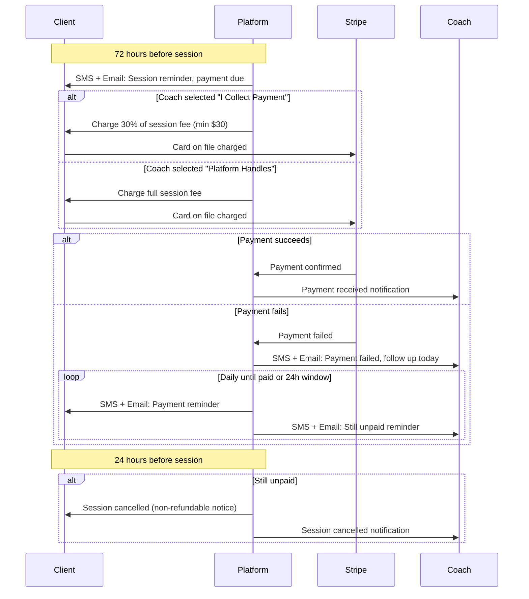
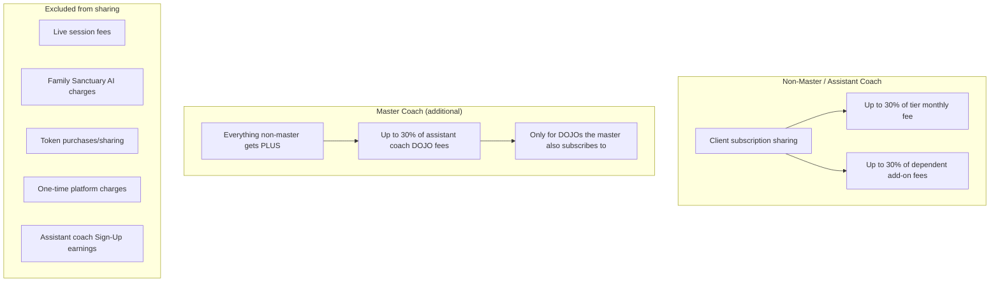
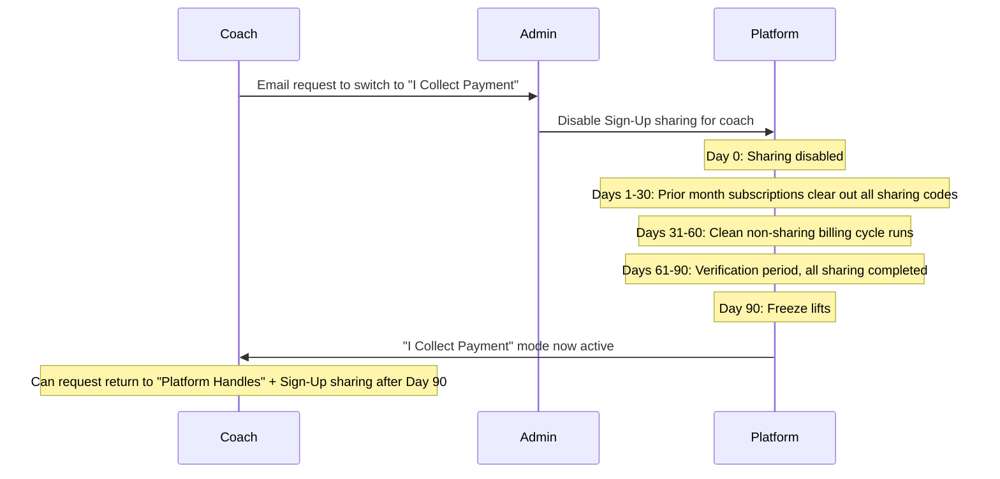
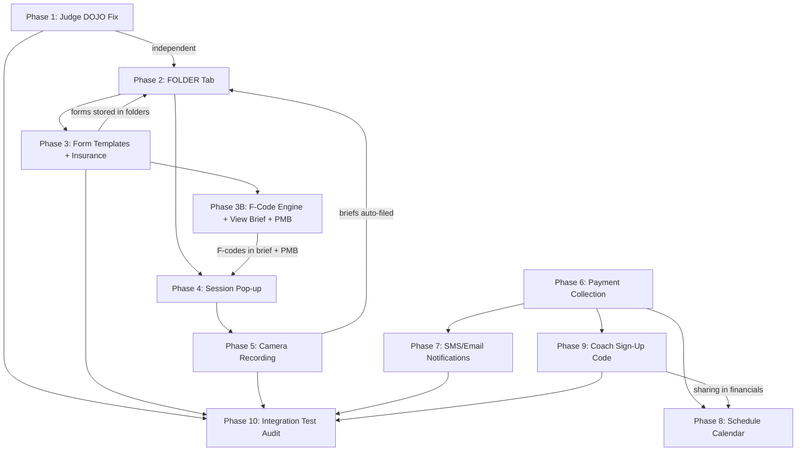

# Coach Portal Enhancement Suite

## Phase 1: Judge DOJO Visibility Fix (Quick Fix)

**Problem**: Judge mode tab is hidden in the Night School Dojo training page even when the coach has an active Judge subscription.

**Root Cause Investigation**: The gating code in `[dashboard/night_school_dojo.html](dashboard/night_school_dojo.html)` (line 1118-1202) reads `data.profile.dojo_subscriptions`, computes active dojos, and hides/shows mode tabs by index. The logic is correct on paper -- the likely cause is one of:

- The coach's `dojo_subscriptions` in PostgreSQL is missing the `judge` entry (data issue)
- The `selected_dojos` list computed by `get_active_dojos()` in `[bridge_server.py](backend/app/websocket/bridge_server.py)` (line 2143) is not including `judge`
- The bridge is sending stale profile data from its in-memory cache

**Fix approach**:

- Query production DB for the affected coach's `dojo_subscriptions` to verify data
- Add console logging to the DOJO HTML page showing what `effectiveDojos` resolves to
- If data is missing, fix the coach's profile directly and investigate why `add_dojo_subscription` failed to persist

---

## Phase 2: FOLDER Tab -- Auto-Populated Folder Hierarchy (New Tab)

**What**: Add a 9th tab "FOLDER" to the coach portal, positioned after FINANCIALS.

**Files to modify**:

- `[mobile/lib/updated_screens.dart](mobile/lib/updated_screens.dart)`: Add tab label, icon, controller length (8 -> 9), tab builder

**Folder hierarchy auto-population**:

- Coach's Personal Folder (by coach hardware_id)
  - Tax forms, GKM donation receipts (populated from `gkm_annual_receipts`)
- Client Folders (by client_id, full name)
  - Session notes, Little Nate briefs, recordings
- Family Folders (by family_id, HoH name)
  - Subfolders: Spouse, each Dependent
- Group Folders (by group_id, group name)
  - Subfolders: each assigned member
- Company Folders (by company_id, company name)
  - Subfolders: employee client_ids (CSV/Excel imported)

**Backend support**:

- New WebSocket handlers: `coach_get_folders`, `coach_get_folder_contents`, `coach_upload_file`, `coach_delete_file`
- New PostgreSQL table: `coach_folders` (id, coach_id, folder_type, parent_id, entity_id, entity_name, created_at)
- New PostgreSQL table: `coach_folder_files` (id, folder_id, filename, file_type, azure_blob_url, uploaded_by, created_at)
- Auto-populate logic runs on coach login (diff against assigned clients, families, groups, companies)

**Relationship to existing BRIEFINGS tab**: The existing BRIEFINGS tab already has folder grouping with `_buildFolderGroups()`. FOLDER would be a separate, file-storage-oriented system (documents, PDFs, uploads) vs BRIEFINGS which is session-focused (coach briefings, CEE data, session notes).

---

## Phase 3: Client Form Templates + Form Creator (PDF/Excel Generation)

### 8 Pre-Built Form Templates

**1. Privacy Policy** -- Data collection/storage practices, Little Nate AI observation disclosure, session recording consent, data retention periods (7-day video, permanent anonymized transcripts), third-party services (Stripe, Twilio, SendGrid, Azure OpenAI), client rights (access, correction, deletion), contact info for privacy questions.

**2. Terms of Service** -- Platform usage rules, subscription tiers and billing terms, session booking/cancellation policy (72h payment, 24h cancel window, non-refundable), coach vs platform liability, token economics terms, prohibited conduct, IP rights, dispute resolution, age requirements (18+, dependents for minors), termination conditions.

**3. Adult Intake Form** -- Full legal name, DOB, preferred name/pronouns, contact info, emergency contact, current living situation, relationship status/family composition, referral source, current concerns (free text), previous therapy/coaching experience, current support system, cultural/spiritual considerations, consent signature with date.

**4. Medications Form** -- Current medications list (name, dosage, frequency, prescriber), OTC supplements, recent changes (last 90 days), allergies/adverse reactions, prescribing physician contact, pharmacy contact, substance use history (type, frequency, amount), authorization to coordinate with prescriber (yes/no + signature).

**5. Prior History Form** -- Mental health history (diagnoses, hospitalizations, SI history), trauma history (general categories, not detailed narrative), family of origin overview, significant life events timeline (losses, moves, career, births), legal history if relevant, medical conditions affecting wellbeing, previous assessments, attachment style self-assessment.

**6. Goals & Current Obstacles Form** -- Top 3 goals (30-day, 90-day, 1-year), current obstacles (internal: anxiety, avoidance, beliefs; external: finances, relationships, work), measurable success criteria per goal, client strengths/resources, previous attempts and outcomes, preferred coaching style, availability/commitment level, support people.

**7. Group Attention Form** -- Member name and group role (couple, family, team), individual goals within group context, boundary/comfort topics, relationship dynamics to address, confidentiality agreement, communication preferences, conflict style self-assessment, emergency contact, consent for group recording and AI observation.

**8. Client Insurance Form** -- Insurance provider name, policy number, group number, subscriber name (if different from client), subscriber DOB, subscriber relationship to client, insurance phone number, claims address, authorization/pre-cert number if required, EAP information if applicable, secondary insurance details, consent to submit F-codes for reimbursement, coach/provider NPI or credential number field, client signature authorizing information release to insurer. This form feeds the F-code engine and superbill generation (existing in `[billing.py](backend/app/routers/billing.py)` line 1289).

### Form Creator (Little Nate + Coach AI Tool)

An AI-powered form builder within the FOLDER tab where the coach describes a custom form and Little Nate generates it:

- Coach types a natural language description (e.g., "Create a couples intake form focused on EFT attachment injuries")
- Little Nate generates a structured form draft via Azure OpenAI with appropriate fields, sections, headers, and instructions
- Visual editor for the coach to reorder sections, add/remove/edit fields, change field types (text, checkbox, dropdown, signature, date)
- Output formats: PDF (for print/email/signature) or Excel (for data tracking/bulk intake)
- Save custom forms as reusable templates in the coach's FOLDER
- Send to clients by individual ID, family_id, group_id, or company_id via email

**Implementation**:

- Store pre-built templates as HTML in `backend/app/templates/forms/`
- Use `reportlab` for PDF generation, `openpyxl` for Excel generation
- New router `backend/app/routers/forms_api.py`:
  - `GET /api/forms/templates` -- list all templates (pre-built + coach custom)
  - `POST /api/forms/generate/{template_id}` -- generate PDF/Excel pre-filled with client data
  - `POST /api/forms/send/{template_id}` -- email form to client(s) by ID
  - `POST /api/forms/send-bulk` -- send to family_id, group_id, or company_id
  - `POST /api/forms/create` -- Little Nate generates custom form from description
  - `PUT /api/forms/{form_id}` -- coach edits/saves custom form
  - `DELETE /api/forms/{form_id}` -- delete custom form
- New PostgreSQL table: `coach_form_templates` (id, coach_id, title, description, form_schema JSON, created_by_ai, created_at, updated_at)
- SendGrid integration for email delivery (already exists via `notification_system`)
- Generated PDFs/Excel stored in Azure Blob Storage with links in `coach_folder_files`
- Flutter UI: Form template browser + Form Creator panel in the FOLDER tab

---

## Phase 3B: F-Code Engine, View Brief + PMB Integration

### F-Code Suggestion Engine (Little Nate)

No F-code/ICD-10-CM infrastructure currently exists. This phase builds it from scratch.

**How it works**: Little Nate analyzes client data at milestone markers (30, 60, 90 days, 6 months, 12+ months) and suggests up to 4 ICD-10-CM F-codes the client may be exhibiting. The certified coach reviews and assigns the actual F-codes (up to 4). Little Nate's suggestions are preserved separately and never overwritten -- they represent the AI's own clinical impression.

**Data sources for F-code suggestion**:

- Nevedal CEE metrics (C_emo, GAP, Quantum scores from `nevedal_metrics`)
- PMB reactivity profile (fight/flight/freeze/fawn indicators from `_extract_legacy_patterns()` in `[bridge_server.py](backend/app/websocket/bridge_server.py)` line 4320)
- Shame profile (shame_index, core_beliefs from PMB)
- Crisis perception baseline (CALIBRATED/MINIMIZER/AMPLIFIER/NORMALIZER)
- Session topics and breakthrough patterns (from `hippocampus`)
- Mood history trends over the milestone window
- Transgenerational legacy patterns (8 categories already tracked)

**Milestone windows**: Little Nate can only generate suggestions after sufficient observation:

- 30 days -- initial impression (minimum data)
- 60 days -- refined with pattern consistency
- 90 days -- strong confidence with behavioral trends
- 6 months -- longitudinal view with legacy pattern cross-validation
- 12+ months -- full clinical picture with transgenerational analysis

**Coach authority**: The coach is the final say. Their assigned F-codes are the ones that appear on superbills and insurance forms. Little Nate's suggestions are labeled "AI Considerations" and remain visible for comparison but do not carry clinical weight.

**Backend implementation**:

- New PostgreSQL table: `client_fcodes` (id, client_id, coach_id, fcode, fcode_description, assigned_at, milestone_window, source: 'coach'|'nate_suggestion', confidence_score, active)
- New service: `backend/app/services/fcode_engine.py` -- Azure OpenAI-powered F-code suggestion with structured ICD-10-CM F00-F99 output
- Reference data: ICD-10-CM F-code lookup table (`fcode_reference`) with code, description, category, common symptoms
- New REST endpoints in `forms_api.py` or new `fcode_api.py`:
  - `GET /api/fcodes/suggestions/{client_id}?window=30` -- Little Nate's suggestions for a milestone
  - `POST /api/fcodes/assign/{client_id}` -- Coach assigns F-codes (up to 4)
  - `GET /api/fcodes/history/{client_id}` -- Full history of assigned + suggested codes
  - `GET /api/fcodes/compare/{client_id}` -- Side-by-side: coach-assigned vs Nate-suggested over time

### View Brief Enhancements

The existing View Brief (`[updated_screens.dart](mobile/lib/updated_screens.dart)` line 5313, handler at `[bridge_server.py](backend/app/websocket/bridge_server.py)` line 12744) currently shows: client name, tier, session count, Nevedal metrics, recent topics, breakthroughs, mood history, and Zoom session data.

**New sections added to View Brief**:

- **Insurance Provider** -- Provider name, policy number, group number (from Client Insurance Form data in `users.profile_data`)
- **F-Code Summary** -- Coach-assigned F-codes (active, up to 4) with descriptions, plus Little Nate's current suggestions labeled "AI Considerations" with confidence scores
- **F-Code Timeline** -- Visual indicator of which milestone windows have been reached (30/60/90d, 6/12mo) and when each code was first suggested or assigned
- **Transgenerational F-Code Correlations** -- If the client has family members on the platform (via `family_id`), Little Nate cross-references legacy patterns to identify F-codes that may have transgenerational roots (e.g., parent exhibits F41.1 generalized anxiety and child shows early F41.9 markers)

**Backend changes to `get_presession_brief` handler**:

- Query `client_fcodes` for active coach-assigned and Nate-suggested codes
- Query `users.profile_data` for insurance fields (from Insurance Form)
- Query family members' `client_fcodes` for transgenerational correlation
- Add `insurance`, `fcodes_assigned`, `fcodes_nate_suggestions`, `fcode_family_correlations` to the brief JSON response

### PMB Reports Integration (Sovereign Command)

The PMB tab in Sovereign Command already tracks legacy patterns (8 categories) and displays them in consultation views. The F-code engine adds a new measurable layer:

**New PMB sub-section: "F-Code Clinical Markers"**:

- Listed alongside existing measurables (crisis perception, shame profile, reactivity, reconsolidation readiness, legacy patterns)
- Shows F-code distribution across: client IDs, family IDs, group IDs
- Transgenerational F-code heatmap: which F-codes appear across family members and whether they correlate with legacy patterns (e.g., `emotional_suppression` legacy pattern correlating with F32.x depressive codes)
- PMB consultation endpoint (`GET /api/reports/pmb/{id}/consultation` in `[pmb_reports_api.py](backend/app/routers/pmb_reports_api.py)`) extended to include `fcode_markers` section

**Dashboard changes**:

- `[dashboard/pmb_reports.html](dashboard/pmb_reports.html)`: New "F-Code Markers" card in the consultation detail view
- `[dashboard/command.html](dashboard/command.html)`: PMB tab gains an F-code distribution summary in the stats overview

**New PMB endpoints**:

- `GET /api/reports/pmb/fcodes/family/{family_id}` -- F-code distribution across a family
- `GET /api/reports/pmb/fcodes/group/{group_id}` -- F-code distribution across a group
- `GET /api/reports/pmb/fcodes/transgenerational/{family_id}` -- Legacy pattern to F-code correlation analysis

---

## Phase 4: Live Session AI Pop-Up Window (Little Nate Session Assistant)

**What**: A draggable floating pop-up window that appears during live coaching sessions, providing client context and AI assistance.

**Pop-up content panels**:

- Client info: Name(s), contact number, medications list
- Session context: Last session(s) summary (500 words max), attachment style, top 1-3 CEEs
- Session goals: Based on top CEEs, suggested EFT prior/focus stages
- PMB report items: Suggested from Little Nate
- Coach notes: Free-text input area
- Little Nate status: Toggle (observing / assisting / off), "Check-in" button

**Little Nate modes**:

- **Toggle ON (Assisting)**: Observing session + provides suggestions when coach clicks "Check-in" (500 words max, open-ended tips only, never directive)
- **Toggle OFF (Observing)**: Watching session silently, no feedback, still learning
- **Grey Button (Completely Off)**: No observation, no recording, no brief generated post-session

**Implementation**:

- New Flutter widget: `SessionAssistantOverlay` -- uses `Overlay` + `Positioned` for draggable floating window
- WebSocket message types: `session_assistant_open`, `session_assistant_checkin`, `session_assistant_nate_toggle`
- Backend handler in `[bridge_server.py](backend/app/websocket/bridge_server.py)`: `session_checkin` -- queries client CEEs, session history, PMB data, generates 500-word AI tip via Azure OpenAI
- Pre-populate client data from existing `coach_get_session_notes` + `nevedal_metrics` + `user profile`

**Data sources for pop-up**:

- Client name, phone, medications: `users.profile_data`
- Last sessions: `sessions` table
- CEE scores: `nevedal_metrics` / `client_metrics`
- Attachment style: `profile_data->>'attachment_style'`
- PMB report: `pmb_reports` table or real-time from `pmb_reports_api.py`

---

## Phase 5: Camera Overlay Recording + Classroom Integration

**What**: Little Nate records the coaching session via camera overlay (when toggled on), auto-uploads to Classroom.

**Technical approach**:

- **Browser (Flutter Web)**: Use `navigator.mediaDevices.getDisplayMedia()` + `MediaRecorder` API to capture screen (Zoom window)
- **Mobile**: Not feasible for screen overlay recording -- use Zoom cloud recording API instead
- Recording stored temporarily as WebM/MP4, uploaded via `POST /api/classroom/upload-video`
- After upload, Azure OpenAI processes transcript
- Video available in Classroom for 7 days, then converted to transcript-only in Azure Blob Storage
- Auto-generated brief uploaded to the client's FOLDER subfolder

**Classroom DOJO-specific feedback**:

- When analyzing a session recording, query the coach's `dojo_subscriptions`
- For each active DOJO, generate targeted feedback based on that DOJO's rubric (already defined in `DOJO_TRAINING_METHODS` in `[coaching_mesh_engine.py](backend/app/services/coaching_mesh_engine.py)`)
- Display feedback grouped by DOJO in the Classroom analysis results

**New backend endpoints**:

- `POST /api/classroom/auto-upload` -- Little Nate auto-uploads recording
- `GET /api/classroom/session/{id}/dojo-feedback` -- DOJO-specific analysis

---

## Phase 6: Payment Collection System (72-Hour Advance)

**What**: Automated payment collection 72 hours before scheduled sessions.

**Payment flow**:

**Implementation**:

- New background agent: `SessionPaymentAgent` (runs every 30 min)
  - Queries sessions in 72-hour window with `payment_status != 'paid'`
  - Creates Stripe PaymentIntent using card on file
  - Sends SMS via Twilio Verify + email via SendGrid
- New columns on `sessions` / `coaching_sessions`: `payment_status`, `payment_amount_cents`, `stripe_payment_intent_id`, `payment_due_at`, `cancellation_deadline`
- FINANCIALS tab `payment_mode` (already exists: "I Collect Payment" vs "Platform Handles") drives the 30% vs 100% logic
- Minimum fee: $30.00 (already defined in `calculate_platform_fee`)

**Migration**: New table columns + `session_payment_events` table for payment attempt history

---

## Phase 7: SMS/Email Session Notifications

**What**: Automated notifications at key session lifecycle points.

**Notification triggers**:

- **48 hours before**: Session reminder to client (SMS + email) with 24-hour cancellation window notice
- **72 hours before**: Payment due notification (covered in Phase 6)
- **Payment failure**: Immediate SMS + email to coach; daily reminders to client
- **24-hour cancellation**: If unpaid, auto-cancel + notify both parties
- **Session confirmed**: Confirmation to both client and coach after payment

**Implementation**:

- Extend `SessionPaymentAgent` from Phase 6 to handle notification scheduling
- Use existing `notification_system` (SendGrid) for emails
- Use existing Twilio Verify integration for SMS
- New `session_notifications` table to track what was sent and prevent duplicates

**Cancellation policy**:

- Within 24 hours of session: non-refundable
- More than 24 hours: full refund if "Platform Handles", coach-managed if "I Collect Payment"

---

## Phase 8: Schedule Tab Calendar Sync + Payment Status

**What**: Enhanced SCHEDULE tab with pre-set availability, email calendar sync, and payment status indicators.

**Features**:

- **Pre-set availability**: Coach defines available time slots (recurring weekly + one-off blocks)
- **Calendar sync**: Two-way sync with Google Calendar or Outlook via CalDAV/Google Calendar API
  - Coach provides preferred email for scheduling
  - Sessions auto-create calendar events
  - External calendar blocks show as unavailable
- **Payment status indicators**: Client cards turn red when payment is overdue (72-hour window lapsed)
- **Calendar view**: Monthly/weekly calendar widget showing all sessions with client IDs

**Implementation**:

- New WebSocket handlers: `coach_set_availability`, `coach_get_availability`, `coach_sync_calendar`
- New table: `coach_availability` (coach_id, day_of_week, start_time, end_time, recurring, specific_date)
- Flutter calendar widget: Use `table_calendar` or `syncfusion_flutter_calendar` package
- Google Calendar integration: OAuth2 flow for calendar access, event creation via Google Calendar API
- Payment status: Query `sessions.payment_status` and color-code in the schedule list

**Flutter UI changes** in `[updated_screens.dart](mobile/lib/updated_screens.dart)`:

- Update `_buildScheduleTab()` to include calendar view and availability editor
- Add red border/background on unpaid session cards
- Add calendar sync settings button

---

## Phase 9: Coach Sign-Up Code Revenue Sharing System

### Overview

A revenue-sharing system where coaches receive a percentage (up to 30%) of their referred clients' monthly subscription fees instead of offering discounts. Admin-managed codes, Stripe-integrated billing splits, and hierarchy-aware DOJO sharing for master coaches.

### How It Works

**Basic flow**: Admin creates a Sign-Up Code for a coach (e.g., `COACHN2026`). The coach gives this code to prospective clients. When a client signs up using the code, the platform shares a percentage of the client's monthly subscription with the coach instead of keeping the full amount.

**What gets shared** (subscription-based recurring charges only):

- Monthly tier subscription fees (STANDARD $49, TOP_TIER $149, TRIAL free -- no sharing)
- Additional dependent monthly charges ($75/mo example)

**What does NOT get shared**:

- Live session fees (30% platform fee or $30 minimum)
- Family Sanctuary AI coaching charges
- Token purchases or token sharing fees
- Any one-time charges or platform service fees

### Sign-Up Code Structure

Each code is:

- **Static per coach** -- one code per coach, does not change
- **Admin-created and admin-adjustable** -- coach cannot modify their own sharing percentage
- **Associated to coach hardware_id** -- links to master or assistant coach
- **Maximum 30% sharing** -- admin sets the agreed percentage (1-30%)
- **Tracked per linked entity** -- client_id, family_id, group_id, or company_id

### Sharing Rules by Coach Role

**Master Coach DOJO sharing example**: Master Coach subscribes to Therapist ($175) and Judge ($2,100). Their assistant coach subscribes to Therapist ($175) and MCAT ($500). The master coach gains sharing only on the assistant's Therapist DOJO ($175 x sharing %), not on MCAT ($500) because the master doesn't subscribe to MCAT.

**Important**: Master coaches do NOT receive a cut of their assistant coaches' Sign-Up Code earnings from clients. They only receive sharing on the assistant coaches' own DOJO subscription fees.

### Payment Mode Lock-In

**Prerequisite**: Coach must be in "Platform Handles" payment mode to participate in Sign-Up sharing. "I Collect Payment" mode is incompatible.

**Mode switch freeze (90-day process)**:

During the 90-day freeze:

- All Sign-Up code sharing for that coach's associated codes stops immediately
- The coach's linked clients continue paying normal subscription rates (no discount was ever applied -- the sharing was internal)
- After 90 days, the coach can request re-enrollment in "Platform Handles" + Sign-Up sharing

### Database Schema

**New tables**:

- `coach_signup_codes` -- One row per coach
  - `id`, `coach_id` (hardware_id), `code` (unique, e.g., "COACHN2026"), `sharing_pct` (1-30), `status` (active/frozen/disabled), `created_by` (admin), `created_at`, `updated_at`, `frozen_at`, `freeze_ends_at`, `max_linked_entities` (nullable, default NULL = unlimited, loophole #12), `monthly_sharing_cap_cents` (nullable, default NULL = unlimited, loophole #12)
- `signup_code_links` -- Links codes to enrolled entities
  - `id`, `code_id` (FK), `entity_type` (client/family/group/company), `entity_id`, `linked_at`, `unlinked_at`, `status` (active/inactive)
  - UNIQUE constraint on `(entity_type, entity_id) WHERE status = 'active'` (loophole #8)
  - CHECK constraint: `entity_type != 'coach'` (loophole #5)
- `signup_sharing_ledger` -- Monthly sharing transaction log
  - `id`, `code_id` (FK), `coach_id`, `entity_id`, `entity_type`, `source_type` (subscription/dependent/dojo), `gross_amount_cents` (actual Stripe-collected amount, NOT list price -- loophole #15), `sharing_pct`, `shared_amount_cents`, `billing_period_start`, `billing_period_end`, `stripe_transfer_id`, `stripe_invoice_id` (verified against Stripe -- loophole #10), `status` (pending/completed/reversed/failed), `source_note` (nullable, e.g. 'free_month_reward' -- loophole #16), `created_at`
- `signup_code_audit_log` -- Admin actions on codes
  - `id`, `code_id`, `admin_id`, `action` (create/adjust_pct/freeze/unfreeze/disable/cap_update), `old_value`, `new_value`, `reason`, `created_at`

### Sovereign Command -- Discount Tab Enhancement

The existing Discount tab (`[dashboard/discounts.html](dashboard/discounts.html)`) currently has 3 sub-tabs: Promo Codes, School Codes, Corporate Sponsors. Add a 4th sub-tab:

**"Coach Sign-Up Codes" sub-tab**:

- Table of all coach codes: coach name, code string, sharing %, status, linked entity count, monthly sharing total
- Create code: select coach (by ID), set sharing % (1-30), generate code
- Adjust code: change sharing % (requires admin, logged to audit)
- Freeze code: initiate 90-day freeze when coach requests payment mode switch
- Linked entities panel: when clicking a code, show all linked clients/families/groups/companies with their subscription plans and monthly sharing amounts
- Monthly summary: total platform revenue shared to coaches via Sign-Up codes

**New REST endpoints** in `[billing.py](backend/app/routers/billing.py)` or new `signup_code_api.py`:

- `POST /api/billing/signup-codes` -- Admin creates code for a coach
- `GET /api/billing/signup-codes` -- List all codes (admin)
- `GET /api/billing/signup-codes/{coach_id}` -- Get coach's code (coach or admin)
- `PUT /api/billing/signup-codes/{code_id}` -- Adjust sharing % (admin only)
- `POST /api/billing/signup-codes/{code_id}/freeze` -- Initiate 90-day freeze (admin)
- `POST /api/billing/signup-codes/{code_id}/unfreeze` -- Re-enable after 90 days (admin)
- `GET /api/billing/signup-codes/{code_id}/links` -- List linked entities
- `POST /api/billing/signup-codes/verify/{code}` -- Verify code during client registration
- `POST /api/billing/signup-codes/apply` -- Link code to entity at signup
- `GET /api/billing/signup-codes/{code_id}/ledger` -- Sharing transaction history

### Sign-Up Code Visibility -- All Platform Locations (8 surfaces)

The Sign-Up code must appear across the platform so coaches, clients, and admin can all see and use it.

**Location 1: Coach FINANCIALS -- "My Coaching Rate" section**

- File: `[updated_screens.dart](mobile/lib/updated_screens.dart)` line 10177
- Currently shows: editable hourly rate + "Update" button
- Add: Sign-Up Code display card directly below the rate -- code string (tap-to-copy), sharing %, status badge (active/frozen/disabled)
- If no code: show "No Sign-Up Code -- Contact admin to request one"

**Location 2: Coach FINANCIALS -- Sharing Earnings section** (new)

- File: `[updated_screens.dart](mobile/lib/updated_screens.dart)` within `_buildFinancialsTab`
- New section below existing earnings YTD/monthly: monthly sharing income by source (client subscriptions, dependent add-ons, master DOJO sharing), linked entities list with plan type + share amount, payment mode freeze countdown if applicable
- $0 months annotated with reason (e.g., "ClientXYZ -- $0 (free month reward)") -- **loophole #16**
- Year-end summary breakdown: session coaching income + Sign-Up sharing income = total annual income, with 1099 threshold indicator -- **loophole #17**

**Location 3: Client Settings -- "ASSIGNED COACH" section**

- File: `[settings_screen.dart](mobile/lib/screens/settings_screen.dart)` line 1903
- Currently shows: coach name, email, specializations, booking button
- Add: Coach's Sign-Up Code displayed read-only below coach info with "Refer a friend with this code" label

**Location 4: Client Settings -- "SHARE" section**

- File: `[settings_screen.dart](mobile/lib/screens/settings_screen.dart)` line 1379
- Currently shows: "Invite a Friend" share link
- Add: If client's coach has a Sign-Up code, include it in the share text (e.g., "Join with Coach [Name] -- use code COACHN2026 at signup")

**Location 5: Client Registration -- new "Coach Code" field**

- File: `[main.dart](mobile/lib/main.dart)` line 7376 (SignUpWizard)
- Currently accepts: `coach_invite_token` from URL, `beta_invite_code`
- Add: optional "Coach Sign-Up Code" text field on the tier selection step
- Resolves the coach and auto-assigns them (replacing default CoachN)
- Priority order: `coach_invite_token` (direct invite) > `signup_code` (referral) > default CoachN

**Location 6: Coach Registration -- "Master Coach Code" field**

- File: `[main.dart](mobile/lib/main.dart)` line 7376 (SignUpWizard, role=COACH)
- Currently accepts: W-9, DOJO selections, beta code
- Add: optional "Master Coach Sign-Up Code" field on the coach details step
- Creates `coach_hierarchy` entry (master from code, assistant from new coach, status "pending")
- This is how assistant coaches link to a master during their own registration

**Location 7: Sovereign Command -- Coach and Client detail views**

- File: `[dashboard/command.html](dashboard/command.html)` (Clients tab)
- Coach profile view: show Sign-Up code, sharing %, linked entity count, total sharing earnings
- Client profile view: show which Sign-Up code was used at registration and the associated coach

**Location 8: Coach BRIEFINGS -- client folder cards**

- File: `[updated_screens.dart](mobile/lib/updated_screens.dart)` within `_buildFolderContent` (line 7052)
- Small "Referral" badge on client cards that were referred via the coach's Sign-Up code

### Coach Portal -- FINANCIALS Payment Mode Enhancement

The "I Collect Payment" / "Platform Handles" toggle gains new behavior:

- If coach has an active Sign-Up code and tries to switch to "I Collect Payment": enforce 6-month minimum enrollment for first-ever switch (**loophole #11**); show warning dialog explaining the 90-day freeze + email admin requirement
- Toggle is disabled (greyed out) during the 90-day freeze period
- "Request Mode Change" button replaces the toggle, opens email compose to admin
- After the initial 6-month enrollment period, subsequent mode switches follow the standard 90-day freeze cycle

### Registration Flow Integration

**Client registration** (`[bridge_server.py](backend/app/websocket/bridge_server.py)` `register_new_user` line 2470):

- Accept optional `signup_code` field in `register_request` payload (alongside existing `coach_invite_token`)
- Verify code via `coach_signup_codes` table (status must be "active")
- Verify `max_linked_entities` cap is not exceeded -- **loophole #12**
- Create `signup_code_links` entry linking the new entity to the code (only `entity_type` in `('client', 'family', 'group', 'company')`, never `'coach'` -- **loophole #5**)
- Auto-assign the code's coach (`coach_id`, `assigned_coach_id`, `assigned_coach`)
- Store `signup_code` in client's `profile_data` for reference
- Priority: `coach_invite_token` > `signup_code` > default CoachN

**Coach registration** (`[bridge_server.py](backend/app/websocket/bridge_server.py)` `register_new_user` line 2470):

- Accept optional `master_signup_code` field when `role == "COACH"`
- Verify code belongs to an eligible master coach (active code, "Platform Handles" mode)
- Does NOT create a `signup_code_links` entry (coaches are excluded from subscription sharing -- **loophole #5**)
- Creates `coach_hierarchy` entry (master from code, assistant from new coach, status "pending" -- master must accept) for DOJO sharing only
- Store `master_signup_code` in new coach's `profile_data`

### Stripe Billing Sync

**Monthly sharing calculation** (new background agent: `SignupSharingAgent`, runs daily at 2:00 AM UTC):

1. Query all active `signup_code_links`
2. For each linked entity, verify a successful Stripe invoice exists for the billing period (`stripe_invoice_id` with `status = 'paid'`) -- **loophole #10**
3. Read `amount_paid` from the Stripe invoice (actual collected amount, not list price) -- **loophole #15**
4. Apply the code's `sharing_pct` (reading the % that was active at `billing_period_start`) -- **loophole #9**
5. For master coaches: re-query `coach_hierarchy` (filter `status = 'accepted'` -- **loophole #7**) and compute DOJO intersection at runtime (`set(master_active_dojos) & set(assistant_active_dojos)` -- **loophole #6**). Use the assistant's effective price after discounts -- **loophole #14**
6. For family entities: re-query `users` table for current active dependents under the family -- **loophole #4**
7. Check `monthly_sharing_cap_cents` on the code; cap total if set -- **loophole #12**
8. Verify coach has a `stripe_connect_id` before creating Stripe Transfer; if missing, set `status = 'pending'` -- **loophole #13**
9. Create Stripe Transfer to the coach's connected Stripe account
10. Log to `signup_sharing_ledger` with `stripe_transfer_id`, `stripe_invoice_id`, and `source_note`
11. For $0 invoices (free month, $0 tier): log with `source_note = 'free_month_reward'` or `'zero_tier'`, `shared_amount_cents = 0` -- **loophole #2, #16**

**Refund/chargeback handling** (webhook-driven -- **loophole #10**):

- `charge.refunded`: Find the corresponding `signup_sharing_ledger` entry by `stripe_invoice_id`, set `status = 'reversed'`
- `charge.dispute.created`: Same reversal logic
- If the Stripe Transfer was already completed, initiate a Stripe Transfer Reversal
- Log reversal in `signup_code_audit_log` with `action = 'sharing_reversal'`

**Entity lifecycle hooks** (webhook/handler-driven):

- `coach_id` change on a client profile: deactivate `signup_code_links` for old coach -- **loophole #1**
- `cancel_subscription`: set link to `status = 'inactive'` -- **loophole #3**
- Re-subscription: does NOT auto-reactivate link; requires new code entry -- **loophole #3**
- Payment mode switch to "I Collect Payment": enforce 6-month minimum enrollment for first switch -- **loophole #11**, then standard 90-day freeze

**Code application validation** (endpoint-level):

- Reject `entity_type = 'coach'` in `signup_code_links` -- **loophole #5**
- Enforce UNIQUE active link per entity -- **loophole #8**
- Check `max_linked_entities` cap on the code -- **loophole #12**
- Require `stripe_connect_id` on coach -- **loophole #13**

**Redis validation layer**:

- Cache active codes: `nate:{env}:signup_code:{code}` -> `{coach_id, sharing_pct, status}`
- Cache code-entity links: `nate:{env}:signup_links:{entity_id}` -> `{code_id, coach_id, sharing_pct}`
- On every subscription charge webhook (`invoice.payment_succeeded`), check Redis for active link and compute sharing split
- Redis TTL: 24 hours, refreshed by the daily agent
- Fallback to PostgreSQL if Redis miss

**Billing truth validation**: The `SignupSharingAgent` performs a daily reconciliation:

- Compare Redis cached sharing amounts against PostgreSQL `signup_sharing_ledger`
- Compare Stripe subscription amounts against expected sharing calculations
- Flag discrepancies in `skyeye_activity` as `signup_sharing_discrepancy`
- Verify no sharing ledger entries exist without matching successful Stripe invoices -- **loophole #10**
- Verify no active links with `entity_type = 'coach'` -- **loophole #5**
- Verify no entity has more than one active link -- **loophole #8**
- Include in Agent Status Digest email

**1099 tax reporting integration** -- **loophole #17**:

- Year-end 1099-NEC calculation sums: `financial_ledger` (session earnings) + `signup_sharing_ledger WHERE status = 'completed'` (sharing earnings)
- If combined total > $600: 1099-NEC must be issued
- FINANCIALS tab year-end summary shows breakdown: session income + sharing income = total
- `signup_sharing_ledger` is queryable by tax year via `billing_period_start`/`billing_period_end` date range filters

### Loophole Prevention Rules (17 Enforced Constraints)

All 17 identified loopholes are addressed with explicit enforcement rules built into the Sign-Up Code system.

**#1 -- Client reassignment ends sharing**
When admin reassigns a client to a different coach (updating `coach_id`, `assigned_coach_id`, `assigned_coach`), the `signup_code_links` entry for that client must be marked `status = 'inactive'` and `unlinked_at = NOW()`. Sharing stops immediately. The original referring coach loses sharing on that client permanently. If the new coach also has a Sign-Up code, a new link is NOT auto-created -- the client must have used the new coach's code at registration for sharing to apply. Enforcement point: any handler that modifies `coach_id` on a client profile must also deactivate the corresponding `signup_code_links` entry.

**#2 -- Free tier downgrade: link stays active, sharing zeroes naturally**
If a client downgrades to TRIAL ($0) or COACH_ONLY ($0), the `signup_code_links` entry remains `status = 'active'`. The `SignupSharingAgent` calculates sharing as `sharing_pct * $0 = $0` -- no ledger entry is created for $0 months. If the client later upgrades back to a paid tier, sharing resumes automatically at the code's current percentage. No manual intervention needed.

**#3 -- Subscription cancellation deactivates link; re-subscription does not auto-resume**
When `cancel_subscription` fires, the `signup_code_links` entry is set to `status = 'inactive'`. If the client later re-subscribes, the link does NOT auto-reactivate -- the client would need to re-enter the coach's code during re-registration, or admin manually re-links them. This prevents ghost sharing on churned-and-returned clients the coach had no role in re-acquiring.

**#4 -- Dependent removal stops dependent sharing immediately**
When `family_member_removed` fires, the `SignupSharingAgent` must check whether each dependent under a family still exists and has `account_status = 'ACTIVE'` before computing dependent add-on sharing. Removed or deactivated dependents produce $0 sharing. The agent queries the current family roster from `users` table each cycle rather than caching stale member lists.

**#5 -- Circular referrals blocked: Sign-Up codes cannot be applied to COACH role accounts**
The `POST /api/billing/signup-codes/verify/{code}` and `POST /api/billing/signup-codes/apply` endpoints must reject requests where the target account has `role = 'COACH'`. Coaches use the separate "Master Coach Code" path (Location 6 in the registration flow), which only enables DOJO sharing, NOT subscription sharing. This prevents Coach A and Coach B from signing up as each other's clients to earn mutual subscription sharing.

**#6 -- Master DOJO overlap re-validated every cycle**
The `SignupSharingAgent` must re-query both the master coach's and each assistant coach's `dojo_subscriptions` on every daily cycle. If a master coach cancels a DOJO (e.g., drops Judge), sharing on that DOJO stops in the next cycle -- no manual intervention. The agent computes the intersection of active DOJO keys between master and assistant at runtime: `sharing_dojos = set(master_active_dojos) & set(assistant_active_dojos)`. Only DOJOs in this intersection produce sharing.

**#7 -- Hierarchy revocation ends DOJO sharing**
When a `coach_hierarchy` entry transitions to `status = 'revoked'`, all DOJO sharing from that assistant to the master must cease. The `SignupSharingAgent` filters by `coach_hierarchy.status = 'accepted'` when computing DOJO sharing. Revoked, pending, or expired hierarchy entries produce zero DOJO sharing.

**#8 -- One active code per entity enforced**
The `signup_code_links` table enforces a UNIQUE constraint on `(entity_type, entity_id)` WHERE `status = 'active'`. Applying a new code to an entity that already has an active link first deactivates the old link (`status = 'inactive'`, `unlinked_at = NOW()`), then creates the new one. This prevents double-sharing. The `POST /api/billing/signup-codes/apply` endpoint handles this atomically in a single transaction.

**#9 -- Sharing % changes are prospective only**
When admin adjusts a code's `sharing_pct` via `PUT /api/billing/signup-codes/{code_id}`, the change takes effect on the next full billing period. The `signup_code_audit_log` records the old and new values with a timestamp. The `SignupSharingAgent` reads the `sharing_pct` at the time of each billing period calculation, not the current value. For the transition month, the agent uses the percentage that was active at the start of that billing period.

**#10 -- Fake account fraud mitigated by Stripe payment verification**
Sharing is only calculated when the client's Stripe subscription has a successful `invoice.payment_succeeded` event for the billing period. The `SignupSharingAgent` cross-references each sharing calculation against the Stripe invoice status. No successful payment = no sharing entry in the ledger. If a payment is later refunded (`charge.refunded` webhook), the corresponding sharing ledger entry is reversed (`status = 'reversed'`). Chargebacks (`charge.dispute.created`) also trigger reversal.

**#11 -- Minimum enrollment period before first mode switch**
A coach must be enrolled in "Platform Handles" + Sign-Up sharing for a minimum of **6 months** before they can request their first switch to "I Collect Payment". The `coach_signup_codes.created_at` timestamp is checked: if `NOW() - created_at < 6 months`, the mode switch request is rejected with a message explaining the minimum enrollment period. After the first 6 months, subsequent switches follow the standard 90-day freeze cycle. This prevents short-term gaming.

**#12 -- Admin-configurable entity cap per code**
The `coach_signup_codes` table gains an optional `max_linked_entities` column (default NULL = unlimited). Admin can set a cap when creating or adjusting a code. The `POST /api/billing/signup-codes/apply` endpoint checks: `SELECT COUNT(*) FROM signup_code_links WHERE code_id = $1 AND status = 'active'`. If the count meets or exceeds `max_linked_entities`, the application is rejected. Additionally, the `coach_signup_codes` table gains an optional `monthly_sharing_cap_cents` column (default NULL = unlimited) -- the `SignupSharingAgent` caps the total monthly sharing payout at this amount even if the calculated sharing exceeds it.

**#13 -- Stripe Connected Account prerequisite**
A Sign-Up code cannot be set to `status = 'active'` unless the coach has a valid Stripe Connected Account ID stored in their profile (`profile_data->>'stripe_connect_id'`). The `POST /api/billing/signup-codes` (create) endpoint validates this. If the coach later disconnects their Stripe account, the code is auto-frozen and sharing accrues in the ledger as `status = 'pending'` until the account is reconnected. The `SignupSharingAgent` skips Stripe Transfer creation for coaches without connected accounts and logs a warning.

**#14 -- DOJO sharing uses actual amount paid (after discounts)**
Master coach DOJO sharing is calculated on the amount the assistant coach actually pays after their multi-DOJO discount, not the list price. The `SignupSharingAgent` reads each assistant's `dojo_subscriptions[dojo_key]['monthly_rate']` and applies their `discount_pct` to get the effective price: `effective_price = monthly_rate * (1 - discount_pct / 100)`. Sharing is then: `effective_price * master_sharing_pct / 100`. Judge DOJOs are always at full price (discount_pct = 0), so sharing on Judge is always based on $2,100.

**#15 -- Sign-Up sharing based on actual Stripe collection, not list price**
Sharing is always calculated on the actual amount Stripe collects from the client, not the tier's list price. If a client has a school code (20% off), corporate sponsor (full coverage), or promo code applied, the Stripe invoice amount reflects the discounted price. The `SignupSharingAgent` reads the `amount_paid` from the Stripe invoice, not the plan price constant. This means: corporate-sponsored client paying $0 = coach gets 30% of $0. School-discounted client paying $39.20 instead of $49 = coach gets 30% of $39.20. No list-price inflation.

**#16 -- GKM free month produces $0 sharing (documented, not a bug)**
When a client earns a free month via the 100k token sharing reward (`free_month_start`/`free_month_end` in profile), Stripe collects $0 for that month. The coach's sharing for that month is $0. This is correct and expected behavior. The FINANCIALS tab sharing earnings section should display a note on months where sharing was $0 due to a free month reward, so coaches understand the gap: "ClientXYZ -- $0 (free month reward)". The `SignupSharingAgent` logs these as `source_note = 'free_month_reward'` in the ledger for transparency.

**#17 -- Sharing income included in 1099 tax reporting**
Sign-Up sharing income is a referral commission and must be included in the coach's total annual income for 1099 reporting. The existing `requires_1099` and `w9_submitted` fields in the coach profile already track 1099 eligibility. The year-end 1099 calculation must sum: (a) session coaching earnings from `financial_ledger` + (b) Sign-Up sharing earnings from `signup_sharing_ledger` WHERE `status = 'completed'`. If the combined total exceeds the 1099 threshold ($600), a 1099-NEC must be issued. The `signup_sharing_ledger` is queryable by tax year: `WHERE billing_period_start >= '20XX-01-01' AND billing_period_end < '20XY-01-01'`. The FINANCIALS tab year-end summary must show the combined total with a breakdown of session vs sharing income.

### Auditor Coverage

New checks added to the **Billing Auditor** (or a new `signup_sharing_auditor.py`):

- Code CRUD endpoints respond correctly
- Verify/apply flow works
- Freeze/unfreeze lifecycle
- Ledger entries exist for active sharing codes
- Redis cache matches PostgreSQL state
- No sharing on excluded charge types (live sessions, tokens, etc.)
- Loophole #5: no active `signup_code_links` with `entity_type = 'coach'`
- Loophole #8: no entity with more than one active link
- Loophole #13: no active codes without a `stripe_connect_id` on the coach
- Loophole #10: no sharing ledger entries without a matching successful Stripe invoice

---

## Phase 10: Full Integration Test Audit

A comprehensive end-to-end test suite that exercises every feature from Phases 1-9 under realistic conditions. This is not a unit test layer -- it is a **live simulation audit** that creates real data, triggers real Stripe test-mode charges, fires real WebSocket messages, and validates every loophole constraint in sequence. All tests run against the staging/test environment using Stripe test keys.

### 10.1 -- Sign-Up Code Lifecycle Tests

**Test A: Code creation → assignment → fee cycling → removal**

1. Admin creates Sign-Up code `TESTN2026` for `audit_coach` at 25% sharing
2. Verify code appears in Redis cache (`nate:{env}:signup_code:TESTN2026`)
3. Register `test_client_a` using code `TESTN2026` (STANDARD tier, $49/mo)
4. Verify `signup_code_links` entry created with `status = 'active'`
5. Verify `audit_coach` assigned as coach on all 3 fields (`coach_id`, `assigned_coach_id`, `assigned_coach`)
6. Simulate Stripe `invoice.payment_succeeded` for $49.00
7. Run `SignupSharingAgent` cycle
8. Verify `signup_sharing_ledger` entry: `base_amount_cents = 4900`, `sharing_pct = 25`, `shared_amount_cents = 1225`
9. Verify Stripe Transfer (test mode) of $12.25 to coach's connected account
10. Admin reassigns `test_client_a` to a different coach
11. Verify `signup_code_links` entry now `status = 'inactive'`, `unlinked_at` set -- **loophole #1**
12. Simulate next month's Stripe invoice
13. Run `SignupSharingAgent` cycle -- verify $0 sharing for `audit_coach` on this client

**Test B: Multiple clients → cap enforcement**

1. Set `max_linked_entities = 3` on `TESTN2026`
2. Register `test_client_b`, `test_client_c`, `test_client_d` with the code
3. Attempt to register `test_client_e` with the code -- verify 400 rejection -- **loophole #12**
4. Remove `test_client_b` from the code
5. Register `test_client_e` again -- verify success (count now 3/3)

**Test C: Monthly sharing cap**

1. Set `monthly_sharing_cap_cents = 2000` ($20 cap) on `TESTN2026`
2. Register 3 SOVEREIGN_CIRCLE clients ($149/mo each) -- uncapped sharing = 3 × $37.25 = $111.75
3. Run `SignupSharingAgent` cycle
4. Verify total sharing = $20.00 (capped), not $111.75 -- **loophole #12**

### 10.2 -- Coach Code Switching & Return Tests

**Test D: Coach switches to "I Collect Payment" → 90-day freeze → return**

1. `audit_coach` has active code `TESTN2026` with 3 linked clients
2. Coach requests mode switch to "I Collect Payment"
3. Verify rejection if enrolled < 6 months -- **loophole #11**
4. Override `created_at` to 7 months ago (test helper)
5. Coach requests mode switch again -- verify accepted
6. Verify code `status = 'frozen'`, `frozen_at` set, `freeze_ends_at = frozen_at + 90 days`
7. Simulate 30-day subscriptions clearing (Month 1 of freeze)
8. Run `SignupSharingAgent` -- verify sharing entries still created for Month 1 (trailing obligations)
9. Simulate Month 2 of freeze -- verify clean non-sharing cycle
10. Simulate Month 3 of freeze -- verify clean, 90 days elapsed
11. Coach requests return to "Platform Handles" -- verify code reactivates, `status = 'active'`
12. Link new clients, simulate invoice -- sharing resumes

**Test E: Coach leaves platform entirely → sharing stops → coach returns**

1. `audit_coach_2` has code `TEST22026` with 2 linked clients
2. Deactivate `audit_coach_2` account (`account_status = 'DEACTIVATED'`)
3. Verify code auto-frozen on next `SignupSharingAgent` cycle
4. Linked clients still have their subscriptions (no disruption), but no sharing calculated
5. Reactivate `audit_coach_2`
6. Admin manually unfreezes the code
7. Verify sharing resumes on next cycle

### 10.3 -- Client Lifecycle & Tier Change Tests

**Test F: Client downgrades to free tier → upgrades back**

1. `test_client_f` on SOVEREIGN_CIRCLE ($149/mo) with code `TESTN2026`
2. Client downgrades to TRIAL ($0)
3. Verify `signup_code_links` remains `status = 'active'` -- **loophole #2**
4. Run `SignupSharingAgent` -- verify $0 sharing entry with `source_note = 'zero_tier'`
5. Client upgrades to STANDARD ($49/mo)
6. Simulate invoice -- verify sharing resumes at 25% of $49

**Test G: Client cancels subscription → re-subscribes**

1. `test_client_g` on STANDARD with code
2. Cancel subscription
3. Verify `signup_code_links` set to `status = 'inactive'` -- **loophole #3**
4. Client re-subscribes to STANDARD (new Stripe subscription)
5. Verify link does NOT auto-reactivate -- sharing is $0
6. Client enters the same code at re-registration -- verify new link created, sharing resumes

**Test H: Client gets GKM free month → sharing = $0**

1. `test_client_h` on STANDARD with code
2. Set `free_month_start` and `free_month_end` in profile
3. Simulate $0 Stripe invoice for the free month
4. Run `SignupSharingAgent` -- verify `shared_amount_cents = 0`, `source_note = 'free_month_reward'` -- **loophole #16**
5. Next month (no free month) -- verify sharing resumes normally

**Test I: Refund and chargeback reversal**

1. `test_client_i` on STANDARD with code, sharing ledger entry created
2. Simulate `charge.refunded` webhook for the invoice
3. Verify sharing ledger entry `status` changed to `'reversed'` -- **loophole #10**
4. Simulate `charge.dispute.created` on a different month's invoice
5. Verify that sharing entry is also reversed
6. If Stripe Transfer was completed, verify Transfer Reversal initiated

### 10.4 -- Family, Group & Corporation Multi-Coach Tests

**Test J: Family with dependents → dependent removal**

1. `test_hoh` on SOVEREIGN_CIRCLE with code, 2 dependents added ($75/mo add-on)
2. Run `SignupSharingAgent` -- verify sharing on base subscription + dependent add-on
3. Remove 1 dependent (deactivate account)
4. Run `SignupSharingAgent` -- verify sharing drops to base + 1 dependent only -- **loophole #4**
5. Remove remaining dependent
6. Verify sharing = base subscription only

**Test K: Group/corporation with multiple coaches assigned**

1. Create `test_group_1` with 5 members
2. Assign `audit_coach` as primary coach with Sign-Up code linked to `test_group_1`
3. Assign `audit_coach_2` as secondary coach (no code link to this group)
4. Run `SignupSharingAgent` -- verify only `audit_coach` earns sharing (code owner)
5. Admin reassigns group to `audit_coach_2` (changes `coach_id` on all 5 members)
6. Verify all `signup_code_links` for `audit_coach` on those members are deactivated -- **loophole #1**
7. `audit_coach_2` applies their code to `test_group_1`
8. Verify new links created, sharing flows to `audit_coach_2`

**Test L: Corporation switches coaches mid-cycle**

1. `test_corp` with 10 employees, `audit_coach` code linked
2. Stripe invoice fires mid-month for the full corporation subscription
3. Sharing calculated for `audit_coach`
4. Admin switches 5 employees to `audit_coach_2` mid-cycle
5. Next month: verify sharing split -- `audit_coach` gets sharing on 5 remaining, `audit_coach_2` gets sharing on 5 transferred (only if `audit_coach_2`'s code was applied)
6. If `audit_coach_2` has no code, those 5 produce $0 sharing for anyone

**Test M: One entity, code swap**

1. `test_client_m` linked to `TESTN2026` (audit_coach, 25%)
2. Apply new code `TEST22026` (audit_coach_2, 20%)
3. Verify old link deactivated, new link created atomically -- **loophole #8**
4. Simulate invoice -- sharing goes to `audit_coach_2` at 20%, not `audit_coach`

### 10.5 -- Master Coach DOJO Sharing Tests

**Test N: Master DOJO overlap re-validation**

1. `audit_master` subscribes to DOJOs: `eft`, `gottman`, `judge`
2. `audit_assistant` subscribes to DOJOs: `eft`, `judge`, `cbt`
3. `coach_hierarchy` link: master → assistant, `status = 'accepted'`
4. Run `SignupSharingAgent` -- verify sharing on `eft` and `judge` only (intersection) -- **loophole #6**
5. `audit_master` cancels `judge` DOJO subscription
6. Run `SignupSharingAgent` -- verify sharing now on `eft` only (judge dropped from intersection)
7. `audit_master` re-subscribes to `judge` -- sharing resumes on both

**Test O: Hierarchy revocation stops DOJO sharing**

1. Same setup as Test N with active DOJO sharing on `eft` and `judge`
2. Master revokes assistant via `coach_hierarchy.status = 'revoked'`
3. Run `SignupSharingAgent` -- verify $0 DOJO sharing -- **loophole #7**
4. Re-accept the hierarchy
5. Verify DOJO sharing resumes

**Test P: DOJO sharing uses discounted price**

1. `audit_assistant` has multi-DOJO discount: `eft` at 10% off ($72/mo effective), `judge` at full price ($2,100/mo)
2. Master's sharing at 30%
3. Run `SignupSharingAgent`
4. Verify `eft` sharing = $72 × 30% = $21.60, NOT $80 × 30% = $24.00 -- **loophole #14**
5. Verify `judge` sharing = $2,100 × 30% = $630.00 (no discount)

### 10.6 -- Anti-Fraud & Circular Referral Tests

**Test Q: Coach-to-coach circular referral blocked**

1. `audit_coach` tries to apply `TEST22026` (audit_coach_2's code) to their own account
2. Verify 400 rejection: `entity_type = 'coach'` blocked at endpoint level -- **loophole #5**
3. Verify DB CHECK constraint also rejects direct INSERT attempt
4. `audit_coach_2` tries to apply `TESTN2026` to their account -- also blocked

**Test R: Fake account detection via Stripe verification**

1. Create `test_client_fake` with code, but do NOT simulate a Stripe invoice
2. Run `SignupSharingAgent` -- verify no sharing ledger entry (no `invoice.payment_succeeded`) -- **loophole #10**
3. Create a Stripe invoice but simulate failed payment (`invoice.payment_failed`)
4. Run agent -- verify still no sharing (only `status = 'paid'` counts)

**Test S: Sharing % change is prospective**

1. `test_client_s` linked at 25% sharing
2. Simulate January invoice at 25% → sharing = $12.25 on $49
3. Admin changes code to 15% on Feb 5th
4. Simulate February invoice -- verify sharing = $12.25 (25%, rate at `billing_period_start`) -- **loophole #9**
5. Simulate March invoice -- verify sharing = $7.35 (15%, new rate applies)
6. Verify `signup_code_audit_log` has the change entry with old/new values

### 10.7 -- Stripe Connected Account & Missing Account Tests

**Test T: Coach without Stripe Connected Account**

1. Create code for `audit_coach_3` who has no `stripe_connect_id`
2. Verify code creation is rejected -- **loophole #13**
3. Add `stripe_connect_id` to coach profile
4. Create code -- verify success
5. Process a sharing cycle with linked clients
6. Remove `stripe_connect_id` from coach profile
7. Verify code auto-frozen, sharing ledger entries created with `status = 'pending'`
8. Re-add `stripe_connect_id`, unfreeze code
9. Verify pending entries transition to `completed` with Stripe Transfers

### 10.8 -- WebSocket & Redis Pub/Sub Reliability Tests

**Test U: WebSocket message delivery under load**

1. Open 10 concurrent WebSocket connections (5 coach, 5 client)
2. Send `signup_code_applied` event for each client
3. Verify all 10 connections receive the appropriate real-time notification
4. Measure delivery latency (must be < 500ms p95)
5. Disconnect 3 connections abruptly (simulate network drop)
6. Verify remaining 7 connections unaffected
7. Reconnect the 3 dropped clients with exponential backoff + jitter
8. Verify reconnection succeeds within 3 attempts (backoff: 1s, 2s, 4s + ±500ms jitter)
9. After reconnect, verify stale state is refreshed (client receives current sharing status)

**Test V: WebSocket reconnection backoff + jitter validation**

1. Start a coach WebSocket connection
2. Kill the backend container (`docker stop nate_backend`)
3. Client-side reconnect loop fires:
  - Attempt 1: wait `1000ms + random(-500, 500)ms`
  - Attempt 2: wait `2000ms + random(-500, 500)ms`
  - Attempt 3: wait `4000ms + random(-500, 500)ms`
  - Attempt 4: wait `8000ms + random(-500, 500)ms`
  - Attempt 5: wait `16000ms + random(-500, 500)ms` (max backoff cap)
4. Verify each retry interval falls within the expected range (log timestamps)
5. Restart backend container
6. Verify connection re-establishes on next retry
7. Verify WebSocket handshake (`{type: connected, status: ready}`) received
8. Verify auth token is re-sent and session restored (no re-login required)

**Test W: Redis pub/sub for real-time sharing updates**

1. Subscribe to channel `nate:{env}:sharing_updates:{coach_id}`
2. Process a `SignupSharingAgent` cycle that produces sharing for the subscribed coach
3. Verify Redis PUBLISH fires with payload: `{event: 'sharing_calculated', amount_cents: N, entity_id: '...', period: '2026-03'}`
4. Verify the coach's WebSocket connection receives the update within 2 seconds
5. Kill Redis connection (`docker exec nate_redis redis-cli DEBUG SLEEP 5`)
6. Verify the sharing agent falls back to PostgreSQL for state reads
7. Verify the agent retries Redis connection with backoff (1s, 2s, 4s) and jitter
8. After Redis recovers, verify pub/sub resumes automatically
9. Verify no duplicate sharing entries were created during the Redis outage (idempotency check)

**Test X: Redis cache invalidation on code changes**

1. Cache `TESTN2026` in Redis
2. Admin changes `sharing_pct` from 25% to 20%
3. Verify Redis cache key updated within 1 second (not stale for 24h TTL)
4. Admin freezes the code
5. Verify Redis cache reflects `status = 'frozen'` immediately
6. Simulate `invoice.payment_succeeded` webhook -- verify webhook handler reads updated Redis state (frozen = skip sharing)
7. Admin unfreezes -- verify cache updated, next webhook computes sharing correctly

**Test Y: Concurrent webhook storm**

1. Simulate 20 `invoice.payment_succeeded` webhooks arriving simultaneously (different clients, same coach's code)
2. Verify no race conditions: each webhook creates exactly 1 sharing ledger entry
3. Verify no double-Stripe-Transfers (use Stripe idempotency keys)
4. Verify Redis lock prevents concurrent `SignupSharingAgent` runs from overlapping
5. Measure total processing time (must complete all 20 within 30 seconds)

### 10.9 -- Form Template Generation Tests

**Test Z: PDF and Excel generation for all 8 forms**

1. For each form template (Privacy Policy, Terms of Service, Adult Intake, Medications, Prior History, Goals & Obstacles, Group Attention, Client Insurance):
  - Generate PDF via `POST /api/coach/forms/generate` with `format = 'pdf'`
  - Verify response is a valid PDF (magic bytes `%PDF-`)
  - Verify PDF contains all required fields from the form content specification
  - Generate Excel via `POST /api/coach/forms/generate` with `format = 'xlsx'`
  - Verify response is a valid XLSX (magic bytes `PK`)
  - Verify Excel contains all required columns/fields
2. Test form pre-fill with client data:
  - Generate Adult Intake for `test_client_a` -- verify name, DOB, contact pre-filled
  - Generate Medications form for client with medications in profile -- verify list populated
  - Generate Insurance form for client with insurance data -- verify provider/policy populated
3. Test email distribution:
  - `POST /api/coach/forms/email` with target `client_id`
  - Verify SendGrid email sent with PDF attachment
  - `POST /api/coach/forms/email` with target `family_id`
  - Verify email sent to all family members (HoH + dependents)
  - `POST /api/coach/forms/email` with target `group_id`
  - Verify email sent to all group members

**Test AA: AI Form Creator**

1. Coach submits natural language prompt: "Create a couples communication assessment with 10 questions about listening, conflict resolution, and emotional support"
2. Verify Azure OpenAI generates structured form JSON
3. Verify PDF rendering of the AI-generated form
4. Verify Excel rendering
5. Coach edits the generated form (adds a field, removes a question)
6. Re-generate -- verify edits preserved
7. Save custom form to coach's personal FOLDER
8. Verify form appears in the coach's form template list

### 10.10 -- 1099 Tax Reporting Tests

**Test BB: Year-end tax calculation**

1. Create sharing ledger entries spanning a full tax year for `audit_coach`:
  - 10 months of $12.25 sharing = $122.50
  - 2 months of $0 (free months)
  - Total sharing: $122.50
2. Create session earnings in `financial_ledger`: $500.00
3. Combined total: $622.50 (exceeds $600 threshold)
4. Run 1099 calculation -- verify `requires_1099 = true` -- **loophole #17**
5. Verify FINANCIALS tab year-end summary shows: Session: $500.00 + Sharing: $122.50 = Total: $622.50
6. Test below threshold: reduce sharing to $50 -- combined $550 -- verify `requires_1099 = false`

### 10.11 -- Comprehensive Loophole Verification Matrix

Final pass that runs every loophole scenario sequentially and logs pass/fail:

| #   | Test                                 | Expected Result                     | Assertion                               |
| --- | ------------------------------------ | ----------------------------------- | --------------------------------------- |
| 1   | Reassign client to new coach         | Old link inactive, sharing stops    | `signup_code_links.status = 'inactive'` |
| 2   | Downgrade to $0 tier                 | Link active, sharing = $0           | Ledger entry `shared_amount_cents = 0`  |
| 3   | Cancel subscription                  | Link inactive, no auto-resume       | No new link after re-subscribe          |
| 4   | Remove dependent                     | Sharing drops for removed dependent | Agent re-queries family roster          |
| 5   | Coach applies coach's code           | 400 rejected                        | `entity_type != 'coach'` enforced       |
| 6   | Master drops DOJO                    | DOJO sharing stops for dropped DOJO | Intersection re-computed                |
| 7   | Hierarchy revoked                    | All DOJO sharing stops              | `status = 'accepted'` filter            |
| 8   | Apply second code to same entity     | Old link deactivated atomically     | UNIQUE constraint holds                 |
| 9   | Change sharing % mid-month           | Old rate applies until period end   | `billing_period_start` rate used        |
| 10  | No Stripe payment for client         | No sharing entry                    | `invoice.payment_succeeded` required    |
| 11  | Switch mode before 6 months          | Rejected                            | `created_at + 6 months > NOW()`         |
| 12  | Exceed entity cap                    | Application rejected                | `COUNT >= max_linked_entities`          |
| 13  | No Stripe Connected Account          | Code creation rejected              | `stripe_connect_id IS NULL` check       |
| 14  | DOJO discount not applied to sharing | Sharing on effective price          | `monthly_rate * (1 - discount_pct)`     |
| 15  | Client has promo discount            | Sharing on actual Stripe amount     | `amount_paid` from invoice              |
| 16  | Free month reward                    | Sharing = $0, annotated             | `source_note = 'free_month_reward'`     |
| 17  | Year-end 1099 includes sharing       | Combined total > $600 flagged       | `requires_1099 = true`                  |

Each row is an automated test case. The matrix runs as a single `pytest` suite (`backend/tests/test_signup_sharing_loopholes.py`) that can be triggered manually or by CI. All 17 must PASS for the phase to be considered complete.

### 10.12 -- Test Infrastructure

**Test accounts** (created in PostgreSQL, Stripe test mode):

| Account                                 | Role    | Purpose                                 |
| --------------------------------------- | ------- | --------------------------------------- |
| `audit_coach`                           | COACH   | Primary coach with Sign-Up code         |
| `audit_coach_2`                         | COACH   | Secondary coach for transfer/swap tests |
| `audit_coach_3`                         | COACH   | Coach without Stripe Connected Account  |
| `audit_master`                          | COACH   | Master coach for DOJO sharing tests     |
| `audit_assistant`                       | COACH   | Assistant coach under master            |
| `test_client_a` through `test_client_m` | CLIENT  | Various lifecycle scenarios             |
| `test_hoh`                              | CLIENT  | Head of household with dependents       |
| `test_group_1`                          | GROUP   | Multi-member group entity               |
| `test_corp`                             | COMPANY | Multi-employee corporation              |

**Test helpers**:

- `_create_test_stripe_invoice(customer_id, amount_cents)` -- creates a Stripe test-mode invoice
- `_simulate_webhook(event_type, payload)` -- sends a webhook event to the local endpoint
- `_run_sharing_cycle()` -- triggers `SignupSharingAgent._run_one_cycle()` synchronously
- `_advance_time(days)` -- overrides `created_at`/`frozen_at` timestamps for lifecycle tests
- `_assert_redis_cache(key, expected)` -- validates Redis cache state
- `_open_ws_connection(role, username)` -- opens an authenticated WebSocket connection
- `_wait_for_ws_message(ws, msg_type, timeout_ms)` -- waits for a specific WebSocket message type

**Cleanup**: After the test suite completes, all test data (`test_*` and `audit_*` accounts, codes, links, ledger entries) is rolled back via `SAVEPOINT`/`ROLLBACK TO` within a single test transaction. No test data persists in the production database.

---

## Dependencies Between Phases

Phases 1-3 and 6-9 can be developed in parallel tracks. Phase 3B depends on Phase 3 (Insurance Form feeds client insurance data into the F-code engine). Phase 4 benefits from Phase 3B (session pop-up can show F-code data). Phase 5 depends on Phase 4. Phase 9 depends on Phase 6 (payment collection infrastructure) and enhances Phase 8 (schedule shows payment status including sharing). **Phase 10 depends on ALL prior phases** -- it is the final gate that validates every feature end-to-end before production launch.

---

## Estimated Scope per Phase

- **Phase 1**: Small fix (1-2 files, data verification)
- **Phase 2**: Medium (new tab, 2 new tables, ~500 lines Flutter + ~200 lines backend)
- **Phase 3**: Medium-Large (8 form templates + Form Creator AI tool, PDF/Excel generation, email distribution)
- **Phase 3B**: Large (F-code engine with Azure OpenAI, ICD-10-CM reference table, View Brief enhancements, PMB transgenerational correlation, 3 new tables, ~6 new endpoints)
- **Phase 4**: Large (new overlay widget, AI integration, multiple data source queries)
- **Phase 5**: Large (browser media APIs, Azure blob storage, Classroom integration)
- **Phase 6**: Large (background agent, Stripe integration, new tables)
- **Phase 7**: Medium (extends Phase 6 agent, notification templates)
- **Phase 8**: Large (calendar widget, Google Calendar OAuth, availability system)
- **Phase 9**: Large (4 new tables, ~10 new endpoints, background sharing agent with 17 loophole enforcement rules, Stripe Transfer integration + refund/chargeback reversal, Stripe Connected Account prerequisite, Redis caching layer, 90-day freeze lifecycle + 6-month initial enrollment minimum, master coach DOJO cross-reference logic with runtime intersection, entity lifecycle hooks for coach reassignment/cancellation/dependent removal, admin-configurable entity caps and sharing caps, 1099-NEC tax reporting integration, Discount tab UI, Financials tab enhancements with $0-month annotations and year-end summary)
- **Phase 10**: Large (28 named test cases across 12 test sections, ~800-1000 lines pytest, Stripe test-mode integration, WebSocket load testing with 10 concurrent connections, Redis pub/sub + backoff/jitter validation, form PDF/Excel generation verification, full 17-loophole verification matrix, test infrastructure with helper functions and transactional rollback cleanup)

