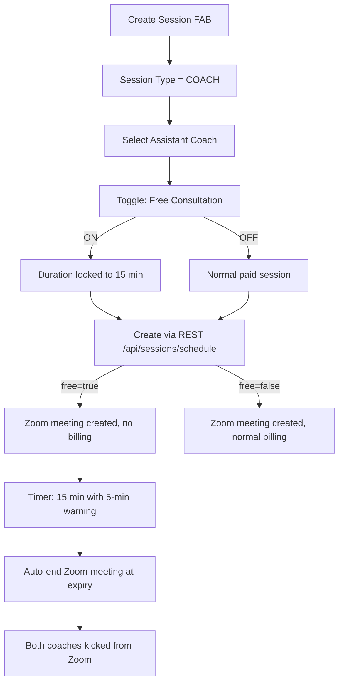

# Coach Scheduling & Free Consultation Overhaul

## Problem 1: Client-Booked Sessions Not Showing on Coach SCHEDULE Tab

**Root cause:** The backend (`sessions.py`) encrypts `sessions.json` with Fernet when writing. The bridge's `CoachNexusV2.get_calendar_data()` reads the same file with plain `json.load()`, which silently fails and returns an empty list.

**Fix:** Make `CoachNexusV2.get_calendar_data()` in [bridge_handlers_v2.py](backend/app/websocket/bridge_handlers_v2.py) read from PostgreSQL (`coaching_sessions` table) via the bridge's `db_pool` instead of from the JSON file. This eliminates the encryption mismatch and makes PG the single source of truth for the coach calendar.

- Query: `SELECT * FROM coaching_sessions WHERE coach_id = $1 AND status IN ('scheduled', 'active') AND scheduled_start >= $2 ORDER BY scheduled_start`
- Fall back to JSON (with decryption attempt) only if `db_pool` is None

## Problem 2: Move Free Consultation into Create Session Dialog

**Current state:** "Start Free Consultation" button lives on the ASSISTANTS tab and sends `master_consultation_request` via WebSocket. It works but has no Zoom auto-end, and is disconnected from the session creation flow.

**New flow:**

### Changes to Create Session dialog ([updated_screens.dart](mobile/lib/updated_screens.dart))

- Add `bool _freeConsultation = false` state variable in the dialog
- When `sessionType == 'COACH'`, show a "Free Consultation" toggle below "Disable Recording"
- When toggled ON: lock duration to 15 minutes, disable the duration field
- Check if the selected assistant has already used their free consultation today (query `GET /api/coach/schedule/consultation-status/{assistant_username}`)
- If already used: show the toggle as disabled with "Already used today" label
- Pass `free_consultation: true` in the `POST /api/sessions/schedule` payload

### Changes to backend ([sessions.py](backend/app/routers/sessions.py))

- Add `free_consultation: bool = False` to the schedule request model
- When `free_consultation=True`:
  - Set `coach_fee: 0`, `platform_fee: 0`, `payment_status: "waived"`, `session_type: "MASTER_CONSULTATION"`
  - Create Zoom meeting normally (no billing skip on Zoom itself -- Zoom is free for the account)
  - Record in `coach_consultations` table with `is_free=TRUE`
  - Enforce 1-per-day limit per assistant (query `coach_consultations` for today)
- When `free_consultation=False` and type is COACH: normal billing (30% / min $30)

### New endpoint: Consultation status check

- `GET /api/coach/schedule/consultation-status/{assistant_username}` in [schedule_api.py](backend/app/routers/schedule_api.py)
- Returns: `{ "used_today": true/false, "last_consultation": "2026-03-03T..." }`
- Query: `SELECT COUNT(*) FROM coach_consultations WHERE assistant_username = $1 AND is_free = TRUE AND scheduled_start::date = CURRENT_DATE`

## Problem 3: Zoom Auto-End at Session Expiry

**Current state:** `_run_consultation_timer()` in [bridge_server.py](backend/app/websocket/bridge_server.py) sends WebSocket warnings but does NOT end the Zoom meeting.

**Fix:**

- Add `end_meeting(meeting_id)` method to [zoom_client.py](backend/app/services/zoom_client.py):
  - `PUT https://api.zoom.us/v2/meetings/{meetingId}/status` with body `{"action": "end"}`
- Modify `_run_consultation_timer()` in bridge_server.py:
  - At expiry, call `ZoomClient.end_meeting(zoom_meeting_id)` to force-end the Zoom call
  - Both coaches are kicked from the Zoom session
  - Send `consultation_ended` WebSocket message with `zoom_ended: true`

## Problem 4: Assistant Coach Booking Flow (Client Settings)

**Current state:** Assistant coaches see their master coach's availability in client settings "View Available & Book Session" tab. They can book but there's no free consultation prompt.

**Fix in [main.dart](mobile/lib/main.dart) `ClientScheduleScreen`:**

- Before showing the "Book" confirmation, check if the user is a COACH with an active master coach relationship
- If yes, call `GET /api/coach/schedule/consultation-status/{current_username}` to check free consultation availability
- If free consultation is available, show prompt: "Do you want to use your 15min free consultation credit?" with a checkbox
- If checked: book as free consultation (15 min, `free_consultation: true`)
- If unchecked: book as normal paid session

## Problem 5: Daily Free Consultation Tracking

**Already exists** in `coach_consultations` table (migration 093). The `is_free` column and `UNIQUE(assistant_username, master_username, scheduled_start)` constraint handle this.

**Additional enforcement:**

- Backend `POST /api/sessions/schedule` with `free_consultation=True` checks `coach_consultations` for existing free session today
- If found, return `400: Free consultation already used today`
- Track in `coach_consultations` on creation, not just on completion

## Problem 6: Remove Free Consultation from ASSISTANTS Tab

- Remove the "Consult" button from the ASSISTANTS tab assistant rows in [updated_screens.dart](mobile/lib/updated_screens.dart)
- Remove the `_startConsultation()` method
- Keep the `master_consultation_request` WebSocket handler in bridge for backward compatibility but mark it deprecated

## Files to Modify

| File                                          | Changes                                                                               |
| --------------------------------------------- | ------------------------------------------------------------------------------------- |
| `backend/app/websocket/bridge_handlers_v2.py` | Read coach calendar from PG instead of encrypted JSON                                 |
| `backend/app/services/zoom_client.py`         | Add `end_meeting()` method                                                            |
| `backend/app/routers/sessions.py`             | Handle `free_consultation` flag in schedule endpoint                                  |
| `backend/app/routers/schedule_api.py`         | Add consultation-status check endpoint                                                |
| `backend/app/websocket/bridge_server.py`      | Call Zoom end_meeting in consultation timer                                           |
| `mobile/lib/updated_screens.dart`             | Add Free Consultation toggle to Create Session dialog, remove Consult from ASSISTANTS |
| `mobile/lib/main.dart`                        | Add free consultation prompt to ClientScheduleScreen booking flow                     |

