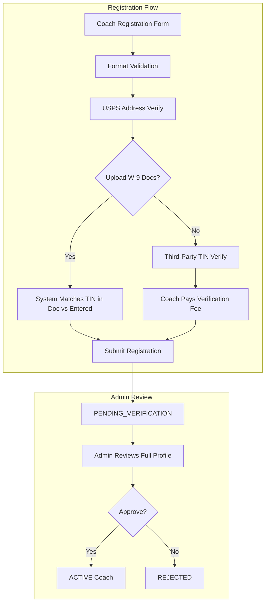

# Coach Verification and Admin Approval Overhaul

## Current State

**Registration collects:** Name, DOB, username, password, W-9 (legal name, business name, tax classification, address, TIN/SSN/EIN, certification, signature), DOJO selection.

**Missing from registration:** Email, phone number, bank account info.

**Admin approval currently shows:** Name, email (empty), specializations, w9_submitted boolean, DOJOs, pricing. No W-9 details, no document review, no validation status. Just approve/reject buttons.

---

## Architecture

---

## Phase 1: Registration Form -- Add Missing Fields

**File:** [mobile/lib/main.dart](mobile/lib/main.dart)

Add to the Step 2 form (after Name/DOB, before W-9 section):

- **Email** -- required, with basic email format validation (`contains('@')` and `.`)
- **Phone** -- required, with format hint `(XXX) XXX-XXXX`, basic 10-digit validation
- **SSN/EIN format validation** -- on the existing `_w9TinCtrl` field:
  - SSN: exactly 9 digits, not `000-00-0000`, not `999-xx-xxxx`, area number != `666`
  - EIN: exactly 9 digits, first two digits are a valid IRS campus prefix
  - Show real-time validation icon (green check / red x) as user types

Add to the registration payload (line ~4719):

- `"email": _emailCtrl.text.trim()`
- `"phone": _phoneCtrl.text.trim()`

**Backend** [bridge_server.py](backend/app/websocket/bridge_server.py): Store email and phone in the coach profile during `register_request` handling (~line 1350).

---

## Phase 2: USPS Address Validation

**New file:** `backend/app/services/address_validator.py`

- Use USPS Web Tools API (free, requires registration at [https://www.usps.com/business/web-tools-apis/](https://www.usps.com/business/web-tools-apis/))
- Validate address on the backend when registration is submitted
- Return standardized address or error if address not found
- Store validation result in profile: `"address_verified": true/false`, `"standardized_address": {...}`

**Backend handler:** Add address validation call inside `register_request` handler. If address is invalid, return `registration_failed` with message. If valid, store the standardized address.

**Frontend:** Show validation result to coach before final submission (green "Address verified" or red "Address not found -- please correct").

**Env var needed:** `USPS_USER_ID` in `.env`

---

## Phase 3: Document Upload for W-9 Verification

**Registration form** ([main.dart](mobile/lib/main.dart)): Add a "Upload W-9 Documentation" button in the W-9 section. Allow photo/PDF upload using the existing `file_picker` package. Convert to base64 for transmission.

**Backend:** Store uploaded document as a file on disk under `backend/data/coach_docs/{hardware_id}/` and save the file path in the coach profile.

**TIN matching logic** (in `bridge_server.py` or new service):

- If document is uploaded, attempt to extract TIN from the document (basic OCR or manual admin review)
- Store `"tin_doc_uploaded": true`, `"tin_doc_path": "..."`, `"tin_match_status": "pending_admin_review"`
- Admin reviews the document and manually confirms the TIN matches

**If no document uploaded:**

- Set `"tin_verification_method": "third_party_required"`
- Coach is shown a message: "You can upload W-9 documentation to waive the verification fee, or proceed with third-party verification ($X.XX)"
- Third-party verification integration is Phase 5 (deferred -- requires selecting a provider and payment integration)

---

## Phase 4: Admin Review UI Overhaul

**File:** [mobile/lib/updated_screens.dart](mobile/lib/updated_screens.dart)

Replace the simple `_buildCoachApprovalCard()` with a tappable card that opens a **full detail review screen/dialog**.

**Backend change:** Expand `admin_get_pending_coaches` handler (line 5350) to include ALL profile fields:

- Add: `email`, `phone`, `w9_data` (the full W-9 dict, not just boolean), `dob`, `tin_doc_uploaded`, `tin_match_status`, `address_verified`, `standardized_address`, `tin_verification_method`, `registration_date`
- Mask SSN/EIN for display: show only last 4 digits (`***-**-1234`)

**Admin detail view sections:**

- **IDENTITY** -- Name, DOB, email, phone
- **W-9 TAX INFORMATION** -- Legal name, business name, tax classification, address (with USPS verification badge), TIN (masked, last 4 only)
- **DOCUMENTATION** -- View uploaded W-9 doc (if any), TIN match status indicator
- **DOJO SUBSCRIPTIONS** -- Selected DOJOs with pricing and discount
- **VERIFICATION STATUS** -- Checklist showing: email provided, phone provided, address verified, TIN format valid, document uploaded / third-party verified
- **ACTIONS** -- Approve / Reject (with reason) / Request More Info

---

## Phase 5: Bank Account via Plaid (Deferred)

Plaid integration requires:

- Plaid API keys (sandbox for testing, production requires application approval)
- Plaid Link SDK integration in Flutter (`plaid_flutter` package)
- Backend token exchange endpoints
- Stripe Connect for actual payouts

This should be a separate plan once the verification system is working and billing goes live.

---

## Phase 6: Third-Party TIN Verification (Deferred)

Options for TIN/SSN verification:

- **TIN Check (IRS)** -- Free but slow (batch processing)
- **Socure** -- Real-time, ~$0.50-2.00 per lookup
- **Plaid Identity Verification** -- Can bundle with bank account verification

This requires: selecting a provider, payment integration for coach to pay the fee, and API key setup. Should be a separate plan.

---

## What to Build Now (Phases 1-4)

The immediately actionable work:

- **main.dart**: Add email, phone, SSN/EIN format validation, document upload button
- **bridge_server.py**: Store new fields, expand pending coaches response, add USPS validation
- **address_validator.py**: New service for USPS API
- **updated_screens.dart**: Admin detail view with full profile review, verification checklist, document viewer
- **.env**: Add `USPS_USER_ID`

Search approval is already handled correctly -- just shows the query preview with approve/deny, which matches your requirement.