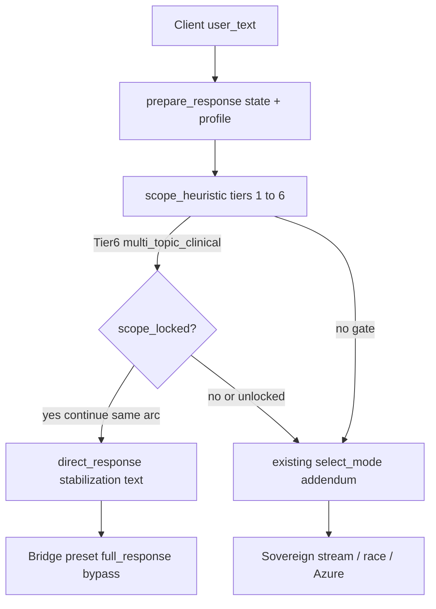

# Coaching scope gate + adaptive hardening

## Problem (from transcripts)

Adaptive mode improves tone via addenda, but **early multi-vector clinical disclosures** (e.g., marriage intimacy + grief + existential + faith + meaning) combined with premature **dissatisfaction/action** signals route to **exploratory/strategic**, producing **strategy/experiments** before affect is stabilized—a poor fit at turn 2–4.

[`little_nate_adaptive.py`](backend/app/services/little_nate_adaptive.py) **`DISSATISFACTION_PHRASES`** also misses pushback such as **"I already do that"**.

## Architectural choice

Implement **deterministic heuristic scope detection first** (no extra LLM in v1—keeps latency and inference cost predictable). Optional **LLM disambiguation** can be gated later behind an env flag using existing [`generate_complete`](backend/app/services/sovereign_chat_client.py) with `domain="utility"` and constrained JSON if needed.

Orchestration lives primarily in **`prepare_response`** in [`little_nate_adaptive.py`](backend/app/services/little_nate_adaptive.py) so [`bridge_server.py`](backend/app/websocket/bridge_server.py) stays a thin bypass hook (respect **50-line additive rule** per repo policy).

## Phase 1 (ship first)

### 1. New module: scope gate evaluator

Create [`backend/app/services/little_nate_coaching_scope_gate.py`](backend/app/services/little_nate_coaching_scope_gate.py) (name can match your shim; keep it backend-only):

- **`CLINICAL_TOPIC_KEYWORDS`** + **`TOPIC_GROUPS`** (+ optional denominational guard phrases if you want narrower faith routing).
- **Tier 6 rule**: infer `multi_topic_clinical_opening` when **≥ N distinct matched groups within first K user turns** (defaults e.g. N=4, K=4, tunable constants).
- **Unlock**: reset lock when explicit topic-shift language is detected OR when adaptive turn counter resets (already cleared on logout via `_adaptive_clear` in [`bridge_server.py`](backend/app/websocket/bridge_server.py) ~7874).
- **`CONTINUATION_PATTERNS` / escalation**: reuse your shim’s continuation logic so **locked-scope + continued heavy clinical** still triggers the stabilization template rather than drifting to experimental framing.
- Return a small **`ScopeGatePayload`**: `{direct_response?, scope_locked_topics, telemetry_labels, unlocked}`.

**Note**: This is separate from **`check_ip_boundary`** (~721 in [`bridge_server.py`](backend/app/websocket/bridge_server.py)), which gates **platform IP** phrases, not clinical coaching pacing.

### 2. Extend `SessionState`

In [`little_nate_adaptive.py`](backend/app/services/little_nate_adaptive.py), add optional fields aligned with the shim:

- `scope_topics_active: tuple[str,...]` / `scope_lock_since_turn`
- Hydration hook from `profile.get("ln_conversation_arc")` only if Phase 2 is in scope—otherwise omit.

### 3. Extend `prepare_response` contract

At the **top** of `prepare_response` (after advancing `turn_count` / trims as today—or **before** `turn_count` if you decide gate should not consume a mode “slot”; recommend **consumes turn** consistently so distress/rut logic stays coherent):

1. Run scope gate evaluator with `(state.turn_count, user_msg, profile, state.scope_topics_active...)`.
2. If `direct_response` is set → return payload including:
   - `"direct_response"`: stabilization text (**no forbidden IP / no platform URLs**—mirrors AQ fallback tone).
   - `"system_addendum"`: neutral or empty (`""`) so upstream LLM prompts are irrelevant.
   - `"signals"`: merged with adaptive signals + `scope_gate_multi_topic` etc.
   - `"mode"`: unchanged or pinned to `"reflective"` for telemetry only—document that **`direct_response` wins**.
3. Else fall through to existing `select_mode` / `build_system_addendum`.

### 4. Bridge bypass (minimal diff)

Immediately after initializing `full_response = ""`, `_already_streamed = False`, `_t_inf_start` inside the **`try`** that begins ~9067 in [`bridge_server.py`](backend/app/websocket/bridge_server.py):

- Extract `_scope_preset = (_adaptive_payload or {}).get("direct_response")` (truthy stripped string).
- If preset: set `full_response`, `_provider_used = "coaching_scope_gate"` (or similar audit tag).
- Replace the **`if _USE_SOVEREIGN_ROUTING and _sovereign_stream`** head with **`elif`** so streaming/race/Azure do not run when preset is truthy.

**Interaction with therapeutic buffering**: `_buffer_for_therapeutic_audit` is defined above this region. Decide one policy:

- **v1 simplest**: scope bypass skips streaming buffer (`if preset: bypass buffer path`) OR still runs post-processing—a one-line conditional next to `_send`.

**Coach handoff UI**: optionally emit a **second framed message** analogous to [`offer_coach_handoff`](backend/app/websocket/bridge_server.py) (~9513)—only if you want parity with adaptive metadata (**not strictly required for v1**).

### 5. Adaptive pattern tweak

Augment **`DISSATISFACTION_PHRASES`** with pushback idioms (**"already do that"**, **"tried that"**, **"that doesn't help"**, **"tell me something new"**) to reduce false negatives before dissatisfaction escalation.

### 6. Calibration + observability

- Append a **`_SCOPE_CALIBRATION_TRACE`** doc block (matching style of existing trace at bottom of adaptive module) with magicguy72-style opening expectations.
- Log one line `[SCOPE_GATE] uid=... topics=... lock=...` next to `[ADAPTIVE]` log.

### 7. Controls

- Env flag **`ENABLE_COACHING_SCOPE_GATE`** default `true`; bridge checks flag before honoring `direct_response` (additive, easy rollback).

---

## Phase 2 (continuation memory—optional)

- Persist compact arc JSON under **`profile_data.ln_conversation_arc`** `{last_topics[], last_arc_summary, updated_at}` via existing bridge DB patterns (see [`pg_data_helpers.update_user_field_pg`](backend/app/services/pg_data_helpers.py) or targeted `jsonb_set` elsewhere)—**coordinate with [`user_store`](backend/app/websocket/user_store.py) merge semantics** so registry saves do not wipe unknown keys blindly.
- On login / first turn, merge profile arc into `SessionState`.
- Optionally async **`generate_complete`** summarize last session (workers/utility-tier) batch—off hot path only.

---

## Testing (local)

- **Unit tests**: pure functions in `little_nate_coaching_scope_gate.py` (topic counting, continuation, unlock, edge cases near K/N thresholds).
- **Golden transcript**: automate a shortened magicguy72 fixture → expect `direct_response` on turns 2–4, then normal flow after simulated explicit topic shift string.

---

## Risk / guardrails

- **Over-trigger**: Tune N/K and keyword lists conservatively; start with Tier 6 only (skip Tier 8 global crisis keywords unless clinically reviewed).
- **Protected files**: Keep [`bridge_server.py`](backend/app/websocket/bridge_server.py) edits to the **preset-full_response + elif chain** and flags; defer refactors.
