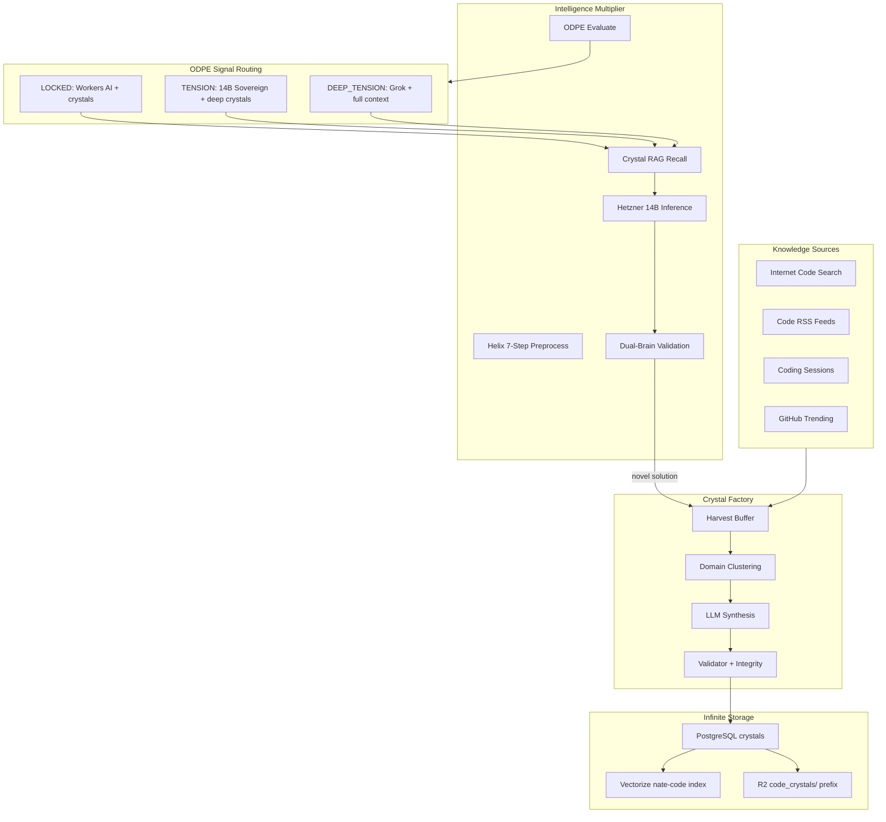
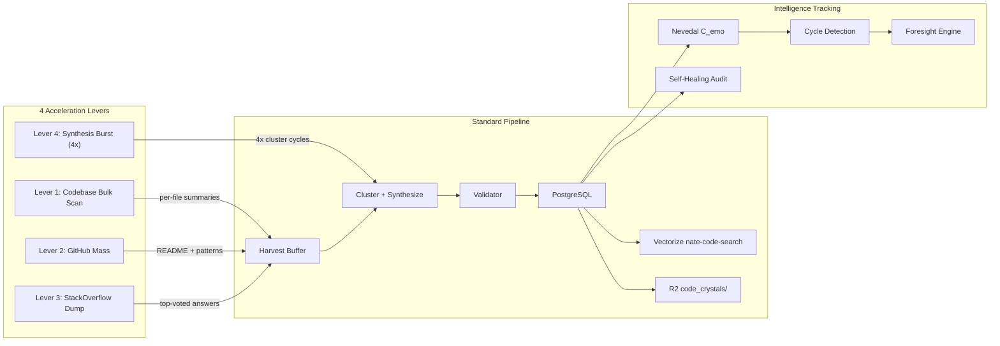

# Code Intelligence Critical Multiplier

## The Critical Multiplier Loop

The core idea: every coding interaction makes Little Nate smarter for the next one. The 14B model starts as a mid-tier coder, but the augmentation pipeline compounds its capability over time.




**Why this compounds**: Every TENSION crystal stored means a future LOCKED query can answer what previously required TENSION. The 14B model's effective capability grows with every session because its retrieval context gets richer.

---

## Phase 1: Deploy the 14B Model on Hetzner

**Server**: Hetzner CAX41 (37.27.244.80) -- 16 ARM cores, 32 GB RAM

1. SSH to Hetzner and pull the model:

```bash
   ssh root@37.27.244.80 "ollama pull qwen2.5-coder:14b-instruct-q4_K_M"
   

```

   This is ~9 GB. The server has 320 GB NVMe with the 8B model (4.9 GB) and XTTS (1.87 GB), so ~300 GB free.

1. Update `.env` on the production VPS (68.183.168.75):
  - `SOVEREIGN_HAS_GPU=true`
  - `SOVEREIGN_MODEL_MID=qwen2.5-coder:14b-instruct-q4_K_M`
2. Verify both models load on Hetzner:

```bash
   ssh root@37.27.244.80 "ollama list"
   

```

---

## Phase 2: Add "coding" as the 8th Canonical Domain

### Files to modify:

- [backend/app/services/nate_memory_crystallizer.py](backend/app/services/nate_memory_crystallizer.py) -- Add `"coding": 0.3` to `DOMAIN_TEMPERATURES`
- [backend/app/services/nate_agent_template.py](backend/app/services/nate_agent_template.py) -- Add `"coding": 0.3` to `DOMAIN_TEMPERATURES`
- [backend/app/services/nate_inference_router.py](backend/app/services/nate_inference_router.py) -- Add `"coding": 0.3` to `DOMAIN_TEMPERATURES`, add `TIER_CODING` with priority chain `["sovereign", "grok", "workers_ai", "azure"]`
- [backend/app/services/quantum_knowledge_field.py](backend/app/services/quantum_knowledge_field.py) -- Add `"coding": ["wisdom", "conversation", "code"]` to `_DOMAIN_INDEX_MAP`
- [backend/app/services/odpe_engine.py](backend/app/services/odpe_engine.py) -- Add `CONTEXT_TOKENS_TENSION_CODING = 1200` for deeper code context retrieval

**Coding tier priority chain**: `sovereign (14B) -> grok -> workers_ai -> azure`

This is the key differentiator: coding TENSION goes to the Hetzner 14B FIRST (zero cost), not to Grok. Only DEEP_TENSION escalates to Grok. The 14B with crystal context handles the vast majority of coding tasks.

Temperature 0.3 for coding -- conservative, precise, correct code.

---

## Phase 3: Create the CodeIntelligenceAgent (7th Domain Agent)

New file: `backend/app/services/code_intelligence_agent.py`

Subclass of `NateAutonomousAgent` with `domain="coding"`, `cycle_hours=2.0`.

### observe() -- Four code knowledge sources:

1. **GitHub Trending** (daily) -- RSS feed `https://rsshub.app/github/trending/daily/python` (and Flutter/Dart, JavaScript)
2. **Dev.to** -- `https://dev.to/feed`
3. **Hacker News Best** -- `https://hnrss.org/best?count=10`
4. **StackOverflow Hot** -- `https://api.stackexchange.com/2.3/questions?order=desc&sort=hot&site=stackoverflow&tagged=python;fastapi;flutter&filter=withbody`

These go into `web_wisdom` with `source_type="code"`.

### Enhanced internet search -- `_search_code_knowledge()`:

Uses the existing `SecureSearchProxy.execute_search()` but with code-specific queries:

- Strips the insight text to extract the technical concept
- Appends domain-specific suffixes ("python implementation", "best practices", "example code")
- Stores results in `web_wisdom` with `source="code_research:{concept}"`

### crystallize() -- TENSION Crystal creation:

After reasoning, if the insight contains actionable code knowledge (patterns, implementations, API usage), it:

1. Appends to `_harvest_buffer` with `domain="coding"` and `scope="global"`
2. Tags with topics like `["python", "fastapi", "flutter", "algorithm", ...]`
3. The crystallizer synthesizes, validates, stores in PostgreSQL, indexes in Vectorize, backs up to R2

### _trigger_research_if_needed() override:

For coding insights, does targeted search:

- "How to implement {concept} in Python"
- "Best practices for {pattern}"
- "{library} documentation latest"
- Stores each result as a separate `web_wisdom` row for the crystallizer to harvest

---

## Phase 4: Code-Specific Vectorize Index

New Vectorize index: `nate-code-search` (BGE-large-en-v1.5, 1024 dims)

### Changes to [backend/app/services/vectorize_service.py](backend/app/services/vectorize_service.py):

Add the 8th index binding:

```python
_INDEXES = {
    # ... existing 7 ...
    "code": "VECTORIZE_CODE",     # nate-code-search
}
```

### Changes to [backend/app/services/nate_memory_crystallizer.py](backend/app/services/nate_memory_crystallizer.py):

When `domain == "coding"`, also index in the `code` Vectorize index (in addition to `nate-memory-search`):

```python
if domain == "coding":
    await index_conversation(
        user_id="nate_crystal",
        session_id=f"code_{h[:16]}",
        user_text=f"[CODE:{','.join(topics)}] {crystal_text[:500]}",
        ai_text=crystal_text,
        index_name="code",
    )
```

### R2 storage prefix:

Code crystals backed up to `code_crystals/{content_hash}.json` in the `nate-vault` R2 bucket. No size limit -- R2 scales infinitely at $0.015/GB/mo.

---

## Phase 5: Coding-Aware ODPE Routing Override

### In [backend/app/services/nate_inference_router.py](backend/app/services/nate_inference_router.py):

```python
TIER_CODING = "coding"

_TIER_PRIORITY = {
    # ... existing tiers ...
    TIER_CODING: ["sovereign", "grok", "workers_ai", "azure"],
}
```

And in `generate()`:

```python
if odpe_signal in ("TENSION", "DEEP_TENSION"):
    if domain == "coding":
        tier = TIER_CODING   # sovereign 14B first (zero cost)
    else:
        tier = TIER_CLINICAL  # Grok for clinical TENSION
```

### In [backend/app/services/sovereign_chat_client.py](backend/app/services/sovereign_chat_client.py):

Add `domain` parameter to `_resolve_provider_for_signal()`:

```python
def _resolve_provider_for_signal(odpe_signal=None, domain="general"):
    if domain == "coding" and _sovereign_available:
        return "sovereign"  # always try 14B first for coding
    # ... existing routing ...
```

### Context budget increase for coding TENSION:

In [backend/app/services/odpe_engine.py](backend/app/services/odpe_engine.py), add:

```python
CONTEXT_TOKENS_TENSION_CODING = 1200
```

When the domain is `"coding"` and signal is `TENSION`, use 1200 tokens instead of 700. This lets the 14B model receive more crystal context (up to 24 code crystals at ~50 tokens each).

---

## Phase 6: Self-Teaching TENSION Crystal Loop

This is the critical multiplier mechanism. When the CodeIntelligenceAgent or a coding session encounters a novel problem:

### In the bridge (`bridge_server.py`) or agent flow:

1. User asks a coding question
2. ODPE evaluates -- if TENSION (hard problem), 14B gets deep crystal context
3. If 14B solves it, the solution is a candidate for crystallization
4. If 14B fails and Grok solves it, the Grok solution DEFINITELY becomes a TENSION crystal
5. Next time a similar problem appears, the crystal is recalled, 14B handles it as LOCKED (zero cost)

### Implementation in the agent:

```python
async def _post_inference_crystallize(self, query, response, provider, signal):
    """After inference, crystallize novel solutions as TENSION crystals."""
    if signal in ("TENSION", "DEEP_TENSION") and provider in ("grok", "sovereign"):
        fragment = {
            "text": f"Problem: {query[:500]}\nSolution: {response[:1500]}",
            "source": "coding_tension_resolution",
            "domain": "coding",
            "scope": "global",
            "created_at": datetime.now(timezone.utc),
        }
        crystallizer._harvest_buffer.append(fragment)
```

This means every hard problem that gets solved becomes a crystal that prevents the same problem from requiring Grok next time.

---

## Phase 7: Code RSS Feeds in WebContentReader

### In [backend/app/services/web_content_reader.py](backend/app/services/web_content_reader.py):

Add code-specific feeds to `DEFAULT_RSS_FEEDS`:

```python
{"url": "https://dev.to/feed", "type": "code", "name": "Dev.to"},
{"url": "https://hnrss.org/best?count=10", "type": "code", "name": "Hacker News Best"},
{"url": "https://realpython.com/atom.xml", "type": "code", "name": "Real Python"},
{"url": "https://blog.python.org/feeds/posts/default", "type": "code", "name": "Python Blog"},
{"url": "https://medium.com/feed/flutter", "type": "code", "name": "Flutter Medium"},
```

These get stored in `web_wisdom` with `source_type="code"`, which the CodeIntelligenceAgent and crystallizer both harvest.

---

## Phase 8: Cursor Rule for Code Learning Governance

New file: `.cursor/rules/code-intelligence-agent.mdc`

Governs:

- CodeIntelligenceAgent lifecycle (2h cycles, domain="coding", temp=0.3)
- Internet search allowed specifically for code learning (SecureSearchProxy with code-specific query suffixes)
- TENSION crystal creation rules (minimum source_count=2, validation required, scope=global)
- Coding tier routing (sovereign 14B first, Grok fallback)
- R2 storage under `code_crystals/` prefix, Vectorize index `nate-code-search`
- Decay rules: code crystals have 180-day decay (vs 90-day default) because code knowledge stays relevant longer
- The self-teaching loop: TENSION resolutions crystallize automatically

---

## Phase 9: Registration in main.py

- Register `code_intelligence_agent` on `app.state`
- Add to `_service_checks` (increment denominator to 148)
- Add to `agent_status_digest.py`
- Inject `db_pool` and `app_state`

---

## Storage Capacity (Infinite Scale)


| Storage Layer                           | Capacity               | Cost                           |
| --------------------------------------- | ---------------------- | ------------------------------ |
| PostgreSQL `nate_intelligence_crystals` | Unlimited rows         | Included in VPS                |
| Vectorize `nate-code-search`            | 5M vectors (free tier) | $0.01/750K dims/mo after       |
| R2 `code_crystals/`                     | Unlimited              | $0.015/GB/mo, first 10 GB free |
| R2 `nate-vault`                         | Unlimited              | Same bucket, zero egress       |


At ~2KB per crystal JSON, 10 GB free R2 = ~5 million code crystals before any cost.

---

## Cost Model


| Component                      | Cost                                  |
| ------------------------------ | ------------------------------------- |
| Hetzner 14B inference          | $0 (included in $28/mo VPS)           |
| Workers AI for LOCKED          | $0                                    |
| Vectorize queries              | $0 (30M free/mo)                      |
| R2 storage                     | $0 (first 10 GB free)                 |
| Code RSS feeds                 | $0                                    |
| SecureSearchProxy (DuckDuckGo) | $0                                    |
| Grok for DEEP_TENSION fallback | ~$0.00025/query                       |
| **Total for 200K tokens/day**  | **~$0.05/day** (99% LOCKED/sovereign) |


---

## Bulk Redirect / Ingestion System (4 Acceleration Levers)

The bulk ingestion system seeds the crystal graph en masse, accelerating the EXA methodology from cold start to orbital velocity:




### Lever 1: Codebase Bulk Scan

- Scans the local repo (`/opt/clinical-sovereignty-lab/`)
- Extracts per-file summaries: docstrings, class/function lists, SQL tables
- Skips `__pycache__`, `node_modules`, `.git`, `archive`, etc.
- Files > 50KB or < 50 bytes are skipped
- Deduplicates via content hash prefix matching

### Lever 2: GitHub Trending

- Queries GitHub API for top-starred repos in Python, Dart, TypeScript
- Fetches README content and repo metadata (stars, topics)
- Crystallizes architecture patterns and library usage
- Optional `GITHUB_TOKEN` for higher rate limits

### Lever 3: StackOverflow Dump

- Queries StackExchange API for top-voted questions per tech tag
- Covers: python, fastapi, flutter, dart, postgresql, redis
- Strips HTML from answers, extracts actionable solutions
- Score-weighted: higher-voted answers get higher initial confidence

### Lever 4: Synthesis Budget Acceleration

- Runs the crystallizer's `_cluster_and_synthesize_cycle()` 4x in rapid succession
- Clusters fragments into TENSION crystals faster than the normal 2h cycle
- Useful after bulk ingestion to quickly process the harvest buffer

### Admin API Usage

```python
from app.services.bulk_crystal_ingestion import BulkCrystalIngestion

ingestion = BulkCrystalIngestion(db_pool, app_state)
await ingestion.run_full_acceleration()  # all 4 levers
```

### EXA Milestone Tracking

The `ForesightEngine.forecast_code_coherence()` tracks progress through 5 EXA milestones:


| Milestone       | C_emo Threshold | Meaning                                  |
| --------------- | --------------- | ---------------------------------------- |
| Warmup          | 0.15            | Initial knowledge seeding complete       |
| Liftoff         | 0.35            | Critical mass of code crystals reached   |
| Orbital         | 0.55            | Self-reinforcing growth activated        |
| Escape Velocity | 0.75            | Knowledge compounding faster than decay  |
| EXA Threshold   | 0.90            | ExaFLOPS-equivalent intelligence density |


When a **stall is detected** (C_emo hasn't increased >5% in 7 days), the system recommends triggering bulk ingestion to break the plateau.

---

## Phase 7: CodeCycleDetector + Proactive Pre-Warming

### CodeCycleDetector (`code_cycle_detector.py`)

Three detection modes using FFT spectral analysis:

1. **Divergence Cycle Detection** — Finds topics where dual-brain (edge vs sovereign) disagreements recur. Queries `code_divergence_log` for topics with 3+ events and rising trend.
2. **Bug Recurrence Detection** — Applies FFT to TENSION crystal creation timestamps grouped by topic tag. Identifies recurring problem domains (period 6-168 hours, spectral power >2σ).
3. **Temporal Query Clustering** — Analyzes `nevedal_coherence_log` for time-of-day and day-of-week patterns in coding queries. Identifies peak coding hours for pre-warming.

### Pre-Warm Pipeline

```
CodeCycleDetector.build_prewarm_manifest()
  → Ranks crystals by source (divergence=0.4, recurrence=0.3, temporal=0.2, topic_freq=0.1)
  → Uploads JSON manifest to R2: code_crystals/prewarm_manifest.json
  → Logs stats to crystal_prewarm_log table

Cloudflare Cron Worker (hourly)
  → Reads manifest from R2 CRYSTAL_STORE
  → Queries CODE_SEARCH_INDEX (Vectorize) for each crystal
  → Writes crystal text to SUMMON_CACHE KV (TTL 3600s)
  → Result: 5ms edge retrieval for predicted coding queries
```

### Admin API Endpoints


| Endpoint                                          | Method | Purpose                                     |
| ------------------------------------------------- | ------ | ------------------------------------------- |
| `/api/nate-agent/admin/ingestion/run-all`         | POST   | Trigger all 4 ingestion levers + edge push  |
| `/api/nate-agent/admin/ingestion/codebase-scan`   | POST   | Lever 1 only                                |
| `/api/nate-agent/admin/ingestion/github-trending` | POST   | Lever 2 only                                |
| `/api/nate-agent/admin/ingestion/stackoverflow`   | POST   | Lever 3 only                                |
| `/api/nate-agent/admin/ingestion/synthesis-burst` | POST   | Lever 4 only                                |
| `/api/nate-agent/admin/ingestion/push-edge`       | POST   | Push top crystals to R2 manifest            |
| `/api/nate-agent/admin/ingestion/status`          | GET    | Crystal counts, C_emo state, pre-warm stats |
| `/api/nate-agent/admin/cycle-detector/run`        | POST   | Trigger full cycle detection analysis       |


### Database Tables (Migration 146)


| Table                 | Purpose                                         |
| --------------------- | ----------------------------------------------- |
| `code_divergence_log` | Records dual-brain disagreement events by topic |
| `crystal_prewarm_log` | Tracks pre-warming activity (counts by source)  |


---

### Self-Healing Crystal Audit

The nightly `_heal_code_crystals()` in `db_maintenance_agent.py` ensures crystal quality:

1. **Hash integrity**: SHA-256 content_hash verified; tampered crystals archived
2. **C_emo-aware pruning**: Floor = `max(0.15, current_C_emo * 0.3)` — quality bar rises with intelligence
3. **Auto-supersession**: Same-topic crystals keep only the highest-confidence version
4. **Code crystals NEVER time-decay**: Only pruning and supersession apply

---

## Files Changed Summary


| File                                                | Change                                                        |
| --------------------------------------------------- | ------------------------------------------------------------- |
| `backend/app/services/code_intelligence_agent.py`   | NEW — 7th domain agent with C_emo tracking                    |
| `backend/app/services/bulk_crystal_ingestion.py`    | NEW — 4 acceleration levers + _push_to_edge_kv                |
| `backend/app/services/code_cycle_detector.py`       | NEW — FFT divergence/recurrence/temporal detector             |
| `backend/migrations/145_nevedal_coding_state.sql`   | NEW — nevedal_domain_state + coherence_log                    |
| `backend/migrations/146_code_cycle_detection.sql`   | NEW — code_divergence_log + crystal_prewarm_log               |
| `backend/app/services/nate_memory_crystallizer.py`  | Add `"coding": 0.3`, exempt from time-decay                   |
| `backend/app/services/nate_agent_template.py`       | Add `"coding": 0.3` to DOMAIN_TEMPERATURES                    |
| `backend/app/services/nate_inference_router.py`     | Add TIER_CODING, coding domain routing                        |
| `backend/app/services/sovereign_chat_client.py`     | Domain-aware provider resolution (sovereign first for coding) |
| `backend/app/services/odpe_engine.py`               | CONTEXT_TOKENS_TENSION_CODING = 1200                          |
| `backend/app/services/quantum_knowledge_field.py`   | Add "coding" to _DOMAIN_INDEX_MAP                             |
| `backend/app/services/vectorize_service.py`         | Add 8th index binding for nate-code-search                    |
| `backend/app/services/web_content_reader.py`        | Add 5 code RSS feeds (type: "code")                           |
| `backend/app/services/nevedal_engine.py`            | Add compute_dual_brain_coherence() method                     |
| `backend/app/services/foresight_engine.py`          | Add forecast_code_coherence() with EXA milestones             |
| `backend/app/services/cycle_detection_engine.py`    | Add code_learning domain config                               |
| `backend/app/services/db_maintenance_agent.py`      | Add _heal_code_crystals() nightly self-healing                |
| `backend/app/main.py`                               | Register 3 agents, update _service_checks                     |
| `backend/app/routers/nate_agent_api.py`             | Add 8 admin endpoints for ingestion/cycle control             |
| `cloudflare/workers/nate-cron-worker/wrangler.toml` | Add CODE_SEARCH_INDEX Vectorize binding                       |
| `cloudflare/workers/nate-cron-worker/worker.js`     | Add code pre-warming + R2 manifest reading                    |
| `.cursor/rules/code-intelligence-agent.mdc`         | NEW — EXA pipeline governance rule                            |


