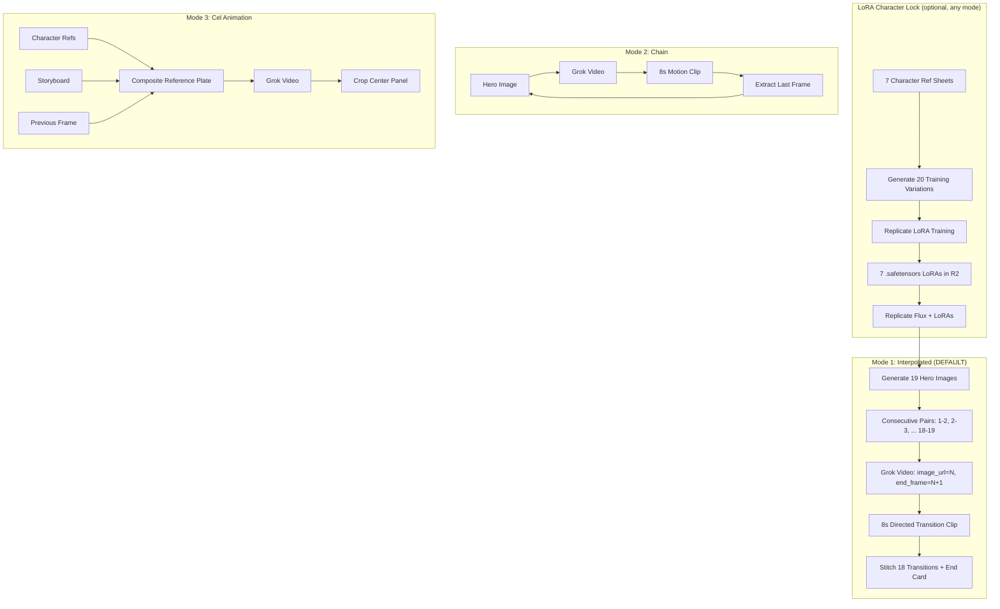

# Thera-World Congruent Generation Pipeline

## Architecture Overview

Four generation modes, each solving a different consistency problem. **Interpolated is the new default and recommended mode.**



### Why Interpolated is Best

The Interpolated pipeline sends `image_url` (start frame) AND `end_frame` (next scene) to Grok Video. The AI produces **directed** motion between two known images rather than random AI-generated motion from a single frame. This means:
- Characters move WITH purpose toward the next scene composition
- No drift, no random hallucinated motion
- No need for branch points -- every scene already has its hero image
- 18 transition clips (N to N+1) + 1 end card = 19 total
- No last-frame extraction needed -- next scene IS the end frame
- Stitch is trivial -- clips already flow into each other, no crossfade needed

## File Map

| File | Changes |
|------|---------|
| `backend/app/sse/infrastructure/replicate_client.py` | NEW -- Replicate API client (LoRA training + Flux generation) |
| `backend/app/sse/trailer_generator.py` | ADD end_frame to video gen, interpolated pipeline, chain pipeline, cel composite, narration merge, checkpoints |
| `backend/app/sse/studio_service.py` | ADD LoRA + interpolated service methods, cost updates, Replicate env guard |
| `backend/app/sse/studio_api.py` | ADD 5 LoRA + congruent-clips + resume + interpolated-trailer endpoints |
| `dashboard/studio.html` | ADD Character Lab tab, 4-mode selector, Resume button |

No changes to `requirements.txt` -- Replicate client uses raw `aiohttp`, Pillow already present.

---

## Pre-Flight: Grok Video API Verification (Fix 4)

Before any code changes, run these checks on deployed code:

```bash
grep -n 'grok-imagine-video' backend/app/sse/trailer_generator.py
grep -n 'grok-imagine-video' backend/app/sse/infrastructure/grok_imagine_client.py
grep -n '/v1/videos/' backend/app/sse/infrastructure/grok_imagine_client.py
grep -n '"done"' backend/app/sse/trailer_generator.py
grep -n 'video.*url' backend/app/sse/infrastructure/grok_imagine_client.py
```

ALL must return matches. The verified API spec:
- Model: `grok-imagine-video`
- Generate: `POST /v1/videos/generations`
- Poll: `GET /v1/videos/{request_id}` (NOT `/v1/videos/generations/`)
- Status: `"done"` with `progress == 100` means completed (normalized to `"completed"` in `grok_imagine_client.py`)
- Video URL: `response["video"]["url"]`
- Response field: `"request_id"` (not `"id"`)
- **NEW**: `end_frame` field (optional, URL string) for directed interpolation between start and end images

These fixes were already deployed in the previous session. This step confirms they survived.

---

## Phase 1: end_frame Support in Video Generation

Modify `_generate_video_from_image` in [backend/app/sse/trailer_generator.py](backend/app/sse/trailer_generator.py):

```python
async def _generate_video_from_image(
    image_url: str,
    motion_prompt: str,
    end_frame_url: str = None,  # NEW: optional end frame for interpolation
    duration_seconds: int = 5,
) -> dict:
    payload = {
        "model": "grok-imagine-video",
        "prompt": motion_prompt,
        "image_url": image_url,
    }
    if end_frame_url:
        payload["end_frame"] = end_frame_url
    # ... rest of function unchanged (POST, poll, return)
```

This is a 3-line diff: add parameter, add conditional dict key. All existing callers (independent mode, chain mode, cel mode) continue working unchanged because `end_frame_url` defaults to `None`.

---

## Phase 2: Interpolated Pipeline (NEW -- Primary Mode)

Add to [backend/app/sse/trailer_generator.py](backend/app/sse/trailer_generator.py):

```python
async def generate_interpolated_trailer(
    project_id: str, resume_from: int | None = None
) -> list[dict]:
    """Generate trailer using start+end frame interpolation.
    
    Each video transitions smoothly from one scene to the next
    because the AI interpolates between two known hero images.
    
    Pipeline:
    1. Load manifest — all 19 hero images must already exist (status=success)
    2. For each consecutive pair (1->2, 2->3, ... 18->19):
       Grok Video with image_url=Scene[N], end_frame=Scene[N+1]
    3. Scene 19 end card: standalone video (no end_frame)
    4. Save checkpoint after each successful transition
    5. Return list of transition clip results
    
    resume_from: Skip to transition starting at this scene number.
    Restores completed_clips from manifest chain_state.
    """
```

Key details:
- **Requires all 19 hero images to exist first** (generated via Scenes tab). Does NOT generate images -- only videos.
- Produces **18 transition clips** (scene 1->2 through 18->19) + **1 end card** (scene 19 standalone) = 19 videos total.
- Each transition clip stored at `sse/studio/projects/{project_id}/clips/transition_{NN}_to_{NN}.mp4`
- End card stored at `sse/studio/projects/{project_id}/clips/endcard_19.mp4`
- **Cost**: 19 x $4.00 = $76.00 (18 transitions + 1 end card)
- **Duration**: ~19 x 100s polling + 8s sleep = ~35 minutes total
- **Checkpoint**: after each successful clip, saves to manifest:

```python
manifest["chain_state"] = {
    "mode": "interpolated",
    "last_completed_transition": i,
    "completed_clips": [...],
    "total_cost_so_far": running_cost,
}
await _save_project_manifest(project_id, manifest)
```

- **Resume**: if `resume_from` is set, load `chain_state.completed_clips`, skip transitions already completed
- Uses `_gen_lock` to prevent concurrent generation (same pattern as existing `generate_motion_clips`)
- 8s sleep between Grok Video calls respects rate limits
- `stitch_trailer` works unchanged -- concatenate transition clips in order, no crossfade needed because each clip already flows into the next scene

---

## Phase 3: Replicate Client (`replicate_client.py` -- NEW)

New file at [backend/app/sse/infrastructure/replicate_client.py](backend/app/sse/infrastructure/replicate_client.py).

Env var: `REPLICATE_API_TOKEN`

Functions:

```python
async def train_lora(
    character_name: str,
    training_image_urls: list[str],
    trigger_word: str,
    destination: str,  # e.g. "sovereign-sanctuary/thera-boy"
) -> dict:
    """Start Flux LoRA training on Replicate.
    POST https://api.replicate.com/v1/models/{destination}/versions
    Returns {"training_id": str, "status": "starting"}
    """

async def poll_training(training_id: str) -> dict:
    """Poll training status.
    GET https://api.replicate.com/v1/trainings/{training_id}
    Returns {"status": "processing"|"succeeded"|"failed", "output": {...}}
    """

async def generate_with_loras(
    prompt: str,
    lora_urls: list[str],
    lora_scales: list[float] | None = None,
) -> bytes:
    """Generate image using Flux.1 Dev + stacked LoRAs.
    POST https://api.replicate.com/v1/predictions
    model: "black-forest-labs/flux-dev-lora"
    Returns raw image bytes.
    """
```

The client uses `aiohttp` directly (same pattern as `grok_imagine_client.py`) -- NOT the `replicate` Python SDK -- to keep dependencies minimal and avoid sync/async issues. This means we do NOT need to add `replicate` to requirements.txt.

---

## Phase 4: LoRA Training Image Generation

Add to [backend/app/sse/trailer_generator.py](backend/app/sse/trailer_generator.py):

```python
LORA_TRAINING_VARIATIONS = [
    "front view, golden meadow light",
    "profile view, dim forest light",
    "three-quarter view, dramatic storm sky",
    "crouching pose, campfire light",
    "running, motion blur, sunset",
    "close-up face, moonlight",
    "laughing, bright daylight",
    "looking up, scared, dark cave green glow",
    "sitting cross-legged, soft morning light",
    "walking away, rear three-quarter, dusk",
    "side view silhouette, backlit golden hour",
    "close-up hands and face, candlelight",
    "mid-action pose, rain, blue-gray light",
    "standing tall, wind blowing, overcast",
    "sleeping, peaceful, starlight",
    "angry expression, red-orange firelight",
    "wide shot small figure, vast landscape, noon",
    "underwater perspective, turquoise light",
    "from below looking up, dramatic clouds",
    "reflection in water, mirror image, twilight",
]

async def generate_lora_training_set(
    project_id: str, character: str, count: int = 20
) -> list[str]:
    """Generate training variations from a character's ref prompt.
    Uses CHARACTER_REFERENCES[character]["ref_prompt"] as base.
    Returns list of R2 URLs for the generated images.
    """
```

Each variation combines the character's `ref_prompt` with a variation suffix, generates via `generate_image()` (Grok Imagine), and stores at `sse/studio/projects/{project_id}/lora_training/{character}/img_{nn}.png`.

---

## Phase 5: Chain Pipeline with Resume Checkpoints (Fixes 2, 7)

Add to [backend/app/sse/trailer_generator.py](backend/app/sse/trailer_generator.py):

```python
BRANCH_POINTS = [1, 8, 15]  # Scenes that get fresh hero images

async def _extract_last_frame(video_bytes: bytes, scene_num: int) -> bytes:
    """FFmpeg: extract the last frame of a video clip.
    ffmpeg -sseof -0.1 -i input.mp4 -frames:v 1 output.png
    Returns PNG bytes. Uses tempfile.mkdtemp with finally cleanup.
    """

async def generate_chain_trailer(
    project_id: str, resume_from: int | None = None
) -> list[dict]:
    """Generate trailer using progressive chain method.
    Each scene extends from the previous scene's last frame.
    Branch points get fresh hero images with character reference consistency.
    
    resume_from: If set, loads chain_state from manifest and skips
    to the specified scene number, restoring previous_last_frame_url.
    
    After each successful scene, saves checkpoint to manifest:
        manifest["chain_state"] = {
            "last_completed_scene": scene_num,
            "previous_last_frame_url": url,
            "completed_scenes": [...],
            "total_cost_so_far": running_cost,
        }
    """
```

Key details:
- `_extract_last_frame` uses `subprocess.run` with `ffmpeg -sseof -0.1`, wraps temp files in `tempfile.mkdtemp()` + `shutil.rmtree()` in a `finally` block
- Last frames stored at `sse/studio/projects/{project_id}/chain/scene_{nn}_lastframe.png`
- At branch points (scenes 1, 8, 15), falls back to hero image generation but includes character refs from `CHARACTER_REFERENCES` in the prompt
- Between-scene sleep of 8s respects Grok API rate limits
- **Resume logic** (~15 lines): if `resume_from` is set, load `manifest["chain_state"]`, restore `previous_last_frame_url` and `completed_scenes`, skip to `resume_from`
- **Checkpoint save** after each scene: update `chain_state` dict in manifest, call `_save_manifest_to_r2(project_id, manifest)`

---

## Phase 6: Cel Animation Compositing (Fix 6)

Add to [backend/app/sse/trailer_generator.py](backend/app/sse/trailer_generator.py):

```python
async def _build_composite_plate(
    character_ref_images: list[bytes],
    storyboard_image: bytes,
    previous_last_frame: bytes | None,
) -> bytes:
    """Create a composite reference plate using PIL.
    Layout: [char refs stacked] | [storyboard center] | [prev frame]
    Returns JPEG bytes of the composite.
    
    All Image.open() calls use .convert("RGB") for RGBA/palette/grayscale safety.
    """

async def generate_cel_animation_clip(
    project_id: str,
    scene_num: int,
    character_refs: dict[str, str],
    storyboard_url: str,
    previous_last_frame_url: str | None,
    motion_prompt: str,
) -> dict:
    """Generate one scene using cel animation composite method.
    1. Download char refs + storyboard + previous frame
    2. Build composite plate (PIL, RGB-safe)
    3. Upload composite to R2
    4. Send to Grok Video with contextual animation prompt
    5. Crop output to center panel (remove ref strips)
    6. Extract last frame for chain to next scene
    All temp files in tempfile.mkdtemp with finally cleanup.
    """
```

PIL is already in `requirements.txt` (`Pillow~=10.4.0`). Every `Image.open()` call is followed by `.convert("RGB")` to handle RGBA PNGs, palette images, and grayscale inputs safely (Fix 6).

The cropping step after video generation removes the reference strips from the animated output using FFmpeg `crop` filter.

---

## Phase 7: Narration Audio Merge (Fix 5)

Add to [backend/app/sse/trailer_generator.py](backend/app/sse/trailer_generator.py):

```python
async def _merge_narration_audio(
    video_path: str,
    narration_files: dict[int, str],
    scene_offsets: dict[int, float],
    output_path: str,
) -> bool:
    """Merge scene narration audio tracks into the stitched video.
    
    For each scene with narration:
    1. Create silence-padded track: {offset}s silence + narration WAV
       FFmpeg: -f lavfi -t {offset} -i anullsrc -i scene_nn.wav
               -filter_complex "[0][1]concat=n=2:v=0:a=1"
    2. Mix all positioned tracks into one combined narration
    3. Overlay onto video: -c:v copy -c:a aac -map 0:v -map 1:a
    
    Returns True on success. Max 30 lines.
    """
```

Wire into `stitch_trailer()` after the raw video concat step:

```python
if include_narration and narration_files:
    scene_offsets = {}
    cumulative = 0.0
    for clip in successful:
        scene_offsets[clip["scene"]] = cumulative
        cumulative += 8.0  # each Grok Video clip is ~8s
    
    narrated = os.path.join(work_dir, "trailer_narrated.mp4")
    if await _merge_narration_audio(raw_output, narration_files, scene_offsets, narrated):
        raw_output = narrated  # downstream format conversion uses narrated version
```

This replaces the current behavior where narration is generated and stored but never muxed into the final video.

---

## Phase 8: Unified Pipeline Orchestrator (Fix 2 integrated)

Add to [backend/app/sse/trailer_generator.py](backend/app/sse/trailer_generator.py):

```python
async def generate_congruent_trailer(
    project_id: str,
    mode: str = "interpolated",  # "interpolated" | "chain" | "cel" | "independent"
    use_lora: bool = False,
    resume_from: int | None = None,
) -> dict:
    """Master orchestrator for congruent trailer generation.
    
    Modes (in order of quality):
    - "interpolated": Start+end frame interpolation (DEFAULT, best quality)
    - "chain": Each scene extends from previous last frame
    - "cel": Composite reference plates with char refs + prev frame
    - "independent": Original mode (each scene generated separately)
    
    When use_lora=True, hero images at branch points use
    Replicate Flux + trained LoRAs instead of Grok Imagine.
    
    resume_from: Resume from a specific scene/transition (loads checkpoint).
    
    Saves checkpoint after every successful clip.
    """
```

Dispatch logic:
- `"interpolated"` -> `generate_interpolated_trailer(project_id, resume_from)`
- `"chain"` -> `generate_chain_trailer(project_id, resume_from)`
- `"cel"` -> loop calling `generate_cel_animation_clip()` per scene
- `"independent"` -> existing `generate_motion_clips(project_id)`

This function dispatches to the appropriate sub-pipeline based on `mode`, tracks costs, writes `video_manifest.json` with full metadata, and persists `chain_state` for resume capability.

---

## Phase 9: Service Layer (Fixes 1, 3)

Add to [backend/app/sse/studio_service.py](backend/app/sse/studio_service.py):

**Replicate env guard (Fix 1, ~5 lines at module scope):**
```python
_replicate_available = bool(os.getenv("REPLICATE_API_TOKEN"))
if not _replicate_available:
    print("[STUDIO] WARNING: REPLICATE_API_TOKEN not set — LoRA features disabled")
```

**Updated cost constants (Fix 3):**
```python
COST_PER_VIDEO_CENTS = 400       # was 25, now $4.00 per Grok Video clip
COST_PER_LORA_TRAINING_CENTS = 500  # ~$5.00 per character
COST_PER_LORA_IMAGE_CENTS = 2       # ~$0.02 per Replicate Flux image
_COST_CAP_CENTS = int(os.getenv("SSE_STUDIO_DAILY_CAP_CENTS", "15000"))  # was 2500, now $150
```

**New methods:**
- `generate_lora_training_images(project_id, character, redis)` -- checks `_replicate_available`, wraps `generate_lora_training_set`
- `train_character_lora(project_id, character, image_urls, redis)` -- checks `_replicate_available`, wraps `replicate_client.train_lora`
- `check_lora_status(training_id)` -- checks `_replicate_available`, wraps `replicate_client.poll_training`
- `generate_with_lora(prompt, lora_names, scene_num, project_id, redis)` -- checks `_replicate_available`, wraps `replicate_client.generate_with_loras`
- `test_lora(character, test_prompt, redis)` -- checks `_replicate_available`, quick test generation
- `generate_congruent_clips(project_id, mode, use_lora, db_pool, redis, resume_from=None)` -- wraps `generate_congruent_trailer`
- `generate_interpolated_clips(project_id, db_pool, redis, resume_from=None)` -- shortcut that calls `generate_congruent_clips(..., mode="interpolated")`

All LoRA methods return `{"error": "LoRA features require REPLICATE_API_TOKEN", "status": "disabled"}` when `_replicate_available` is False.

---

## Phase 10: API Endpoints (Fix 1 integrated)

Add to [backend/app/sse/studio_api.py](backend/app/sse/studio_api.py):

| Method | Path | Purpose | LoRA-gated? |
|--------|------|---------|-------------|
| POST | `/generate-training-images` | Generate 20 LoRA training variations for a character | Yes |
| POST | `/train-lora` | Start LoRA training on Replicate | Yes |
| GET | `/lora-status/{training_id}` | Poll LoRA training status | Yes |
| POST | `/generate-with-lora` | Generate scene image using trained LoRAs | Yes |
| POST | `/test-lora` | Quick test of a trained LoRA | Yes |
| POST | `/generate-congruent-clips` | Run the full interpolated/chain/cel pipeline | No |
| POST | `/generate-interpolated-trailer` | Shortcut: run interpolated pipeline directly | No |
| POST | `/resume-generation` | Resume from last checkpoint | No |

All endpoints under existing admin-gated router (`/api/sse/admin/studio`).

LoRA-gated endpoints check `_replicate_available` from `studio_service` and return early with `{"error": "...", "status": "disabled"}` if False (~5 lines in `studio_api.py` as a shared guard).

**`/generate-interpolated-trailer`** endpoint:
```python
# POST body: {"project_id": str}
# Runs as BackgroundTasks
# Returns: {"status": "started", "estimated_cost": "$76.00", "clips": 19}
```
Calls `generate_congruent_clips(project_id, mode="interpolated", ...)` via `BackgroundTasks`.

**`/resume-generation`** endpoint reads `chain_state` from the project manifest and calls the appropriate pipeline with the resume offset.

---

## Phase 11: Dashboard UI

Modify [dashboard/studio.html](dashboard/studio.html):

1. Add `characterLab` tab between `scenes` and `pipeline`:
   - Tab array: `['script', 'scenes', 'characterLab', 'pipeline', 'library']`
   - Grid of 7 character cards showing: ref image, LoRA training status, training image count
   - "Generate Training Images" button per character
   - "Train LoRA" button (with Replicate cost estimate)
   - "Test LoRA" button with preview area

2. Update Pipeline tab:
   - Add generation mode selector with **4 options**:
     `Independent` | `Chain` | `Cel Animation` | `Interpolated ★`
   - **Interpolated is the default and recommended mode**
   - Label: "Interpolated (Start->End Frame) -- Best Quality"
   - Explanation text: "Each video transitions smoothly between consecutive scene images. The AI interpolates the motion path from Scene N to Scene N+1, producing directed cinematic movement instead of random AI-generated motion."
   - Add LoRA toggle: `[x] Use LoRA character lock (Replicate Flux)`
   - Update cost estimate display to reflect $4.00/clip pricing:
     - Independent/Chain/Cel: 19 clips x $4.00 = $76.00
     - Interpolated: 18 transitions + 1 end card = 19 clips x $4.00 = $76.00
   - Add progress display showing pipeline status (which transition, progress %)
   - **Add "Resume Generation" button** that reads `chain_state` from project manifest and resumes from the next clip

---

## Temp File Cleanup Audit (Fix 7)

Every function that writes to `/tmp` must use `tempfile.mkdtemp()` with `shutil.rmtree()` in a `finally` block. Functions to verify/fix:

| Function | Current state | Action |
|----------|--------------|--------|
| `stitch_trailer` | Already has `finally: shutil.rmtree(work_dir)` | No change |
| `_generate_all_narration` | Receives `work_dir` from caller | Caller must clean up |
| `_ken_burns_fallback` | Already has `shutil.rmtree` in `generate_motion_clips` | No change |
| `generate_interpolated_trailer` | NEW | No temp files needed (downloads go to R2 directly) |
| `generate_chain_trailer` | NEW | Must wrap in `tempfile.mkdtemp` + `finally` cleanup |
| `generate_cel_animation_clip` | NEW | Must wrap in `tempfile.mkdtemp` + `finally` cleanup |
| `_extract_last_frame` | NEW | Must use `tempfile.mkdtemp` internally + `finally` cleanup |
| `_merge_narration_audio` | NEW | Must use `tempfile.mkdtemp` internally + `finally` cleanup |
| `_build_composite_plate` | NEW | PIL in-memory only, no temp files needed |

---

## Cost Model

### Interpolated Mode (Default)

| Component | Cost | When |
|-----------|------|------|
| Grok Video transitions | ~$4/clip x 18 = ~$72 | Per trailer (18 transition clips) |
| Grok Video end card | ~$4 x 1 = ~$4 | Per trailer (scene 19 standalone) |
| Azure TTS narration | ~$0.01/scene x 12 = ~$0.12 | Per trailer |
| **Total per run** | **~$76.12** | No LoRA needed for interpolated mode |

### With LoRA Character Lock (any mode)

| Component | Cost | When |
|-----------|------|------|
| LoRA training | ~$5/character x 7 = ~$35 | One-time setup |
| LoRA scene images | ~$0.02/image x 19 = ~$0.38 | Per trailer run |
| Grok Video clips | ~$4/clip x 19 = ~$76 | Per trailer run |
| Azure TTS narration | ~$0.01/scene x 12 = ~$0.12 | Per trailer run |
| **Total per run** | **~$76.50** | (after initial $35 LoRA training) |

Daily cap: `SSE_STUDIO_DAILY_CAP_CENTS` default raised to `15000` ($150) to accommodate 1 full trailer + retries.

---

## Deployment Order

1. **Verify Grok Video API** (Fix 4) -- grep deployed files, confirm all matches
2. **Deploy end_frame support** -- 3-line diff to `_generate_video_from_image`
3. **Deploy interpolated pipeline** -- `generate_interpolated_trailer` + checkpoint logic
4. **Deploy small fixes** (Fixes 1, 3, 6) -- Replicate env guard, daily cap, PIL RGB safety
5. **Deploy chain/cel pipelines** -- chain resume, cel composite, last-frame extraction
6. **Deploy narration merge** (Fix 5) -- `_merge_narration_audio` + stitch_trailer wiring
7. **Deploy temp cleanup** (Fix 7) -- audit all new functions
8. **Deploy all files to GREEN** via `scp`
9. `docker restart nate_backend`
10. **Verify** `112/112 services healthy`
11. **Smoke test**: generate ONE scene image + ONE video clip via Studio UI
12. If both succeed, **generate the full trailer**: 19 images first, then 18 interpolated videos + end card

---

## What NOT to Change

- `bridge_server.py` -- no changes needed
- `littlenate_inference.py` -- no changes needed
- `main.py` -- studio_router already registered
- `grok_imagine_client.py` -- already correct (model names, poll logic, cost tracking); `end_frame` is pass-through in payload
- Existing `generate_motion_clips` -- preserved as "independent" mode fallback
- Existing `stitch_trailer` -- enhanced with narration merge, not replaced; works unchanged for interpolated clips (concat in order, no crossfade needed)
