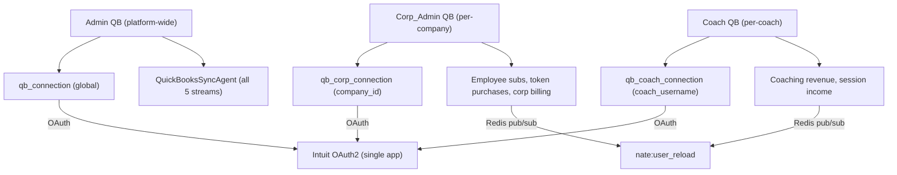

# Corp_Admin + Coach QuickBooks Self-Service

## Current State

- QuickBooks integration (`qb_connection`, `qb_sync_log`, `qb_account_mapping`) is platform-global -- one connection controlled by DrNevedal1
- Corp_Admins have billing views (Stripe invoices, billing overview) and CSV engagement exports, but zero QB access
- Coaches have a 4-tab Flutter portal (Clients, Calendar, Sessions, Nate AI) with no financial tools or QB access
- Coaches earn 70% revenue share on coaching packs (tracked in `signup_sharing_ledger`) but have no way to sync payouts to their own accounting

## Architecture




## Production Pattern Compliance

### Pattern 1: OAuth Callback Auth Separation

The existing admin QB callback is on a `require_admin` router, but Intuit's OAuth redirect arrives as a plain browser GET with no bearer token. Following the SkyEye pattern (`skyeye_api.oauth_router`), each new router file creates TWO routers:

- **Auth-gated router** (for connect, status, disconnect, sync, mapping) -- `dependencies=[Depends(require_corp_admin)]` or `[Depends(require_coach)]`
- **Public oauth_router** (for callback only) -- no auth dependency, registered separately in `main.py`

The callback extracts `company_id` or `coach_username` from the `state` parameter to scope the token storage.

### Pattern 2: Redis Pub/Sub After Sync

When QB sync modifies user-facing data (e.g., marks transactions as synced), publish to bridge cache channels:

```python
from app.services.api_server import _get_auth_redis
r = await _get_auth_redis()
if r:
    await r.publish("nate:user_reload", json.dumps({"username": username}))
```

This ensures the bridge's in-memory cache stays consistent after direct DB writes.

### Pattern 3: Exponential Backoff + Jitter on QB API Calls

All QB API calls (creating invoices, sales receipts, etc.) must use retry with exponential backoff matching the platform adapter pattern in `skyeye_platform_base.py`:

```python
async def _qb_api_with_retry(self, session, method, path, token, realm_id, json_body=None,
                              max_retries=3, base_delay=1.0, max_delay=30.0):
    for attempt in range(max_retries + 1):
        result = await self._qb_api(session, method, path, token, realm_id, json_body)
        if result is not None:
            return result
        if attempt < max_retries:
            delay = min(base_delay * (2 ** attempt), max_delay)
            jitter = random.uniform(0, delay * 0.1)
            await asyncio.sleep(delay + jitter)
    return None
```

### Pattern 4: Sentinel Skip List

Corp and coach QB endpoints are REST-only (no WebSocket handlers), so no `_SENTINEL_SKIP` additions needed. If future WebSocket handlers are added for QB status polling, they must be added to the skip list.

### Pattern 5: Router Registration in main.py

Both new router files follow the optional router pattern (wrapped in `try/except`):

```python
try:
    from app.routers.corp_quickbooks_api import router as corp_qb_router, oauth_router as corp_qb_oauth_router
    app.include_router(corp_qb_router)
    app.include_router(corp_qb_oauth_router)
except Exception as _cqb_err:
    logger.warning("Corp QB router failed to load: %s", _cqb_err)

try:
    from app.routers.coach_quickbooks_api import router as coach_qb_router, oauth_router as coach_qb_oauth_router
    app.include_router(coach_qb_router)
    app.include_router(coach_qb_oauth_router)
except Exception as _chqb_err:
    logger.warning("Coach QB router failed to load: %s", _chqb_err)
```

No new `app.state` entries or `_service_checks` additions needed -- these are on-demand sync routers, not background agents.

### Pattern 6: 5-Location Auditor Sync

Corp QB checks are added to the **existing** `corporate_command_auditor.py` `TAB_ENDPOINTS` (expanding its count from 12 to ~21). Coach QB checks are added to the **existing** `coach_dojo_auditor.py` `TAB_ENDPOINTS` (expanding its count from 46 to ~55). No new auditor agent files needed -- we expand existing auditors.

All 5 locations:


| #   | Location                                        | Corp change                                               | Coach change                                          |
| --- | ----------------------------------------------- | --------------------------------------------------------- | ----------------------------------------------------- |
| 1   | `TAB_ENDPOINTS` in auditor `.py`                | Add 9 Corp QB endpoints to `corporate_command_auditor.py` | Add 9 Coach QB endpoints to `coach_dojo_auditor.py`   |
| 2   | `AUDITOR_ACTIVITY_TYPES` in `trust_enforcer.py` | No change (same activity type)                            | No change (same activity type)                        |
| 3   | `AUDITOR_LABELS` in `trust_enforcer.py`         | No change                                                 | No change                                             |
| 4   | `_baseline_key_for()` in `trust_enforcer.py`    | No change (same baseline key)                             | No change (same baseline key)                         |
| 5   | `trust_baseline` table                          | UPDATE `corporate_command_check_count` expected: 12 -> 21 | UPDATE `coach_dojo_endpoint_count` expected: 46 -> 55 |


Stagger slots unchanged -- no new auditor agents created, so no new staggers needed.

### Pattern 7: Agent Status Digest

Add Corp/Coach QB router health mention to the existing "Billing / Accounts" section in [agent_status_digest.py](backend/app/services/agent_status_digest.py). Since these are routers (not agents), they get a router-health check pattern, not an agent lifecycle check.

### Pattern 8: load_dotenv Safety

Both new router files must NOT use `load_dotenv(override=True)`. They read `QB_CLIENT_ID`, `QB_CLIENT_SECRET`, `QB_ENVIRONMENT` from `os.getenv()` at module scope (same pattern as existing `quickbooks_api.py`).

### Pattern 9: Dashboard API Base URL

All dashboard HTML files that call the backend API from `command.sovereignsanctuary.net` must set:

```javascript
var API = (window.location.hostname === 'localhost' || window.location.hostname === '127.0.0.1')
    ? 'http://localhost:8000' : 'https://api.sovereignsanctuary.net';
```

Never use empty string `''` -- that sends requests to the nginx static file server, not the API.

### Pattern 10: Empty Response Prevention

All new endpoints must return structurally non-empty responses. Never return `{}`. Use `{"status": "ok"}`, `[]`, or `{"data": []}`.

## What Changes

### 1. Database Migration (086)

**Corp tables:**

- `qb_corp_connection` -- mirrors `qb_connection` + `company_id UUID REFERENCES corporate_sponsors(id)` (UNIQUE on `company_id`)
- `qb_corp_sync_log` -- mirrors `qb_sync_log` + `company_id`
- `qb_corp_account_mapping` -- `company_id` + `internal_category` (UNIQUE on `(company_id, internal_category)`, CHECK on valid categories)

**Coach tables:**

- `qb_coach_connection` -- mirrors `qb_connection` + `coach_username VARCHAR(100)` (UNIQUE on `coach_username`)
- `qb_coach_sync_log` -- mirrors `qb_sync_log` + `coach_username`
- `qb_coach_account_mapping` -- `coach_username` + `internal_category` (UNIQUE on `(coach_username, internal_category)`, CHECK on valid categories)

**Tracking columns:**

- Add `synced_to_corp_qb BOOLEAN DEFAULT FALSE` to `payment_history` and `token_transactions`
- Add `synced_to_coach_qb BOOLEAN DEFAULT FALSE` to `signup_sharing_ledger`

**Trust baseline seeds:**

- `UPDATE trust_baseline SET parameter_value = '{"expected": 21}'::jsonb WHERE parameter_key = 'corporate_command_check_count'`
- `UPDATE trust_baseline SET parameter_value = '{"expected": 55}'::jsonb WHERE parameter_key = 'coach_dojo_endpoint_count'`

### 2. Corp QB Router (`/api/corp/quickbooks/*`)

Two FastAPI routers in `corp_quickbooks_api.py`:

**Auth-gated router** (`dependencies=[Depends(require_corp_admin)]`):

- `GET /health` -- service check
- `GET /connect` -- generate OAuth URL with `state=corp_qb_{company_id}`, redirect_uri points to oauth_router callback
- `GET /status` -- connection status for this company
- `POST /disconnect` -- revoke tokens, delete from `qb_corp_connection`
- `POST /sync/trigger` -- manual sync with backoff+jitter on each QB API call
- `GET /sync/history` -- sync log filtered by `company_id`
- `GET /account-mapping` -- get mappings for this company
- `POST /account-mapping` -- set mapping for this company

**Public oauth_router** (no auth, separate registration in `main.py`):

- `GET /callback` -- exchange code for tokens using `state` to extract `company_id`, store in `qb_corp_connection`, return HTML redirect to `corporate_command.html#qb_connected`

### 3. Coach QB Router (`/api/coach/quickbooks/*`)

Two FastAPI routers in `coach_quickbooks_api.py`:

**Auth-gated router** (`dependencies=[Depends(require_coach)]`):

- `GET /health` -- service check
- `GET /connect` -- generate OAuth URL with `state=coach_qb_{username}`
- `GET /status` -- connection status for this coach
- `POST /disconnect` -- revoke tokens, delete from `qb_coach_connection`
- `POST /sync/trigger` -- manual sync with backoff+jitter
- `GET /sync/history` -- sync log filtered by `coach_username`
- `GET /account-mapping` -- get mappings for this coach
- `POST /account-mapping` -- set mapping for this coach

**Public oauth_router** (no auth):

- `GET /callback` -- exchange code, extract `coach_username` from `state`, store in `qb_coach_connection`, return HTML success page with "Return to app" link

### 4. Corp QB Sync Logic

On-demand sync (manual trigger only, not background agent):

- **Employee Subscriptions**: `payment_history` WHERE username belongs to a user with `company_id = X` AND `synced_to_corp_qb = FALSE`
- **Employee Token Purchases**: `token_transactions` WHERE username's `company_id = X` AND `synced_to_corp_qb = FALSE`
- **Corporate Billing**: Invoices for this company's Stripe customer

Each QB API call uses `_qb_api_with_retry` (exponential backoff, max 3 retries, 1s base, 30s max, 10% jitter). After sync, publish `nate:user_reload` to Redis for affected usernames.

### 5. Coach QB Sync Logic

On-demand sync (manual trigger only):

- **Coaching Revenue**: `signup_sharing_ledger` WHERE `coach_id` matches the coach's `hardware_id` AND `status = 'completed'` AND `synced_to_coach_qb = FALSE` -- creates QB Sales Receipts for the 70% payout
- **Session Income**: Aggregated `sessions` data for the coach (count, hours) as descriptive line items

Same retry/backoff pattern as corp sync.

### 6. Corporate Command Dashboard: QuickBooks Tab

Add a 7th tab ("QuickBooks") to [dashboard/corporate_command.html](dashboard/corporate_command.html):

- Connection status card (connected/disconnected, company name, last sync)
- Connect/Disconnect buttons (OAuth flow)
- Account mapping form (3 categories: employee_subscriptions, employee_tokens, corporate_billing)
- Sync history table with status indicators
- Manual Sync button
- API base URL: `https://api.sovereignsanctuary.net` (not empty string)

### 7. Coach Portal: QuickBooks Tab (Flutter)

Add a 5th tab to the coach portal in [coach_portal_v2_complete.dart](mobile/lib/screens/coach_portal_v2_complete.dart):

- `_TabItem(icon: Icons.account_balance, label: 'QuickBooks')` added to `_tabs` list
- Connection status card showing QB connected/disconnected
- "Connect to QuickBooks" button -- `url_launcher` opens Intuit OAuth in system browser
- OAuth flow: browser -> Intuit -> callback returns HTML success page -> coach returns to app -> polls `/api/coach/quickbooks/status` to confirm
- Disconnect button
- Account mapping (2 categories: coaching_revenue, session_income)
- Sync history list fetched via REST
- Manual Sync button
- All REST calls use `Authorization: Bearer ${widget.currentUserProfile['token']}`

### 8. Callback Routing

Three separate callback endpoints on public oauth_routers (no auth), one per role:

- `/api/admin/quickbooks/callback` -- existing, platform-wide, `state=qb_connect` (NOTE: must be moved to a public oauth_router too -- currently broken on admin router with `require_admin`)
- `/api/corp/quickbooks/callback` -- company-scoped, `state=corp_qb_{company_id}`
- `/api/coach/quickbooks/callback` -- coach-scoped, `state=coach_qb_{username}`

All use the same Intuit app credentials (`QB_CLIENT_ID`, `QB_CLIENT_SECRET`). Each OAuth grant connects to a different QB company file (each returning a unique `realmId`).

## What You Need to Do on the Intuit Developer Portal

Your approved app (`Corp_SovereignQSyncBX`) supports multi-company connections out of the box. You need to add two redirect URIs:

1. Go to your app `Corp_SovereignQSyncBX` on the Intuit Developer portal
2. Navigate to **Keys & credentials** (Development, then Production when ready)
3. Under **Redirect URIs**, add both:
  - `https://api.sovereignsanctuary.net/api/corp/quickbooks/callback`
  - `https://api.sovereignsanctuary.net/api/coach/quickbooks/callback`
4. Save

No scope changes needed. No re-submission required.

## Files to Create/Modify

- **Create**: `backend/migrations/086_multi_tenant_quickbooks.sql` -- corp + coach QB tables + tracking columns + baseline updates
- **Create**: `backend/app/routers/corp_quickbooks_api.py` -- Corp QB router + public oauth_router
- **Create**: `backend/app/routers/coach_quickbooks_api.py` -- Coach QB router + public oauth_router
- **Modify**: [dashboard/corporate_command.html](dashboard/corporate_command.html) -- add QuickBooks tab (7th tab)
- **Modify**: [mobile/lib/screens/coach_portal_v2_complete.dart](mobile/lib/screens/coach_portal_v2_complete.dart) -- add QuickBooks tab (5th tab)
- **Modify**: [backend/app/services/corporate_command_auditor.py](backend/app/services/corporate_command_auditor.py) -- add 9 Corp QB endpoints to TAB_ENDPOINTS
- **Modify**: [backend/app/services/coach_dojo_auditor.py](backend/app/services/coach_dojo_auditor.py) -- add 9 Coach QB endpoints to TAB_ENDPOINTS
- **Modify**: [backend/app/main.py](backend/app/main.py) -- register 4 new routers (2 auth-gated + 2 oauth) in try/except blocks
- **Modify**: [backend/app/services/agent_status_digest.py](backend/app/services/agent_status_digest.py) -- add Corp/Coach QB to Billing/Accounts section
- **Modify**: [backend/app/routers/quickbooks_api.py](backend/app/routers/quickbooks_api.py) -- move admin callback to a separate public oauth_router (fix existing auth bug)

## Security Hardening (7 Fixes)

### Fix 1: OAuth State CSRF Protection (Critical)

**Problem:** Current admin callback receives `state` but never validates it. An attacker could craft a redirect to inject their own QB company connection into the platform.

**Solution:** All 3 callbacks (admin, corp, coach) use cryptographic state tokens:

```python
import secrets

# On /connect — generate state, store in Redis with 5-min TTL
state_token = secrets.token_urlsafe(32)
state_key = f"qb_oauth_state:{state_token}"
await redis.setex(state_key, 300, json.dumps({
    "role": "corp_admin",  # or "coach", "admin"
    "scope_id": company_id,  # or coach_username, "platform"
}))
# Include state_token in OAuth URL params

# On /callback — validate state before exchanging code
state_data = await redis.get(f"qb_oauth_state:{state}")
if not state_data:
    raise HTTPException(400, "Invalid or expired OAuth state")
await redis.delete(f"qb_oauth_state:{state}")  # one-time use
parsed = json.loads(state_data)
# Use parsed["scope_id"] to store tokens in the correct row
```

This prevents CSRF on OAuth callbacks, ensures one-time use, and scopes the callback to the correct entity.

### Fix 2: QB Token Encryption at Rest (Critical)

**Problem:** QB access and refresh tokens are stored in plaintext in `qb_connection`. SkyEye platform tokens use `TokenCipher` (Fernet) -- QB should too.

**Solution:** Reuse the existing `TokenCipher` from [skyeye_platform_base.py](backend/app/services/skyeye_platform_base.py) keyed by `SKYEYE_TOKEN_ENCRYPTION_KEY`:

```python
from app.services.skyeye_platform_base import TokenCipher

cipher = TokenCipher()  # reads SKYEYE_TOKEN_ENCRYPTION_KEY from env

# On store (callback, token refresh):
encrypted_access = cipher.encrypt(tokens["access_token"])
encrypted_refresh = cipher.encrypt(tokens["refresh_token"])
await conn.execute("INSERT INTO qb_corp_connection (..., access_token, refresh_token, ...) VALUES (..., $1, $2, ...)",
                   encrypted_access, encrypted_refresh)

# On read (sync, status check):
row = await conn.fetchrow("SELECT * FROM qb_corp_connection WHERE company_id = $1", company_id)
access_token = cipher.decrypt(row["access_token"])
refresh_token = cipher.decrypt(row["refresh_token"])
```

Applied to all 3 connection tables: `qb_connection`, `qb_corp_connection`, `qb_coach_connection`.

The existing admin QB router (`quickbooks_api.py`) and sync agent (`quickbooks_sync_agent.py`) must also be retrofitted to encrypt/decrypt.

### Fix 3: Log Sanitization (Critical)

**Problem:** QB sync agent logs raw API response bodies (`body[:200]`) which could contain token fragments or PII. Uses standard `logging.getLogger` instead of `get_secure_logger`.

**Solution:**

- Switch all QB files to `get_secure_logger(__name__)` from [secure_logger.py](backend/app/secure_logger.py)
- Replace `logger.error("... %s", body)` with `logger.error("... status=%d", resp.status)` -- never log response bodies from Intuit
- Mask QB tokens in any debug output: `token[:8] + "..."` (matching bridge pattern)
- Apply to: `quickbooks_api.py`, `quickbooks_sync_agent.py`, `corp_quickbooks_api.py`, `coach_quickbooks_api.py`

### Fix 4: XSS Prevention in Corporate Command Dashboard (Moderate)

**Problem:** Employee `name`, `email`, `username` from API responses are inserted via `innerHTML` without HTML escaping. A malicious CSV import with `<script>` in a name field executes in the Corp_Admin's browser.

**Solution:**

- Create a helper function for safe rendering:

```javascript
function esc(s) { var d = document.createElement('div'); d.textContent = s || ''; return d.innerHTML; }
```

- Replace all `innerHTML` table rendering that includes user data with escaped values: `esc(r.name)` instead of `r.name`
- Apply to: existing employee roster table, new QB sync history table, account mapping display
- Also apply to new QB tab in `corporate_command.html`

### Fix 5: Per-User Rate Limiting on QB Endpoints (Moderate)

**Problem:** No rate limiting on Corp/Coach QB connect, disconnect, or sync trigger endpoints. A compromised token could hammer the QB API and get the Intuit app rate-limited or suspended.

**Solution:** In-memory rate limiter per user per endpoint group:

```python
from collections import defaultdict
import time

_rate_limits: Dict[str, list] = defaultdict(list)
RATE_WINDOW = 3600  # 1 hour
MAX_SYNC_PER_HOUR = 10
MAX_AUTH_PER_HOUR = 30

def _check_rate(user_id: str, action: str, limit: int):
    key = f"{user_id}:{action}"
    now = time.time()
    _rate_limits[key] = [t for t in _rate_limits[key] if now - t < RATE_WINDOW]
    if len(_rate_limits[key]) >= limit:
        raise HTTPException(429, f"Rate limit exceeded: max {limit} {action} per hour")
    _rate_limits[key].append(now)
```

Applied to: `/sync/trigger` (10/hour), `/connect` + `/disconnect` (30/hour combined).

### Fix 6: Input Validation Hardening (Moderate)

**Problem:** `create-corp-admin` in [admin.py](backend/app/routers/admin.py) has no field constraints. `reset_employee_password` returns temp password in JSON.

**Solution:**

- Add Pydantic `Field` constraints to `CreateCorpAdminRequest`:

```python
class CreateCorpAdminRequest(BaseModel):
    username: str = Field(..., min_length=3, max_length=50, pattern=r'^[a-zA-Z0-9_]+$')
    password: str = Field(..., min_length=8, max_length=128)
    email: str = Field(..., pattern=r'^[^@\s]+@[^@\s]+\.[^@\s]+$')
    company_id: str
    name: Optional[str] = Field(None, max_length=200)
```

- Remove `temp_password` from `reset_employee_password` response. Instead set `force_password_reset: true` in `profile_data` and return `{"status": "ok", "message": "Password reset. User must set new password on next login."}`. The bridge login flow already checks `force_password_reset`.

### Fix 7: Admin QB Callback Fix (Critical -- existing bug)

**Problem:** The existing `/api/admin/quickbooks/callback` sits on the `require_admin` router. Intuit's OAuth redirect is a plain browser GET with no bearer token, so it returns 401. This means the admin QB OAuth flow is currently non-functional via browser redirect.

**Solution:**

- Create a separate `admin_qb_oauth_router = APIRouter(prefix="/api/admin/quickbooks", tags=["quickbooks-oauth"])` with no auth dependency
- Move the `/callback` endpoint to this router
- Add CSRF state validation (Fix 1)
- Add token encryption (Fix 2)
- Register `admin_qb_oauth_router` in `main.py` alongside the auth-gated admin QB router

## Security Boundaries

- **Corp_Admins**: can only see/sync data for users where `users.company_id` matches their company -- cannot see GKM donations, other companies' data, or coach payouts
- **Coaches**: can only see/sync their own `signup_sharing_ledger` records and their own session data -- cannot see other coaches' earnings, client billing, or platform revenue
- **Admin (DrNevedal1)**: retains the global QB connection for full platform financial oversight across all streams
- Each role's QB tokens are stored in separate tables, encrypted at rest via Fernet -- disconnecting one does not affect the others
- OAuth callbacks are on public routers (no auth) but protected by cryptographic CSRF state tokens (one-time use, 5-min TTL, stored in Redis)
- Per-user rate limiting prevents QB API abuse via compromised tokens
- No user-supplied data rendered via `innerHTML` without escaping
- No raw API response bodies or tokens in logs
- No `load_dotenv(override=True)` in any new file
- All new endpoints return structurally non-empty responses (never `{}`)
- Corp_Admin account creation requires password >= 8 chars, valid email format, and alphanumeric username

## Files to Create/Modify (Updated)

- **Create**: `backend/migrations/086_multi_tenant_quickbooks.sql` -- corp + coach QB tables + tracking columns + baseline updates
- **Create**: `backend/app/routers/corp_quickbooks_api.py` -- Corp QB router + public oauth_router (with CSRF state, token encryption, rate limiting, secure logger)
- **Create**: `backend/app/routers/coach_quickbooks_api.py` -- Coach QB router + public oauth_router (same security stack)
- **Modify**: [backend/app/routers/quickbooks_api.py](backend/app/routers/quickbooks_api.py) -- split callback to public oauth_router, add CSRF state validation, add token encryption, switch to secure logger
- **Modify**: [backend/app/services/quickbooks_sync_agent.py](backend/app/services/quickbooks_sync_agent.py) -- decrypt tokens before use, switch to secure logger, stop logging response bodies
- **Modify**: [backend/app/routers/admin.py](backend/app/routers/admin.py) -- add Field constraints to CreateCorpAdminRequest, remove temp_password from reset response
- **Modify**: [dashboard/corporate_command.html](dashboard/corporate_command.html) -- add QuickBooks tab (7th tab), fix XSS (esc() helper on all user data), fix API base URL
- **Modify**: [mobile/lib/screens/coach_portal_v2_complete.dart](mobile/lib/screens/coach_portal_v2_complete.dart) -- add QuickBooks tab (5th tab)
- **Modify**: [backend/app/services/corporate_command_auditor.py](backend/app/services/corporate_command_auditor.py) -- add 9 Corp QB endpoints to TAB_ENDPOINTS
- **Modify**: [backend/app/services/coach_dojo_auditor.py](backend/app/services/coach_dojo_auditor.py) -- add 9 Coach QB endpoints to TAB_ENDPOINTS
- **Modify**: [backend/app/main.py](backend/app/main.py) -- register 6 routers (3 auth-gated + 3 public oauth) in try/except blocks
- **Modify**: [backend/app/services/agent_status_digest.py](backend/app/services/agent_status_digest.py) -- add Corp/Coach QB to Billing/Accounts section

