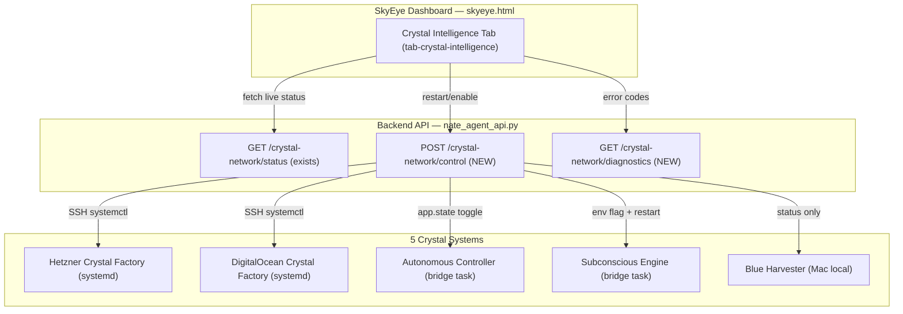
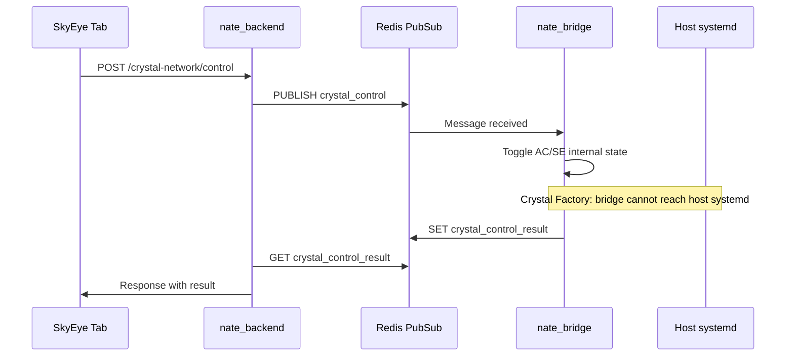

# Crystal Intelligence Dashboard — Live Controls and Assessment Fixes

## Current State

The HTML at `~/Downloads/crystal-intelligence-architecture.html` is a **static** architecture document with hardcoded values (34,068 crystals, 2.72 ExaFLOPS, ~7/min). The live system has **45,030** crystals producing ~378/hour. Three of four dedicated crystal systems are degraded or offline:

- **Hetzner Crystal Factory**: running but failing to connect to PostgreSQL (`10.13.13.2:5432` connection refused via WireGuard)
- **DigitalOcean Crystal Factory**: stopped for 33+ hours, not auto-restarting despite `Restart=always` in systemd
- **Autonomous Controller**: running, 10/10 health gates, but producing **zero** crystals (fragments found but not synthesizing)
- **Subconscious Engine**: explicitly disabled (`ENABLE_SUBCONSCIOUS=false`)
- **Blue Harvester**: not running (manual Mac-local process)

## Architecture




## Part 1: Backend + Bridge — Control Architecture

### Container Boundary Problem (Solved)

The backend (`nate_backend`) and bridge (`nate_bridge`) run in separate Docker containers. Neither has `openssh-client` or `systemctl`. The Autonomous Controller and Subconscious Engine are bridge-side local variables (not on `app.state` in the backend). Crystal Factory services are host-level systemd processes unreachable from inside Docker.

**Solution**: Redis pub/sub as IPC between backend and bridge. The backend publishes control commands; the bridge subscribes and acts on them.




### 1A. Backend: `POST /api/nate-agent/admin/crystal-network/control`

File: [backend/app/routers/nate_agent_api.py](backend/app/routers/nate_agent_api.py)

Accepts `{"system": "...", "action": "restart|start|stop|enable|disable"}`.

**For Autonomous Controller + Subconscious Engine** (bridge-controllable):

- Backend publishes `{"system": "autonomous_controller", "action": "restart"}` to Redis channel `crystal_control`
- Waits up to 10s for a result key in Redis (`crystal_control_result:{request_id}`)
- Returns the bridge's response (success/failure + detail)

**For Crystal Factory (Hetzner + DigitalOcean)** (not remotely controllable from Docker):

- Returns `{"status": "manual_only", "ssh_command": "ssh root@68.183.168.75 'systemctl restart crystal-factory'"}` with the exact command to copy-paste
- Dashboard renders the command in a copyable code block instead of a button
- Future: host-level control agent that polls Redis (out of scope for v1)

**For Blue Harvester** (Mac-local):

- Returns `{"status": "manual_only", "instruction": "Run on Mac: python3 backend/blue_harvester.py"}`

Security: `require_admin` dependency. Rate limited (10s cooldown per system).

### 1B. Bridge: Redis subscriber for crystal control

File: `backend/app/websocket/crystal_control_bridge.py` (NEW — keeps `bridge_server.py` changes under 50 lines)

New module that:

- Subscribes to Redis channel `crystal_control`
- Receives control messages and dispatches:
  - `autonomous_controller` + `restart`: calls `controller.stop()`, re-creates `AutonomousController`, calls `controller.run()`
  - `autonomous_controller` + `stop`: calls `controller.stop()`
  - `subconscious_engine` + `enable`: calls `boot_subconscious()`, stores runtime
  - `subconscious_engine` + `disable`: calls `runtime.shutdown()`
- Writes result to Redis key `crystal_control_result:{request_id}` with 30s TTL
- Reports current status (running/stopped/error) for each system

Requires promoting `_autonomous_controller` and `_subconscious_runtime` from local variables in `main()` to module-level globals in `bridge_server.py` (~6 lines changed in the protected file).

Bridge changes to `bridge_server.py` (protected file, must stay under 50 lines):

- Line ~24900: change `_autonomous_controller = None` to `global _autonomous_controller` (already preceded by `global _subconscious_monitor`)
- Line ~24937: change `_subconscious_runtime = None` to `global _subconscious_runtime`
- After line ~~24953: add `asyncio.create_task(_start_crystal_control_listener(redis_client))` (~~3 lines with import)
- Add `_SENTINEL_SKIP` entry for `crystal_system_control` (~1 line)
- Total: ~10 lines changed in bridge_server.py

### 1C. Backend: `GET /api/nate-agent/admin/crystal-network/diagnostics`

File: [backend/app/routers/nate_agent_api.py](backend/app/routers/nate_agent_api.py)

Returns per-system error assessment using **only data accessible from inside the backend container**:

- **Hetzner Crystal Factory**: Query `crystal_factory_heartbeats` WHERE `node_id LIKE '%hetzner%'` — if last heartbeat > 60 min ago, return `CF_SYSTEMD_DEAD`. If heartbeat exists but `crystals_forged = 0` in last 3 cycles, return `CF_PG_UNREACHABLE` (inferred from zero output).
- **DigitalOcean Crystal Factory**: Same pattern using `node_id LIKE '%digitalocean%'` heartbeats.
- **Autonomous Controller**: Query Redis for bridge-reported status (`crystal_system_status:autonomous_controller`), or fall back to checking `nate_intelligence_crystals` WHERE `face_path LIKE '%autonomous%'` for recent output.
- **Subconscious Engine**: Query Redis for bridge-reported status (`crystal_system_status:subconscious_engine`).
- **Blue Harvester**: Query `crystal_factory_heartbeats` WHERE `node_id LIKE '%mac%'` — if last heartbeat exists, report age; otherwise `BH_OFFLINE`.

Error codes:


| Code                 | Meaning                                                     |
| -------------------- | ----------------------------------------------------------- |
| `CF_HEARTBEAT_STALE` | No heartbeat in last 60 minutes (systemd likely dead)       |
| `CF_ZERO_OUTPUT`     | Heartbeats exist but last 3 cycles produced 0 crystals      |
| `CF_PG_UNREACHABLE`  | Inferred: heartbeats arrive but crystals_forged is always 0 |
| `CF_OLLAMA_404`      | Inferred: fragments_harvested > 0 but crystals_forged = 0   |
| `AC_ZERO_OUTPUT`     | Autonomous Controller running but producing 0 crystals      |
| `AC_BUFFER_STALE`    | Fragments accumulating but not synthesizing                 |
| `AC_NOT_RUNNING`     | Controller disabled or bridge reports stopped               |
| `SE_DISABLED`        | Subconscious Engine flag set to false                       |
| `SE_NOT_RUNNING`     | Engine enabled but bridge reports not running               |
| `BH_OFFLINE`         | No heartbeat from Mac node                                  |
| `BH_STALE`           | Mac heartbeat exists but > 24h old                          |
| `HEALTHY`            | System operating normally                                   |


### 1D. Enhance existing `GET /api/nate-agent/admin/crystal-network/status`

File: [backend/app/routers/nate_agent_api.py](backend/app/routers/nate_agent_api.py)

Add to the existing response (all queryable from inside the backend container):

- `autonomous_controller`: read from Redis key `crystal_system_status:autonomous_controller` (written by bridge periodically)
- `subconscious_engine`: read from Redis key `crystal_system_status:subconscious_engine` (written by bridge periodically)
- `blue_harvester`: `{last_heartbeat, status}` from `crystal_factory_heartbeats` WHERE `node_id LIKE '%mac%'`
- `totals`: `{total_crystals, last_24h, last_1h, rate_per_hour}` from `nate_intelligence_crystals` SQL aggregation
- `exa_flops`: `total_crystals * 0.00008` (derived from source HTML: 34,068 crystals = 2.72 ExaFLOPS, so 1 crystal ~= 0.00008 ExaFLOPS)

### 1E. Bridge: periodic status reporting to Redis

In `crystal_control_bridge.py`, add a periodic task (every 60s) that writes the current state of AC and SE to Redis:

```python
await redis.set("crystal_system_status:autonomous_controller", json.dumps({
    "running": _autonomous_controller is not None and _autonomous_controller._running,
    "crystals_forged": getattr(_autonomous_controller, '_crystals_forged', 0),
    "buffer_size": len(getattr(_bridge_crystallizer, '_harvest_buffer', [])),
    "last_cycle_at": ...,
}), ex=120)
```

This gives the backend read access to bridge-side state without cross-container coupling.

## Part 2: Embed as SkyEye Tab — "Crystal Intelligence"

File: [dashboard/skyeye.html](dashboard/skyeye.html) (embed natively, no standalone page)

Per `learned-integration-patterns.mdc` rule 16: "Embed sub-pages natively — never use iframes." The Crystal Intelligence content will be added as a new tab inside `skyeye.html`, following the same pattern as the 21 existing tabs (Hive Defense, Hardware Security, etc.).

### 2A. Add sidebar nav entry

Insert after the `social-developer` nav item (line ~411), before the `</aside>` close tag:

```html
<div class="nav-item" data-tab="crystal-intelligence" onclick="switchTab('crystal-intelligence',this)">
  <span class="nav-icon">💎</span><span class="nav-label">Crystal Intelligence</span>
</div>
```

### 2B. Add `<section>` tab content block

Insert after the last `tab-content` section (after `tab-social-developer`, around line ~1700), a new section:

```html
<section class="tab-content" id="tab-crystal-intelligence">
  <!-- All Crystal Intelligence content goes here -->
</section>
```

This section will contain the adapted HTML from the provided architecture document:

- ExaFLOPS hero meter (values populated from API, not hardcoded)
- Stats bar (5 stat cards: Total Crystals, Active Nodes, Systems, Health Gates, Crystal Rate)
- Nevedal formula bar
- 4 production system node cards (Crystal Factory, Blue Harvester, Autonomous Controller, Subconscious Engine)
- **System Controls panel** with restart/enable buttons for each of the 5 systems
- Error assessment panel per system
- Data flow visualization
- Confidence tiers and retention floors

All CSS classes will be **namespaced** with `ci-` prefix (e.g., `ci-exa-hero`, `ci-node`, `ci-stats`) to avoid collisions with SkyEye's existing styles.

### 2C. Add `switchTab` case

In the `switchTab()` function (line ~1950), add a new case:

```javascript
case 'crystal-intelligence': ciLoadDashboard(); break;
```

### 2D. JavaScript — `ciLoadDashboard()` function

All Crystal Intelligence JS functions use the `ci` namespace prefix. Core functions:

- `ciLoadDashboard()` — fetches from 2 endpoints in parallel:
  - `GET /api/nate-agent/admin/crystal-network/status` (crystal counts, node data, autonomous controller status, subconscious engine status)
  - `GET /api/nate-agent/admin/crystal-network/diagnostics` (error codes per system)
- `ciRenderStats(data)` — populates ExaFLOPS meter, crystal count, rate, progress bar. ExaFLOPS formula: `totalCrystals * 0.00008` (derived from source HTML ratio: 34,068 crystals = 2.72 ExaFLOPS).
- `ciRenderNodes(data, diagnostics)` — updates each node card with live status badge and error indicators
- `ciRenderControls(diagnostics)` — renders the system control panel with restart/enable buttons and error codes
- `ciRestartSystem(systemId)` — confirmation dialog then `POST /api/nate-agent/admin/crystal-network/control`. For Crystal Factory systems, shows a copyable SSH command instead of a restart button.
- Auto-refresh: `var _ciRefreshTimer = null;` at module scope. On tab activation: `_ciRefreshTimer = setInterval(ciLoadDashboard, 30000);`. Add cleanup in `switchTab()`: `if (_ciRefreshTimer) { clearInterval(_ciRefreshTimer); _ciRefreshTimer = null; }` at the top of the function, before the tab-specific `switch` block. This prevents interval leak when switching away from the Crystal Intelligence tab.

Auth: uses the existing `apiFetch()` helper already present in `skyeye.html`.

### 2E. System Control Panel (inside the tab)

Below the 4 node cards, a control panel section. Systems are divided into two groups based on controllability:

**Remotely controllable** (Autonomous Controller, Subconscious Engine):

- System name + live status badge (`ci-s-active` green, `ci-s-issue` orange, `ci-s-dead` red, `ci-s-disabled` purple)
- **Action button**: "Restart" / "Start" / "Enable" / "Stop" — context-dependent
- Click triggers confirmation dialog, then `POST /crystal-network/control`
- Button shows spinner during request, then `ciLoadDashboard()` refreshes all data

**Manual-only** (Hetzner Crystal Factory, DigitalOcean Crystal Factory, Blue Harvester):

- System name + live status badge (from heartbeat data)
- **No action button** — instead, a copyable SSH command block:
  - Hetzner: `ssh root@68.183.168.75 "ssh root@10.13.13.5 'systemctl restart crystal-factory'"`
  - DigitalOcean: `ssh root@68.183.168.75 "systemctl restart crystal-factory"`
  - Blue Harvester: `python3 backend/blue_harvester.py` (run on Mac)
- Copy-to-clipboard button next to each command
- Status derived from `crystal_factory_heartbeats` table (last heartbeat age, crystals_forged per cycle)

**All systems** show:

- **Error code badge** when diagnostics returns a non-healthy code
- **Last error message** and suggested fix in a collapsible detail row
- **Last active** timestamp from heartbeat or Redis status data

### 2F. SkyEye Tab Auditor update

File: [backend/app/services/skyeye_tab_auditor.py](backend/app/services/skyeye_tab_auditor.py)

Add a new tab entry (tab 21) to `TAB_ENDPOINTS`:

```python
{"tab_num": 21, "tab": "Crystal Intelligence", "endpoints": [
    {"path": "/api/nate-agent/admin/crystal-network/status", "method": "GET"},
    {"path": "/api/nate-agent/admin/crystal-network/diagnostics", "method": "GET"},
    {"path": "/api/nate-agent/admin/crystal-network/control", "method": "POST"},
]}
```

**Status code handling**: The SkyEye auditor treats `200` (non-empty) and `POST + 422` as TRUSTED. The control endpoint MUST return `422` (via Pydantic validation) on empty `{}` POST body — NOT `400`. Use a Pydantic `BaseModel` with required fields to ensure this.

The existing status endpoint already returns a non-empty dict, so it will be TRUSTED on GET.

**Trust baseline sync** (5-location rule): Incrementing from 58 to 61 requires updates to:

1. `TAB_ENDPOINTS` in `skyeye_tab_auditor.py` (add tab 21)
2. `trust_baseline` DB row: `UPDATE trust_baseline SET parameter_value = '{"expected": 61}'::jsonb WHERE parameter_key = 'skyeye_endpoint_count'`
3. Rule files to update (all mention "58 endpoints" for SkyEye):
  - `trust-100-percent.mdc` — architecture tree + baseline table
  - `deployment-trust-100-percent.mdc` — verification table
  - `skyeye-trust-audit.mdc` — tab count + endpoint total
  - `service-health-49-49.mdc` — SkyEye service description
4. `AGENTS.md` — total trust score changes from 496 to 499

## Part 3: Fix the Four Assessment Issues

### 3A. Hetzner Crystal Factory — WireGuard PostgreSQL connectivity

The `.env.crystal-hetzner` template says `10.13.13.1` but the live Hetzner factory is trying `10.13.13.2`. The WireGuard config in repo shows production server is `10.13.13.2` and Mac is `10.13.13.1`. **But** the production `wg0.conf` has no `[Peer]` entry for Hetzner at all.

Fix:

1. Verify the actual WireGuard peer IPs on both servers (SSH check)
2. Ensure Hetzner has a `[Peer]` for the DO production server
3. Ensure PostgreSQL is bound to the WireGuard interface on DO (`10.13.13.1` or `10.13.13.2`)
4. Update `.env` on Hetzner with the correct `PRODUCTION_DB_URL`

This is an infrastructure fix done via SSH, not a code change.

### 3B. DigitalOcean Crystal Factory — restart the dead systemd service

```bash
ssh root@68.183.168.75 "systemctl start crystal-factory && systemctl status crystal-factory"
```

Investigate why `Restart=always` did not auto-restart. `Restart=always` DOES restart on clean exits (exit 0). The likely cause is `StartLimitBurst` / `StartLimitIntervalSec` — systemd rate-limits restarts and gives up after too many in a window. Diagnose first:

```bash
ssh root@68.183.168.75 "systemctl show crystal-factory -p StartLimitBurst,StartLimitIntervalSec,NRestarts,Result"
```

If `NRestarts` is at the `StartLimitBurst` limit, the fix is:

- Add `StartLimitBurst=0` (unlimited restarts) to the service file, OR
- Add `RestartSec=30` to slow down restarts and stay under the burst limit
- Then `systemctl daemon-reload && systemctl start crystal-factory`

### 3C. Autonomous Controller — zero crystal output

The controller runs 7 learn priorities but produces +0 new crystals. Root causes to investigate:

- `_crystallize_sessions()` queries `cli_tool_calls` for TENSION resolutions — if no TENSION signals today, nothing to crystallize
- Buffer fragments found (113 on first cycle) but `_cluster_and_synthesize_cycle` may require Grok inference which could be failing silently
- The `total=0` in the log line suggests the controller's own counter is not wired to the shared crystallizer's output

Fix: Add logging to the synthesis step to surface why fragments are not converting to crystals. Check if Grok synthesis is reachable from inside the bridge container.

### 3D. Subconscious Engine — enable it

Set `ENABLE_SUBCONSCIOUS=true` in `.env` on production, add to `docker-compose.prod.yml` bridge `environment:` block, recreate the bridge container. The engine will start monitoring idle cycles and dispatching crystallization jobs.

Note: On the VPS (no GPU), `NvidiaGPUMonitor` returns `available: false`. The engine falls back to CPU-only scheduling with `enable_gpu_crystallization` potentially unused. Verify it still functions meaningfully without GPU.

## Part 4: Deployment

### 4A. Deployment order (dependencies matter)

1. **Backend files first** (new endpoints must exist before auditor tests them):
  - `scp backend/app/routers/nate_agent_api.py root@68.183.168.75:/opt/clinical-sovereignty-lab/backend/app/routers/nate_agent_api.py`
  - `scp backend/app/services/skyeye_tab_auditor.py root@68.183.168.75:/opt/clinical-sovereignty-lab/backend/app/services/skyeye_tab_auditor.py`
  - `docker compose -f docker-compose.prod.yml up -d backend`
  - Verify: `curl -s http://localhost:8000/api/nate-agent/admin/crystal-network/diagnostics` returns 200
2. **Bridge files** (crystal control handler):
  - `scp backend/app/websocket/crystal_control_bridge.py root@68.183.168.75:/opt/clinical-sovereignty-lab/backend/app/websocket/crystal_control_bridge.py`
  - `scp backend/app/websocket/bridge_server.py root@68.183.168.75:/opt/clinical-sovereignty-lab/backend/app/websocket/bridge_server.py`
  - `docker restart nate_bridge`
  - Verify bridge logs show `[CRYSTAL CONTROL] Listener started`
3. **Dashboard last** (tab calls endpoints that must already exist):
  - `scp dashboard/skyeye.html root@68.183.168.75:/opt/clinical-sovereignty-lab/dashboard/skyeye.html`
  - `scp dashboard/skyeye.html root@68.183.168.75:/var/www/sovereignsanctuary-web/skyeye.html`
  - `scp dashboard/skyeye.html root@68.183.168.75:/var/www/sovereign-command/skyeye.html`
  - No restart needed (nginx serves static files)
4. **Trust baseline update**:
  - `docker exec nate_postgres psql -U nate_admin -d little_nate -c "UPDATE trust_baseline SET parameter_value = '{\"expected\": 61}'::jsonb WHERE parameter_key = 'skyeye_endpoint_count'"`

### 4B. Rollback plan

If the Crystal Intelligence tab breaks SkyEye (CSS collisions, JS errors in the shared scope):

1. **Immediate**: revert `skyeye.html` from git: `git show HEAD~1:dashboard/skyeye.html > /tmp/skyeye_rollback.html && scp /tmp/skyeye_rollback.html root@68.183.168.75:/var/www/sovereign-command/skyeye.html` (repeat for all 3 dirs)
2. **Backend endpoints are additive** — they don't break existing functionality; no rollback needed
3. **Bridge changes are minimal** (~10 lines) and behind an import guard — if `crystal_control_bridge.py` fails to import, the bridge still starts normally
4. **Trust baseline**: revert to 58 if endpoints are rolled back

### 4C. Post-deployment verification

- All 5 containers healthy: `docker ps --format '{{.Names}}\t{{.Status}}'`
- Service health: `docker logs nate_backend --since 30s 2>&1 | grep 'STARTUP COMPLETE'`
- New diagnostics endpoint: `curl -s -H "Authorization: Bearer $TOKEN" http://localhost:8000/api/nate-agent/admin/crystal-network/diagnostics | python3 -m json.tool`
- SkyEye loads without JS errors: open `command.sovereignsanctuary.net`, navigate to SkyEye, click Crystal Intelligence tab

## Files Modified

- `dashboard/skyeye.html` — new "Crystal Intelligence" tab (nav entry, section, JS functions with `ci-` prefix, CSS with `ci-` prefix)
- `backend/app/routers/nate_agent_api.py` — new control + diagnostics endpoints, enhanced status
- `backend/app/websocket/crystal_control_bridge.py` — NEW: Redis pub/sub listener for crystal system control
- `backend/app/websocket/bridge_server.py` — ~10 lines: promote AC/SE to globals, start control listener task (PROTECTED FILE)
- `backend/app/services/skyeye_tab_auditor.py` — add tab 21 with 3 Crystal Intelligence endpoints
- Infrastructure changes via SSH (WireGuard config, systemd restart, env vars)
- Rule file updates: `trust-100-percent.mdc`, `deployment-trust-100-percent.mdc`, `skyeye-trust-audit.mdc`, `service-health-49-49.mdc`, `AGENTS.md`

