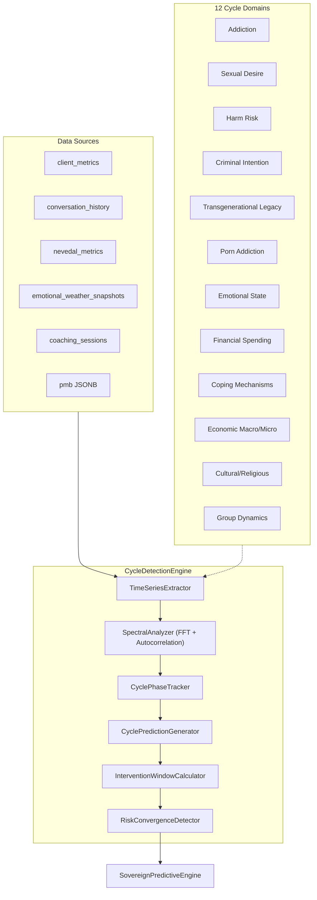

# Cycle Detection Engine: Multi-Domain Behavioral Cycle Prediction

> **Depends on:** `predictive_intelligence_engine_4f1440c1.plan.md` (shares migration 129 tables)
> **Migration:** `129_predictive_cycle_engine.sql` (exists)

## Architecture

The core insight is a **generalized cycle detection framework** where each "cycle type" is a configuration -- not a separate system. One engine, 12 domain configs, same spectral analysis pipeline.




## File: `backend/app/services/cycle_detection_engine.py` (New)

Single file containing:

- `**CycleDomainConfig**` -- dataclass defining each domain: `domain_id`, `display_name`, `data_sources` (list of table/column pairs), `nlp_keywords` (for conversation extraction), `peak_is_risk` (bool), `min_observations` (int), `sensitivity` (float 0-1)
- `**CYCLE_DOMAINS**` -- registry dict of 12 pre-configured `CycleDomainConfig` objects
- `**TimeSeriesExtractor**` -- queries from multiple data sources based on domain config, produces `List[CycleObservation]`
- `**SpectralAnalyzer**` -- applies FFT and autocorrelation to detect dominant periods (daily, weekly, monthly, seasonal, annual). Uses `numpy.fft.rfft` + peak detection. No external dependency beyond numpy (already in requirements).
- `**CyclePhaseTracker**` -- given detected period + current position, computes phase angle (0-2pi), labels phase (rising, peak, falling, trough)
- `**CyclePredictionGenerator**` -- projects next N peaks/troughs based on detected periods + current phase
- `**InterventionWindowCalculator**` -- identifies optimal intervention timing (before predicted peaks for risk cycles, at troughs for opportunity cycles)
- `**RiskConvergenceDetector**` -- detects when multiple cycle peaks align (e.g., addiction peak + emotional trough + financial stress peak = compound risk event)
- `**CycleDetectionEngine**` -- orchestrator class, registered on `app.state.cycle_detection_engine`

Key methods on `CycleDetectionEngine`:

```python
async def detect_cycles(self, user_id: str, domain: str = None) -> Dict
async def predict_next_events(self, user_id: str, horizon_days: int = 30) -> Dict
async def get_convergence_risk(self, user_id: str, horizon_days: int = 14) -> Dict
async def get_family_cycles(self, family_id: str) -> Dict
async def get_group_cycles(self, group_id: str) -> Dict
async def record_observation(self, user_id: str, domain: str, value: float, metadata: Dict) -> None
```

## 12 Domain Configurations

Each domain maps to existing data sources -- no new data collection beyond what already flows through the platform:


| Domain                   | `domain_id`       | Primary Data Source                                                                      | Extraction                                                 |
| ------------------------ | ----------------- | ---------------------------------------------------------------------------------------- | ---------------------------------------------------------- |
| Addiction                | `addiction`       | `conversation_history` keywords, `pmb.trigger_map`, session topics                       | NLP keyword frequency over time                            |
| Sexual Desire            | `sexual_desire`   | `conversation_history`, self-reported mood entries                                       | NLP extraction, pattern timing                             |
| Harm Risk                | `harm_risk`       | `crisis_perception`, `crisis_count`, `shame_profile.shame_index`                         | Direct numeric time-series from `client_metrics`           |
| Criminal Intention       | `criminal_intent` | `conversation_history`, trigger escalation, `pmb.reactivity_indicators`                  | NLP + reactivity scoring                                   |
| Transgenerational Legacy | `legacy`          | `pmb.legacy_patterns`, `transgenerational_patterns` table, family coherence              | Existing `_extract_legacy_patterns()` + family propagation |
| Porn Addiction           | `porn_addiction`  | `conversation_history` keywords, session timing patterns                                 | NLP keyword frequency + usage timing                       |
| Emotional State          | `emotional_state` | `mood_history`, `anxiety_level`, `stress_level`, `c_emo` from `client_metrics`           | Direct numeric time-series (richest data source)           |
| Financial Spending       | `financial`       | `conversation_history` keywords, session topics                                          | NLP extraction of financial stress indicators              |
| Coping Mechanisms        | `coping`          | `shame_profile` defensive mechanisms, `pmb.reactivity_type`, session homework completion | Behavioral pattern scoring                                 |
| Economic Macro/Micro     | `economic`        | External indicators (optional manual input via admin), community stress patterns         | Aggregated community-level data                            |
| Cultural/Religious/Cult  | `cultural`        | `conversation_history`, community coherence, belief system references                    | NLP extraction + community mesh patterns                   |
| Group Dynamics           | `group_dynamics`  | `coaching_mesh_sessions`, group coherence, `emotional_weather_snapshots`                 | Group-level coherence time-series                          |


### NLP Keyword Extraction (conversation-based domains)

For domains that extract signals from `conversation_history` (addiction, sexual desire, financial, criminal, cultural), the `TimeSeriesExtractor` uses a keyword-density-over-time approach:

```python
DOMAIN_KEYWORDS = {
    "addiction": ["craving", "relapse", "using", "sober", "clean", "drink", "substance", "withdrawal", "tempt"],
    "sexual_desire": ["desire", "intimacy", "arousal", "urge", "attraction", "libido", "sexual"],
    "porn_addiction": ["porn", "explicit", "watched", "browsing", "sites", "images", "video", "screen time"],
    "financial": ["money", "spending", "debt", "bills", "budget", "impulse buy", "financial", "broke"],
    "criminal_intent": ["anger", "revenge", "hurt them", "violent", "weapon", "steal", "plan", "attack"],
    "cultural": ["church", "faith", "belief", "congregation", "pastor", "spiritual", "doctrine", "cult", "religion"],
}
```

For each day with conversation entries, compute `keyword_hits / total_words` to produce a normalized signal. Apply FFT to this signal to detect periodicities.

## Migration: `backend/migrations/129_predictive_cycle_engine.sql`

> **Note:** Originally referenced as migration 120. Actual migration file is `129_predictive_cycle_engine.sql`.
> **Depends on:** `predictive_intelligence_engine_4f1440c1.plan.md` (shares tables)

Three new tables (the `therapeutic_habit_tracking` and `therapeutic_predictions` from the Predictive Intelligence Engine plan are consolidated here since cycles subsume habits):

```sql
CREATE TABLE IF NOT EXISTS cycle_observations (
    id BIGSERIAL PRIMARY KEY,
    user_id VARCHAR(128) NOT NULL,
    domain VARCHAR(32) NOT NULL,
    observed_at TIMESTAMPTZ NOT NULL DEFAULT NOW(),
    value DOUBLE PRECISION NOT NULL,
    phase VARCHAR(16),
    metadata JSONB DEFAULT '{}',
    UNIQUE(user_id, domain, observed_at)
);
CREATE INDEX idx_cycle_obs_user_domain ON cycle_observations(user_id, domain, observed_at DESC);

CREATE TABLE IF NOT EXISTS cycle_detections (
    id BIGSERIAL PRIMARY KEY,
    user_id VARCHAR(128) NOT NULL,
    domain VARCHAR(32) NOT NULL,
    detected_period_days DOUBLE PRECISION NOT NULL,
    amplitude DOUBLE PRECISION NOT NULL,
    phase_offset DOUBLE PRECISION DEFAULT 0,
    confidence DOUBLE PRECISION NOT NULL,
    method VARCHAR(32) DEFAULT 'fft',
    detected_at TIMESTAMPTZ NOT NULL DEFAULT NOW(),
    expires_at TIMESTAMPTZ,
    metadata JSONB DEFAULT '{}'
);
CREATE INDEX idx_cycle_det_user ON cycle_detections(user_id, domain);

CREATE TABLE IF NOT EXISTS cycle_predictions (
    id BIGSERIAL PRIMARY KEY,
    user_id VARCHAR(128) NOT NULL,
    domain VARCHAR(32) NOT NULL,
    predicted_event VARCHAR(32) NOT NULL,
    predicted_at TIMESTAMPTZ NOT NULL,
    confidence DOUBLE PRECISION NOT NULL,
    intervention_window_start TIMESTAMPTZ,
    intervention_window_end TIMESTAMPTZ,
    convergence_risk DOUBLE PRECISION DEFAULT 0,
    converging_domains JSONB DEFAULT '[]',
    status VARCHAR(16) DEFAULT 'pending',
    actual_outcome VARCHAR(32),
    created_at TIMESTAMPTZ NOT NULL DEFAULT NOW()
);
CREATE INDEX idx_cycle_pred_user ON cycle_predictions(user_id, domain, predicted_at);
```

## Router: `backend/app/routers/cycle_api.py` (New)

8 endpoints under `/api/predictive/cycles`:


| Endpoint                     | Method | Purpose                                           |
| ---------------------------- | ------ | ------------------------------------------------- |
| `/health`                    | GET    | Health check                                      |
| `/detect/{user_id}`          | GET    | Run cycle detection across all domains for a user |
| `/detect/{user_id}/{domain}` | GET    | Detect cycles for a specific domain               |
| `/predict/{user_id}`         | GET    | Get upcoming predicted events (next 30 days)      |
| `/convergence/{user_id}`     | GET    | Get convergence risk analysis                     |
| `/family/{family_id}`        | GET    | Family-level cycle analysis                       |
| `/group/{group_id}`          | GET    | Group-level cycle analysis                        |
| `/observe`                   | POST   | Record a manual observation (admin/coach)         |


Auth: `require_coach` (coaches and admin can view client cycles).

## Integration Points

### 1. Into Predictive Intelligence Engine (`sovereign_predictive_engine.py`)

The `Temporal_Intelligence` component of the master formula uses `CycleDetectionEngine`:

```python
temporal_intelligence = (
    self.cycle_engine.get_generational_score(user_id) *    # legacy domain
    self.cycle_engine.get_habit_timeline_score(user_id) *  # emotional_state domain
    self.cycle_engine.get_optimal_timing_score(user_id) *  # intervention windows
    self.cycle_engine.get_historical_pattern_score(user_id) # all domains aggregate
)
```

### 2. Into PMB System (bridge_server.py)

Enhance `_compute_pmb()` to call into the cycle engine for richer cyclical pattern detection beyond just weekly anxiety. The bridge already has the PMB computation -- add a post-processing step:

```python
# After existing weekly anxiety detection:
if db_pool:
    cycle_result = await cycle_engine.detect_cycles(username, domain="emotional_state")
    pmb["detected_cycles"] = cycle_result.get("cycles", [])
    pmb["convergence_risk"] = cycle_result.get("convergence_risk", 0)
```

### 3. Into Foresight Engine

`foresight_engine.py` gains a new method `forecast_cycle_events()` that wraps `CycleDetectionEngine.predict_next_events()` and integrates cycle predictions into the foresight alert system.

### 4. Into Nate Check-In Agent

The `nate_checkin_agent.py` can use convergence risk to trigger proactive outreach when multiple cycle peaks are predicted to converge within a 48-hour window.

### 5. Dashboard: `dashboard/predictive_cycles.html` (New)

Cycle dashboard accessible from the Nevedal Lab tab. Shows:

- Per-user cycle detection results (waveforms + FFT spectral plot)
- Predicted upcoming events timeline
- Convergence risk heat map
- Family/group cycle correlation view

## Registration in `main.py`

```python
from app.services.cycle_detection_engine import CycleDetectionEngine
app.state.cycle_detection_engine = CycleDetectionEngine(db_pool=db_pool, app_state=app.state)

from app.routers.cycle_api import router as cycle_router
app.include_router(cycle_router)
```

Add to `_service_checks`:

```python
("cycle_detection_engine", app.state.cycle_detection_engine is not None),
```

Service health denominator increases by 1 (currently 97 -> 98).

## Consent and Privacy

Per user instruction: **consent is already informed during the initial consent to do therapy for all items.** The existing `consent_version` (v13.0_2026) covers all therapeutic data analysis. No additional consent flow is required. All cycle data is scoped to the user's own therapeutic data and only accessible to their assigned coach and admin.

## Spectral Analysis Detail

The core algorithm for cycle detection:

1. **Collect time series**: Query the domain's data sources, produce daily values (interpolating gaps)
2. **Detrend**: Remove linear trend to isolate cyclical components
3. **FFT**: Apply `numpy.fft.rfft()` to get frequency spectrum
4. **Peak detection**: Find dominant frequencies above noise floor (amplitude > 2x median)
5. **Period extraction**: Convert dominant frequencies to periods in days
6. **Autocorrelation validation**: Confirm detected periods via autocorrelation (independent verification)
7. **Phase computation**: Determine current phase position (0-2pi) for each confirmed cycle
8. **Minimum data requirement**: 28 days of observations for weekly cycles, 90 days for monthly cycles, 365 days for seasonal/annual cycles

This approach generalizes the existing PMB weekly-anxiety detection (which is limited to day-of-week grouping) into proper spectral decomposition that can detect arbitrary periodicities.