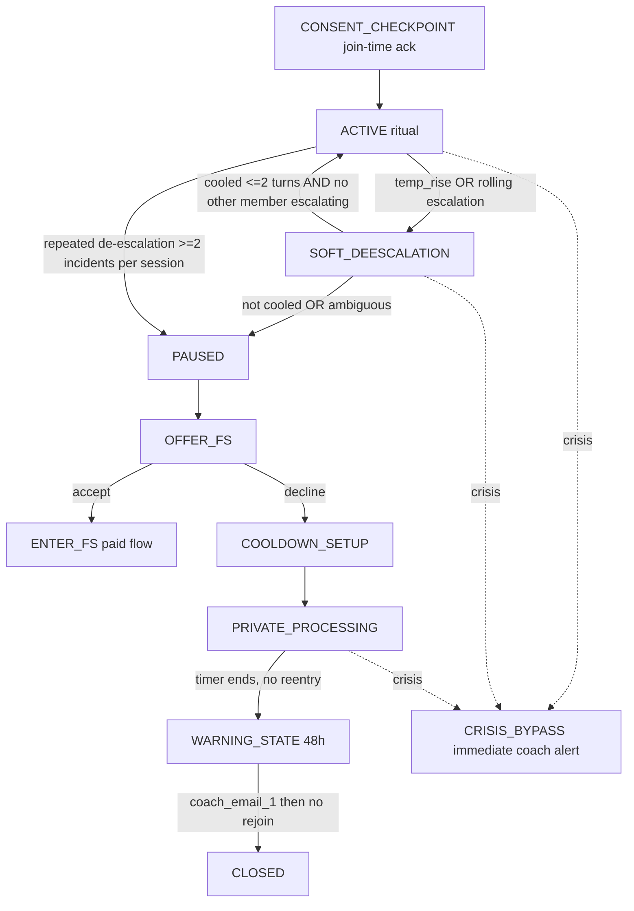

# Daily Reconnect Ritual — Build-Out Plan

Supersedes the public coach booking plan (abandoned). Source of truth: `Daily_Reconnect_BUILD_SPEC.md`. Spec Rule #1 (grep-confirm every symbol) has been applied below — integration points are verified with real paths.

## Confirmed product shape
- **Free, but TOP_TIER-gated** — lives in the Sovereign Circle / Family Sanctuary space; "free" = no per-use billing, no session-counter decrement (spec §1, §4).
- **Trigger:** on-demand. Tapping the Daily Reconnect icon opens/joins the ritual now; `scheduled_for` is a suggested reminder slot only.
- **Presence:** synchronous — reuse Family Sanctuary's live WebSocket room + broadcast; Nate cycles `turn_order` in real time.
- **Relationship to Family Sanctuary:** Daily Reconnect is the lightweight daily ritual; on escalation it offers a doorway *into* the existing paid conflict flow (spec §7.2/§7.3).

## Verified integration points (spec name to real symbol)

- Tier gate: `effective_feature_tier(profile, registry) == "TOP_TIER"` at [bridge_server.py:26933](backend/app/websocket/bridge_server.py); entitlement set by `compute_premium_features` ([bridge_server.py:3042](backend/app/websocket/bridge_server.py), `"family_sanctuary": is_top`).
- Spec's `sanctuary_get_or_create` is a **WS message type** (handler [bridge_server.py:26911](backend/app/websocket/bridge_server.py)), not a function. Room engine: `SanctuaryEngine.create_sanctuary` / `get_active_sanctuary_for_family` / `add_or_reconnect_member` ([sanctuary_engine.py:139-163](backend/app/websocket/sanctuary_engine.py)).
- **Paid-flow handoff entry (§7.3):** `generate_group_coaching_response` ([bridge_server.py:10698](backend/app/websocket/bridge_server.py)) reached via the sanctuary group-coaching approve path ([bridge_server.py:29244](backend/app/websocket/bridge_server.py)). Confirm exact seam at build time before wiring ENTER_FS.
- Identity: `resolve_username(db_pool, identifier)` ([_identity_resolver.py:15](backend/app/services/_identity_resolver.py)) — maps username/hardware_id/id to canonical `users.username`. Key all Daily Reconnect rows on `user_id = username`.
- `family_role` values: `HEAD` (+ alias `HEAD_OF_HOUSEHOLD`), `SPOUSE` (+ `PARTNER`), `MEMBER`, `DEPENDENT`. Use `_HEAD_ROLES` from [family_linkage.py:21](backend/app/websocket/family_linkage.py) for alias handling. **WARNING — do NOT treat "not DEPENDENT" as "adult" (see Safeguarding gate below).** Age is carried independently of role: `dob` is stored in `profile_data` ([bridge_server.py:3735](backend/app/websocket/bridge_server.py)) and there is an `_age_from_dob` helper ([bridge_server.py:7221](backend/app/websocket/bridge_server.py)). The `is_minor` column exists ([001_schema.sql:48](backend/migrations/001_schema.sql)) but is only set True when `family_role == "DEPENDENT"` ([bridge_server.py:4051](backend/app/websocket/bridge_server.py): `_is_minor_flag = (_req_role == "DEPENDENT") and _is_under_18`) — so a minor `SPOUSE`/`MEMBER` is NOT flagged. Age must be computed from `dob`, not inferred from role.
- Affect / temperature (reuse, do not build new): `detect_distress(state, msg)` ([little_nate_adaptive.py:265](backend/app/services/little_nate_adaptive.py)), `_detect_state_from_text` ([therapeutic_controller.py:424](backend/app/services/therapeutic_controller.py)), sanctuary `detect_escalation` keyword set ([sanctuary_engine.py:815](backend/app/websocket/sanctuary_engine.py)). TMC `_classify_tmc` available if needed.
- Crisis bypass (DECISION-3): `maybe_dispatch_si_coach_alert` ([suicide_ideation_coach_alert.py:150](backend/app/services/suicide_ideation_coach_alert.py)) -> `dispatch_sensitive_alert` ([sensitive_alert_dispatcher.py:18](backend/app/services/sensitive_alert_dispatcher.py)); lexicon `match_user_text` ([suicide_ideation_lexicon.py:39](backend/app/services/suicide_ideation_lexicon.py)).
- Flutter FS icon: AppBar `IconButton(Icons.family_restroom)` in `NeuralInterfaceV2` at [updated_screens.dart:4714](mobile/lib/updated_screens.dart) -> `FamilySanctuaryScreen` ([main.dart:2758](mobile/lib/main.dart)). New Daily Reconnect icon goes in the same `actions:` list immediately before it.
- Flag pattern: mirror `ENABLE_ARC_MEMORY` (`.env.template`, `docker-compose.prod.yml` bridge env, module bool `os.getenv(...).lower() in ("true","1","yes")`).
- Migrations dir `backend/migrations/`, next number **230**. DB `little_nate`; bridge pool at [bridge_server.py:30987](backend/app/websocket/bridge_server.py). Log style `>>> [RECONNECT]`.

## Protected-file discipline
`bridge_server.py` and `main.py` are protected (additive only, <=50 lines/commit, behind flag, comment tag `# QUANTUM-CRYSTAL-ARCH` or `# SOVEREIGN-VOICE`). Therefore the **state machine, temperature read, branch logic, inference writer, and telemetry live in a NEW module** `backend/app/services/daily_reconnect_engine.py` (mirrors `sanctuary_engine.py`). The bridge only gets thin, flag-gated WS dispatch + engine instantiation in `main()`. No backend `main.py` change expected (engine is bridge-side like `sanctuary_engine`).

## Safety corrections (block before flip) — gaps found in plan review

These five corrections override the lighter treatment in earlier drafts. They are not optional polish; the first is the flip-gate.

### A. Crisis bypass trigger is an interim STOPGAP, not the detection (BLOCKER)
- Spec §8.1's real trigger is **distress crossing a threshold — a cluster/affect signal**, not a keyword. The interim implementation uses `match_user_text` (the SI lexicon, keyword match) + `detect_distress`. This is the **Ryan failure rebuilt**: Ryan never said an SI keyword — his risk was the cluster (burdensomeness + hopelessness + withdrawal). A bypass keyed to SI-lexicon-hit + generic distress will pass an activated, declining member straight through `PRIVATE_PROCESSING`.
- DECISION-3 = **reuse the dispatch wiring now, swap the trigger to the cluster detector when it ships.** Keep these two things separate. The wiring (`maybe_dispatch_si_coach_alert` -> `dispatch_sensitive_alert`) is correct and stays. The **trigger is known-insufficient** and must be labeled as such in code (comment: `# STOPGAP trigger — replace with Layer-0 cluster detector (DECISION-3)`) and in the engine's telemetry (`trigger_kind='keyword_stopgap'`).
- The **`COOLDOWN_SETUP` -> `PRIVATE_PROCESSING` branch is the highest-risk surface** in the whole feature: a member who declines FS and enters private processing is exactly the person the weak trigger can miss. The plan must name this explicitly so it is not flipped to production until the cluster detector lands.

### B. Within-session escalation trajectory (rolling state) — currently missing
- The spec and prior plan both score temperature **per-turn** with a **per-turn** `cooled` check. Neither carries escalation **across** turns. Ryan's lesson: the signal is the *build*, not any single message. A slow ratchet can keep every single turn under the rise threshold while the session climbs.
- Fix: the engine holds a **short rolling escalation state** per session (e.g. last N=4 turn temperatures + a monotonic-rise counter + distress-marker accumulation across turns). `temp_rise` fires on **either** a single-turn spike **or** a sustained rolling climb, even when no individual turn trips the per-turn threshold. Persist the rolling vector to `daily_reconnect_event` each turn so the build is auditable.

### C. De-escalation counter — define scope + failure exit
- "Nate <=2 turns, cooled, return to ACTIVE" has no scope or exit today. As written a session can bounce `ACTIVE -> SOFT -> ACTIVE -> SOFT` forever and never reach the pause/offer that protects people.
- Define:
  - **Counter scope = per-session** (cumulative SOFT_DEESCALATION incidents, not per-incident reset).
  - **Ambiguous temperature** (detectors disagree / low-confidence) counts as **not cooled** -> escalate toward PAUSED (fail toward protection, never toward ACTIVE).
  - **A different member escalating during a de-escalation** immediately voids the "cooled" path -> PAUSED.
  - **Repeated de-escalation rule:** >=2 SOFT incidents in one session **forces PAUSED -> OFFER_FS** (no third bounce back to ACTIVE).

### D. Consent checkpoint as a real state/step (not prose)
- DECISION-1's disclosure cannot be a single onboarding sentence. This feature **monitors a live family exchange**, generates **coach-only attachment / pursuer-withdrawer reads**, and is **observed by the operator/team**. "Free" does not reduce that disclosure burden.
- Add `CONSENT_CHECKPOINT` as an actual pre-ritual state: on first join (per participant, persisted on `daily_reconnect_participant`), each member must affirmatively acknowledge that (1) the exchange is monitored, (2) Nate characterizes connection patterns for their coach, (3) the platform team may review. No ritual turn is accepted until every present participant's `consent_ack_at` is set. Log `consent_ack` / `consent_decline` to `daily_reconnect_event`; decline = cannot join.

### E. Minor gate by AGE, not by role (safeguarding hole)
- DECISION-2 blocks `DEPENDENT`, but "not DEPENDENT" != "adult". A minor `SPOUSE` or minor `MEMBER` slips the role gate. Verified: `dob` is stored independently of role and `_age_from_dob` exists ([bridge_server.py:7221](backend/app/websocket/bridge_server.py)); `is_minor` is unreliable because it is only set for `DEPENDENT` ([bridge_server.py:4051](backend/app/websocket/bridge_server.py)).
- The real gate: at join, compute age from `profile_data['dob']` via `_age_from_dob`. **Block anyone under 18 regardless of `family_role`.** Also block `DEPENDENT` (DECISION-2) and any `is_minor=True`. **Fail closed:** if `dob` is missing/unparseable, deny join for v1 (do not assume adult). Log `blocked_minor_by_age` vs `blocked_dependent_role` distinctly so the safeguard is auditable.

## v1 goal reframe — Nate-fronted connection spine, coach machinery demoted to safety floor

The stated success metric is **the couple feeling more connected day to day, with the help coming from Little Nate — not the coaches or the operator.** That reframe propagates:

- **v1 spine (what Nate owns end-to-end):** the ritual, the live presence, Nate as a quiet warm facilitator, the **accumulation reward**, and the **gentle re-invitation on a miss / warm return**. Day to day the couple only ever feels Nate; they never see a coach.
- **Demoted out of the v1 spine -> safety floor only:** the `connection_indicator` score, the coach-emailed attachment read, and the 48h coach warning ladder. These serve the clinical/coach picture, which is explicitly **not** this feature's goal. They are not deleted, but they no longer drive the v1 experience.
- **Safety floor stays, always:** crisis bypass, consent checkpoint, and the age gate protect people regardless of the feature's goal. The **human/coach path exists only as the safety floor underneath, triggered by crisis — never by routine.** The clean separation: Nate owns connection; the coach exists only for the moment it stops being a connection problem and becomes a safety one. You cannot fully sever the human path because crisis must reach a human.

### Reward model — accumulation, never a streak (REWARD-1)
- **No streak that can break.** The moment connection has a number that resets to zero it becomes a performance someone can fail; for an anxious style a broken streak reads as "I'm failing at this too," and for an avoidant style a "you broke your streak" nudge is a perfect excuse to disengage. Track **accumulation that only ever grows** — total reconnects ("that's 14 reconnects together"), never consecutive ones. A missed day subtracts nothing.
- Optional rhythm only in the **rear-view, never as a target**: "you've reconnected most evenings this week" — never "you're behind."

### Miss-encouragement + warm return (REWARD-2)
- **Reward presence, never penalize absence; make returning frictionless and face-saving.** No guilt nudge ("you missed yesterday"), no same-evening pressure ping (an avoidant partner experiences that as the relationship making a demand).
- The miss message is a low-pressure, returning-is-easy invitation that frames the gap as normal: closer to "whenever you're ready, the door's open" than "you haven't checked in." **Celebrate the return warmly** when it happens so coming back after a lapse feels good, not sheepish. "Showing up again counts just as much as showing up daily."
- **Attachment-adapted tone ONLY when the read is confident; gentle-by-default otherwise.** Use the existing pursuer/withdrawer signal to soften tone (more reassuring "you-haven't-lost-anything" for anxious-leaning, more spacious "no-pressure" for avoidant-leaning) — but this stays in the "observed signal, gently adapted" lane, never "the system decided you're avoidant and is managing you." Per the Ryan lesson on wrong reads, **when the signal is uncertain, default everyone to the gentlest, lowest-pressure, spacious-and-warm version.** Adapt only when the read is clear.

## Commit/PR shape (follows spec §14)

### 1. Migration 230 — tables only, reversible
`backend/migrations/230_daily_reconnect.sql`: `daily_reconnect_session`, `daily_reconnect_participant`, `daily_reconnect_turn` (locked write-once), `daily_reconnect_inference` (coach-only, `framing DEFAULT 'observed_signal_not_assessment'`), `daily_reconnect_event` (telemetry). Exact columns per spec §3.1-3.5. Additive; no FK to `users(hardware_id)` — `user_id` stores `users.username`. **Add for the corrections:** `daily_reconnect_participant.consent_ack_at TIMESTAMPTZ` (correction D); a monotonic `total_reconnects INT DEFAULT 0` accumulation counter (REWARD-1, never decremented — no streak column); `last_reconnect_at` to drive warm-return detection (REWARD-2); ensure `daily_reconnect_event` can store the rolling-escalation vector / `cooled` reason / `trigger_kind` / minor-block reason / miss + return events (JSON `detail` column is sufficient).

### 2. Flag in false state
`.env.template`: `ENABLE_DAILY_RECONNECT=false`. `docker-compose.prod.yml` **bridge** env: `- ENABLE_DAILY_RECONNECT=${ENABLE_DAILY_RECONNECT:-false}`. Commit artifacts (no scp-only).

### 3. Engine + gating + room join (adults only, by age)
New `daily_reconnect_engine.py`: open/join, identity via `resolve_username`, min 2 adults to open, reuse `SanctuaryEngine` room/presence + connected-client broadcast. Gate on `effective_feature_tier == "TOP_TIER"` mirroring [bridge_server.py:26933](backend/app/websocket/bridge_server.py). **Join gate per correction E:** compute age from `profile_data['dob']` via `_age_from_dob`; block <18 regardless of role, block `DEPENDENT` (DECISION-2), block `is_minor=True`, fail closed on missing/unparseable `dob`. Distinct telemetry `blocked_minor_by_age` vs `blocked_dependent_role`. Non-punitive decline message.

### 4. Ritual + turn logging + temperature + rolling trajectory
Four-prompt turn structure (appreciation / today / feeling-need / request), listener reflects, no problem-solving (spec §6.1). Each share writes a locked `daily_reconnect_turn`. `temperature` from reused detectors (§6.2). **Per correction B:** the engine maintains a per-session **rolling escalation state** (last N=4 turn temps + monotonic-rise counter + cross-turn distress-marker accumulation); `temp_rise` fires on a single-turn spike **or** a sustained rolling climb. Define `cooled` explicitly = temp below rise threshold AND no new escalation markers AND rolling counter not climbing; **ambiguous/low-confidence = not cooled**. Persist raw per-turn values and the rolling vector to `daily_reconnect_event`.

### 5. State machine + branches (incl. consent checkpoint + de-escalation rule)
Implement states/transitions per spec §5/§7 in the engine, plus the new `CONSENT_CHECKPOINT` state (correction D) gating the first ritual turn. **De-escalation counter per correction C:** per-session scope; ambiguous temp or another member escalating voids "cooled" -> PAUSED; >=2 SOFT incidents in a session forces PAUSED -> OFFER_FS (no infinite ACTIVE<->SOFT bounce). Thin WS handlers in bridge (flag-gated, tagged): `reconnect_get_or_create`, `reconnect_join`, `reconnect_consent_ack`, `reconnect_turn`, `reconnect_fs_offer_response`, `reconnect_cooldown_choice`, `reconnect_reenter`, `reconnect_exit` — naming mirrors `sanctuary_*`. ENTER_FS hands locked turn rows (escalation turns + prior >=20) into the paid `generate_group_coaching_response` seam.

### 6. Reward + miss-encouragement (the v1 spine — REWARD-1/REWARD-2)
Accumulation reward only: a monotonic `total_reconnects` counter on `daily_reconnect_session`/participant that **never resets**; surface as "that's N reconnects together." No streak field. Miss-encouragement: warm, no-guilt re-invitation (no same-evening pressure ping); warm return celebration on the first turn after a lapse. Tone is **gentle-by-default**, attachment-adapted only when the pursuer/withdrawer read is confident (stays "observed signal, gently adapted," never "managing you"); uncertain read -> spacious-and-warm for everyone. All Nate-fronted; no coach involvement in this path.

### 6b. Inference layer — SAFETY FLOOR ONLY, demoted from v1 spine (DECISION-1)
The coach-only `daily_reconnect_inference` (`connection_indicator` 1-10 NOT "safety", `attachment_hypothesis`, `position`, `basis_json`, `framing='observed_signal_not_assessment'`) and any coach-emailed read are **moved out of the v1 connection spine** per the goal reframe. Keep the table and writer wired but **do not surface as the v1 experience**; the only coach-facing path that fires in routine use is none — coach involvement is reserved for the crisis safety floor (step 7). No member-facing score UI. **Consent per correction D:** `consent_ack_at` on `daily_reconnect_participant`; `CONSENT_CHECKPOINT` (step 5) discloses live monitoring + coach characterization + platform-team review; no turn accepted until every present participant acknowledges. Decline = cannot join.

### 7. Crisis bypass + grounding (gates the flip) — STOPGAP trigger, see correction A
Parallel guard on every turn. **Trigger is interim and known-insufficient** (`match_user_text` SI-lexicon + `detect_distress`); tag in code `# STOPGAP trigger — replace with Layer-0 cluster detector (DECISION-3)` and telemetry `trigger_kind='keyword_stopgap'`. Wiring stays: on crisis -> `CRISIS_BYPASS`, fire `maybe_dispatch_si_coach_alert` immediately, skip the 48h ladder (spec §8.1). The `COOLDOWN_SETUP -> PRIVATE_PROCESSING` branch is the **highest-risk surface** (correction A) — do not flip to production until the cluster detector lands. `PRIVATE_PROCESSING` runs under crisis discipline (§8.2). All history pulls read **actual locked rows** only — never synthesize (§8.3).

### 7b. Cooldown choice + turn-content boundary
`COOLDOWN_SETUP`: each member picks 1/2/3/4/12h; the **longest pick sets the shared lock**; a willing member may solo-process during the lock. Define the **turn-content retention/access boundary** explicitly: who can read locked `daily_reconnect_turn` rows, for how long, and that they are never summarized where the row itself is required (ties to grounding, §8.3).

### 8. Telemetry + query
Every transition writes `daily_reconnect_event` (including `flag_off_skip`, `cooled`/`not_cooled`, miss/return events, and `total_reconnects` increments). Mirror to stdout `>>> [RECONNECT]`. Ship the family-ladder reconstruction SQL (§10).

### 9. Flutter UI
New `DailyReconnectScreen` (mirrors `FamilySanctuaryScreen` WS connect). Add `IconButton` in `NeuralInterfaceV2` `actions:` immediately before [updated_screens.dart:4714](mobile/lib/updated_screens.dart), tier-gated on the `family_sanctuary` entitlement. **Member-facing UI shows only the accumulation reward ("N reconnects together") and Nate's warmth — no score, no streak, no coach read.** Coach inference is NOT surfaced in routine use (safety-floor only, step 6b). Build via `flutter build web --release`, deploy per `deploy_flutter_web.sh` + CF purge.

### 10. Acceptance harness (§12 — must pass before flip)
Synthetic family covering all 10 spec tests. The **critical** one is #6 crisis-bypass during PRIVATE_PROCESSING, and per correction A it **must include a non-keyword cluster case** — a Ryan-style slow build (burdensomeness + hopelessness + withdrawal across turns, **no SI vocabulary**), not only a lexicon hit. A #6 that only tests a keyword match passes while the real gap stays open; mark this case `expected_fail_until_cluster_detector` so the harness records the known stopgap limitation rather than hiding it. Add tests for: rolling-trajectory `temp_rise` on a slow climb (correction B), repeated-de-escalation -> forced PAUSED (correction C), consent decline blocks join (correction D), minor-by-age (minor SPOUSE/MEMBER + missing-dob fail-closed) blocked at join (correction E), **accumulation reward never resets after a miss (REWARD-1)**, **miss-encouragement is no-guilt + warm return celebration (REWARD-2)**, and **tone defaults to gentle/spacious when the attachment read is uncertain**. Plus #10 no paid-path regression (grep-diff confirms Family Sanctuary conflict flow untouched).

## DECISIONS held (do not override) — spec §13
- DECISION-1 coach-only inference; DECISION-2 dependents blocked; DECISION-3 reuse SI/coach-alert path now.
- GOAL: success = couple feeling more connected day to day, help from Little Nate, not coaches. Coach/inference machinery is safety-floor only, not the v1 spine.
- REWARD: accumulation only, never a streak that breaks; reward presence, never penalize absence; gentle-by-default tone.
- Never flip `ENABLE_DAILY_RECONNECT` true; never add billing; never modify the paid Family Sanctuary conflict flow; never summarize where locked rows are required.

## Out of scope (v1)
Dependent/minor participation (separate signed-off spec, §9); member-facing inference scores; **coach-emailed attachment read + 48h coach warning ladder (demoted to safety floor, not v1 spine)**; **any streak counter**; end-of-day auto-scheduler (icon is on-demand); the cluster "Layer 0" detector (swap crisis trigger when it ships).
