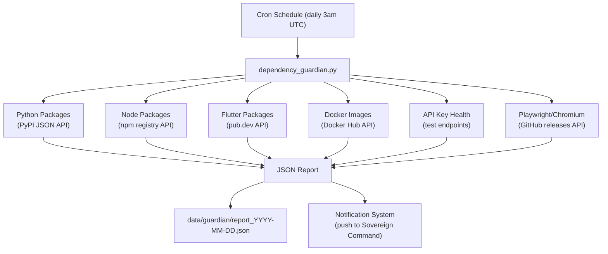

# Dependency Guardian Agent

## Architecture

A single Python worker file that runs as a daily cron task inside the `nate_backend` container. It checks every dependency surface, generates a health report, saves it to disk, and pushes critical findings through the existing notification system to Sovereign Command.

## What Gets Checked

Each checker is a self-contained async function. All use public APIs (no auth needed except for API key health checks):

- **Python packages** -- Parse `backend/requirements.txt`, query `https://pypi.org/pypi/{pkg}/json` for latest version, compare against installed/pinned. Flag deprecated packages (like the `duckduckgo_search` incident).
- **Node packages** -- Parse `admin/package.json`, query `https://registry.npmjs.org/{pkg}/latest` for latest version, compare.
- **Flutter packages** -- Parse `mobile/pubspec.yaml`, query `https://pub.dev/api/packages/{pkg}` for latest version, compare.
- **Docker base images** -- Check `python:3.11-slim`, `node:22-alpine`, `postgres:15.10-alpine`, `redis:7.4-alpine` against Docker Hub API for newer minor/patch tags.
- **API key health** -- Test each configured key with a minimal API call:
  - Bing Search: `GET /v7.0/search?q=test` (check for 401)
  - Azure OpenAI: Connection test to the endpoint
  - Stripe: `GET /v1/balance` (check for auth error)
  - SendGrid: `GET /v3/user/profile` (check for auth error)
- **Playwright/Chromium** -- Query GitHub releases API for `microsoft/playwright-python`, compare against installed `1.49.x`.

## Severity Levels

Each finding gets a severity:

- **CRITICAL** -- API key expired/invalid (service is broken NOW, like the Bing 401)
- **WARNING** -- Major version behind, deprecated package, security advisory
- **INFO** -- Minor/patch update available

## Files to Create/Modify

### New file: `[backend/app/workers/dependency_guardian.py](backend/app/workers/dependency_guardian.py)`

The main worker. Contains:

- `DependencyGuardian` class with individual checker methods
- `run_audit()` entry point that runs all checks, builds report
- Report saved to `/app/data/guardian/report_YYYY-MM-DD.json`
- Critical findings pushed via existing `notification_system.py`

### Modify: `[backend/app/main.py](backend/app/main.py)`

Add a daily background task using the existing worker scheduling pattern (same as `briefing_worker.py`). Schedule at 3:00 AM UTC daily.

### Modify: `[backend/app/routers/admin.py](backend/app/routers/admin.py)`

Add `GET /api/admin/dependency-report` endpoint that returns the latest guardian report so Sovereign Command can display it.

### Modify: `[admin/src/SovereignCommand.jsx](admin/src/SovereignCommand.jsx)`

Add a "Dependency Health" card/section that shows the latest report -- color-coded by severity (red/yellow/green), with package name, current version, latest version, and status.

## Key Design Decisions

- **Runs inside `nate_backend**` -- has network access, Python environment, and access to config/settings for API keys. No new container needed.
- **No auto-updates** -- report only. All updates require manual action.
- **Rate-limited** -- Each checker uses `asyncio.sleep()` between API calls to avoid hammering registries. Total audit takes ~30-60 seconds.
- **Idempotent** -- Can be triggered manually via admin API endpoint (`POST /api/admin/run-dependency-audit`) in addition to the daily cron.
- **Reports persist** -- JSON reports saved to `data/guardian/` with date-stamped filenames. Last 30 days retained, older auto-cleaned.

