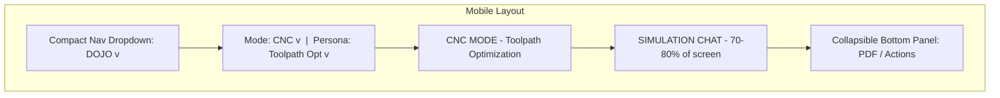

# DOJO Mobile UX Responsive Redesign

## Current State

The DOJO on mobile takes up too much vertical space with horizontally scrolling mode tabs, persona buttons, the full analysis sidebar, and the Coach Command tab bar. The simulation chat (the core experience) gets squeezed.

**Current mobile layout (top to bottom):**

- Coach Command tab bar (CLIENTS, SCHEDULE, INSIGHTS... ~50px)
- DOJO header (THE DOJO title + buttons ~73px)
- Mode tabs row (Therapist, PM, Business... ~40px)
- Persona buttons + mode indicator (~80px)
- Chat area (whatever is left)
- Sidebar stacked below (~40vh)

That is ~243px of chrome before the chat even starts.

## Target Mobile Layout




Total chrome: ~90px. Chat gets 3x more space.

## Changes Required

### Layer 1: Flutter -- Coach Command Nav ([updated_screens.dart](mobile/lib/updated_screens.dart))

**Current**: `TabBar` with 6 scrollable tabs (CLIENTS, SCHEDULE, INSIGHTS, BRIEFINGS, DOJO, CLASSROOM) taking ~50px height.

**Mobile change**: Use `LayoutBuilder` or `MediaQuery` to detect mobile width (<768px). On mobile, replace the `TabBar` with a compact dropdown in the `AppBar` title area:

```dart
// Pseudocode for mobile detection
final isMobile = MediaQuery.of(context).size.width < 768;
```

- On mobile: `AppBar` shows "COACH COMMAND" with a `DropdownButton` that lists all tabs. Selecting one switches the `TabController.index`.
- On desktop: Keep the existing `TabBar` exactly as-is.
- This saves ~35px of vertical space on mobile.

Key location: `CoachDashboardScreenV2` class, lines ~3347-3434.

### Layer 2: HTML -- DOJO Page ([night_school_dojo.html](dashboard/night_school_dojo.html))

All changes scoped inside `@media (max-width: 768px)` to preserve the laptop view.

#### A. Mode Tabs -> Dropdown Select

**Current**: 6 horizontal pill buttons (`.mode-tabs`).

**Mobile change**: Hide the button row, show a `<select>` dropdown instead:

- Add a new `<div class="mobile-mode-select">` with a styled `<select>` element containing all 6 modes
- CSS: hide `.mode-tabs` on mobile, show `.mobile-mode-select`
- JS: `onchange` calls `setDojoMode(value)` same as the buttons
- Saves ~40px vertical space

#### B. Persona Buttons -> Dropdown Multi-Select

**Current**: Flex-wrapped pill buttons that can take 1-2 rows.

**Mobile change**: Replace with a styled dropdown/accordion:

- Add a `<div class="mobile-persona-select">` with a compact select element
- For therapist mode (multi-select): Show checkboxes in a collapsible panel
- For other modes (single-select): Standard `<select>` dropdown
- `onchange` calls existing `setPersona()` logic
- Saves ~60px vertical space

#### C. Mode Indicator -> Slim Bar

**Current**: Orange gradient bar with mode name, dot animation, and "UNLIMITED TOKENS" badge (~40px).

**Mobile change**: Condense to a single slim line (~24px) showing just the mode name and persona.

#### D. Conditional Sidebar Content

**Current**: All analysis cards, PDF section, search section, session summary, and action buttons are always shown.

**Mobile change (CSS-driven)**:

- Real-time Analysis cards (Empathy, Therapeutic Alignment, etc.) -- only visible when Therapist mode is active. Hidden for all other modes.
- Mode-specific analysis cards (CNC Metrics, MCAT Score, etc.) -- show only the relevant one.
- PDF Assessment section -- always visible (all modes).
- Approve / Flag / Export buttons -- always visible (all modes).
- Search section -- always visible.
- Session Summary -- always visible.

JS logic: When `setDojoMode()` is called on mobile, toggle a class on the analysis section that shows/hides the therapy-specific cards.

#### E. Sidebar -> Collapsible Bottom Panel

**Current**: Sidebar stacks below chat at 40vh on mobile.

**Mobile change**: Make the sidebar a collapsible panel with a toggle handle:

- Default state: collapsed, showing only a slim handle bar ("Pull up for tools")
- Tapping expands it upward as an overlay (not pushing chat)
- Contains: PDF Assessment, Action Buttons, Search, and conditionally the analysis cards
- This gives the chat area the full remaining screen height

#### F. Chat Input Area

Keep the existing mobile-optimized input (16px font to prevent iOS zoom, 44px send button). No changes needed.

## Files to Modify

- [mobile/lib/updated_screens.dart](mobile/lib/updated_screens.dart) -- `CoachDashboardScreenV2`: mobile dropdown nav
- [dashboard/night_school_dojo.html](dashboard/night_school_dojo.html) -- All HTML/CSS/JS changes for mobile DOJO layout

## What Does NOT Change

- Desktop/laptop view (>768px) -- completely untouched
- Backend -- no changes
- WebSocket handlers -- no changes
- PDF generation -- no changes
- Search security -- no changes

