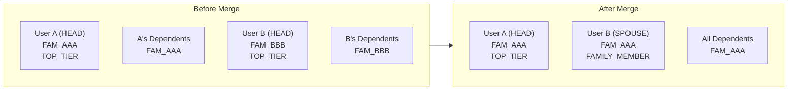

# Family Account Merge Tool

## Why No Data Is Lost

All individual user data is stored by `hardware_id`, completely independent of `family_id`:

- `Vaults/Clients/<hardware_id>/memory.json` — conversation history
- `Vaults/Clients/<hardware_id>/metrics.json` — C_emo, mood, risk
- `Vaults/Clients/<hardware_id>/story.json` — client narrative

Merging families only changes profile fields in `user_registry.json`. The vault files stay untouched.

## What the Merge Does

Given **User A** (stays HEAD) and **User B** (becomes SPOUSE):

### Profile changes in `user_registry.json`:

- **User B**: `family_id` -> User A's `family_id`, `family_role` -> `SPOUSE`, `subscription_plan` -> `FAMILY_MEMBER` (inherits from HEAD)
- **B's dependents** (if any): `family_id` -> User A's `family_id`, `linked_by` updated
- **User A**: No changes (stays HEAD, keeps plan)

### Family-level data migration:

- **Coach notes** keyed `family:FAM_BBB` get re-keyed to `family:FAM_AAA`
- **Family Sanctuary sessions** referencing `FAM_BBB` get migrated
- **Invite tokens** from old family get cleaned up

### Subscription handling:

- User B's individual TOP_TIER subscription should be cancelled/downgraded (manual Stripe action or automated)
- SPOUSE slot is free under User A's plan

## Implementation

### 1. Add `merge_families` WebSocket handler in [bridge_server.py](backend/app/websocket/bridge_server.py) (admin-only)

New handler `merge_families` that:

- Requires `current_profile.role == "ADMIN"`
- Takes `head_username` (User A, stays HEAD) and `spouse_username` (User B, becomes SPOUSE)
- Validates both users exist, both are currently HEAD of different families
- Performs the merge:
  - Updates User B's profile: `family_id`, `family_role = "SPOUSE"`, `merged_from_family = old_family_id`, `merged_at = timestamp`
  - Moves any of B's dependents to A's family
  - Re-keys coach notes from `family:FAM_BBB` to `family:FAM_AAA`
  - Migrates Family Sanctuary references
  - Cleans up pending invite tokens for old family
- Saves registry + returns success with summary

### 2. Add merge UI in Sovereign Command dashboard

Add a "Merge Families" button/section in the admin console at [admin/src/components/SovereignCommand.jsx](admin/src/components/SovereignCommand.jsx):

- Two dropdowns: select HEAD user (keeps headship) and SPOUSE user (transfers in)
- Preview showing what will change
- Confirm button
- Success/error feedback

### 3. Add `unmerge_family_member` handler (undo/reverse)

For safety, allow an admin to reverse the merge:

- Restore User B's original `family_id` (stored in `merged_from_family`)
- Restore their HEAD role and plan
- Move their dependents back

## Data safety

- **Before any merge**, the handler saves a timestamped backup of `user_registry.json`
- All changes are logged with admin username, timestamp, and details
- Individual vaults (`memory.json`, `metrics.json`, `story.json`) are NEVER touched

