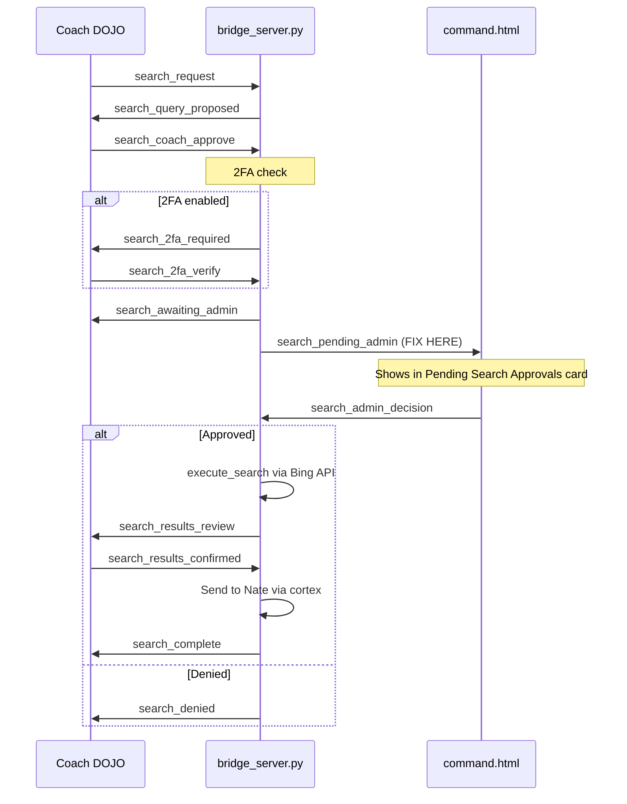

# Fix Secure Internet Search Approval Flow

## Bug 1: Admin Never Receives Search Requests (CRITICAL)

The admin notification code in [bridge_server.py](backend/app/websocket/bridge_server.py) iterates over the registry **incorrectly**. This means the admin portal **never** receives real-time `search_pending_admin` messages.

**The bug** (lines 9220-9223 and 9261-9264):

```python
registry = load_registry()
for u in registry:                    # <-- iterates over dict KEYS (strings)
    if u.get("role") == "ADMIN":      # <-- strings don't have .get() -> AttributeError
        admin_uid = u.get("hardware_id")
```

The registry is a `dict` with structure `{ key: { "profile": { "role": ..., "hardware_id": ... } } }`. Iterating `for u in registry` yields string keys, and calling `.get("role")` on a string throws `AttributeError`. This silently crashes the notification because the error propagates up to the main handler's try/except.

**Correct pattern** used everywhere else in the file (e.g., lines 4828, 4972, 5011, 5039):

```python
for rk, rv in registry.items():
    p = rv.get("profile", {})
    if p.get("role") == "ADMIN":
        admin_uid = p.get("hardware_id")
```

**Fix**: Update both admin notification loops (after coach_approve at line 9220 and after 2fa_verify at line 9261) to use the correct `registry.items()` pattern.

## Bug 2: pyotp Not Installed in Docker Container

The `pyotp` package is in [requirements.txt](backend/requirements.txt) (line 53) but the Docker container was built before it was added. The deploy script's `pip install` doesn't persist across container restarts.

**Fix**: Install pyotp in the running container, then rebuild the Docker image for permanence:

- Immediate: `docker exec ... pip install pyotp==2.9.0 qrcode==7.4.2`
- Permanent: Rebuild container image so pyotp is baked in

## Flow Verification

The complete Secure Internet Search flow, once these bugs are fixed:




The admin portal in [command.html](dashboard/command.html) already has the full UI (lines 1375-1812):

- "Pending Search Approvals" card with badge counter
- `renderPendingSearches()` renders approve/deny buttons
- `approveSearch()` / `denySearch()` send `search_admin_decision`
- Loads pending requests on connect via `admin_get_pending_searches`

All admin-side code is correct. The **only** issue is the backend never delivers the `search_pending_admin` notification due to the registry iteration bug.