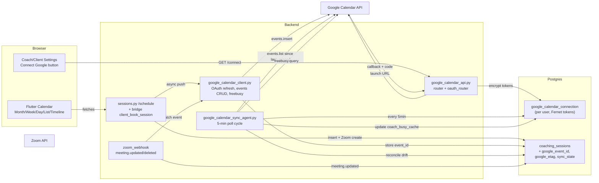

## Pre-execution checks (run before Phase A)

These must all pass on GREEN before any code is written. If any fails, surface it immediately.

```bash
# 1. Confirm Fernet encryption key exists on the backend container
ssh root@68.183.168.75 'docker exec nate_backend printenv | grep -i "FERNET\|ENCRYPTION_KEY" | cut -c1-20'
# Expected: at least SKYEYE_TOKEN_ENCRYPTION_KEY=... (used by TokenCipher)

# 2. Confirm Redis namespace for OAuth state has no collision
ssh root@68.183.168.75 'docker exec nate_redis redis-cli KEYS "google_oauth*" | wc -l'
# Expected: 0

# 3. Inspect coaching_sessions.status constraints (CHECK constraint may need 'cancelled_by_google')
ssh root@68.183.168.75 'docker exec nate_postgres psql -U nate_admin -d little_nate -c "\d coaching_sessions" | grep -A2 status'
# If a CHECK constraint exists on status, migration 183 must ALTER it to allow new values.
# Decision: if no CHECK constraint, status is free-form VARCHAR — proceed as-is.
# If CHECK constraint exists, migration 183 adds: ALTER TABLE coaching_sessions
#   DROP CONSTRAINT <name>, ADD CONSTRAINT ... CHECK (status IN (..., 'cancelled_by_google')).

# 4. Confirm Google OAuth credentials exist
# REQUIRED INPUT FROM USER: GOOGLE_CLIENT_ID, GOOGLE_CLIENT_SECRET, GOOGLE_REDIRECT_URI
# from Google Cloud Console > APIs & Services > Credentials > OAuth 2.0 Client IDs.
# Authorized redirect URI must be: https://api.sovereignsanctuary.net/api/calendar/google/callback
# Required scopes (configure in OAuth consent screen):
#   - https://www.googleapis.com/auth/calendar.events
#   - https://www.googleapis.com/auth/calendar.readonly (or calendar.calendarlist.readonly)
#   - https://www.googleapis.com/auth/calendar.freebusy
# If credentials do NOT exist, Phase A is BLOCKED until they are created.
```

If check #4 fails (no Google Cloud Console credentials yet), STOP and request them. Phases A-D cannot start without them.

## Scope decisions (locked)
- **Sync direction**: Full two-way (push Sanctuary sessions to Google, read Google busy to block bookings, mirror Google edits back to Sanctuary).
- **Who can connect**: Both coaches AND clients (any role). Same OAuth code path.
- **Realtime**: Polling every 5 min via background agent. No Google Push Notifications (avoids domain verification + watch renewals).
- **Views**: Full toolbar — Today / prev / next / Month / Week / Day / List / Timeline.
- **Zoom**: Server-to-server stays as-is (`[backend/app/services/zoom_client.py](backend/app/services/zoom_client.py)`). Add Zoom webhook handlers for `meeting.updated` / `meeting.deleted` to mirror changes into PG + Google Calendar event.

## Guardrails (do NOT touch)
- `[backend/app/sse/foundation/delivery_runtime.py](backend/app/sse/foundation/delivery_runtime.py)` — uses `XAI_SSE_KEY`/cost caps, unrelated.
- `[backend/app/sse/studio_service.py](backend/app/sse/studio_service.py)` + `[backend/app/routers/studio_api.py](backend/app/routers/studio_api.py)` — Workers AI/Azure/xAI keys, unrelated.
- Bridge auth tokens in Redis namespace `nate:{env}:auth:*` — not reused for Google OAuth.
- `skyeye_platform_tokens` table — one row per platform, **wrong shape**. Use a new per-user table mirroring `qb_coach_connection`.
- `WebhookRateLimitMiddleware` (Stripe-only). Do **not** add Google callback to it.

## Architecture



## Phase A — Backend (5 days)

### A1. Migration `183_google_calendar.sql`
- New table `google_calendar_connection` (per-user, mirrors `qb_coach_connection` shape):
  - `username` PK, `role`, `google_user_id`, `google_email`, `access_token_enc` BYTEA, `refresh_token_enc` BYTEA, `token_expiry` TIMESTAMPTZ, `scope` TEXT, `target_calendar_id` TEXT, `sync_enabled` BOOLEAN DEFAULT TRUE, `last_synced_at` TIMESTAMPTZ, `last_sync_token` TEXT (for incremental list), `coach_busy_cache` JSONB, `error_message` TEXT, `created_at`, `updated_at`.
- New table `google_calendar_sync_log` (append-only audit).
- ALTER `coaching_sessions` ADD: `google_event_id` TEXT, `google_calendar_id` TEXT, `google_etag` TEXT, `google_last_synced` TIMESTAMPTZ, `sync_source` VARCHAR(16) DEFAULT 'sanctuary' (sanctuary|google|zoom), `sync_state` VARCHAR(16) DEFAULT 'none'.
- ALTER `coach_availability` no change — reuse existing `calendar_sync_email` placeholder column.

### A2. New service `[backend/app/services/google_calendar_client.py](backend/app/services/google_calendar_client.py)`
- Class `GoogleCalendarClient(username)`:
  - `_load_connection()` — read PG, decrypt via `TokenCipher.get().decrypt()`.
  - `_refresh_if_expired()` — POST `https://oauth2.googleapis.com/token` with `refresh_token` grant, re-encrypt + update.
  - `list_calendars()` — GET `/calendar/v3/users/me/calendarList`.
  - `create_event(session)` — POST `/calendar/v3/calendars/{calId}/events` with summary, start/end, description (Zoom link, intake note), attendees (client/coach emails), conferenceData (link to existing Zoom). Returns `event_id`, `etag`.
  - `update_event(event_id, session)` — PATCH with etag for optimistic concurrency.
  - `delete_event(event_id)` — DELETE.
  - `events_list_incremental(syncToken)` — GET `/events?syncToken=...` for delta sync.
  - `freebusy(start, end)` — POST `/freeBusy` to read busy windows.
- Use `aiohttp`, `get_secure_logger(__name__)`, never log token values.

### A3. New router `[backend/app/routers/google_calendar_api.py](backend/app/routers/google_calendar_api.py)` (mirror QB coach pattern exactly)
- `oauth_router` (public, no auth) — `GET /api/calendar/google/callback?code=&state=` → CSRF check via Redis `google_oauth_state:{state}` (5-min TTL), exchange code for tokens, encrypt + upsert to `google_calendar_connection`, redirect to coach/client portal success page.
- `router` (auth required, accepts client OR coach via `get_current_user`):
  - `GET /api/calendar/google/connect` — generate state token, store in Redis, return `{oauth_url}` for `launchUrl`.
  - `GET /api/calendar/google/status` — return connection info (connected, email, target_calendar, last_synced).
  - `POST /api/calendar/google/disconnect` — revoke at Google + delete row.
  - `POST /api/calendar/google/sync-now` — trigger one-shot sync via agent.
  - `GET /api/calendar/google/calendars` — list user's calendars to pick target.
  - `PATCH /api/calendar/google/settings` — update `target_calendar_id`, `sync_enabled`.
- Per-user 10s rate limit on connect/disconnect (in-memory dict, same as QB).
- Register both routers in `[backend/app/main.py](backend/app/main.py)` next to QB block.

### A4. New background agent `[backend/app/services/google_calendar_sync_agent.py](backend/app/services/google_calendar_sync_agent.py)`
- 5-minute cycle:
  1. For each row in `google_calendar_connection` where `sync_enabled = TRUE`:
     - Refresh access token if needed.
     - Pull deltas via `events_list_incremental(last_sync_token)`.
     - For each Google event matching a `coaching_sessions.google_event_id`: if Google-side changed (etag diff), update PG `coaching_sessions` (status, scheduled_start/end), set `sync_source = 'google'`. If deleted on Google, mark session `cancelled_by_google`.
     - For coaches: refresh `coach_busy_cache` via `freebusy(now, now+30d)` so `client_get_coach_availability` can subtract Google busy windows.
     - Update `last_synced_at`, `last_sync_token`.
  2. Push pending Sanctuary sessions where `sync_state = 'pending'` → call `create_event` / `update_event`.
- Register in `app.state.google_calendar_sync_agent` and `_service_checks` in `[backend/app/main.py](backend/app/main.py)` (denominator 112 → 113).
- No new auditor (would require stagger compression; defer until later — current ceiling 295s is taken by Voice Infra).

### A5. Wire into existing schedule flows (with dedup guard)
- **Dedup guard**: `_sync_session_to_google(session)` MUST short-circuit if `session.get("sync_state") == "synced"` and `session.get("google_event_id")`. Prevents duplicate Google events when both `sessions.py` (REST) and `bridge_server.py` (WebSocket) handle the same booking, or when the sync agent races with the inline push.
  ```python
  async def _sync_session_to_google(session: dict, action: str = "create") -> None:
      if action == "create" and session.get("sync_state") == "synced" and session.get("google_event_id"):
          return  # Already pushed; skip
      # ... proceed with create/update/delete
  ```
  Set `sync_state = 'pending'` BEFORE the network call, then `'synced'` on success or `'error'` on failure (stored back in PG via `upsert_session_pg`).
- `[backend/app/routers/sessions.py](backend/app/routers/sessions.py)` `POST /schedule`:
  - After `_save_session_dual`, fire `asyncio.create_task(_sync_session_to_google(session, action="create"))` for both coach and client (each call is isolated; one's failure doesn't block the other).
  - Store returned `google_event_id`, `google_etag`, `sync_state='synced'` back into `coaching_sessions`.
- `[backend/app/websocket/bridge_server.py](backend/app/websocket/bridge_server.py)` `client_book_session`:
  - Same async push after session insert. Dedup guard prevents double-push if both code paths execute for the same `session_id`.
- Cancel/reschedule paths → `delete_event` / `update_event` mirror (also gated by `sync_state` + `google_event_id` presence).
- `client_get_coach_availability` handler: subtract `coach_busy_cache` time ranges from returned slots so clients can't book over coach's Google personal events.

### A6. Zoom integration enhancements
- Existing Zoom server-to-server stays. Add to `[backend/app/services/zoom_webhook.py](backend/app/services/zoom_webhook.py)`:
  - Handle `meeting.updated` → look up session via `zoom_meeting_map.json`, update `coaching_sessions.scheduled_start/end`, push update to Google Calendar.
  - Handle `meeting.deleted` → mark session cancelled, delete Google event.
- Pass Zoom join URL into Google event description and conferenceData (already in `coaching_sessions.zoom_link`).

## Phase B — Flutter Calendar Toolbar (3 days)

### B1. New shared widget `mobile/lib/widgets/calendar_toolbar.dart`
- Today button, prev/next chevrons, current month/week/day label, view selector (Month / Week / Day / List / Timeline).
- Emits `(CalendarViewMode, DateTime focusDate)` callbacks.

### B2. New views (each a stateless widget consuming existing `_schedule` / `_upcomingSessions` data — no new fetch layer)
- `mobile/lib/widgets/calendar_week_grid.dart` — hour rows × 7 day cols, sessions positioned by datetime, color-coded same as month dots (cyan=booked, gold=pending, red=blocked, green=available, gray-hatched=Google busy).
- `mobile/lib/widgets/calendar_day_grid.dart` — single-day expanded view.
- `mobile/lib/widgets/calendar_list_view.dart` — sorted list of upcoming sessions with full details.
- `mobile/lib/widgets/calendar_timeline_view.dart` — horizontal lanes per coach (admin/master coach view) or per client (coach view).

### B3. Wire into existing screens
- `[mobile/lib/main.dart](mobile/lib/main.dart)` `ClientScheduleScreen` (~10402): wrap `_buildClientCalendarGrid` in a `Switch(_calView)` that picks the right widget.
- `[mobile/lib/updated_screens.dart](mobile/lib/updated_screens.dart)` `_buildScheduleTab` (6859+): same pattern.
- Add `enum CalendarViewMode { month, week, day, list, timeline }` and `_calView` state to both screens. Default = `month` (preserves current behavior).
- Both screens: render `CalendarToolbar` above the active view.

## Phase C — Settings + Connect UX (1 day)

### C1. Coach settings (`[mobile/lib/screens/settings_screen.dart](mobile/lib/screens/settings_screen.dart)` `CoachSettingsScreen` ~3155+)
- New section "Connect Google Calendar" — mirror QB coach pattern from `[mobile/lib/screens/coach_portal_v2_complete.dart](mobile/lib/screens/coach_portal_v2_complete.dart)` (`_CoachQuickBooksTabState._connect` 3660-3684):
  - "Connect" button → GET `/api/calendar/google/connect` → `launchUrl` in external browser.
  - After redirect, show status (email, target calendar dropdown, sync toggle, last_synced, Disconnect).

### C2. Client settings
- Same widget reused under client settings (any client tier).

## Phase D — Verify + Deploy (1 day)

**Strict ordering — never deploy code that references new columns before the migration that creates them.**

### D1. Pre-deploy (local)
- `flutter build web --release` (sandbox = all permission).
- `git commit` all backend + Flutter changes.

### D2. Env vars (BEFORE container recreate)
- Add `GOOGLE_CLIENT_ID`, `GOOGLE_CLIENT_SECRET`, `GOOGLE_REDIRECT_URI` to `.env` on GREEN.
- Add the same three vars to `docker-compose.prod.yml` `environment:` block on the `backend` service (per `old-code-hygiene.mdc`).

### D3. Migration FIRST
- `scp backend/migrations/183_google_calendar.sql root@68.183.168.75:/opt/clinical-sovereignty-lab/backend/migrations/`
- `ssh root@68.183.168.75 'docker exec nate_postgres psql -U nate_admin -d little_nate -f /docker-entrypoint-initdb.d/183_google_calendar.sql'`
- Verify: `\d coaching_sessions` shows `google_event_id`, `google_etag`, `sync_state`, `google_calendar_id`, `google_last_synced`, `sync_source`. Verify `google_calendar_connection` and `google_calendar_sync_log` tables exist.

### D4. Backend code SECOND (after migration is applied)
- `scp` new files to `/opt/clinical-sovereignty-lab/backend/app/`:
  - `services/google_calendar_client.py`
  - `routers/google_calendar_api.py`
  - `services/google_calendar_sync_agent.py`
- `scp` modified files: `main.py`, `routers/sessions.py`, `routers/zoom_webhook.py`, `websocket/bridge_server.py`, `websocket/bridge_handlers_v2.py`.

### D5. Container recreate
- `docker compose -f docker-compose.prod.yml up -d backend bridge` (NOT `restart` — must recreate to pick up new env vars).
- Verify: `docker exec nate_backend printenv | grep GOOGLE_` shows all 3 vars.

### D6. Flutter web LAST
- `rsync -avz` (no `--delete`) Flutter build to `/var/www/sovereignsanctuary-web/` AND `/var/www/coach-portal/`.

### D7. Cloudflare cache purge
- Purge: `main.dart.js`, `flutter_bootstrap.js`, `flutter_service_worker.js`, `index.html` for both `app.sovereignsanctuary.net` and `coach.sovereignsanctuary.net`.

### D8. Verification
- Per `build-deploy-ux-verification.mdc`: 5 containers healthy, **113/113 services**, bridge PG connected, ENVIRONMENT=production on both backend + bridge.
- End-to-end test: connect Google as coach → book a session as client → verify event appears in Google Calendar within 30s → edit event in Google → verify Sanctuary updates within 5 min → delete in Google → verify Sanctuary cancels with `status='cancelled_by_google'`.
- Dedup test: book the same session via REST `/api/sessions/schedule` and via WebSocket `client_book_session` (race) → verify only ONE Google event is created (sync_state guard).

## What this does NOT change
- SSE delivery_runtime, cost caps, generation log: untouched.
- Studio: untouched.
- Bridge `ACTIVE_TOKENS` / Redis `nate:{env}:auth:*` namespace: untouched.
- Existing Zoom server-to-server flow: enhanced (webhooks added) but not refactored.
- Existing month-grid calendars: still default view, still functional.
- Coach availability PG storage (`coach_availability`): unchanged schema.

## Out of scope (defer)
- Google Push Notifications (web hooks instead of polling) — adds 2 days, requires Google domain verification.
- New trust auditor for Google Calendar — would require compressing existing 5s stagger slots; defer until next baseline reorg.
- iCal/Outlook/Apple Calendar — only Google + Zoom this round per request.