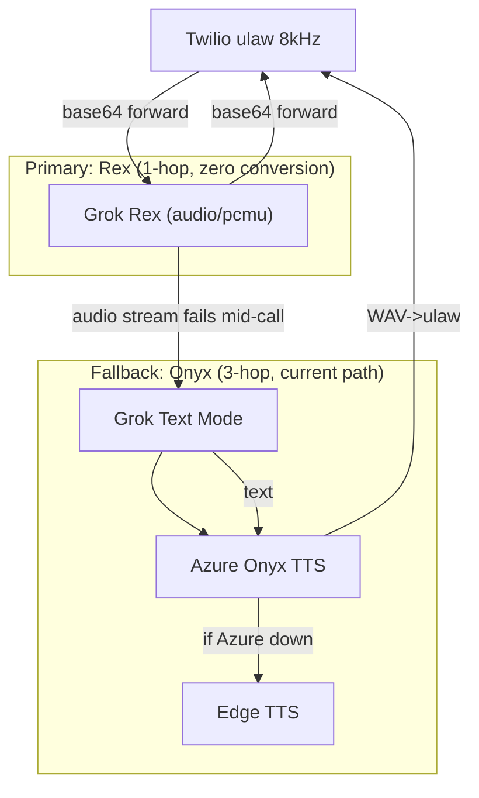

# Switch to Grok Rex Native Voice

## Architecture Change




**Degradation ladder**: Rex (Grok native audio) --> Onyx (Azure TTS) --> Edge TTS (free). If Grok's audio output fails mid-call (no audio deltas received within a timeout), the pipeline automatically downgrades to text-only Grok + Azure Onyx TTS for the remainder of the call. This is the current production path, so it is battle-tested.

**Key discovery**: Grok's Voice Agent API natively supports `audio/pcmu` (G.711 u-law at 8kHz) for both input AND output. This is the exact Twilio format. The primary path eliminates ALL audio conversion -- no `audioop`, no `twilio_mulaw_to_pcm16`, no `_wav_to_mulaw`. Raw base64 chunks flow directly between Twilio and Grok.

## Feature Flag Design

- Env var: `GROK_NATIVE_VOICE` (default: `false`)
- Env var: `GROK_VOICE` (default: `Rex`)
- When disabled: current Azure Onyx pipeline runs unchanged
- When enabled: Grok produces audio directly in Rex's voice
- Rollback: flip env var, restart container

This file is production-critical (max 50 lines per commit rule). The flag approach means existing code stays untouched behind `else` branches. We will need explicit approval for a larger change span since the refactor touches ~120 lines across the file.

## What Survives (Zero Changes)

Every therapeutic intelligence feature is preserved because none of them depend on the TTS engine:


| Feature                            | File / Function                                      | Why Unaffected                         |
| ---------------------------------- | ---------------------------------------------------- | -------------------------------------- |
| Crystal recall at session start    | `_build_grounded_voice_prompt()`                     | System prompt, not audio               |
| Deep memory search mid-call        | `_deep_memory_search()` + `_inject_memory_context()` | Grok conversation injection, not TTS   |
| Web search mid-call                | `_web_search()` + `_inject_web_context()`            | Already uses conversation injection    |
| Neural Mirror (Patent 11)          | `NeuralMirrorSession.on_audio_chunk()`               | Receives raw mulaw bytes -- unchanged  |
| Predictive Entity Graph (Patent 8) | `PredictiveEntityGraph`                              | Fed from transcript text, not audio    |
| EC snapshot rolling loop           | `_record_ec_snapshot()`                              | Reads from DB, not audio               |
| Voice billing/metering             | `add_voice_minutes()`                                | Timer-based, not audio-based           |
| Conversation history storage       | `INSERT INTO conversation_history`                   | Text from Grok transcript events       |
| Crystal forging                    | `_crystal_forge()`                                   | Operates on text pairs                 |
| Vectorize indexing                 | `index_conversation()`                               | Text-based                             |
| Turn detector                      | `MultiSignalTurnDetector`                            | Works on raw mulaw energy -- unchanged |
| Dynamic VAD adjustment             | Neural mirror -> `session.update`                    | Still sends VAD config to Grok         |
| Voice slot management              | `acquire_voice_slot()` / `release_voice_slot()`      | Redis-based, not audio                 |
| Biometrics storage                 | `voice_session_biometrics`                           | Stored from EC snapshots, not TTS      |
| Anti-confabulation rules           | System prompt                                        | Text-based                             |
| Polly.Matthew greeting             | TwiML in `voice_billing_api.py`                      | Separate from stream entirely          |


## What Changes in [backend/app/services/twilio_grok_xtts_pipeline.py](backend/app/services/twilio_grok_xtts_pipeline.py)

### 1. `_open_grok_session()` (line 284)

When `GROK_NATIVE_VOICE=true`:

- Add `"voice": "Rex"` (or value of `GROK_VOICE` env var)
- Change audio config to use u-law for both input AND output:

```python
  "audio": {
      "input": {"format": {"type": "audio/pcmu"}},
      "output": {"format": {"type": "audio/pcmu"}},
  }
  

```

- Remove `"modalities": ["text"]` (Grok's default includes audio when voice is set)

### 2. `grok_listener()` (line 1796)

Currently skips `response.output_audio.delta` events (line 1831). When native voice is enabled:

- Stop skipping `response.output_audio.delta`
- Decode the base64 payload and forward directly to Twilio via `_send_mulaw_to_twilio()` -- **zero conversion needed** since Grok outputs `audio/pcmu` (8kHz u-law)
- Set `_nate_speaking = True` on first audio delta, `False` on `response.output_audio.done` or `response.done`
- Keep processing `response.output_audio_transcript.done` for text logging (conversation history, crystal forging)

### 3. `_on_grok_text()` (line 1731)

When native voice is enabled, this function becomes **transcript-only**:

- Still appends to `assistant_turns` (for crystal forging and history)
- Skips the `_synthesize_with_fallback()` call entirely
- Does not touch `_nate_speaking` (controlled by audio events instead)

### 4. Audio gating (line 2177)

Current: `if not _nate_speaking:` gates user audio to Grok. With native audio, Grok handles barge-in natively via server VAD. Options:

- **Keep the gate** but driven by audio delta events (simpler, safer)
- Recommendation: keep gating, set `_nate_speaking = True` when first audio delta arrives, set `False` when `response.output_audio.done` fires

### 5. Input audio path (line 2118-2188)

When native voice is enabled, eliminate the PCM conversion step:

- Skip `twilio_mulaw_to_pcm16()` call
- Send raw mulaw bytes directly as base64 to Grok's `input_audio_buffer.append`
- Turn detector and neural mirror already work on raw mulaw bytes (lines 2139-2174), unaffected

### 6. `_enforce_call_limit()` (line 1765)

Currently calls `_on_grok_text("Just a heads up...")` which triggers TTS. When native voice is enabled, inject the message into the Grok conversation so Rex speaks it:

```python
await grok_ws.send(json.dumps({
    "type": "conversation.item.create",
    "item": {"type": "message", "role": "user",
             "content": [{"type": "input_text",
                          "text": "[SYSTEM] Tell the user they have about two minutes left. Be brief and natural."}]},
}))
await grok_ws.send(json.dumps({"type": "response.create"}))
```

### 7. Memory search filler (line 1872-1891)

Currently synthesizes "Let me check my notes..." via Edge TTS. When native voice is enabled, use the same conversation injection pattern the **web search preamble already uses** (line 1926-1944):

- Inject a preamble message and `response.create` so Rex says the filler
- Background search runs in parallel
- When results arrive, inject via `conversation.item.create` + `response.create` (already implemented)

### 8. Recovery messages (line 1804-1817)

`_delayed_recovery()` currently calls `_on_grok_text()`. When native voice is enabled, inject into Grok conversation instead (same pattern as call limit above).

### 9. System prompt enhancement

Add emotional cue instructions to the system prompt when Rex is the voice, partially replacing RISSC modulation:

```
VOICE EXPRESSION:
You speak with warmth and emotional attunement. Use natural vocal variety.
When the caller is vulnerable, speak slowly and gently.
When the caller is energized, match their energy.
Pause naturally between thoughts.
```

### 10. Automatic Onyx Fallback (Mid-Call Degradation)

When `GROK_NATIVE_VOICE=true`, a per-session `_audio_mode` flag starts as `"native"`. If Grok fails to deliver audio:

**Detection**: After `response.output_audio_transcript.done` fires (Grok generated text), if no `response.output_audio.delta` events arrived for that response within 3 seconds, the audio stream is considered failed.

**Downgrade**:

```python
_audio_mode = "fallback"  # switch for remainder of this call
```

- `_on_grok_text()` re-enables `_synthesize_with_fallback()` (Onyx -> Edge TTS)
- Input audio reverts to PCM 16kHz path (Grok may need it for text-only mode)
- Log: `[VOICE-FALLBACK] Rex audio failed — falling back to Onyx for this call`

**What triggers fallback**:

- Grok returns text transcript but zero audio deltas for a response
- Grok WebSocket disconnects and reconnects (session renegotiation)
- Grok returns an error event with `"audio"` in the message

**What does NOT trigger fallback**:

- Normal silence between responses (no transcript = no expected audio)
- Grok VAD detecting the user is still talking (response hasn't started)

**Recovery**: Fallback is per-call only. The next new call starts fresh in Rex mode. No permanent state change.

The current Azure Onyx + Edge TTS code paths are fully preserved in the file and ready to activate instantly via this fallback. No code is deleted.

## What Becomes Dormant (Primary Path)

When Rex is active and healthy, these code paths are dormant but alive for fallback:

- `_azure_tts()` -- dormant, activates on fallback
- `_synthesize_with_fallback()` -- dormant, activates on fallback
- `_wav_to_mulaw()` -- dormant, activates on fallback
- `_rissc_params_for_profile()` -- dormant, activates on fallback
- `_get_filler_mulaw()` -- dormant, activates on fallback
- `tts_serial` lock -- dormant, activates on fallback
- `xtts_to_mulaw_state` -- dormant, activates on fallback
- `mulaw_to_pcm_state` -- dormant, activates on fallback
- `twilio_mulaw_to_pcm16()` -- dormant, activates on fallback

## What You Trade


| Lost                                                                             | Replacement                                                   |
| -------------------------------------------------------------------------------- | ------------------------------------------------------------- |
| OpenAI "Onyx" voice identity                                                     | Grok "Rex" voice (confident, clear, professional)             |
| RISSC dynamic voice modulation (temperature, top_p, speed, pitch per felt-sense) | System prompt emotional cues + Grok's built-in expressiveness |
| Nathan's cloned voice (XTTS, already disabled)                                   | Still gone, but was already disabled                          |
| Azure TTS speed control per response                                             | Grok controls its own pacing                                  |
| Edge TTS as primary fallback                                                     | Edge TTS remains third in the chain: Rex -> Onyx -> Edge TTS  |


## What You Gain


| Gain                                           | Impact                                           |
| ---------------------------------------------- | ------------------------------------------------ |
| ~50% lower latency (0.78s vs 1.3-2.3s)         | Caller hears Nate respond faster                 |
| ~25% lower cost ($0.063/min vs $0.08-0.18/min) | Azure TTS charges eliminated                     |
| Zero audio conversion code                     | Simpler, fewer failure points                    |
| Unlimited scaling (xAI infrastructure)         | No TTS bottleneck at any concurrency             |
| Native barge-in support                        | Natural interruption handling                    |
| Consistent voice for fillers                   | "Let me check my notes..." in Rex, not GuyNeural |


## Deployment Steps

1. Add `GROK_NATIVE_VOICE=true` and `GROK_VOICE=Rex` to `.env`
2. `scp` the modified `twilio_grok_xtts_pipeline.py` to GREEN
3. `docker compose -f docker-compose.prod.yml up -d bridge` (bridge uses this file)
4. Test with a live call -- verify Rex voice, memory search, billing all work
5. If issues: set `GROK_NATIVE_VOICE=false` in `.env`, restart -- instant rollback to Onyx

## Cursor Rules Update

After implementation, update [.cursorrules](.cursorrules) Voice Pipeline Decision section to reflect:

```
- Live calls use Grok Native Voice (Rex) when GROK_NATIVE_VOICE=true
- Degradation ladder: Rex (Grok native) -> Onyx (Azure TTS) -> Edge TTS (free)
- If Grok audio stream fails mid-call, automatic fallback to Onyx for remainder of that call
- Manual override: set GROK_NATIVE_VOICE=false to use Onyx as primary (instant rollback)
- XTTS on Hetzner remains STOPPED and DISABLED
```

