# Group Entity Video Architecture

## Current State

- **Daily panels, weekly clips, monthly recaps** all use `grok_imagine_client.py` (`grok.generate_image()` / `grok.generate_video()`) in [delivery_runtime.py](backend/app/sse/foundation/delivery_runtime.py) -- no LoRA support.
- **LoRA training** uses Replicate Flux via [replicate_client.py](backend/app/sse/infrastructure/replicate_client.py) -- `generate_with_loras()` already enforces a **hard 4-LoRA cap** at line 123: `hf_loras = lora_urls[:4]`.
- **LoRA training completion** is handled in [studio_service.py](backend/app/sse/studio_service.py) `poll_lora_training()` (lines 758-784). On `status == "succeeded"`, it calls `save_trained_lora` (R2 manifest) and `register_lora` (DB). This is the hook point for `on_member_lora_updated()`.
- **Flutter rendering**: `VaultBrowserScreen` in [vault_browser_screen.dart](mobile/lib/screens/vault_browser_screen.dart) uses heuristic `panel_type` matching -- line 796: `isVideo = imgUrl.endsWith('.mp4') || pType.contains('clip') || pType.contains('recap')`. No `generation_type` enum switch. **`group_video` is not handled anywhere.** Video playback is external launch only (no in-app player).

---

## Section 1+2: LoRA Resolver and Replicate Migration

### New file: `backend/app/sse/adapters/lora_resolver.py`

```python
async def get_lora_ref(user_id: str, db_pool) -> str | None:
    """Resolve user_id to lora_weights_url. Returns None with warning if missing."""
```

- Query `character_lora_models` by `user_id` where `status='active'`
- Verify R2 path exists via `r2_storage.head_object()`
- Return `lora_weights_url` or `None` with `logger.warning`

### Migration in `delivery_runtime.py`

- **Daily panels** (line 73): Replace `grok.generate_image(prompt)` with `replicate.generate_with_loras(prompt, [lora_ref], [0.8])`. Guard with `get_lora_ref(uid, db_pool)` -- skip if `None`.
- **Weekly clips** (line 116): Replace `grok.generate_video(prompt, src_url)` with Replicate image generation + `grok.generate_video(prompt, replicate_image_url)` for animation. Guard with `get_lora_ref`.
- **Monthly recaps** (lines 131+): Same pattern -- Replicate for images, Grok Video for animation. Guard with `get_lora_ref`.
- Add `from app.sse.infrastructure import replicate_client as replicate` to imports.
- Add `from app.sse.adapters.lora_resolver import get_lora_ref` to imports.
- Keep `grok` import for `generate_video()` and `poll_video_status()` only.
- Add cost logging: `logger.info("[SSE COST] %s %s: $%.4f", generation_type, uid, cost)`.

---

## Section 3: Group Entity Tables

### New migration: `backend/migrations/180_group_entities.sql`

```sql
CREATE TABLE IF NOT EXISTS group_entities (
    group_entity_id  UUID PRIMARY KEY DEFAULT gen_random_uuid(),
    group_type       VARCHAR(50) NOT NULL,
    group_name       VARCHAR(255),
    lora_folder_path TEXT,
    scene_context    VARCHAR(100),
    created_at       TIMESTAMPTZ DEFAULT NOW(),
    updated_at       TIMESTAMPTZ DEFAULT NOW()
);

CREATE TABLE IF NOT EXISTS group_entity_members (
    id               UUID PRIMARY KEY DEFAULT gen_random_uuid(),
    group_entity_id  UUID REFERENCES group_entities(group_entity_id),
    client_id        UUID NOT NULL,
    joined_at        TIMESTAMPTZ DEFAULT NOW(),
    lora_snapshot_path TEXT,
    is_active        BOOLEAN DEFAULT TRUE,
    UNIQUE(group_entity_id, client_id)
);

CREATE TABLE IF NOT EXISTS group_videos (
    id               UUID PRIMARY KEY DEFAULT gen_random_uuid(),
    group_entity_id  UUID REFERENCES group_entities(group_entity_id),
    month            INT NOT NULL,
    year             INT NOT NULL,
    video_url        TEXT,
    composite_url    TEXT,
    generated_at     TIMESTAMPTZ DEFAULT NOW(),
    status           TEXT DEFAULT 'pending',
    error_message    TEXT,
    UNIQUE(group_entity_id, month, year)
);

ALTER TABLE families ADD COLUMN IF NOT EXISTS group_entity_id UUID REFERENCES group_entities(group_entity_id);
ALTER TABLE corporate_sponsors ADD COLUMN IF NOT EXISTS group_entity_id UUID REFERENCES group_entities(group_entity_id);
```

---

## Section 4: Group LoRA Folder Manager

### New file: `backend/app/sse/adapters/group_lora_manager.py`

**Return type change (Audit Item 2)**: `get_group_lora_folder()` returns `list[dict]` not `list[str]`:

```python
[
    {"client_id": "uuid", "lora_url": "https://...", "lora_scale": 0.85},  # active
    {"client_id": "uuid", "lora_url": "https://...", "lora_scale": 0.50},  # background
]
```

- `lora_scale = 0.85` for active members, `0.50` for background members
- Sorted by participation (active first by session count desc, then background)

Methods:

- `compile_group_lora_folder(group_entity_id, db_pool)` -- called on creation/membership change
- `sync_group_lora_folder(group_entity_id, db_pool)` -- compares `lora_snapshot_path` vs current, partial update
- `get_group_lora_folder(group_entity_id, db_pool, month=None)` -- returns enriched dict list with participation-aware `lora_scale`; calls `compile` if stale
- `on_member_lora_updated(client_id, db_pool)` -- finds all groups, calls `sync` per group

### Hook point for `on_member_lora_updated` (Audit Item 3)

Insert the call in [studio_service.py](backend/app/sse/studio_service.py) **after line 783** (after successful `register_lora`):

```python
# Line 783 (existing): except Exception as _lr_err: ...
# After the register_lora try/except block, add:
try:
    from app.sse.adapters.group_lora_manager import on_member_lora_updated
    await on_member_lora_updated(character_key, db_pool)
except Exception as _gl_err:
    logger.warning("[STUDIO] Group LoRA sync failed: %s", _gl_err)
```

The `character_key` maps to the user/client identifier used in `group_entity_members.client_id`. Verify the mapping during implementation -- if `character_key` is not the same as `client_id` (UUID), add a resolution step.

---

## Section 5: Participation Tracker

### New file: `backend/app/sse/adapters/participation_tracker.py`

```python
async def get_group_participation(
    group_entity_id: str, month: int, year: int, db_pool
) -> dict:
    """Returns {"active_members": [...], "background_members": [...]}"""
```

- Query `group_entity_members` for active members
- Cross-reference session logs (family sanctuary, group coaching, BLE proximity, community mesh) for the given month
- Active = any group-context session; Background = no group session (never "absent")
- Active members sorted by session count descending (feeds LoRA priority)

---

## Section 6: Group Video Generator

### New file: `backend/app/sse/group_video_generator.py`

```python
async def generate_monthly_group_video(
    group_entity_id: str, month: int, year: int, db_pool
) -> dict:
```

### 4-LoRA Cap Strategy (Audit Item 1)

The Replicate Flux API hard-caps at 4 LoRAs (`replicate_client.py` line 123). The strategy:

1. Get enriched member list from `get_group_lora_folder()` (already sorted: active by session count desc, then background)
2. **Top 4** members get `lora_urls` + `lora_scales` passed to `generate_with_loras()`
3. **Remaining members** (5+) are described in the text prompt only: `"Also present in the scene: [Name1], [Name2] as supportive background figures"`
4. **No silent truncation** -- log explicitly: `logger.info("[GROUP VIDEO] %d/%d members LoRA-rendered, %d text-only: %s", lora_count, total, text_only_count, text_only_names)`
5. No image compositing in v1 -- single generation call with prompt + up to 4 LoRAs

### Step-by-step flow

- **Step 1**: Load group context + `get_group_lora_folder()` + `get_group_participation()`
- **Step 2**: Build prompt with scene_context, placement directives (active foreground, background midground), text-only member descriptions
- Extract parallel `lora_urls[:4]` and `lora_scales[:4]` from the enriched dict list
- Call `replicate.generate_with_loras(prompt, lora_urls, lora_scales)`
- **Step 3**: Store composite image at R2 path (Audit Item 4):
  `groups/{group_entity_id}/staging/{year}-{month:02d}-composite.png`
  **RETAIN after video generation** -- do not delete. Needed for debugging.
- Animate with `grok.generate_video(prompt, composite_url)` + `_poll_video()`
- Duration/style per `group_type` (family=60s, therapy/corporate/prison=45s)
- **Step 4**: Store video at `groups/{group_entity_id}/videos/{year}-{month:02d}-monthly.mp4`
- Insert into `group_videos` table (include `composite_url` column)

### Delivery Gate (Audit Item 5)

**Before inserting delivery rows**, verify the Flutter app can render `group_video`:

**Current gap**: `VaultBrowserScreen` line 796 checks `pType.contains('clip') || pType.contains('recap')` -- `group_video` does not match either. The `.mp4` extension check will catch it via `imgUrl.endsWith('.mp4')`, so video display (external launch) will work. However, the content type labeling and vault registration need alignment.

**Implementation approach**:
- In `vault_integration.register_panel_in_vault()`, register with `panel_type='group_video'`
- In the Flutter `VaultBrowserScreen`, the `isVideo` heuristic already catches `.mp4` URLs, so external video playback works without code changes
- **BUT**: the panel will not have a distinguished label (it will render generically). Log this gap: `logger.info("[GROUP VIDEO] Delivery: Flutter renders via .mp4 heuristic, no dedicated group_video UI yet")`
- Do NOT block delivery -- the video is watchable. The dedicated UI treatment is a follow-up task.

---

## Section 7: Monthly Cron Integration

In [layer0_orchestrator.py](backend/app/sse/layer0_orchestrator.py), add a new job:

```python
self._sched.add_job(
    self._run_group_videos, CronTrigger(hour=6, day="28-31"),
    id="sse_group_videos", replace_existing=True)
```

The `_run_group_videos` method:

1. Query all `group_entities` with active members
2. For each, call `sync_group_lora_folder()` then `generate_monthly_group_video()`
3. Run after individual monthly recaps (hour=6 vs hour=4 for individual)
4. Log completion and failures per `group_entity_id`

---

## Section 8: BLE/NFC Auto-Enrollment

### In [ble_co_traveler.py](backend/app/sse/ble_co_traveler.py)

When a BLE proximity session creates/joins a group:
- Check if `group_entity` exists for this proximity group
- If not, `INSERT INTO group_entities` with `group_type='ble_proximity'`
- `INSERT INTO group_entity_members` with `ON CONFLICT DO NOTHING`
- Call `compile_group_lora_folder()` if new, `sync_group_lora_folder()` if existing

### In [community_mesh_engine.py](backend/app/services/community_mesh_engine.py)

In `record_session()`:
- Check/create `group_entity` for community sessions
- Add participants to `group_entity_members`

---

## Architecture Diagram

```mermaid
flowchart TD
    subgraph training [LoRA Training]
        TrainReq[Train Request] --> ReplicateTrain[replicate_client.train_lora]
        ReplicateTrain --> PollTrain[studio_service.poll_lora_training]
        PollTrain -->|succeeded| RegisterLora[lora_registry.register_lora]
        RegisterLora --> GroupHook[on_member_lora_updated]
        GroupHook --> SyncFolder[sync_group_lora_folder]
    end

    subgraph generation [Monthly Group Video]
        Cron[layer0_orchestrator cron] --> GetFolder[get_group_lora_folder]
        GetFolder --> Participation[get_group_participation]
        Participation --> LoRACap["4-LoRA cap: top 4 by activity"]
        LoRACap --> ReplicateImg["replicate.generate_with_loras (image)"]
        ReplicateImg --> StageR2["R2: staging composite (RETAINED)"]
        StageR2 --> GrokVid["grok.generate_video (animate)"]
        GrokVid --> FinalR2["R2: final video"]
        FinalR2 --> Deliver[Vault + delivery row]
    end

    subgraph enrollment [Auto-Enrollment]
        BLE[ble_co_traveler] --> CreateGroup[group_entities INSERT]
        CommunityMesh[community_mesh_engine] --> CreateGroup
        CreateGroup --> AddMembers[group_entity_members INSERT]
        AddMembers --> CompileFolder[compile_group_lora_folder]
    end
```



---

## Files Changed/Created Summary

| Action | File |
|--------|------|
| CREATE | `backend/app/sse/adapters/lora_resolver.py` |
| CREATE | `backend/app/sse/adapters/group_lora_manager.py` |
| CREATE | `backend/app/sse/adapters/participation_tracker.py` |
| CREATE | `backend/app/sse/group_video_generator.py` |
| CREATE | `backend/migrations/180_group_entities.sql` |
| MODIFY | `backend/app/sse/foundation/delivery_runtime.py` (Replicate migration) |
| MODIFY | `backend/app/sse/studio_service.py` (add `on_member_lora_updated` hook after line 783) |
| MODIFY | `backend/app/sse/layer0_orchestrator.py` (add group video cron job) |
| MODIFY | `backend/app/sse/ble_co_traveler.py` (auto-enrollment) |
| MODIFY | `backend/app/services/community_mesh_engine.py` (auto-enrollment) |
| MODIFY | `backend/app/sse/infrastructure/grok_imagine_client.py` (docstring: not for LoRA) |
