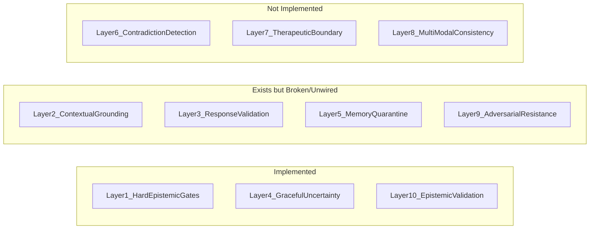

# 10-Layer Hallucination Defense Architecture

> **Execution Order:** 2 of 4 — AFTER VPS clone redundancy
> **Depends on:** `full_system_integrity_fix_03b12602.plan.md` (Layers 1, 4, 10 — completed)
> **Migration:** `137_queens_guard_events.sql` (Layer 9 table)
> **Deploy order:** Backend first (validator, crystallizer, defense), then bridge (Queens Guard wiring), then dashboard
> **Trust impact:** May add checks to `noetic_helix_auditor.py` — update `noetic_helix_check_count` in `trust_baseline` after implementation

## Current State

Layers 1, 4, and 10 are fully implemented as prompt-level guardrails in `bridge_server.py`. The remaining 7 layers exist in various states of partial implementation or are entirely missing.

## Layer Status Detail

| Layer | Name                                | Status  | Key Gap                                                                                                              |
| ----- | ----------------------------------- | ------- | -------------------------------------------------------------------------------------------------------------------- |
| 1     | Hard Epistemic Gates                | DONE    | In `_IDENTITY_BLOCK`                                                                                                 |
| 2     | Contextual Grounding                | Partial | Empty data guards exist; no source attribution tagging on responses                                                  |
| 3     | Response Validation                 | Partial | Validator exists but log-only; NOT wired into bridge therapy responses at all                                        |
| 4     | Graceful Uncertainty                | DONE    | In therapy prompt                                                                                                    |
| 5     | Memory Quarantine                   | Partial | Crystal validation works; Crystal Integrity Helix never invoked (attribute name mismatch `crystal_helix` vs `helix`) |
| 6     | Cross-Session Contradiction         | Missing | No contradiction detection across crystals or sessions                                                               |
| 7     | Therapeutic Boundary Enforcement    | Missing | No programmatic scope limitation for clinical claims                                                                 |
| 8     | Multi-Modal Consistency             | Missing | Voice biometrics exist but no cross-modal consistency verification                                                   |
| 9     | Adversarial Resistance              | Partial | Queens Guard exists, initialized in `main.py`, but NOT wired into bridge or SkyEye Chat                              |
| 10    | Epistemic Validation Before Reframe | DONE    | In therapy/group/coaching prompts                                                                                    |

---

## Phase 1: Fix Broken Wiring (Layers 2, 3, 5, 9)

### Layer 2 — Contextual Grounding Enhancement

**File:** [backend/app/services/skyeye_chat.py](backend/app/services/skyeye_chat.py)

The empty data guards (`[SECTION: 0 RECORDS]`) are the defensive side. The offensive side — source attribution — is missing. When Nate makes a claim, the response should tag which context section sourced it.

**Changes:**

- Add a `SOURCE_ATTRIBUTION_RULE` to the Big Nate system prompt requiring Nate to internally track which context section (posting history, marketing, crystals, wisdom) supports each claim
- Add a post-response check in the validator that flags claims not grounded in any provided context section
- Extend `NateResponseValidator.validate()` with a `context_grounding_check(response, context_sections)` method that detects factual assertions not traceable to provided context

### Layer 3 — Response Validation Enforcement

**Files:** [backend/app/services/nate_response_validator.py](backend/app/services/nate_response_validator.py), [backend/app/websocket/bridge_server.py](backend/app/websocket/bridge_server.py), [backend/app/services/skyeye_chat.py](backend/app/services/skyeye_chat.py)

Currently:

- SkyEye Chat calls validator but never blocks (line 964: `if accuracy_warnings: logger.warning(...)`)
- Bridge therapy responses have NO validator at all
- Crystallizer uses validator with empty context `{}`

**Changes:**

- **SkyEye Chat**: When `is_high_severity()` returns `True`, replace the response with a safe fallback ("I need to be more careful with that response. Let me rephrase...") and regenerate, or strip the problematic claims
- **Bridge therapy**: Wire `NateResponseValidator` into the therapy response pipeline in `bridge_server.py` after LLM response is received, before sending to client. High-severity findings trigger a re-generation with a correction prompt
- **Crystallizer**: Pass real context (posting history, activity timeline) instead of `{}` when available from `app.state`

### Layer 5 — Memory Quarantine (Crystal Integrity Helix Fix)

**Files:** [backend/app/services/nate_memory_crystallizer.py](backend/app/services/nate_memory_crystallizer.py), [backend/app/services/security/distributed_defense.py](backend/app/services/security/distributed_defense.py)

The crystallizer (line ~270) checks `defense.crystal_helix` but `DistributedDefenseShield` defines `self.helix`. The attribute name mismatch means the Crystal Integrity Helix verification **never runs**.

**Changes:**

- Fix attribute access: change `defense.crystal_helix` to `defense.helix` in `nate_memory_crystallizer.py` (or add an alias `self.crystal_helix = self.helix` in `DistributedDefenseShield`)
- Add a quarantine state: crystals that fail helix verification are stored with `scope='quarantined'` instead of being silently dropped, allowing manual review
- Add quarantine metrics: log quarantine events to `skyeye_activity` with type `crystal_quarantined`

### Layer 9 — Adversarial Resistance Wiring

**Files:** [backend/app/websocket/bridge_server.py](backend/app/websocket/bridge_server.py), [backend/app/services/skyeye_chat.py](backend/app/services/skyeye_chat.py), [backend/app/services/security/queens_guard.py](backend/app/services/security/queens_guard.py)

Queens Guard is initialized in `main.py` (line 1244) and stored in `app.state` but never called from any chat pipeline.

**Changes:**

- **Bridge therapy**: Before sending user input to LLM, run `queens_guard.sanitize_input(user_id, message)`. If injection flags are returned, log the attempt and sanitize the input before LLM processing
- **SkyEye Chat**: Before calling LLM, run L1 input sanitization on the user message. After LLM response, run L3 output verification
- Pass `queens_guard` into bridge via the same injection pattern used for `db_pool` and `billing_system`
- Add `queens_guard_events` table creation to a migration if it doesn't exist

---

## Phase 2: Build Missing Layers (6, 7, 8)

### Layer 6 — Cross-Session Contradiction Detection

**New file:** `backend/app/services/contradiction_detector.py`

When crystals are stored, check for semantic contradictions with existing crystals in the same domain.

**Architecture:**

- On crystal creation in `nate_memory_crystallizer.py`, before storing, query Vectorize for the 5 most similar existing crystals in the same domain
- Use a lightweight LLM call (Workers AI, temperature 0.1) to classify: `CONSISTENT`, `NOVEL`, or `CONTRADICTS`
- If `CONTRADICTS`, compare confidence scores:
  - Higher confidence new crystal → set `superseded_by` on old crystal
  - Lower confidence new crystal → mark new crystal as `needs_review`
  - Equal → store both, flag for admin review
- Log contradictions to `skyeye_activity` with type `crystal_contradiction_detected`

**Integration points:**

- [backend/app/services/nate_memory_crystallizer.py](backend/app/services/nate_memory_crystallizer.py) — call contradiction check after validator, before INSERT
- [backend/app/services/vectorize_service.py](backend/app/services/vectorize_service.py) — semantic similarity search for contradiction candidates

### Layer 7 — Therapeutic Boundary Enforcement

**Files:** [backend/app/services/nate_response_validator.py](backend/app/services/nate_response_validator.py), [backend/app/websocket/bridge_server.py](backend/app/websocket/bridge_server.py)

Nate must not make clinical claims outside his scope (diagnoses, medication recommendations, prognoses).

**Changes:**

- Add `THERAPEUTIC_BOUNDARY_PATTERNS` to `nate_response_validator.py`:
  - Diagnosis patterns: "you have [condition]", "you are [diagnosis]", "this is [disorder]"
  - Medication patterns: "you should take", "I recommend [drug]", "increase/decrease your dose"
  - Prognosis patterns: "you will recover", "this will last [duration]", "your condition will"
  - Legal/financial advice: "you should sue", "file for", "you are entitled to"
- When triggered: replace the specific claim with a boundary response: "That's something your healthcare provider would be better positioned to address. What I can help with is..."
- Add `THERAPEUTIC_BOUNDARY_PROMPT` to `_IDENTITY_BLOCK`:
  - "You are NOT a licensed clinician. Never diagnose, prescribe, or prognosticate."
  - "Never give legal or financial advice."
  - "When you detect a question requiring clinical expertise, redirect to their provider."

### Layer 8 — Multi-Modal Consistency Verification

**Files:** [backend/app/services/nevedal_engine.py](backend/app/services/nevedal_engine.py), [backend/app/websocket/bridge_server.py](backend/app/websocket/bridge_server.py)

When voice biometrics indicate emotional distress but the text response is dismissive (or vice versa), flag the inconsistency.

**Changes:**

- Add `check_modal_consistency(biometrics, response_text)` to `nevedal_engine.py`:
  - Compare voice emotional state (from `VoiceBiometricExtractor`: pitch variance, energy, speech rate) with response tone
  - If biometrics show high distress (gamma_env > 0.6) but response text doesn't acknowledge distress → flag
  - If biometrics show calm (gamma_env < 0.2) but response assumes crisis → flag
- Wire into bridge therapy response path: after both voice biometrics and text response are available, run consistency check
- Log inconsistencies to `nevedal_metrics` session data for clinical review
- This is an advisory layer (logs + clinical alerts), not a blocking layer

---

## Phase 3: Integration Testing and Observability

### Hallucination Defense Dashboard

Add a "Defense Layers" section to the existing SkyEye dashboard or Sovereign Command showing:

- Layer status (active/degraded/off) for all 10 layers
- Recent validator warnings (from `skyeye_activity` type `nate_accuracy_warning`)
- Crystal quarantine queue (crystals with `scope='quarantined'`)
- Contradiction detection log
- Queens Guard event log

### Auditor Integration

Add hallucination defense checks to the existing `noetic_helix_auditor.py` or create a lightweight health check:

- Validator is importable and patterns compile
- Queens Guard is on `app.state`
- Crystal Integrity Helix attribute resolves correctly
- Empty data guards are present in system prompt

---

## File Impact Summary

| File                                                   | Changes                                                                   |
| ------------------------------------------------------ | ------------------------------------------------------------------------- |
| `backend/app/services/nate_response_validator.py`      | Add context grounding check, therapeutic boundary patterns, enforce mode  |
| `backend/app/services/nate_memory_crystallizer.py`     | Fix helix attribute, add quarantine scope, pass real context to validator |
| `backend/app/services/security/distributed_defense.py` | Add `crystal_helix` alias                                                 |
| `backend/app/websocket/bridge_server.py`               | Wire validator + Queens Guard into therapy pipeline                       |
| `backend/app/services/skyeye_chat.py`                  | Add source attribution rule, enforce validator blocking                   |
| `backend/app/services/contradiction_detector.py`       | NEW — cross-crystal contradiction detection                               |
| `backend/app/services/nevedal_engine.py`               | Add modal consistency check method                                        |

