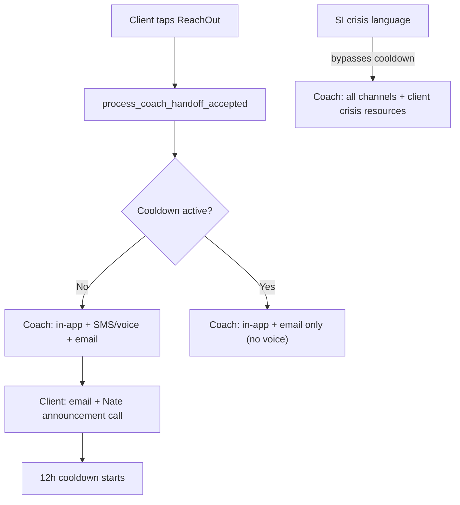

# Handoff Cooldown & Client Notifications

## Current flow (verified)

Client taps "Reach out" → `coach_handoff_accepted` WS → [backend/app/services/coach_handoff.py](backend/app/services/coach_handoff.py) `process_coach_handoff_accepted()` → [backend/app/services/sensitive_alert_dispatcher.py](backend/app/services/sensitive_alert_dispatcher.py) `dispatch_sensitive_alert()` → [backend/app/services/coach_notifications.py](backend/app/services/coach_notifications.py) `notify_coach()` (in-app + SMS, voice-ping fallback when A2P blocks SMS) + coach email. Each distinct `turn_id` re-fires everything — hence the repeated calls from longra.

## 1. Cooldown helper (new logic in `coach_handoff.py`)

- Add `handoff_cooldown_active(db_pool, client_username) -> bool`: query `sensitive_bridge_log` for `coach_handoff_emitted` rows with `payload_json->>'handoff_source' = 'client_accepted'` within `HANDOFF_COOLDOWN_HOURS` (env, default 12). Mirrors the existing `_recent_escalation_in_window` pattern in [backend/app/services/suicide_ideation_coach_alert.py](backend/app/services/suicide_ideation_coach_alert.py).
- In `process_coach_handoff_accepted()`: check cooldown before dispatch.
  - Cooldown active → dispatch with `suppress_voice=True` (coach still gets in-app + email; no phone call), skip client confirmation call/email, return `status: "cooldown_email_only"`.
  - No cooldown → full dispatch, then fire client confirmations (step 3).

## 2. Voice suppression plumbing

- `dispatch_sensitive_alert()` ([sensitive_alert_dispatcher.py](backend/app/services/sensitive_alert_dispatcher.py)): new kwarg `suppress_voice: bool = False`, passed into the `notify_coach` payload.
- `notify_coach()` ([coach_notifications.py](backend/app/services/coach_notifications.py)): in the `client_initiated_handoff` branch, skip both SMS and `_send_coach_voice_ping` when `payload.get("suppress_voice")` is true. Email path unchanged.
- Coach email body (handoff template in `dispatch_sensitive_alert`) gains a line: "The client has been notified that you were contacted by email and phone."

## 3. Client confirmations (new module `backend/app/services/handoff_client_confirmation.py`)

Called from `process_coach_handoff_accepted()` after a successful full dispatch:

- **Client email** — lookup `profile_data->>'email'`; new `EmailService.send_handoff_confirmation(client_email, coach_name)` in [backend/app/services/notifications_service.py](backend/app/services/notifications_service.py) (reuses generic `send_email`, line 517): "Your coach {name} has been emailed and a phone message was sent. They typically respond within 12 hours."
- **Little Nate announcement call** — lookup `profile_data->>'phone'`; reuse the Polly TwiML pattern from `_send_coach_voice_ping` (generalize into a shared `_send_voice_ping(to_phone, script)` or copy into the new module). Fires when the call is placed (no answer detection). Script: coach was called and emailed, they'll follow up soon.
- Both are best-effort (try/except, logged); failures don't fail the handoff. Result flags (`client_email_sent`, `client_call_placed`) added to the handler's return so the Flutter ack can show them.

## 4. Adaptive chip suppression during cooldown

In [backend/app/websocket/bridge_server.py](backend/app/websocket/bridge_server.py) at the chip emission point (line ~10076, `should_offer_coach_ui`): before sending `offer_coach_handoff`, await `handoff_cooldown_active()`. If active, send a new WS payload `coach_handoff_cooldown_notice` (with `coach_name` and remaining hours) instead of the chip. Cache the cooldown result in-memory per uid (dict with expiry timestamp) so this is one DB query per cooldown window, not per message.

Bridge is a protected file — this is ~12 additive lines with `# QUANTUM-CRYSTAL-ARCH` comments.

## 5. Crisis bypass

- In [suicide_ideation_coach_alert.py](backend/app/services/suicide_ideation_coach_alert.py) `_recent_escalation_in_window()` (line 60): remove `'coach_handoff_emitted'` from the dedup event list so a non-crisis handoff cooldown never suppresses an SI crisis alert. SI keeps its own 24h dedup on `coach_alert_dispatched` only.
- At the bridge call site where `maybe_dispatch_si_coach_alert` returns `"dispatched"`: push a `crisis_resources` WS message to the client (988 Suicide & Crisis Lifeline, text HOME to 741741, 911). ~10 additive bridge lines.
- Flutter renders `crisis_resources` as a prominent banner in the chat.

## 6. "Message Client" button — Coach Command VIEW BRIEF

- **Backend**: new module `backend/app/services/coach_client_messenger.py` with `send_direct_client_message(db_pool, coach_profile, client_username, message, channels)`:
  - Verify the client is assigned to this coach (same fields used by `coach_get_clients`).
  - Email via `EmailService.send_email`; SMS via the existing `_send_coach_sms` helper (note: A2P is currently carrier-blocked, so SMS will report failure honestly — per-channel results returned).
  - Audit row in `sensitive_bridge_log` (`event_type='coach_direct_message_sent'`).
- **Bridge**: new WS handler `coach_message_client_direct` (COACH/ADMIN only) delegating to the service, returning per-channel results (~15 additive lines).
- **Flutter** ([mobile/lib/updated_screens.dart](mobile/lib/updated_screens.dart)): in the VIEW BRIEF panel next to `_buildIntakeButton` (line ~8967), add a "Message Client" button → dialog with message field + Email/SMS checkboxes (disabled with hint when contact info missing from brief) → sends WS message → shows per-channel success/failure snackbar. Handle the `coach_handoff_cooldown_notice` and `crisis_resources` message types in the client chat screen.

## 7. Deploy

- Migrationless (cooldown derived from existing `sensitive_bridge_log`).
- Bridge changes total ~35-40 additive lines across the two touch points — within the 50-line protected-file limit, behind env flags `HANDOFF_COOLDOWN_HOURS` (default 12) and graceful no-op when helpers fail to import.
- `flutter build web --release` must pass; deploy via `safe_deploy.sh bridge backend` + Flutter web rsync + Cloudflare purge.

## Confirmed decisions

- Client email fires when the coach call is placed (voicemail counts as "message sent").
- Little Nate's client call is a Polly announcement, not a conversational Grok call.