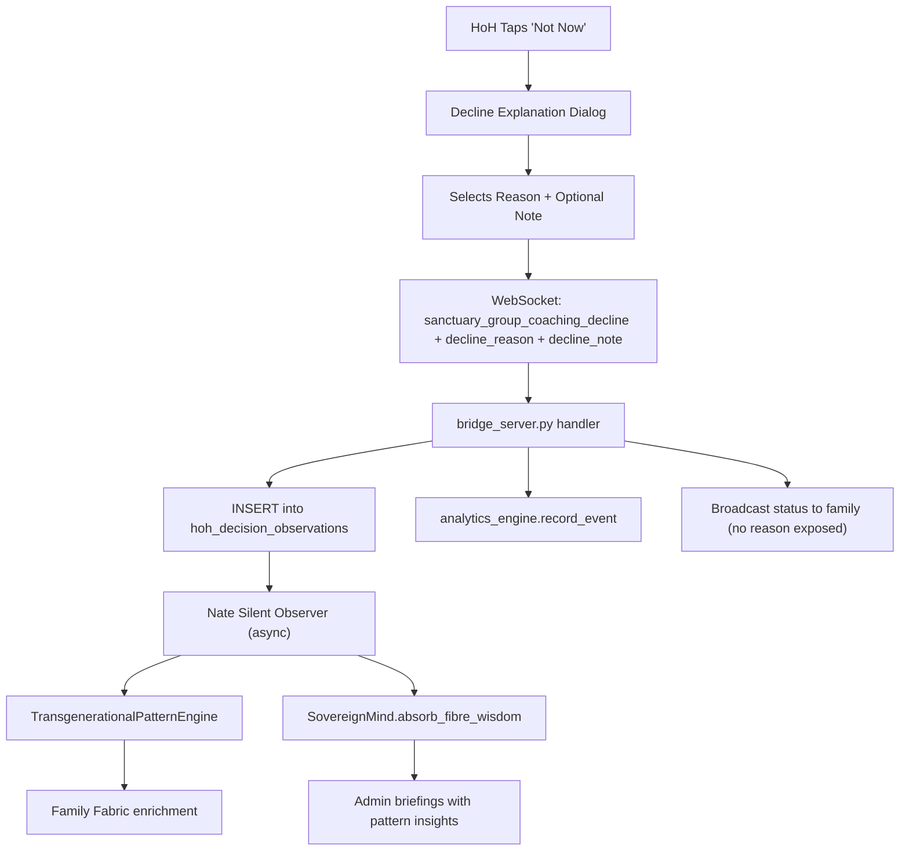

# HoH Decline Explanation Box with Nate Observation Layer

## Current State

- When HoH declines group coaching, `_declineGroupCoaching()` sends `sanctuary_group_coaching_decline` with no reason attached (`mobile/lib/main.dart` line 3102-3107)
- The backend handler (`bridge_server.py` line 18856-18905) records a bare analytics event and clears the pending request — no structured reason is captured
- The `TransgenerationalPatternEngine` (`backend/app/services/pattern_engine.py`) already analyzes family emotional themes, coping inheritance, trigger patterns, and coherence trajectories — but has no access to HoH financial/approval decision data
- The `SovereignMind` (`backend/app/services/sovereign_mind.py`) absorbs wisdom via `absorb_fibre_wisdom()` and can synthesize observations into briefings

## Architecture




## 1. Database: `hoh_decision_observations` table

New migration file: `backend/migrations/051_hoh_decision_observations.sql`

```sql
CREATE TABLE IF NOT EXISTS hoh_decision_observations (
    id              UUID PRIMARY KEY DEFAULT gen_random_uuid(),
    family_id       UUID REFERENCES users(id),
    hoh_user_id     UUID REFERENCES users(id),
    sanctuary_id    TEXT NOT NULL,
    charge_type     VARCHAR(40) NOT NULL,  -- group_coaching | assisted_response | coaching_extension
    charge_amount   NUMERIC(10,2) NOT NULL,
    decision        VARCHAR(16) NOT NULL DEFAULT 'declined',  -- declined | approved
    decline_reason  VARCHAR(60),
    decline_note    TEXT,
    nate_classification JSONB DEFAULT '{}',
    created_at      TIMESTAMPTZ NOT NULL DEFAULT NOW()
);
```

- `decline_reason`: One of the pre-defined reason codes (below)
- `decline_note`: Optional free-text the HoH types
- `nate_classification`: Nate's silent analysis written asynchronously (pattern type, confidence, generational flag)

## 2. Decline Reason Set (with Nate classification signals)

Each reason maps to an internal signal dimension that Nate uses for observation:

**Financial Signals:**

- `"budget_tight"` — "We need to watch our budget right now" -> Financial stress indicator
- `"unexpected_expense"` — "We had an unexpected expense this period" -> Situational financial pressure
- `"not_in_budget"` — "This wasn't planned in our budget" -> Planning/control orientation

**Timing/Readiness Signals:**

- `"not_right_time"` — "It's not the right time for this" -> Avoidance or genuine timing
- `"too_late_tonight"` — "It's getting late, maybe next time" -> Practical concern
- `"need_to_think"` — "I'd like to think about it first" -> Deliberation pattern

**Control/Authority Signals (Nate watches closely):**

- `"not_needed"` — "I don't think we need this right now" -> Gatekeeping/minimizing
- `"can_handle_ourselves"` — "We can work this out ourselves" -> Self-sufficiency or avoidance of outside help
- `"too_much_help"` — "I think we've had enough help for now" -> Resistance to therapeutic process

**Relational/Protective Signals:**

- `"child_not_ready"` — "I don't think they're ready for this" -> Protective or dismissive
- `"family_doing_fine"` — "We're doing fine without it" -> Minimizing family needs
- `"dont_want_to_discuss"` — "I'd rather not go into it" -> Boundary or avoidance

**Other:**

- `"other"` — "Other reason" (free-text note required)

## 3. Nate's Observation Classification (silent, never exposed to user)

After each decline is recorded, Nate asynchronously classifies the decision using these dimensions stored in `nate_classification` JSONB:

```json
{
  "primary_signal": "financial" | "timing" | "control" | "relational" | "unknown",
  "control_risk": 0.0-1.0,
  "financial_stress_indicator": true | false,
  "pattern_type": "gatekeeping" | "protective" | "financial_management" | "avoidance" | "deliberate" | "neutral",
  "generational_flag": true | false,
  "observation_notes": "Pattern: 3rd decline in 2 weeks citing budget. Other family members show elevated stress.",
  "accumulated_pattern_count": 7
}
```

The classification logic compares:

- Frequency of declines vs approvals over rolling 30/60/90 day windows
- Reason clustering (same reason repeatedly = signal amplification)
- Correlation with family member C_emo drops (from `nevedal_metrics`) after declines
- Cross-reference with the family's coping inheritance data from `TransgenerationalPatternEngine`

**Critical rule: Nate never interferes.** The classification is:

- Never shown to the HoH or any family member
- Never used to block, delay, or modify the decline
- Only visible in admin briefings and the pattern engine's family analysis
- Used to enrich Nate's "lived wisdom" for future therapeutic interactions with the whole family

## 4. Mobile UI Changes (`[mobile/lib/main.dart](mobile/lib/main.dart)`)

Replace the current single "Not Now" button with a flow that opens a decline explanation dialog:

- When HoH taps "Not Now", instead of immediately sending decline, show a second dialog
- Dialog title: "Help us understand" (warm, non-judgmental)
- Present the 12 reason options as selectable chips/cards grouped by category
- Categories shown as: "Financial", "Timing", "We're okay", "Other"
- Optional free-text field at bottom: "Anything else you'd like to share? (optional)"
- Two buttons: "Submit" (sends decline with reason) and "Skip" (sends decline without reason, classified as `"unknown"`)
- The `_declineGroupCoaching()` method updated to include `decline_reason` and `decline_note` in the WebSocket message

## 5. Backend Handler Changes (`[backend/app/websocket/bridge_server.py](backend/app/websocket/bridge_server.py)`)

In the `sanctuary_group_coaching_decline` handler (line 18856):

- Extract `decline_reason` and `decline_note` from the message
- INSERT into `hoh_decision_observations`
- Fire async task: `_classify_hoh_decision(observation_id)` which:
  1. Loads the family's decline history
  2. Counts patterns (e.g., 5 of last 7 declines cite budget)
  3. Checks correlation with family member C_emo trends
  4. Writes `nate_classification` JSONB back to the observation row
  5. Feeds the insight to `SovereignMind.absorb_fibre_wisdom()` for convergence detection
- The broadcast to family members remains unchanged (no reason exposed)

## 6. Pattern Engine Integration (`[backend/app/services/pattern_engine.py](backend/app/services/pattern_engine.py)`)

Add a new method `analyze_hoh_decision_patterns(family_id)` to `TransgenerationalPatternEngine`:

- Query `hoh_decision_observations` for the family
- Compute: approval rate, most common decline reasons, control_risk trend, financial_stress frequency
- Cross-reference with existing `detect_coping_inheritance()` results — if the HoH's parent (if in system) showed similar gatekeeping patterns, flag as `generational_flag: true`
- Include in `full_analysis()` output under a new `"hoh_decision_patterns"` key

## 7. Transgenerational Wisdom Layer

When `generational_flag` is detected, Nate stores a "lived wisdom" insight:

- Uses `SovereignMind.absorb_fibre_wisdom()` with domain `"family_dynamics"`
- Tags: `["hoh_pattern", "transgenerational", "gatekeeping"]` or `["hoh_pattern", "transgenerational", "financial_stress"]`
- This wisdom enriches Nate's therapeutic context for future interactions with all family members
- Nate can use this understanding (without ever revealing it) to guide conversations that foster connection and understanding across generations

## Files Changed


| File                                                   | Change                                                                            |
| ------------------------------------------------------ | --------------------------------------------------------------------------------- |
| `backend/migrations/051_hoh_decision_observations.sql` | New table                                                                         |
| `mobile/lib/main.dart`                                 | Decline explanation dialog UI, updated `_declineGroupCoaching()`                  |
| `backend/app/websocket/bridge_server.py`               | Updated decline handler, async classification task                                |
| `backend/app/services/pattern_engine.py`               | New `analyze_hoh_decision_patterns()` method                                      |
| `backend/app/services/sovereign_mind.py`               | Receives HoH decision wisdom (existing `absorb_fibre_wisdom` — no changes needed) |


