# JUDGE DOJO -- Full Multi-Phase Build

## Architecture Overview

```mermaid
flowchart TD
    subgraph reg [Registration and Access]
        CoachReg["Coach subscribes to JUDGE DOJO"] --> BarID["Assigned Judge Nate Bar ID"]
        StudentReg["Student registers as COACH_ONLY client"] --> LawyerVerify["Coaching Lawyer verifies student"]
        LawyerVerify --> AdminApprove["Admin approves student"]
        AdminApprove --> StudentAccess["Student gets JUDGE portal access"]
    end
    subgraph solo [Solo Training]
        CaseUpload["Lawyer uploads case documents"] --> NateReview["Judge Nate reviews and advises"]
        BarStudy["BAR exam practice personas"] --> NateAssess["Judge Nate scores and evaluates"]
    end
    subgraph debate [Coach vs Coach Debate]
        TwoCoaches["Two JUDGE coaches matched"] --> ZoomDebate["Zoom call with Judge Nate observing"]
        ZoomDebate --> NateJudge["Judge Nate: objections, sustain, deny, contempt"]
        NateJudge --> Ruling["One coach's argument prevails, both scored"]
    end
    subgraph mentoring [Coach-Student Mentoring]
        CoachAsJudge["Coach acts as Judge in Zoom"] --> StudentArgues["Student presents arguments"]
        NateObserve["Judge Nate observes both"] --> CoachEval["Coach gets Judge-ability assessment"]
        NateObserve --> StudentEval["Student gets argument evaluation"]
        CoachEval --> NateLearns["Nate learns from coaching lawyer"]
    end
    subgraph lexis [LexisNexis Integration]
        LawyerAuth["Lawyer authorizes via OAuth 2.0"] --> NateSearch["Nate searches LexisNexis"]
        NateSearch --> CaseGuidance["Points lawyer to relevant cases"]
    end
```

---

## Phase 1: JUDGE DOJO Registration and Core Setup

**Goal:** Make JUDGE selectable as a 7th DOJO, define personas, set pricing, and generate Judge Nate Bar IDs.

### Backend: DOJO Definition

**File:** [backend/app/services/night_school_director.py](backend/app/services/night_school_director.py)

- Add `JUDGE = "JUDGE"` to `DojoMode` enum (line ~65)
- Add 6 JUDGE personas to `DojoPersona`:
  - `BAR_EXAM_PREP` -- Practice BAR exam questions and essay analysis
  - `CASE_ANALYSIS` -- Analyze uploaded case documents with Judge Nate
  - `COURTROOM_SIMULATION` -- Solo courtroom roleplay (you argue, Nate judges)
  - `JUDICIAL_REASONING` -- Practice writing judicial opinions and rulings
  - `ORAL_ARGUMENT` -- Practice oral arguments with Judge Nate as opposing counsel
  - `ETHICS_COMPLIANCE` -- Legal ethics scenarios and professional responsibility
- Add all 6 to `PERSONA_MODE_MAP` mapping to `DojoMode.JUDGE`
- Add system prompts for each persona (Judge Nate personality: authoritative, fair, sharp, uses proper legal terminology -- objection, sustained, overruled, contempt, etc.)

**File:** [backend/app/websocket/bridge_server.py](backend/app/websocket/bridge_server.py)

- Add `'judge': 2100.0` to `DOJO_PRICES` dict (line ~997)
- **JUDGE is excluded from multi-DOJO volume discounts.** Modify `build_dojo_subscriptions()` and the discount calculation in the Flutter DOJO selection UI so that JUDGE is always billed at full $2,100/mo regardless of how many other DOJOs are selected. The discount only applies to the non-JUDGE DOJOs.
- Add Judge Nate Bar ID generation in `register_new_user()`: when coach selects JUDGE dojo, generate `"judge_nate_bar_id": f"JNBAR-{secrets.token_hex(4).upper()}"` and store in profile

### Simulation Pricing (Pay-Per-Use)

- **Coach-vs-Coach Debate (Judge Nate presiding):** $500 per simulation, charged to both participating coaches
- **Coach-as-Judge with Students:** $250 per simulation, charged to the coach who plays the judge. Students must be verified COACH_ONLY clients with a student ID confirmed during scheduling.
- Simulation fees are tracked in `financial_ledger` on the coach profile and billed separately from the monthly DOJO subscription

### Frontend: DOJO Selection

**File:** [mobile/lib/main.dart](mobile/lib/main.dart)

- Add JUDGE to the DOJO selection list in `_buildCoachDojoSelection()` (line ~5329) alongside the existing 6

**File:** [dashboard/night_school_dojo.html](dashboard/night_school_dojo.html)

- Add `<button class="mode-tab" onclick="setDojoMode('judge', this)">⚖️ Judge</button>` (line ~321)
- Add `judge` entry to `modePersonas` JavaScript object (line ~596)
- Add `judge` labels, hints, and mode description
- Add `analysisJudge` panel div for judge-specific metrics (ruling accuracy, legal reasoning score, courtroom demeanor)

---

## Phase 2: Case Document Upload and Review

**Goal:** Let lawyers upload case documents (PDFs) that Judge Nate analyzes and references.

### Backend

**File:** [backend/app/routers/dojo_api.py](backend/app/routers/dojo_api.py)

- Add `POST /api/dojo/upload-case` endpoint:
  - Accepts PDF upload + `coach_id` + `case_title` + `case_type` (civil/criminal/appellate/constitutional)
  - Extracts text via pypdf
  - Stores document at `Coaches/{hardware_id}/Documents/cases/{case_id}.pdf`
  - Stores extracted text + metadata in `Coaches/{hardware_id}/Documents/cases/{case_id}_text.json`
  - Returns `case_id` for reference in DOJO sessions
- Add `GET /api/dojo/cases/{coach_id}` to list uploaded cases
- Add `DELETE /api/dojo/cases/{coach_id}/{case_id}` to remove a case

### Frontend (DOJO HTML)

**File:** [dashboard/night_school_dojo.html](dashboard/night_school_dojo.html)

- Add case upload UI in the JUDGE analysis panel:
  - File picker for PDF
  - Case title and type fields
  - List of uploaded cases with "Use in Session" button
- When a case is loaded into a session, include the case text in the DOJO system prompt so Judge Nate can reference it

---

## Phase 3: Student Verification System

**Goal:** Allow coaching lawyers to verify students (COACH_ONLY clients) for JUDGE DOJO access.

### Backend

**File:** [backend/app/websocket/bridge_server.py](backend/app/websocket/bridge_server.py)

- Add `verify_student_request` WebSocket handler:
  - Coach sends: `{ type: "verify_student_request", student_id: "...", verification_type: "bar_student" }`
  - Stores verification request on student profile: `"judge_student_verification": { "coach_id": ..., "status": "pending_admin", "requested_at": ... }`
  - Notifies admin
- Add `admin_approve_student_verification` handler:
  - Admin approves, sets status to "verified"
  - Student gets `"judge_dojo_access": true` in profile
- Add student access check in DOJO session start: if role is CLIENT and `judge_dojo_access != true`, deny access

### Frontend

**File:** [mobile/lib/updated_screens.dart](mobile/lib/updated_screens.dart)

- Add "Verify Student" button in coach's client list for JUDGE DOJO coaches
- Add student verification card in admin approvals tab

---

## Phase 4: Coach-vs-Coach Debate Portal (Judge Nate Presiding) -- $500/simulation

**Goal:** Two JUDGE-subscribed coaches enter a Zoom call where Judge Nate observes and acts as the judge. Each coach is charged $500 per simulation.

### Backend

**File:** New: `backend/app/services/judge_debate.py`

- `JudgeDebateSession` class:
  - `coach_a_id`, `coach_b_id`, `case_description`, `zoom_meeting_id`
  - `simulation_fee`: 500.0 (charged to each coach)
  - `debate_status`: "pending_match" / "scheduled" / "payment_confirmed" / "in_progress" / "ruling_issued"
  - `nate_observations`: list of Judge Nate interjections (objection, sustained, overruled, contempt, etc.)
  - `scores`: per-coach scoring on: legal reasoning, evidence presentation, courtroom demeanor, persuasiveness
  - `ruling`: which coach's argument prevails, with Judge Nate's reasoning
- Before starting a debate, both coaches must confirm the $500 fee. Record the charge in each coach's `financial_ledger`.

**File:** [backend/app/websocket/bridge_server.py](backend/app/websocket/bridge_server.py)

- Add WebSocket handlers:
  - `judge_debate_request` -- Coach requests a debate, enters matchmaking queue
  - `judge_debate_accept` -- Second coach accepts
  - `judge_debate_start` -- Creates Zoom meeting via ZoomClient, starts Judge Nate observation
  - `judge_debate_interject` -- Judge Nate sends real-time interjections during the call
  - `judge_debate_ruling` -- After debate ends, Judge Nate issues ruling and scores

**File:** [backend/app/services/zoom_client.py](backend/app/services/zoom_client.py)

- Use existing `create_meeting()` for debate scheduling
- Use existing `get_live_transcript()` to feed Judge Nate the debate transcript in real-time
- Judge Nate analyzes the transcript and generates interjections via Azure OpenAI

### Frontend

**File:** [dashboard/night_school_dojo.html](dashboard/night_school_dojo.html)

- Add "Request Debate" button in JUDGE mode
- Show debate queue / matchmaking status
- Display Judge Nate's real-time interjections in the DOJO chat
- Show final ruling and scorecards after debate

---

## Phase 5: Coach-Student Mentoring Portal (Coach as Judge) -- $250/simulation

**Goal:** Coaching lawyer acts as Judge in a Zoom call with their verified students. Judge Nate observes and evaluates both. The coach-judge is charged $250 per simulation.

### Backend

**File:** `backend/app/services/judge_debate.py` (extend)

- `JudgeMentoringSession` class:
  - `coach_id` (acting as judge), `student_ids` (arguing -- verified COACH_ONLY clients), `zoom_meeting_id`
  - `simulation_fee`: 250.0 (charged to the coach-judge only)
  - `coach_judge_assessment`: Judge Nate's evaluation of the coach's judge performance (demeanor, fairness, legal accuracy, feedback quality)
  - `student_assessment`: per-student evaluation of arguments (structure, evidence, persuasiveness, legal knowledge)
  - `nate_learning_notes`: what Judge Nate learned from the coaching lawyer's style

**File:** [backend/app/websocket/bridge_server.py](backend/app/websocket/bridge_server.py)

- Add WebSocket handlers:
  - `judge_mentoring_start` -- Coach initiates mentoring session with verified students
    - **Scheduling validation:** Each student must be a verified COACH_ONLY client (checked by student ID at scheduling time)
    - Coach confirms $250 fee before session starts, recorded in `financial_ledger`
  - `judge_mentoring_evaluate` -- After session, Judge Nate generates dual evaluations
- Evaluations stored in both coach and student profiles for longitudinal tracking
- Judge Nate accumulates learning from all coaching sessions to improve his own judicial reasoning

### Frontend

**File:** [dashboard/night_school_dojo.html](dashboard/night_school_dojo.html)

- Add "Start Mentoring Session" button (only for coaches with verified students)
- Show dual evaluation report after session

---

## Phase 6: LexisNexis API Integration (OAuth 2.0)

**Goal:** Let lawyers authorize Judge Nate to search LexisNexis on their behalf using the LexisNexis Protege Web Services API.

### Backend

**File:** New: `backend/app/services/lexisnexis_client.py`

- OAuth 2.0 client credentials flow via `dev.lexisnexis.com`:
  - Store `LEXISNEXIS_CLIENT_ID` and `LEXISNEXIS_CLIENT_SECRET` in `.env`
  - Token endpoint: generate access tokens
  - Search endpoint: query LexisNexis content API
  - Scope: search-only (no access to lawyer's personal cases/account data)
- `LexisNexisClient` class:
  - `async def authenticate()` -- Get/refresh access token
  - `async def search_cases(query: str, jurisdiction: str, date_range: str)` -- Search case law
  - `async def get_case_detail(case_id: str)` -- Get full case text
  - `async def search_statutes(query: str, jurisdiction: str)` -- Search statutes

**File:** [backend/app/websocket/bridge_server.py](backend/app/websocket/bridge_server.py)

- Add handler: `judge_lexis_search` -- Coach sends search query, Judge Nate searches LexisNexis and returns relevant case summaries
- Add handler: `judge_lexis_case` -- Get full case detail for a specific result
- Guard: only JUDGE-subscribed coaches can use LexisNexis features

**File:** `.env.template`

- Add `LEXISNEXIS_CLIENT_ID=` and `LEXISNEXIS_CLIENT_SECRET=`

### Frontend

**File:** [dashboard/night_school_dojo.html](dashboard/night_school_dojo.html)

- Add "LexisNexis Search" panel in JUDGE mode:
  - Search bar with jurisdiction and date filters
  - Results list with case names, citations, and relevance scores
  - "Load into Session" button to give Judge Nate the case context
- Judge Nate can proactively suggest: "You might want to look at [Case X] which addresses this issue"

---

## Timeline

- **Phase 1** (Core setup): ~1 session -- Additive enum/pricing/UI changes following existing DOJO patterns
- **Phase 2** (Case upload): ~1 session -- Extends existing PDF upload/scoring infrastructure in dojo_api.py
- **Phase 3** (Student verification): ~1 session -- New WebSocket handlers + admin UI cards, follows coach approval pattern
- **Phase 4** (Debate portal): ~2-3 sessions -- Most complex: Zoom integration, real-time transcript analysis, matchmaking, billing logic
- **Phase 5** (Mentoring): ~1 session -- Extends Phase 4 infrastructure, adds dual evaluation
- **Phase 6** (LexisNexis): ~1-2 sessions -- External API client, depends on API key approval from dev.lexisnexis.com

**Total estimate:** 7-9 sessions across all phases

---

## Impact on Beta Testing

**Phase 1 is safe to implement now.** Here is why:

All Phase 1 changes are purely **additive** -- they do not modify any existing behavior:

- Adding `JUDGE = "JUDGE"` to the `DojoMode` enum does not change existing enum values
- Adding new personas to `DojoPersona` does not affect the 38 existing personas
- Adding `'judge': 2100.0` to `DOJO_PRICES` does not change existing prices
- Adding a new mode tab in `night_school_dojo.html` does not alter existing tabs
- Adding JUDGE to the Flutter DOJO selection does not change the existing 6 options

**One area requires care:** The discount exclusion logic. Currently the discount calculation in `_calculateDojoDiscount()` uses `_selectedDojos.length` to index into `_dojoDiscounts`. JUDGE must be excluded from both the count and from having the discount applied to its price. This changes the discount calculation function, but only when JUDGE is selected -- if no beta tester selects JUDGE, existing behavior is identical. And since JUDGE is $2,100/mo, beta testers using the `SANCTUARY2026` invite code are unlikely to select it accidentally.

**Phases 2-6 are also safe** because they add new WebSocket handlers, new API endpoints, and new UI sections. They do not modify existing handlers or endpoints. The only risk surface is the shared files (`bridge_server.py`, `night_school_director.py`), but all changes are new `elif` blocks and new functions -- nothing existing is altered.

**Bottom line:** Nothing will break. All changes are additive. Beta testers will simply see a 7th DOJO option called "Judge" at $2,100/mo. If they don't select it, their experience is unchanged.

---

## Phase Summary

- **Phase 1** (Core): JUDGE enum, personas, $2,100/mo pricing (no multi-DOJO discount), Bar ID, UI tab
- **Phase 2** (Case Upload): PDF upload, text extraction, case library for reference in sessions
- **Phase 3** (Student Verification): Coach verifies students via student ID, admin approves, students get portal access
- **Phase 4** (Debate): Coach-vs-coach Zoom debates, $500/simulation per coach, Judge Nate presiding and scoring
- **Phase 5** (Mentoring): Coach-as-judge sessions, $250/simulation charged to coach-judge, verified student scheduling, dual evaluations
- **Phase 6** (LexisNexis): OAuth 2.0 API integration for case law search

### Files to Create

- `backend/app/services/judge_debate.py` -- debate and mentoring session management
- `backend/app/services/lexisnexis_client.py` -- LexisNexis API client

### Files to Modify

- `backend/app/services/night_school_director.py` -- JUDGE enum, personas, prompts, scoring
- `backend/app/websocket/bridge_server.py` -- pricing, Bar ID, WebSocket handlers
- `backend/app/routers/dojo_api.py` -- case upload endpoints
- `dashboard/night_school_dojo.html` -- JUDGE tab, personas, analysis panel, debate/mentoring UI, LexisNexis search
- `mobile/lib/main.dart` -- JUDGE in DOJO selection
- `.env.template` -- LexisNexis credentials

