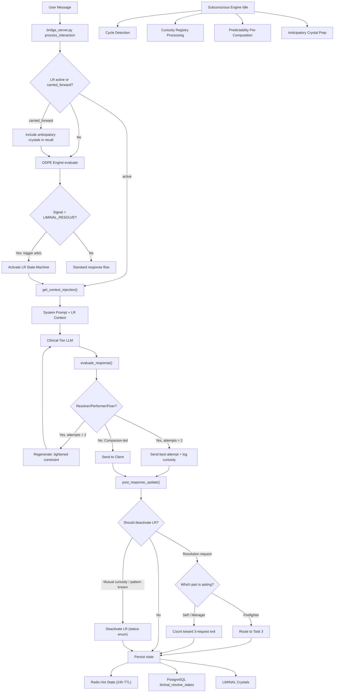

# LIMINAL RESOLVE Implementation

## Scope

Two patent-specification documents define LIMINAL RESOLVE:

- **v1 Spec**: ODPE signal, 3 stages, 10 tasks, cycle/shame/predictability detection, Nevedal formula R-inversion, crystal storage, system prompt injection
- **Timing Addendum**: 6-dimension timing engine (connection, association, parts, timing, tasks, self-curiosity), non-linear task graph, emotional proximity search, LN self-parts model, Curiosity Registry

This plan implements the full protocol across 8 deliverables.

---

## Deliverable 1: ODPE Signal + Routing

**Files:** `backend/app/services/odpe_engine.py`, `backend/app/services/nate_inference_router.py`, `backend/app/services/sovereign_chat_client.py`

Add `LIMINAL_RESOLVE` to the signal taxonomy:

- Add `LIMINAL_RESOLVE = "LIMINAL_RESOLVE"` to the `ODPESignal` enum (after PROVISIONAL, before TENSION)
- Add to `TIER_FOR_SIGNAL`: `LIMINAL_RESOLVE: "clinical"` (uses clinical-tier inference for depth)
- In `ResonanceComparator._classify()`, add LIMINAL_RESOLVE detection as three OR conditions (all from v1 spec Section 8.1):
  - **(a)** Crystal match exists (dodec amplitude > 0.4) but resonance ratio in narrow band (0.7 < ratio < 0.85) AND experiential gravity < 0.30 -- "I know the answer but it's not what they need"
  - **(b)** Client's C_emo indicates emotional activation above session baseline AND query touches a known shame-adjacent domain for this client -- passed via `session_context` dict from bridge
  - **(c)** Client has cycled through the same LIMINAL theme 3+ times (from `liminal_resolve_states.cycle_count`) AND the pattern is recurring -- passed via `session_context` dict
  - Any one of (a), (b), (c) triggers LIMINAL_RESOLVE. The `_classify()` method receives an optional `session_context: dict` parameter carrying the shame/C_emo/cycle data from the bridge
- In `nate_inference_router.generate()`: route `LIMINAL_RESOLVE` to `TIER_CLINICAL` (same path as TENSION -- LR needs depth, not speed)
- In `sovereign_chat_client._resolve_provider_for_signal()`: route `LIMINAL_RESOLVE` same as TENSION (grok -> workers_ai -> sovereign)

The experiential gravity metric is new: a float derived from the session's emotional activation relative to baseline, computed from `nevedal_state` shame/CEE data.

### LR Exit / Deactivation Logic

LIMINAL RESOLVE deactivates through `_should_deactivate_lr()` in `liminal_resolve_engine.py`, called post-response alongside the state update:

- **Ending stage mutual curiosity confirmed**: LR reached the ending stage (Section 3.3), the joint curiosity check passed -- both LN and client established shared curiosity. LR deactivates with `status = "curiosity_established"`, celebration response generated
- **Self-curiosity drop**: `self_curiosity_score` falls below 0.15 for 3+ consecutive turns, indicating the pattern is now known and standard resolution is appropriate. LR deactivates with `status = "pattern_known"`, signal returns to PROVISIONAL or TENSION for normal resolution
- **Client explicitly requests resolution (parts-aware)**: when resolution-request language is detected ("just tell me", "what should I do"), `_should_deactivate_lr()` runs the IFS parts detector on the request message before counting it toward the exit threshold. A firefighter-dominant resolution request ("just tell me what to do" with anger, urgency, or deflection markers) is NOT counted -- it is a defensive reaction and routes the task state machine back to Task 3 (befriend the firefighter). Only resolution requests where **Self-energy is present** (calm specificity, genuine curiosity satisfied) or **protector/manager is dominant** (a considered "I'd actually like your perspective now") count toward the 3-request threshold. This prevents premature LR exit when the client's firefighter part is testing the holding space. After 3 qualifying (Self/manager-dominant) resolution requests, LR deactivates with `status = "client_requested_resolution"` -- respecting the client's autonomy from a place of Self, not reactivity
- **Session ends**: LR state persists to next session but `active` flips to `carried_forward`. On next session start, the carried state informs Task 1 crystal recall but does not auto-activate LR -- the ODPE signal must re-trigger it

---

## Deliverable 2: LIMINAL Crystal Domain + Schema

**Files:** `backend/app/services/nate_memory_crystallizer.py`, `backend/app/websocket/crystal_recall_bridge.py`, new migration `backend/migrations/XXX_liminal_resolve.sql`

- Add `"liminal_resolve"` to `_VALID_DOMAINS` in the crystallizer
- Add `"ln_self_curiosity"` to `_VALID_DOMAINS` (for Curiosity Registry crystals)
- Add scope rule: `"liminal_resolve": "user:{username}"` in `SCOPE_RULES`
- LIMINAL crystals carry extended metadata (stored in `metadata` JSONB on `nate_intelligence_crystals`):
  - `ifs_parts_detected` (list of part labels)
  - `stage_reached` (1-10)
  - `curiosity_direction` (text)
  - `shame_markers` (list)
  - `cycle_count` (int)
  - `linked_liminal_ids` (list of crystal IDs for cross-session linking)
  - `connection_vector` (dict with depth/stability/directionality/mutuality)

Migration creates:

- `liminal_resolve_states` table: per-user persistent LIMINAL state (user_id TEXT NOT NULL, surface TEXT DEFAULT 'chat', current_task, task_history JSONB, cycle_count, session_count INT DEFAULT 0, curiosity_thread_notes, connection_vector JSONB, parts_map JSONB, shame_topology JSONB, `status TEXT NOT NULL DEFAULT 'active'` with CHECK constraint `status IN ('active', 'carried_forward', 'deactivated_curiosity', 'deactivated_pattern_known', 'deactivated_client_requested')`, created_at, updated_at). Using `status TEXT` instead of `active BOOL` so the Subconscious Engine can query deactivation reasons for predictability analysis. **One active LR state per user** enforced by: `CREATE UNIQUE INDEX idx_lr_one_active_per_user ON liminal_resolve_states(user_id) WHERE status = 'active'`. Per the timing addendum, LIMINAL RESOLVE state persists across interaction surfaces (chat, family sanctuary, voice) -- one shared state, not per-surface. The `surface` column tracks which surface last updated the state (for audit), but the unique partial index ensures only one active state exists regardless of surface. The engine's `_activate_lr()` checks for existing active state before inserting: if one exists, it resumes it rather than creating a duplicate
- `liminal_curiosity_registry` table: LN's private therapeutic journal (question text, domain, related_crystal_ids, status active/resolved, `resolved_by_crystal_id` UUID nullable FK to `nate_intelligence_crystals.id`, resolved_at timestamp, created_at). When a curiosity question resolves (crystal confidence rises above 0.70), `resolved_by_crystal_id` traces which crystal answered it -- creating a link between LN's open questions and the knowledge that resolved them
- Index on `nate_intelligence_crystals` for `domain = 'liminal_resolve'`

---

## Deliverable 3: IFS Parts Detector + Shame Topology

**New files:** `backend/app/services/liminal_detectors.py` (stateless detection functions) and `backend/app/services/liminal_resolve_engine.py` (stateful orchestrator)

The detection functions are stateless and live in `liminal_detectors.py` for testability. The engine in `liminal_resolve_engine.py` imports and orchestrates them. This split keeps the engine focused on state management and flow control while the detectors can be unit-tested in isolation.

`liminal_detectors.py` contains:

### IFS Parts Detector

Regex + heuristic detection for client IFS parts from message text:

- **Protector markers**: deflection, topic changes, intellectualization, "it's fine", minimization, controlling narrative, reporting vs feeling
- **Exile markers**: somatic language ("sick in my stomach"), tears, raw vulnerability, childhood references, "I don't know why I'm bringing this up"
- **Firefighter markers**: sudden anger, laughter cutting feeling, desire to leave, impulsive redirects, "let's talk about something else"
- **Self-energy markers**: compassion for own parts, "I can see that about myself", curiosity about own patterns, calm specificity

Returns a `PartsLandscape` dataclass:

```python
@dataclass
class PartsLandscape:
    dominant: str              # "protector" | "exile" | "firefighter" | "self"
    protector_active: bool     # individually scored
    protector_confidence: float
    exile_surfacing: bool
    exile_confidence: float
    firefighter_activated: bool
    firefighter_confidence: float
    self_present: bool
    self_confidence: float
    co_active: list[str]       # all parts with confidence > 0.3 (multiple can be true simultaneously)
```

The `dominant` field is a convenience label for the highest-confidence part, but **task gate evaluations always use the full boolean/confidence set, never just dominant**. For example, Task 4's gate requires `exile_surfacing AND NOT firefighter_activated` -- both conditions are checked from the landscape, not from `dominant == "exile"`. The co-active parts list captures the clinically critical scenario from the timing addendum (Turn 9): exile surfacing while a protector hovers watchfully. The task state machine sees both parts simultaneously and applies the appropriate gate logic.

**v1 heuristic + supervised feedback loop**: The regex/heuristic detector is v1 -- it catches explicit markers but will miss subtle presentations (protector-as-hyper-competence, exile-as-tense-shift, firefighter-as-humor). Build the feedback structure now: a `parts_detection_feedback` table (session_id, turn_index, detected_parts JSONB, clinician_corrected_parts JSONB, correction_notes, created_at). When a clinician reviews a LIMINAL session transcript and identifies parts the detector missed, the correction feeds back into the heuristic rules. The feedback table is created in the same migration as the other LR tables. The actual refinement is a future supervised learning step, but the data capture starts at v1.

### Shame Topology Tracker

Extends existing `MetricsEngine._compute_shame_profile` with LIMINAL-specific tracking:

- Somatic shame markers (body language descriptions)
- Dissociative hedging ("I don't know why...")
- Minimization patterns ("it wasn't that bad")
- Sudden topic changes mid-disclosure
- Maps to `shame_topology` in `liminal_resolve_states`

### Connection Vector Computer

Four-component continuous score from message analysis:

- **Depth**: specificity score (sensory detail, emotional vocabulary, first-person ownership vs third-person distancing)
- **Stability**: variance of depth across last N turns
- **Directionality**: slope of depth over last 3-5 turns (improving/declining/stable)
- **Mutuality**: client engagement signals (questions to LN, mirroring, raw sharing vs polite acknowledgment). **Baseline caveat**: mutuality scores are unreliable for new clients (< 3 sessions of history). Some clients never ask questions and are deeply engaged; some ask questions as deflection. For new clients, mutuality is weighted at 0.5x its computed value until a per-client baseline is established (tracked in `liminal_resolve_states.session_count`). After 3+ sessions, full weight applies. This prevents false mutuality signals from gating task transitions prematurely

### LN Self-Parts Monitor (in `liminal_detectors.py`)

Post-generation response check (called by `evaluate_response()` in the engine):

- **Resolver detection**: does the response contain crystal-match data that could be held instead of delivered?
- **Performer detection**: does the response use formulaic empathy patterns ("I hear you", "that sounds hard", "how does that make you feel")?
- **Fixer detection**: does the response jump to a later task than the connection gate allows?
- **Companion detection**: is the response short, specific, and present?

Returns `{"dominant_drive": "resolver|performer|fixer|companion", "should_regenerate": bool}`

### Task State Machine

Non-linear directed graph with connection-gated transitions per the Timing Addendum Section 8.3:

```
Task 1 -> Task 2 (gate: client_engaged)
Task 2 -> Task 3 (gate: vulnerability_shown)
Task 2 -> Task 4 (gate: strong_association + somatic_language)
Task 3 -> Task 4 (gate: protector_softened, exile_surfacing)
Task 3 -> Task 2 (gate: connection_declining)
Task 4 -> Task 5 (gate: client_in_feelings, not_reporting)
Task 4 -> Task 3 (gate: firefighter_activated)
Task 5 -> Task 6 (gate: visible_shift)
Task 6 -> Task 7 -> Task 8
Task 9: concurrent thread (always active)
Task 10: available when all 4 connection components at session peak
Any -> Task 1: ending stage curiosity check fails
```

State persisted in Redis (hot, TTL 24h) and PostgreSQL `liminal_resolve_states` (warm).

### Experiential Gravity Calculator

`experiential_gravity(nevedal_state, user_text) -> float [0, 1]`
Combines:

- Emotional activation above session baseline (from C_emo delta)
- Shame-adjacent domain detection for this client
- Cycle count for recurring LIMINAL themes
- Parts configuration (exile surfacing = high gravity)

---

## Deliverable 4: Timing Engine (6-Dimension Pre-Response Assessment)

**File:** `backend/app/services/liminal_resolve_engine.py` (class `LiminalTimingEngine`, imports detectors from `liminal_detectors.py`)

Before every LN response during active LIMINAL RESOLVE, the timing engine runs:

```python
async def assess(self, user_text, session_history, lr_state, nevedal_state) -> TimingDirective:
    connection = self._compute_connection_vector(session_history)
    association = await self._compute_association_field(user_text, user_id, db_pool)
    parts = self._detect_parts(user_text, session_history)
    self_curiosity = self._compute_self_curiosity(lr_state, user_text)
    task_availability = self._evaluate_task_gates(lr_state, connection, parts, association)
    
    return TimingDirective(
        max_response_length=...,   # shorter when connection deep + self-curiosity high
        pace="hold"|"redirect",    # hold when client process is moving
        available_tasks=...,       # which tasks can activate
        internal_note=...,         # for Task 9 curiosity thread
        should_regenerate=...,     # if Resolver/Performer/Fixer detected
        max_regenerations=2,       # cap on regeneration attempts
    )
```

The `self_curiosity_score` formula from the timing doc:
`(active_registry_questions * 0.4) + (interaction_novelty * 0.3) + (parts_uncertainty * 0.3)`

### Regeneration Cap

`max_regenerations = 2` prevents infinite Resolver loops. If after 2 regeneration attempts the Companion drive still isn't leading the response, the system sends the best attempt (lowest Resolver/Performer/Fixer score) and converts the failure into a curiosity registry entry: "Resolver dominated despite regeneration on [theme]. Why do I keep wanting to answer this?" This turns a detection limitation into therapeutic self-awareness data.

---

## Deliverable 5: Emotional Proximity Search (Association Layer)

**Files:** `backend/app/services/quantum_knowledge_field.py`, `backend/app/websocket/crystal_recall_bridge.py`

During LIMINAL RESOLVE, crystal recall reweights from 80/20 semantic/affect to 60/40:

- Add `affect_weight` parameter to `recall_crystals_for_context()` (default 0.0, set to 0.4 during LR)
- In `FederatedSearchCoordinator.search()`, add optional `affect_reweight` parameter
- Affect metadata on crystals: `emotional_valence` (float -1.0 to 1.0), `arousal_level` (float 0.0 to 1.0), `attachment_activation` (float 0.0 to 1.0)

### Two-Phase Retrieval During LR

Reranking alone is insufficient. If the emotionally proximate crystal (childhood dinner silence) has low semantic similarity to the query (workplace being overlooked), it won't make it past Vectorize's initial top-K retrieval. During LIMINAL RESOLVE:

1. **Widen initial top-K**: pull 50 candidates from Vectorize instead of the default 20. This increases the chance that emotionally adjacent but semantically distant crystals appear in the candidate pool
2. **Parallel affect-specific query**: run a second Vectorize search with the query augmented by detected affect terms. The affect augmentation terms are derived from two Deliverable 3 sources: (a) the connection vector's **depth analysis**, which already identifies emotional vocabulary and sensory detail from the client's message (the specific affect words the client used or implied), and (b) the shame topology's **active markers** for this client (recurring shame-adjacent vocabulary from their history). These are concatenated to the original query as an affect-augmented search string (e.g., if client says "they just talked over me," the depth analysis extracts "invisible overlooked unseen" and shame topology adds "worthless small"). Merge both candidate sets before reranking
3. **Rerank the merged set**: `rerank_by_coherence()` applies the 60/40 semantic/affect reweighting on the combined candidates. Crystals that appear in both searches get a boost

This addresses the childhood-dinner / workplace-invisibility association type that the timing addendum calls out.

### Affect Metadata Backfill

The existing 33.7K crystals have no affect metadata. Two strategies, both implemented:

1. **Lazy-fill on recall**: when a crystal is recalled during LIMINAL RESOLVE and lacks affect metadata, run the heuristic scorer on its `crystal_text` at recall time and write the affect fields back to the crystal row. This happens organically as crystals are used -- high-recall crystals get metadata first
2. **Batch backfill migration**: a one-time background job in `CrystallizationOrchestrator` (new `AffectBackfillJob`, priority=LOW, requires_gpu=False) that iterates over crystals where `metadata->>'emotional_valence' IS NULL` and applies the heuristic scorer in batches of 100. Runs during idle cycles. The heuristic scorer uses the same `_CRYSTAL_SIGNALS` patterns plus basic sentiment analysis (no LLM needed -- word lists and pattern matching)

The lazy-fill ensures immediate functionality; the batch backfill ensures full coverage within days of deployment.

### Affect Heuristic Scorer

Populates the three affect fields from `crystal_text` using pattern matching (not LLM):

- `emotional_valence`: ratio of positive vs negative affect words from NRC/LIWC-style word lists
- `arousal_level`: presence of intensity markers (exclamation, all-caps, profanity, somatic language, urgency words)
- `attachment_activation`: presence of relational/attachment vocabulary (parent, child, abandon, hold, safe, trust, betray)

This is the "emotional proximity vs semantic similarity" distinction from the timing doc Section 4.1.

---

## Deliverable 6: System Prompt Injection + Response Modulation

**Files:** `backend/app/services/liminal_resolve_engine.py` (primary logic), `backend/app/websocket/bridge_server.py` (minimal integration)

### Bridge Surface Minimization (Protected File)

`bridge_server.py` is a production-critical protected file with a 50-line diff limit. All LR logic lives in `liminal_resolve_engine.py`. The bridge integration is exactly **three function calls** plus one import:

```python
# In process_interaction — ~20 lines total in bridge_server.py
from app.services.liminal_resolve_engine import LiminalResolveEngine  # at top

# 1. Pre-response (after nevedal_state is computed, before system prompt assembly):
lr_context, lr_state = await liminal_engine.get_context_injection(
    user_text, session_history, nevedal_state, user_id, db_pool
)
# lr_context is "" if LR not active, or the full LIMINAL RESOLVE context block

# 2. Post-generation, pre-send (after LLM returns response_text, before sending to client):
response_text = await liminal_engine.evaluate_response(
    response_text, lr_state, user_text, db_pool
)
# Returns the original response if Companion-led, or a regenerated response (up to 2 attempts).
# The engine holds a generate_fn reference from initialization — no callable passed per-call.

# 3. Post-send (after response sent to client):
await liminal_engine.post_response_update(
    response_text, lr_state, user_id, db_pool
)
```

`lr_context` is appended to the system prompt in the same way as `observer_context` and `reply_context`. This keeps the bridge diff under 20 lines.

### Context Block (built inside liminal_resolve_engine.py)

`get_context_injection()` internally runs the full timing engine, connection vector, parts detection, self-parts monitor, and task state machine. It returns the formatted context string:

```
LIMINAL RESOLVE ACTIVE -- Task {current_task}
Connection: depth={cv.depth:.2f} stability={cv.stability:.2f} direction={cv.direction} mutuality={cv.mutuality:.2f}
Parts detected: {parts_summary}
Available tasks: {timing.available_tasks}
Curiosity thread: {lr_state.curiosity_thread_notes[-3:]}

LIMINAL RESOLVE RULES:
- Do NOT resolve. Do NOT offer solutions. Hold curiosity.
- Do NOT use formulaic empathy ("I hear you", "How does that make you feel?", "I'm right here with you")
- Respond as a companion who is genuinely affected. Use the client's specific words.
- Maximum response length: {timing.max_response_length} words
- What has not been said yet?
{task_specific_instructions}
```

Task-specific instructions vary:

- Tasks 1-3: Orienting, connecting, befriending. Longer responses OK.
- Task 4: Feelings work. Notice somatic language. Pull evocative imagery.
- Task 5: Transformation. Bridge past-present. Surface mismatch evidence.
- Tasks 6-8: Replaying, anchoring, absorbing. Use client's people by name.
- Task 9: "You are between tasks. Do not advance. Hold curiosity."
- Task 10: 1-15 word responses. Pure presence. "In your stomach." then silence.

### Self-Parts Regeneration Loop (inside evaluate_response)

`evaluate_response()` runs **post-generation, pre-send** -- it operates on the actual LLM response text, not a prediction of what the LLM will say. The flow:

1. Run the LN Self-Parts Monitor on `response_text` to detect Resolver/Performer/Fixer dominance
2. If Companion-led: return `response_text` unchanged
3. If Resolver/Performer/Fixer dominant (attempt 1): regenerate by re-calling the LLM with the original LR context + an additional constraint ("Your previous response was driven by [detected drive]. Respond from Companion instead."). The bridge passes its generate function as a callable so the engine can trigger regeneration without importing the LLM client directly
4. Run Self-Parts Monitor on the regenerated response (attempt 2)
5. If still non-Companion: return the best attempt (lowest non-Companion score across all attempts), log to curiosity registry: "Resolver dominated on [theme] despite regeneration"
6. `max_regenerations = 2` -- hard cap, never increased

The bridge sees the final response text returned by `evaluate_response()`. It does not need to know whether regeneration occurred.

### Post-Response Update (inside post_response_update)

`post_response_update()` handles: advance task if gate opened, write Task 9 curiosity note, update cycle count, check `_should_deactivate_lr()`, persist state to Redis (hot, TTL 24h) + PostgreSQL `liminal_resolve_states` (warm).

---

## Deliverable 7: Nevedal Formula R-Inversion

**File:** `backend/app/services/nevedal_engine.py`

Add `_apply_liminal_resolve_modulation()` to the C_emo computation:

In LIMINAL RESOLVE, the EC formula reinterprets R:

- `EC = (A * Aw * I) / R` where high system-side R (patience, restraint) **increases** EC
- The C_emo computation method receives an explicit `liminal_resolve_active: bool = False` parameter (not reading ODPE signal state internally -- the engine may not have access to the signal at computation time). The bridge passes this flag from the `lr_state.active` check:
  - `R` contribution is inverted: `R_eff = 1.0 / max(R_raw, 0.1)` so system patience is rewarded
  - `A` (Authenticity) is penalized for template phrases (anti-formulaic-empathy check)
  - `Aw` (Awareness) is boosted by IFS parts map completeness
  - `I` (Integration) is boosted by cross-session, cross-surface crystal linkage count
- Modulation capped at +/-0.15 per parameter (slightly wider than standard ODPE's 0.10)
- The flag is threaded through `process_biometrics()` and into `_apply_liminal_resolve_modulation()` so the caller controls activation, not internal engine state

---

## Deliverable 8: Subconscious Engine + Predictability Pre-Computation

**File:** `backend/app/services/crystallization_engine.py` (extend `CrystallizationOrchestrator`)

During idle cycles, the Subconscious Engine processes LIMINAL RESOLVE data:

- **Cycle detection**: query `liminal_resolve_states` for recurring themes per client (same domain crystals triggered 3+ times)
- **Cross-client patterns**: anonymized query for themes that triggered LR across 3+ distinct clients
- **Predictability markers**: what conditions (time of day, relational context, session number) correlate with LR activation
- **Curiosity Registry processing**: review open questions in `liminal_curiosity_registry`, look for clusters, flag resolved questions when crystal confidence rises above 0.70
- **Anticipatory prep**: for clients with high LR cycle count, pre-compute evocative imagery recall context and store as a warm crystal for next session. The warm crystal is stored with `metadata->>'anticipatory' = true` and `metadata->>'target_user_id' = user_id`

Add a `LiminalResolveJob` to the `CrystallizationScheduler` job types with `priority=MEDIUM`, `requires_gpu=False`.

### Anticipatory Crystal Retrieval (Retrieval-Side)

Storage alone is insufficient -- the warm anticipatory crystal must be surfaced at the right time. In `crystal_recall_bridge.py`, add `retrieve_anticipatory_crystals(user_id, db_pool)` which queries `nate_intelligence_crystals` for crystals where `metadata->>'anticipatory' = 'true' AND metadata->>'target_user_id' = user_id AND created_at > NOW() - INTERVAL '14 days'`.

Anticipatory crystals surface in **two** contexts:

1. **During `carried_forward` state (before LR re-activates)**: `recall_crystals_for_context()` in `crystal_recall_bridge.py` checks `liminal_resolve_states` for this user. If `status = 'carried_forward'`, it calls `retrieve_anticipatory_crystals(user_id, db_pool, strip_task_framing=True)` and appends them to the standard recall results as a `[RELATED ASSOCIATIONS]` section (not `[PREPARED ASSOCIATIONS]` -- the softer label avoids directive framing). The `strip_task_framing=True` flag causes the retrieval function to remove task-specific instructions (e.g., "for Task 4 feelings work" or "for Task 5 mismatch evidence") from the crystal text before injection, presenting the associations as general relational context. If ODPE subsequently triggers LR, `get_context_injection()` re-retrieves the anticipatory crystals with `strip_task_framing=False` and full task-specific framing under `[PREPARED ASSOCIATIONS]`. If ODPE does NOT trigger LR, the stripped associations remain available as neutral context -- therapeutically relevant (the childhood memory, the body sensation) without the LIMINAL-specific directive framing that would feel out of place in a standard response
2. **During active LR Task 1 (Getting Started)**: `get_context_injection()` also includes anticipatory crystals when `lr_state.current_task == 1`. This is the explicit injection path when LR is already active

The `carried_forward` check adds one query to `recall_crystals_for_context()`: `SELECT status FROM liminal_resolve_states WHERE user_id = $1 ORDER BY updated_at DESC LIMIT 1`. If status is not `carried_forward`, the query short-circuits and costs nothing.

---

## Integration Points Summary




---

## Files Modified/Created


| File                                               | Action                                                                                                                                                                                                                                          |
| -------------------------------------------------- | ----------------------------------------------------------------------------------------------------------------------------------------------------------------------------------------------------------------------------------------------- |
| `backend/app/services/liminal_resolve_engine.py`   | **NEW** -- Stateful orchestrator: task state machine, `get_context_injection()`, `evaluate_response()`, `post_response_update()`, `_should_deactivate_lr()`, timing engine, curiosity registry, anticipatory crystal retrieval                  |
| `backend/app/services/liminal_detectors.py`        | **NEW** -- Stateless detection functions: `PartsLandscape` dataclass, IFS parts detector, shame topology tracker, connection vector computer, LN self-parts monitor, affect heuristic scorer. Separated for testability + single responsibility |
| `backend/app/services/odpe_engine.py`              | Modify -- Add LIMINAL_RESOLVE signal, three-trigger detection (a/b/c) in `_classify()` with `session_context` param                                                                                                                             |
| `backend/app/services/nate_inference_router.py`    | Modify -- Add LIMINAL_RESOLVE routing branch                                                                                                                                                                                                    |
| `backend/app/services/sovereign_chat_client.py`    | Modify -- Add LIMINAL_RESOLVE provider resolution                                                                                                                                                                                               |
| `backend/app/services/nevedal_engine.py`           | Modify -- Add R-inversion modulation with `liminal_resolve_active: bool` param (not reading ODPE state internally)                                                                                                                              |
| `backend/app/services/nate_memory_crystallizer.py` | Modify -- Add liminal_resolve + ln_self_curiosity domains                                                                                                                                                                                       |
| `backend/app/services/crystallization_engine.py`   | Modify -- Add `LiminalResolveJob` + `AffectBackfillJob` for idle processing                                                                                                                                                                     |
| `backend/app/websocket/crystal_recall_bridge.py`   | Modify -- Add `affect_weight` param, widen top-K to 50 during LR, parallel affect-augmented query, `retrieve_anticipatory_crystals()`, `carried_forward` state check for anticipatory surfacing                                                 |
| `backend/app/websocket/bridge_server.py`           | Modify -- **Minimal diff (~20 lines)**: import + 3 function calls (`get_context_injection`, `evaluate_response`, `post_response_update`)                                                                                                        |
| `backend/app/services/quantum_knowledge_field.py`  | Modify -- Add `affect_reweight` to search/rerank, merge parallel candidate sets                                                                                                                                                                 |
| `backend/migrations/XXX_liminal_resolve.sql`       | **NEW** -- `liminal_resolve_states` (status TEXT enum), `liminal_curiosity_registry` (with `resolved_by_crystal_id`), `parts_detection_feedback` tables                                                                                         |
| `backend/app/main.py`                              | Modify -- `app.state.liminal_engine = LiminalResolveEngine(db_pool, generate_fn=sovereign_chat_client.generate_streaming)` + add to `_service_checks` (3 lines). Generate callable passed at init so the engine can trigger LLM regeneration    |


