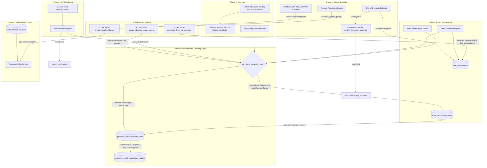
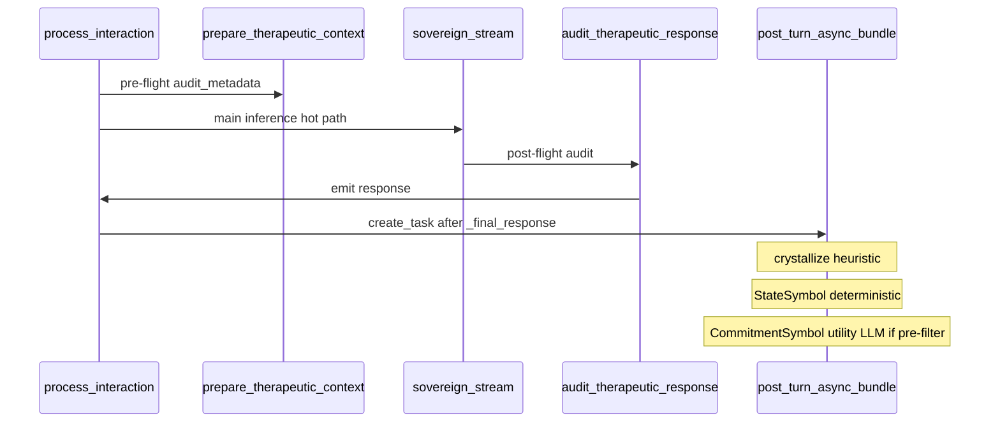

# Little Nate Agentic Roadmap

## Where things stand today (confirmed by codebase research)

- **RAG tier**: already extensive and correctly identified — `crystal_recall_bridge.py`, two-tier recall (fast sync + deep async), promotion/decay/confidence, and heuristic + LLM crystallization. No changes needed here; every new phase below layers on top of it.
- **Proactive infrastructure**: ~70% of the plumbing for "proactive presence" already exists, just aimed at *inactivity*, not *commitments*:
  - `backend/app/services/nate_checkin_agent.py` — 30-min loop, 62h/72h inactivity thresholds, snooze (`checkin_snooze_until`), dedup, `safe_silence_mode_state` gating, multi-channel delivery (SMS/email/in-app).
  - `nate_checkins` table (`backend/migrations/077_nate_checkin.sql`, expanded in `233_public_trial.sql`) — outreach audit log.
  - `nate_nudges` table (`backend/migrations/015_nate_nudges_wisdom_profiles.sql`) — in-app notification store with `scheduled_at`, perfect fit for "reminders" in Phase 2.
  - **Missing**: any goal/commitment store — goals only live inside `intake_data` JSONB, not a queryable, schedulable object.
- **Confirmation/"propose then act" pattern**: already established via session booking (`client_book_session` → `pending_approval` → `coach_approve_booking`, `backend/app/services/session_approval.py`) and `ExportIntentDetector.set_pending/check_pending/clear_pending` (`bridge_server.py`). This is the template for Phase 2's "want me to?" flow.
- **Crisis/SI reflex**: `backend/app/services/suicide_ideation_coach_alert.py`, hooked into `Cortex.process_interaction` — perceive → decide → act autonomously. This is the one true agentic reflex the user identified; Phases 1-4 generalize this pattern to non-crisis, lower-stakes situations.
- **Background agent convention**: `TokenUsageAgent` (simple asyncio loop template) + `main.py` `lifespan()` registration (`app.state.<agent> `, `_service_checks` tuple, shutdown loop) + `agent_status_digest.py` section. All new agents below follow this exactly.

**Critical constraint**: `backend/app/websocket/bridge_server.py` and `backend/app/main.py` are PRODUCTION CRITICAL files (50-line-per-commit limit, additive-only, feature-flagged, `# QUANTUM-CRYSTAL-ARCH` comment required). All phases below are designed so the *business logic* lives in new standalone service files, and `bridge_server.py`/`main.py` only get thin, feature-flagged dispatch hooks — kept under the line budget per commit.



---

## Phase 0 — Restraint & Learning Layer (blocking prerequisite for Phase 1)

This phase closes two gaps the diagram previously hid: (1) four separate agents can all message the same user with no shared brake, and (2) nothing ever reads whether a touch worked and adjusts. Phase 0 must **fully ship and pass review** before `ENABLE_PROACTIVE_COMMITMENTS` flips — `nate_commitment_agent.py` is written to call `can_send_proactive_touch()` from day one, but Phase 1 code may be merged with its flag off while Phase 0 is validated.

### 0A. Global delivery gate — `backend/app/services/proactive_touch_policy.py` (new)

Single entry point `async def can_send_proactive_touch(identifier, source, channel_pref) -> PolicyDecision` (`PolicyDecision = {allowed, reason, channel_override}`), called by **every** proactive-touch producer: `nate_commitment_agent.py` (Phase 1), `nate_checkin_agent.py` (small additive retrofit — this agent already exists and already sends touches, so it must route through the shared gate too, not just new agents), `nate_self_monitor_agent.py`'s optional client touch (Phase 4), and Phase 2's `set_reminder`/nudge delivery. A "downgrade to in-app only" restraint outcome (0B below) is expressed as `allowed=true, channel_override='in_app'` rather than a separate code path.

Gate checks, in order, fail-closed (an error on any check counts as deny — same convention as `public_trial_gate.py`'s Redis-outage-equals-cap-exceeded rule):

1. **Identity resolution first.** Resolve `identifier` (may arrive as `hardware_id` or `username`) to canonical `users.username` via the same OR-chain already used by `crystal_outcome_view` (`u.username = X OR u.hardware_id = X OR u.id::text = X`, see `backend/migrations/236_crystal_outcome_shadow_weighting.sql`). Every check below queries by the resolved username. This is the exact identity-key-mismatch class of bug already fixed once for `crystal_recall_log` vs `conversation_history` vs `nevedal_metrics` — the mandatory Phase 0 test inserts a fixture keyed by username and calls the gate with a hardware_id, asserting the SI-suppression check below still fires (a same-key test would pass in the test suite while failing in production).
2. **SI suppression window (every source, not just Phase 1).** Deny with `reason='si_suppression_window'` if the SI coach-alert audit path (`suicide_ideation_coach_alert.py`'s dedup table) shows a dispatched alert for this user within `SI_TOUCH_SUPPRESSION_HOURS` (new env var; default mirrors the existing `SI_COACH_ALERT_DEDUP_HOURS=24`). The human — the coach who was just alerted — owns outreach in that window; Nate goes quiet on every automated channel, not just the one that triggered the alert.
3. **Consent.** `profile_data.proactive_presence_consent == true`.
4. **Trial/anonymous exclusion.** Deny if `identifier` resolves to no `users` row at all, or `profile_data.tier == 'public_trial'`. Confirmed necessary, not theoretical: `public_trial_gate.py`'s own docstring states trial turns run through the same `process_interaction()` path as authenticated users, so without this check an anonymous trial session could accumulate commitment rows and receive automated touches.
5. **Crystal-boundary parity.** If the touch's source commitment carries a `crystal_id`, its scope must not be narrower than what this recipient may see — mirrors the existing "scope can only narrow, never widen" crystal-privacy invariant; a crystal scoped `admin_only`/`archived` can never surface in an outbound message to a client.
6. **Sensitivity classification.** Deny with `reason='sensitive_in_app_only'` if the commitment/checkin is tagged `sensitivity='sensitive'` (set at extraction, see Phase 1 §2). Sensitive items are stored and remembered normally, and Nate may still reference them *in-conversation* (via `get_commitment_context`) — they are simply never the subject of an automated push.
7. **Timezone + quiet hours.** Resolve `profile_data.timezone` via Python `zoneinfo`; an invalid or missing string is treated as UTC and logged, never raised. Deny (not queue) delivery outside `PROACTIVE_TOUCH_QUIET_HOURS_LOCAL` (default 08:00–20:00) — agents already run on a 30-minute loop, so a commitment simply isn't touched this cycle and is re-evaluated on the next eligible cycle rather than needing a persistent delayed-delivery queue.
8. **Global cross-agent budget.** `SELECT count(*) FROM nate_proactive_touches WHERE user_id = $resolved AND status IN ('sent','responded','ignored') AND created_at > now() - interval '1 day'` capped at `PROACTIVE_TOUCH_MAX_PER_DAY` (default 1), plus a trailing-7-day count capped at `PROACTIVE_TOUCH_MAX_PER_WEEK` (default 3) — counted across **all** `source_agent` values, not just the calling agent's own history. This is the single brake that stops "proactive presence" from becoming four independent nags.
9. **Paused-user check.** Deny if `profile_data.proactive_touch_adaptation.paused_until` is in the future (set by the restraint track in 0B — never by a human toggle alone).

Per-source dedup/snooze (existing `checkin_snooze_until`, commitment-specific cooldown) stays local to each agent, layered **on top of** this shared gate, not replacing it.

### 0B. Outcome Feedback Loop (restraint-asymmetric adaptation)

Nothing in the original diagram consumed touch outcomes — Nate could act but never learn. This section wires `nate_proactive_touches` outcomes into the next touch's cadence/channel, using the exact attribution → shadow pattern already shipped for crystal confidence: `crystal_outcome_view` (read-only attribution) → `crystal_confidence_shadow` (append-only, proposal-only) → `DatabaseMaintenanceAgent._shadow_weighting_pass()` (capped delta, forced-zero for safety domains, interval-gated via `MAX(computed_at)`, source-scanned to prove no live UPDATE — see `backend/migrations/236_crystal_outcome_shadow_weighting.sql` and `backend/tests/test_shadow_weighting_no_update.py`). This phase points that same shape at `nate_proactive_touches` instead of `crystal_recall_log`.

1. **New read-only view `proactive_touch_outcome_view`** (same Phase 0 migration): classifies every sent touch as `responded` (`responded_at IS NOT NULL`), `snoozed` (`status='snoozed'`), or `ignored` (no response by `sent_at + 48h`, matching the touch-response-attribution window). This view is the single source of truth for "did this touch work" — no agent computes outcome ad hoc.
2. **Restraint track — applies directly, no shadow/approval needed.** Narrowing is safe by construction (same "can only narrow, never widen" principle already governing crystal privacy), so these write straight to `profile_data.proactive_touch_adaptation` (`{interval_multiplier, channel_ceiling, paused_until}`):
   - N consecutive `ignored` outcomes for a source (default N=2) doubles that source's next interval, capped at a max multiplier (default 4x) so it degrades toward quiet rather than disappearing outright.
   - The first `ignored` outcome on an external channel (SMS/email) downgrades that user's `channel_ceiling` to `in_app` — and a downgraded channel is **never** auto-restored.
   - 3 consecutive `ignored` outcomes across any source sets `paused_until` (gate check 9 above) — resuming requires an explicit human action (consent-screen toggle or an in-app "resume" control), never an automatic timeout-based un-pause tied to elapsed time alone.
   - `responded` outcomes reset the consecutive-ignored counter but never shrink `interval_multiplier` below 1.0 or raise `channel_ceiling` — that would be an assertiveness increase, which is the next track.
3. **Assertiveness track — proposal-only, mirrors `crystal_confidence_shadow` exactly.** Any signal arguing for *more* frequent or richer touches (fast responses, repeated positive engagement) is written to a new append-only `proactive_touch_adaptation_shadow` table (`user_id, source, signal_type, proposed_change, sample_size, computed_at, reasoning`) by a new `_touch_adaptation_pass()` on `DatabaseMaintenanceAgent` (co-located with `_shadow_weighting_pass()`, same interval-gating via `MAX(computed_at)`). **No code path ever applies these proposals automatically** — this is what makes shipping self-adaptation safe without a review per change: the only thing that ships unreviewed is the direction that can't cause harm.
4. **Forced exclusion, mirroring `SHADOW_FORCED_ZERO_DOMAINS`.** Sensitive-classified commitments and any touch that occurred inside an SI-suppression window are excluded from the adaptation pass entirely (they should never have produced an automated touch to measure).
5. **Test requirement, mirroring `test_shadow_weighting_no_update.py`.** New `backend/tests/test_touch_adaptation_asymmetry.py` and companion seam tests under `backend/tests/test_proactive_touch_seams.py` — see **Rollout Discipline → Mandatory seam-tests** for the banned test shapes (same-key tests are explicitly forbidden). Minimum coverage:
   - **Restraint asymmetry source scan**: no code path increases `interval_multiplier`, removes a `channel_ceiling` downgrade, or clears `paused_until` outside the explicit human-triggered path.
   - **Behavioral restraint tests**: ignored-counter threshold, one-way channel downgrade, pause/resume, shadow-only assertiveness proposals.
   - **Seam tests (non-negotiable)**: each maps to a gate that has already failed silently in production when tested the easy way — see Rollout Discipline section.

### 0D. Phase 0 feature flag and ship gate
- Env: `ENABLE_PROACTIVE_TOUCH_POLICY` (default `false`). When off, `can_send_proactive_touch()` is not called by retrofitted producers and `_touch_adaptation_pass()` is a no-op — Phase 0 code may be deployed but must not affect live touches until this flag flips.
- **Phase 1's `ENABLE_PROACTIVE_COMMITMENTS` must remain `false` until Phase 0 passes**: migration applied, seam tests green, human adversarial walk signed off. The seven safety mechanisms (feedback loop, restraint asymmetry, global budget, SI suppression, sensitivity fork, trial/crystal isolation, timezone/quiet-hours) are Phase 0 deliverables — not Phase 1 add-ons.

### 0C. New migration: `backend/migrations/237_proactive_touch_policy.sql`
- `proactive_touch_outcome_view` (per §0B.1).
- `proactive_touch_adaptation_shadow` table (per §0B.3), append-only, indexed on `(user_id, source, computed_at DESC)`.
- No changes to `users`/`profile_data` schema — the adaptation state (`proactive_touch_adaptation`) lives in existing `profile_data` JSONB, same pattern as `notification_prefs` and `checkin_snooze_until`.

---

## Phase 1 — Proactive Presence (highest value)

### 1. New migration: `backend/migrations/238_nate_commitments.sql`
(Bumped from the original `236` placeholder — `236` is now taken by `crystal_outcome_shadow_weighting.sql` and `237` by Phase 0's `proactive_touch_policy.sql`; verify the actual latest migration number at implementation time regardless.)
- `nate_commitments`: `id UUID PK`, `user_id VARCHAR(64)` (hardware_id, matches `nate_checkins` convention), `commitment_text TEXT`, `commitment_type VARCHAR(32) CHECK IN ('appointment','practice_goal','milestone','custom')`, `target_date TIMESTAMPTZ NULL`, `recurrence VARCHAR(32) NULL`, `status VARCHAR(16) DEFAULT 'active' CHECK IN ('active','completed','dismissed','expired')`, `source VARCHAR(24)` (`auto_extracted` / `client_entered`), `sensitivity VARCHAR(16) DEFAULT 'routine' CHECK IN ('routine','sensitive')` (set at extraction — see §2; consumed by Phase 0 gate check 6), `crystal_id UUID NULL` (loose reference, no FK — crystals table already has no strict FK pattern elsewhere), `touch_count INT DEFAULT 0`, `last_touched_at TIMESTAMPTZ NULL`, `created_at`/`updated_at`.
- `nate_proactive_touches`: `id UUID PK`, `user_id VARCHAR(64)`, `commitment_id UUID NULL`, `source_agent VARCHAR(32)` (`commitment`/`checkin`/`self_monitor`/`nudge` — the column the Phase 0 global budget check groups on), `touch_type VARCHAR(32)`, `channel VARCHAR(10) CHECK IN ('sms','email','in_app','websocket')`, `content TEXT`, `status VARCHAR(24) DEFAULT 'sent' CHECK IN ('sent','responded','ignored','snoozed','skipped_consent','skipped_safe_silence','skipped_si_window','skipped_quiet_hours','skipped_budget','skipped_sensitive')`, `created_at`, `responded_at`. The `skipped_*` values record *why* Phase 0's gate denied a would-be touch (for audit/debugging), distinct from `ignored` which means a touch was sent but never got a response. Mirrors `nate_checkins` shape for consistency and reuse of dedup query patterns.
- Add `proactive_presence_consent BOOLEAN DEFAULT FALSE`, `proactive_presence_consent_updated_at TIMESTAMPTZ`, and `proactive_touch_adaptation JSONB DEFAULT '{}'` (per Phase 0 §0B: `interval_multiplier`, `channel_ceiling`, `paused_until`) — stored in `profile_data` JSONB (no schema change needed to `users`), matching how `notification_prefs` already works.

### 2. Commitment extraction (async, non-blocking, low-cost)
- New function in `backend/app/websocket/crystal_recall_bridge.py`-adjacent module (new file `backend/app/services/nate_commitment_extractor.py` to avoid touching the protected bridge file): `extract_commitment_candidate(user_text: str) -> Optional[dict]`.
- Two-stage, cost-controlled:
  1. **Heuristic pre-filter** (no LLM): regex/keyword scan for temporal markers ("Tuesday", "next week", "tomorrow", date patterns) combined with intent verbs ("going to", "trying", "planning to", "have a", "I'm doing"). Mirrors the existing crystallization heuristic philosophy (keyword scoring, no LLM by default).
  2. **LLM structuring** (only if pre-filter passes): one small `NateInferenceRouter.generate()` call (`utility` tier, low temperature) that extracts `{text, type, target_date_iso, recurrence}` as JSON, or returns null if not a genuine commitment.
- Hook point: fire-and-forget `asyncio.create_task()` alongside the existing crystallization call in `process_interaction` (same pattern as `crystallize_from_conversation` today) — this is a small, additive, feature-flagged (`ENABLE_PROACTIVE_COMMITMENTS`) hook in `bridge_server.py`, not new business logic there.
- **Trial exclusion at the write side, not just delivery.** The hook must short-circuit before even calling the LLM if the turn has no resolved `users.username` (i.e. it came from `public_trial_gate.py`'s anonymous device-hash path, which the module's own docstring confirms runs through this same `process_interaction()` function) — this keeps `nate_commitments` from accumulating throwaway rows for trial sessions, symmetric with Phase 0 gate check 4 on the delivery side.
- **Sensitivity classification (deterministic, not LLM).** After LLM structuring returns `{text, type, target_date_iso, recurrence}`, set `sensitivity` to `'routine'` (default) or `'sensitive'` using category signals from `PIIDetector.detect()` and `sensitive_clinical_bridge.evaluate_disclosure()` — **never** from the LLM's free judgment. `sensitivity='sensitive'` is stored on `nate_commitments` and hard-blocks automated touches via Phase 0 gate check 6 — Nate still remembers and may reference these in-conversation, he just never pushes about them. Phase 5a extends this same extractor to emit full `CommitmentSymbol` + `StateSymbol` (see Phase 5 §5a).
- Every captured commitment is visible and editable by the user (see UI below) — this substitutes for per-commitment confirmation friction while preserving trust/control.

### 3. `backend/app/services/nate_commitment_agent.py` (new agent)
- Skeleton: `TokenUsageAgent`-style asyncio loop, `start()`/`stop()`, stagger delay `320s` (next free slot after `NateCheckInAgent`'s 310s).
- Cycle every 30 min: `SELECT * FROM nate_commitments WHERE status='active' AND target_date BETWEEN now AND now + lookahead_window` (lookahead window covers "today"/"tomorrow" reminders plus recurring practice-goal cadence).
- Per due commitment, call Phase 0's `can_send_proactive_touch(hw_id, source='commitment', channel_pref)` — **this delegates the consent/SI-suppression/trial/sensitivity/quiet-hours/budget/pause decision entirely to the shared gate (§0A)**; the agent does not re-implement any of those checks locally. On deny, write a `nate_proactive_touches` row with the matching `skipped_*` status (for audit) rather than silently dropping it.
- On top of the shared gate, one commitment-specific check stays local: dedup — no `nate_proactive_touches` row for this `commitment_id` within the touch's cooldown window (mirrors `_recent_checkin`).
- Message generation: LLM-personalized touch via `NateInferenceRouter.generate()` (clinical tier, referencing the commitment text and, if available, the source crystal), with a static template fallback if inference fails — never block delivery on generation failure.
- Delivery: honor `channel_override` from the gate's `PolicyDecision` (e.g. a restraint-downgraded user gets `in_app` even if SMS was requested). Reuse `NotificationSystem` for SMS/email per `preferred_contact`; always also write a `nate_nudges` row (in-app); **new capability** — if the user has a live WebSocket in `connected_clients`, push directly (pattern B from `bridge_server.py`, e.g. `coach_request_nudge_alert`) so an online user sees it immediately rather than waiting to poll `get_pending_nudges`.
- Update `nate_commitments.last_touched_at`, `touch_count`; insert `nate_proactive_touches` row with `source_agent='commitment'`.

### 4. Thin bridge hooks (feature-flagged, additive, `# QUANTUM-CRYSTAL-ARCH`)
- `client_update_proactive_consent` — toggle the opt-in flag.
- `client_get_commitments` — list active commitments ("what Nate's holding onto").
- `client_dismiss_commitment` / `client_edit_commitment` — user control/correction.
- Each handler is a short dispatch to the new service module, keeping `bridge_server.py` diff small.

### 5. `main.py` registration (additive block, matches `NateCheckInAgent` pattern exactly)
- `app.state.nate_commitment_agent`, `_service_checks` tuple entry, shutdown-loop entry, `ENABLE_PROACTIVE_COMMITMENTS` feature flag gate around the whole block.

### 6. Flutter UI
- Settings toggle: "Proactive Check-Ins — Let Nate reach out between sessions about things you've shared with him" (opt-in, default off) — add to the existing notification-prefs settings screen (locate via `_Design` class reference in `settings_screen.dart`; confirm exact file during implementation).
- New lightweight list view: "What Nate's holding onto" — commitments with dismiss/edit controls.
- Reuse existing in-app nudge rendering for delivered touches (already exists for `nate_nudges`).

### 7. Follow-up (not blocking initial ship)
- New `nate_commitment_auditor.py` trust auditor (per the 5-location-sync rule) — table exists, consent field exists, agent registered, dedup logic, delivery channel smoke test. Add once the feature is stable; don't block launch on hitting 100% trust immediately.

---

## Phase 2 — Tool Use on the User's Behalf

### 1. Tool registry: `backend/app/services/nate_tool_executor.py` (new)
- `NATE_TOOLS` dict: `book_session`, `set_reminder`, `queue_resource` → `{description, param_schema, executor_fn}`. All three require confirmation per the user's spec.
- `propose_tool_action(hw_id, conversation_id, tool_name, params)` — stores a pending action in Redis (TTL ~10 min), keyed by `hw_id`, mirroring `ExportIntentDetector.set_pending`.
- `check_and_execute_confirmation(hw_id, user_text)` — lightweight yes/no intent match (regex first: "yes/sure/go ahead/do it" vs "no/nevermind/cancel"; escalate to a tiny LLM classification only if ambiguous) against the pending action; on confirm, calls the tool's `executor_fn` and clears the pending state; on decline, clears and acknowledges.

### 2. `book_session` tool
- Refactor: extract the core logic of the `client_book_session` WS handler in `bridge_server.py` (consent check → tier limit check → conflict check → session creation → PG dual-write → coach notify) into a directly-callable function in `backend/app/services/session_booking_service.py` (new file). The existing WS handler becomes a thin wrapper calling this function; the new tool executor calls the same function. This is the only bridge_server.py change needed for this tool — an additive refactor, kept small by moving logic out rather than duplicating it in the bridge file.
- Availability check reuses `coach_slot_engine` exactly as the existing `client_get_coach_availability` handler does.

### 3. `set_reminder` tool
- No new table needed — a "reminder" is a `nate_nudges` row with `scheduled_at` set to the requested time and `nudge_type='user_reminder'`. Delivery already exists via `get_pending_nudges` (poll) plus the new WS-push capability added in Phase 1's commitment agent (reuse the same push helper).
- Delivery at `scheduled_at` calls Phase 0's `can_send_proactive_touch(hw_id, source='nudge', channel_pref)` first — a user-set reminder is still an automated push and is still subject to quiet-hours, the global budget, and SI suppression; the fact that the user explicitly asked for it does not bypass the shared gate.

### 4. `queue_resource` tool
- **Needs a short discovery spike before implementation**: no existing "resource queue" or psychoeducation-resource library was found in this research pass. Implementation should first confirm whether one exists (e.g. under coach folder uploads / DOJO wisdom content) before deciding between reusing an existing table or adding a minimal `client_resource_queue` table. Flagging this explicitly rather than guessing at a schema.

### 5. System prompt guidance (not hard-coded canned text)
- Add a scoped instruction block to Little Nate's system prompt (in `skyeye_chat.py`-equivalent for the therapy chat prompt, i.e. wherever `Cortex.process_interaction`'s system prompt is assembled): "If the user expresses difficulty finding time to talk with their coach, you may offer to check availability and book a session — always ask permission first and never book without an explicit yes." Same pattern for reminders/resources. This lets natural conversation surface the offer instead of scripted triggers.

### 6. Wire-in point
- Before running the full inference pipeline on a new turn, check `check_and_execute_confirmation` first (same priority position as `ExportIntentDetector` today) — if a pending tool action resolves, short-circuit with a confirmation response; otherwise proceed normally.

---

## Phase 3 — Multi-Session Plans (therapeutic arc)

### 1. New migration: `backend/migrations/239_nate_therapeutic_plans.sql`
(Renumbered — `237` belongs to Phase 0's `proactive_touch_policy.sql` and `238` to Phase 1's `nate_commitments.sql`; verify the actual latest migration number at implementation time regardless.)
- `plan_templates`: `id UUID PK`, `title`, `total_steps INT`, `step_definitions JSONB` (array of `{step_number, theme, goals, suggested_activities}`), `created_by` (coach or system), `created_at`.
- `nate_therapeutic_plans`: `id UUID PK`, `user_id VARCHAR(64)`, `coach_id VARCHAR(64) NULL`, `template_id UUID NULL`, `title`, `total_steps INT`, `current_step INT DEFAULT 1`, `step_definitions JSONB`, `status VARCHAR(16) DEFAULT 'active' CHECK IN ('active','paused','completed','abandoned')`, `adaptation_log JSONB DEFAULT '[]'`, `started_at`, `completed_at`, `updated_at`.

### 2. `backend/app/services/nate_therapeutic_plan_service.py` (new)
- `get_active_plan_context(user_id) -> str` — returns a short context block ("PLAN CONTEXT: Week 2 of 4 — Emotional Regulation. This week's focus: distress tolerance. Last session covered: box breathing.") for injection into the system prompt, exactly analogous to how crystal recall is injected today.
- `detect_plan_divergence(conversation_text, current_step_theme) -> bool` — lightweight heuristic keyword-drift check first, LLM classification fallback only if ambiguous; logs to `adaptation_log` on divergence, does not auto-pause without a coach's or client's acknowledgment.
- Step advancement is **coach-confirmed by default** (safer clinically) — Nate may suggest advancing ("It seems like we've covered this week's goals — should we move to week 3?") but the actual step increment requires a `coach_advance_plan_step` action (or explicit client confirmation if the plan is self-directed).

### 3. Thin bridge/REST hooks
- Coach-side (new REST router `backend/app/routers/therapeutic_plan_api.py`, `require_coach`): `POST /assign`, `GET /templates`, `POST /{plan_id}/advance`.
- Injection hook in the chat pipeline: one small additive call to `get_active_plan_context()` alongside the existing crystal-recall injection point.

### 4. Scope note
- Client-facing plan progress UI is optional for v1 — can remain coach/Nate-visible only initially to control scope; flagged as a follow-up enhancement rather than blocking.

---

## Phase 4 — Self-Monitoring Loops

### 1. `backend/app/services/nate_self_monitor_agent.py` (new agent)
- Daily cycle (not 30-min — trend analysis needs multi-day windows), same `start()`/`stop()` convention.
- Per consented client (`proactive_presence_consent == true`, same opt-in as Phase 1 — self-monitoring is a proactive-presence sub-feature): compute trailing engagement metrics — session frequency (last 2 weeks vs prior 2 weeks), message frequency/length trend, and `C_emo` trend from `nevedal_metrics` (already computed and referenced elsewhere, e.g. counterfactual engine's `C_emo_trend`).
- **Discovery needed**: the user referenced "temporal-pattern work from your March design docs" — this wasn't located in this research pass and should be searched for specifically (likely a design doc, not yet code) before implementation, to avoid rebuilding something already speced.
- Conservative-by-default thresholds (avoid pathologizing healthy autonomy/pulling back): significant, sustained decline only (e.g. engagement drop > 40% over 2+ weeks, or `C_emo` declining 3+ consecutive sessions).
- Default action: **coach notification only** (reuse the `coach_notifications` table and delivery pattern from `suicide_ideation_coach_alert.py`, at `severity=info/moderate` not `critical`) — this keeps a clinician in the loop rather than Nate unilaterally reaching out about mood. This coach notification is also what Phase 0's SI-suppression window (§0A check 2) keys off of — the dispatch of this alert is what silences every other automated touch to this user for the cooldown period, so the two features must share the same alert-dispatch record, not parallel ones.
- Optional (behind a separate, even more explicit consent toggle, not default-on): a gentle client-facing touch — still calls `can_send_proactive_touch(hw_id, source='self_monitor', channel_pref)` like every other producer, then routes through the Phase 1 commitment-agent delivery pipeline ("Haven't heard from you in a bit — how are you doing?").

### 2. `main.py` registration
- Same additive pattern as other agents; `_service_checks` entry; shutdown loop entry.

---

## Phase 5 — Neuro-Symbolic Layer

**Grounded in:** `docs/AGENTIC_WIRING_INVENTORY.md` (2026-07-10)  
**Builder:** Composer 2.5, phase-gated, flags off, seam-tested, human 5-question review before each flag flip  
**Scope decision (locked):** Typed extraction is **SHARED** with Phase 1's `nate_commitment_extractor.py` — built once, typed richly enough to serve both agentic and symbolic layers. No second extraction path.

### Framing (do not overstate)

Phase 5 makes Little Nate genuinely neuro-symbolic: the LLM handles language and intuition; a symbolic layer handles typed facts, rule-checking, and inspectable reasoning; **they constrain each other**. This is NOT a rewrite — three of the four pillars are activations or generalizations of components that already exist (per inventory). Do not claim "neuro-symbolic" publicly until 5a+5b are live and holding — same overclaim discipline as banned "quantum/sentient" terms.

**Hard prerequisite:** Phase 5 does not start until Phase 0 (7 safety items) and Phase 1 (proactive presence, incl. the shared extractor) are shipped, flag-stable, and reviewed. Phase 5 builds *on* stable agentic Nate, never concurrently.

**Global fences (all sub-phases):**
- Crisis path is untouchable. `maybe_dispatch_si_coach_alert` / `evaluate_disclosure` ordering and behavior are frozen; verifier and forward engine run *around* it, never modify it.
- No sub-phase may UPDATE crystal confidence, flip a dormant orchestrator/forge flag, or widen crystal scope. Scope may only narrow (inventory invariant).
- `public_trial` profiles are excluded from every symbolic pass; assert in isolation suite.
- Each sub-phase ships behind its own flag, default false; flag flips only after seam-tests pass and the 5-question review is done.

### Codebase-verified anchors (2026-07-10 confirm)

| Assumption | Verdict | Plan implication |
|---|---|---|
| `audit_therapeutic_response()` return shape | **Confirmed** — `{response_text, audit_passed, violations, mismatch_delivered}` (`therapeutic_controller.py:1179-1184`) | 5b generalizes this; no greenfield verifier |
| Post-flight on main chat path | **Confirmed** — `bridge_server.py:10383-10394` when `_ttc_audit_meta` set | 5b extends `_audit_violations()`; pass `StateSymbol` via `audit_metadata` |
| `crystallize_from_conversation` has LLM | **False** — heuristic-only (`crystal_recall_bridge.py:907-916`) | 5a uses same **async hook timing**, not forge LLM piggyback |
| Phase 1 extractor LLM | **Planned** — utility-tier async post-turn (`bridge_server.py:10643-10648`) | No awaited LLM before response emit |



### 5a — Typed Symbolic Extraction (SHARED extractor)

**Goal:** One extraction pass emits logic-ready typed symbols for both the commitment agent and the symbolic layer.

**Reuse:** extend Phase 1 `backend/app/services/nate_commitment_extractor.py` (no second module). Category signals from `PIIDetector.detect()` and `evaluate_disclosure()` / `BridgeDecision` for sensitivity — do not re-derive.

**Emit shape (typed, validated):**
```
CommitmentSymbol   {text, type∈{appointment,practice_goal,milestone,custom},
                    target_date_iso, recurrence, sensitivity∈{routine,sensitive}}
StateSymbol        {emotional_valence, distress_present:bool,
                    topics:[...], flags:[...]}   # flags reuse Sensitive Bridge / TMC categories
```

- **Hook timing:** same post-turn `asyncio.create_task` bundle as `crystallize_from_conversation` (`bridge_server.py:10643-10648`) — not inside forge, not awaited before user sees response.
- **StateSymbol** (no LLM): deterministic from `PIIDetector`, `BridgeDecision`, pre-flight `audit_metadata` (`autonomic_state`, `tmc_class`, bridge severity).
- **CommitmentSymbol** (LLM-JSON): utility-tier `NateInferenceRouter.generate()` only when heuristic pre-filter passes (Phase 1 §2). LLM fills `{text, type, target_date_iso, recurrence}` only.
- **`sensitivity`:** set **after** LLM parse from PII/Sensitive-Bridge category presence — never from LLM output.
- **Persist:** `nate_commitments` (Phase 1 migration) + `conversation_history.metadata.symbols` via `_persist_chat_to_conversation_history` (alongside `crystal_ids`).
- **Trial:** short-circuit before write/LLM if no resolved `users.username`.
- **Flag:** `ENABLE_SYMBOLIC_EXTRACTION` (default false).

**Seam-tests:** `backend/tests/test_symbolic_extraction_seams.py` — schema reject (never partial); `sensitivity='sensitive'` when bridge flags fire; trial emits nothing; fail-safe (no symbol vs malformed).

### 5b — Consistency Verifier (GENERALIZE existing auditor)

**Goal:** Check LLM output against symbolic constraints; max 1 regen; transparent fallback on repeat failure.

**Reuse:** extend `_audit_violations()` and `audit_therapeutic_response()` in `therapeutic_controller.py`; wire `StateSymbol` + `crystal_ids` into `audit_metadata` at `bridge_server.py:10387`. Do NOT build greenfield.

**Four constraints (v1 only):**
1. **Emotion-mirror:** if `StateSymbol.distress_present`, response affect must not be proud/celebratory/warm-smiling (`detect_priority_overrides()` + StateSymbol).
2. **Scope isolation:** referenced crystals must pass recall allowlist (`crystal_recall_bridge`: not archived, confidence thresholds, no `admin_only` to non-owner).
3. **Crisis-resource:** if distress at SI threshold, response MUST contain resources (988 + direct check-in). Cross-checks SI path; does not replace it.
4. **Sensitive-commitment:** must not surface `sensitivity='sensitive'` commitment unless user raised it this turn.

**Safety design (codebase-corrected):**
- **Fail-safe, not fail-loop:** add **`symbolic_violation_regen`** branch — max **1** LLM regen for the four symbolic constraints (independent of `mismatch_available`); keep existing mismatch/direct-action paths unchanged.
- **Second failure:** `resolve_audit_fallback()` → `TRANSPARENT_AUDIT_FALLBACK_MESSAGE` — **not** `mismatch_delivered` semantics.
- **Crisis path exempt from regeneration:** frozen crisis/disclosure replies delivered as-is; verifier may **append** resources, never regenerate.
- **Logging:** dual-write — keep `sse_therapeutic_audit_log` via `_log_audit()`; add `skyeye_activity` type `symbolic_verifier_action` for Layer-8 inspection.
- **Flag:** `ENABLE_SYMBOLIC_VERIFIER` (default false).

**Seam-tests:** `backend/tests/test_symbolic_verifier_seams.py` — banned shapes: distress+proud caught; admin_only crystal for non-owner; SI-threshold missing 988 gets resources appended; regen cap 1; crisis reply never regenerated.

### 5c — Forward Reasoning Engine (symbols → constraints → LLM)

**Goal:** Symbolic state shapes response pacing/focus — never concludes clinical facts.

**Reuse:** read `nevedal_metrics`, `NevedalState`, `metrics.json` (`GAP`, `shame_profile`, `pmb`, `crisis_perception`); inject into `prepare_therapeutic_context()` `enriched_system_prompt`.

**Hard boundary (licensure line):**
- MAY emit response-shaping constraints: slow pacing, avoid topic X, witness rather than advise, hold — not ready.
- MUST NOT emit clinical conclusions: no diagnosis, no acting on `pmb.predictions` as fact.
- Every constraint logs which symbols fired it (inspectable reasoning).

**New file:** `backend/app/services/nate_forward_reasoning.py`  
**Flag:** `ENABLE_FORWARD_REASONING` (default false).  
**Seam-tests:** `backend/tests/test_forward_reasoning_seams.py`.

### 5d — Knowledge Graph Activation (own audited sub-project, LAST)

**Two flags — do not conflate:**
- `crystal_knowledge_graph_opt_in` (Sensitive Bridge L3): preference only, no traversal. **Leave as-is.**
- `ENABLE_CRYSTAL_GRAPH` (global): code + `crystal_edges` exist, flag off. **This is the real activation target.**

**Not "flip the flag." Required sequence:**
1. Read-only isolation audit: trace `crystal_graph.py`, `FederatedSearchCoordinator._search_constellation()`, `EntanglementGraph` — prove no cross-user/`admin_only` bleed.
2. Add graph-scope enforcement on traversal (same allowlist as recall path).
3. Extend `crystal_phi_auditor.py` (21600s cycle) to cover graph-surfaced crystals.
4. Flip `ENABLE_CRYSTAL_GRAPH` in staging only after live seam-tests; promote separately from "going neuro-symbolic."

**Seam-tests:** `backend/tests/test_crystal_graph_isolation_seams.py`.

### Phase 5 sequencing

1. Prereq: Phase 0 + Phase 1 shipped, flag-stable, human walk signed off.
2. **5a** → seam-tests → review → `ENABLE_SYMBOLIC_EXTRACTION` on.
3. **5b** → seam-tests → review → `ENABLE_SYMBOLIC_VERIFIER` on. *Highest value; do not rush.*
4. **5c** → seam-tests → review → `ENABLE_FORWARD_REASONING` on.
5. **5d** → isolation audit → enforcement → live seam-tests → `ENABLE_CRYSTAL_GRAPH` staging → prod.

**Public "neuro-symbolic" claim:** only after 5a+5b live and holding in production. One sub-phase per review — no two flags flip in same walk.

### What Phase 5 does NOT add

- Self-adaptation / learning-from-outcomes (attribution→shadow loop, separate). Phase 5 makes reasoning *consistent and inspectable*; it does not make Nate *learn from whether his actions helped*.

---

## Rollout Discipline — Turning Blindness Into Caught-ness

Three constraints govern every implementation pass. Agents reliably miss cross-key, cross-agent, and cross-time failures when building multiple phases at once or when tests use the convenient key shape. These rules are non-negotiable.

### 1. Phase-gated, flag-off, one phase per pass

**Never build all phases in a single pass.** One phase completes — code merged, migration applied, tests green, human review done — before the next phase's implementation starts.

| Phase | Feature flag(s) | Flip condition |
|---|---|---|
| 0 | `ENABLE_PROACTIVE_TOUCH_POLICY` | Seam tests green + human adversarial walk (§3 below) |
| 1 | `ENABLE_PROACTIVE_COMMITMENTS` | Phase 0 flag on **and** Phase 1 complete + seam tests + human walk |
| 2 | `ENABLE_NATE_TOOL_EXECUTOR` (new) | Phase 1 flag on, stable in prod, Phase 2 complete + review |
| 3 | `ENABLE_THERAPEUTIC_PLANS` (new) | Independent track allowed, but still one phase per pass + review before flag |
| 4 | `ENABLE_SELF_MONITOR_TOUCH` (new, optional client touch only) | Phase 0 gate + Phase 1 delivery proven; coach-only path may ship earlier under `ENABLE_SELF_MONITOR_COACH_ALERT` |
| 5a | `ENABLE_SYMBOLIC_EXTRACTION` | Phase 0+1 flag-stable; 5a seam tests + human walk |
| 5b | `ENABLE_SYMBOLIC_VERIFIER` | 5a on and stable; 5b seam tests + human walk |
| 5c | `ENABLE_FORWARD_REASONING` | 5b on and stable; 5c seam tests + human walk |
| 5d | `ENABLE_CRYSTAL_GRAPH` | Isolation audit + enforcement + phi auditor extension + live seam tests; staging first |

**Hard rule:** The seven safety items (feedback loop, restraint asymmetry, global cross-agent budget, SI-suppression window, sensitivity classification at extraction, trial + crystal-boundary exclusion, timezone + quiet-hours) ship in **Phase 0** and `ENABLE_PROACTIVE_TOUCH_POLICY` flips on (staging first, then prod) **before** `ENABLE_PROACTIVE_COMMITMENTS` is ever set `true` in any environment.

Between phases: flags stay **off** in production until that phase's exit checklist passes. "Deployed" ≠ "enabled."

### 2. Mandatory seam-tests (banned shapes)

Every Phase 0 safety gate gets a seam-test that uses the **production-mismatched** fixture shape. Tests that insert and query with the same key are **banned** — they are how the SI gate and crystal bleed shipped broken.

| Gate / concern | Required test shape | Banned shape |
|---|---|---|
| **Identity + SI suppression** | Insert SI coach-alert audit row keyed by **canonical username**; call `can_send_proactive_touch()` with **hardware_id**; assert deny `skipped_si_window`. | Same key for insert and lookup. |
| **Global cross-agent budget** | Two **real** agent code paths (`NateCheckInAgent` + `NateCommitmentAgent`, or commitment + nudge delivery) evaluate the same user in the **same asyncio window** with budget=0 prior touches; assert exactly **one** `status='sent'` (or `sending` if atomic reserve is implemented) and the other `skipped_budget`. | Single agent calling the gate twice; mock gate in isolation. |
| **Trial + crystal isolation** | Mixed keys: commitment row keyed `hardware_id`, crystal scoped `admin_only`, trial profile with no `users` row; assert extraction skip + gate deny on delivery. | Fixture user_id matches every lookup. |
| **Sensitivity fork** | `nate_commitments.sensitivity='sensitive'`; gate called with routine channel_pref SMS; assert `skipped_sensitive` and no `NotificationSystem` send (mock/spy). | Testing only in-app path. |
| **Quiet hours / timezone** | Profile `timezone='America/Chicago'`; freeze clock to 21:30 local; assert deny `skipped_quiet_hours`; re-run at 10:00 local assert allow (other gates satisfied). | UTC-only clock; missing timezone treated as pass without assertion. |
| **Restraint asymmetry** | Source scan + behavioral: 2 ignored → multiplier doubles; external ignored → `channel_ceiling=in_app` never auto-restored; 3 ignored → `paused_until` set; fast response → shadow row only, no multiplier shrink. | Assertiveness proposal applied to `profile_data` without human path. |
| **Outcome feedback loop** | Insert touch with `responded_at`; assert `proactive_touch_outcome_view` classifies `responded`; run `_touch_adaptation_pass()`; assert restraint fields updated, shadow table append-only for assertiveness signals. | Agent computes outcome ad hoc without view. |
| **Symbolic extraction (5a)** | Trial profile short-circuit; `sensitivity='sensitive'` from bridge flags not LLM; malformed JSON → no partial symbol. | LLM returns sensitivity; same key insert/query. |
| **Symbolic verifier (5b)** | Distress+proud caught; admin_only crystal for non-owner; SI missing 988 gets append; regen cap 1; crisis reply not regenerated. | Mock verifier in isolation without `audit_therapeutic_response` path. |
| **Forward reasoning (5c)** | Constraints cite symbol provenance; no diagnosis strings in output. | PMB predictions passed as facts. |
| **Crystal graph (5d)** | Cross-user / admin_only traversal blocked in live seam. | Flag flip without isolation audit. |

File layout: `backend/tests/test_proactive_touch_seams.py` (integration seams) + `backend/tests/test_touch_adaptation_asymmetry.py` (restraint track) + Phase 5 seam files (`test_symbolic_*`, `test_forward_reasoning_seams.py`, `test_crystal_graph_isolation_seams.py`). All must pass under `run_ci_tests.sh` before the relevant phase flag flip.

### 3. Human adversarial walk before each flag flip

Before any phase's feature flag turns on in staging or production, **two humans** walk the five seam-questions on that phase's scope. Implementer runs the walk; operator (you) is second reviewer. No agent self-certifies this step — it caught every real bug this month that tests missed.

| Question | What to verify |
|---|---|
| **Key check** | Every cross-table join and gate lookup: which column is canonical (`users.username` vs `hardware_id` vs UUID)? Insert fixture with production-shaped keys; call entry points with the *other* key. |
| **Lifecycle walk** | Full object lifecycle: created → touched → responded/ignored/snoozed → expired/completed/dismissed. Nothing stays `active` forever; follow_up does not arrive after `skipped_stale` window. |
| **Surface walk** | Every user-visible surface (Flutter settings, nudge banner, SMS/email, lock-screen OS notification payload, coach portal if applicable): channel-safety templates — no commitment substrings on external or OS notification bodies. |
| **Seam walk** | Handoffs between agents, bridge, gate, and DB: who writes `nate_proactive_touches`? Who sets `responded_at`? Does SI alert dispatch silence checkin and commitment in the same cycle? |
| **Time walk** | Quiet hours, timezone garbage, follow_up staleness (`target_date + 2d`), 48h attribution window, SI suppression cooldown — clock edge cases at boundary (07:59 vs 08:00, day 7 vs day 8 of weekly budget). |

**Exit artifact:** Short checklist row in plan or `docs/AGENTIC_PHASE_N_REVIEW.md` — date, phase, reviewer names, pass/fail per question, flag flip authorized yes/no. Flag does not flip on fail.

Phase 0 walk is blocking for Phase 1. Phase 1 walk is blocking for `ENABLE_PROACTIVE_COMMITMENTS`. Same for Phases 2–4 before their respective flags. **Phase 5 does not start until Phase 0+1 are flag-stable;** each sub-phase (5a→5d) gets its own walk before its flag flips — never two Phase 5 flags in one walk.

---

## Cross-Cutting Concerns

- **Protected-file discipline**: every `bridge_server.py` and `main.py` change across all phases must be a small, additive, feature-flagged block with a `# QUANTUM-CRYSTAL-ARCH` comment, kept under ~50 lines per commit — this plan is structured so nearly all logic lives in new standalone service files precisely to respect this. Phase 5b touches `therapeutic_controller.py` (extend `_audit_violations`, not rewrite); Phase 5a post-turn hook is additive beside crystallize in `bridge_server.py`.
- **Inventory reference**: [docs/AGENTIC_WIRING_INVENTORY.md](docs/AGENTIC_WIRING_INVENTORY.md) is the factual wiring snapshot; Phase 5 §5a–5d corrections (async extractor timing, verifier regen branch, dual-write logging) supersede any conflicting draft text in older plan fragments.
- **Consent is unified**: one `proactive_presence_consent` flag gates Phases 1 and 4's client-facing touches; Phase 2's tool use is gated per-action by explicit in-conversation confirmation (no standing consent needed since each action is confirmed individually); Phase 3 doesn't message the client proactively at all (context injection only), so no new consent gate needed there.
- **Every outbound touch is single-gated**: Phase 1's commitment agent, the `NateCheckInAgent` retrofit, Phase 2's `set_reminder` delivery, and Phase 4's optional client touch all call the same Phase 0 `can_send_proactive_touch()` — no phase implements its own consent/SI-suppression/quiet-hours/budget logic. This is what keeps four independent producers from becoming four independent nags.
- **Migration numbering**: `236` is taken by the already-shipped `crystal_outcome_shadow_weighting.sql`; this plan assigns `237` (Phase 0), `238` (Phase 1), `239` (Phase 3) — verify the actual latest migration number in the repo at implementation time and shift these accordingly if newer migrations have landed since this plan was written.
- **Trust/auditor coverage**: new agents should eventually get auditor coverage per the 5-location-sync rule, but this is scoped as a fast-follow, not a blocker for initial delivery.
- **Rollout discipline**: one phase per pass; feature flags off until seam tests + human adversarial walk pass (see dedicated section above). Agents must not implement Phase 2–5 code while Phase 0–1 are still under review.
- **Marketing/positioning**: optionally document the RAG-vs-Agentic distinction once Phases 1–2 ship. **"Neuro-symbolic"** public claim only after Phase 5a+5b live and holding — same overclaim discipline as banned quantum/sentient terms.

## Suggested Build Order

**One phase per pass — no exceptions.** Do not start Phase N+1 implementation until Phase N is complete, flag-off reviewed, tests green, and human walk signed off.

0. **Phase 0 only** — restraint gate, feedback loop, checkin retrofit, seam tests, human walk → flip `ENABLE_PROACTIVE_TOUCH_POLICY` (staging → prod).
1. **Phase 1 only** — after Phase 0 flag is on and stable; commitments extractor/agent/UI; human walk → flip `ENABLE_PROACTIVE_COMMITMENTS`.
2. **Phase 2 only** — after Phase 1 stable; tool executor + booking refactor + reminders through shared gate; human walk → flip `ENABLE_NATE_TOOL_EXECUTOR`.
3. **Phase 3** — may run on a separate branch/track, but still one phase per pass; plan injection only (no proactive touches) — flip `ENABLE_THERAPEUTIC_PLANS` after walk.
4. **Phase 4** — coach alert path first; optional client touch only after Phase 0+1 proven; human walk → flip `ENABLE_SELF_MONITOR_*` flags.
5. **Phase 5** (after Phase 0+1 flag-stable; may overlap Phase 2–4 on separate branches but **not** before 0+1): 5a shared extractor → 5b verifier → 5c forward reasoning → 5d graph activation (last). One sub-phase per pass + walk per flag.

Phase 3 is the only phase that does not strictly depend on Phase 2, but it still obeys one-phase-per-pass and pre-flip review — it does **not** get a parallel "build everything" exemption. Phase 5 strictly depends on Phase 0+1 stability, not on Phases 2–4 completion.
