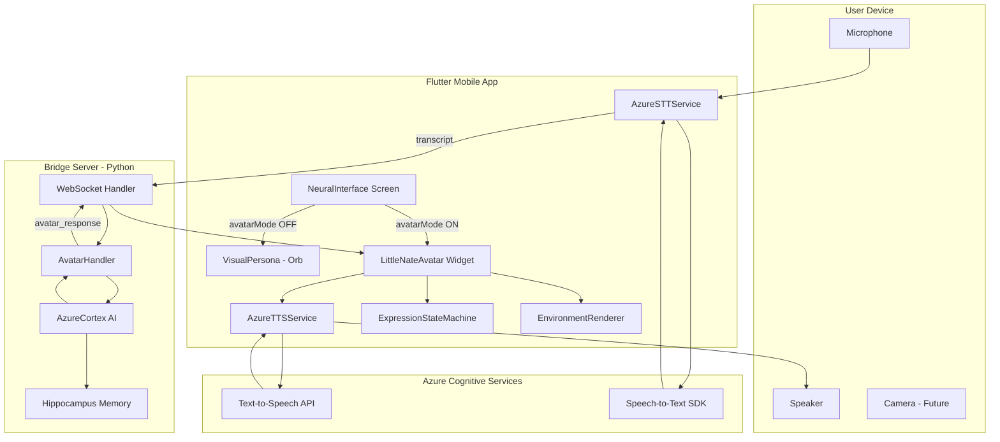
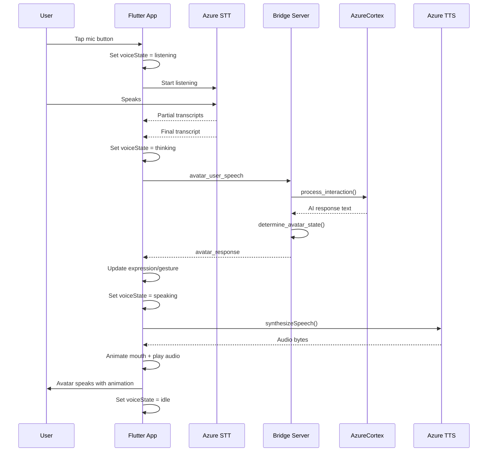
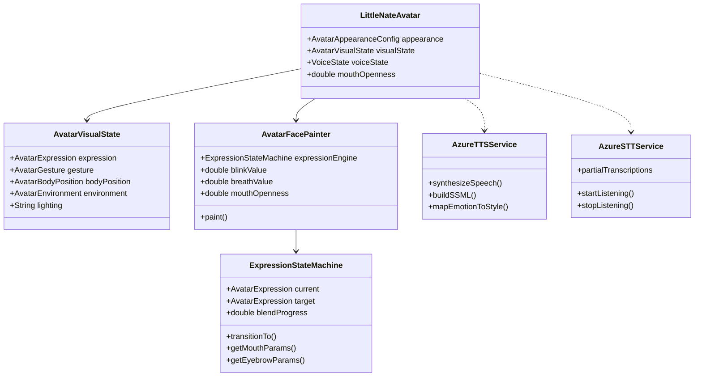
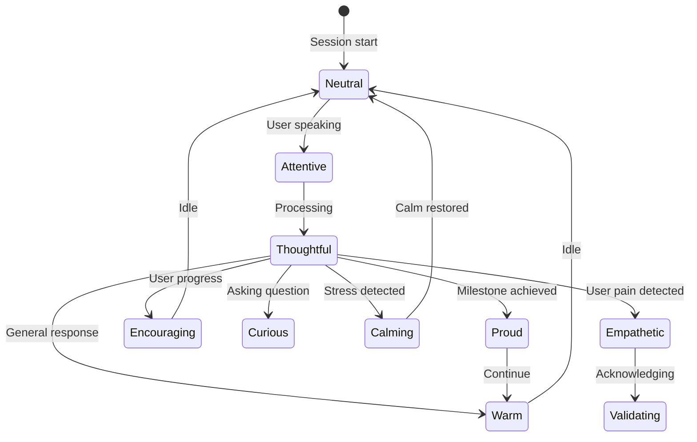
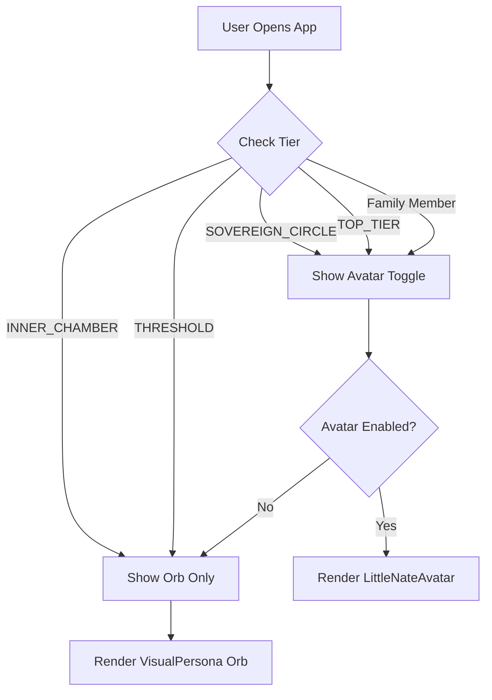

# Little Nate Avatar System Implementation

## Overview

Replace the existing orb (`VisualPersona`) with an animated Little Nate avatar for Top Tier clients. The avatar provides voice-to-voice conversations using Azure Speech Services, with 10 expression states, 10 gestures, and 7 adaptive environments.

---

## System Architecture



---

## Voice Conversation Flow



---

## Component Structure



---

## Avatar Expression States



---

## Tier Gating Flow



---

## Architecture Flow Steps

1. User speaks into mic
2. Azure STT transcribes speech
3. Transcript sent via WebSocket to bridge server
4. AI processes and generates response
5. Bridge returns response + avatar state (expression, gesture, environment)
6. Flutter receives response
7. Azure TTS synthesizes speech locally
8. Avatar animates expression while audio plays
9. User hears Little Nate speak + sees face animate

---

## Files to Create


| File                                       | Purpose                                                 |
| ------------------------------------------ | ------------------------------------------------------- |
| `mobile/lib/avatar.dart`                   | Complete avatar system (~2540 lines from provided file) |
| `backend/app/websocket/avatar_handlers.py` | Avatar-specific WebSocket message handlers              |


## Files to Modify


| File                                     | Changes                                                     |
| ---------------------------------------- | ----------------------------------------------------------- |
| `mobile/pubspec.yaml`                    | Add `audioplayers: ^5.2.1` and `path_provider: ^2.1.1`      |
| `mobile/lib/main.dart`                   | Add avatar toggle, conditional rendering in NeuralInterface |
| `backend/app/websocket/bridge_server.py` | Route avatar messages to handlers                           |


---

## Implementation Steps

### Step 1: Add Flutter Dependencies

In `mobile/pubspec.yaml`, add under dependencies:

- `audioplayers: ^5.2.1` - For TTS audio playback
- `path_provider: ^2.1.1` - For temp audio file storage

Note: `http`, `speech_to_text`, `permission_handler` are already present.

---

### Step 2: Create Avatar File

Create `mobile/lib/avatar.dart` with the complete implementation from the provided `avatar.dart` file. Key components:

- **Enums**: `AvatarExpression` (10 states), `AvatarGesture` (10 types), `AvatarEnvironment` (7 backgrounds)
- **Data Models**: `AvatarVisualState`, `AvatarAppearanceConfig`
- **AzureTTSService**: SSML builder, token auth, emotion-to-style mapping
- **AzureSTTService**: Speech recognition with silence detection
- **ExpressionStateMachine**: Smooth expression blending and transitions
- **EnvironmentRenderer**: Gradient backgrounds with adaptive lighting
- **AvatarFacePainter**: CustomPainter for face, eyes, mouth, brows, hair, glasses
- **LittleNateAvatar**: Main widget with breathing/blinking animations
- **AvatarModeScreen**: Full-screen avatar UX with voice pipeline
- **canUseAvatarMode()**: Tier eligibility check

Configure Azure Speech key in `AzureTTSService`:

```dart
static const String _speechKey = 'YOUR_AZURE_SPEECH_KEY';
static const String _region = 'eastus';
```

---

### Step 3: Integrate into NeuralInterface

Modify `mobile/lib/main.dart` around line 665:

**Add state variables:**

```dart
bool _avatarModeEnabled = false;
AvatarVisualState _avatarState = const AvatarVisualState();
AvatarAppearanceConfig _avatarAppearance = const AvatarAppearanceConfig();
VoiceState _voiceState = VoiceState.idle;
double _mouthOpenness = 0.0;
```

**Add tier check helper:**

```dart
bool _canUseAvatarMode() {
  final tier = (currentUserProfile['tier'] ?? '').toString().toUpperCase();
  final isFamilyMember = currentUserProfile['family_id'] != null;
  return tier == 'TOP_TIER' || tier == 'SOVEREIGN_CIRCLE' || isFamilyMember;
}
```

**Replace VisualPersona conditionally in build():**

```dart
body: Stack(
  children: [
    _avatarModeEnabled && _canUseAvatarMode()
      ? LittleNateAvatar(
          appearance: _avatarAppearance,
          visualState: _avatarState,
          voiceState: _voiceState,
          mouthOpenness: _mouthOpenness,
        )
      : VisualPersona(isTalking: _isTalking, isListening: _audio.isListening),
    // ... rest of UI unchanged
  ],
),
```

---

### Step 4: Add Avatar Toggle in Settings

Add toggle visible only to eligible users:

```dart
if (_canUseAvatarMode())
  SwitchListTile(
    title: Text('Avatar Mode', style: TextStyle(color: Colors.white)),
    subtitle: Text(
      _avatarModeEnabled 
        ? 'Face-to-face sessions active' 
        : 'Switch to voice + visual avatar',
      style: TextStyle(color: Colors.grey),
    ),
    value: _avatarModeEnabled,
    activeColor: Color(0xFFFFD700),
    onChanged: (v) => setState(() => _avatarModeEnabled = v),
  )
```

---

### Step 5: Create Backend Avatar Handlers

Create `backend/app/websocket/avatar_handlers.py`:

```python
import json

class AvatarHandler:
    def __init__(self, vault_root):
        self.vault_root = vault_root
    
    async def handle_avatar_user_speech(self, ws, profile, data, cortex):
        """Process voice input from avatar mode client"""
        text = data.get('text', '')
        
        # Process through existing AI pipeline
        ai_response = await cortex.process_interaction(profile, text)
        
        # Determine avatar state based on response content
        avatar_state = self._determine_avatar_state(ai_response)
        environment = self._determine_environment(profile)
        
        await ws.send(json.dumps({
            'type': 'avatar_response',
            'speech': {
                'text': ai_response.get('text', ''),
                'duration_ms': len(ai_response.get('text', '').split()) * 300,
            },
            'avatar_state': avatar_state,
            'environment': environment,
        }))
    
    def _determine_avatar_state(self, response):
        """Map AI response to expression/gesture"""
        text = response.get('text', '').lower()
        
        expression = 'WARM'
        gesture = 'NONE'
        body_position = 'RELAXED_NEUTRAL'
        
        if any(w in text for w in ['understand', 'hear you', 'that must be']):
            expression = 'EMPATHETIC'
            gesture = 'HAND_ON_HEART'
            body_position = 'ATTENTIVE_LEAN'
        elif any(w in text for w in ['great job', 'proud', 'amazing']):
            expression = 'PROUD'
            gesture = 'THUMBS_UP'
        elif any(w in text for w in ['breathe', 'calm', 'ground']):
            expression = 'CALMING'
            gesture = 'HANDS_TOGETHER'
        elif '?' in text:
            expression = 'CURIOUS'
            gesture = 'CHIN_REST'
        
        return {
            'expression': expression,
            'gesture': gesture,
            'body_position': body_position,
            'transition_duration_ms': 500,
        }
    
    def _determine_environment(self, profile):
        """Get environment based on session context"""
        return {
            'setting': 'COZY_STUDY',
            'lighting': 'WARM',
            'soundscape': 'SILENCE',
        }
    
    def load_avatar_config(self, user_id):
        """Load user's avatar customization"""
        # TODO: Load from user vault
        return {
            'appearance': {
                'skin_tone': 'MEDIUM',
                'hair_style': 'SHORT_CLASSIC',
                'hair_color': 'SALT_PEPPER',
                'eye_color': 'BROWN',
                'glasses': 'THIN_METAL',
                'clothing_style': 'CARDIGAN',
                'clothing_color': 'NAVY',
            },
            'preferences': {
                'default_environment': 'COZY_STUDY',
                'voice_speed': 1.0,
                'voice_pitch': 1.0,
            }
        }
```

---

### Step 6: Add Message Routing in Bridge Server

Modify `backend/app/websocket/bridge_server.py`:

**Import handler (near line 785 with other handlers):**

```python
from avatar_handlers import AvatarHandler
avatar_handler = AvatarHandler(VAULT_ROOT)
```

**Add routing in handle_client() message loop:**

```python
elif t == 'avatar_user_speech':
    if current_profile:
        await avatar_handler.handle_avatar_user_speech(
            websocket, current_profile, d, cortex
        )

elif t == 'fetch_avatar_config':
    if current_profile:
        config = avatar_handler.load_avatar_config(current_profile.get('id'))
        await websocket.send(json.dumps({
            'type': 'avatar_config',
            'config': config
        }))

elif t == 'avatar_start_breathing':
    if current_profile:
        exercise = d.get('exercise', 'BOX')
        # Send breathing phases
        phases = [
            ('INHALE', 4000),
            ('HOLD', 4000),
            ('EXHALE', 4000),
            ('HOLD', 4000),
        ]
        for phase, duration in phases:
            await websocket.send(json.dumps({
                'type': 'avatar_breathing_phase',
                'phase': phase,
                'duration_ms': duration,
            }))
            await asyncio.sleep(duration / 1000)
```

---

## Tier Gating

Avatar is ONLY available for:

- **Sovereign Circle** (TOP_TIER) tier at $149/mo
- **Family members** under a Top Tier account

Standard and Inner Chamber users:

- See the existing orb UX
- Do NOT see Avatar Mode toggle
- If they somehow access avatar settings, show upgrade prompt

---

## WebSocket Message Types

### Client to Server


| Type                     | Purpose                             |
| ------------------------ | ----------------------------------- |
| `avatar_user_speech`     | Transcribed speech from STT         |
| `fetch_avatar_config`    | Request user's avatar customization |
| `avatar_start_breathing` | Request breathing exercise          |


### Server to Client


| Type                     | Purpose                              |
| ------------------------ | ------------------------------------ |
| `avatar_response`        | AI text + avatar state + environment |
| `avatar_config`          | User's saved appearance settings     |
| `avatar_state_update`    | Expression/gesture changes           |
| `avatar_breathing_phase` | Breathing exercise phase updates     |
| `avatar_celebration`     | Milestone celebration triggers       |


---

## Key Integration Points


| Location           | Line   | What to Change                                        |
| ------------------ | ------ | ----------------------------------------------------- |
| `main.dart`        | ~665   | Replace `VisualPersona` conditionally                 |
| `main.dart`        | ~314   | Add avatar state variables to `_NeuralInterfaceState` |
| `main.dart`        | ~465   | Handle `avatar_response` in `_handleSocketMessage`    |
| `bridge_server.py` | ~785   | Initialize `AvatarHandler`                            |
| `bridge_server.py` | ~4000+ | Add avatar message routing                            |


---

## Testing Checklist

- Top Tier user sees Avatar Mode toggle in settings
- Standard user does NOT see Avatar toggle
- Toggle ON replaces orb with animated avatar
- Speech-to-text captures user voice
- Azure TTS speaks responses
- Mouth animates during speech
- Expressions transition smoothly (500ms)
- Environment backgrounds render correctly
- WebSocket messages flow correctly
- Breathing exercise works with avatar demonstration

