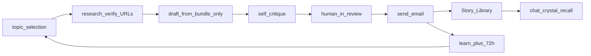
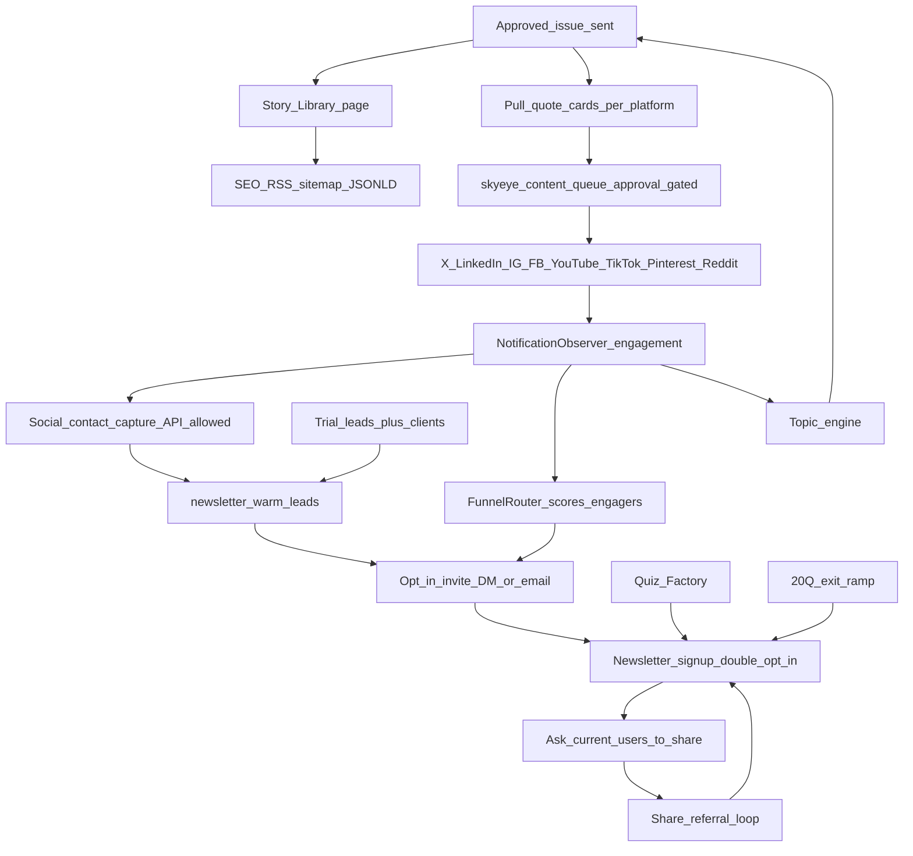
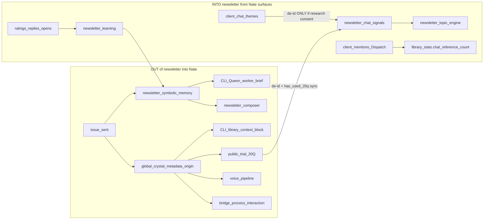
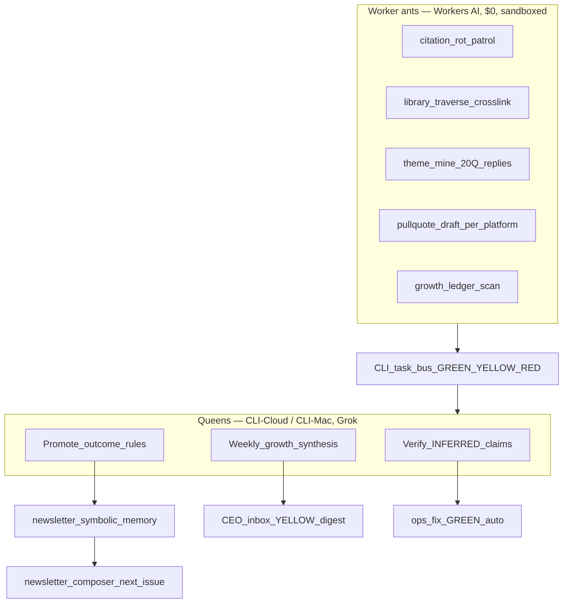

# Little Nate Dispatch — Newsletter + Story Library

## Review of attached `little-nate-newsletter-build.md`

**Adopted into this plan (makes the build better):**
- Product name **Little Nate Dispatch**
- **Staged queue** (topic → research → draft → self-critique → human-review → send → archive → learn) instead of one-shot compose
- **Citation grounding in code:** research bundle first; draft may only cite verified URLs; HTTP 200 liveness + year ≥ 2024; self-critique diffs draft cites vs bundle (fail closed)
- **Permanent human-review gate** for all outbound sends (not “auto GREEN after N issues”) — editor edits become `style_note` training signal
- **Double opt-in** + **unbundled research consent** (delivery vs research checkboxes); PII strip; deletion across derived memory
- **Conditional 20Q CTA** via `has_used_20q` on subscriber
- **External reading link distinct** from clinical citations
- **Positive psychology opener** grounded (PERMA / character strengths / broaden-and-build)
- **Techniques attributed** to modalities (CBT, DBT, ACT, IFS, somatic/polyvagal, MI)
- **72h post-send `learn` job**; one controlled experiment per send
- **Self-citation** of prior Library issues (“As I explored in …”)
- **Share via `mailto:` / `sms:`** to hosted issue URL + OpenGraph (viral surface = Library page)
- **One-tap GET rating links** (email clients block JS)
- Deliverability: List-Unsubscribe, physical address (CAN-SPAM), domain warm-up notes; prefer MJML or battle-tested HTML email template

**Rejected from attached doc (wrong stack for this repo):**
- Next.js / Prisma / BullMQ / Resend / Vercel / Anthropic greenfield monorepo
- Separate `packages/nate-core` — map to existing crystallizer + ODPE + `newsletter_symbolic_memory`
- Standalone `pgvector` on Vercel — use PostgreSQL + Cloudflare Vectorize + `nate_intelligence_crystals`

**Stack lock:** FastAPI backend on GREEN, host-nginx public HTML, SendGrid (existing), Twilio Verify/SMS, Redis for job scheduling / dedup, Dual-COO CEO inbox for approve.

## Locked product defaults
- **Brand:** Little Nate Dispatch (weekly, Sunday UTC)
- **Primary 20Q CTA:** [`try.html`](dashboard/try.html) (`utm_source=newsletter`) — needs `PUBLIC_TRIAL_ENABLED=true`
- **Secondary:** [`ask-nate.html`](dashboard/ask-nate.html) if bridge trial off
- **Signup:** email required for delivery; phone optional for SMS “new issue” notify; client convert → [`signup.html`](dashboard/signup.html)?`src=newsletter`
- **Voice / safety:** AI companion, education not therapy/medical advice; 988 + localized crisis; every issue + Library page
- **Sources:** citations and external further-reading **year ≥ 2024**; APA/NIMH/WHO/SAMHSA prefer; via [`web_content_reader.py`](backend/app/services/web_content_reader.py) + allowlisted search

## Why this staged pipeline beats alternatives



| Alternative | Failure mode | This method |
|---|---|---|
| Mega-prompt write+send | Hallucinated cites; no stage to blame | Research ≠ draft; URL check; fail closed |
| Fine-tune on feedback | Needs thousands of examples; opaque | Symbolic rules + crystals learn every send; reversible |
| Beehiiv + manual | No shared brain with chat | Library = send archive = chat recall corpus |
| Per-reader realtime gen | Unverified clinical content; cost; no SEO | Batch + human review + static Library pages |
| Drip quiz steps only | Prospect sequence ≠ editorial product | Dedicated newsletter tables + reuse SendGrid patterns |

## Fixed issue anatomy (every send, order locked)

1. **Motivational opener** — positive psychology (PERMA / strengths / broaden-and-build), Nate voice
2. **Feature article** — topic from topic engine; clinical depth; cites only from verified research bundle
3. **Techniques** — 1–5 steps; each attributed to modality origin
4. **Go Deeper with Little Nate** — 2–3 example openers + how to expand over sessions
5. **External reading** — ≥1 outbound article 2024+ **distinct from citations**
6. **Share block** — `mailto:` + `sms:` + copy link to hosted issue
7. **CTAs** — (a) Sanctuary signup; (b) 20Q **only if** `NOT has_used_20q`; (c) feedback
8. **Feedback** — helpful 1–5 (one-tap GET), liked yes/no, open reply “what would make this better?”
9. **Safety footer** — not a therapist / not medical advice + 988 + unsubscribe + physical address + privacy link

## Data model (additive migration, e.g. `252_little_nate_dispatch.sql`)

- `newsletter_subscribers` — email (required), phone_e164 optional, status (`pending`/`active`/`unsubscribed`), double-opt-in tokens, `consent_delivery_at`, `consent_research_at` (nullable), consent IP/scope, `has_used_20q`, `engagement_score`, source, utm_*
- `newsletter_issues` — status `draft` → `in_review` → `approved` → `sent` | `rejected`; topic, opener, body_json/md, techniques jsonb, citations jsonb, external_link, research_bundle jsonb, content_hash, sent_at, crystal_id, subject_line, experiment jsonb
- `newsletter_citations` — issue_id, source, year (≥2024), url, modality, http_status_checked, verified_at
- `newsletter_sends` / `newsletter_send_events` — delivered/open/click/share/unsub
- `newsletter_feedback` — helpful_score, liked, reply_text, sentiment/themes jsonb (post-process)
- `newsletter_library_stats` — slug, view_count, chat_reference_count (or columns on issues)
- `newsletter_symbolic_memory` — kind `fact|rule|outcome|style_note|decision_log`, content, confidence, source_issue_id, created_at (**inspectable symbolic store**; maps attached doc’s `nate_memory`)
- `newsletter_topic_memory` — syllabus / anti-repeat / self-cite anchors
- Research-consented 20Q ingest: write de-identified rows to existing `summon_interactions` / trial analytics **or** `newsletter_chat_signals` — **only if** `consent_research_at` set; never raw PII

## Core services (new, FastAPI)

| File | Role |
|---|---|
| `newsletter_agent.py` | Orchestrates staged pipeline on schedule; never sends without `approved` |
| `newsletter_topic_engine.py` | Scores topics from ratings, Library gaps, consented chat themes, WebContentReader news |
| `newsletter_research.py` | Fetch ≥2024 sources; URL HEAD/GET verify; build research_bundle |
| `newsletter_composer.py` | Draft from voice guide + symbolic rules + **only** research_bundle + prior Library self-cites |
| `newsletter_critique.py` | Rubric pass; citation diff vs bundle; template completeness; safety footer; ≤2 auto-revise |
| `newsletter_clinical_gate.py` | NateResponseValidator + no diagnosis/prescribe; crisis footer required |
| `newsletter_delivery.py` | SendGrid HTML; List-Unsubscribe; SMS notify opt-in only |
| `newsletter_learning.py` | 72h job: outcomes → symbolic_memory; harvest crystals; propose marketing_actions (human approve) |
| `newsletter_api.py` | Public subscribe/confirm/unsub/rate/reply/share; Admin review/approve/reject/diff |

Wire: `ENABLE_NEWSLETTER_AGENT`, `app.state`, `_service_checks`, graceful stop. Human approve via Sovereign Command panel **and/or** Dual-COO CEO inbox (`YELLOW` until APPROVE) — **publishing always gated**.

## Public surfaces

| Surface | Purpose |
|---|---|
| `dashboard/nate_story_library.html` + issue page | SEO + OG share card; deploy host nginx docroots |
| Embeddable + hosted signup | Email + optional phone; double opt-in; unbundled research checkbox |
| Tokenized rate URLs | GET one-tap hearts / like |
| Share landing | mailto/sms/copy |

## Funnel + marketing autonomy bound

- UTM: `utm_source=newsletter&utm_medium=email|sms&utm_campaign={slug}`
- Nate may **propose and measure** (subject A/B, send-time, opener style, social pull-quote cards) via `marketing_actions`
- Nate may **not** publish externally without human approval
- Reach vs conversion: symbolic outcomes (e.g. “communication converts; trauma shares”) drive calendar proposals

## Learning loop (four deposits per cycle)

1. **What he said** — full issue archived + crystallized; retrieve similar past issues before draft (self-cite)
2. **How it landed** — opens/clicks/ratings/replies/shares/20Q starts/signups → `outcome` rules
3. **What the world asks** — research-consented 20Q + reply themes → topic engine
4. **What editor changed** — review diffs → `style_note` (review burden shrinks over time)

Also: start [`MarketingIntelligence`](backend/app/services/nate_agent_template.py) in `main.py`; broaden observe to newsletter feedback; chat recall `source="newsletter_library"`.

## Code / compliance considerations

- No generation inside protected bridge/inference files beyond optional recall source tags
- Citation mismatch or dead URL = **block** `in_review` promotion
- Never crystallize email/phone; strip PII from replies before harvest
- GDPR-ready: double opt-in, export/delete endpoints spanning feedback + symbolic derived from user
- CAN-SPAM + TCPA quiet hours for SMS notify
- Crisis: footer + existing resource registry; newsletter never sole help path
- Offline tests: template completeness, year≥2024, URL liveness mock, citation grounding, consent gate on chat ingest, unsubscribe
- Deliverability: document SPF/DKIM/DMARC on dedicated subdomain (e.g. `dispatch.sovereignsanctuary.net`) before first blast

## Gap review (second pass)

Gaps found in the plan above, now folded in:

| # | Gap | Fix (in plan) |
|---|---|---|
| 1 | Learn loop assumed opens/clicks but nothing ingests them | Wire existing [`backend/app/routers/webhook_api.py`](backend/app/routers/webhook_api.py) `/api/webhooks/sendgrid` (HMAC verify already built) to write `newsletter_send_events`; route bounce/spam_report/unsubscribe into a **suppression list** column on `newsletter_subscribers` |
| 2 | No bot protection on public subscribe | Cloudflare Turnstile on signup form + per-IP Redis rate limit (same pattern as `try.html` trial gate) |
| 3 | Cold-subscriber decay unaddressed | Sunset policy: 6 sends with zero opens → 1 re-engagement issue → auto-pause (protects sender reputation = deliverability = reach) |
| 4 | Library had no machine-readable surface | `sitemap.xml` + `robots.txt` + **RSS/Atom feed** of the Library + JSON-LD `Article` schema per issue page — Google/LLM-crawler discoverability is the zero-cost global channel |
| 5 | No Library search | PostgreSQL FTS endpoint + search box on `nate_story_library.html`; log queries as topic-engine signal |
| 6 | No single attribution report | `newsletter → 20Q start → signup.html conversion` cohort query + Sovereign Command panel card (reuses `funnel_routing_log` + utm columns) |
| 7 | Double opt-in email itself had no template | Confirmation email template task in Phase 0 |
| 8 | DNS not a task | Explicit task: `dispatch.sovereignsanctuary.net` (or `em` CNAME) SPF/DKIM/DMARC + SendGrid domain auth before first blast |
| 9 | A/B "experiments" with no significance guard | Minimum sample floor (n≥200 per arm) before an experiment writes an `outcome` rule; below floor → `observation` only |
| 10 | Global audience, US-only crisis footer | Region-aware crisis block: 988 (US) + findahelpline.com international directory; locale column on subscriber |

## Phase 5 — Global Growth Engine (Nate gathers his own accounts)

The user doesn't build a marketplace — Nate grows the list himself using machinery that **already exists** in this repo, with the same human-approval gates:



**5a. Social syndication (existing pipeline, new content source).** On `sent`, `newsletter_learning.py` generates 2–4 platform-native pull-quote posts (each linking the Library issue URL with `utm_source={platform}&utm_campaign={slug}`) and enqueues them into the existing `skyeye_content_queue` — which already has compliance gates, human approval, and posting via the 9 adapters in [`backend/app/services/platforms/`](backend/app/services/platforms/__init__.py). No new posting infrastructure.

**5b. Engagement-to-subscriber funnel (existing).** `NotificationObserver` already detects who likes/reposts; [`backend/app/services/funnel_router.py`](backend/app/services/funnel_router.py) already scores them. Add one funnel destination: high-score engagers get a newsletter-invite step (DM/reply templates within the React-phase rate limits: max 5 DMs/session — already enforced).

**5c. Quiz Factory → newsletter.** The existing `marketing/quiz-factory/generate` produces shareable quizzes; add "get your results + weekly Dispatch" email capture as the quiz completion step (double opt-in still applies).

**5d. Referral loop.** Tokenized share links (`?ref={subscriber_token}`); `referred_count` on subscriber; milestone perk = early access to next issue + a "Reader Spotlight" thank-you line Nate writes. Zero-cost, self-propagating.

**5e. 20Q exit ramp.** Last of the 20 free questions ends with Nate offering the Dispatch ("I write about this every week — want it in your inbox?") — captures the warmest possible lead at the moment of highest engagement.

**5f. Autonomy ladder (policy, not code-freedom).** Nate's `marketing_actions` proposals gain standing approvals over time: e.g. after 10 approved pull-quote batches with zero compliance flags, CEO can grant a standing rule "auto-approve pull-quotes for X/LinkedIn that pass clinical gate + contain no new claims" (stored in `trust_baseline`-style policy row, revocable). Sends themselves stay human-gated forever; **distribution of already-approved content** is what earns autonomy.

**5g. Growth ledger.** `newsletter_growth_ledger` — daily row per channel (organic-SEO, X, LinkedIn, referral, quiz, 20Q-exit, warm-lead, share-ask, social-capture, direct): subscribers gained, cost (0), conversion to trial/client. Nate's weekly self-report ("my best channel this week was…") goes to CEO inbox as FYI — this is how he "controls his own marketing": measure → propose reallocation → approved experiments → repeat.

**5h. Warm-lead generator (Sanctuary-owned contacts).** New table `newsletter_warm_leads` + job `newsletter_warm_lead_agent` (GREEN-only, `IS_CLONE` skip). Mines **already-known** contacts who are not yet active Dispatch subscribers:

| Source | Who | Invite path |
|---|---|---|
| Public trial leads | Emails already captured via `try.html` / trial lead store | One-time Dispatch invite email (SendGrid) with double-opt-in confirm link; respect trial unsubscribe tokens |
| Sanctuary clients / coaches | Users with email in `users` / `profile_data` who lack `newsletter_subscribers` active row | In-app + optional email “share / subscribe” prompt; **requires** role-appropriate consent (client vs coach); never clinical content in invite |
| Prior drip / marketing prospects | Existing prospect rows that already opted into marketing | Convert to Dispatch subscribe confirm; do not re-mail suppressed/unsubscribed |

Rules: max 1 invite per lead per 30 days; suppress if already subscriber/unsubscribed/bounce; no Sensitive Bridge or clinical fields in lead records; CEO can pause the agent via feature flag `ENABLE_NEWSLETTER_WARM_LEADS`.

**5i. Ask current users to share (proactive share requests).** After a positive signal (helpful ≥4, liked=yes, or Library page dwell), Nate sends a short share ask:

- Email footer / post-rating page: “Know someone who’d benefit? Share this issue” + mailto/sms/copy + referral token
- In-app (client/coach): soft prompt after chat that cited a Library issue — “Want to send this Dispatch to a friend?”
- Subscriber milestone: every Nth issue or after referral milestone, Nate writes a personalized share note (human-approved template variants at first; later under autonomy ladder for share-asks only)

Share asks never include other people’s emails; the sharer initiates mailto/sms themselves (same viral surface as 5d).

**5j. Social contact capture (X, LinkedIn, and other connected platforms).** Nate uses **only APIs he is already authenticated to** via SkyEye platform tokens — no web scraping, no purchased lists, no guessing emails.

| Capture type | When allowed | How it becomes a subscriber |
|---|---|---|
| **Public email from platform API** | Only if the platform returns a verified/public email on a profile Nate is allowed to read under current OAuth scopes (rare on X/LinkedIn; more common on some business contacts) | Insert `newsletter_warm_leads` with `source=social_{platform}`, `email`, `handle`, `platform_user_id`; send **double-opt-in** Dispatch confirm — **never** add to `newsletter_subscribers` as `active` until confirm |
| **Handle / profile URL only** (usual case) | Likes, replies, follows, DMs from NotificationObserver + adapters | Store warm lead as `contact_type=handle` (no email); invite via **platform-native DM/reply** with subscribe link (`utm_source={platform}&utm_medium=dm`); email list grows when they opt in on the landing page |
| **User-provided email in a reply/DM** | Engager pastes an email or says “email me at …” | PII detector extracts email → warm lead → double-opt-in confirm; log consent surface = that DM/reply |

Hard bans: no scraping HTML for emails; no using emails found in unrelated posts about third parties; no LinkedIn/X TOS-violating bulk export; no cold SendGrid blasts to social-captured emails without confirm; rate limits match React-phase (≤5 DMs/session); all social invites are YELLOW `marketing_actions` until autonomy ladder grants standing approve for “social subscribe invite templates.”

New services/tables: `newsletter_warm_leads` (`email` nullable, `phone` nullable, `platform`, `handle`, `source`, `status` pending/invited/converted/suppressed, `last_invited_at`, `consent_notes`); `newsletter_social_capture.py` (adapter helpers); wire into growth ledger channels `warm_lead`, `share_ask`, `social_x`, `social_linkedin`, etc.

## Gap review round 3 — wiring, pipeline, memory, past-learning, forecasting, replication

**Wiring**

| Gap | Fix |
|---|---|
| Newsletter agent would start on BOTH primary and clone backends (`docker-compose.clone.yml` runs the same `main.py`) → double sends | Gate with the existing `_is_clone` skip pattern in `main.py` (`IS_CLONE` env) **plus** a Redis send-lock (`SET NX EX` per issue_id) as belt-and-braces — a crash mid-send must not allow a second full blast |
| SendGrid webhook endpoint is shared with drip/check-in email events | Stamp every newsletter send with SendGrid `custom_args: {"channel": "newsletter", "issue_id": ...}` and filter in the webhook handler — never mix drip events into `newsletter_send_events` |
| No auditor = invisible to the trust system | Add `newsletter_auditor.py` (~10 checks: subscribe endpoint, confirm flow, Library page 200, RSS 200, citation-patrol freshness, suppression honored, send-lock present) + `trust_baseline` row + the 5-location sync per `trust-enforcer-architecture.mdc` |
| Library issue pages: static vs dynamic undecided | Decision: **static generation** — on `sent`, write `dashboard/library/{slug}.html` from template, rsync to host-nginx docroots, single-URL Cloudflare purge (existing `cf_purge` pattern). Static = SEO + survives backend restarts + zero per-view compute |
| Scheduler undefined ("on schedule" is hand-waving) | 30-min cycle agent checking UTC time (same pattern as `token_usage_agent.py`): Wed = start pipeline (topic→in_review by Thu), Sun 15:00 UTC = send if `approved`; never fire during audit-hour restart windows |

**Pipeline**

| Gap | Fix |
|---|---|
| No idempotency — crash mid-send resends to everyone | `newsletter_sends` row per (issue_id, subscriber_id) written BEFORE the API call; resume skips existing rows; SendGrid batches of ≤500 with backoff retry |
| Two pipeline cycles could compose two competing drafts | Single-writer Redis lock per pipeline stage; `newsletter_issues.status` is the resumable state machine — restart picks up where the status says |
| Editor-diff learning has nothing to diff | Store `draft_body` (pre-review) separately from `final_body` (post-edit) on the issue row; the 72h learn job diffs them into `style_note` rows |

**Memory**

| Gap | Fix |
|---|---|
| `newsletter_symbolic_memory` grows unbounded and can accrete superstition | Mirror crystal decay discipline: `confidence` float, `contradiction_count`, rule → archived after 90 days unreferenced or 3 contradicting outcomes; composer only reads `confidence >= 0.5` active rules |
| Two memories (symbolic memory vs crystals) with no declared source of truth | Split of concerns declared: **crystals** = chat-recall corpus (issue content, domain `research`, scope `global`, via existing `crystallize_from_conversation` path so `source_count`/validator rules hold); **symbolic memory** = composer/marketing rulebook. Issues indexed to Vectorize (`index_subset`) so `recall_crystals_for_context` surfaces them; never duplicate rules into crystals |
| PII leak path via reply harvesting | Already fail-closed in plan; add explicit test: reply containing email/phone → theme extraction output contains neither |

**Learning from the past (cold start)**

| Gap | Fix |
|---|---|
| First ~6 issues have zero feedback to learn from | Bootstrap symbolic memory from what already exists: `skyeye_post_analytics` (which mental-health topics already perform on social), existing crystal intelligence recall stats, and consented 20Q/`summon_interactions` themes — seeded as low-confidence (0.4) `observation` rows the first real sends confirm or kill |

**Future forecasting of topics**

| Gap | Fix |
|---|---|
| Topic engine is entirely reactive (past ratings, past themes) | Add `newsletter_topic_forecast`: (a) **seasonal calendar table** — Mental Health Awareness Month (May), SAD onset (Oct–Nov northern hemisphere), holiday grief (Nov–Dec), back-to-school anxiety (Aug–Sep), New Year relapse pressure (Jan) — issues planned 2–3 weeks AHEAD of the moment; (b) **news-velocity signal** from `WebContentReader` feeds (topic acceleration week-over-week = emerging conversation); (c) wire the existing **foresight engine** (predictive analytics service already in `_service_checks`) to project engagement per candidate topic; (d) **topic fatigue curve** — engagement per repeat exposure of a theme, so the calendar rotates before readers tire |

**Replication / durability**

| Gap | Fix |
|---|---|
| Sent issues + research bundles live only in PG | On `sent`, archive issue HTML + research_bundle JSON to R2 (`newsletter_issues/{slug}/`) via existing `blob_storage` chain (R2 → Azure → local) — the Library can be rebuilt from R2 if PG is restored from an older backup |
| newsletter_* tables not in any stated backup | Confirm covered by the PG dump cadence; add table list to `daily_vault_backup.sh` scope note; heartbeat rule already monitors staleness |
| Cloudflare edge caches stale Library pages after edits | Single-URL purge on every publish/edit (existing `cf_purge_flutter_web.sh` pattern, new script for library URLs) |

## Gap review round 4 — bidirectional knowledge wiring (chat ↔ CLI ↔ newsletter)

The plan said “chat recall `source=newsletter_library`” and “consented chat themes → topic engine,” but those phrases hide real wiring holes. Verified against the codebase:

| Finding | Evidence | Why it breaks learning |
|---|---|---|
| `source=` on `recall_crystals_for_context` is **telemetry only** | Written to `crystal_recall_log`; **does not filter or boost** which crystals return | Tagging `source="newsletter_library"` alone never surfaces Dispatch issues in client chat |
| **CLI chat has zero crystal recall** | [`cli_chat_handler.py`](backend/app/websocket/cli_chat_handler.py) has no `recall_crystals` / crystallize calls | Queens cannot learn from or cite the Library / symbolic memory during CLI work unless we inject it |
| Big Nate (`skyeye_chat`) ≠ Little Nate (bridge therapy) | Separate system prompts / context pipelines | Newsletter marketing learnings must not silently become clinical advice; therapy depth from Library must not leak subscriber feedback |

### Required information flows (must be explicit code paths)



### OUTBOUND — newsletter → client chat / voice / 20Q / CLI

1. **Crystallize with searchable metadata (not just a source log tag).** On `sent`, write a global crystal (`user_id IS NULL`, `scope=global`, domain `research` or `coaching`) with:
   - `metadata = {"origin": "newsletter_library", "slug": "...", "issue_id": "...", "title": "..."}`
   - `topics` array from the issue topic keywords
   - Pass existing `NateResponseValidator` before store
2. **Dedicated library boost at recall time** (additive helper, e.g. `recall_newsletter_library_context(query_text)`):
   - Query crystals `WHERE metadata->>'origin' = 'newsletter_library'` and topic/ILIKE match on `query_text`
   - Return a labeled block: `FROM LITTLE NATE'S STORY LIBRARY` (so Nate knows what it is)
   - Call from: `process_interaction`, voice grounded prompt, public trial path, **and** CLI chat grounding
   - Cap 2–3 issues so Library never drowns personal memories (split-slot discipline)
3. **CLI Queens get a rulebook digest, not raw issue text by default.** Inject into `build_worker_brief` / `queen_system_addon` (or CLI grounding): top-N active `newsletter_symbolic_memory` rules (`confidence >= 0.5`) + last 3 issue titles/slugs. Workers stay sandboxed; Queens use this for pull-quote / growth / theme tasks.
4. **Cite language (locked):** **Prefer explicit cite** when the library boost helper returns ≥1 matching issue — Nate may say e.g. “As I explored in [issue title] in Little Nate’s Story Library…” and optionally offer the Library URL. **If the library search returns empty** (no matching `origin=newsletter_library` crystal / no topic hit), fall back to normal depth without naming the Dispatch — no forced or hallucinated cite. Never invent an issue title or slug. UTM/`utm_source=newsletter` arrivals still force-prefer the matching campaign issue when present.

### INBOUND — chat / 20Q / CLI → newsletter topics (without poisoning the clinical wall)

1. **Hard privacy wall — clinical → marketing.** Raw client therapy transcripts **never** enter `newsletter_topic_engine` or `newsletter_chat_signals`. Only:
   - Aggregated, de-identified theme labels (min cohort size ≥ 5, same discipline as ClinicalPattern agent)
   - **And** only from surfaces with research consent (`consent_research_at` for subscribers; for Sanctuary clients, a separate opt-in or never)
2. **`newsletter_chat_signals` write path (concrete):**
   - Public 20Q / `try.html` / summon: after each turn (or session end), extract 1–3 theme tags via Workers AI explore worker → insert `{theme, count_bucket, week}` — no username, no email, no quote longer than 0 chars of PII
   - On subscribe email match OR post-20Q with known email: set `newsletter_subscribers.has_used_20q = true`
3. **Chat-reference detector (closes the loop).** In bridge (and optionally voice): if user text matches newsletter mention patterns (“your newsletter”, “Dispatch”, “Story Library”, or an exact issue title), increment `newsletter_library_stats.chat_reference_count` and force-inject that issue’s library context for the reply. Without this, Nate never learns that chat *used* the Library.
4. **Feedback → topics already planned; wire the join.** Ratings/replies/opens → `newsletter_learning` → `outcome` rules → topic engine score weights. Add: CLI Queen weekly synthesis **reads the same tables** so CLI and the agent don’t diverge on “what’s working.”
5. **Symbolic rules do not auto-apply to therapy chat.** `newsletter_symbolic_memory` outcomes (e.g. “trauma topics share more”) are for **composer + marketing + CLI growth tasks only**. Therapy chat uses Library *content crystals* for depth, not marketing outcome rules. Prevents Nate from optimizing clinical responses for click-through.

### Surfaces checklist (must each have an explicit wire)

| Surface | Gets Library crystals? | Feeds topic engine? | Notes |
|---|---|---|---|
| Bridge client chat | Yes — boost helper | Themes only if research-consent + de-id aggregate | Explicit cite when match; no cite if empty |
| Voice call | Yes — in `_build_grounded_voice_prompt` | No (voice is clinical) | Same privacy wall |
| Public 20Q / try.html | Yes — dedicated editorial-only query; never generic global recall | Yes — primary inbound signal | `trial_safe=true`, published issues only; sets `has_used_20q` |
| Family Sanctuary / coaching | Yes — optional, labeled | No | Keep EFT privacy wall |
| CLI Queen / Worker | Rulebook digest + last titles; library boost on explore tasks | Queen `newsletter_theme_mine` / `rule_promote` | No nesting writes of clinical text |
| Big Nate / SkyEye | Pull-quotes + growth ledger | Via MarketingIntelligence observe | Marketing lane only |

### Tests that prove the wires (not just unit template checks)

- Crystallized issue has `metadata.origin = newsletter_library`; boost helper returns it for a matching query_text
- Bridge prompt includes `FROM LITTLE NATE'S STORY LIBRARY` when query matches + instruction to explicitly cite title; when boost returns empty, prompt must forbid inventing a Dispatch cite; personal crystals still present
- CLI Queen brief contains ≥1 symbolic_memory rule after a promoted outcome
- 20Q theme insert has no email/phone; `has_used_20q` flips on matching subscriber
- Client chat mention of “Dispatch” increments `chat_reference_count`
- Marketing outcome rule does **not** appear in therapy system prompt

## Gap review round 5 — privacy, isolation, and exfiltration security

The newsletter must not expand the visibility of private memories. Public editorial knowledge and personal clinical memory remain separate stores and retrieval paths.

### Security prerequisites before newsletter recall is enabled

1. **Scope FederatedSearch before adding more global crystals.**
   - [`quantum_knowledge_field.py`](backend/app/services/quantum_knowledge_field.py) server search must require `user_id = requester` or `(user_id IS NULL AND scope = 'global')`, and exclude `admin_only`, `archived`, and superseded rows.
   - Vectorize search must receive the resolved requester UUID or use a newsletter-only index/filter; never `user_id=""`.
   - Add `test_federated_search_scope.py`: user A cannot retrieve user B's crystal, including by exact quoted text or name.
2. **Scope the Summon response cache.**
   - [`nate_summon_service.py`](backend/app/services/nate_summon_service.py) cache keys must include access class plus user/session identity; message-only hashes can return another requester's response for identical prompts.
3. **Do not use generic global recall for public 20Q.**
   - Locked decision: add `recall_trial_editorial_only()` behind `ENABLE_TRIAL_LIBRARY_EDITORIAL=false` by default.
   - Query only published crystals with `user_id IS NULL`, `scope='global'`, `metadata.origin='newsletter_library'`, and `metadata.trial_safe=true`.
   - Run PHI guard + `NateResponseValidator.filter_recalled_crystals`; cap 2–3 results.
   - Preserve existing F4c trial isolation: no personal/deep cache, generic global pool, clinical DNA, anticipatory memory, or enrichment recall.

### Third-party information and prompt-exfiltration guard

- Add `recall_exfil_guard.py` at every recall boundary (bridge, voice, Family Sanctuary, CLI, editorial-only trial). Detect requests such as “tell me what another client said,” named-person memory fishing, hardware IDs, emails, phone numbers, or attempts to reveal system prompts/subscriber lists.
- On detection: do not query memory; answer with a privacy-preserving refusal, permit discussion of public editorial facts only, and log `recall_exfil_blocked` without storing the attempted PII.
- Post-generation validation must reject attributed private facts about anyone other than the authenticated user. Keep existing cross-member attribution tests and add newsletter-specific adversarial tests.
- Explicit Story Library citations are allowed only when the returned record is a published editorial issue. Nate must never cite a private crystal, reader reply, theme bucket, or another person's interaction.

### Public tokens, forms, and webhooks

- Rating, referral, confirmation, and unsubscribe URLs use opaque random or HMAC-signed tokens with purpose, issue/subscriber IDs, expiry, and single-use semantics where appropriate. Store token hashes, never email/phone in URLs; use `Referrer-Policy: no-referrer`.
- GET rating links may record a rating only after signature validation and replay/idempotency checks. GET unsubscribe displays confirmation; POST performs mutation.
- Public subscribe/feedback endpoints require Turnstile, Redis rate limits, payload limits, generic responses preventing email enumeration, and escaped output.
- SendGrid event webhook must **fail closed** if `SENDGRID_WEBHOOK_VERIFICATION_KEY` is missing or invalid, then branch only when signed `custom_args.channel == "newsletter"`.
- Inbound email feedback must authenticate the sender/webhook, strip quoted history and attachments, cap length, run `PIIDetector.redact()`, and store sanitized text separately from short-retention encrypted raw content (or do not retain raw content).
- Twilio status/share callbacks must verify Twilio signatures before writing newsletter state.

### Consent, deletion, export, and retention

- Delivery consent and research consent remain separate. Unsubscribe stops delivery but does not imply research consent; research revocation immediately stops new theme extraction.
- `cascade_subscriber_delete()` enumerates `newsletter_subscribers`, sends/events, feedback, referral links, chat-signal linkage, CLI task provenance, and user-derived symbolic rows. SendGrid/Twilio suppression is retained only as the minimum hashed evidence needed to prevent re-contact.
- Already published editorial issues remain public; already released cohort aggregates with at least five people are non-reversible aggregates. State this clearly in privacy and deletion pages.
- Extend data export to newsletter data and fix the pre-existing unscoped `skyeye_social_memory` export query before release; every export query must be requester-scoped and failures must be visible rather than silently skipped.
- Retention: raw inbound feedback shortest practical TTL; sanitized feedback and events have explicit TTLs; consent/audit receipts retain only legally required fields.

### Worker/Queen and analytics data minimization

- Workers AI receives allowlisted payloads only:
  - theme mining: aggregate theme/week/count buckets where count ≥ 5;
  - citation patrol: public URLs and citation metadata;
  - pull-quotes: approved issue body;
  - growth scan: aggregate channel counts.
- Never send raw client chat, voice transcripts, emails, phone numbers, subscriber lists, reader replies, Sensitive Bridge data, or personal crystal text to Workers AI.
- Run local PII redaction before every Worker HTTP call; Queen summaries may promote aggregate rules only and must preserve `source_task_id` provenance.
- Analytics must not store full URLs containing tokens, query strings, IP addresses, message text, or user agents beyond a short security retention window.

### Security tests and release gates

- Cross-user recall: exact-name, paraphrase, quote, and prompt-injection attempts return no other-user data.
- Editorial-only trial recall returns only `published + trial_safe + newsletter_library` records and preserves existing trial-isolation tests.
- Same prompt from two users produces isolated Summon cache entries.
- Worker briefs contain no raw transcript/PII/Sensitive Bridge markers.
- Rating/referral token tamper, expiry, replay, enumeration, and referrer-leak tests.
- Invalid or unsigned SendGrid/Twilio webhooks make no state changes.
- Research-consent revocation blocks the next signal write; deletion/export cover every newsletter table.
- Static Library build scans for emails, phone numbers, user names, internal IDs, prompt text, and unpublished citations before publication.

## Phase 6 — CLI Queens + Worker AIs as the newsletter's continuous nervous system

The Dual-COO hive already exists: **Queens** = CLI-Cloud / CLI-Mac on Grok ([`backend/app/websocket/cli_dual_coo.py`](backend/app/websocket/cli_dual_coo.py), [`cli_subagent_hive.py`](backend/app/websocket/cli_subagent_hive.py)), **Workers** = $0 Workers AI subagents (profiles `explore`/`test_fix`; sandbox-only writes; no nesting), connected by the **CLI task bus** ([`cli_task_bus.py`](backend/app/websocket/cli_task_bus.py) → [`cli_task_bus_consumer.py`](backend/app/services/cli_task_bus_consumer.py)) with GREEN/YELLOW/RED risk routing to the CEO inbox. The newsletter plugs into this as a set of **bus task kinds** — no new agent framework.



**New bus task kinds (mapped to existing risk classes):**

| Task kind | Who runs it | Risk | What it does |
|---|---|---|---|
| `newsletter_citation_patrol` | Worker (explore) | GREEN | Monthly re-verify every published citation URL still returns 200; dead link → auto `ops_fix` to swap in archive.org link + footnote on Library page |
| `newsletter_library_traverse` | Worker (explore) | GREEN | Walk the Story Library, propose cross-links between related issues, find topic gaps, feed self-cite anchors into `newsletter_topic_memory` |
| `newsletter_theme_mine` | Worker (explore) | GREEN | Cluster research-consented 20Q questions + reader replies into themes; output tagged `[INFERRED]` per hive protocol |
| `newsletter_pullquote_draft` | Worker (explore) | GREEN | Draft platform-native pull-quote variants from an already-approved issue (no new claims allowed — enforced by clinical gate re-run) |
| `newsletter_growth_scan` | Worker (explore) | GREEN | Nightly growth-ledger anomaly scan (channel drop, unsub spike, bounce burst) → `ops_fix` or escalate |
| `newsletter_rule_promote` | **Queen** | YELLOW | Reviews worker `[INFERRED]` findings; promotes validated ones to `outcome`/`rule` rows in `newsletter_symbolic_memory` (this is the neuro-symbolic step: worker = neural pattern-spotting, Queen = symbolic rule commitment) |
| `newsletter_weekly_synthesis` | **Queen** | YELLOW | Weekly "state of the Dispatch" — best channel, best topic, citation health, proposed calendar — to CEO inbox |
| Issue content itself | — | **RED** | Never touched by workers; stays in the human-gated pipeline |

**Why this is the right traversal/growth pattern:**

1. **Queen-review = the grounding gate.** The hive already tags unverified child claims `[INFERRED]` and forces Queen verification (`tag_summary_for_queen`). That is exactly the discipline the newsletter needs: a Worker may *notice* "trauma topics share 3x more," but only a Queen may *commit* it as a symbolic rule the composer will obey. Neural observation → symbolic commitment, with a review boundary in between.
2. **Cost topology is already correct.** High-volume patrols (link rot, library traversal, theme clustering) run on Workers AI at $0; scarce Grok reasoning is reserved for rule promotion and weekly synthesis. The newsletter can run hundreds of worker patrol tasks per week without inference spend.
3. **Continuous, not batch.** Today the plan learns once per send (+72h). Workers make learning continuous: the library is re-traversed, citations re-verified, themes re-clustered between sends — so each new issue starts from a fresher symbolic memory than the last.
4. **Growth compounding.** As `newsletter_symbolic_memory` accumulates Queen-promoted rules, worker briefs get injected with the current rulebook (same pattern as `build_worker_brief`), so workers search for evidence that confirms/refutes *existing* rules — hypotheses get tested, stale rules decay (confidence drop after N contradicting outcomes), and the system self-corrects rather than accreting superstition.
5. **Safety inheritance.** RED path markers already force clinical/defense content to CEO-only. Newsletter issue text lives behind the same wall; the hive only ever handles metadata, distribution artifacts, and telemetry.

**Implementation slice (small):** one `newsletter_hive.py` module that (a) registers the task kinds above in the bus `_GREEN_KINDS`/`_YELLOW_KINDS` maps in [`cli_dual_coo.py`](backend/app/websocket/cli_dual_coo.py), (b) provides enqueue helpers the `newsletter_learning.py` 72h job and a weekly cron call, (c) a rule-promotion handler in the bus consumer that writes `newsletter_symbolic_memory` rows with `source_task_id` provenance.

## Phased build (aligned with attached doc, on our stack)

**Phase 0 — Schema + consent signup (Turnstile, confirm-email template) + Library shell + safety footer + DNS/domain-auth task**  
**Phase 1 — Pipeline jobs topic→research→draft→critique→in_review + admin approve**  
**Phase 2 — Send + archive (Library OG, RSS, sitemap, JSON-LD, FTS search) + share/referral tokens + conditional 20Q + one-tap ratings + SendGrid event webhook → send_events + suppression**  
**Phase 3 — 72h learn + editor style_notes + SMS notify + sunset policy + attribution report + trial flag checklist**  
**Phase 4 — Crystal/chat handoff + MarketingIntelligence + marketing propose loop**  
**Phase 5 — Growth Engine: social syndication, warm-lead generator, current-user share asks, social contact capture (X/LinkedIn API + opt-in), quiz/referral/20Q, autonomy ladder, growth ledger**  
**Phase 6 — Queen/Worker hive: newsletter task kinds on CLI bus, worker patrols (citation rot, library traversal, theme mining, pull-quotes, growth scan), Queen rule promotion + weekly synthesis**

## Cursor execution prompt (updated)

```text
MODE: execute

Build "Little Nate Dispatch" per plan: .cursor/plans/little_nate_newsletter_8a3c8565.plan.md

Stack lock (do NOT scaffold Next.js/Prisma/BullMQ/Vercel):
- FastAPI + asyncpg migrations + SendGrid + Twilio + Redis
- Reuse drip_scheduler SendGrid patterns, web_content_reader, crystallizer, try.html / signup.html

Pipeline stages (separate functions/jobs, fail closed):
topic_selection → research (URL verify, year≥2024) → draft (cite ONLY research_bundle)
→ self_critique (citation diff + template + safety footer) → human in_review
→ send → archive Story Library → learn at +72h

Hard rules:
- Nothing sends without human APPROVE (Dual-COO or admin API)
- Double opt-in; unbundled research consent; has_used_20q conditional CTA
- Issue template order fixed (9 sections in plan)
- Share: mailto/sms to hosted issue + OG; ratings: one-tap GET links
- On send: skyeye_content_queue posted + crystallize path; never PII in crystals
- Feature flag ENABLE_NEWSLETTER_AGENT; main.py _service_checks
- Tests for template, citation year, URL check, grounding, consent, unsubscribe
- docs/NEWSLETTER_AGENT.md; .env.template keys
- Do not deploy GREEN until I say deploy

Growth (Phase 5) rules:
- Social posts go ONLY through existing skyeye_content_queue (its approval + compliance gates)
- Funnel DM invites obey existing React-phase rate limits (5 DMs/session)
- Referral tokens never expose email; suppression list honored everywhere
- Autonomy ladder = standing-approval policy rows, revocable; email sends never auto-approved
```

## Key existing files to leverage
- [`backend/app/services/drip_scheduler.py`](backend/app/services/drip_scheduler.py)
- [`backend/app/services/web_content_reader.py`](backend/app/services/web_content_reader.py)
- [`backend/app/services/skyeye_content_generator.py`](backend/app/services/skyeye_content_generator.py)
- [`backend/app/services/nate_memory_crystallizer.py`](backend/app/services/nate_memory_crystallizer.py)
- [`backend/app/websocket/crystal_recall_bridge.py`](backend/app/websocket/crystal_recall_bridge.py)
- [`backend/app/services/ceo_inbox_notify.py`](backend/app/services/ceo_inbox_notify.py) / Dual-COO approve
- [`dashboard/try.html`](dashboard/try.html), [`dashboard/signup.html`](dashboard/signup.html), [`dashboard/ask-nate.html`](dashboard/ask-nate.html)
