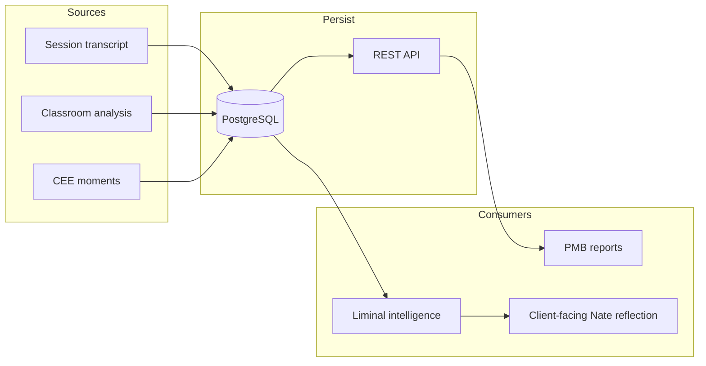

# Addendum: Lived Wisdom Persistence and Liminal Intelligence

This addendum should be merged into the existing plan at [.cursor/plans/classroom_phd_assessment_and_lived_wisdom_ff0eaa2a.plan.md](.cursor/plans/classroom_phd_assessment_and_lived_wisdom_ff0eaa2a.plan.md) as a new subsection under **Part 1 (Gaps)** and a new **Phase** in **Part 3** and **Part 4**.

---

## 1. New gap (add to "Gaps today" in Part 1)

- **Lived wisdom not durable:** Session-derived wisdom (transcript, analysis, CEE moments, coach–client dynamics) is stored only in file-based `classroom_sessions.json` and `classroom_insights/{client_id}.json`. This can be lost and is not queryable at scale. Little Nate’s learned history from these sessions is not explicitly persisted in PostgreSQL or exposed via REST, so it is not guaranteed to survive restarts or to feed PMB reports and liminal intelligence pipelines.

---

## 2. New requirement (add to Part 2 — Target Architecture)

**Lived wisdom and learned history**

- Client–coach session content and analysis must be **saved via PostgreSQL and REST** so that:
  - Important and intimate session details are not lost.
  - CEEs (Coherent Emotional Engagement moments) in sessions can be **assessed and considered** by Little Nate for **PMB reports** and similar data captures (e.g. reconsolidation readiness, legacy patterns, crisis perception).
  - Little Nate can use this history as part of his **liminal intelligence** — learning how to conduct or support sessions (and reflect with clients) **outside of the coach**, in line with his guidelines.
- **Client does not get a notification** when a transcript is archived. Little Nate uses the archived transcript and learned history to **navigate the client through the coach's goals and between live sessions**; the client experiences this only through conversation with Nate.

---

## 3. New phase (add to Part 3 — Implementation Plan)

### Phase A0 (before or alongside A1) — Lived Wisdom in PostgreSQL and REST

**A0.1. PostgreSQL-backed storage for classroom-derived wisdom**

- Introduce or extend **PostgreSQL** storage so that session transcript metadata, analysis results, and CEE-relevant signals from client–coach sessions are stored in the database, not only in `classroom_sessions.json` / `classroom_insights/`.
- **Options (choose one or hybrid):**
  - **Option A:** New table(s), e.g. `classroom_session_analyses` (session_id, coach_id, client_id, status, transcript_summary, metrics JSONB, cee_signals JSONB, selected_dojos, assessments JSONB, final_assessment_doc_id, completed_at, created_at, updated_at) and optionally `classroom_cee_events` (session_id, user_id, event_type, payload JSONB, created_at) for CEE moments extracted from sessions.
  - **Option B:** Extend existing `coaching_sessions` (or related) with columns or JSONB for analysis_result, cee_summary, and link to a separate `classroom_assessments` table for DOJO/PhD assessment state.
- **Canonical source:** PostgreSQL is the source of truth for “lived wisdom” and learned history; JSON files become cache/backup or are deprecated for this data. Archive and analysis pipeline (e.g. [sessions.py](backend/app/routers/sessions.py) `archive_zoom_transcript`, [classroom_analyzer.py](backend/app/services/classroom_analyzer.py)) must **write to PG** (and optionally still write JSON for backward compatibility during transition).

**A0.2. REST API for learned history**

- Expose **REST** endpoints (or extend existing) so that:
  - Coach/backend can **read** session analyses and CEE-related data by session_id, client_id, or coach_id (with auth).
  - Internal services (PMB pipeline, liminal intelligence, INSIGHTS context) can query this data without relying on file I/O.
- Example: `GET /api/coach/classroom/sessions` or `GET /api/coach/classroom/analyses?client_id=...` returning records from the new PG table(s), plus optional `GET /api/coach/classroom/cee-events?session_id=...` for CEE signals.

**A0.3. CEE and PMB integration**

- **CEE:** Where session transcripts or analyses contain detectable CEE moments (e.g. emotional peaks, coherence cues), **persist** them in PG (e.g. `classroom_cee_events` or a dedicated `nevedal_metrics` / coherence-related table for session-derived CEEs) so they can be aggregated with existing CEE data (e.g. [bridge_server.py](backend/app/websocket/bridge_server.py) text-chat CEE writes to `nevedal_metrics`, [nevedal_reports_api.py](backend/app/routers/nevedal_reports_api.py) CEE moments).
- **PMB:** Ensure session-derived insights (reconsolidation readiness, legacy patterns, crisis perception) can be **ingested or linked** to the PMB pipeline (e.g. [bridge_server.py](backend/app/websocket/bridge_server.py) `_compute_pmb`, `pmb` in profile_data / Night School) so Little Nate’s assessment of coach–client sessions **feeds** PMB reports and similar data captures.

**A0.4. Liminal intelligence and guidelines**

- Stored session wisdom is used so Nate can support the client **between live sessions** and align with the coach's goals, without the client receiving a separate notification about archiving or assessment. Coach notification when client engages with session takeaways: see main plan Phase C / E.
- **Document in product/eng:** Little Nate’s use of this stored session wisdom is part of his **liminal intelligence** — he learns from coach–client sessions (CEEs, techniques, client reactions) to better support clients **outside of the coach** (e.g. in client chat, reflection without contradiction). Guidelines should state that:
  - Lived wisdom from sessions is retained in PostgreSQL and used for PMB and coherence products.
  - Nate may use this history to inform tone, reconsolidation readiness, and “reflection with the client” behavior, without contradicting the coach.
- **Implementation:** Ensure client-facing Nate context (e.g. `get_client_context_for_nate`, INSIGHTS brief context) can **read** from the new PG-backed learned history and CEE/PMB data, so Nate’s behavior is informed by past session outcomes and coach suggestions.

---

## 4. Order of work (add to Part 4)

Insert after item 1 (fix bridge `classroom_get_sessions`) and before or alongside item 2 (extend analysis model):

- **1b. Lived wisdom persistence:** Design and add PostgreSQL table(s) for classroom session analyses (and optional CEE events). Update archive/analysis pipeline to write to PG; add or extend REST endpoints for read access. Wire CEE/PMB ingestion from session-derived data. Document liminal intelligence use of this data.

Then keep the rest of the order (2–8) as is, with the understanding that “extend analysis model” (item 2) should use the **PG schema** from 1b as the canonical store, and any JSON can mirror or be phased out.

---

## 5. Files to touch (reference)

| Purpose                 | File(s)                                                                                                                                                                                       |
| ----------------------- | --------------------------------------------------------------------------------------------------------------------------------------------------------------------------------------------- |
| Archive → PG write      | [backend/app/routers/sessions.py](backend/app/routers/sessions.py) `archive_zoom_transcript`; [backend/app/services/classroom_analyzer.py](backend/app/services/classroom_analyzer.py)        |
| PG schema               | New migration (e.g. `100_classroom_lived_wisdom.sql` or similar)                                                                                                                              |
| REST read               | New or extended router under [backend/app/routers/](backend/app/routers/) (e.g. coach or classroom API)                                                                                       |
| CEE/PMB read/write      | [backend/app/websocket/bridge_server.py](backend/app/websocket/bridge_server.py); [backend/app/routers/nevedal_reports_api.py](backend/app/routers/nevedal_reports_api.py); PMB/compute paths |
| Client/INSIGHTS context | [backend/app/services/classroom_analyzer.py](backend/app/services/classroom_analyzer.py) `get_client_context_for_nate`; coach INSIGHTS context builder                                        |

---

## Summary

- **Add to existing plan:** (1) a gap about lived wisdom not being durable in PG/REST; (2) a target that session wisdom is stored in PostgreSQL and REST and feeds CEE/PMB and liminal intelligence; (3) Phase A0 (PG storage, REST, CEE/PMB integration, liminal intelligence guidelines); (4) step 1b in the order of work; (5) the file reference table above.
- **Outcome:** Client–coach interaction data and Little Nate’s learned history are not lost; they are captured in PostgreSQL and REST and used for PMB reports and for Nate’s liminal intelligence so he can assess CEEs and support clients outside of the coach.

