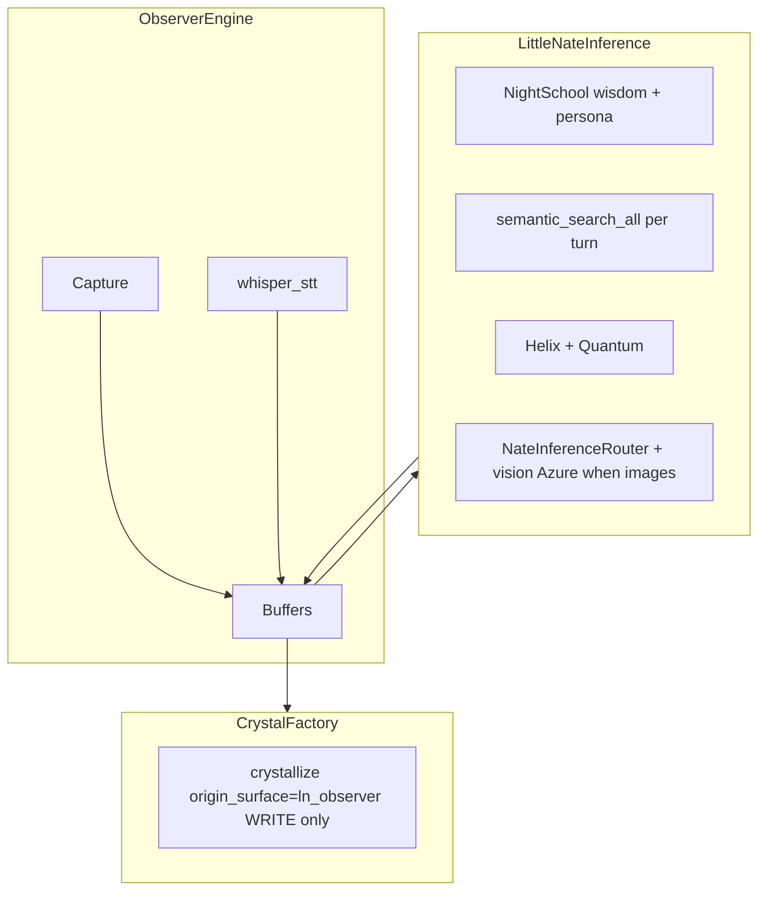

# LN-Observer Integration Plan (Clinical-AGI-class target)

## Honest verdict

| Layer | Status |
|---|---|
| Memory in/out (activation briefing + crystallize + validator) | **In plan (Gap 5)** |
| Infrastructure (PG hydrate, ws_ticket, 90s grace + sweep, auth-gated boot) | **In plan** |
| Same mind as session LN (inference + wisdom + live recall + cross-client recall) | **In plan (Gaps 2–4, 7)** |
| Admin approval gate + accountability log | **In plan (Gap 6)** |
| Phase 2 (bulk transcript → Night School, trust auditor) | **Explicitly deferred** |

Observer must not be a clinically competent observer-with-a-diary. It must be **the same entity** that runs client sessions.

---

## Core principle: one brain, many senses

**Forbidden in v1:**

- `_ln_vision_call()` or any Observer-local Azure chat wrapper
- Package `LN_SYSTEM` + SkyEye accuracy rules stapled on as a stand-in identity
- `recall_crystals_for_context(..., source="ln_observer")` on the **read** path (see gap 1)

**Required:**

- All coach chat, `look_now`, and closing synthesis → [`littlenate_inference.generate()`](backend/app/services/littlenate_inference.py)
- Observer engine → capture, transcribe, buffer frames, assemble turns, call inference, crystallize



---

## Gap fixes (mandatory v1)

### Gap 1 — Recall filter bug (silent memory break)

**Bug as previously specced:** activation recall with `source="ln_observer"` on read.

In [`recall_crystals_for_context()`](backend/app/websocket/crystal_recall_bridge.py), `source` tags **recall telemetry** (`crystal_recall_log`), not crystal birth surface — but any implementation that filters recalled crystals by `origin_surface='ln_observer'` would:

- Return **empty on every coach’s first session** until Observer bootstraps its own crystals
- **Wall Observer off** from ~138K general crystals, client insights, and coaching knowledge

**Rule:**

| Side | `source` / `origin_surface` |
|---|---|
| **Read** (recall, semantic search) | **Never** filter by `ln_observer`. Query the **full** crystal field (user + global Vectorize indices) keyed on semantic query text. |
| **Write** (crystallize) | `origin_surface="ln_observer"` only — tags new crystals born from Observer sessions. |

Remove activation `recall_crystals_for_context(..., source="ln_observer")` from the spec. Per-turn recall uses `littlenate_inference._retrieve_crystals()` → `semantic_search_all()` with **no origin filter**.

### Gap 2 — Per-turn topical recall (LN thinking live)

A static activation bundle cannot surface attachment crystals when the video turns to attachment repair twenty minutes in.

**Two memory layers:**

| Layer | When | Content |
|---|---|---|
| **WHAT YOU ALREADY KNOW** | Activation + prepended each full turn | Coach profile text + last 3–5 `ln_summary` excerpts (relationship continuity) |
| **RELEVANT MEMORY** | **Each coach chat turn** (not lean observe passes) | Top ~8 crystals from `semantic_search_all(recall_query, coach_user_id, top_k=8)` |

**Build `recall_query` every full turn:**

```
coach_message
+ last ~10 transcript lines (deduped)
+ LN's latest unprompted frame observation (if any)
+ assigned client names/usernames (from coach roster — see Gap 7)
+ capitalized proper nouns extracted from transcript window
```

**Cross-client crystal recall (Gap 7):** `user_id` on inference is the **coach** — Vectorize user filter will not surface **client-scoped** crystals unless we search under client IDs too.

- Extend `generate()` with optional `recall_also_user_ids: Optional[List[str]] = None` (default `None` = unchanged).
- Observer builds list: up to **3** assigned client usernames whose **name or username** appears in the current `recall_query` text (case-insensitive).
- For each extra ID: run `semantic_search_all(recall_query, client_username, top_k=4)`; merge + dedupe by content_hash; cap merged RELEVANT MEMORY at **8** total.
- Global crystals still arrive via coach's primary search + wisdom indices — no origin filter.

Inject results as a per-turn **`RELEVANT MEMORY`** block (same slot as inference’s `[RELEVANT WISDOM]` enrichment — Observer spec uses this label for acceptance tests).

**Activation semantic query (if any prefetch):** never empty — compose from coach profile themes (specialties, assigned clients, tier) + keywords from prior `ln_summary` lines. Empty semantic search returns noise.

**Lean unprompted observe:** frame + short transcript only; `include_crystals=False`, `include_helix=False`, `max_tokens=120`, debounce 20s.

### Gap 3 — Night School wisdom + canonical persona

Clinical-AGI-class includes the **wisdom corpus** (modality depth, lived-wisdom entries, trained voice) — not just crystals.

Bridge chat loads this via [`NightSchool.load_wisdom()`](backend/app/websocket/bridge_server.py) (`little_nate_wisdom.json`). `littlenate_inference` today enriches via Vectorize crystals + helix + quantum — **not** the full wisdom file on every turn.

**Implementation (path A — required):**

1. Extend `littlenate_inference.generate()` (additive, ≤50 lines/commit, `# QUANTUM-CRYSTAL-ARCH`):
   - **`attach_wisdom: bool = False`** — Observer passes `attach_wisdom=True`; all other callers unchanged (bridge already loads wisdom into its own prompts — default `False` prevents double corpus + voice distortion on live client chat).
   - When `attach_wisdom=True`: load **fixed-token core persona block** (~**1,800 tokens**, ~1.5–2K char budget at ~4 chars/token) from `little_nate_wisdom.json` — priority-ordered excerpt (persona + modality spine), **not** the whole file. Deep entries come from per-turn semantic recall, not the standing block.
   - New params (`images`, `recall_query`, `recall_top_k`, `recall_also_user_ids`, `mode`) must **default to exact current behavior** — existing callers bit-identical without new kwargs.
2. Add optional `images: List[str]` → [`nate_inference_router`](backend/app/services/nate_inference_router.py) Azure multimodal user message; force vision-capable Azure when images present.
3. **No** Observer-local system prompt assembly.

Path B (pragmatic duplicate identity) is **not** acceptable for Clinical-AGI-class acceptance.

### Execution hazard — highest-risk commit (`littlenate_inference`)

| Hazard | Mitigation |
|---|---|
| (a) Bridge + inference both attach wisdom → double corpus, token bloat, voice drift | `attach_wisdom=False` default; Observer only sets `True`; verify bridge path does not also set it |
| (b) New kwargs change behavior for voice / client / background agents | All new params optional with defaults matching today; **regression smoke before Observer deploy** |

**Regression smoke (deploy step 0, before Observer acceptance tests):**

- One **client chat** turn through untouched bridge path (same tone length, no duplicate wisdom markers in logs).
- One **voice** turn through untouched voice/inference path (latency + response shape unchanged).
- Compare before/after deploy on staging; abort if non-Observer surfaces shift.

### Gap 4 — Learning beyond one crystal per session

Keep close-summary crystallize. **Also** crystallize:

| Trigger | Heuristic |
|---|---|
| `look_now` exchange | Always (coach asked for depth on frame) |
| Substantive coach↔LN chat | LN reply length ≥ ~200 chars **and** coach sends a follow-up within 2 min |
| Session close | `ln_summary` via closing synthesis |

All via [`crystallize_from_conversation(..., origin_surface="ln_observer")`](backend/app/websocket/crystal_recall_bridge.py) — same factory, Vectorize index, co-activation graph as live chat.

Phase 2 only: bulk `ln_observer_transcripts` → Night School replay (see Phase 2 section).

### Gap 5 — Validator gate before crystallize (mandatory v1)

[`crystallize_from_conversation()`](backend/app/websocket/crystal_recall_bridge.py) does **not** run `NateResponseValidator` today (unlike [`nate_memory_crystallizer`](backend/app/services/nate_memory_crystallizer.py)). Observer insights must not bypass the crystal integrity rules.

**Rule:** Before any Observer crystallize INSERT, run the same gate as the crystallizer:

```python
validator = app.state.nate_response_validator  # or instantiate NateResponseValidator()
_, warnings = await validator.validate(crystal_text, {})
if validator.is_high_severity(warnings):
    log + skip insert  # no crystal, no Vectorize index
```

Implement in **`ln_observer_engine._crystallize_safe()`** wrapper (keeps bridge protected file untouched) OR additive ≤15 lines in `crystallize_from_conversation` behind `origin_surface == "ln_observer"` only.

Also block Layer-8 patterns in **closing `ln_summary`** before persisting to `ln_observer_sessions.ln_summary` (same validator; truncate/skip summary row if high severity — session still closes).

### Gap 6 — Admin approval gate (mandatory v1)

From package [`ln_observer_schema.sql`](/Users/nathannevedal/Downloads/ln_observer_schema.sql) — **not optional**:

| Table | Purpose |
|---|---|
| `ln_observer_approvals` | Coach must be `status='approved'` before activate/WS |
| `ln_observer_activation_log` | Accountability record (ack + IP + UA) |
| `ln_observer_sessions` | Session lifecycle |
| `ln_observer_transcripts` | Ordered event stream |

**Router endpoints** ([`ln_observer_api.py`](backend/app/routers/ln_observer_api.py)):

| Endpoint | Auth | Notes |
|---|---|---|
| `POST /request-access` | `require_coach` | Upsert pending approval |
| `GET /status/{coach_id}` | `require_coach` | `none` / `pending` / `approved` / `revoked` |
| `POST /activate` | `require_coach` | **403** if not approved; writes activation_log + session row |
| `POST /admin/decide` | `require_admin` | `approved` \| `revoked` |
| `GET /admin/approvals` | `require_admin` | List queue |
| `GET /admin/activation-log` | `require_admin` | Audit trail |

**`admin/decide` coach_name fix:** when payload `coach_name` is empty, resolve from PostgreSQL:

```sql
SELECT profile_data->>'name' FROM users WHERE username = $1 OR hardware_id = $1 LIMIT 1
```

Never overwrite stored `coach_name` with empty string.

**Gate enforcement:** `coach_is_approved(coach_id)` on `/activate`, WS connect, and iframe boot (`GET /status` must return `approved` before coach UI loads capture).

Flutter OBSERVER tab: show **Request access** / **Pending** / **Revoked** states when not approved (no silent 403).

### Gap 7 — Cross-client recall (mandatory v1 mitigation)

See recall_query enrichment in Gap 2. Acceptance test 1 must use a crystal scoped to an **assigned client**, not coach-only, to prove cross-user recall works when the client name appears on screen or in coach chat.

---

## Wire 1 — Route through `littlenate_inference`

```python
result = await inference.generate(
    prompt=coach_message,
    user_id=coach_username,
    domain="coaching",
    tier="clinical",
    conversation_context=what_you_already_know + transcript_window + chat_tail,
    recall_query=built_recall_query,  # per-turn; drives semantic_search_all top_k=8
    recall_also_user_ids=matched_client_usernames[:3],  # Gap 7 — optional; default None elsewhere
    images=frame_b64_list[:3],        # 4 on look_now only
    mode="full",
    attach_wisdom=True,              # Observer only — ~1.8K token persona block
    include_crystals=True,
    max_tokens=800,
)
```

Protected files: split inference + router changes across commits ≤50 lines each.

---

## Token budget

| Control | Value |
|---|---|
| Frames on routine chat | 2–3 JPEGs |
| `look_now` | up to 4 |
| Transcript window | ~12 lines |
| Recall `top_k` | ~8 (Observer full mode) |
| Standing wisdom block | ~**1,800 tokens** when `attach_wisdom=True` (Observer only) |
| Chat tail | 12 turns + compaction every ~20 exchanges |

Slightly leaner LN at ~4s beats maximal LN at ~25s.

---

## Session topology (unchanged — solid)

- PG row on `/activate`; lazy `LiveSession` hydrate on WS connect
- `ws_ticket` HMAC + first WS `{type:"auth", token}`
- **90s reconnect grace** — no instant deactivate on blip
- **3h max session** (warn 2:45)
- Azure `content_filter` → user-visible skip, WS stays up

### Reconnecting-session sweep (orphan cleanup)

The 90s timer is **in-process** — worker restart/deploy orphans `status='reconnecting'` rows forever (never summarized, never crystallized, activation log stuck open).

Add a lightweight background sweep (existing scheduled-task pattern in backend, ~5 lines):

```sql
SELECT id FROM ln_observer_sessions
WHERE status = 'reconnecting'
  AND disconnected_at < NOW() - INTERVAL '90 seconds'
```

For each row: run the same `deactivate()` path (close synthesis + crystallize + `ended_at`). Also catches 3h-cap misses when the in-process timer died for the same reason. Run every **60s** (or piggyback on an existing maintenance agent cycle).

---

## Database

[`backend/migrations/266_ln_observer.sql`](backend/migrations/266_ln_observer.sql) — port package schema + plan deltas:

| Table / column | Notes |
|---|---|
| `ln_observer_approvals` | Package table — **required** (Gap 6) |
| `ln_observer_activation_log` | Accountability on every activate |
| `ln_observer_sessions` | + `context_bundle TEXT`, `ws_ticket`, `disconnected_at`, `status` includes **`reconnecting`** |
| `ln_observer_transcripts` | Full session stream (Phase 2 ingestion source) |
| Stats columns (`frames_sent`, …) | Wire from client on `/deactivate` **or** omit until Phase 2 — no dead columns |

Index: `ln_observer_sessions (status, disconnected_at)` for reconnecting sweep.

---

## Backend registration

- [`backend/app/main.py`](backend/app/main.py): `ENABLE_LN_OBSERVER=true` → register `ln_observer_api` router + start reconnecting sweep asyncio task on lifespan (same pattern as other 60s maintenance loops; piggyback on existing agent only if zero new task preferred — **prefer dedicated 60s loop in engine module**).
- Reconnecting sweep + session max-duration check share the same loop body.
- Inject `app.state.littlenate_inference`, `db_pool`, `nate_response_validator` into engine at startup.

**Files to create:**

| File | Role |
|---|---|
| `backend/migrations/266_ln_observer.sql` | Schema |
| `backend/app/services/ln_observer_engine.py` | Capture, inference calls, crystallize wrapper, sweep |
| `backend/app/routers/ln_observer_api.py` | REST + WS |
| `dashboard/ln-observer.html` | Coach standalone |
| `dashboard/ln-observer-admin.html` | Admin approvals + activation log |
| `mobile/lib/ln_observer_iframe_web.dart` | Iframe host |

**Env:** `ENABLE_LN_OBSERVER`, optional `LN_OBSERVER_VISION_DEPLOYMENT` (falls back to `AZURE_OPENAI_CHAT_DEPLOYMENT`).

---

## Coach UI

[`dashboard/ln-observer.html`](dashboard/ln-observer.html):

- Frame diff, chunk-window RMS silence, tab-audio warning, Safari note
- **Switch view:** `getDisplayMedia()` again → **stop MediaRecorder, recreate** against new stream (do not hot-swap tracks on live recorder); same `sessionId` + WS + chat
- **postMessage auth gate:** boot only after `ln_observer_auth`; validate **`e.origin`** against allowlist (`https://coach.sovereignsanctuary.net`, `https://app.sovereignsanctuary.net`, localhost dev) — reject unknown origins
- WS reconnect loop; send stats payload on end if columns exist

Flutter [`ln_observer_iframe_web.dart`](mobile/lib/ln_observer_iframe_web.dart): postMessage with target origin; iframe `allow="display-capture; microphone"`. **UI states:** none → request access; pending → wait message; revoked → contact admin; approved → load iframe.

---

## Acceptance tests (Clinical-AGI-class = yes when all pass)

Run on amended build before calling LN “full” in Observer:

| # | Test | Pass criterion |
|---|---|---|
| 1 | **Crystal-only knowledge (cross-client)** | Use a crystal scoped to an **assigned client** (name in coach chat or transcript). LN surfaces it in RELEVANT MEMORY — not generic LLM filler |
| 2 | **Prior Observer session** | Session N references specific content from session N-1 `ln_summary` in opening coach chat |
| 3 | **Modality / Night School** | Modality question surfaces ~1.8K wisdom block + recall — trained voice, not generic therapy speak |
| 4 | **Write path + Vectorize lag** | **Immediately:** PG row with `origin_surface='ln_observer'`. **Within 5 min (retry):** same crystal recallable in a **client** session via semantic search. If Vectorize slow, PG proof still passes; recall retry documents lag |

**Test 4 protocol:** poll client chat recall every 60s up to 5 attempts; fail only if PG row missing or recall still empty after 5 min.

**Approval gate smoke (v1):** unapproved coach → `403` on activate; admin approve → activate succeeds; revoked → blocked again.

Until all four + approval smoke pass: **clinically competent observer with memory**, not yet **Clinical-AGI-class same mind**.

---

## Deploy sequence

0. **LNI regression smoke** — client chat + voice turn on staging; confirm bit-identical behavior before Observer code ships
1. Migration 266
2. `safe_deploy.sh backend` primary + clone
3. nginx WS upgrade on `/api/ln-observer/ws/*`
4. Flutter + dashboard rsync
5. Four Observer acceptance tests + approval gate smoke + infrastructure smokes (90s reconnect + sweep, Switch view recorder recreate, origin rejection)

---

## Phase 2 (explicit deferral — not v1 blockers)

| Deliverable | Scope |
|---|---|
| **Bulk transcript → Night School** | Nightly or on-deactivate job: chunk `ln_observer_transcripts` → `night_school_director` / warm tier replay; PII scan before ingest |
| **Trust auditor** | New `ln_observer_auditor.py`: REST (activate, status, request-access, admin/*) + WS handshake probe; register in trust_enforcer 5-location sync; baseline key `ln_observer_check_count` |
| **Stats columns** | If omitted in v1 migration, add + wire client payload |
| **Screen PII redaction** | Optional OCR redaction layer — v1 relies on policy (below) |

---

## Operational policy — shared-screen PII (v1)

No automatic redaction in v1. Mitigations:

- Responsibility ack on activate (logged in `ln_observer_activation_log`) warns coach not to display client identifiers unnecessarily
- Transcripts + crystals follow existing **7-year clinical retention** (`IMMUTABLE_TYPES` / db_maintenance exemptions where applicable)
- Validator blocks high-severity factual assertions about real persons from entering crystals (Layer 8)
- Admin activation log provides audit trail for compliance review

---

## Residual gaps (post-amendment)

**v1 now closes:** gaps 1–7, approval gate, validator on write, cross-client recall, Vectorize lag protocol, orphan sweep, LNI regression smoke.

**Still Phase 2 only:**

| Item | Why deferred |
|---|---|
| Bulk transcript → wisdom corpus | Architectural ingest path; v1 learns via summary + validated crystals |
| Trust auditor in baseline | Endpoints must exist first; add after v1 stable on GREEN |
| Automated screen PII redaction | Product/policy layer beyond inference wiring |

**No further structural gaps** for Clinical-AGI-class Observer chat if implementation matches this plan and acceptance + approval smokes pass.

---

## Risk notes

| Risk | Mitigation |
|---|---|
| Sensory island (read filter) | **No origin_surface filter on read**; full Vectorize field |
| Static briefing only | **Per-turn RELEVANT MEMORY** on coach chat |
| Body double identity | **littlenate_inference + wisdom snapshot**; no `_ln_vision_call` |
| One crystal / 90 min | **look_now + substantive exchange** crystallize |
| iframe auth injection | **Origin allowlist** on postMessage |
| Switch view broken audio | **Stop/recreate MediaRecorder** |
| Dead stats columns | Wire on deactivate or defer |
| 4404 / WS blip | PG hydrate + 90s grace |
| Token blowup | Frame cap, top_k=8, lean observe, **~1.8K wisdom cap** |
| LNI change breaks client/voice | **`attach_wisdom=False` default + regression smoke** |
| Orphan `reconnecting` rows | **60s PG sweep → deactivate** |
| Unvalidated crystals | **Gap 5 validator on crystallize + ln_summary** |
| Cross-client recall miss | **Gap 7 `recall_also_user_ids` + test 1** |
| Unapproved coach access | **Gap 6 approval table + UI states** |
| Vectorize lag false fail | **Test 4 PG immediate + 5 min retry** |
