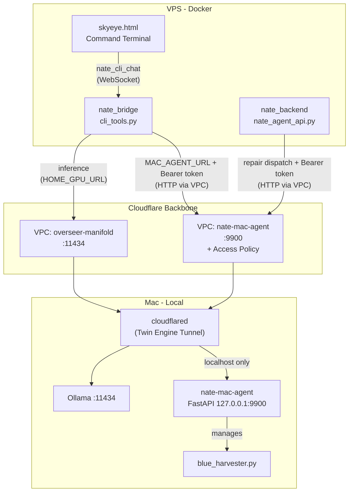
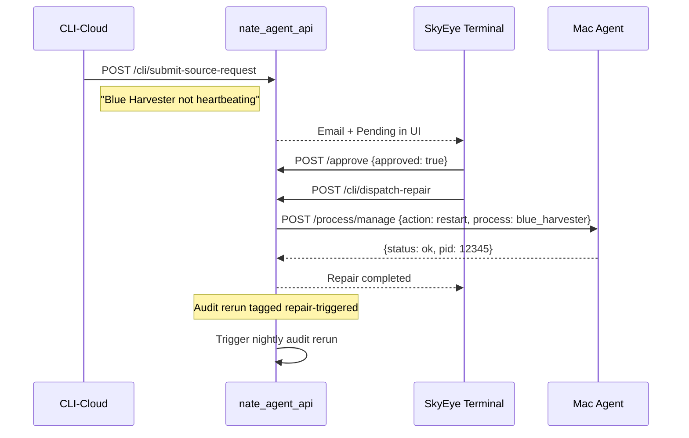

# Mac Agent + CLI-Cloud Repair Architecture

## Problem

CLI-Mac's shell/write/build tools currently execute inside the bridge Docker container on the VPS, not on the actual Mac. The Cloudflare Twin Engine tunnel only exposes Ollama inference (port 11434). There is no path for the bridge to execute commands on the Mac (restart Blue Harvester, run Flutter builds, git operations, etc.). Additionally, the CLI repair API (`cli_router` in `nate_agent_api.py`) is defined but **never mounted** -- all `/api/nate-agent/cli/`* endpoints are unreachable dead code.

## Architecture




**Auth flow note:** The bearer token (`MAC_AGENT_TOKEN`) travels from Bridge/Backend through the Cloudflare backbone (TLS-encrypted) to `cloudflared` on the Mac, which terminates TLS and forwards to `localhost:9900` in plaintext. This is acceptable because the agent binds to `127.0.0.1` only -- it is unreachable from the local network. The agent MUST NOT bind to `0.0.0.0`; doing so would expose an unauthenticated shell execution endpoint on the LAN.

## Three Deliverables

### Deliverable 1: Mac-Side Agent Daemon

A new file [backend/mac_agent/nate_mac_agent.py](backend/mac_agent/nate_mac_agent.py) -- a lightweight FastAPI server that runs on the Mac as a **LaunchAgent** (user-context, not LaunchDaemon), exposed through the Cloudflare tunnel as a second VPC service.

**Why LaunchAgent, not LaunchDaemon:** LaunchDaemons run as root before user login. For a development Mac, the agent needs access to the user's filesystem, SSH keys (`~/.ssh/`), pyenv/homebrew PATH, and git credentials. A LaunchAgent runs as the logged-in user and inherits the full user environment. LaunchDaemon would require explicit user specification and might not inherit PATH, pyenv, or homebrew.

**Capabilities:**

- `POST /exec` -- Execute a shell command with timeout, cwd, command allowlist enforcement
- `POST /file/read` -- Read a file from the local workspace
- `POST /file/write` -- Write/patch a file (str_replace semantics)
- `POST /file/delete` -- Delete a file (with red-zone protection)
- `POST /git` -- Git operations (status, diff, add, commit, push) with branch protection
- `POST /build` -- Flutter build, dart analyze, python lint
- `POST /process/manage` -- Start/stop/restart local processes (Blue Harvester, Ollama, etc.)
- `GET /health` -- Agent health + system info (CPU, memory, disk, running processes)
- `GET /heartbeat` -- Full status for dashboard integration

**Network binding (critical):**

```python
if __name__ == "__main__":
    uvicorn.run(app, host="127.0.0.1", port=int(os.getenv("MAC_AGENT_PORT", "9900")))
```

The agent MUST bind to `127.0.0.1`, never `0.0.0.0`. The Cloudflare tunnel connects to `localhost:9900` -- no other host on the LAN should reach this endpoint.

**Security -- Command Allowlist (not blocklist):**

A blocklist (`rm -rf /`, `sudo`, `shutdown`) is inherently bypassable -- `rm -rf /`* with wildcard, `python3 -c "import os; os.system('shutdown')"`, aliased commands, etc. For a network-accessible shell execution endpoint, an **allowlist of permitted command prefixes** is the correct security posture:

```python
ALLOWED_COMMAND_PREFIXES = [
    "python3", "python",
    "flutter", "dart",
    "git ",
    "ls", "cat", "head", "tail", "wc", "grep", "rg", "find",
    "curl", "wget",
    "docker", "docker-compose",
    "pip", "pip3", "npm", "npx", "node",
    "cd ", "pwd", "echo", "which", "env",
    "xcodebuild", "xcrun",
    "open",  # macOS open command
    "brew",
    "scp", "rsync",
    "pytest", "mypy", "flake8", "black",
]
```

Any command whose first token is not in `ALLOWED_COMMAND_PREFIXES` is rejected with `403 Command not permitted`. This is meaningfully safer than a blocklist.

`**shell=False` enforcement (critical -- closes allowlist bypass):**

The allowlist checks the first token, but piped/chained commands bypass it when `shell=True`: `python3 -c "import os; os.system('rm -rf /')"` passes because the first token is `python3`. Same with `git push; rm -rf /`. The fix is `shell=False` -- commands are passed as a **list** (via `shlex.split()`), which makes pipes, chains, and shell metacharacters syntactically impossible:

```python
import shlex

SHELL_METACHARACTERS = set(";|&$`\\()")

def _validate_command(command: str) -> list[str]:
    """Validate command against allowlist and return parsed token list."""
    # Reject commands containing shell metacharacters
    if any(c in command for c in SHELL_METACHARACTERS):
        raise HTTPException(403, f"Shell metacharacters are not permitted: {command!r}")

    tokens = shlex.split(command)
    if not tokens:
        raise HTTPException(400, "Empty command")

    first_token = os.path.basename(tokens[0])  # handle /usr/bin/python3 -> python3
    if not any(first_token.startswith(prefix.strip()) for prefix in ALLOWED_COMMAND_PREFIXES):
        raise HTTPException(403, f"Command not permitted: {first_token}")

    return tokens  # used with subprocess.run(..., shell=False)
```

Every `subprocess.run()` call uses `shell=False` (the default) with the token list. This makes `; | && || $( )` literal arguments rather than shell operators. A command like `git push; rm -rf /` becomes `["git", "push;", "rm", "-rf", "/"]` which git rejects as an invalid remote name, rather than executing two separate commands.

**Workspace Mutex (concurrent execution guard):**

Nothing prevents two simultaneous `/exec` calls from running conflicting operations (e.g., `git commit` while another does `git reset`, or two concurrent `flutter build`). The agent maintains a per-workspace `asyncio.Lock` so that shell/file/git operations on the same `cwd` serialize:

```python
_workspace_locks: dict[str, asyncio.Lock] = {}

def _get_workspace_lock(cwd: str) -> asyncio.Lock:
    """Get or create an asyncio.Lock for the given workspace directory."""
    canonical = os.path.realpath(cwd)
    if canonical not in _workspace_locks:
        _workspace_locks[canonical] = asyncio.Lock()
    return _workspace_locks[canonical]

@app.post("/exec")
async def exec_command(req: ExecRequest, ...):
    lock = _get_workspace_lock(req.cwd or MAC_AGENT_WORKSPACE)
    async with lock:
        # ... execute command ...
```

All mutating endpoints (`/exec`, `/file/write`, `/file/delete`, `/git`, `/build`) acquire the lock for their workspace before executing. Read-only endpoints (`/file/read`, `/health`, `/heartbeat`) do not acquire the lock. If a second mutating request arrives while the lock is held, it **waits** (not rejected) until the first completes. This prevents corrupted builds, conflicting git states, and partially written files.

**Additional security layers:**

- Bearer token auth (`MAC_AGENT_TOKEN` env var, shared secret with bridge/backend)
- Red-zone path list for file operations (system dirs, `~/.ssh/id_`*, `.env` files with secrets, `/etc/`, `/System/`, `/Library/`)
- All executions logged to local `mac_agent_audit.jsonl` with timestamp, command, caller IP, result code
- Request origin validation (reject requests not from `127.0.0.1` or Cloudflare connector IPs)

**Timeout handling on `/exec` (with partial output capture):**

When a timed-out process is killed via `os.killpg()`, it may leave behind lock files, partially written files, or a half-committed git state. The agent returns not just `"TIMEOUT"` but also the **partial stdout/stderr captured before the kill**, so the caller (LN-FAB or repair dispatch) can assess damage and decide whether cleanup is needed:

```python
class ExecRequest(BaseModel):
    command: str
    cwd: Optional[str] = None
    timeout_seconds: int = 120  # default 2 minutes

EXEC_TIMEOUT_MAX = 600  # hard ceiling: 10 minutes

@app.post("/exec")
async def exec_command(req: ExecRequest, ...):
    tokens = _validate_command(req.command)  # returns list, raises 403 if not allowed
    effective_timeout = min(req.timeout_seconds, EXEC_TIMEOUT_MAX)
    lock = _get_workspace_lock(req.cwd or MAC_AGENT_WORKSPACE)
    async with lock:
        proc = await asyncio.create_subprocess_exec(
            *tokens,
            stdout=asyncio.subprocess.PIPE,
            stderr=asyncio.subprocess.PIPE,
            cwd=req.cwd or MAC_AGENT_WORKSPACE,
            start_new_session=True,  # creates process group for killpg
        )
        try:
            stdout, stderr = await asyncio.wait_for(proc.communicate(), timeout=effective_timeout)
            return {"status": "ok", "exit_code": proc.returncode,
                    "stdout": stdout.decode(errors="replace"),
                    "stderr": stderr.decode(errors="replace")}
        except asyncio.TimeoutError:
            os.killpg(os.getpgid(proc.pid), signal.SIGKILL)
            # Drain whatever output was captured before the kill
            partial_stdout = b""
            partial_stderr = b""
            try:
                partial_stdout, partial_stderr = await asyncio.wait_for(proc.communicate(), timeout=5)
            except Exception:
                pass
            return {
                "status": "error",
                "error": f"Command timed out after {effective_timeout}s",
                "error_code": "TIMEOUT",
                "partial_stdout": partial_stdout.decode(errors="replace"),
                "partial_stderr": partial_stderr.decode(errors="replace"),
                "warning": "Process was killed. Check for lock files, partial writes, or uncommitted git state.",
            }
```

- Default timeout: **120 seconds** (sufficient for most operations)
- Hard maximum: **600 seconds** (10 minutes, for Flutter builds or large git operations)
- The caller can request any timeout up to the max; values above 600s are clamped
- On timeout, the agent kills the subprocess via `os.killpg()` (process group) and returns a structured error **with partial stdout/stderr** so the caller can assess cleanup needs
- The `warning` field alerts the caller to check for residual state (lock files, partial writes, half-committed git)

**Process Management with Watchdog:**

```python
MANAGED_PROCESSES = {
    "blue_harvester": {
        "command": "python3 backend/blue_harvester.py",
        "cwd": "/Users/nathannevedal/Desktop/Clinical-Sovereignty-Lab-2",
        "restart_policy": "on-failure",  # "on-failure" | "manual"
        "health_check_interval_s": 300,  # 5 minutes
        "health_check": lambda: _check_heartbeat_freshness("data/blue_harvester_heartbeat.json", max_age_s=600),
        "max_auto_restarts": 3,          # give up after 3 consecutive failures
        "cooldown_s": 60,                # wait 1 minute between restart attempts
    },
}
```

**Watchdog coroutine:** The agent runs a background `asyncio` task that periodically checks each managed process with `restart_policy: "on-failure"`:

1. Every `health_check_interval_s` seconds, call `health_check()`
2. If unhealthy and process is not running, restart it (up to `max_auto_restarts` consecutive times)
3. After `max_auto_restarts` failures, stop trying and log `"blue_harvester: auto-restart exhausted, manual intervention needed"` as a WARNING to both local audit log and a Redis key (`crystal_system_status:blue_harvester_watchdog`)
4. Reset the consecutive failure count on any successful health check

Processes with `restart_policy: "manual"` are never auto-restarted -- they can only be started/stopped/restarted via `POST /process/manage`.

`**cloudflared` as a managed process:**

The `cloudflared` tunnel daemon is critical infrastructure. If it crashes, the Mac agent becomes unreachable from the cloud, and the watchdog runs locally but the bridge can't observe it. `cloudflared` should be a managed process in the watchdog:

```python
MANAGED_PROCESSES = {
    "blue_harvester": { ... },
    "cloudflared": {
        "command": "/opt/homebrew/bin/cloudflared tunnel run",
        "cwd": "/",
        "restart_policy": "on-failure",
        "health_check_interval_s": 120,
        "health_check": lambda: _check_process_running("cloudflared"),
        "max_auto_restarts": 5,
        "cooldown_s": 30,
    },
}
```

If the agent detects `cloudflared` is not running (process check fails), it restarts it. The tunnel auto-reconnects to Cloudflare on restart.

**Local health file (tunnel-down resilience):**

When `cloudflared` crashes, the cloud can't reach the agent to check its status. The agent writes a local health file every 60 seconds so that when the tunnel comes back, the bridge can immediately distinguish "agent was healthy the whole time, just unreachable" from "agent just restarted":

```python
ALIVE_FILE = os.path.join(MAC_AGENT_WORKSPACE, "data", "mac_agent_alive.json")

async def _write_alive_file():
    """Write local health file every 60s for tunnel-down resilience."""
    while True:
        payload = {
            "agent": "nate-mac-agent",
            "status": "ok",
            "uptime_s": time.time() - _start_time,
            "timestamp": datetime.utcnow().isoformat(),
            "managed_processes": {name: _get_process_status(name) for name in MANAGED_PROCESSES},
            "tunnel_healthy": _check_process_running("cloudflared"),
        }
        async with aiofiles.open(ALIVE_FILE, "w") as f:
            await f.write(json.dumps(payload))
        await asyncio.sleep(60)
```

The bridge's health check on reconnect can read this file (via `POST /file/read` or `GET /health` which includes `alive_file_age_s`) to verify continuity.

**Tunnel Exposure:**

- Add a second VPC service in Cloudflare dashboard: `nate-mac-agent` on `localhost:9900`
- Or add a second `ingress` rule to the existing tunnel config for `localhost:9900`
- The bridge/backend reaches it via `MAC_AGENT_URL` env var (VPC service hostname)

### Deliverable 2: Bridge CLI-Mac Tool Routing

Modify [backend/app/websocket/cli_tools.py](backend/app/websocket/cli_tools.py) so that when `cli_type == "mac"` and the tool is a write/shell/build/git/process tool, execution is **forwarded to the Mac agent** via HTTP instead of running locally in the container.

**Key change in `execute_tool()`:**

Current flow:

```
CLI-Mac tool call -> _shell_sync() runs inside Docker container -> returns result
```

New flow:

```
CLI-Mac tool call -> POST MAC_AGENT_URL/exec -> Mac agent runs on actual Mac -> returns result
```

Tools that route to Mac agent:

- `shell` -> `POST /exec`
- `write_file`, `str_replace`, `delete_file` -> `POST /file/write`, `/file/delete`
- `read_file` (when `cli_type == "mac"`) -> `POST /file/read` (reads Mac filesystem, not container)
- `build_flutter`, `build_check` -> `POST /build`
- `git_commit`, `git_push` -> `POST /git`
- `ssh_deploy` -> `POST /exec` (scp command routed through Mac's SSH keys)
- `process_manage` -> `POST /process/manage` (start/stop/restart Blue Harvester, Ollama, etc.)

Tools that stay on the bridge (even for CLI-Mac):

- `search_code` (searches the deployed codebase on the VPS)
- Data query tools (`query_sessions`, etc.) -- always cloud-only

**Bridge HTTP client timeout (critical):**

The bridge's HTTP client to the Mac agent must use a timeout that **matches or exceeds** the agent's maximum execution timeout. If the bridge has a shorter timeout than a Flutter build takes, the bridge returns a false "agent unreachable" error while the build is still running on the Mac.

```python
MAC_AGENT_HTTP_TIMEOUT = 660  # 600s agent max + 60s buffer for network/startup overhead

async def _forward_to_mac_agent(endpoint: str, payload: dict) -> dict:
    url = f"{_MAC_AGENT_URL}{endpoint}"
    async with aiohttp.ClientSession(timeout=aiohttp.ClientTimeout(total=MAC_AGENT_HTTP_TIMEOUT)) as session:
        async with session.post(url, json=payload, headers={"Authorization": f"Bearer {_MAC_AGENT_TOKEN}"}) as resp:
            return await resp.json()
```

The 660s timeout = 600s (agent hard max) + 60s (network/startup buffer). This ensures the bridge never times out before the agent does.

**Health check integration:**

- On Command Terminal load, bridge pings `MAC_AGENT_URL/health`
- Status shown in the Command Terminal UI (green dot = connected, red = offline)
- If Mac agent is unreachable, CLI-Mac write/shell tools return a structured error: `"Mac agent is offline. Start it locally or switch to CLI-Cloud."`

### Deliverable 3: CLI-Cloud Repairs CLI-Mac

Wire the existing repair governance API to dispatch approved repairs to the Mac agent.

**Step 1 -- Mount `cli_router`:**
Add `router.include_router(cli_router)` at the bottom of [backend/app/routers/nate_agent_api.py](backend/app/routers/nate_agent_api.py) to make all `/api/nate-agent/cli/`* endpoints reachable. Currently they are dead code.

**Step 2 -- Repair dispatch endpoint:**
Add `POST /api/nate-agent/cli/dispatch-repair` to the backend:

1. **Authorization:** Requires `require_admin`. Any admin can dispatch an approved repair. (For multi-admin scenarios like the Elates pilot, consider a four-eyes gate where the dispatching admin must be different from the approving admin -- deferred to a rule, not enforced in v1.)
2. Validates the `source_repair_request` is in `approved` status
3. Checks `executor_cli == "cli-mac"`
4. **Multi-step sequential execution:** The repair plan contains an ordered list of operations. The dispatch endpoint executes them sequentially via the Mac agent, **failing fast** on any error:

```python
step_results = []
for i, step in enumerate(repair_plan["operations"]):
    endpoint = _REPAIR_OP_TO_AGENT_ENDPOINT[step["type"]]  # e.g., "shell" -> "/exec", "restart" -> "/process/manage"
    result = await _forward_to_mac_agent(endpoint, step["payload"])
    step_results.append({"step": i + 1, "type": step["type"], "result": result})
    if result.get("status") == "error":
        # Mark request as execution_failed, return ALL step results (including partial failure)
        # so the admin knows what was done before the failure and can manually reverse if needed
        break
```

The response **always includes `step_results`** even on partial failure. This is the rollback information -- since v1 does not auto-rollback, the admin uses `step_results` to see exactly which steps succeeded (and what state they changed) before the failure:

```python
return {
    "status": "completed" if all_succeeded else "execution_failed",
    "steps_total": len(repair_plan["operations"]),
    "steps_completed": len([s for s in step_results if s["result"].get("status") == "ok"]),
    "step_results": step_results,  # always returned, even on partial failure
    "failed_at_step": failed_step_index,  # None if all succeeded
    "note": "No auto-rollback in v1. Review step_results to assess cleanup needs." if not all_succeeded else None,
}
```

1. Updates `source_repair_requests.status` to `executing` -> `completed` or `execution_failed`
2. Triggers nightly audit rerun if `NIGHTLY_AUDIT_RERUN_ON_CLI_REPAIR` is set, **with loop guard:**

```python
async def _trigger_nightly_audit_rerun(app, source_request_id, scope, target, triggered_by="admin"):
    if triggered_by == "repair-triggered":
        return  # prevent infinite repair -> audit -> repair loop
    # ...existing logic...
    # Tag the rerun as "repair-triggered" so any auto-proposed repairs from it
    # are NOT auto-approved and require explicit admin approval
```

Audit reruns triggered by a repair dispatch are tagged as `"repair-triggered"`. Any repair proposals generated by such reruns require explicit admin approval regardless of `autonomous` flag -- this prevents an infinite loop where a repair triggers an audit, which proposes a new repair, which triggers another audit.

**Step 3 -- Command Terminal UI for repair dispatch:**
In [dashboard/skyeye.html](dashboard/skyeye.html), add a "Dispatch to Mac" button on approved CLI-Mac repairs in the Pending sub-tab. This calls `POST /api/nate-agent/cli/dispatch-repair` and shows real-time execution status.

**CLI-Cloud diagnostic flow:**




## Files to Create

- `backend/mac_agent/nate_mac_agent.py` -- Mac-side agent FastAPI server (~600 lines, includes shell=False enforcement, workspace mutex, partial timeout output, cloudflared watchdog, alive file writer)
- `backend/mac_agent/requirements.txt` -- fastapi, uvicorn, psutil, aiofiles
- `backend/mac_agent/install.sh` -- LaunchAgent install script that handles **both fresh install AND upgrade** (unload existing, copy new, reload):

```bash
#!/bin/bash
PLIST_LABEL="net.sovereignsanctuary.nate-mac-agent"
PLIST_PATH="$HOME/Library/LaunchAgents/${PLIST_LABEL}.plist"

# Upgrade path: unload if already installed
if launchctl list | grep -q "$PLIST_LABEL"; then
    echo "Upgrading: unloading existing agent..."
    launchctl unload "$PLIST_PATH" 2>/dev/null
    sleep 2
fi

# Install/overwrite plist
cp nate-mac-agent.plist "$PLIST_PATH"
chmod 644 "$PLIST_PATH"

# Install/upgrade dependencies
pip3 install -r requirements.txt --upgrade

# Load (start)
launchctl load "$PLIST_PATH"
echo "Agent loaded. Verify: launchctl list | grep $PLIST_LABEL"
```

- `backend/mac_agent/test_mac_agent.py` -- Smoke tests: valid/invalid tokens, red-zone paths, allowlist enforcement, shell metacharacter rejection, workspace mutex serialization, timeout with partial output, concurrent exec queuing
- `backend/mac_agent/README.md` -- Setup, usage, security model docs

## Files to Modify

- [backend/app/routers/nate_agent_api.py](backend/app/routers/nate_agent_api.py) -- Mount `cli_router`, add `dispatch-repair` endpoint with multi-step execution and loop guard
- [backend/app/websocket/cli_tools.py](backend/app/websocket/cli_tools.py) -- Add Mac agent HTTP forwarding in `execute_tool()` with 660s timeout, add `process_manage` to routing table
- [dashboard/skyeye.html](dashboard/skyeye.html) -- Mac agent status indicator, "Dispatch to Mac" button
- `.env.template` -- Add `MAC_AGENT_TOKEN`, `MAC_AGENT_URL`

## Dashboard: Mac Agent Status Card (System 06)

The Crystal Intelligence dashboard has 5 system cards (Hetzner, DigitalOcean, Blue Harvester, Autonomous Controller, Subconscious Engine). The Mac agent is infrastructure that those systems depend on -- if it goes down, Blue Harvester restarts fail and CLI-Mac tool calls fail. Add a **System 06** card for the Mac agent:

- **Title:** `SYSTEM 06 — Mac Agent (Twin Engine)`
- **Metrics:**
  - Agent status (ok / offline / tunnel-down)
  - Uptime
  - Managed processes and their states (Blue Harvester running/stopped, cloudflared running/stopped)
  - Tunnel health (cloudflared process alive)
  - Alive file age (from `mac_agent_alive.json` -- if > 120s, agent may be stale)
  - Last command executed (from heartbeat)
  - Workspace mutex status (idle / locked by command X)
- **Data source:** `GET MAC_AGENT_URL/heartbeat` via the bridge (same auth flow as other Crystal Intelligence cards)
- If the Mac agent is unreachable, the card shows "OFFLINE" with the last known heartbeat timestamp from `mac_agent_alive.json` (read via the alive file if tunnel was briefly down)

## Env Vars


| Variable              | Where                  | Value                                                     |
| --------------------- | ---------------------- | --------------------------------------------------------- |
| `MAC_AGENT_TOKEN`     | Bridge + Backend + Mac | Shared secret for auth                                    |
| `MAC_AGENT_URL`       | Bridge + Backend       | VPC service hostname (from Cloudflare)                    |
| `MAC_AGENT_PORT`      | Mac only               | `9900` (default)                                          |
| `MAC_AGENT_WORKSPACE` | Mac only               | `/Users/nathannevedal/Desktop/Clinical-Sovereignty-Lab-2` |


## Cloudflare Configuration (Manual)

1. Add a second VPC service in the Cloudflare Zero Trust dashboard:
  - Service name: `nate-mac-agent`
  - Tunnel: Little Nate Twin Engine (`d40e5315-...`)
  - Host: `localhost`
  - Port: `9900`
2. **Add an Access Policy** restricting the `nate-mac-agent` VPC service to the VPS's service token or connector identity only. Without this, any Cloudflare WARP-connected device on the account could reach the agent. The Access Policy should match the VPS connector's identity (service token or tunnel connector ID) and deny all other sources.
3. Or add a second ingress rule to the existing `cloudflared` config on the Mac.

## Verification Checklist

After each step, confirm:

1. **Agent binds localhost only**: `lsof -i :9900` on Mac -> bound to `127.0.0.1:9900`, NOT `*:9900` or `0.0.0.0:9900`
2. **Mac agent running**: `curl http://localhost:9900/health` on Mac -> `{"status": "ok", "agent": "nate-mac-agent"}`
3. **Token auth enforced**: `curl http://localhost:9900/health` (no token) -> `401`; `curl -H "Authorization: Bearer wrong" http://localhost:9900/health` -> `403`
4. **Allowlist enforced**: `curl -H "Authorization: Bearer $TOKEN" -X POST http://localhost:9900/exec -d '{"command": "rm -rf /"}'`  -> `403 Command not permitted`
5. **shell=False enforced**: `curl ... -d '{"command": "ls; rm -rf /"}'` -> `403 Shell metacharacters are not permitted`; `curl ... -d '{"command": "python3 -c \"import os; os.system(\\\"whoami\\\")\""}'`  -> `403` (contains shell metacharacters `(` and `)`)
6. **Workspace mutex**: Fire two concurrent `sleep 5` commands on the same cwd -> second one waits, doesn't run in parallel. Verify both complete sequentially (~10s total, not ~5s)
7. **Timeout with partial output**: `curl ... -d '{"command": "python3 -c \"import time; [print(i) or time.sleep(1) for i in range(100)]\"", "timeout_seconds": 3}'` -> returns `TIMEOUT` with `partial_stdout` containing the first few printed numbers and a `warning` field
8. **Tunnel route working**: From VPS, `curl $MAC_AGENT_URL/health -H "Authorization: Bearer $TOKEN"` -> same healthy response
9. **Alive file exists**: `cat data/mac_agent_alive.json` on Mac -> JSON with `timestamp`, `uptime_s`, `managed_processes`, `tunnel_healthy`
10. **cloudflared watchdog**: `kill $(pgrep cloudflared)` -> within 120s, agent restarts it automatically (check `mac_agent_audit.jsonl` for restart log)
11. **CLI-Mac shell via bridge**: In SkyEye Command Terminal, CLI-Mac mode, type "list files in the root" -> agent executes `ls` on Mac, not in Docker
12. **Blue Harvester restart**: CLI-Mac LN-FAB: "restart blue harvester" -> agent kills old process, starts new one, returns PID
13. `**cli_router` mounted**: `curl http://localhost:8000/api/nate-agent/cli/health` -> `200` (currently 404)
14. **Repair dispatch with partial failure**: Submit a 3-step repair where step 2 fails -> response includes `step_results` for all 3 steps (2 completed, 1 failed), `failed_at_step: 2`, and the `note` about no auto-rollback
15. **Install upgrade path**: Run `install.sh` twice -> second run unloads, copies, reloads without error. Verify via `launchctl list | grep nate-mac-agent`
16. **System 06 dashboard card**: Crystal Intelligence tab shows Mac Agent card with live metrics from `/heartbeat`
17. **Smoke tests pass**: `cd backend/mac_agent && python3 -m pytest test_mac_agent.py -v` -> all green

## Documented v1 Limitations

These are accepted limitations for v1, documented here for future iterations:

1. **No auto-rollback on partial repair failure**: The dispatch returns `step_results` so the admin can manually reverse. Auto-rollback requires inverse operation definitions per step type -- deferred to v2.
2. **Alive file is local only**: When the tunnel is down, the bridge can't read `mac_agent_alive.json` in real-time. It reads it on reconnect via `GET /health` (which includes `alive_file_age_s`). For real-time tunnel-down notification, a future version could push alive status to R2 or a secondary channel.
3. **Workspace mutex is per-process**: If two Mac agents somehow run (shouldn't happen with LaunchAgent), they don't share locks. The `install.sh` upgrade path and single LaunchAgent plist prevent this.

