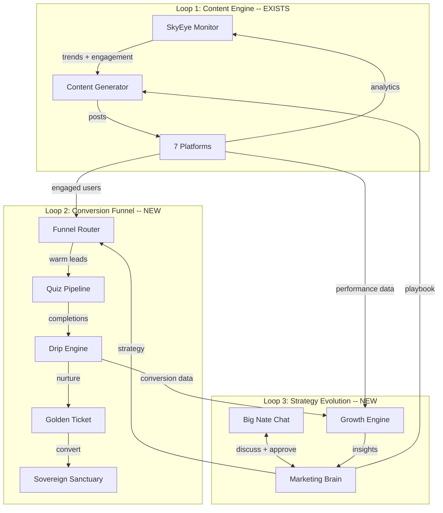

# Marketing Brain Architecture: Little Nate's Autonomous Marketing Intelligence

## Existing Infrastructure (What We're Building On)

The foundation is solid. These systems are already live and deployed:

- **SkyEye Phase 2**: 7 platform adapters, session engine (8-state machine), content generator, inbound monitor, social memory -- all running autonomously every 30 minutes
- **Quiz Pipeline**: 5 quizzes seeded, full CRUD API, insight generation via Azure OpenAI, Golden Ticket auto-issuance after Quiz 5
- **Drip Scheduler**: APScheduler with 5 jobs (pending drips every 5min, SMS fallback, Golden Ticket reminders, expiration, analytics), SendGrid integration, delivery webhooks
- **Big Nate Chat**: REST API at `/api/skyeye/chat`, Azure OpenAI Realtime, conversation history in PostgreSQL
- **Night School**: Learns from DOJO sessions and Classroom analysis, stores wisdom with versioning
- **Marketing Hub UI**: Campaigns, Quiz Builder, Prospects, Insights, Golden Tickets tabs in [dashboard/sovereign-command-admin.html](dashboard/sovereign-command-admin.html)

## The Three Feedback Loops

---

## Architecture Components (6 New/Modified Services)

### 1. Marketing Brain Service (NEW)

**File:** `backend/app/services/marketing_brain.py`

The persistent strategic context that drives all marketing decisions. This is Little Nate's marketing "mind."

**Data Model** -- new table `marketing_playbook`:

- `content_pillars` (JSONB) -- ranked topics with performance scores (e.g., emotional coherence, daily wins, breathing techniques)
- `target_audiences` (JSONB) -- per-platform audience profiles (therapists on LinkedIn, anxiety community on TikTok, parents on Facebook)
- `conversion_funnels` (JSONB) -- active funnels with conversion rates and stage metrics
- `performance_benchmarks` (JSONB) -- per-platform engagement baselines, growth rates
- `competitive_notes` (JSONB) -- observed patterns from wellness/therapy space
- `active_campaigns` (JSONB) -- running campaign summaries with objectives
- `regional_focus` (JSONB) -- geographic expansion targets and progress
- `collaboration_targets` (JSONB) -- high-value connections (coaches, therapists, influencers)
- `last_strategy_review` (TIMESTAMPTZ) -- when the playbook was last analyzed
- `version` (INT) -- playbook versioning for strategy evolution tracking

**Key Methods:**

- `review_playbook()` -- Analyzes all performance data and proposes playbook updates (called weekly by session engine)
- `get_content_strategy(platform)` -- Returns what to post, when, and why based on current playbook
- `get_conversion_strategy(user_context)` -- Determines best funnel path for an engaged user
- `propose_campaign(target_audience, objective)` -- Drafts a new campaign proposal for Big Nate approval
- `evaluate_results(campaign_id)` -- Analyzes campaign performance and proposes adjustments
- `update_regional_intelligence(region, data)` -- Tracks geographic growth patterns

**Integration:** Reads from SkyEye analytics, drip campaign analytics, quiz completion rates, Golden Ticket redemption rates. Writes strategy context into content generator prompts and funnel router decisions.

---

### 2. Social-to-Funnel Router (NEW)

**File:** `backend/app/services/funnel_router.py`

The bridge between social engagement and the quiz/drip pipeline. This is Loop 2's brain.

**Trigger Points** (hooks into existing session engine):

- **Engagement threshold**: When `skyeye_social_memory.interaction_count >= 3` for any user, evaluate for funnel routing
- **Interest signal**: When a comment/reply expresses interest in therapy, coaching, mental health, or self-improvement
- **Direct ask**: When someone asks "how do I sign up?" or "what is this?"
- **Influencer detection**: When monitor flags a high-value connection

**Routing Logic:**

- Score each engaged user: `engagement_score = f(interaction_count, recency, interest_alignment, platform_value)`
- Assign funnel path based on score and detected audience type:
  - **Individuals**: Route to "The Mirror" quiz (self-discovery) via personalized DM or bio link
  - **Coaches/Therapists**: Route to "The Healer's Mirror" quiz (professional assessment) + DOJO showcase
  - **Parents/Families**: Route to "Family Compass" quiz + Family Sanctuary showcase

**New table** `funnel_routing_log`:

- `social_handle`, `platform`, `engagement_score`, `assigned_funnel`, `quiz_url`, `cta_sent_at`, `quiz_started_at`, `quiz_completed_at`, `converted_at`

**CTA Injection** -- Extends [skyeye_content_generator.py](backend/app/services/skyeye_content_generator.py):

- Every 3rd-5th generated post includes a soft CTA
- CTAs rotate: quiz link, bio link, "DM me", story prompt
- Platform-specific CTA formatting (TikTok bio link, Instagram story swipe-up, LinkedIn article CTA)
- A/B test CTA variants and track which convert

---

### 3. Autonomous Quiz Factory (NEW)

**File:** `backend/app/services/quiz_factory.py`

Little Nate can create new quizzes autonomously, targeting specific audiences detected through SkyEye.

**Capabilities:**

- `create_quiz(audience, topic, objective)` -- Uses Azure OpenAI to generate quiz questions, scoring rubric, and insight templates
- `clone_and_adapt(existing_quiz_id, new_audience)` -- Takes an existing quiz and adapts it for a different audience (e.g., "The Mirror" for therapists becomes "The Healer's Mirror")
- `ab_test_quiz(quiz_id, variant_count)` -- Creates question variants for A/B testing
- `analyze_quiz_performance(quiz_id)` -- Completion rate, drop-off points, insight quality scores

**Approval Flow:** All auto-generated quizzes enter `status: 'draft'` and require Big Nate approval via chat before going live. Little Nate proposes: "I created a new quiz called 'The Coach's Compass' targeting licensed therapists. It has 8 questions focused on practice growth and burnout prevention. Want to review it?"

**Integration:** Uses existing [quiz_api.py](backend/app/routers/quiz_api.py) CRUD endpoints. New quizzes are linked to specific campaigns and funnel paths.

---

### 4. Big Nate Chat Command Protocol (MODIFY)

**File:** [backend/app/services/skyeye_chat.py](backend/app/services/skyeye_chat.py) (modify)

Upgrade Big Nate Chat from conversation-only to a strategy war room with two modes.

**Mode 1 -- Strategy Discussion** (existing, enhanced):

- Little Nate now has access to real performance data injected into context
- System prompt enhanced with: current playbook summary, this week's metrics, pending proposals, active campaigns
- Little Nate proactively raises insights: "My TikTok emotional coherence posts are getting 3x engagement vs motivational quotes. I want to shift to 60/40. Thoughts?"

**Mode 2 -- Command Execution** (new):

- **Action Proposals**: Little Nate can propose actions with structured metadata:
  - `[PROPOSAL: launch_campaign]` -- parameters embedded in message
  - `[PROPOSAL: create_quiz]` -- quiz details
  - `[PROPOSAL: shift_content_mix]` -- new ratios
  - `[PROPOSAL: collaboration_outreach]` -- target + pitch
- **Approval Protocol**: Big Nate responds with approval markers:
  - "Approved" / "Go for it" / thumbs up -> execute the proposal
  - "Hold" / "Let me think" -> defer
  - "Modify: [changes]" -> revise and re-propose
  - "Reject" -> cancel with reason logged
- **Direct Commands**: Big Nate can issue commands:
  - "Launch a campaign targeting therapists on LinkedIn"
  - "Create a quiz for parents dealing with teen anxiety"
  - "Pause the TikTok posting for 24 hours"
  - Little Nate parses intent, confirms understanding, then executes

**New table** `marketing_actions`:

- `id`, `proposed_by` (little_nate/big_nate), `action_type`, `parameters` (JSONB), `status` (proposed/approved/executing/completed/rejected), `proposed_at`, `approved_at`, `completed_at`, `result` (JSONB)

---

### 5. Showcase Generator (NEW)

**File:** `backend/app/services/showcase_generator.py`

Generates mock client interaction demos using John and Jane (existing test accounts) to showcase the platform to prospective coaches and professionals.

**Capabilities:**

- `generate_session_showcase(scenario)` -- Creates a narrated walkthrough of a therapy session (chat + voice + metrics)
- `generate_coach_demo(dojo_type)` -- Shows DOJO training, classroom analytics, client management
- `generate_family_showcase()` -- Demonstrates Family Sanctuary with privacy boundaries
- `generate_platform_overview()` -- Full app tour with real (anonymized) interaction data

**Output Formats:**

- HTML slideshow (for embedding in social media / LinkedIn articles)
- Data payload for video generation (same pattern as the TikTok demo video)
- Social media snippets (screenshot-style images for posting)

**Integration:** Little Nate uses these showcases in:

- LinkedIn posts targeting coaches ("Here's what a coaching session looks like on Sovereign Sanctuary")
- TikTok content showing the app in action
- Drip campaign emails with visual demonstrations
- Direct outreach to high-value connections

---

### 6. Autonomous Growth Engine (MODIFY)

**File:** `backend/app/services/skyeye_session_engine.py` (modify) + `backend/app/services/marketing_brain.py`

Add a meta-monitoring layer to the existing session engine.

**New Session Phase: STRATEGIZE** (added between POSTING and RESTING):

- Runs after each session completes
- Queries cross-platform analytics
- Compares against playbook benchmarks
- Identifies: what's working (double down), what's failing (kill/pivot), what's untested (experiment)
- Updates `marketing_playbook` with new learnings
- Generates strategy proposals for Big Nate Chat (if significant enough)

**Growth Metrics Tracked:**

- Followers gained per platform per week
- Engagement rate trends (7-day rolling average)
- Quiz completion funnel: social impression -> CTA click -> quiz start -> quiz complete -> Golden Ticket -> signup
- Drip campaign: open rate, click rate, reply rate, conversion rate
- Regional distribution of new signups
- Coach acquisition pipeline: outreach -> connect -> engage -> demo -> onboard

**Auto-Optimization:**

- Content mix: Automatically shift ratios based on engagement (within guardrails set in playbook)
- Posting schedule: Adjust timing based on when engagement peaks per platform
- CTA rotation: Kill underperforming CTAs, clone high performers
- Drip pacing: Adjust email frequency based on engagement signals

---

## Database Migration: `006_marketing_brain.sql`

New tables:

- `marketing_playbook` -- strategic context (single row, versioned JSONB)
- `funnel_routing_log` -- social-to-quiz conversion tracking
- `marketing_actions` -- command protocol action log
- `content_ab_tests` -- A/B test variants and results
- `growth_snapshots` -- daily/weekly growth metrics for trend analysis

Modifications:

- `skyeye_social_memory` -- add columns: `funnel_stage`, `assigned_quiz_id`, `cta_last_sent`, `conversion_score`
- `skyeye_content_queue` -- add columns: `cta_type`, `cta_target_url`, `ab_test_id`

---

## Implementation Phases

### Phase A: Foundation (Marketing Brain + Funnel Router)

Build the Marketing Brain service with playbook persistence, the funnel router with engagement scoring, and CTA injection into the content generator. This connects Loop 1 to Loop 2.

### Phase B: Command Protocol (Big Nate Chat Upgrade)

Enhance Big Nate Chat with real-time data context, action proposals, approval workflow, and direct command parsing. This enables Loop 3.

### Phase C: Quiz Factory + Showcase Generator

Build autonomous quiz creation and the mock client demo system. This gives Little Nate tools for both prospect conversion and coach recruitment.

### Phase D: Growth Engine + Regional Intelligence

Add the STRATEGIZE phase to the session engine, growth metric tracking, auto-optimization, and regional expansion awareness. This closes all three loops.

---

## Key Files Summary

**New files (6):**

- `backend/migrations/006_marketing_brain.sql`
- `backend/app/services/marketing_brain.py`
- `backend/app/services/funnel_router.py`
- `backend/app/services/quiz_factory.py`
- `backend/app/services/showcase_generator.py`
- `backend/app/routers/marketing_api.py` (new endpoints for playbook, actions, growth)

**Modified files (5):**

- `backend/app/services/skyeye_session_engine.py` -- add STRATEGIZE phase + funnel routing hooks
- `backend/app/services/skyeye_content_generator.py` -- add CTA injection + playbook-driven content strategy
- `backend/app/services/skyeye_chat.py` -- add command protocol + data-enriched context
- `backend/app/main.py` -- wire Marketing Brain startup
- `dashboard/sovereign-command-admin.html` -- add Growth Dashboard tab with funnel visualization

