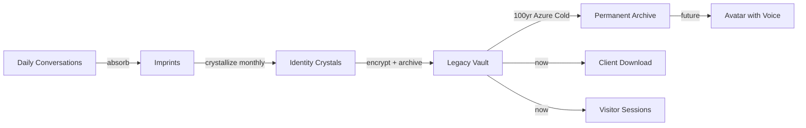

# Me2Me Legacy Memory System: Gap Analysis and Build Plan

## What Me2Me Is (Patent Vision)

Me2Me is a **living legacy system** where a client's conversations, reflections, emotions, and experiences with Little Nate are captured, crystallized, and preserved indefinitely so they can be passed down to loved ones. The pipeline is:

- **Imprints**: Every interaction captured with themes, emotions, c_emo, timestamp, session_id
- **Identity Crystals**: Monthly synthesis of personality, values, language patterns, life themes
- **Legacy Vault**: AES-256-GCM encrypted permanent storage
- **Avatar (future)**: An AI avatar that expresses the client's personality, voice resonance, and emotions to loved ones

## Current State vs Gaps

### What EXISTS (backend built, working):

| Component                    | Status                                 | File                                                  |
| ---------------------------- | -------------------------------------- | ----------------------------------------------------- |
| `ImprintAccumulator`         | Built, absorbs from sessions           | `backend/app/services/me2me/imprint_accumulator.py`   |
| `IdentityCrystallizer`       | Built, synthesizes crystals            | `backend/app/services/me2me/identity_crystallizer.py` |
| `LegacyVaultMe2Me`           | Built, AES-256-GCM encrypted           | `backend/app/services/me2me/legacy_vault_me2me.py`    |
| `AvatarCoreService`          | Built, identity-locked responses       | `backend/app/services/me2me/avatar_core.py`           |
| `Me2MeConsentService`        | Built, 3 consent levels                | `backend/app/services/me2me/me2me_consent.py`         |
| `FamilyFabricService`        | Built, shared family memories          | `backend/app/services/me2me/family_fabric.py`         |
| `TrustManager`               | Built, legal trust + beneficiaries     | `backend/app/services/me2me/trust_manager.py`         |
| `MigrationService`           | Built, organic-to-inorganic transition | `backend/app/services/me2me/migration_service.py`     |
| `IngestionSafetyService`     | Built, PII scanning                    | `backend/app/services/me2me/ingestion_safety.py`      |
| `GrowthEngine`               | Built, post-mortem knowledge layers    | `backend/app/services/me2me/growth_engine.py`         |
| REST API `/api/me2me/`*      | Built, TOP_TIER gated                  | `backend/app/routers/me2me.py`                        |
| DB tables (migration 028)    | Created                                | 11 `me2me`_* tables                                   |
| Azure Cold Tier              | Built, falls back to local             | `backend/app/services/memory/cold.py`                 |
| Memory Search (REST)         | Working                                | `backend/app/routers/client_data_api.py`              |
| SecureSearchScreen (Flutter) | Working                                | `mobile/lib/screens/secure_search_screen.dart`        |

### What is MISSING (gaps):

| Gap                                                | Impact                                                                                                                                                                      | Priority    |
| -------------------------------------------------- | --------------------------------------------------------------------------------------------------------------------------------------------------------------------------- | ----------- |
| **1. Nate cannot recall past sessions**            | Lisa reported Nate can't remember yesterday. `recall(limit=10)` only returns last 10 raw exchanges with no session/date context                                             | P0          |
| **2. Memory Search shows RATE_LIMIT_EXCEEDED**     | WebSocket `memory_search` counts against 120 msg/min bridge limit. Flutter Search tab uses REST (no limit), but the WebSocket handler still exists and can be triggered     | P1          |
| **3. Browse by Story is empty**                    | "Your Story Begins Here" shown because `/api/client/memory/sessions/{hw_id}` either doesn't exist or returns empty on current server                                        | P0          |
| **4. No client download/export of legacy**         | No "Download My Story" or "Export My Legacy" in the Memory or Settings screen                                                                                               | P1          |
| **5. Imprint pipeline not wired to live sessions** | `ImprintAccumulator.absorb()` exists but is not called from the bridge's session flow. Conversations are saved to `memory.json` but NOT fed into the Me2Me imprint pipeline | P0          |
| **6. Identity Crystals never generated**           | `IdentityCrystallizer.synthesize()` exists but no scheduled job calls it monthly                                                                                            | P1          |
| **7. Azure Cold Tier not receiving legacy data**   | `ColdMemoryTier.archive()` exists but is never called with Me2Me vault data. Legacy data stays in PG only                                                                   | P1          |
| **8. No Flutter Me2Me UI**                         | Backend has full REST API but no Flutter screen for Me2Me activation, consent, crystal viewing, or legacy management. Only referenced in onboarding copy                    | P2          |
| **9. `VAULT_ENCRYPTION_KEY` not set**              | Without this env var, vault data is stored in cleartext                                                                                                                     | P1          |
| **10. No avatar encoding pipeline**                | `AvatarCoreService` exists but no pipeline to encode identity crystals into Azure for future avatar synthesis                                                               | P2 (future) |

## Build Plan

### Phase 1: Make Memory Work (P0 - Session-Aware Recall + Story Browsing)

This is already designed in [memory_story_architecture plan](memory_story_architecture_fcdff8a2.plan.md). Implement it:

**1a. Add `recall_by_session()` to MemorySystem** in [bridge_server.py](backend/app/websocket/bridge_server.py)

- Groups `memory.json` entries by `session_id` / date
- Returns last 3 sessions (5 exchanges each) instead of flat last-10
- Updates Nate's prompt label to indicate cross-session awareness

**1b. Verify `/api/client/memory/sessions/{hw_id}` endpoint** in [client_data_api.py](backend/app/routers/client_data_api.py)

- Must return session chapters grouped by `session_id` and date
- Each chapter: `{session_key, date, entry_count, preview, entries[]}`

**1c. Verify Browse by Story tab** works in [secure_search_screen.dart](mobile/lib/screens/secure_search_screen.dart)

- Must call the sessions endpoint and render story chapters
- Fix any auth token mismatch (FlutterSecureStorage `session_token` vs bridge token)

### Phase 2: Wire the Me2Me Imprint Pipeline (P0)

**2a. Feed conversations into ImprintAccumulator** in [bridge_server.py](backend/app/websocket/bridge_server.py)

- After each AI response, call `imprint_accumulator.absorb()` with the exchange, themes, emotions, c_emo
- This wires the existing Me2Me backend into the live session flow
- Requires `ImprintAccumulator` instance on `app.state` (verify in `main.py`)

**2b. Schedule monthly IdentityCrystal synthesis**

- Add a check in `token_usage_agent.py` or create a new `me2me_crystal_agent.py` that runs monthly
- Calls `IdentityCrystallizer.synthesize()` for each client with enough imprints
- Stores result via `LegacyVaultMe2Me.store_crystal()`

### Phase 3: Azure Cold Storage + Client Download (P1)

**3a. Archive to Azure Cold Tier**

- After each IdentityCrystal is created, call `ColdMemoryTier.archive()` with the encrypted crystal data
- Path pattern: `legacy/{client_hw_id}/crystals/{year}_{month}.json`
- Also archive raw imprints monthly: `legacy/{client_hw_id}/imprints/{year}_{month}.json`
- This ensures 100+ year retention on Azure Blob Cool tier

**3b. Set `VAULT_ENCRYPTION_KEY` in production .env**

- Generate a 256-bit key: `python3 -c "import secrets; print(secrets.token_hex(32))"`
- Add to `.env` and `docker-compose.prod.yml` environment block
- Existing cleartext data will remain readable; new data will be encrypted

**3c. Add "Download My Legacy" to client Settings**

- New endpoint: `GET /api/me2me/export/{hw_id}` returning a JSON bundle of all imprints + crystals + story data
- Flutter: Add "Download My Legacy" button to Settings screen
- Bundle includes: all `memory.json` entries, all imprints, all crystals, story metadata
- Format: JSON (machine-readable for future avatar import) + optional PDF summary

### Phase 4: Me2Me Client UI (P2)

**4a. Me2Me activation screen** in Flutter

- Consent flow (observe / preserve / interact levels)
- Calls `POST /api/me2me/consent`
- Shows current consent status

**4b. Crystal viewer**

- Shows identity crystals (personality, values, life themes) as a visual timeline
- Calls `GET /api/me2me/crystals/{user_id}`

**4c. Legacy management**

- Beneficiary assignment (who gets access after transition)
- Trust setup (legal framework)
- Calls `POST /api/me2me/trust/create` and related endpoints

### Phase 5: Avatar Encoding Foundation (P2 - Future)

**5a. Encode personality into structured format**

- Identity crystals already capture personality, values, language patterns
- Add `voice_signature` from VoiceBiometricExtractor to crystals (pitch, cadence, energy)
- Store emotional resonance patterns from CEE data

**5b. Azure avatar data packaging**

- Archive a "personality manifest" per client: crystals + voice biometrics + emotional patterns
- Path: `legacy/{client_hw_id}/avatar_manifest.json`
- This is the data payload a future avatar renderer will consume

**Note**: The actual avatar rendering (voice synthesis, visual personality expression) is a future build. For now, we host and structure the information so it's ready when the avatar system is built.

## Sovereign Sanctuary's Role

The privacy policy and app must be clear:

- **Sovereign Sanctuary is NOT the "story holder" of a user's life** -- the user owns their legacy
- **Users are responsible for downloading and preserving their own records**
- **Little Nate's memory has a limited operational window** -- the Me2Me Legacy Vault is the permanent store
- **Azure Cold Tier provides 100+ year hosting** -- but users should maintain their own copy
- **The downloadable export is the user's personal archive** -- independent of the platform

## Files to Modify

| File                                               | Changes                                                       |
| -------------------------------------------------- | ------------------------------------------------------------- |
| `backend/app/websocket/bridge_server.py`           | Add `recall_by_session()`, wire `ImprintAccumulator.absorb()` |
| `backend/app/routers/client_data_api.py`           | Verify/fix sessions endpoint                                  |
| `backend/app/routers/me2me.py`                     | Add export endpoint                                           |
| `backend/app/services/me2me/legacy_vault_me2me.py` | Wire Azure cold archive                                       |
| `backend/app/main.py`                              | Verify ImprintAccumulator on app.state                        |
| `mobile/lib/screens/secure_search_screen.dart`     | Fix Browse by Story, add export button                        |
| `mobile/lib/screens/settings_screen.dart`          | Add "Download My Legacy" action                               |
| `dashboard/privacy.html`                           | Clarify user ownership and platform role                      |
| `.env`                                             | Add `VAULT_ENCRYPTION_KEY`                                    |

