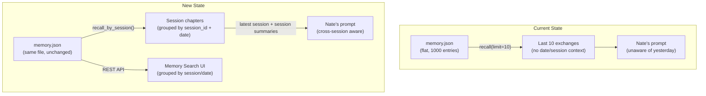

# Memory as Story: Session-Aware Memory Architecture

## The Problem (Exact Root Cause)

`recall(profile, limit=10)` at `bridge_server.py:7035` returns the last 10 raw exchanges as a flat string, with no date or session context. This means:

- If Lisa had 15 exchanges today, yesterday's conversation is invisible to Nate
- All context is stripped — `session_id` and `timestamp` exist in `memory.json` but are never surfaced to Nate
- Memory Search shows flat undifferentiated results with no session grouping

## Me2Me Architecture Alignment

The Me2Me system treats memory as **Imprints → Crystals → Story**:

- `ImprintAccumulator`: absorbs every interaction with source, themes, emotions, c_emo, timestamp
- `IdentityCrystallizer`: synthesizes imprints monthly into an `IdentityCrystal` (personality, language, values, life_themes)
- `LegacyVaultMe2Me`: stores everything encrypted, permanently, indexed by session

The `MemorySystem` in `bridge_server.py` already stores `session_id` + `timestamp` in every `memory.json` entry (line 7575-7579). The data is there — it just isn't being used.

## Architecture Overview




## Files to Change

### 1. `[backend/app/websocket/bridge_server.py](backend/app/websocket/bridge_server.py)`

**Add `recall_by_session()` to the `MemorySystem` class** (~line 3473):

```python
def recall_by_session(self, p: dict, session_limit: int = 3, per_session: int = 5) -> str:
    """Return the last N sessions worth of context, grouped by session."""
    entries = self.recall_full(p, limit=500)
    if not entries:
        return "No prior history."
    
    # Group by session_id (fall back to date if session_id is None)
    from collections import defaultdict, OrderedDict
    sessions: OrderedDict = OrderedDict()
    for e in entries:
        key = e.get("session_id") or e.get("timestamp", "")[:10]  # date as fallback
        if key not in sessions:
            sessions[key] = []
        sessions[key].append(e)
    
    # Take last `session_limit` sessions
    recent_keys = list(sessions.keys())[-session_limit:]
    parts = []
    for key in recent_keys:
        session_entries = sessions[key]
        date_str = session_entries[0].get("timestamp", "")[:10] if session_entries else key
        parts.append(f"\n[Session {date_str}]")
        for e in session_entries[-per_session:]:
            parts.append(f"  You: {e['user']}\n  Nate: {e['ai']}")
    return "\n".join(parts) if parts else "No prior history."
```

**Change the prompt context line** (~line 7035):

```python
# BEFORE:
memory_context = self.mem.recall(profile, limit=10)

# AFTER:
memory_context = self.mem.recall_by_session(profile, session_limit=3, per_session=5)
```

This gives Nate: current session in full + 2 prior sessions with 5 exchanges each — total ~25 exchanges max vs old 10, but critically spanning multiple days.

### 2. `[backend/app/routers/client_data_api.py](backend/app/routers/client_data_api.py)`

**Add date/session grouping to the `memory_search` endpoint** and add a new `memory_sessions` endpoint for the "browse by story chapter" view:

```python
@router.get("/memory/sessions/{hw_id}")
async def memory_sessions(hw_id: str, request: Request = None):
    """Return all memory sessions grouped by session_id/date as story chapters."""
    mem_path = _memory_path(hw_id)
    ...
    # Group entries by session_id (fallback: date)
    # Return [{session_key, date, entry_count, preview, entries[]}, ...]
```

Also update `memory_search` to **include session grouping in results** — add `session_date` field per match so the Flutter UI can group them.

### 3. `[mobile/lib/screens/secure_search_screen.dart](mobile/lib/screens/secure_search_screen.dart)`

**Add session/date grouping to search results display:**

- Group `_results` by `session_id` (or `timestamp[:10]` as fallback)
- Add a collapsed/expanded "chapter" header: `[Mar 1, 2026 — 4 matches]` with a caret
- Individual exchanges appear under their chapter, expandable as today
- Add a "Browse by Story" tab alongside Search that calls the new `memory_sessions` endpoint
- Show chapter list: each session is a story chapter with date + topic preview

This mirrors how Me2Me's `FamilyFabric.shared_memories` organizes cross-session interactions as a narrative fabric.

### 4. Nate's System Prompt — Add Session Awareness Label

In the `memory_context` injection inside the Nate prompt (around line 7388 area in `bridge_server.py`), add a label so Nate knows what he's reading:

```python
# BEFORE in prompt:
CONVERSATION MEMORY:
{memory_context}

# AFTER:
CONVERSATION MEMORY (grouped by session — most recent last):
{memory_context}
Note: Sessions from previous days are included above. Reference them naturally.
```

## Me2Me Patent Alignment

The Me2Me `ImprintEntry` already captures `session_id`, `c_emo_at_capture`, and `themes`. The `MemorySystem.memorize()` call at line 7579 already passes `session_id`. This means:

- **No new data capture needed** — the story data is already being written
- This plan is purely a **read-path improvement**: better grouping on recall and better display in the UI
- The `Me2Me Imprint → Crystal` pipeline is a future enhancement (Phase 2): once enough sessions exist, `IdentityCrystallizer.synthesize()` can distill them into a `IdentityCrystal` with `life_themes`, `therapeutic_journey_summary`, and `growth_narrative`

## What This Fixes for Lisa

1. **"Cannot pull memories from the day before"** — `recall_by_session()` surfaces the last 3 sessions regardless of how many exchanges happened today
2. **"Memory Search shows [SYSTEM]: RATE_LIMIT_EXCEEDED"** — this is the WebSocket rate limiter (120 msg/min). The REST-based Memory Search at `/api/client/memory/search` has no rate limit. The error appears because the bridge's `memory_search` WebSocket handler is counting against the general 120/min limit when Lisa is also active in the chat. No code change needed for this — but we can add a note in the system prompt that Memory Search uses the REST path, not WebSocket.

## Deployment

- Deploy `bridge_server.py` (bridge container restart)
- Deploy `client_data_api.py` (backend container restart)  
- Build Flutter web + deploy `secure_search_screen.dart`
- No database migration required — uses existing `memory.json` flat files

