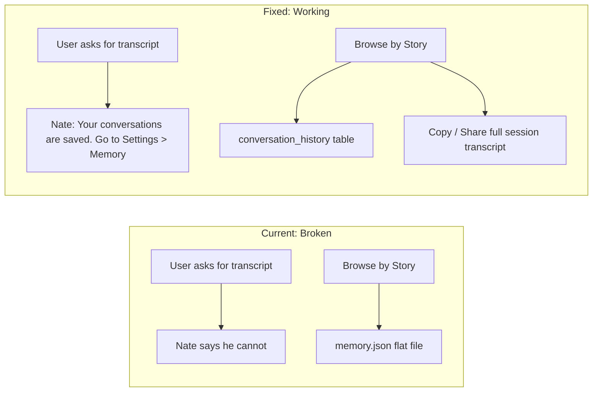

# Memory Transcript: On-Demand Raw Transcripts by Date

## Problem

Lisa asked Little Nate "Can I save the transcript of today's conversation?" and Nate told her he can't — suggesting screenshots. This is wrong. Every conversation IS saved in the `conversation_history` PostgreSQL table. The issue is three-fold:

1. **System prompt tells Nate he can't** — `bridge_server.py` line 7654 says "You CANNOT export, download, save, or create files"
2. **Memory endpoints read stale data** — `client_data_api.py` reads from `memory.json` flat files instead of PostgreSQL
3. **No copy/share action on session transcripts** — Browse by Story shows the conversations but has no way to copy or share a full session

## Architecture



## Plan (4 changes)

### Change 1: Fix Little Nate's System Prompt

**File:** [backend/app/websocket/bridge_server.py](backend/app/websocket/bridge_server.py) lines 7654-7656

**Current (wrong):**
```python
YOUR LIMITATIONS:
- You CANNOT export, download, save, or create files for the user's device. You cannot generate documents, PDFs, spreadsheets, or text files for download.
- If a user asks you to export, save, or download a conversation, politely let them know you cannot do that yet, and suggest they take a screenshot or copy-paste the text they want to keep.
```

**Replace with:**
```python
YOUR LIMITATIONS:
- You CANNOT generate documents, PDFs, spreadsheets, or other files for download.
- Every conversation you have is automatically saved. If a user asks to save, export, or review a transcript, let them know: "Your conversations with me are already saved. You can browse them anytime — go to Settings and tap Memory Search. The Browse by Story tab shows every session grouped by date, and you can copy any transcript to keep it."
- If the user says they want today's conversation specifically, reassure them it will be there in Memory Search once the session ends.
```

Also update the same limitation text in [backend/app/services/skyeye_chat.py](backend/app/services/skyeye_chat.py) line ~357 (YOUR PLATFORM CAPABILITIES section) to match.

### Change 2: Upgrade Memory Endpoints to PostgreSQL

**File:** [backend/app/routers/client_data_api.py](backend/app/routers/client_data_api.py)

Currently `memory_search()` (line 35) and `memory_sessions()` (line 89) read from `memory.json`. Replace both to query the `conversation_history` table.

**`memory_search` — PostgreSQL FTS replacement:**
```python
@router.get("/memory/search/{hw_id}")
async def memory_search(hw_id: str, q: str = "", limit: int = 30, request: Request = None):
    query = q.strip()
    if not query:
        return {"query": "", "total_matches": 0, "results": []}
    limit = min(limit, 50)

    db_pool = getattr(request.app.state, "db_pool", None) if request else None
    if not db_pool:
        # Fall back to memory.json if no db_pool
        return _search_memory_json(hw_id, query, limit)

    # Resolve hw_id to username for conversation_history lookup
    async with db_pool.acquire() as conn:
        user_row = await conn.fetchrow(
            "SELECT username FROM users WHERE hardware_id = $1 AND deleted_at IS NULL", hw_id
        )
        if not user_row:
            return {"query": query, "total_matches": 0, "results": []}
        username = user_row["username"]

        rows = await conn.fetch(
            """SELECT session_id, user_text, ai_text, created_at
               FROM conversation_history
               WHERE user_id = $1
                 AND to_tsvector('english', user_text || ' ' || ai_text) @@ plainto_tsquery('english', $2)
               ORDER BY created_at DESC
               LIMIT $3""",
            username, query, limit,
        )

    results = []
    for r in rows:
        ts = r["created_at"].isoformat() if r["created_at"] else ""
        results.append({
            "timestamp": ts,
            "session_id": r["session_id"],
            "session_date": ts[:10] if ts else "",
            "user_preview": (r["user_text"] or "")[:200],
            "ai_preview": (r["ai_text"] or "")[:200],
            "user_full": r["user_text"] or "",
            "ai_full": r["ai_text"] or "",
        })

    return {"query": query, "total_matches": len(results), "results": results}
```

**`memory_sessions` — PostgreSQL grouped by session/date:**
```python
@router.get("/memory/sessions/{hw_id}")
async def memory_sessions(hw_id: str, request: Request = None):
    db_pool = getattr(request.app.state, "db_pool", None) if request else None
    if not db_pool:
        return _sessions_from_json(hw_id)

    async with db_pool.acquire() as conn:
        user_row = await conn.fetchrow(
            "SELECT username FROM users WHERE hardware_id = $1 AND deleted_at IS NULL", hw_id
        )
        if not user_row:
            return {"sessions": [], "total_sessions": 0}
        username = user_row["username"]

        rows = await conn.fetch(
            """SELECT session_id, user_text, ai_text, created_at
               FROM conversation_history
               WHERE user_id = $1
               ORDER BY created_at ASC""",
            username,
        )

    from collections import OrderedDict
    sessions: OrderedDict = OrderedDict()
    for r in rows:
        ts = r["created_at"].isoformat() if r["created_at"] else ""
        key = r["session_id"] or ts[:10]
        if not key:
            key = "unknown"
        if key not in sessions:
            sessions[key] = []
        sessions[key].append({
            "timestamp": ts,
            "user": r["user_text"] or "",
            "ai": r["ai_text"] or "",
        })

    result = []
    for key, entries in sessions.items():
        first_ts = entries[0]["timestamp"] if entries else ""
        last_ts = entries[-1]["timestamp"] if entries else ""
        first_user = (entries[0]["user"] or "")[:120]
        result.append({
            "session_key": key,
            "date": first_ts[:10] if first_ts else key,
            "first_timestamp": first_ts,
            "last_timestamp": last_ts,
            "entry_count": len(entries),
            "preview": first_user + ("..." if len(first_user) >= 120 else ""),
            "entries": entries,
        })

    result.reverse()  # Most recent first
    return {"sessions": result, "total_sessions": len(result)}
```

Keep the old `memory.json` functions as private fallbacks (`_search_memory_json`, `_sessions_from_json`) for when `db_pool` is not available.

### Change 3: Add "Copy Full Transcript" Button to Browse by Story

**File:** [mobile/lib/screens/secure_search_screen.dart](mobile/lib/screens/secure_search_screen.dart) lines 537-603

In the `_buildSessionChapter` method, add a "Copy Transcript" action button in the expanded session header area (after the session entries list). When tapped, it formats the full session as a readable transcript and copies to clipboard.

Add this after the entries list and before the closing `])` of the Column at line 604:

```dart
if (isExpanded) ...[
  Container(height: 1, color: _Design.goldDim.withOpacity(0.15)),
  Padding(
    padding: const EdgeInsets.all(12),
    child: Row(
      mainAxisAlignment: MainAxisAlignment.end,
      children: [
        TextButton.icon(
          onPressed: () {
            final buf = StringBuffer();
            buf.writeln('Sovereign Sanctuary — Conversation Transcript');
            buf.writeln('Date: ${_formatDate(date)}');
            buf.writeln('${'—' * 40}');
            for (final e in entries) {
              final ts = _formatTimestamp(e['timestamp'] as String? ?? '');
              buf.writeln('\n[$ts]');
              buf.writeln('You: ${e['user'] ?? ''}');
              buf.writeln('Nate: ${e['ai'] ?? ''}');
            }
            buf.writeln('\n${'—' * 40}');
            buf.writeln('sovereignsanctuary.net');
            Clipboard.setData(ClipboardData(text: buf.toString()));
            ScaffoldMessenger.of(context).showSnackBar(
              const SnackBar(
                content: Text('Transcript copied to clipboard'),
                duration: Duration(seconds: 2),
              ),
            );
          },
          icon: const Icon(Icons.copy_all, size: 16, color: _Design.gold),
          label: const Text('Copy Transcript',
            style: TextStyle(color: _Design.gold, fontSize: 12, fontWeight: FontWeight.w600)),
        ),
      ],
    ),
  ),
],
```

### Change 4: Deploy to Production

Since these changes span both the bridge (protected file) and the backend:

1. `scp` updated `bridge_server.py` to GREEN (system prompt fix only — under 50 lines changed)
2. `scp` updated `client_data_api.py` to GREEN
3. `scp` updated `skyeye_chat.py` to GREEN (capability text fix)
4. Restart `nate_backend` and `nate_bridge`
5. `flutter build web --release` for the Flutter UI change
6. `rsync` (no `--delete`) the web build to GREEN
7. Purge Cloudflare cache for `main.dart.js`
8. Verify on production

## What This Does NOT Change

- No new database tables or migrations needed — `conversation_history` already exists with indexes
- No new REST endpoints — we're upgrading existing ones
- No new WebSocket handlers
- No changes to crystal recall/crystallization pipeline
- The existing "Memory Search" settings entry already navigates to `SecureSearchScreen`

## Files Changed (4 total)

| File | Change | Lines |
|------|--------|-------|
| `backend/app/websocket/bridge_server.py` | System prompt YOUR LIMITATIONS text | ~5 lines |
| `backend/app/services/skyeye_chat.py` | Matching capability text | ~3 lines |
| `backend/app/routers/client_data_api.py` | PostgreSQL-backed search + sessions | ~80 lines |
| `mobile/lib/screens/secure_search_screen.dart` | Copy Transcript button in Browse tab | ~30 lines |
