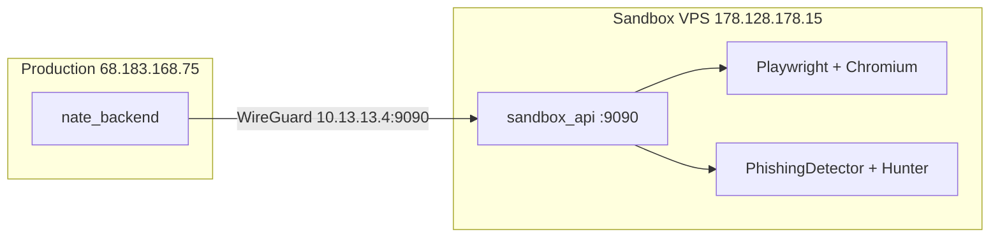

# Migrate Detonation Sandbox to 100GB VPS

## Current State

The detonation sandbox (`nate_detonation`) runs as a Docker container on the **production server** (`68.183.168.75`), communicating via an internal Docker network (`hunt_command` at `172.30.0.2:9090`). This works, but it shares CPU/memory/kernel with the production stack.

## Target State

The detonation sandbox runs as a **native systemd service** on the dedicated **Sandbox VPS** (`178.128.178.15` / WireGuard `10.13.13.4`), reachable only via the WireGuard mesh. The production server proxies hunt/detonation requests over the encrypted tunnel.

## Step 1: Create VPS Setup Script

Create `scripts/setup_sandbox_vps.sh` that provisions the 100GB VPS:

- Install Python 3.11, system dependencies (tesseract, libmagic, fonts, Chromium deps)
- `pip install` the same packages from [Dockerfile.sandbox](backend/Dockerfile.sandbox) (fastapi, uvicorn, playwright, aiohttp, etc.)
- `playwright install chromium && playwright install-deps chromium`
- Deploy sandbox code files to `/opt/sandbox/`:
  - `sandbox_api.py`
  - `detonation_chamber.py`
  - `phishing_link_hunter.py`
  - `phishing_detector.py`
- Set up `iptables` rules (same logic as [sandbox_entrypoint.sh](scripts/sandbox_entrypoint.sh)):
  - Block RFC 1918 ranges (prevent lateral movement)
  - Allow WireGuard subnet `10.13.13.0/24`
  - Allow DNS
  - Allow localhost
- Create a `systemd` service (`sandbox-api.service`) to run uvicorn on `10.13.13.4:9090` (only listens on WireGuard interface)
- Configure `ufw` firewall: allow WireGuard UDP 51820 inbound, deny all other inbound except SSH for initial setup

## Step 2: Set Up WireGuard on Both Sides

WireGuard configs already exist:

- [wireguard/sandbox-vps/wg0.conf](wireguard/sandbox-vps/wg0.conf) -- Sandbox VPS side
- [wireguard/production/wg0.conf](wireguard/production/wg0.conf) -- Production side (already has sandbox peer)

The setup script will:

- Install WireGuard on the Sandbox VPS
- Copy the config to `/etc/wireguard/wg0.conf`
- Enable and start the `wg0` interface
- Verify connectivity with `ping 10.13.13.2` (production)

## Step 3: Update Production Code to Point to VPS

**[backend/app/routers/hive_defense_api.py](backend/app/routers/hive_defense_api.py)** (line 1092):

- Change `SANDBOX_URL` default from `http://172.30.0.2:9090` to `http://10.13.13.4:9090`

**[docker-compose.prod.yml](docker-compose.prod.yml)** (line 79):

- Change `SANDBOX_URL=http://172.30.0.2:9090` to `SANDBOX_URL=http://10.13.13.4:9090`
- Remove `hunt_command` network from backend service (no longer needed for Docker-internal communication)

**[docker-compose.yml](docker-compose.yml)**:

- Keep the `detonation` service in dev compose for local testing, but add a comment noting production uses the VPS

## Step 4: Clean Up Production Docker

On the production server:

- Stop and remove `nate_detonation` container
- Remove `hunt_command` network from `nate_backend` container
- Restart backend with new `SANDBOX_URL` pointing to VPS

## Step 5: Also Fix Remaining Items

While deploying, also apply two fixes already coded locally:

- Remove the dead `_find_chromium` function from the subprocess script in [detonation_chamber.py](backend/app/services/security/detonation_chamber.py)
- The `ulimit -v` fix in [sandbox_entrypoint.sh](scripts/sandbox_entrypoint.sh) is no longer relevant for the VPS (no container limits), but the iptables logic will be adapted into the VPS setup script

## Deployment Sequence

1. SSH into `178.128.178.15`, run `setup_sandbox_vps.sh`
2. Verify WireGuard mesh connectivity (`ping 10.13.13.2` from VPS)
3. Verify sandbox API health (`curl http://10.13.13.4:9090/health` from production)
4. Deploy updated `hive_defense_api.py` and `docker-compose.prod.yml` to production
5. Restart `nate_backend` on production
6. Test Hunt Text and Detonation end-to-end through SkyEye
7. Stop `nate_detonation` Docker container on production
8. Run standard deployment health checks

