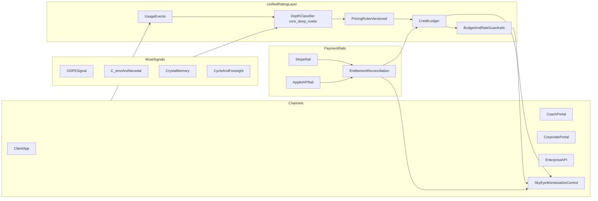
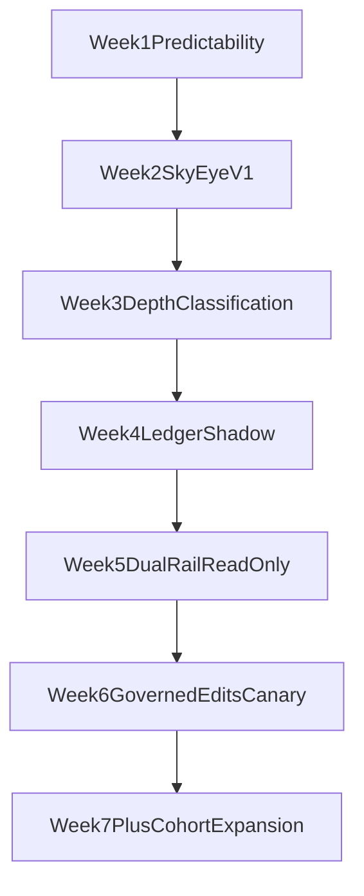

# Moat-Aligned Billing Overhaul Plan

> **Execution Order:** 4 of 4 — AFTER JSON-to-PG migration

## Objectives

- Preserve current pricing while in beta, but make monetization architecture ready for scale.
- Fix pricing predictability gaps so displayed plan limits always match enforced limits.
- Introduce a unified `intelligence credit` economy across client/corporate/API using depth classes (`core`, `deep_noetic`).
- Add dual-rail entitlement reconciliation (Apple IAP + Stripe) without breaking existing flows.
- Keep margins healthy via provider-aware rating, guardrails, and cost controls.
- Centralize monitoring/control/editing in a single SkyEye control surface with strict governance and auditability.

## Current-State Anchors (what we keep)

- Plan + overage model in [backend/app/routers/billing.py](/Users/nathannevedal/Desktop/Clinical-Sovereignty-Lab-2/backend/app/routers/billing.py).
- Tier gating service in [backend/app/services/billing/tier_enforcement.py](/Users/nathannevedal/Desktop/Clinical-Sovereignty-Lab-2/backend/app/services/billing/tier_enforcement.py).
- API tier keying in [backend/app/services/enterprise_api.py](/Users/nathannevedal/Desktop/Clinical-Sovereignty-Lab-2/backend/app/services/enterprise_api.py).
- Meter reporting hooks in [backend/app/services/stripe_integration.py](/Users/nathannevedal/Desktop/Clinical-Sovereignty-Lab-2/backend/app/services/stripe_integration.py).
- Existing iOS/Android purchase + receipt verification scaffolding in [mobile/lib/services/payment_service.dart](/Users/nathannevedal/Desktop/Clinical-Sovereignty-Lab-2/mobile/lib/services/payment_service.dart), [mobile/lib/screens/settings_screen.dart](/Users/nathannevedal/Desktop/Clinical-Sovereignty-Lab-2/mobile/lib/screens/settings_screen.dart), and [mobile/lib/screens/billing_screens.dart](/Users/nathannevedal/Desktop/Clinical-Sovereignty-Lab-2/mobile/lib/screens/billing_screens.dart).
- Predictive + cycle services already wired in [backend/app/services/cycle_detection_engine.py](/Users/nathannevedal/Desktop/Clinical-Sovereignty-Lab-2/backend/app/services/cycle_detection_engine.py), [backend/app/services/foresight_engine.py](/Users/nathannevedal/Desktop/Clinical-Sovereignty-Lab-2/backend/app/services/foresight_engine.py), [backend/app/routers/cycle_api.py](/Users/nathannevedal/Desktop/Clinical-Sovereignty-Lab-2/backend/app/routers/cycle_api.py), [backend/app/routers/foresight_api.py](/Users/nathannevedal/Desktop/Clinical-Sovereignty-Lab-2/backend/app/routers/foresight_api.py).

## Target Architecture

## Phased Delivery

## Phase 0 — Predictability Fix (no pricing overhaul)

- Create one canonical entitlement map and eliminate drift between:
  - displayed limits in `PLAN_DETAILS` ([billing.py](/Users/nathannevedal/Desktop/Clinical-Sovereignty-Lab-2/backend/app/routers/billing.py))
  - enforced limits in `TIER_LIMITS` ([tier_enforcement.py](/Users/nathannevedal/Desktop/Clinical-Sovereignty-Lab-2/backend/app/services/billing/tier_enforcement.py)).
- Add a runtime assertion/report endpoint that compares plan display limits vs enforcement limits.
- Normalize naming aliases (`STANDARD` vs `inner_chamber`, `TOP_TIER` vs `sovereign_circle`) into one resolver shared by billing + enforcement.
- Add deterministic monthly projection logic from live usage so users see: included, consumed, projected overage.

### Output

- Predictable and explainable billing behavior with no SKU change.

## Phase 1 — Minimal Fine-Tune (incremental, moat-visible)

- Keep current prices; change packaging + UX wording to show:
  - `Included` vs `On-demand pull`
  - feature classes (`core`, `deep_noetic`) in billing surfaces.
- Add usage meters + thresholds (80/90/100%) for client, corporate, API.
- Add API tier differentiation without immediate tier renumbering:
  - Existing tiers continue to work, but expose response metadata indicating stateless vs memory-backed vs noetic depth usage.
- Add DOJO usage classification so each DOJO scenario emits classed usage events (`deep_noetic` by default when ODPE/crystal-heavy).

### UX Targets

- [mobile/lib/screens/settings_screen.dart](/Users/nathannevedal/Desktop/Clinical-Sovereignty-Lab-2/mobile/lib/screens/settings_screen.dart)
- [mobile/lib/screens/billing_screens.dart](/Users/nathannevedal/Desktop/Clinical-Sovereignty-Lab-2/mobile/lib/screens/billing_screens.dart)
- Enterprise/admin pricing UI surfaces (backend-fed descriptors).

## Phase 1.5 — SkyEye Monetization Control Tab (monitor-only first)

- Add a dedicated sub-tab in SkyEye (positioned near Big Nate Chat) to consolidate monetization observability:
  - **Overview:** MRR/ARR, projected overage, margin trend, cohort summary.
  - **Pricing Predictability:** drift status between displayed limits and enforced limits.
  - **Credits & Depth Mix:** `core` vs `deep_noetic` usage split by tenant/channel.
  - **Rails Health:** Apple vs Stripe entitlement parity/conflict counters.
  - **API & DOJO Performance:** tier utilization, DOJO deep-noetic demand profile.
- Keep this phase read-only to de-risk rollout and establish data trust before any config edits.
- Register this tab in the relevant SkyEye auditor endpoint maps once endpoints are added.

### Phase 1.5 Deliverable — V1 Endpoint Contract (first 5 endpoints)

- Create router: [backend/app/routers/monetization_control_api.py](/Users/nathannevedal/Desktop/Clinical-Sovereignty-Lab-2/backend/app/routers/monetization_control_api.py)
- Mount prefix: `/api/monetization-control`
- Auth: `require_admin` for all V1 endpoints
- All responses must be structurally non-empty (avoid `200 + {}`)

#### Endpoint 1: `GET /api/monetization-control/overview`

- Purpose: Single-card summary for tab header metrics.
- Response fields:
  - `status`
  - `window` (`last_24h`, `mtd`)
  - `revenue` (`mrr_estimate_cents`, `arr_estimate_cents`)
  - `usage` (`core_events`, `deep_noetic_events`, `deep_ratio`)
  - `margin` (`estimated_gross_margin_pct`, `cost_alert`)
  - `updated_at`

#### Endpoint 2: `GET /api/monetization-control/predictability`

- Purpose: Detect drift between displayed plan limits and enforced limits.
- Source comparison:
  - `PLAN_DETAILS` in [backend/app/routers/billing.py](/Users/nathannevedal/Desktop/Clinical-Sovereignty-Lab-2/backend/app/routers/billing.py)
  - `TIER_LIMITS` in [backend/app/services/billing/tier_enforcement.py](/Users/nathannevedal/Desktop/Clinical-Sovereignty-Lab-2/backend/app/services/billing/tier_enforcement.py)
- Response fields:
  - `status` (`ok` | `drift_detected`)
  - `drift_count`
  - `drifts[]` (`tier`, `display_key`, `enforced_key`, `display_value`, `enforced_value`)
  - `last_checked_at`

#### Endpoint 3: `GET /api/monetization-control/credits/depth-mix?days=30`

- Purpose: Show class mix by channel/tenant for moat visibility and margin control.
- Response fields:
  - `status`
  - `days`
  - `totals` (`core`, `deep_noetic`, `total`, `deep_noetic_pct`)
  - `by_channel[]` (`channel`, `core`, `deep_noetic`, `deep_noetic_pct`)
  - `top_tenants[]` (`tenant_id`, `core`, `deep_noetic`, `cost_band`)

#### Endpoint 4: `GET /api/monetization-control/rails/reconciliation`

- Purpose: Stripe vs Apple parity monitor.
- Response fields:
  - `status`
  - `summary` (`checked`, `matched`, `mismatched`, `pending`, `stale`)
  - `mismatches[]` (`account_id`, `stripe_state`, `apple_state`, `effective_state`, `reason`)
  - `last_reconciled_at`

#### Endpoint 5: `GET /api/monetization-control/api-dojo/performance?days=30`

- Purpose: Commercial readout for API tiers + DOJO deep-noetic utilization.
- Response fields:
  - `status`
  - `api` (`tier_usage[]`, `effective_arpu_cents`, `overage_capture_pct`)
  - `dojo` (`verticals[]` with `sessions`, `deep_noetic_ratio`, `revenue_cents`)
  - `recommendations[]` (non-empty actionable strings)

### Phase 1.5 UI Wiring Targets

- SkyEye host page where tab is embedded:
  - [dashboard/skyeye.html](/Users/nathannevedal/Desktop/Clinical-Sovereignty-Lab-2/dashboard/skyeye.html)
- If command entry point navigation needs adding:
  - [dashboard/command.html](/Users/nathannevedal/Desktop/Clinical-Sovereignty-Lab-2/dashboard/command.html)
- Use existing auth fetch helpers (`_authHeaders`/`apiFetch` patterns), no standalone auth logic.

### Phase 1.5 Audit + Trust Registration Tasks

- Add new Monetization Control checks to:
  - [backend/app/services/skyeye_tab_auditor.py](/Users/nathannevedal/Desktop/Clinical-Sovereignty-Lab-2/backend/app/services/skyeye_tab_auditor.py)
- Sync baseline/trust registry (5-location rule):
  - [backend/app/services/trust_enforcer.py](/Users/nathannevedal/Desktop/Clinical-Sovereignty-Lab-2/backend/app/services/trust_enforcer.py)
  - `trust_baseline` row update migration in `backend/migrations/`
- Ensure service registry/denominator consistency in:
  - [backend/app/main.py](/Users/nathannevedal/Desktop/Clinical-Sovereignty-Lab-2/backend/app/main.py)

## Phase 2 — Unified Intelligence Credit Engine (considerable overhaul start)

- Introduce new billing domain service:
  - `rating engine` for event-to-credit conversion
  - rule versioning for per-tier/per-channel coefficients.
- Add new data model (append-only + auditable):
  - `credit_wallets`
  - `usage_events`
  - `usage_ratings`
  - `pricing_rule_versions`
  - `entitlement_snapshots`.
- Implement depth classifier driven by moat signals:
  - ODPE signal, crystal memory usage, Nevedal/Foresight invocation, voice biometrics.
- Add compatibility layer so legacy plan/overage continues while ledger runs in shadow mode.

### Phase 2 Data Contracts (concrete)

- `usage_events` (append-only):
  - `event_id`, `occurred_at`, `actor_type`, `actor_id`, `tenant_id`, `channel`, `feature_key`, `depth_class`, `quantity`, `metadata_json`
- `usage_ratings`:
  - `rating_id`, `event_id`, `rule_version`, `credits_burned`, `cost_estimate_cents`, `margin_band`, `rated_at`
- `credit_wallets`:
  - `wallet_id`, `owner_type`, `owner_id`, `period_start`, `period_end`, `included_credits`, `consumed_credits`, `remaining_credits`
- `entitlement_snapshots`:
  - `snapshot_id`, `account_id`, `source_rail`, `source_ref`, `entitlement_json`, `effective_from`, `effective_to`, `is_active`

### Margin Guardrails (must ship in this phase)

- Per-tenant monthly budget caps and hard spend ceilings.
- Provider-aware cost multipliers (protect margin when routing to paid models).
- Dynamic throttles: downgrade `deep_noetic` to `core` when budget policy requires.
- Real-time anomaly alerts for cost spikes.

## Phase 2.5 — Governed Edit Workflows in SkyEye

- Enable controlled editing from the SkyEye Monetization Control tab:
  - propose change -> approve change -> apply change (no direct live mutation).
  - admin-only write access; read-only for all non-admin roles.
- Add immutable audit logs for every pricing/rating/guardrail change with before/after snapshots.
- Add safe rollout controls in UI:
  - effective-at timestamp
  - canary cohort selection
  - one-click rollback to previous ruleset version.

## Phase 3 — Dual-Rail Apple + Stripe Entitlements

- Keep Stripe as enterprise/web rail.
- Add/complete Apple entitlement ingestion + normalization from existing receipt verification flows in [payment_service.dart](/Users/nathannevedal/Desktop/Clinical-Sovereignty-Lab-2/mobile/lib/services/payment_service.dart).
- Build reconciliation service with deterministic precedence rules:
  - active entitlement union
  - duplicate purchase handling
  - grace period conflict resolution
  - refund/reversal consistency.
- Expose a single entitlement read API used by all portals.

### Phase 3 API Endpoints (concrete)

- `GET /api/monetization-control/entitlements/{account_id}`
- `POST /api/monetization-control/reconcile/{account_id}`
- `GET /api/monetization-control/reconcile/conflicts?status=open`
- `POST /api/monetization-control/reconcile/conflicts/{conflict_id}/resolve`

## Phase 4 — API Pricing Restructure Around Moat (commercial layer)

- Implement catalog overlay (without breaking old tiers during migration):
  - `Base` ($29–49): stateless/core only.
  - `Intelligence` ($199–499): crystal memory + ODPE-optimized routing + C_emo tracking.
  - `Clinical` ($999+): full Nevedal/Foresight/voice biometrics + compliance controls.
- Map existing `FREE/STARTER/GROWTH/ENTERPRISE` to new catalog aliases during beta; do not force immediate customer migration.
- Add transparent usage descriptors in API responses and dashboards to justify moat pricing.

## Phase 5 — Rollout and Risk Control

- Shadow mode: run legacy billing and new credit engine in parallel.
- Produce daily diff reports for invoice parity and entitlement parity.
- Migrate cohorts by level (API first, then corporate, then consumer).
- Keep rollback switch to legacy billing paths until variance is below threshold.
- Roll out SkyEye edit capabilities only after shadow-mode parity is stable.

## Scalable Model by Level (operational rollout)

- **Developer/API:** flat access + included credits + overage by depth class.
- **Business/corporate:** platform fee + seat subsidy + pooled credits with budget controls.
- **End user:** flat plan includes baseline credits; premium `on-demand pull` burns deep/noetic credits.
- **DOJO verticals:** treated as premium deep/noetic workloads; easy to add new verticals by prompt/rubric with shared billing primitives.

## Predictability + Cycle Detection Integration

- Keep cycle/foresight as active services (already wired) and classify their compute and report generation into `deep_noetic` events.
- Add data-sufficiency gating to UX (`insufficient data` states) so predictive outputs are monetized only when confidence threshold is met.
- Add forecasting confidence and model health indicators to billing insights so enterprise buyers can tie spend to measurable prediction quality.

## Acceptance Criteria

- Displayed limits always match enforced limits (zero drift).
- Unified ledger can rate 100% of usage events across client/corporate/API.
- Apple and Stripe produce one authoritative entitlement state.
- Budget/cost guardrails prevent margin collapse during usage spikes.
- API tiers are commercially differentiated by moat depth, not just raw request volume.
- DOJO workloads are metered as premium deep/noetic classes with clear customer-visible value labels.
- SkyEye Monetization Control provides a single trusted pane for monitor/control/edit with governed approvals and full audit trail.
- V1 SkyEye Monetization endpoints return stable, non-empty schemas and are covered by trust checks.

## Execution Schedule (Week-by-Week)

## Week 1 — Predictability Foundation

- Deliverables:
  - Canonical entitlement resolver and drift checker.
  - `GET /api/monetization-control/predictability`.
  - Baseline unit tests for plan/enforcement parity.
- Dependencies:
  - Access to `PLAN_DETAILS` and `TIER_LIMITS` mappings.
- Go/No-Go Gate:
  - `drift_count == 0` on staging for seeded fixtures.
  - No regressions in existing billing endpoints.

## Week 2 — SkyEye Monitor-Only V1

- Deliverables:
  - Router scaffold + first 5 monitor endpoints.
  - SkyEye tab UI shell with read-only cards/panels.
  - Auditor registration for new monitor endpoints.
- Dependencies:
  - Week 1 predictability endpoint stable.
  - Auth/RBAC wiring via `require_admin`.
- Go/No-Go Gate:
  - All V1 endpoints return non-empty schema on staging.
  - Auditor checks pass for new tab endpoints.

## Week 3 — Usage Classification and Depth Mix

- Deliverables:
  - Event classification pipeline (`core`, `deep_noetic`) for API + DOJO + key client flows.
  - `GET /api/monetization-control/credits/depth-mix`.
  - Initial margin telemetry panel (read-only).
- Dependencies:
  - Week 2 monitor endpoints live.
  - Usage event instrumentation points identified.
- Go/No-Go Gate:
  - > =95% of target events receive valid depth classification.
  - No P99 latency regression above agreed threshold.

## Week 4 — Ledger Shadow Mode (No Billing Cutover)

- Deliverables:
  - `usage_events`, `usage_ratings`, `credit_wallets`, `entitlement_snapshots` schema + service.
  - Shadow rating engine producing parallel outputs.
  - Daily parity diff report (legacy vs shadow).
- Dependencies:
  - Week 3 classification quality gate met.
- Go/No-Go Gate:
  - Shadow pipeline processes 100% staged events.
  - Variance within tolerance for sampled invoices/usages.

## Week 5 — Dual-Rail Entitlement Reconciliation (Read-Only)

- Deliverables:
  - Reconciliation endpoints + conflict views (no auto-write resolution yet).
  - Stripe/Apple entitlement normalization and parity dashboards.
- Dependencies:
  - Existing receipt verification flow healthy.
  - Week 4 entitlement snapshots populated.
- Go/No-Go Gate:
  - Reconciliation run succeeds for test cohort.
  - Conflict reasons are deterministic and reproducible.

## Week 6 — Governed Edit Workflows + Canary Rollout

- Deliverables:
  - Propose -> Approve -> Apply workflow in SkyEye Monetization Control.
  - Rule versioning, effective-at scheduling, rollback controls.
  - Canary cohort activation for API catalog overlay.
- Dependencies:
  - Week 4 parity stable.
  - Week 5 reconciliation stable.
- Go/No-Go Gate:
  - Approval workflow audit logs complete and immutable.
  - Canary variance below threshold for 7-day window.

## Week 7+ — Controlled Expansion

- Cohort rollout order:
  1. API tenants
  2. Corporate accounts
  3. Consumer tiers
- Continue DOJO vertical expansion with deep-noetic metering from day 1.
- Keep rollback path available until full-period billing parity is proven.

## Dependency Map (Critical Path)

## Rollback Triggers

- Billing parity variance exceeds threshold for 2 consecutive days.
- Entitlement reconciliation mismatch rate increases above agreed ceiling.
- Margin alert indicates sustained negative unit economics in canary cohort.
- Auditor trust score regresses below agreed baseline for monetization endpoints.

## Reporting Cadence

- Daily: parity diff, reconciliation mismatch count, margin anomaly summary.
- Weekly: cohort health, depth mix shifts, API tier conversion performance.
- Monthly: pricing effectiveness review vs moat visibility (ODPE/Nevedal/crystal utilization).

## Ownership Matrix (Workstream Accountability)

- **Billing Core & Predictability**
  - Primary owner: Backend Platform
  - Secondary owner: Data Engineering
  - Scope: entitlement resolver, drift checker, billing parity logic
  - Key files:
    - [backend/app/routers/billing.py](/Users/nathannevedal/Desktop/Clinical-Sovereignty-Lab-2/backend/app/routers/billing.py)
    - [backend/app/services/billing/tier_enforcement.py](/Users/nathannevedal/Desktop/Clinical-Sovereignty-Lab-2/backend/app/services/billing/tier_enforcement.py)
- **SkyEye Monetization Control (UI + APIs)**
  - Primary owner: Admin Dashboard Team
  - Secondary owner: Backend Platform
  - Scope: tab UI, monitor endpoints, governed edit flows
  - Key files:
    - [dashboard/skyeye.html](/Users/nathannevedal/Desktop/Clinical-Sovereignty-Lab-2/dashboard/skyeye.html)
    - [backend/app/routers/monetization_control_api.py](/Users/nathannevedal/Desktop/Clinical-Sovereignty-Lab-2/backend/app/routers/monetization_control_api.py)
- **Unified Credit Ledger & Rating Engine**
  - Primary owner: Backend Platform
  - Secondary owner: Data Engineering
  - Scope: usage events, ratings, wallets, pricing rules
  - Key files:
    - [backend/app/services/stripe_integration.py](/Users/nathannevedal/Desktop/Clinical-Sovereignty-Lab-2/backend/app/services/stripe_integration.py)
    - New billing domain service module(s)
- **Dual-Rail Entitlements (Apple + Stripe)**
  - Primary owner: Payments Team
  - Secondary owner: Mobile Team
  - Scope: receipt normalization, reconciliation, conflict resolution
  - Key files:
    - [mobile/lib/services/payment_service.dart](/Users/nathannevedal/Desktop/Clinical-Sovereignty-Lab-2/mobile/lib/services/payment_service.dart)
    - entitlement/reconciliation backend services
- **API Pricing Overlay (Base/Intelligence/Clinical)**
  - Primary owner: API Platform Team
  - Secondary owner: Product Strategy
  - Scope: catalog overlay, backward-compatible aliases, usage descriptors
  - Key files:
    - [backend/app/services/enterprise_api.py](/Users/nathannevedal/Desktop/Clinical-Sovereignty-Lab-2/backend/app/services/enterprise_api.py)
- **DOJO Commercial Expansion Metering**
  - Primary owner: Coaching/DOJO Platform
  - Secondary owner: Backend Platform
  - Scope: deep-noetic metering for current and new verticals
  - Key files:
    - [backend/app/services/coaching_mesh_engine.py](/Users/nathannevedal/Desktop/Clinical-Sovereignty-Lab-2/backend/app/services/coaching_mesh_engine.py)
- **Trust/Auditor/Baseline Synchronization**
  - Primary owner: Trust Engineering
  - Secondary owner: Backend Platform
  - Scope: auditor endpoints, trust baseline count sync, release gate checks
  - Key files:
    - [backend/app/services/skyeye_tab_auditor.py](/Users/nathannevedal/Desktop/Clinical-Sovereignty-Lab-2/backend/app/services/skyeye_tab_auditor.py)
    - [backend/app/services/trust_enforcer.py](/Users/nathannevedal/Desktop/Clinical-Sovereignty-Lab-2/backend/app/services/trust_enforcer.py)
    - [backend/app/main.py](/Users/nathannevedal/Desktop/Clinical-Sovereignty-Lab-2/backend/app/main.py)

## Week-by-Week Risk Scoring (1=Low, 5=High)

- **Week 1 Risk: 2/5**
  - Risks: entitlement alias mismatch, hidden drift fields
  - Mitigations: parity tests on all tier aliases; fail-fast drift endpoint checks
- **Week 2 Risk: 3/5**
  - Risks: new endpoints not trust-registered; UI data latency confusion
  - Mitigations: register auditor checks in same sprint; cache/refresh timestamps in UI
- **Week 3 Risk: 3/5**
  - Risks: incomplete event coverage for depth classification
  - Mitigations: coverage dashboard; unknown-class fallback with alerting
- **Week 4 Risk: 4/5**
  - Risks: shadow ledger variance, schema/perf regressions
  - Mitigations: append-only writes, batched ingestion, daily parity threshold gates
- **Week 5 Risk: 5/5**
  - Risks: Apple/Stripe entitlement conflicts, edge-case reversals/refunds
  - Mitigations: read-only reconciliation first, deterministic precedence rules, manual resolve queue
- **Week 6 Risk: 4/5**
  - Risks: governed edit workflow misuse, canary pricing instability
  - Mitigations: strict RBAC, required approvals, time-delayed apply, one-click rollback
- **Week 7+ Risk: 3/5**
  - Risks: cohort-specific behavior differences, support load during migration
  - Mitigations: staged cohorts, holdback populations, dedicated migration runbooks

## RACI Snapshot (Condensed)

- **Responsible:** Backend Platform, Payments, Admin Dashboard, API Platform, Coaching/DOJO
- **Accountable:** Platform Lead (overall), Product Lead (commercial policy)
- **Consulted:** Trust Engineering, Data Engineering, Security/Compliance
- **Informed:** Support Ops, Finance Ops, GTM/Partnerships

