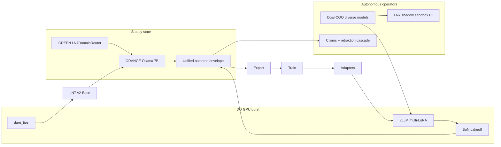
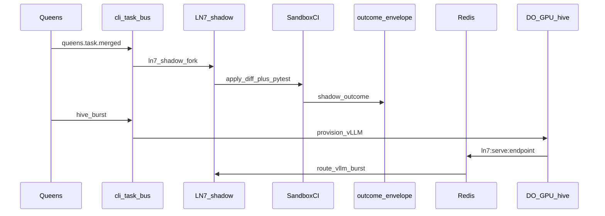

# Multi-LoRA Ephemeral Flywheel — Corrected Roadmap + Amendment 1 + Autonomy Gaps + Residuals + Wiring

**Amends with:** [flywheel-amendment-1-rev3-autonomous.md](file:///Users/nathannevedal/Downloads/flywheel-amendment-1-rev3-autonomous.md), autonomy gap pack, residual-risk pack, and **Phase W wiring contracts** (closes event-edge / store / cutover gaps).

**Autonomy principle:** No closed circle — enforced by *structure*, not signature. No loop edits its own evaluator, invariants, or tier boundaries. Fence-test files and frozen-config live outside Queens write scope. Residuals that cannot be deleted by structure are named honestly; mechanisms shrink them. The human is informed immediately on anomalies and can reverse; the human is never waited on. **No phase is considered implementable until its Phase W contracts exist.**

---

## Verdict (hardware + governance)

**Train side** is live: sandbox rejection sampling, preference export, ephemeral DO GPU QLoRA + destroy, revision ledger, bakeoff/canary. **Serve side** was planned against hardware that does not exist:

1. **No GPU on ORANGE or BLUE.** ORANGE = Hetzner CAX41 ARM, 32 GB **RAM**, no CUDA ([`ln7_peft_server.py`](backend/scripts/orange/ln7_peft_server.py) forces CPU fp16). BLUE Intel = blocked for mlx ([`docs/ln7/RUNBOOK.md`](docs/ln7/RUNBOOK.md)). Clone hive = **ephemeral DO GPU burst**; interactive = ORANGE Ollama quantized 7B.
2. **Magazine base split.** Pin **`Qwen/Qwen2.5-Coder-7B-Instruct`**; quarantine 1.5B adapters.
3. **Governance is phased (see Governance transition).** Today: CEO activate remains a valid product path (e.g. Priority 1 bakeoff promote). After Step 0 greens: Dual-COO mechanical promote is authority; CEO surface = transparency + reversal pad only. YELLOW/RED remap and anomaly channel apply in the end-state; they do not invalidate current CEO activate.



---

## Governance transition (CEO activate ↔ reverse pad)

Two product rules must not be collapsed into one timeline.

| Epoch | When | Promote / activate | CEO surface |
|---|---|---|---|
| **G0 — Current / Priority 1** | Until Step 0 fence suite + boot manifest are green **and** `DUAL_COO_MECHANICAL_PROMOTE` is false | Bakeoff + canary evidence → **CEO activate** (`ceo_inbox_decide` / activate_revision) is **valid and required** for serving flips. `ENABLE_LN7_AUTO_PROMOTE` stays false. | Decidable inbox: APPROVE activates, REJECT holds. |
| **G1 — Transition** | Step 0 landing; mechanical Dual-COO path shipping behind flag | Both paths exist: mechanical checklist can shadow-score; **CEO activate still authoritative** until flag flip. | Inbox still decidable for promote. |
| **G2 — End-state** | Step 0 green **and** `DUAL_COO_MECHANICAL_PROMOTE=true` (auto with W6) | Dual-COO checklist agreement = promote authority. `enqueue_ceo` removed from LN7/Queens **promote** paths only. | **Reverse pad only** — transparency, anomaly awareness, one-click reverse (W18). Never a throughput wait. |

**Hard rules:**
- Finishing Priority 1 (or any pre–Step 0 promote) via CEO activate is correct under G0 — not a plan violation.
- Do not strip CEO decide from promote paths until G2.
- Stage 4 abort gate is mechanical in all epochs; CEO may still reverse a bad Stage 4 after the fact in G2.
- Reversal in every epoch: predecessor restored, pattern suppressed 30 days (`ln7_suppress_patterns`), logged.

## Governance model (rev 3 — applies fully in G2)

| Tier | Meaning |
|---|---|
| GREEN | Runs, logs |
| YELLOW | Heightened mechanical bar; digest + one-click reversal |
| RED | Fail-safe taken autonomously; logged; **anomaly channel fires if pattern thresholds trip**; reverse if disagree — never blocks awaiting a human |

**Welds (outside every trainable / self-modifiable scope):**
1. Crisis escalation, coach routing, SI handling
2. Evaluators (scoring bounds, decay, bakeoff margins, BWAS weights)
3. Tier boundaries, caps, invariant sets, claim-derivation templates, **cross-review checklist**
4. Enforcement: schema rejection, **Queens SA cannot write** `frozen-config/` + fence-test paths, boot-time hash vs pinned manifest, CI suite on every deploy

Weld / fence-path changes = ordinary out-of-band config/PR by a non-agent actor (owner/repo path with different credentials) — never via Queens service accounts.

**Promotion authority (G2):** Dual-COO Queens on deliberately different models/configs. Agreement = both independently verified the welded checklist. Disagreement → RED hold.

**Flag flip = product-rule change:** PG `ln7_feature_flags` (mig **307**, W6). Step 0 green → set `ENABLE_LN7_AUTO_PROMOTE` and `DUAL_COO_MECHANICAL_PROMOTE` true together — that flip **is** G0→G2. Env remains emergency kill-switch. Until then, CEO activate remains the promote path.

---

## Migration ID allocation (never overwrite 303/304)

Already shipped (do not reuse):

| ID | File |
|---|---|
| 303 | [`303_ln7_humaneval_subset_seed.sql`](backend/migrations/303_ln7_humaneval_subset_seed.sql) |
| 304 | [`304_ln7_backfill_authored_license.sql`](backend/migrations/304_ln7_backfill_authored_license.sql) |

Flywheel plan migrations (next free block; renumber upward if another branch lands first — check `ls backend/migrations/ \| sort -n \| tail` at implement time):

| ID | File (planned) | Phase |
|---|---|---|
| **305** | `305_ln7_domain_adapter_registry.sql` | B2 — domain_tag, adapter_uri, vllm_lora_name, embedding, serve_weight, parent_revision |
| **306** | `306_ln7_outcome_envelope.sql` | E1/W7 — outcome_envelope + envelope_id FKs |
| **307** | `307_ln7_feature_flags.sql` | W6 — ln7_feature_flags |
| **308** | `308_growth_claims.sql` | M2/W11 — growth_claims |
| **309** | `309_ln7_pack_candidates.sql` | R2/W8 — ln7_pack_candidates |
| **310** | `310_ln7_suppress_patterns.sql` | E8/W18 — ln7_suppress_patterns |

---

## Node map

| Tier | Node | Role |
|---|---|---|
| Command | BLUE Mac (Intel) | Orchestration; no train |
| Interactive | ORANGE `10.13.13.5` ARM CPU | Ollama `:11434`; PEFT `:11435` smoke; adapter disk |
| Hive + ammo | Ephemeral DO GPU | vLLM `:11436`, QLoRA, mergekit |
| Shadow oracle | Sandbox VPS `10.13.13.4` | Ephemeral apply + same CI packs for LN7 counterfactual patches |
| Orchestrator | GREEN | Router, ledger, Queens, export — never trains |
| Artifacts | R2 + PG + ORANGE disk | Adapters, embeddings, learning artifacts |

---

## Step 0 — Weld extraction + fence isolation (blocks auto-promote)

1. Extract existing operating values (thresholds, caps, BWAS from `growth_config` / [`bwas_worker.py`](backend/app/services/growth/bwas_worker.py), bakeoff margins, derivation templates, **cross-review checklist**) into `frozen-config/` (Queens SA cannot write — same pattern as learning-gate DB read-only role).
2. Fence-test files live in the same unwritable tree (or sibling with identical ACL).
3. **Pinned fence manifest** (hashes of frozen-config + fence tests) checked at **boot** and before any promote path runs. Mismatch → RED hold all promotions, anomaly notification.
4. **Versioned backup** of frozen-config + manifest (R2 + local) on every successful Step 0 / weld out-of-band change.
5. Fence tests assert semantic equivalence of extracted values vs prior code locations.
6. **Goodhart reference corpus snapshot (weld):** sample of promoted-rule responses, gold-standard exchanges, and adversarial criteria as they exist at Step 0 — frozen yardstick for R1. Also freeze **R1 probe scenario set** (W16) at the same time.
7. When suite green: write `ln7_feature_flags.ENABLE_LN7_AUTO_PROMOTE=true` (W6); emit anomaly if flip fails.

Who fences the fence: the **permission layer** (and boot hash), not another reviewer. Deployment shape: W13.

---

## Phase A0 — Pin base, quarantine mismatch

- `LN7_QLORA_HF_BASE=Qwen/Qwen2.5-Coder-7B-Instruct` in [`ln7_peft_server.service`](backend/scripts/orange/ln7_peft_server.service) + `DEFAULT_HF_BASE` in [`ln7_qlora_train.py`](backend/scripts/ln7_qlora_train.py).
- Mark 1.5B revisions `status='rejected'`, `notes='base_mismatch_1p5b'`.
- Register-time assert: refuse adapter whose `train_meta.json` base ≠ pinned base.
- Uniform `rank` + `target_modules` recorded and asserted.

---

## Phase A — Ephemeral vLLM multi-LoRA hive (burst)

Interactive path unchanged: ORANGE Ollama `:11434` / `LN7_CODE_MODEL_*`.

- Orchestrated only via task-bus type **`hive_burst`** (W3), not ad-hoc SSH. Scripts [`ln7_provision_cuda_droplet.sh`](scripts/ln7_provision_cuda_droplet.sh) / destroy / new `scripts/ln7_hive_burst.sh` are the **worker body** of that task.
- On healthy vLLM: publish Redis `ln7:serve:endpoint` + `LN7_SERVE_ENGINE=vllm_burst` (W4); on destroy: clear key, revert `ollama`.
- vLLM: `--max-loras 4 --max-cpu-loras 16 --gpu-memory-utilization 0.90` + `--max-model-len` — measure before locking. Port **`11436`**; api-key; WG bind; UFW `10.13.13.0/24`.
- Destroy failure / orphan → anomaly type `burst_destroy_fail` (W17).
- Burst adapter set = union of (a) intent-queue adapters since last burst (W5) and (b) canary/bakeoff contestants.

### F1 economics gate + cold-start bootstrap

YELLOW over-cap / new-SKU test uses trailing **cost-per-accepted-improvement (CPAI)**. At cold start accepted improvements = 0 → undefined.

**Bootstrap allowance (weld):** first **N** burst windows per phase (N in frozen-config; initial suggestion N=5) are exempt from the CPAI test under a **fixed spend cap**. After N windows (or first accepted improvement, whichever comes later), CPAI governs. Cap breach during bootstrap → RED (window not opened), same as post-bootstrap fail-safe.

#### F1 weld-adjacent principle — observability fail-safe (2026-07-30 incident)

Same constitution as RED-tier fail-safe, one layer down: **a watchdog that cannot see must freeze, not shoot.**

| Evidence | Action |
|---|---|
| Heartbeat **exists** AND mtime older than threshold | Positive death → restart / reclaim / destroy as designed |
| Heartbeat **absent** or **unreadable** | Hold + write `WATCHDOG_BLIND_ALARM` — **never** re-dispatch paid GPU / bakeoff |
| Watchdog **cannot write/read its own state files** | Same freeze path ("I am blind") — do not treat empty world as idle |
| Destroy API called | **Verify** `doctl get` → 404; still present → `burst_destroy_fail` anomaly (W17) |

**Droplet-side death (belt):** cloud-init installs `ln7-ttl-self-destruct.service` (API self-delete at `LN7_GPU_HARD_MAX_S`; poweroff only as floor — still bills). **Orchestrator destroy** = suspenders. **Orphan reaper + destroy verification** = third strap.

Logged validation: controller silence after GPU already gone → absent-heartbeat path previously re-fired A/B drain; revision ledger / R2 / PG survived. Cheap tuition before `ENABLE_LN7_AUTO_PROMOTE`.

---

## Phase B — Routing (telemetry first)

### B1 — Telemetry

Harness writes **chosen adapter** `revision_id` on [`ln7_coding_outcomes`](backend/migrations/291_ln7_outcome_ledger.sql) **and** dual-writes envelope (W7); `route_tier` + runner-ups in `metrics_json`. View `ln7_adapter_win_rate`: Laplace + sample floor. Cold-start = neutral prior. Provenance fields for R6 on the same write.

### B2 — Registry + 3-tier router

Migration **305** `ln7_domain_adapter_registry.sql` (additive columns on `ln7_revisions`): `domain_tag`, `adapter_uri`, `vllm_lora_name`, `embedding JSONB`, `serve_weight`, `parent_revision`. **Do not use 303** — already [`303_ln7_humaneval_subset_seed.sql`](backend/migrations/303_ln7_humaneval_subset_seed.sql). JSONB + numpy cosine. Per-tier active via [`300_ln7_tier_scoped_active.sql`](backend/migrations/300_ln7_tier_scoped_active.sql).

| Tier | Trigger | Target |
|---|---|---|
| 1 Static | Ext / imports / AST ([`cli_symbol_store.py`](backend/app/websocket/cli_symbol_store.py)) | Exact domain adapter |
| 2 Semantic | cosine × smoothed win_rate ≥ 0.78 | Top weighted |
| 3 BoN | Below threshold | Top-3 in **burst window only** |

`LN7DomainRouter`; `ENABLE_LN7_DOMAIN_ROUTER` from `ln7_feature_flags` (default false).

**Embeddings (locked):** Cloudflare Workers **BGE** via existing Vectorize/Workers AI path; cache key = `sha256(task_prompt + sorted(file_paths))` in Redis TTL 24h. Fallback if Workers down: skip Tier 2 → Tier 3/incumbent (never invent vectors).

**Steady-state:** Tier 1/2 selection writes Redis list `ln7:adapter_intent` (adapter_id, task_hash, ts) and serves Ollama incumbent for the user turn. Next `hive_burst` drains the intent list into `--load_lora` set + optional BoN fan-out (W5).

### B3 — Cold start

Add `domain_tag` to pack `task.json` (migration of existing packs via one-shot Queens GREEN). `--domain` on [`ln7_export_train_jsonl.py`](backend/scripts/ln7_export_train_jsonl.py); seed from densest tagged packs in [`ln_sandbox_ci_packs/`](backend/app/data/ln_sandbox_ci_packs/).

---

## Phase C — Stage 4 consolidation (`dare_ties`)

- No `target_model:`; do not relist base under `models:`; pin mergekit; materialize PEFT → HF; ≥120 GB free; prefer L40S; ~15 GB WG to ORANGE.
- **Abort gate = authority:** beat `LN7-fast-baseline` AND every contributor on held-out, else auto-reject.
- On accept: GGUF for ORANGE Ollama; prune micros only after pass.

---

## Phase D — Flywheel harden

| Rule | Enforcement |
|---|---|
| Held-out never trains | Hard-block in export + CI |
| Data budget | ≥300 rows/domain, ≥1500 total for 5 experts |
| Promote | Bakeoff + Dual-COO diverse checklist (post–Step 0 auto-flip); influence Gini hold if evidence concentrated (R6) |
| Bakeoff mix | Stratified **vintage + fresh** CI packs; fresh-pack pass rate reported separately (R2) |
| GGUF | ≥2 consecutive canary wins |
| Post–Stage 4 | Canary vs `LN7-v2-Base` |

---

## Phase E — Nervous system (unified outcome ledger)

- **E1** Migration **306** `ln7_outcome_envelope.sql` — `outcome_envelope` table; **dual-write** from existing writers (W7). **Do not use 304** — already [`304_ln7_backfill_authored_license.sql`](backend/migrations/304_ln7_backfill_authored_license.sql). `ln7_coding_outcomes` / learning artifacts remain; envelope is the cross-loop join surface (`envelope_id` FK back).
- **E2** Cross-loop attribution keys on envelope.
- **E3** Compliance grants; marketing aggregates only — CI-verified.
- **E4** `source_node` + `burst_id` + per-window signing key.
- **E5** Change-lease in **Redis** `ln7:change_lease:{loop}` with TTL (Weld; default scoring-window + grace). Auto-release on expiry; overlap → serialize. Confounded windows flagged on envelope, excluded from promote evidence.
- **E6** Weekly digest — report only.
- **E7** Anomaly via dedicated notify type **`flywheel_anomaly`** (W17) — SendGrid/CEO alert **without** creating a decidable inbox item. Thresholds in frozen-config.
- **E8** Mig **310** `ln7_suppress_patterns` (pattern_key, until_ts) for 30-day reverse suppress (W18). Promote/handover gates check it.

---

## Phase F — Queens as flywheel operators

- **F1** Burst = `publish_task(task_type="hive_burst", …)` (W3). Economics + bootstrap per Phase A run inside the worker before provision.
- **F2 cutover (W2) — G2 only:** New `dual_coo_checklist_review(evidence_uri)` — both Queens (diverse models) evaluate welded checklist JSON; agreement → `activate_revision` / promote; disagreement → RED hold + envelope log + anomaly lineage. **Until Step 0 greens (`DUAL_COO_MECHANICAL_PROMOTE=false`): keep `enqueue_ceo` / CEO activate** — Priority 1 and current promote flow stay valid. On G2 flip: remove CEO decide from LN7/Queens **promote** paths only; CEO reverse pad remains.
- **F3** Fence suite + SA-unwritable frozen-config (W13).
- **F4** Out-of-band weld edits only; R3 PRs via GitHub App (W14).
- **F5** Merge survival → living packs (W8). R4 allowlist on tool layer.

---

## Phase G — LN7 behind the Queens' hands

### G1 — Shadow-first with **executed** oracle (load-bearing)

**Event chain (W1) — locked:**
```
queens.task.merged (patch_hash, domain, evidence_uri)
  → publish_task(ln7_shadow_fork)
  → LN7 generates counterfactual unified diff (same task context)
  → sandbox: apply_unified_diff + run_ci_pack_cycle (living packs included)
  → envelope.shadow_outcome {passed, pack_ids, latency_ms}
```
Fork fires on **merge to main / activate**, not on claim. Similarity scoring forbidden. **Without W1 + sandbox pass/fail rows, G1 promote is hard-disabled in code.**

Handover: per-domain when shadow sandbox win-rate beats incumbent (Laplace + sample floor) — logged, reversible; checks `ln7_suppress_patterns`. Live win-rate below trailing baseline 3 windows → auto-revert.

- **G2** Tier-4 tutor: `train_eligible` from existing compliance config; absent → exclude.
- **G3** Tier-4 monthly spend cap; 80% throttle; weld.
- **G4** Steady-state honesty unchanged.

---

## Phase M — Marketing loop, autonomously bound

Touch: [`outreach_publisher.py`](backend/app/services/growth/outreach_publisher.py), SkyEye approval queue (editorial), [`bwas_worker.py`](backend/app/services/growth/bwas_worker.py).

- **M1** Marketing joins the envelope (dual-write).
- **M2** Mig **308** table **`growth_claims`** (W11): claim_id, text, evidence_class, artifact_uri, expires_at, status. Derived only via welded templates. Nightly re-derive. Publisher: `outreach_publisher` / SkyEye post path **must** resolve `claim_ids[]` and refuse if any missing/expired/short-horizon on unretractable channel.
- **M2b — Retraction cascade (W12), same night:**
  1. Artifact rolled back / evidence lapses → claim status=`retracted`
  2. Job `growth_claims_retract_surfaces` updates owned surfaces (locked map):
     - `dashboard/` / `/var/www/sovereign-command/` pages that render claim text (grep registry keys)
     - directory profile fields fed by growth content factory
     - SkyEye content-queue rows still `pending`/`scheduled` (cancel or rewrite)
  3. Already-sent email / syndicated posts: no rewrite; blocked at publish by long-horizon class only.
- **M3** CI blocklist + therapeutic advisory sensitivity path.
- **M4** BWAS provenance-weighted by verified stage (R6).
- **M5** Playbook A/B + auto-promote/revert; E5 leases.
- **M6** One-directional care → growth; grants + CI.
- **M7** Marketing ingester privilege asymmetry (R4).

---

## Phase H — Therapeutic weight loop (mechanical predicates)

**Poller (W15):** GREEN cron/`phase_h_predicate_poller` every 6h evaluates five predicates → writes `ln7_feature_flags.PHASE_H_OPEN`. Export/register of therapeutic weights hard-require that flag. Opens when all five evaluate true:

1. **Gold-sample audit** — Queens harness; missing pass → hard-block export.
2. **Calibrated abstention** — Brier/calibration series from envelope.
3. **Labeling provenance** — existing advisory/coach-label fields present.
4. **Adversarial held-out** — versioned weld artifact **derived from existing platform state**, not model imagination: flagged gold samples, incident/escalation logs, advisory sensitivity rules. Auto-generation from the model under test is forbidden (self-defeating). **Honesty note:** this is the single artifact whose quality structure cannot fully guarantee — provenance from real failures is the closest autonomous-compatible answer; treat under-coverage as RED (Phase H stays closed) rather than inventing cases.
5. **Data governance** — consent/de-id from onboarding; missing flag → exclude; deletion → export exclude + Queens GREEN re-burn.

When 5/5: H3 Queens-operated, abort-gated, invariant-fenced. **H1:** crisis / SI / escalation never trainable — export AND register. Export generalization gate: **N≥5 provenance-independent users** (distinct payment lineage / device fingerprints / coach assignments), not merely N≥5 usernames (R6). Promoted therapeutic rules also sit under the R1 Goodhart drift sentinel.

---

## Phase R — Residual risk mechanisms (structure + named residue)

These address risks autonomy cannot fully delete. Each mechanism is autonomous; residue is explicit.

### R1 — Goodhart drift sentinel (frozen reference)

Live evaluators cannot detect their own blind-spot drift. At Step 0, snapshot a **reference corpus** as a weld (promoted-rule responses, gold exchanges, adversarial criteria as trusted then). Weekly Queens GREEN job replays current promoted rules against **fixed probe scenarios** and measures distribution shift vs reference: validation-to-challenge ratio, intervention frequency, witnessing-vs-advising balance, session-length trends. Drift beyond banded thresholds (welds) → RED: rule lineage auto-suspends to predecessor, logged, anomaly push. Yardstick does not move with the loop.

**Residue:** reference ages; scheduled re-snapshot is out-of-band weld change. Structure buys years, not forever.

### R2 — Living CI packs (oracle eats what the organism kills)

**Wire (W8):** On `queens.task.merged`, insert `ln7_pack_candidates(patch_hash, merged_at, domain)`. Daily job: if `now - merged_at >= N days` AND no revert on that hash → distill pack (broken/ + tests from merge evidence) into `backend/app/data/ln_sandbox_ci_packs/living_<hash>/`, set `domain_tag`, random `split` train|heldout, scp/rsync to Sandbox VPS pack root. Coverage map (pytest `--cov` + file touch list from patch) retires packs whose paths no longer exist. Bakeoffs stratify vintage + fresh; report fresh pass rate separately.

**Residue:** essentially none — converts fully to structure.

### R3 — Shadow evaluators (weld ossification without self-edit)

No loop edits its own evaluator (absolute). Shadow param sets score in parallel. Monthly divergence → **GitHub App** `sovereign-weld-bot` (W14) opens PR against `frozen-config/` with config diff + evidence appendix; App can open PRs only, cannot merge, cannot push to `main` without review by non-agent credentials. Merge out-of-band.

**Residue:** unread PR queue is attention, not structure.

### R4 — Prompt injection (capability firewalls + canaries)

Three structural layers:
1. **Ingestion quarantine** — external content (web, leads, inbound replies, client messages, log lines) enters wrapped in a data-envelope; tool-dispatch validated against task-type allowlist (extend Queens command allowlist to every loop's tool layer). "The email said run X" cannot widen the task.
2. **Privilege asymmetry** — dirtiest readers get fewest capabilities (marketing ingester → queue rows only); repo-writing Queens consume only structured artifacts from lower-privilege parsers (serialization boundary strips instruction-shaped content).
3. **Live canaries** — standing injection corpus (known patterns, refreshed from public disclosure feeds by GREEN job) against every harness in CI; honeytoken tripwires (fake credentials, fake weld path) in env; touch → immediate RED quarantine of that agent's recent actions + anomaly push.

**Residue:** arms race — raises attack cost and catches known patterns; novel attacks remain possible.

### R5 — Vendor / supply-chain (pin, verify, drill fallback)

- Base-model weights mirrored to R2 with checksums (own the Qwen artifacts).
- Droplet install from frozen lockfile against internal mirror.
- API models version-pinned + **daily behavioral fingerprint** (fixed probe battery); fingerprint drift auto-flags before contaminating scoring (catches silent vendor updates pins miss).
- Each loop declares fallback engine in config (LN7 → ORANGE Ollama by construction; LN → incumbent rule set + previous model snapshot).
- **Quarterly GREEN fallback drill** exercises each fallback; pass/fail logged. Untested fallback = wish.

**Residue:** true frontier-API deprecation still degrades capability until re-integration; structure guarantees graceful degradation + early warning, not immunity.

### R6 — Adversarial fuel (provenance-weighted Sybil resistance)

Every preference row / outcome carries account-level provenance (account age, session diversity, biometric-stream presence, payment/coach-linkage) — envelope fields. Export weighting discounts low-provenance sources. Generalization gate: **N≥5 provenance-independent users** (payment lineage / device fingerprints / coach assignments). **Influence audit:** Gini-style concentration of supporting evidence per promotion candidate; domination by few sources → YELLOW stricter bar until breadth accumulates. Marketing: BWAS provenance-weighted by verified stage (M4).

**Residue:** patient adversary with genuinely independent identities beats statistical defense — then indistinguishable from real users; damage capped at "one weird real user," contained by sample floors.

---

## Phase W — Wiring contracts (closes all event-edge gaps)

Implement **before or with** the phase that depends on each contract. Every contract has: trigger → actor → store → consumer → fail-safe.



| ID | Gap closed | Contract |
|---|---|---|
| **W1** | G1 trigger | On merge/activate emit `queens.task.merged` → `publish_task(ln7_shadow_fork)` → LN7 patch → `apply_unified_diff` + `run_ci_pack_cycle` → `envelope.shadow_outcome`. G1 promote hard-disabled until rows exist. |
| **W2** | F2 CEO-inbox today | **G0/G1:** keep `enqueue_ceo` — CEO activate valid. **G2 only:** `dual_coo_checklist_review` replaces promote enqueue; CEO reverse-only. Flag flip with Step 0 green (mig 307). |
| **W3** | F1 ≠ task bus | New `task_type=hive_burst` in [`cli_task_bus.py`](backend/app/websocket/cli_task_bus.py); consumer runs provision → load adapters from intent queue → bakeoff/BoN → destroy. Shell scripts = worker body only. |
| **W4** | Burst address | Worker SETs Redis `ln7:serve:endpoint`=`http://10.x:11436`, `ln7:serve:engine`=`vllm_burst`, TTL = window; DELETE on destroy. GREEN clients read Redis; miss → Ollama. |
| **W5** | Router dead-end | Tier 1/2 LPUSH `ln7:adapter_intent`; user turn still Ollama. `hive_burst` RPOPALL → lora load set. |
| **W6** | Flag flip store | Mig **307** `ln7_feature_flags(key, enabled, updated_at)`. Readers: PG first, env kill-switch second. Step 0 green → UPDATE both `ENABLE_LN7_AUTO_PROMOTE` and `DUAL_COO_MECHANICAL_PROMOTE` (G0→G2). |
| **W7** | Envelope vs ln7_* | Mig **306** `outcome_envelope` (not 304); dual-write from [`ln7_ledger`](backend/app/services/ln7_ledger.py) + Queens + marketing; `envelope_id` on child rows. No big-bang cutover. |
| **W8** | Living packs | Mig **309** `ln7_pack_candidates` on merge; daily distill after N days; deploy packs to Sandbox VPS; coverage retire. |
| **W9** | Domain seed | `domain_tag` in pack `task.json`; one-shot backfill; export `--domain`. |
| **W10** | Embeddings | Workers BGE; Redis cache `ln7:embed:{hash}`; fail → skip Tier 2. |
| **W11** | Claims table + gate | Mig **308** `growth_claims`; publisher requires valid claim_ids; long-horizon class for email/syndicate. |
| **W12** | Retract surfaces | Job + locked surface map (command dashboard, directory fields, pending content-queue). |
| **W13** | Queens SA / fence | Deploy: volume `/opt/ln7/frozen-config` + fence tests mounted **ro** into Queens/bridge workers; writable only by host deploy user / `safe_deploy`. Boot reads manifest SHA from that volume. PG role `ln7_queens` = CRUD on ledger/tasks, **no** UPDATE on `ln7_feature_flags` weld keys or frozen tables marked invariant. |
| **W14** | R3 PR actor | GitHub App `sovereign-weld-bot`: `pull_requests: write` only; cannot merge; cannot push main. |
| **W15** | H poller | `phase_h_predicate_poller` 6h → `PHASE_H_OPEN` flag. |
| **W16** | R1 probes | Step 0 freezes `frozen-config/goodhart_probes.json` + reference outputs; weekly job diffs metrics named in that file. |
| **W17** | Anomaly bus | `notify_flywheel_anomaly(kind, payload)` → email/CEO alert **without** `ceo_inbox` decide row. Kinds: rollback_storm, queens_disagree_lineage, confound_spike, burst_destroy_fail, watchdog_blind, fence_manifest_mismatch, bootstrap_cap, fingerprint_drift, honeytoken, fallback_drill_fail, drift_sentinel. |
| **W18** | Suppress 30d | Mig **310** `ln7_suppress_patterns`; reverse/handover revert writes row; promote gates SELECT. |

**CI fences for wiring:**
- **G0/G1:** (a′) promote path **still may** call `enqueue_ceo` — tests must not forbid it; (b) G1 shadow promote refuses without shadow_outcome when that gate is on; (c) publisher refuses missing claims; (d) `auto_promote_enabled` reads PG mock.
- **G2 only:** (a) promote path does **not** call `enqueue_ceo` when `DUAL_COO_MECHANICAL_PROMOTE=true`.

---

## Ops and repo discipline

| Requirement | Action |
|---|---|
| Feature flags | PG `ln7_feature_flags` + env kill-switch: `ENABLE_LN7_DOMAIN_ROUTER`, `ENABLE_LN7_AUTO_PROMOTE`, `DUAL_COO_MECHANICAL_PROMOTE`, `PHASE_H_OPEN`, `LN7_SERVE_ENGINE` |
| Fence ACL | W13 ro volume + PG role; boot hash vs pinned manifest |
| Backup | Versioned frozen-config + manifest → R2 on every weld change |
| Anomaly | W17 `flywheel_anomaly` only — never decidable inbox |
| Service health | Router, envelope dual-write, anomaly watcher, living-pack job, drift sentinel, predicate poller, hive_burst consumer in `_service_checks` |
| CI gate | Fence suite + injection canaries + W wiring assertions in `run_ci_tests.sh` |
| Supply chain | R2-mirrored base weights + checksums; droplet lockfile mirror; daily model fingerprint |
| Three-node sync | GREEN `safe_deploy.sh`; hive via bus; ORANGE scp; living packs → Sandbox VPS |
| Cost accounting | SKU / wall-clock / USD on envelope per burst/merge; bootstrap cap |
| Shadow weld PRs | W14 GitHub App; merge never autonomous |

---

## Gap ledger

| # | Gap | Resolution |
|---|---|---|
| 1 | No GPU on ORANGE/BLUE | Ephemeral DO hive + ORANGE Ollama |
| 2 | 1.5B vs 7B magazine | A0 pin 7B + quarantine |
| 3 | `win_rate` uncomputable | B1 telemetry + smoothed view |
| 4 | No embedding provider | W10 Workers BGE + cache |
| 5 | Zero domain adapters | W9 domain_tag + B3 export |
| 6 | Port collision 11435 | Hive 11436 |
| 7 | Bad mergekit YAML / hetero LoRA | C + A0 uniform rank |
| 8 | No merge abort / disk budget | Abort gate + ≥120 GB + L40S |
| 9 | Unauthenticated load_lora | api-key + WG + UFW |
| 10 | No flags / health / CI / sync | Ops + W6 |
| 28–33 | Autonomy remap | Amendment 1 rev 3.1 |
| 34–43 | Autonomy design gaps | Gap pack + W1–W18 |
| 44–49 | Residuals | Phase R — **2026-07-30 logged validation:** orphan-cost / destroy-verify hole + anomaly “burst fails to destroy” (controller blind after destroy) → F1 observability fail-safe (`watchdog_blind`) |
| 50 | G1 no trigger | **W1** shadow fork chain |
| 51 | F2 CEO inbox today vs reverse-only end-state | **W2** phased: G0 keep CEO activate; G2 mechanical cutover after Step 0 |
| 52 | F1 not on task bus | **W3** `hive_burst` |
| 53 | No burst endpoint discovery | **W4** Redis serve key |
| 54 | Router intent dead-end | **W5** intent → burst |
| 55 | Flag flip no store | **W6** PG feature_flags |
| 56 | Envelope vs ln7_* unclear | **W7** dual-write wrap |
| 57 | Living packs unwired | **W8** candidates + distill |
| 58 | Packs lack domain_tag | **W9** |
| 59 | Claims table/publisher missing | **W11** |
| 60 | Retract surface map missing | **W12** |
| 61 | Queens SA undefined | **W13** |
| 62 | R3 PR actor undefined | **W14** |
| 63 | H no poller | **W15** |
| 64 | R1 probes unsourced | **W16** |
| 65 | Anomaly re-enters inbox | **W17** |
| 66 | Suppress 30d no store | **W18** |

---

## Non-goals

- Vendor fine-tune APIs; LN7 LoRAs on Workers AI
- Persistent always-on GPU; vLLM on ORANGE
- Any loop writing welds/fences (including Queens editing fence tests or merging shadow-eval PRs)
- Any operational step that blocks awaiting a human
- Scoring LN7 shadow by patch similarity or Queens acceptance alone
- Marketing claims without derived registry entry; unretractable publish of short-horizon claims
- LN write access to his own substrate
- Tier-4 train from uncleared providers
- Therapeutic weight training before `PHASE_H_OPEN`
- Model-generated adversarial held-out for Phase H
- Auto-promote before Step 0 green
- Stripping CEO activate / `enqueue_ceo` from promote paths before G2 (Step 0 green + `DUAL_COO_MECHANICAL_PROMOTE`)
- Re-introducing `enqueue_ceo` on LN7/Queens **promote** paths after G2 cutover
- Creating migrations numbered 303 or 304 (already HumanEval seed + authored-license backfill)
- Moving Goodhart reference without out-of-band weld change
- Untested fallbacks treated as production-ready

---

## Completed — Attempt 6 era (2026-07-31)

| Item | Evidence |
|------|----------|
| Decoupled bakeoff proven | Tag `bakeoff-v0.6-attempt6-proven`; freeze R2 + ledger mig 313 |
| Winner HOLD (not promoted) | `LN7-2026-07-30T190327Z` shadow; `ENABLE_LN7_AUTO_PROMOTE=false` |
| PRE6 paid gate | Organic G1 ≥300 required; Attempt 6 bypass closed |
| Steps 6–8 | Commit **`11d6e1e4`** on GREEN; 153/153; `Ln7OpsScheduler` live |
| Fuel baseline | `coding` 1/300, `general` 2/300 — ETA n/a until slope days accumulate |
| Next paid Phase A | Human: `LN7_BURST_ALLOW_PAID=1` + enqueue `ln7_bakeoff` only after PRE6 unlock email |

**Still open on this plan:** Phase F (mechanical Dual-COO promote gated on G2 flip — held per CEO 2026-08-01: G2 is a trust-expansion decision, stays CEO-inbox-gated not automated; living-pack design also on hold pending quartet dose-response scoring, see gate-1 note below) and Phase H (`PHASE_H_OPEN`) next. Phase C merge drain code+tests DONE (2026-08-01) — real subprocess execution + Queens-trigger end-to-end on L40S still human/paid-gated. Phase D flywheel-harden code+tests DONE (2026-08-01) — held-out SQL hard-block, data budget gate, GGUF win-streak, LN7-v2-Base incumbent. G2 flip deferred (CEO/manual). Residual polish: W8 sandbox rsync, W11 hard claim_ids+SkyEye, W14 live App, W16 live probes. Paid Phase A GPU still human-gated.

**Gate-1 (affinity/quartet dose-response) status (2026-08-01):** Confirmed the `select_crisis_guides()` lexical-overlap affinity port is already landed and live on both call paths (`therapeutic_controller.py` text chat, `voice_pr_crisis_inject.py` voice mid-call) — `user_text` flows through to `_token_overlap_score`; `PROVENANCE.md` documents the pre-fix `before_no_affinity` condition explicitly lacked this ranking. Quartet dose-response scaffolding (migration 316, `quartet_dose_response_api.py`, `quartet_spine_moves.py`, `seed_quartet_dose_response.py`, `dashboard/quartet_dose_response.html`) built, deployed to GREEN, migration applied, queue seeded with the 8 rows (4 scenarios x before/after) using existing `six_quotient_human_gold` "after" data + recovered "before" transcripts. `/api/admin/quartet-dose-response/health` verified 200 on production. Awaiting CEO to score the 8 rows via the dashboard — nothing else blocks gate 1. Per CEO instruction, no changes to the crisis-inject/prompt-assembly seam until scoring completes or conditions drift; Cursor routed to Phase H predicates / R-series in the meantime (R4 layer-1 landed this session, see phase-r-residuals).

---

## Execution order

0. **Phase W skeletons** — migrations **305–310** (never 303/304); Redis key conventions; `notify_flywheel_anomaly`; task types `hive_burst` + `ln7_shadow_fork` (stubs OK). **Leave CEO promote path intact.**
1. **Step 0** — frozen-config ro volume (W13) + Goodhart reference + probes (W16) + boot manifest → W6 auto-flip (**this is the G0→G2 product-rule change**)
2. **W2 G2 cutover** — Dual-COO mechanical promote only after Step 0 green; until then Priority 1 / CEO activate remains valid
3. **A0** — base pin / quarantine; R5 weight mirror start
4. **W7 + B1** — envelope dual-write + route telemetry + provenance
5. **E** — leases (Redis TTL) + W17 anomaly kinds
6. **R4/R5 foundations** — envelopes, allowlists, canaries, fingerprint, lockfile mirror
7. **W3/W4/A** — hive_burst worker + serve endpoint Redis
8. **W5/W10/B2/B3** — router + BGE + intent queue + domain tags
9. **W1/G** — shadow fork end-to-end (promote still gated on shadow rows)
10. **W8/R2** — living pack distill
11. **D** — held-out / stratified bakeoffs / canary
12. **C** — Stage 4 when magazine has wins
13. **W11/W12/M** — claims + retract surfaces + BWAS provenance
14. **R1/R3/R6** — drift sentinel; shadow-eval + W14 PRs; influence Gini
15. **W15/H** — predicate poller → `PHASE_H_OPEN`
16. **R5 drills** — quarterly fallback calendar
