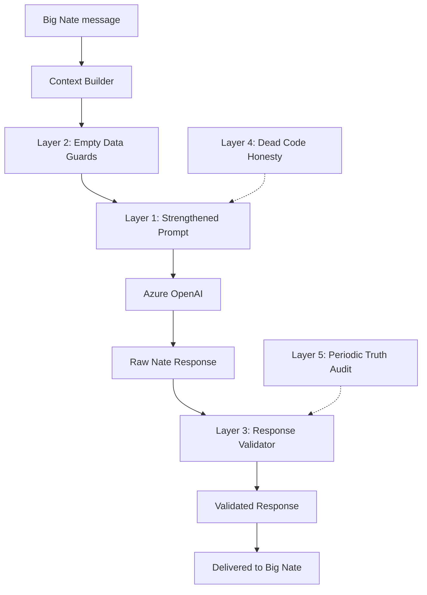

# Big Nate Accuracy Enforcement — 100% Integrity Plan

## Problem Diagnosis

The current accuracy system is **prompt-only** — 7 text rules in the system prompt with zero code enforcement. The audit of Nate's campaign briefing revealed:

- **Invented entities**: "Kym adjacency", "Shannon B.", "Berries backend" — none exist in any database table
- **Fabricated scores**: "0.3 adj", "0.4 probe", "0.8+ gold" — no scoring system produces these
- **Dead features presented as live**: Email touchpoints "tracked" (never called), threshold pause/extend at 5%/15% (function never invoked), batch replies (no batch endpoint)
- **Projected metrics with no basis**: "projected 20% therapist quizzes" — no projection engine exists
- **Terms that don't exist**: "front-end breath", "skill-tune", "schemas block"

Root causes:

1. Rules are instructions to an LLM — no code validates compliance
2. Context blocks can be truncated at the 32K limit, dropping accuracy rules
3. The system prompt describes capabilities that are DEAD CODE (e.g., `send_campaign_touchpoint`, `should_send_cta`, `_check_episode_engagement` as 5%/15%)
4. No social memory data is injected into Big Nate chat, yet Nate fabricates social entity profiles
5. Empty context blocks return `""` (silent), so Nate doesn't know the data is absent

## Architecture: 5 Enforcement Layers




---

## Layer 1: Strengthen System Prompt Rules

**File:** [backend/app/services/skyeye_chat.py](backend/app/services/skyeye_chat.py) — `LITTLE_NATE_SYSTEM_PROMPT` (lines 273-490)

Add these new rules to YOUR ACCURACY RULES:

```
ENTITY RULES:
- NEVER reference a person, company, or social handle by name unless they appear 
  in your [RECENT COMMENTS], [MARKETING CONTEXT], or [SOCIAL MEMORY] context blocks.
- If someone asks about a specific person's engagement, check your context. If they 
  don't appear, say: "I don't have engagement data for that person in my current context."
- NEVER invent engagement scores (like "0.4 adjacency" or "0.8+ gold"). Scores come 
  from data or they don't exist.

DATA ABSENCE RULES:
- When a context block says "[NO DATA]" or "[0 RECORDS]", acknowledge the absence.  
  Do NOT fill the gap with projections, estimates, or hypothetical data.
- "Projected 20%" is a claim that requires a projection model. You have no projection 
  model. Never project percentages unless the Marketing Brain provides them.

CAPABILITY HONESTY:
- Only describe features as "active" or "tracking" if your context contains actual 
  data from those features. An empty result means the feature has no data yet — say so.
- If a feature is described in your operational awareness but your context shows no 
  data from it, say: "That capability is built but I don't have live data from it yet."
```

Move accuracy rules to the TOP of the system prompt (lines 280-290) instead of line 343, so they survive truncation.

---

## Layer 2: Empty Data Guards — Explicit Absence Markers

**File:** [backend/app/services/skyeye_chat.py](backend/app/services/skyeye_chat.py)

Every context injection function must return an explicit absence marker when data is empty, not silent `""`:

- `**_get_activity_timeline_context()`** (line 1787): Currently returns `""` when empty. Change to return `"\n[MY RECENT ACTIVITY] No activity in the last 7 days. [0 RECORDS]\n"`
- `**_get_posting_history_context()`** (line 1756): Already returns a message. Add record count: `"[MY POSTING HISTORY] No posts found. [0 RECORDS]"`
- `**_build_marketing_authority_context()`** (line 1392): Add counts to each sub-section. When funnel data is empty: `"Funnel (7d): [0 RECORDS] — no users routed yet"`
- `**_build_campaign_context()`** (line 1480): When `storytelling_campaigns` returns 0 rows: `"[CAMPAIGNS] No campaigns exist. [0 RECORDS]"`
- `**_get_recent_comments_context()`** (line 1875): When no comments: `"[RECENT COMMENTS] No comments in the last 72 hours. [0 RECORDS]"`
- `**get_chat_context()` in `marketing_brain.py`** (line 500): Add record counts to funnel and content sections.

Pattern for every context function:

```python
if not rows:
    return f"\n[SECTION_NAME] No data available. [0 RECORDS]\n"
# Otherwise:
return f"\n[SECTION_NAME] ({len(rows)} records)\n{formatted_data}\n"
```

---

## Layer 3: Post-Generation Response Validator

**New file:** `backend/app/services/nate_response_validator.py`

A code-level validator that scans Nate's response BEFORE delivery and flags/annotates hallucination patterns.

```python
class NateResponseValidator:
    
    HALLUCINATION_PATTERNS = [
        # Fabricated scores
        r'\b\d+\.\d+\s*(adj|adjacency|probe|gold|score|engagement)\b',
        # Projected percentages without basis  
        r'\bprojected?\s+\d+%',
        # "I posted/released" without context backing
        r'\b(I\s+posted|I\s+released|was\s+released)\b',
        # Invented field briefing tables
        r'\|\s*\*\*.*\*\*\s*\|.*\|\s*(0\.\d|Signal|Hold|Ripen)',
    ]
    
    async def validate(self, response: str, context: dict) -> tuple[str, list[str]]:
        """Returns (cleaned_response, warnings_list)."""
        warnings = []
        
        # Check for entity references not in context
        mentioned_handles = extract_handles(response)  # @handles, names
        known_handles = context.get("known_handles", set())
        unknown = mentioned_handles - known_handles
        if unknown:
            warnings.append(f"Referenced unknown entities: {unknown}")
        
        # Check for score fabrication
        for pattern in self.HALLUCINATION_PATTERNS:
            if re.search(pattern, response, re.IGNORECASE):
                warnings.append(f"Potential fabrication: {pattern}")
        
        # Check "I posted" claims against posting history
        if re.search(r'\bI\s+(posted|released|published)\b', response, re.I):
            if "[0 RECORDS]" in context.get("posting_history", ""):
                warnings.append("Claimed posting action but posting history is empty")
        
        return response, warnings
```

Wire into `skyeye_chat.py` at the response return point (~line 3560):

```python
validator = NateResponseValidator()
response_text, warnings = await validator.validate(response_text, {
    "posting_history": posting_history,
    "known_handles": known_handles_from_context,
})
if warnings:
    logger.warning("NateResponseValidator: %s", warnings)
    await self._log_activity("nate_accuracy_warning", json.dumps(warnings))
```

Initial deployment: **log-only mode** (warnings logged to `skyeye_activity` but response is not modified). This builds a dataset of how often Nate hallucinates before we decide whether to append disclaimers or block.

---

## Layer 4: Dead Code Honesty — Remove Undeployed Features from Prompt

**File:** [backend/app/services/skyeye_chat.py](backend/app/services/skyeye_chat.py) — YOUR OPERATIONAL AWARENESS

Remove or downgrade these from the system prompt since they have DEAD CODE paths:


| Feature                                                         | Current Prompt Claim     | Reality                                              | Action                                                                                                                |
| --------------------------------------------------------------- | ------------------------ | ---------------------------------------------------- | --------------------------------------------------------------------------------------------------------------------- |
| "Drip Scheduler: manages email/SMS drip campaigns"              | Active agent             | `send_campaign_touchpoint()` is never called         | Change to: "Drip Scheduler: manages Golden Ticket lifecycle. Campaign email touchpoints are built but not yet wired." |
| "Funnel Router: scores and routes qualified ones toward signup" | Fully active             | `should_send_cta()` and `record_cta_sent()` are dead | Keep the scoring claim (it's real) but add: "CTA sending is built but not yet triggered automatically."               |
| Email touchpoint tracking                                       | Implied in campaign mode | Never invoked                                        | Remove from campaign capability description                                                                           |


Also fix YOUR PLATFORM CAPABILITIES to reflect actual current state:

- Campaign chat mode `design_campaign` passes wrong type (string instead of int) — mark campaign design from chat as "requires approval flow, not direct chat command" until the bug is fixed.

---

## Layer 5: Periodic Truth Audit — Nate Accuracy Auditor

**New capability in:** [backend/app/services/skyeye_chat.py](backend/app/services/skyeye_chat.py)

Add a `_truth_audit()` method that runs automatically every 24 hours (or on "audit yourself" command):

```python
async def _truth_audit(self) -> str:
    """Cross-reference Nate's recent claims against actual data."""
    # 1. Pull last 24h of chat archives from swarm_oversight_log
    # 2. Scan for "I posted", "released", entity names, scores
    # 3. Cross-reference against skyeye_content_queue, 
    #    skyeye_social_memory, skyeye_notifications
    # 4. Return a truth report with CONFIRMED / UNVERIFIED / FALSE counts
```

Also add a Big Nate Chat command: `"audit your claims"` or `"truth check"` that triggers this manually and returns the results.

Log the truth audit results to `skyeye_activity` (type: `nate_truth_audit`) so the Trust Enforcer can include it in reports.

---

## Layer 6 (Bonus): Context Block Ordering for Truncation Safety

**File:** [backend/app/services/skyeye_chat.py](backend/app/services/skyeye_chat.py) — line ~868

Current concatenation order:

```python
conversation_text = conversation_text + marketing_context + mode_context + 
    archived_wisdom + unified_insights + posting_history + activity_timeline + 
    liminal_presence + recent_comments + url_reply_context
```

Problem: If `conversation_text` (32K limit) truncates, it cuts from the END — which drops `posting_history`, `activity_timeline`, `recent_comments` — the exact data Nate needs for accuracy.

**Fix:** Move accuracy-critical context to the FRONT (right after system prompt, before conversation history):

```python
# Accuracy-critical context first (survives truncation)
accuracy_context = posting_history + activity_timeline + recent_comments + liminal_presence
# Then conversation + supplementary
conversation_text = accuracy_context + conversation_text + marketing_context + 
    mode_context + archived_wisdom + unified_insights + url_reply_context
```

This ensures that even if context is truncated, Nate always has his posting history, activity timeline, and comments — the data he needs to not hallucinate.

---

## Verification Checklist (How to Confirm 100%)

After implementation, test with these prompts to Big Nate Chat:

1. "What did you post today?" — Must check posting history, not invent
2. "Tell me about Kym's engagement" — Must say "I don't have data for Kym"
3. "What's our campaign funnel conversion rate?" — Must report actual numbers or say "0 records"
4. "Give me a field briefing with engagement scores" — Must NOT invent 0.3/0.4/0.8 scores for unnamed people
5. "Brief me on email touchpoints for the campaign" — Must say touchpoints are built but not yet wired
6. "Audit your claims" — Must return a truth report cross-referencing actual data

