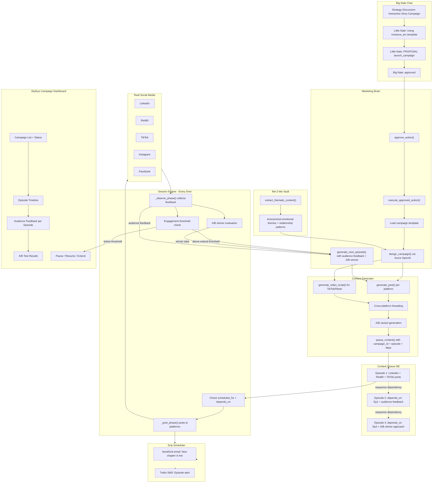

# Little Nate Campaign Execution System + Execution Bridge

## The Scenario (from your screenshot)

You described to Little Nate: A multi-episode interactive romance story with cliff-hangers, audience participation influencing the story, cross-platform posting (video, text, each adapted), content scheduled over days/weeks, and Me-2-Me legacy integration. Little Nate engaged strategically but cannot execute any of it today.

## Current State (the gaps)

### Gap 1: Session Engine is OFF

`ENABLE_SKYEYE_SESSIONS: bool = False` in [backend/app/config.py](backend/app/config.py) line ~159. The entire autonomous posting mechanism is disabled.

### Gap 2: Approval Dead End

`approve_action()` in [backend/app/services/marketing_brain.py](backend/app/services/marketing_brain.py) only sets `status='approved'` in the DB. Nothing connects `marketing_actions` to `skyeye_content_queue`.

### Gap 3: No Campaign Design / Episode Management

- `propose_campaign()` stores a proposal but cannot generate a multi-post plan
- No `design_campaign()` method exists
- No episode tracking, sequencing, or dependency management
- Content queue (`skyeye_content_queue`) has no `campaign_id`, `episode_number`, or `depends_on_post_id` fields

### Gap 4: `scheduled_for` is Broken

The `skyeye_content_queue` table has a `scheduled_for` column, and `queue_content()` populates it, but `get_queue()` never filters by it. Scheduled posts are treated identically to drafts. The session engine will post them immediately instead of waiting.

### Gap 5: No Audience Feedback Loop

- The session engine's `_observe_phase()` reads comments and stores them in `skyeye_social_interactions`
- But this feedback is never routed back into content strategy or campaign episode generation
- No mechanism to adjust a running campaign based on audience response

### Gap 6: Defense/Admin System Prompt Gap

The system prompt tells Little Nate he has defense/admin authority but doesn't explain the structured context blocks (`[HIVE DEFENSE SERVICE STATUS]`, `[THREAT ALERTS]`, etc.) or how to interpret and present them.

## What Already Works

- Platform adapters (LinkedIn, Reddit, TikTok, Instagram, Facebook, Pinterest) all have real OAuth2 + HTTP API calls
- Session engine autonomous posting loop (when enabled)
- Content generation via Azure OpenAI (real)
- `_parse_proposals()` captures `[PROPOSAL: type]` markers from chat
- Social interaction tracking in `skyeye_social_interactions` table
- Me-2-Me vault stores identity crystals, family fabrics, shared memories

---

## Implementation Plan

### Phase 1: Core Execution Bridge (todos 1-5)

#### 1. Enable Session Engine

**File**: [backend/app/config.py](backend/app/config.py)

- Change `ENABLE_SKYEYE_SESSIONS` default to `True`

#### 2. Database Migration: Campaign + Episode Schema

**File**: `backend/migrations/042_campaign_episodes.sql`

New table `storytelling_campaigns`:

- `id SERIAL PRIMARY KEY`
- `title TEXT NOT NULL`
- `narrative_premise TEXT` (the campaign concept from chat)
- `campaign_type TEXT DEFAULT 'standard'` (standard, storytelling, drip, event)
- `platforms TEXT[]` (target platforms)
- `total_episodes INT DEFAULT 1`
- `current_episode INT DEFAULT 0`
- `episode_interval_hours INT DEFAULT 24` (time between episodes)
- `audience_feedback_enabled BOOLEAN DEFAULT TRUE`
- `audience_feedback JSONB DEFAULT '[]'` (aggregated feedback per episode)
- `status TEXT DEFAULT 'designing'` (designing, active, paused, completed)
- `marketing_action_id INT REFERENCES marketing_actions(id)`
- `created_at / updated_at TIMESTAMPTZ`

Add columns to `skyeye_content_queue`:

- `campaign_id INT REFERENCES storytelling_campaigns(id)`
- `episode_number INT`
- `sequence_order INT DEFAULT 0` (within an episode, order across platforms)
- `depends_on_post_id INT` (self-referential: only post after this ID is posted)

#### 3. Fix Scheduled Post Handling

**File**: [backend/app/services/skyeye_content_generator.py](backend/app/services/skyeye_content_generator.py)

Update `get_queue()` to filter:

- `WHERE (scheduled_for IS NULL OR scheduled_for <= NOW())`
- `AND (depends_on_post_id IS NULL OR depends_on_post_id IN (SELECT id FROM skyeye_content_queue WHERE status = 'posted'))`

This makes `scheduled_for` actually work and enforces episode sequencing.

#### 4. Campaign Designer in Marketing Brain

**File**: [backend/app/services/marketing_brain.py](backend/app/services/marketing_brain.py)

Add `async def design_campaign(self, action_id: int) -> Dict`:

1. Read campaign proposal from `marketing_actions` (title, description, parameters)
2. Call Azure OpenAI with a campaign design prompt that returns JSON:
  - Episode plan: `[{episode_number, title, cliff_hanger_hook, platforms: [{platform, content_angle, scheduled_offset_hours}]}]`
3. Create `storytelling_campaigns` record
4. For each episode's platform posts, call `SkyEyeContentGenerator.generate_post()` with episode context
5. Queue each post via `queue_content()` with `campaign_id`, `episode_number`, `sequence_order`, `scheduled_for` (calculated from episode interval), and `depends_on_post_id` (previous episode's last post)
6. Update `marketing_actions` status to `"executing"` with the plan as metadata
7. Return: campaign summary (N episodes, M posts, scheduled timeline)

Add `async def generate_next_episode(self, campaign_id: int, audience_feedback: Dict) -> Dict`:

- Called when a campaign is active and it's time for the next episode
- Reads previous episodes' content and audience feedback
- Generates next episode content, adapted based on audience response
- Queues the new posts

#### 5. Execution Bridge

**File**: [backend/app/services/marketing_brain.py](backend/app/services/marketing_brain.py)

Add `async def execute_approved_action(self, action_id: int) -> Dict`:

- Routes by `action_type`:
  - `launch_campaign` -> `design_campaign()`
  - `shift_content_mix` / `adjust_schedule` -> `update_playbook()`
  - Single post types -> `generate_strategic_post()` + `queue_content()`
- Wire into `approve_action()`: approval triggers execution automatically

### Phase 2: Chat-to-Execution Loop + Audience Intelligence (todos 6-7)

#### 6. Chat Command Protocol

**File**: [backend/app/services/skyeye_chat.py](backend/app/services/skyeye_chat.py)

Update `_handle_command_protocol()`:

- After `brain.approve_action()`, call `brain.execute_approved_action()` so approval immediately starts execution
- Add direct post detection: "post this to LinkedIn", "share on Reddit" -> extract platform + content -> queue directly via `SkyEyeContentGenerator`

#### 7. Audience Feedback Loop + Engagement Thresholds

**File**: [backend/app/services/skyeye_session_engine.py](backend/app/services/skyeye_session_engine.py)

In `_observe_phase()`, after scanning comments on own posts:

- Check if the commented post belongs to a campaign (via `campaign_id` in queue)
- Aggregate sentiment, themes, and notable comments
- Update `storytelling_campaigns.audience_feedback` JSONB for that episode
- **Engagement threshold check**: compare episode engagement (comments, likes, shares) against `min_engagement_threshold` and `extend_engagement_threshold` on the campaign:
  - Below minimum -> auto-pause campaign, notify Big Nate
  - Above extend threshold -> flag for auto-extension (add bonus episodes)
- **A/B winner selection**: if episode had A/B variants, compare engagement metrics and select the winning variant's approach for the next episode
- If `current_episode < total_episodes` and the current episode is fully posted and enough time has elapsed:
  - Call `MarketingBrain.generate_next_episode()` with accumulated feedback + A/B winner data to auto-continue the campaign

### Phase 3: Video Scripts + Me-2-Me Bridge (todos 8-9)

#### 8. Video Script Generation

**File**: [backend/app/services/skyeye_content_generator.py](backend/app/services/skyeye_content_generator.py)

Add `async def generate_video_script(self, platform: str, topic: str, context: Dict) -> Dict`:

- Calls Azure OpenAI with a video-specific prompt
- Returns structured output:
  - `voiceover_text`: the spoken narration
  - `shot_descriptions`: list of visual scene descriptions (shot 1, shot 2, etc.)
  - `on_screen_text`: text overlays per shot
  - `music_mood`: suggested audio mood
  - `duration_estimate_seconds`: estimated video length
  - `hashtags`: platform-appropriate hashtags
- Platform-specific formatting:
  - TikTok: 15-60 second format, punchy, hook in first 3 seconds
  - Instagram Reels: 30-90 seconds, story-driven, aesthetic
  - YouTube Shorts: 60 seconds, educational or emotional
- Safety filtered (same pipeline as text content)
- Integrated into `design_campaign()` -- when a campaign targets video platforms, auto-generate video scripts alongside text posts

#### 9. Me-2-Me Legacy Content Bridge

**File**: [backend/app/services/me2me/legacy_vault_me2me.py](backend/app/services/me2me/legacy_vault_me2me.py) (add method)
**File**: [backend/app/services/marketing_brain.py](backend/app/services/marketing_brain.py) (consume)

Add `async def extract_thematic_content(self, content_type: str) -> Dict` to `LegacyVaultMe2Me`:

- Extracts anonymized thematic content from identity crystals and family fabrics
- Returns aggregated emotional themes, relationship patterns, life transitions -- NO PII, NO user-identifiable data
- Content types: `"emotional_themes"`, `"relationship_patterns"`, `"life_transitions"`, `"family_dynamics"`
- Sources:
  - Identity crystals -> `core_values`, `life_themes`, personality patterns
  - Family fabrics -> `shared_memories` themes (anonymized)
  - Imprint entries -> emotion distributions, session theme frequencies

In `MarketingBrain.design_campaign()`, when campaign_type is `"storytelling"`:

- Call `extract_thematic_content("relationship_patterns")` and `extract_thematic_content("life_transitions")`
- Inject these themes into the Azure OpenAI campaign design prompt
- This gives the romance story (from your screenshot) grounding in real emotional patterns Little Nate has witnessed

### Phase 4: Cross-Platform Threading + A/B Testing + Drip Integration (todos 10-13)

#### 10. Cross-Platform Story Threading

**File**: [backend/app/services/skyeye_content_generator.py](backend/app/services/skyeye_content_generator.py)

When generating episode content across multiple platforms:

- After all posts for an episode are generated, add cross-references:
  - LinkedIn post footer: "The story continues in video on TikTok / Join the discussion on Reddit"
  - Reddit post: "Visual version on Instagram / Professional angle on LinkedIn"
  - TikTok caption: "Full story in comments or on LinkedIn"
- Store `cross_thread_refs JSONB` on each queue item: `{"linkedin": queue_id_1, "reddit": queue_id_2, "tiktok": queue_id_3}`
- After posting, update refs with actual post URLs so future episodes can link back

#### 11. A/B Testing Per Episode

**File**: [backend/app/services/marketing_brain.py](backend/app/services/marketing_brain.py)

When `design_campaign()` is called with `ab_test_enabled: true`:

- For each episode, generate 2 variants of the hook/opening:
  - Variant A: emotional hook ("She found the letter he'd hidden for 30 years...")
  - Variant B: curiosity hook ("What happens when an AI helps you write a love letter to someone who's already gone?")
- Post variant A to half the platforms, variant B to the other half
- Tag queue items with `ab_variant: "A"` or `ab_variant: "B"`
- In session engine `_observe_phase()`: compare engagement per variant after 24h
- Winner's approach is used for the next episode's content generation context

#### 12. Email/SMS Drip Integration

**File**: [backend/app/services/drip_scheduler.py](backend/app/services/drip_scheduler.py) (add campaign hook)
**File**: [backend/app/services/marketing_brain.py](backend/app/services/marketing_brain.py) (trigger)

Add campaign episode triggers to drip scheduler:

- `storytelling_campaigns` gets a `drip_touchpoints JSONB` field: `[{episode_number: 3, drip_type: "email", template: "new_chapter_alert"}]`
- When session engine posts an episode that has a drip touchpoint, call `drip_scheduler.trigger_campaign_touchpoint(campaign_id, episode_number)`
- Drip scheduler sends email/SMS: "The next chapter is live. [Read Episode 3]"
- Uses existing SendGrid (email) and Twilio (SMS) integrations

#### 13. Campaign Templates

**File**: `backend/migrations/042_campaign_episodes.sql` (add `campaign_templates` table)
**File**: [backend/app/services/marketing_brain.py](backend/app/services/marketing_brain.py)

`campaign_templates` table:

- `id SERIAL PRIMARY KEY`
- `name TEXT UNIQUE` (e.g., `romance_arc`, `heros_journey`, `community_challenge`, `educational_series`, `testimonial_showcase`)
- `description TEXT`
- `episode_structure JSONB` (default episode plan with placeholders)
- `default_platforms TEXT[]`
- `default_episode_count INT`
- `default_interval_hours INT`
- `narrative_prompts JSONB` (AI prompt templates per episode with `{{audience_feedback}}`, `{{previous_episode}}`, `{{me2me_themes}}` placeholders)
- `built_in BOOLEAN DEFAULT TRUE`

Pre-seed templates:

- **romance_arc**: 5-7 episodes, emotional build with cliff-hangers, audience votes on story direction
- **heros_journey**: 4-6 episodes, personal growth narrative (departure, trials, transformation, return)
- **community_challenge**: 3-5 episodes, audience participation tasks, leaderboard, recap posts
- **educational_series**: 4-8 episodes, topic deep-dives with discussion prompts
- **testimonial_showcase**: 3-5 episodes, anonymized client moments woven into a narrative

In `design_campaign()`: if `template_name` is provided, load template and use its `narrative_prompts` and `episode_structure` instead of generating from scratch. Little Nate can say "Let's use the romance arc template" and the system has a pre-built structure ready.

### Phase 5: SkyEye Campaign Dashboard (todo 14)

#### 14. Campaign Management Tab in SkyEye

**File**: [dashboard/skyeye.html](dashboard/skyeye.html)

Add a new "Campaigns" tab to the SkyEye dashboard sidebar (after "Marketing Brain"):

**Campaign List View:**

- Active/paused/completed campaigns with status badges
- Campaign title, type, template used, platforms
- Progress bar: `current_episode / total_episodes`
- Engagement score (aggregate across episodes)

**Campaign Detail View (click into a campaign):**

- Episode timeline: visual timeline showing each episode's posts across platforms
- Per-episode audience feedback: comment counts, sentiment summary, notable quotes
- A/B test results: which variant won per episode, engagement delta
- Cross-platform thread map: which posts link to which
- Controls: Pause, Resume, Extend (+N episodes), Cancel

**API endpoints needed** (add to [backend/app/routers/skyeye_api.py](backend/app/routers/skyeye_api.py)):

- `GET /api/skyeye/campaigns` -- list all campaigns with summary stats
- `GET /api/skyeye/campaigns/{id}` -- campaign detail with episode data
- `POST /api/skyeye/campaigns/{id}/pause` -- pause a running campaign
- `POST /api/skyeye/campaigns/{id}/resume` -- resume a paused campaign
- `POST /api/skyeye/campaigns/{id}/extend` -- add more episodes
- `GET /api/skyeye/campaigns/{id}/feedback` -- audience feedback per episode

Register the tab in the `switchTab()` function and add data loading.

### Phase 6: System Prompt + Documentation (todos 15-17)

#### 15. System Prompt: Defense + Admin Context Awareness

**File**: [backend/app/services/skyeye_chat.py](backend/app/services/skyeye_chat.py)

Add structured context parsing instructions to `LITTLE_NATE_SYSTEM_PROMPT`:

- Defense mode: explain `[HIVE DEFENSE SERVICE STATUS]`, `[THREAT ALERTS]`, `[GUARDIAN FIBRE]`, `[WEBHOOK FORTRESS]` blocks. Instruct GREEN/AMBER/RED posture reporting.
- Admin mode: explain `[USER STATS]`, `[SUBSCRIPTIONS]`, `[TIER BREAKDOWN]`, `[AUDIT LOG]`. Instruct executive-level summaries.

#### 16. System Prompt: Full Campaign Awareness

**File**: [backend/app/services/skyeye_chat.py](backend/app/services/skyeye_chat.py)

Add to `LITTLE_NATE_SYSTEM_PROMPT`:

- Autonomous operation by default (no approval needed for routine posts)
- Campaign design capability: when Big Nate describes a campaign idea and approves, Little Nate designs multi-episode plans using templates or from scratch
- Interactive storytelling: audience feedback influences next episodes
- Video script generation: you can create TikTok/Reels scripts as part of campaigns
- Me-2-Me integration: you draw on anonymized emotional themes from the vault
- A/B testing: you can propose A/B episode variants to optimize engagement
- Cross-platform threading: episodes are interconnected across platforms
- Email/SMS touchpoints: campaigns can trigger subscriber notifications at key episodes
- `[PROPOSAL: launch_campaign]` triggers the full design pipeline

#### 17. Documentation Update

**File**: [docs/SOVEREIGN_COMMAND_README.md](docs/SOVEREIGN_COMMAND_README.md)

Add comprehensive documentation:

- Campaign execution flow (proposal -> approval -> design -> queue -> post -> feedback -> next episode)
- Campaign templates (list all 5, describe structure)
- Video script generation capabilities
- Me-2-Me content bridge (what data flows, privacy guarantees)
- A/B testing per episode
- Engagement thresholds (auto-pause, auto-extend)
- Cross-platform story threading
- Email/SMS drip touchpoints
- Platform control modes (full/approval/observation)
- Campaign dashboard tab (UI guide)
- Defense/Admin response format guidance

---

## Architecture After Changes

## The Full Campaign Loop (your screenshot scenario)

1. **You describe the campaign** to Little Nate in Big Nate Chat (the multi-episode romance story with cliff-hangers, audience participation, Me-2-Me legacy integration)
2. **Little Nate selects a template** (e.g., `romance_arc`) or designs from scratch, pulling anonymized emotional themes from the Me-2-Me vault for authentic storytelling
3. **Little Nate proposes** `[PROPOSAL: launch_campaign]` with the narrative premise, episode structure, and target platforms
4. **You approve** ("go for it")
5. `**design_campaign()**` calls Azure OpenAI to generate all episodes:
  - Text posts for LinkedIn, Reddit, Facebook (adapted per platform voice)
  - Video scripts for TikTok and Instagram Reels (voiceover, shots, on-screen text)
  - A/B variants for episode hooks (emotional vs. curiosity)
  - Cross-platform references linking each platform's post to the others
  - Email/SMS drip touchpoints at key episodes
6. **All posts are queued** with `campaign_id`, `episode_number`, `scheduled_for` timestamps, `depends_on_post_id` dependencies, and `cross_thread_refs`
7. **Session engine posts Episode 1** when `scheduled_for` arrives, respecting dependencies, and triggers email/SMS for configured touchpoints
8. **Session engine observes** audience reactions -- comments, sentiment, engagement metrics
9. **Engagement thresholds** are checked: if engagement drops below minimum, campaign auto-pauses and notifies you. If it exceeds the extend threshold, it flags for bonus episodes.
10. **A/B evaluation**: after 24h, compare variant A vs B engagement. Winner's approach feeds into next episode generation.
11. **When it's time for Episode 2**, `generate_next_episode()` reads audience feedback, A/B winner data, and generates content that responds to what the audience said
12. **The story continues**, adapting to audience participation, with each episode informed by real reactions, until all episodes are posted or you extend/pause the campaign
13. **SkyEye Campaign Dashboard** shows you the full campaign in real time: episode timeline, per-episode feedback, A/B results, and pause/resume/extend controls

