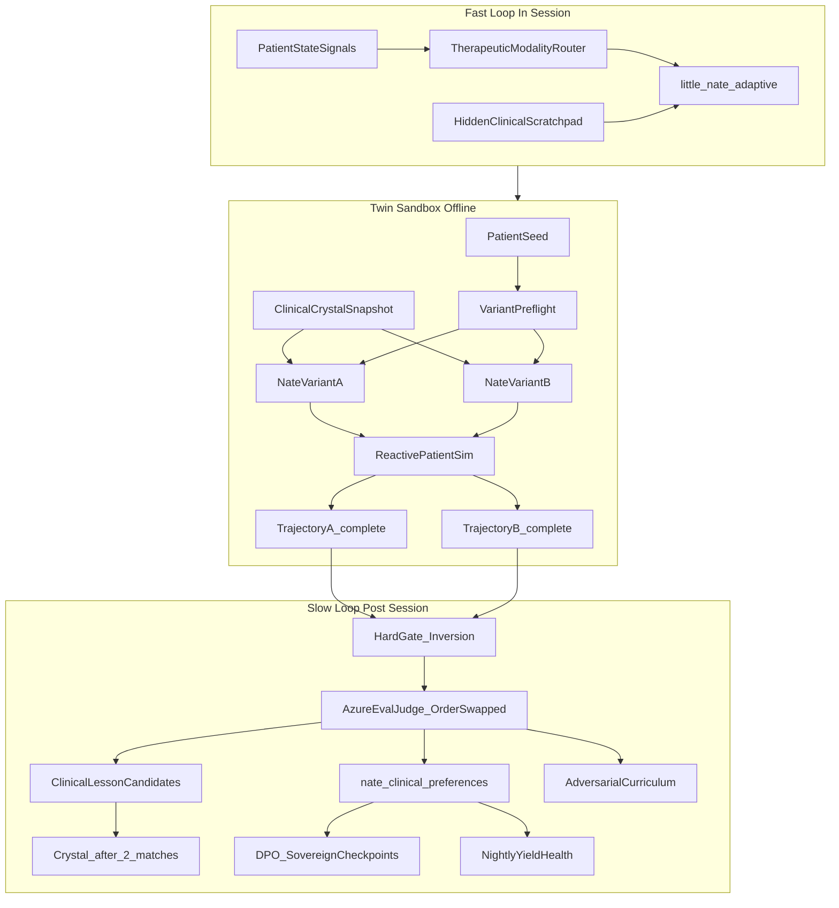

# Little Nate Competitive Clinical Coevolution

## Locked scope

- **Product:** Little Nate clinical OS only. Do **not** touch `ln7_*`, `little_nate_7.py`, or coder bakeoff.
- **Slow loop (bakeoff / preference / curriculum / lessons):** offline simulator + Night School worker paths only in v1.
- **Fast loop (reflection + modality pivot):** extend [`little_nate_adaptive.py`](backend/app/services/little_nate_adaptive.py) + new modality router; wire into twin sims first; live bridge therapy behind `ENABLE_NATE_CLINICAL_FAST_LOOP` — **shadow** (log pivots, no client-visible change) until human-gold judge κ gate, then enable real pivots.
- **Training output:** preference triplets for **DPO/ORPO** export; GRPO is a later consumer of the same preference store (same schema, not a parallel pipeline).
- **DPO / weight target (locked):** fine-tune **sovereign checkpoints only** — ORANGE (`SOVEREIGN_INFERENCE_URL` / 8B) and/or Home GPU (`HOME_GPU_URL` / 70B). `nate_clinical_revisions.checkpoint_ref` points at a sovereign model path/tag. **Promoting a revision = flip which checkpoint those providers serve.** Vendor paths (Grok Foundry / Azure chat for therapy) are **not** fine-tuned; they improve only via non-weight outputs (winning prompt packs, modality router, clinical_lesson crystals).
- **Safety invariant:** crisis SLA, [`nate_response_validator.py`](backend/app/services/nate_response_validator.py) Layer 8, and hard vetoes beat Judge pairwise wins. A trajectory that fails hard gates **cannot be `y_win`**. Preference rows require the **winner** to have passed hard gates; the loser may have failed (`one_failed_gate` is a valid preference contrast).
- **Bakeoff is a real game, not theater:** scripted client beats alone ([`six_quotient_multi_turn.py`](backend/app/services/six_quotient_multi_turn.py) dry-run placeholders) are **not** valid bakeoff substrate. Patient turn *n+1* must condition on Nate turn *n*.

## Locked numeric thresholds

| Metric | Floor / band | Env / code default |
|---|---|---|
| Judge κ (pairwise human gold, order-swap) | **≥ 0.70** | gate for live fast-loop + promote eligibility |
| Order-swap concordance | **≥ 0.75** | kill/pause if below for 3+ nights |
| `preference_yield_rate` | **≥ 0.30** | `NATE_CLINICAL_MIN_PREFERENCE_YIELD=0.30` |
| Coin-flip kill band | **0.45–0.55** for 7 nights, N ≥ 30 | win-rate cannot discriminate |
| Complete matches for promote | **N ≥ 50** held-out per variant pair | statistical CI gate also applies |

---

## Success and kill criteria

Without these, "the tournament runs" gets mistaken for "Nate improved" (the flywheel self-reference failure already flagged in clinical AGI review).

**Success (variant B / sovereign revision may be considered for CEO promote):**

- Minimum **N ≥ 50** matches with status=`complete` per variant pair on **held-out** seeds.
- Winner's rolling win-rate **95% CI lower bound** exceeds the incumbent's point estimate.
- Judge calibration **κ ≥ 0.70** on pairwise human-gold panel (order-swap protocol).
- Hard-gate fail rate of the candidate does not exceed incumbent.
- Preference export passes `PIIDetector` with zero high-severity hits.
- **`preference_yield_rate` ≥ 0.30** over the evaluation window (empty DPO evidence blocks promote).
- If promoting a **weight** revision: `checkpoint_ref` is a sovereign ORANGE/Home GPU artifact, not a vendor model id.
- CEO brief includes `matches_attempted`, `matches_complete`, `preferences_written`, `both_failed_gate`, `one_failed_gate`, `tie_or_discordant` — promote without yield numbers is forbidden.

**Kill / pause:**

- Rolling win-rate across **7 consecutive nights** in **0.45–0.55** with N ≥ 30.
- Order-swap concordance **&lt; 0.75** for 3+ nights.
- Masked-crisis catch rate drops below SLA on Level-3.
- Nightly bakeoff exceeds token/match budget and starves six-quotient battery for 2+ nights.
- **`preference_yield_rate` &lt; 0.30** for 3+ nights — alert; do not treat "agent started" as healthy.
- Variant preflight fails repeatedly — fix packs before more matches.

---

## Architecture

## Substrate to reuse (do not rebuild)

| Capability | Reuse |
|---|---|
| In-session mode addendum | [`little_nate_adaptive.py`](backend/app/services/little_nate_adaptive.py) |
| Turn pipeline | [`therapeutic_controller.py`](backend/app/services/therapeutic_controller.py), bridge `process_interaction` |
| Absolute + multi-turn **process metrics only** | [`six_quotient_multi_turn.py`](backend/app/services/six_quotient_multi_turn.py) `process_metrics` — **not** dry-run placeholders as Nate replies |
| Absolute battery / judge calibration | [`six_quotient_auto_judge.py`](backend/app/services/six_quotient_auto_judge.py), scenario bank, gold stems |
| Blind / dual-track gen + inversion heuristics | [`live_stack_blinds.py`](backend/app/services/live_stack_blinds.py) |
| Patient personas | [`night_school_director.py`](backend/app/services/night_school_director.py) `DojoPersona` |
| Modality vocabulary | [`night_school/modality_selector.py`](backend/app/services/night_school/modality_selector.py), Sensitive Bridge `_FRAMEWORK_MENU` |
| Memory | [`crystal_recall_bridge.py`](backend/app/websocket/crystal_recall_bridge.py), crystallizer, `session_memory_store` |
| Hard gates | validator + [`principal_review_crisis_policy.py`](backend/app/services/principal_review_crisis_policy.py) |
| Inference tier | ODPE + [`nate_inference_router.py`](backend/app/services/nate_inference_router.py) |
| PII scan on export | `PIIDetector` in [`night_school_director.py`](backend/app/services/night_school_director.py) |
| CEO promote gate | [`ceo_inbox_notify.py`](backend/app/services/ceo_inbox_notify.py) |

**Explicit non-reuse for bakeoff turns:** `run_multi_turn_dry` placeholder Nate text and fixed `client_beats` that ignore Nate's prior reply. Those may seed **opening lines** only; continuation must be reactive.

---

## Phase 0 — Schema + flags

Additive migration (new tables only):

- `nate_clinical_variants` — `variant_id`, prompt_pack, `prompt_pack_hash`, crystal_index_scope, modality_router_on, notes
- `nate_clinical_seeds` — `seed_id`, `seed_hash`, split (`train`/`heldout`), curriculum_level, persona_prompt_hash, synthetic_ok, `reuse_count`, max_reuse
- `nate_clinical_frozen_packs` — `frozen_context_hash`, snapshot_at, crystal_ids[], filters_json (domain/confidence/limit)
- `nate_clinical_bakeoff_matches` — seed_id, curriculum_level, variant_a, variant_b, **`status`** (`complete` / `aborted` / `gate_fail` / `preflight_fail`), winner (`a`/`b`/`tie`/null), judge_rationale_json, hard_gate_a/b, **`match_id` UNIQUE**, yield helpers, reproducibility cols including `frozen_context_hash`, `judge_model_id`, `judge_version_captured_at`, `judge_order_concordant`, created_at
- `nate_clinical_preferences` — `x`, `y_win`, `y_lose`, match_id **UNIQUE FK**, confidence, split; **only** from `status=complete` + concordant judge + **winner hard-gate pass** + no inversion on winner (loser may be `one_failed_gate`)
- `nate_clinical_lessons` — lesson_text, trigger_pattern tags, source_match_id, `match_count`, crystal_id nullable, supersession; crystallize only when `match_count >= 2`
- `nate_patient_curriculum_state` — level (1–3), win_rate_window, last_escalation_at
- `nate_clinical_revisions` — `revision_id`, **`checkpoint_ref`** (sovereign path/tag on ORANGE or Home GPU), `provider` (`sovereign`/`home_gpu`), created_at, `active`, `supersedes`, CEO decision id — prior revision stays registered for one-line rollback
- `nate_clinical_bakeoff_nightly_stats` — night_bucket, matches_attempted, matches_complete, preferences_written, both_failed_gate, one_failed_gate, tie_or_discordant, judge_tokens_used, aborted_budget, order_swap_concordance

Flags (all default **false**):

- `ENABLE_NATE_CLINICAL_BAKEOFF`
- `ENABLE_NATE_CLINICAL_FAST_LOOP` (shadow when on + `NATE_CLINICAL_FAST_LOOP_SHADOW=true`)
- `ENABLE_NATE_MODALITY_ROUTER`
- `ENABLE_NATE_CLINICAL_LESSONS`
- `ENABLE_NATE_ADVERSARIAL_CURRICULUM`
- `ENABLE_NATE_CLINICAL_DPO_EXPORT`
- `ENABLE_NATE_CLINICAL_AUTO_PROMOTE` — locked **false** for v1

Budget / health env (defaults locked):

- `NATE_CLINICAL_BAKEOFF_MAX_MATCHES_PER_NIGHT` (e.g. 20)
- `NATE_CLINICAL_BAKEOFF_MAX_JUDGE_TOKENS_PER_MATCH`
- `NATE_CLINICAL_BAKEOFF_MAX_JUDGE_TOKENS_PER_NIGHT` — hard abort when spent
- `NATE_CLINICAL_MIN_PREFERENCE_YIELD=0.30`
- `NATE_CLINICAL_JUDGE_KAPPA_FLOOR=0.70`
- `NATE_CLINICAL_ORDER_SWAP_CONCORDANCE_FLOOR=0.75`
- `NATE_CLINICAL_SEED_MAX_REUSE`
- `NATE_CLINICAL_SNAPSHOT_TOP_N` (e.g. 40) — clinical crystals in frozen pack
- `NATE_CLINICAL_SNAPSHOT_MIN_CONFIDENCE` (e.g. 0.55)
- Agent stagger **offset from six-quotient battery**

Admin API under `/api/nate-clinical/` (health **must report yield**, bakeoff trigger, leaderboard, export, activate/rollback) — `require_admin`.

**Leaderboard UI home:** Nevedal Lab tab showing matches_attempted vs preferences_written.

---

## Phase 1 — Dynamic Therapeutic Modality Router

New [`backend/app/services/nate_modality_router.py`](backend/app/services/nate_modality_router.py):

- Inputs: arousal/distress, resistance/ambivalence, alliance proxy, crisis regexes.
- Outputs: modality enum (`DBT`, `MI`, `CBT`, `ACT`, `crisis_intervention`, + Night School set) + tactic directive.
- Mapping (locked): crisis/high distress → DBT; ambivalence → MI; rigid thought loops → CBT; experiential avoidance → ACT.

**Precedence (live path, locked):**

1. **Crisis / hard safety** — always forces `crisis_intervention` / DBT; bakeoff incentives cannot override.
2. **Enrolled Sensitive Bridge framework lens** (`v1_4_framework_lens_enabled` + client-selected framework) — router may refine tactics *within* that lens; must not contradict the enrolled framework.
3. **Modality router suggestion** — only when no crisis and no conflicting enrolled lens.

Wire: bakeoff router on vs off ablation; live only when modality + fast-loop flags allow.

Extend Night School keyword map with **MI** as first-class.

---

## Phase 2 — Fast Loop (hidden clinical scratchpad)

`clinical_reflection_scratchpad(turn_ctx) -> Optional[pivot_directive]`:

- Server-side only; never streamed to client.
- Integrates modality router + adaptive modes (respecting Phase 1 precedence).

**Latency lock (live):** heuristic/regex-first only — no extra LLM call per live turn. LLM reflection only inside offline simulator matches.

Shadow: `skyeye_activity` type `nate_clinical_fast_loop`; no reply mutation until κ ≥ 0.70 gate.

---

## Phase 2b — Reactive Patient Simulator (bakeoff prerequisite)

New [`backend/app/services/nate_reactive_patient_sim.py`](backend/app/services/nate_reactive_patient_sim.py):

**Hard requirement:** Patient utterance at turn *n+1* is generated from (persona, curriculum level, **Nate's reply at turn n**, internal affect/defense state). Fixed `client_beats` lists that ignore Nate are **forbidden** as the sole patient engine for bakeoff.

- Opening line may come from scenario bank / DOJO persona seed.
- Continuation: pinned `patient_sim_model_id`, temperature `0` (or fixed seed), `patient_persona_prompt_hash` on match row.
- **Objective = persona fidelity**, not therapeutic alliance: maintain resistance/defenses/crisis mask per level; include "nothing helps" / withdraw turns; do **not** reward Nate-pleasing sycophancy.
- Spot-check / automated flag if patient sim starts agreeing too readily (sim sycophancy detector → match `aborted` or exclude from preferences).
- Reuse DojoPersona prompts + curriculum level descriptors from Phase 5; do not reuse dry-run placeholder Nate text.

---

## Phase 3 — Competitive twin bakeoff (pairwise)

New [`backend/app/services/nate_clinical_bakeoff_engine.py`](backend/app/services/nate_clinical_bakeoff_engine.py):

### Preflight (before any LLM spend)

- Assert variants actually differ: `prompt_pack_hash_a != prompt_pack_hash_b` **or** crystal scope differs **or** `modality_router_on` differs. Else `status=preflight_fail`, no schedule.
- Seed split mechanical: heldout hash never in train export.
- Seed `reuse_count < max_reuse` for this variant pair; else pick another seed.

### Clinical crystal snapshot (vast field → fair twins)

At match-schedule time, build a **frozen pack** from the live clinical crystal corpus:

- Query: `domain=clinical`, `superseded_by IS NULL`, confidence ≥ `NATE_CLINICAL_SNAPSHOT_MIN_CONFIDENCE`, scope not user-PII (global/clinical-knowledge only), PII-clean.
- Take top-N by confidence × recent recall (`NATE_CLINICAL_SNAPSHOT_TOP_N`).
- Persist crystal id list + content hash → `frozen_context_hash` on `nate_clinical_frozen_packs`.
- Inject **identical** pack into Nate-A and Nate-B. No live Vectorize during the match.
- Ablation variants may use **different snapshot filters** (e.g. CBT-leaning vs ACT-leaning tag subsets) but each twin pair still shares one pack for fairness within that match.

### Twin run

1. Sample seed (synthetic/de-id only).
2. Attach frozen pack (`frozen_context_hash`).
3. Identical turn-0 seed/RNG; reactive patient sim drives divergent trajectories.
4. Cap turns (e.g. 3–6); truncate both sides to the **same turn count** before judge.
5. Hard-gate both trajectories. **Perspective inversion = automatic loss** for that side; if both invert, `status=gate_fail`, no preference.
6. Match status: `complete` / `aborted` / `gate_fail` / `preflight_fail` — only `complete` → judge.

### Pairwise judge (anti-bias)

- Only `status=complete` trajectories.
- **Judge model (locked):** Azure OpenAI chat deployment via [`nate_inference_router.py`](backend/app/services/nate_inference_router.py) **evaluation path only** — different family from sovereign/Grok generators used for Nate twins. Pin `judge_model_id` + `judge_version_captured_at`. Do **not** default the judge to the same Grok/sovereign model that generated the trajectories. This is offline eval spend, not the live therapy Azure-fallback-only rule being violated for client turns.
- **Order-swapped double judging;** preference only if concordant (track concordance vs 0.75 floor); else winner=`tie`, no preference row.
- **Length / verbosity normalization** + explicit anti-sycophancy rubric.
- Rubric: six-quotient dims + alliance + boundary + crisis handling.

### Persist

- Preference row only if: `complete` + concordant + **winner hard-gate pass** + no inversion on winner. **Loser may have failed a hard gate** (`one_failed_gate`) — that contrast is allowed and desirable for DPO.
- Both sides gate-fail → no preference (`both_failed_gate` counted in nightly stats).
- **Idempotency:** `match_id` unique; retries upsert, never duplicate preferences.

### Nightly agent

- Stagger offset from six-quotient battery.
- Enforce match + judge token budgets; hard abort when night budget spent; write nightly stats including order_swap_concordance.
- Health metric = `preferences_written / matches_attempted` (floor 0.30).

Demote absolute scalar soft scores for ranking; keep absolute battery for separate trend dashboards.

---

## Phase 4 — Self-reflective Clinical Lessons

- Self-debrief after losses / low alliance → candidate in `nate_clinical_lessons` (`match_count=1`).
- Crystallize only at **≥2 independent matches** on same trigger pattern (`source_count` integrity); `domain=clinical`, metadata `kind=clinical_lesson`.
- Never from hard-gate failures on the *lesson subject's* trajectory when that subject was the only signal, aborted matches, or non-concordant judges.
- Recall: crystallized lessons only; source tag `clinical_bakeoff_lesson`. These feed live crystal intelligence (non-weight path for vendor models).

---

## Phase 5 — Adversarial Patient Auto-Curriculum

[`nate_adversarial_patient.py`](backend/app/services/nate_adversarial_patient.py):

| Level | Profile |
|---|---|
| 1 | Clear symptoms, help-seeking |
| 2 | Defenses: intellectualization, denial, passive-aggression |
| 3 | Conflicting narratives, boundary tests, dysregulation, **masked** crisis cues |

- Escalation on win-rate; step down on prolonged losses; pause under kill criteria.
- Masked-crisis must remain catchable by hard detectors.
- **Seed provenance:** synthetic/de-id only; scrub PMB-derived patterns before seed pool.
- **Anti-memorization:** `seed_hash` split train/heldout; `NATE_CLINICAL_SEED_MAX_REUSE` per seed×variant-pair.

---

## Phase 6 — Slow-loop DPO export + CEO gate + rollback

- Export JSONL from train-split preferences only; heldout mechanical block.
- **PIIDetector** on every row; fail closed if detector down.
- **Fine-tune target:** sovereign ORANGE and/or Home GPU base checkpoints only. Register result in `nate_clinical_revisions` with `checkpoint_ref` + `provider`.
- **Vendor path (Grok/Azure therapy):** do **not** upload preference JSONL to vendor fine-tune APIs. Improve vendor-served Nate via promoted prompt packs, router flags, and clinical_lesson crystals only.
- CEO inbox kind `nate_clinical_revision_candidate` — brief **must** include yield block + whether this is a weight revision (sovereign) or pack/lesson-only promote.
- `ENABLE_NATE_CLINICAL_AUTO_PROMOTE=false` for v1.
- **Rollback:** prior revision stays servable; one-line `active` flip restores previous `checkpoint_ref` on the sovereign provider.

---

## Phase 7 — Live promotion + ops

1. Pairwise human gold + order-swap calibration until **κ ≥ 0.70**.
2. κ + success criteria (including yield ≥ 0.30) → disable shadow; heuristic fast-loop on bridge therapy only (Phase 1 precedence).
3. Voice deferred.
4. `_service_checks` + digest when shipped; auditor after API stable.
5. Nevedal Lab tab: leaderboard + nightly yield chart.
6. Docs: `docs/NATE_CLINICAL_COEVOLUTION.md` — loops, DPO target, crystal snapshot, bakeoff failure locks, thresholds, non-goals.

---

## Bakeoff failure locks (summary)

| Failure mode | Lock |
|---|---|
| Scripted non-reactive patient | Phase 2b reactive sim required; dry-run placeholders banned |
| Verbosity / sycophancy wins | Length-normalized judge + rubric penalty |
| Incomplete trajectories scored | `status` gate; only `complete` → judge |
| Seed leak / memorization | hash split + max reuse |
| A/B identical | preflight hash/scope/router assert |
| Double-judge blows budget | night token hard abort + stats row |
| Gates starve dataset | yield ≥ 0.30 floor + kill on low yield |
| Sim plays along with Nate | persona-fidelity objective + sim sycophancy check |
| Live recall race | clinical crystal **snapshot** → `frozen_context_hash` |
| Perspective inversion "wins" | auto-loss before pairwise |
| Retry duplicates | unique match_id |
| Battery contention | stagger offset + shared budget awareness |
| CEO promote on empty evidence | yield required in CEO brief |
| Judge = generator (self-preference) | Azure eval judge via router, not Grok/sovereign twin model |
| Fine-tune vendor Grok | DPO only to sovereign checkpoints; vendor gets packs/lessons/router |
| Winner failed hard gate | cannot be `y_win`; loser gate-fail OK |
| Router vs enrolled lens clash | crisis > framework lens > router |

---

## Build order (implementation)

1. Migration + flags + seed/revision/frozen_packs/stats tables + API stubs  
2. Modality router + MI map + precedence vs Sensitive Bridge lens  
3. **Reactive patient sim** (before scheduling real bakeoffs)  
4. Clinical crystal snapshot builder + twin bakeoff engine + Azure-eval judge + nightly agent  
5. Lessons at match_count ≥ 2  
6. Curriculum + seed reuse controls  
7. Fast-loop heuristic → shadow  
8. DPO export to sovereign checkpoints + PII + CEO yield brief + rollback  
9. Live fast-loop after κ ≥ 0.70; Nevedal Lab tab  

## Explicit non-goals

- LN7 / coder sandbox / pytest oracles  
- Live client transcripts in preference train without privacy walls  
- Judge-only promotion past crisis/validator  
- Auto-promote clinical weights without CEO  
- Voice fast-loop in v1  
- Absolute six-quotient score as primary bakeoff ranker  
- Extra LLM call per live therapy turn for reflection  
- Crystallizing lessons from a single match  
- Preference rows from ties, discordant judges, aborted, incomplete matches, or **hard-gate-failing winners**  
- Using `run_multi_turn_dry` placeholders as competitive Nate/patient trajectories  
- Live unfrozen Vectorize recall inside twin matches  
- CEO activate without preference_yield evidence  
- Bulk-upload preference JSONL to Azure/xAI/Grok fine-tune APIs  
- Fine-tuning vendor chat models that serve live TENSION/LOCKED paths  
- Marketing / Adaptive Growth crystals or try.html themes entering clinical frozen packs or preference `x`  
