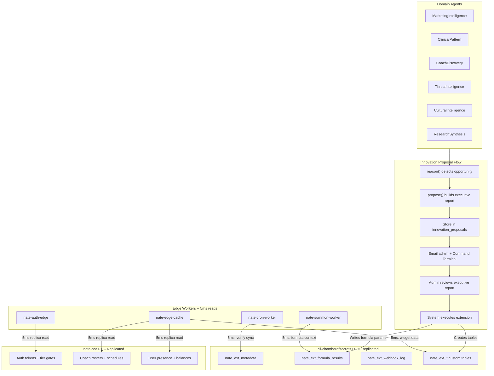

# Nate Creative Extension System (v2 -- D1 Replication Enabled)

## D1 Database Topology

Both D1 databases have read replication enabled, providing ~5ms reads from nearest edge vs ~150ms to US primary.


| D1 Database            | ID                       | Role                                                                            | Replication |
| ---------------------- | ------------------------ | ------------------------------------------------------------------------------- | ----------- |
| `nate-hot`             | `8dcd53ad-a6fb-49f4-8ca` | Operational: auth, roster, schedule, balance, gates                             | ENABLED     |
| `cli-chamberofsecrets` | `bedabdd5-ab9d-4a56-b2`  | Creative sandbox: Nate extensions, formula results, CLI proposals, webhook logs | ENABLED     |


**Workers must use the Sessions API** for write consistency. Reads go to nearest replica (5ms). Writes go to primary. This is a code change in every worker that does D1 writes.




---

## Part 1: Migration and Schema

### Migration 139: `innovation_proposals` + `nate_extensions` (PostgreSQL)

File: [backend/migrations/139_nate_extensions.sql](backend/migrations/139_nate_extensions.sql)

These tables live in PostgreSQL (the source of truth for proposals and approvals). D1 `cli-chamberofsecrets` stores the execution results and creative data.

`**innovation_proposals**` -- Executive-level proposals from domain agents or CLIs:

```sql
CREATE TABLE IF NOT EXISTS innovation_proposals (
    id UUID PRIMARY KEY DEFAULT gen_random_uuid(),
    proposed_by TEXT NOT NULL,
    extension_type TEXT NOT NULL,
    domain TEXT NOT NULL,
    status TEXT NOT NULL DEFAULT 'pending',
    executive_summary TEXT NOT NULL,
    problem_statement TEXT NOT NULL,
    proposed_solution JSONB NOT NULL,
    system_impact JSONB NOT NULL,
    downtime_estimate TEXT NOT NULL DEFAULT 'zero',
    cost_analysis JSONB NOT NULL DEFAULT '{}',
    performance_projections JSONB NOT NULL DEFAULT '{}',
    security_assessment JSONB NOT NULL DEFAULT '{}',
    rollback_plan TEXT NOT NULL,
    dependencies JSONB NOT NULL DEFAULT '[]',
    success_criteria JSONB NOT NULL DEFAULT '[]',
    cross_cli_coordination TEXT,
    admin_note TEXT,
    decided_by TEXT,
    decided_at TIMESTAMPTZ,
    executed_at TIMESTAMPTZ,
    execution_result JSONB,
    proposed_at TIMESTAMPTZ NOT NULL DEFAULT NOW(),
    CONSTRAINT valid_extension_type CHECK (extension_type IN ('formula','table','widget','webhook')),
    CONSTRAINT valid_status CHECK (status IN ('pending','approved','rejected','executed','failed','rolled_back'))
);
```

`**nate_extensions**` -- Active extension registry:

```sql
CREATE TABLE IF NOT EXISTS nate_extensions (
    id UUID PRIMARY KEY DEFAULT gen_random_uuid(),
    innovation_proposal_id UUID NOT NULL REFERENCES innovation_proposals(id),
    extension_type TEXT NOT NULL,
    domain TEXT NOT NULL,
    name TEXT NOT NULL,
    definition JSONB NOT NULL,
    d1_table_name TEXT,
    active BOOLEAN NOT NULL DEFAULT true,
    created_at TIMESTAMPTZ NOT NULL DEFAULT NOW(),
    deactivated_at TIMESTAMPTZ,
    CONSTRAINT unique_extension_name UNIQUE (extension_type, name)
);
```

### D1 Bootstrap Schema for `cli-chamberofsecrets`

File: [cloudflare/d1/sandbox_schema.sql](cloudflare/d1/sandbox_schema.sql)

Applied via `wrangler d1 execute cli-chamberofsecrets --file=cloudflare/d1/sandbox_schema.sql`

```sql
CREATE TABLE IF NOT EXISTS nate_ext_metadata (
    table_name TEXT PRIMARY KEY,
    extension_id TEXT NOT NULL,
    domain TEXT NOT NULL,
    created_at TEXT NOT NULL,
    row_count INTEGER DEFAULT 0,
    size_bytes INTEGER DEFAULT 0
);

CREATE TABLE IF NOT EXISTS nate_ext_formula_results (
    id INTEGER PRIMARY KEY AUTOINCREMENT,
    formula_name TEXT NOT NULL,
    domain TEXT NOT NULL,
    entanglement REAL, tunneling REAL, noise REAL,
    load_val REAL, time_val REAL,
    coherence_result REAL NOT NULL,
    computed_at TEXT NOT NULL,
    metadata TEXT
);

CREATE TABLE IF NOT EXISTS nate_ext_webhook_log (
    id INTEGER PRIMARY KEY AUTOINCREMENT,
    webhook_name TEXT NOT NULL,
    target_url TEXT NOT NULL,
    status_code INTEGER,
    response_body TEXT,
    fired_at TEXT NOT NULL
);
```

---

## Part 2: Layer 1 -- Extension Registry + Innovation Proposal API

File: [backend/app/routers/nate_agent_api.py](backend/app/routers/nate_agent_api.py) (extend existing)

**New Pydantic model -- `InnovationProposalBody`:**

```python
class InnovationProposalBody(BaseModel):
    extension_type: Literal["formula", "table", "widget", "webhook"]
    domain: str
    executive_summary: str = Field(..., min_length=20, max_length=500)
    problem_statement: str = Field(..., min_length=20, max_length=2000)
    proposed_solution: dict
    system_impact: dict
    downtime_estimate: str = Field("zero")
    cost_analysis: dict = Field(default_factory=dict)
    performance_projections: dict = Field(default_factory=dict)
    security_assessment: dict = Field(default_factory=dict)
    rollback_plan: str = Field(..., min_length=10)
    dependencies: list = Field(default_factory=list)
    success_criteria: list = Field(default_factory=list)
    cross_cli_coordination: Optional[str] = None
```

**New endpoints:**


| Endpoint                                           | Method | Auth      | Purpose                                          |
| -------------------------------------------------- | ------ | --------- | ------------------------------------------------ |
| `/api/nate-agent/cli/innovation/propose`           | POST   | CLI token | Submit innovation proposal with executive report |
| `/api/nate-agent/admin/innovation/pending`         | GET    | Admin     | List pending proposals                           |
| `/api/nate-agent/admin/innovation/{id}`            | GET    | Admin     | View single proposal detail                      |
| `/api/nate-agent/admin/innovation/{id}/decide`     | POST   | Admin     | Approve/reject with notes                        |
| `/api/nate-agent/admin/innovation/{id}/execute`    | POST   | Admin     | Trigger execution of approved proposal           |
| `/api/nate-agent/admin/extensions`                 | GET    | Admin     | List all active extensions                       |
| `/api/nate-agent/admin/extensions/{id}/deactivate` | POST   | Admin     | Deactivate an extension                          |
| `/api/nate-agent/admin/extension-data/{id}`        | GET    | Admin     | Query D1 sandbox for widget data                 |


Validation: red zone enforcement on `proposed_solution` text via existing `_check_red_zone()` (lines 82-92 of nate_agent_api.py). Table names must start with `nate_ext`_. Circuit breaker: max 10 proposals per agent per 24 hours.

---

## Part 3: Layer 2 -- Dynamic Formula Engine

File: [backend/app/services/nevedal_domain_formula.py](backend/app/services/nevedal_domain_formula.py) (new)

Abstracts the C(t) formula structure:

```python
class NevedalDomainFormula:
    """
    C(t) = [beta * entanglement * tunneling] / [noise + load/hbar]
           * exp[-(noise + load/hbar) * t]
    """
    def __init__(self, name: str, domain: str, params: dict):
        self.name = name
        self.domain = domain
        self.beta = params["beta"]
        self.hbar = params.get("hbar", 1.0)
        self.variable_map = params["variable_map"]
    
    def compute(self, entanglement, tunneling, noise, load, t) -> float:
        denominator = max(noise + (load / self.hbar), 0.01)
        c_0 = (self.beta * entanglement * tunneling) / denominator
        decay = math.exp(-denominator * t)
        return max(0.0, min(1.0, c_0 * decay))
```

`**NevedalFormulaRegistry**` loads active formula extensions from `nate_extensions` at startup. Results are written to D1 `cli-chamberofsecrets` via the sandbox executor. The three hardcoded formulas (`C_emo` in [nevedal_engine.py](backend/app/services/nevedal_engine.py) L997-1051, `C_knowledge` in [quantum_knowledge_field.py](backend/app/services/quantum_knowledge_field.py) L56-83, `C_noetic` in [quantum_cognition.py](backend/app/services/quantum_cognition.py) L186-209) are patent-protected and never modified.

Formula definition JSONB example:

```json
{
  "beta": 0.75, "hbar": 1.0,
  "variable_map": {
    "entanglement": "audience_engagement_rate",
    "tunneling": "message_penetration",
    "noise": "platform_algorithm_decay",
    "load": "campaign_fatigue",
    "time_unit": "hours_since_post"
  },
  "data_source": "skyeye_post_analytics",
  "compute_schedule": "per_observation"
}
```

---

## Part 4: Layer 3 -- Sandboxed Table Creation on D1

File: [backend/app/services/d1_sandbox_executor.py](backend/app/services/d1_sandbox_executor.py) (new)

**Uses `cli-chamberofsecrets` (ID: `bedabdd5-ab9d-4a56-b2`)** instead of creating a new D1.

New env var: `D1_SANDBOX_DATABASE_ID` (defaults to `bedabdd5-ab9d-4a56-b2`)

Reuses the REST API pattern from [d1_sync_agent.py](backend/app/services/d1_sync_agent.py) lines 117-146:

```python
D1_SANDBOX_API_URL = "https://api.cloudflare.com/client/v4/accounts/{account_id}/d1/database/{db_id}/query"

class D1SandboxExecutor:
    def __init__(self):
        self._account_id = os.getenv("CLOUDFLARE_ACCOUNT_ID", "").strip()
        self._api_token = os.getenv("CLOUDFLARE_API_TOKEN", "").strip()
        self._db_id = os.getenv("D1_SANDBOX_DATABASE_ID", "bedabdd5-ab9d-4a56-b2").strip()

    async def create_extension_table(self, table_name: str, columns: list) -> bool: ...
    async def drop_extension_table(self, table_name: str) -> bool: ...
    async def query_extension_table(self, table_name: str, sql: str, params: list = None) -> list: ...
    async def insert_extension_data(self, table_name: str, rows: list) -> bool: ...
```

Enforcement: all table names must start with `nate_ext_`, max 100 tables, red zone validation, 9.5GB hard stop.

**With replication enabled**, every read from `cli-chamberofsecrets` goes to the nearest edge replica at 5ms. Writes (table creation, formula result inserts) go to the primary. This means:

- `nate-edge-cache` can query Nate's extension data directly from D1 replica for widgets
- `nate-summon-worker` can read formula context at 5ms for response enrichment
- `nate-cron-worker` can verify extension table health at 5ms
- CLI-Cloud and CLI-Mac read each other's proposals/results from nearest replica

---

## Part 5: Layer 4 -- Widget and Webhook Registry

**Widgets** -- Declarative JSON in `nate_extensions.definition`, rendered by a new dashboard page.

File: [dashboard/nate_extensions.html](dashboard/nate_extensions.html) (new)

Uses Chart.js (same pattern as [dashboard/token_lab.html](dashboard/token_lab.html)). Fetches data from `/api/nate-agent/admin/extension-data/{id}` which reads from D1 `cli-chamberofsecrets` replica at 5ms.

**Webhooks** -- Background dispatcher agent.

File: [backend/app/services/nate_webhook_dispatcher.py](backend/app/services/nate_webhook_dispatcher.py) (new)

- 30-min cycle background agent
- Reads active webhook definitions from `nate_extensions`
- Evaluates trigger conditions against current data
- Fires outbound HTTP POST, logs to D1 `nate_ext_webhook_log`
- Rate limited per webhook, circuit breaker on 3 consecutive failures

---

## Part 6: Domain Agent Enhancement -- `propose()` Step

File: [backend/app/services/nate_agent_template.py](backend/app/services/nate_agent_template.py) (modify)

Extend the cycle from `observe -> recall -> reason -> crystallize` to `observe -> recall -> reason -> propose -> crystallize`.

The `propose()` step (lines ~96-97, after `reason()`, before `crystallize()`) uses the inference router to generate a structured executive report when an insight suggests a system improvement. Gated by:

- Insight confidence > 0.7
- No similar pending/active extension exists
- Circuit breaker: max 10 proposals per agent per 24h

The `_build_proposal_prompt()` instructs the LLM to produce the full executive report format (executive summary, problem statement, proposed solution, system impact, cost analysis, performance projections, security assessment, rollback plan, dependencies, success criteria, cross-CLI coordination).

---

## Part 7: Worker Updates for D1 Sessions API

With read replication enabled, workers that **write** to D1 must use the Sessions API for consistency. Workers that only read need no changes -- they automatically benefit from 5ms replica reads.


| Worker                | D1 Writes?              | Sessions API Needed           |
| --------------------- | ----------------------- | ----------------------------- |
| `nate-auth-edge`      | No (read only)          | No -- immediate 30x benefit   |
| `nate-edge-cache`     | No (read only)          | No -- immediate 30x benefit   |
| `nate-summon-worker`  | Yes (`summon_edge_log`) | Yes -- wrap writes in session |
| `nate-cron-worker`    | No (verify only)        | No -- immediate 30x benefit   |
| `nate-analytics-edge` | Yes (telemetry)         | Yes -- wrap writes in session |


Files to update:

- [cloudflare/workers/nate-summon-worker/worker.js](cloudflare/workers/nate-summon-worker/worker.js) -- `logToD1()` function (line 284)
- [cloudflare/workers/nate-analytics-edge/worker.js](cloudflare/workers/nate-analytics-edge/worker.js) -- telemetry writes

**New worker binding** for `cli-chamberofsecrets` on workers that need to read Nate's creative data:

Workers needing `D1_SANDBOX` binding:

- `nate-edge-cache` -- serves widget data from extension tables
- `nate-summon-worker` -- reads formula context for response enrichment
- `nate-cron-worker` -- verifies extension table health

Update their `wrangler.toml` files to add:

```toml
[[d1_databases]]
binding = "D1_SANDBOX"
database_name = "cli-chamberofsecrets"
database_id = "bedabdd5-ab9d-4a56-b2"
```

---

## Part 8: Safety and Governance

### Circuit breakers


| Guard             | Location                     | Limit                             |
| ----------------- | ---------------------------- | --------------------------------- |
| Proposal rate     | `nate_agent_template.py`     | Max 10 per agent per 24h          |
| Table creation    | `d1_sandbox_executor.py`     | Max 100 tables in D1 sandbox      |
| Webhook fire rate | `nate_webhook_dispatcher.py` | Per-webhook `rate_limit_per_hour` |
| Webhook failures  | `nate_webhook_dispatcher.py` | 3 consecutive failures suspends   |
| D1 storage        | `d1_sandbox_executor.py`     | Warning at 8GB, stop at 9.5GB     |


### Pruning additions to [db_maintenance_agent.py](backend/app/services/db_maintenance_agent.py)

- `innovation_proposals` where `status IN ('rejected','failed','rolled_back')` older than 180 days
- D1 `nate_ext_formula_results` older than 90 days
- D1 `nate_ext_webhook_log` older than 60 days

### Patent protection

The three hardcoded formulas (`C_emo`, `C_knowledge`, `C_noetic`) are never modifiable. `NevedalDomainFormula` creates NEW domain formulas only.

---

## Part 9: main.py Registration

File: [backend/app/main.py](backend/app/main.py)


| Service                | app.state key             | Has start/stop          |
| ---------------------- | ------------------------- | ----------------------- |
| D1SandboxExecutor      | `d1_sandbox_executor`     | No (request-response)   |
| NevedalFormulaRegistry | `formula_registry`        | No (request-response)   |
| NateWebhookDispatcher  | `nate_webhook_dispatcher` | Yes (30-min background) |


Update `_service_checks` denominator from 147 to 150.

---

## Files Summary


| File                                                  | Action | Purpose                                       |
| ----------------------------------------------------- | ------ | --------------------------------------------- |
| `backend/migrations/139_nate_extensions.sql`          | CREATE | innovation_proposals + nate_extensions tables |
| `cloudflare/d1/sandbox_schema.sql`                    | CREATE | Bootstrap schema for cli-chamberofsecrets     |
| `backend/app/services/nevedal_domain_formula.py`      | CREATE | Layer 2: Dynamic formula engine               |
| `backend/app/services/d1_sandbox_executor.py`         | CREATE | Layer 3: D1 sandbox SQL executor              |
| `backend/app/services/nate_webhook_dispatcher.py`     | CREATE | Layer 4: Webhook dispatcher agent             |
| `dashboard/nate_extensions.html`                      | CREATE | Extension management dashboard                |
| `backend/app/routers/nate_agent_api.py`               | MODIFY | Innovation proposal endpoints                 |
| `backend/app/services/nate_agent_template.py`         | MODIFY | Add propose() step to agent cycle             |
| `backend/app/services/db_maintenance_agent.py`        | MODIFY | Pruning for innovation + D1 tables            |
| `backend/app/main.py`                                 | MODIFY | Register 3 new services                       |
| `cloudflare/workers/nate-summon-worker/wrangler.toml` | MODIFY | Add D1_SANDBOX binding + Sessions API         |
| `cloudflare/workers/nate-edge-cache-wrangler.toml`    | MODIFY | Add D1_SANDBOX binding                        |
| `cloudflare/workers/nate-cron-worker/wrangler.toml`   | MODIFY | Add D1_SANDBOX binding                        |
| `cloudflare/workers/nate-summon-worker/worker.js`     | MODIFY | Sessions API for D1 writes                    |
| `cloudflare/workers/nate-analytics-edge/worker.js`    | MODIFY | Sessions API for D1 writes                    |
| `.env.template`                                       | MODIFY | Add D1_SANDBOX_DATABASE_ID                    |


## D1 Replication Impact Summary


| Read Pattern                             | Before      | After      | Factor               |
| ---------------------------------------- | ----------- | ---------- | -------------------- |
| Auth token validation (every request)    | 150ms       | 5ms        | 30x                  |
| Dashboard D1 queries (4 per page load)   | 600ms total | 20ms total | 30x                  |
| Widget data for Nate extensions          | 150ms       | 5ms        | 30x                  |
| Formula result reads                     | 150ms       | 5ms        | 30x                  |
| CLI proposal status reads                | 150ms       | 5ms        | 30x                  |
| BLE crystal fragment resolution (future) | 150ms       | 5ms        | 30x                  |
| Cost delta                               | $0          | $0         | Free on Workers Paid |


