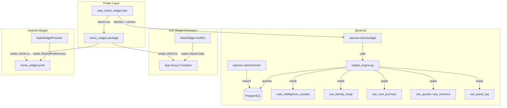

# Little Nate Home Screen Widget

## Architecture



## Step 1: Backend -- Widget Content Engine

**New file:** [backend/app/sse/widget_engine.py](backend/app/sse/widget_engine.py) (~180 lines)

Core function: `async def get_widget_content(user_id: str, db_pool) -> dict`

**Content selection priority cascade:**
1. Biome transition today -> `milestone` (query `sse_admin_alerts WHERE alert_type='biome_transition' AND created_at > today`)
2. Quest completed today -> `milestone` (query `sse_quests WHERE status='completed' AND completed_at > today`)
3. Crisis crystal in last 24h -> `encouragement` (query `nate_intelligence_crystals WHERE domain='clinical' AND confidence >= 0.8 AND created_at > now()-24h`, check crystal_text for crisis keywords from `layer6_crystal_bridge._CRISIS_KEYWORDS`)
4. Active quest -> 30% chance `goal` (random selection, show quest title + next step)
5. Active mission + no session in 3+ days -> `mission_reminder`
6. Meaningful session yesterday (crystal with confidence >= 0.7 created yesterday) -> `reflection` (pull user's statement from crystal_text)
7. No check-in in 3+ days -> `check_in`
8. Faith framework = `christian` -> 20% chance `devotional` (from curated list)
9. Faith framework in (`spiritual`, `other`) -> 20% chance `secular_wisdom` (from curated list)
10. Default -> `journey_panel` (latest panel from `sse_panel_log` with `r2_url`)

**Data queries needed (all in one `db_pool.acquire()`):**
- `sse_user_journeys` -> current_biome
- `sse_identity_forge` -> spiritual_framework (first time this table is queried for this column in the thera_world path)
- `sse_admin_alerts` -> biome transitions today
- `sse_quests` -> active/completed quests
- `sse_missions` -> active missions
- `nate_intelligence_crystals` -> crisis crystals, recent meaningful crystals
- `conversation_history` -> last session timestamp
- `sse_panel_log` -> latest journey panel image

**Static content constants (embedded in file):**
- `_DEVOTIONALS`: 30 curated scripture verses with attribution
- `_SECULAR_WISDOM`: 30 curated quotes (Rumi, Brene Brown, Viktor Frankl, Maya Angelou, etc.)
- `_POWER_WORDS`: 20 therapeutic words ("Breathe", "Enough", "Worthy", "Present", "Brave", "Held", "Safe", "Seen", "Whole", "Free", etc.)

**Biome color mapping (new, since none exists):**
```python
_BIOME_COLORS = {
    "dark_forest": "#1a2332",
    "fortress_plains": "#2d3a1e",
    "river_valley": "#1e3a3a",
    "crystal_mountains": "#2a1e3a",
    "open_sky": "#1e2a3a",
}
```

**Return shape:**
```python
{
    "type": "journey_panel|encouragement|single_word|goal|devotional|secular_wisdom|milestone|check_in|mission_reminder|reflection",
    "image_url": str | None,
    "primary_text": str,
    "secondary_text": str | None,
    "action": "open_chat|open_quest|open_journey|open_checkin",
    "action_id": str | None,
    "background_color": str,  # hex from _BIOME_COLORS
}
```

**For encouragement type**: Use a simple template with crystal context rather than an LLM call (LLM calls are too slow/expensive for widget refreshes). Template: pick the most recent high-confidence crystal and frame it as "Remember: {insight}. You're doing the work."

**For reflection type**: Pull the user's most impactful statement directly from `crystal_text` of yesterday's highest-confidence crystal.

## Step 2: Backend -- Endpoints in admin.py

**File:** [backend/app/routers/admin.py](backend/app/routers/admin.py) (~25 new lines on `sse_client_router`)

**GET `/api/sse-client/widget`** (~12 lines)
- Resolves `user_id` from auth token (same pattern as other `sse_client_router` endpoints)
- Calls `widget_engine.get_widget_content(user_id, db_pool)`
- 1-hour server-side cache using a simple `_widget_cache` dict with `{user_id: (timestamp, data)}`
- Returns the content dict

**POST `/api/sse-client/checkin`** (~13 lines)
- Body: `{"emotion": "good|okay|hard|struggling"}`
- Inserts into `sse_panel_log` with `panel_type='checkin'` and `narrative_text=emotion` (reuses existing table rather than creating a new one)
- If emotion = `struggling`: set response message to a compassionate encouragement
- Returns `{"message": "Thanks for checking in. I'm here.", "acknowledged": true}`

## Step 3: Flutter -- Widget Bridge

**New file:** [mobile/lib/widgets/nate_home_widget.dart](mobile/lib/widgets/nate_home_widget.dart) (~120 lines)

**New dependency in pubspec.yaml:** `home_widget: ^0.7.0`

This file handles:
- `NateWidgetService` class with static methods
- `fetchAndUpdateWidget()` -- calls `GET /api/sse-client/widget`, saves response JSON to `home_widget` shared storage (App Group on iOS, SharedPreferences on Android)
- `registerBackgroundCallback()` -- called from `main.dart` on startup to register the background fetch
- Data keys stored: `widget_type`, `widget_primary_text`, `widget_secondary_text`, `widget_image_url`, `widget_background_color`, `widget_action`, `widget_action_id`
- Fallback: if API call fails, does not overwrite existing cached data (widget always shows last successful content)
- Called on app launch and registered for periodic background fetch

**Modifications to existing files:**
- [mobile/lib/main.dart](mobile/lib/main.dart): Add `NateWidgetService.registerBackgroundCallback()` call in `main()` after app init (~3 lines)

## Step 4: iOS Widget Extension

**New directory:** `mobile/ios/NateWidget/`

**Files:**
- `NateWidget.swift` (~100 lines) -- SwiftUI widget view with `.systemSmall` and `.systemMedium` families
- `NateWidgetBundle.swift` (~10 lines) -- WidgetBundle entry point
- `NateTimelineProvider.swift` (~60 lines) -- TimelineProvider that reads cached JSON from App Group shared container
- `Assets.xcassets/` -- Nate avatar eyes image asset (small PNG)

**Widget design:**
- **Small (2x2)**: Dark background (`background_color`), primary text (white, 14pt semi-bold, max 2 lines), small Nate eyes icon bottom-right (16x16), optional blurred background image if `image_url` present
- **Medium (4x2)**: Left 40% = journey panel thumbnail (or biome gradient), Right 60% = primary text (15pt) + secondary text (12pt, gold dim), Nate eyes between sections

**Configuration required (manual, in Xcode):**
- Add Widget Extension target to `Runner.xcodeproj`
- Bundle ID: `net.sovereignsanctuary.littlenate.NateWidget`
- App Group: `group.net.sovereignsanctuary.littlenate`
- Add App Group capability to both Runner and NateWidget targets
- Development team: `LKSHXV9K95`

**Info.plist additions:**
- `NSWidgetWantsLocation`: false
- Widget display name: "Little Nate"
- Widget description: "Daily therapeutic touchpoint"

**Timeline:** `.atEnd` policy with 30-minute entries (WidgetKit will batch refresh at its discretion, minimum ~15 min)

## Step 5: Android Widget

**New files:**
- `mobile/android/app/src/main/kotlin/net/sovereignsanctuary/littlenate/NateWidgetProvider.kt` (~80 lines) -- AppWidgetProvider that reads from `home_widget` SharedPreferences and builds RemoteViews
- `mobile/android/app/src/main/res/layout/nate_widget_small.xml` (~30 lines) -- 2x2 layout
- `mobile/android/app/src/main/res/layout/nate_widget_medium.xml` (~40 lines) -- 4x2 layout
- `mobile/android/app/src/main/res/xml/nate_widget_info_small.xml` (~10 lines) -- widget metadata (minWidth=110dp, minHeight=110dp, updatePeriodMillis=1800000)
- `mobile/android/app/src/main/res/xml/nate_widget_info_medium.xml` (~10 lines) -- widget metadata (minWidth=250dp, minHeight=110dp)
- `mobile/android/app/src/main/res/drawable/widget_background.xml` -- rounded dark background shape

**AndroidManifest.xml additions** (~15 lines):
- `<receiver>` for `NateWidgetProvider` (small)
- `<receiver>` for `NateWidgetProvider` (medium, or same receiver with two `appwidget-provider` entries)
- `<meta-data>` pointing to `nate_widget_info_small.xml` / `nate_widget_info_medium.xml`

**Widget design:**
- Dark background (`#050505` with rounded corners 16dp)
- Primary text: white, 14sp, max 2 lines
- Secondary text: `#C9A962` (gold), 11sp
- Nate eyes: small ImageView bottom-right
- Tap opens `MainActivity` with intent extra `widget_action` + `widget_action_id` for deep linking

## Step 6: Check-in Flow

When the widget type is `check_in` and the user taps it:
- App opens to a minimal overlay screen (not the full app chrome)
- Shows "How are you today?" with 4 emotion buttons
- On tap: `POST /api/sse-client/checkin` with `{emotion: "good|okay|hard|struggling"}`
- Shows response message, then navigates to main app after 2 seconds

**New file:** [mobile/lib/screens/checkin_screen.dart](mobile/lib/screens/checkin_screen.dart) (~80 lines)
- Minimal dark screen with centered question + 4 large emoji buttons
- Posts to backend, shows confirmation, auto-dismisses

**Deep link handling in main.dart:**
- Check launch intent/URI for `widget_action=open_checkin` -> navigate to `CheckinScreen`
- Other actions -> navigate to appropriate screen

## Step 7: Settings Screen Card

**File:** [mobile/lib/screens/settings_screen.dart](mobile/lib/screens/settings_screen.dart) (~20 new lines in `ClientSettingsScreen`)

Add a card in the settings list:
- Title: "Home Screen Widget"
- Subtitle: "Get daily encouragement on your home screen"
- Icon: `Icons.widgets_outlined`
- On tap: show a bottom sheet with platform-specific instructions
- iOS: "Long press your home screen, tap +, search Little Nate"
- Android: "Long press your home screen, tap Widgets, find Little Nate"

## File Change Summary

| File | Type | Lines |
|------|------|-------|
| `backend/app/sse/widget_engine.py` | NEW | ~180 |
| `backend/app/routers/admin.py` | MODIFY | +25 |
| `mobile/pubspec.yaml` | MODIFY | +1 (home_widget dep) |
| `mobile/lib/widgets/nate_home_widget.dart` | NEW | ~120 |
| `mobile/lib/screens/checkin_screen.dart` | NEW | ~80 |
| `mobile/lib/screens/settings_screen.dart` | MODIFY | +20 |
| `mobile/lib/main.dart` | MODIFY | +3 |
| `mobile/ios/NateWidget/NateWidget.swift` | NEW | ~100 |
| `mobile/ios/NateWidget/NateWidgetBundle.swift` | NEW | ~10 |
| `mobile/ios/NateWidget/NateTimelineProvider.swift` | NEW | ~60 |
| `mobile/android/.../NateWidgetProvider.kt` | NEW | ~80 |
| `mobile/android/.../res/layout/nate_widget_small.xml` | NEW | ~30 |
| `mobile/android/.../res/layout/nate_widget_medium.xml` | NEW | ~40 |
| `mobile/android/.../res/xml/nate_widget_info_small.xml` | NEW | ~10 |
| `mobile/android/.../res/xml/nate_widget_info_medium.xml` | NEW | ~10 |
| `mobile/android/.../res/drawable/widget_background.xml` | NEW | ~8 |
| `mobile/android/app/src/main/AndroidManifest.xml` | MODIFY | +15 |

## Key Decisions

- **No LLM call in widget engine**: Widget refreshes happen in background every 30 min. LLM calls are too slow and expensive. All content is either pre-computed (crystals, panels) or template-based (encouragement, reflection).
- **Reuse `sse_panel_log`** for check-ins instead of creating a new table -- `panel_type='checkin'` distinguishes them.
- **`home_widget` Flutter package** bridges data between Flutter and native widget code via App Groups (iOS) and SharedPreferences (Android). This is the standard approach and avoids building custom platform channels.
- **Biome colors defined in widget_engine.py** since no color mapping exists anywhere in the SSE engine currently.
- **spiritual_framework query added** -- this will be the first time `thera_world_engine`-adjacent code reads this column from `sse_identity_forge`.
- **No migration needed** -- check-ins go into existing `sse_panel_log` table, widget content is read-only from existing tables.

## Xcode Manual Steps (cannot be automated)

The iOS Widget Extension requires manual Xcode configuration that cannot be done via file edits alone:
1. Open `mobile/ios/Runner.xcworkspace` in Xcode
2. File > New > Target > Widget Extension > name "NateWidget"
3. Add App Group capability (`group.net.sovereignsanctuary.littlenate`) to both Runner and NateWidget targets
4. Set the deployment target, team, and signing

These steps will be documented in the plan but must be performed manually after the code files are created.
