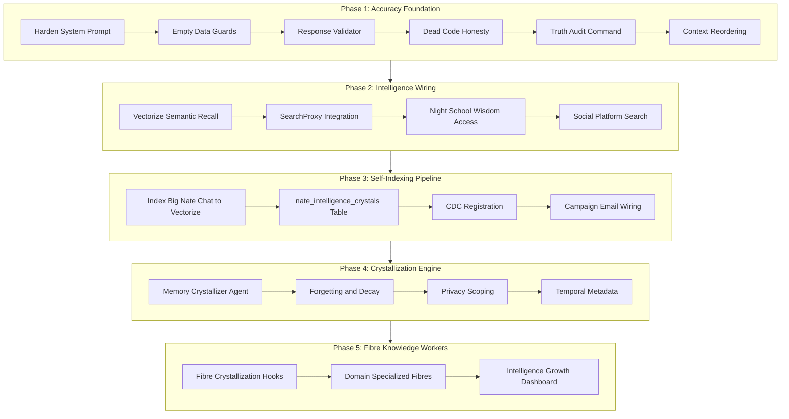

# Nate Liminal Intelligence Engine

## Architecture Overview




---

## Phase 1: Accuracy Enforcement (6 Layers)

All work in [backend/app/services/skyeye_chat.py](backend/app/services/skyeye_chat.py). This is the prerequisite for everything else — self-indexing without accuracy enforcement creates a persistent false memory system.

### Layer 1: Strengthen YOUR ACCURACY RULES (lines 343-348)

Move accuracy rules to the **top** of `LITTLE_NATE_SYSTEM_PROMPT` (before identity/personality) and expand with three new rule categories:

**Entity rules:**

- Never claim a user exists unless confirmed by `[USER DATA]` context
- Never invent account names, coach names, or client counts
- When asked about a specific user, say "Let me check" if not in context

**Data absence rules:**

- When a context block shows `[0 RECORDS]`, explicitly state "I have no data on that"
- Never extrapolate from zero data — zero is zero, not "probably some"

**Capability honesty rules:**

- Never claim you can do something not listed in YOUR PLATFORM CAPABILITIES
- If asked about a missing capability, say "That feature isn't built yet" not "I'll look into it"

### Layer 2: Empty Data Guards (8 context functions)

Add explicit `[0 RECORDS]` markers to every context function that currently returns `""` on empty data. Target functions and current empty returns:


| Function (line)                         | Current empty return | New return                                                                |
| --------------------------------------- | -------------------- | ------------------------------------------------------------------------- |
| `_get_mode_context` (1263)              | `""`                 | `"\n[MODE CONTEXT: 0 RECORDS]\n"`                                         |
| `_get_archived_wisdom_context` (1712)   | `""`                 | `"\n[ARCHIVED WISDOM: 0 RECORDS — No past conversations available]\n"`    |
| `_get_unified_insight_context` (1752)   | `""`                 | `"\n[UNIFIED INSIGHTS: 0 RECORDS — No synthesized insights available]\n"` |
| `_get_activity_timeline_context` (1804) | `""`                 | `"\n[RECENT ACTIVITY: 0 RECORDS — No activity in last 7 days]\n"`         |
| `_get_liminal_presence_context` (1842)  | `""`                 | `"\n[LIMINAL PRESENCE: 0 RECORDS — No LRI data available]\n"`             |
| `_get_recent_comments_context` (1890)   | `""`                 | `"\n[RECENT COMMENTS: 0 RECORDS — No engagement in last 72 hours]\n"`     |


`_get_posting_history_context` (1770) already returns `"No posts found"` — no change needed.

### Layer 3: Response Validator

New file: `backend/app/services/nate_response_validator.py`

A lightweight post-generation scanner that runs **before** storing the response. Log-only mode initially (does not block responses).

**Patterns to detect:**

- Temporal claims without evidence: regex for `"I posted"`, `"I released"`, `"I published"` not preceded by `[MY POSTING HISTORY]` citation
- Invented timestamps: regex for `"on March"`, `"at 3pm"`, `"yesterday I"` in contexts where no timestamp data was provided
- Capability overreach: claims about threading, multi-part articles, file export
- Dead feature references: references to features marked dead in Layer 4

**Integration point:** In `_call_azure_chat()` (line ~3560), after receiving the Azure response and before storing it in `skyeye_chat`, call `validator.scan(response_text, context_blocks)`. Log warnings to `skyeye_activity` with `type='nate_accuracy_warning'`.

### Layer 4: Dead Code Honesty

Update YOUR OPERATIONAL AWARENESS (lines 327-341) to accurately reflect what is wired vs dead:

- `Drip Scheduler` — change to: "manages quiz emails and Golden Ticket lifecycle. Campaign email touchpoints are defined but not yet wired."
- Add `Web Content Reader` — "reads 6 RSS feeds every 4 hours, stores in web_wisdom"
- Update `Trust Enforcer` — "monitors system checks across **30 auditors** 3x daily" (not 19)
- Add `Community Mesh Engine` — "manages BLE/NFC group sessions and anonymous wisdom convergence"
- Add `Nate Check-In Agent` — "72h inactivity outreach for clients and coaches"

### Layer 5: Truth Audit Command

Add a new chat command detected in `_detect_mode()`: when the user says `"audit your claims"`, `"fact check yourself"`, or `"verify your statements"`, trigger `_truth_audit()`.

`_truth_audit()` method:

1. Get last 10 Little Nate messages from `skyeye_chat`
2. Extract any factual claims (posted X, user Y exists, metric Z is N)
3. Cross-reference against DB: `skyeye_content_queue` for posts, `users` for accounts, relevant metric tables
4. Return a structured report: "Verified: N claims, Unverifiable: M claims, Contradicted: K claims"

### Layer 6: Context Block Reordering

In `_call_azure_chat()` (line 868), reorder the context concatenation so accuracy-critical blocks are **first** (survive truncation at 32K):

```python
conversation_text = (
    conversation_text          # chat history (most recent)
    + posting_history          # FIRST — proves what was actually posted
    + activity_timeline        # SECOND — proves what actions occurred
    + recent_comments          # THIRD — proves engagement data
    + liminal_presence         # voice integrity status
    + mode_context             # mode-specific data
    + unified_insights         # synthesized knowledge
    + marketing_context        # playbook and proposals
    + archived_wisdom          # LAST — least reliable, survives truncation last
    + url_reply_context
)
```

Currently the order is: `conversation_text + marketing_context + mode_context + archived_wisdom + unified_insights + posting_history + activity_timeline + liminal_presence + recent_comments + url_reply_context` — accuracy-critical blocks are at the **end** and get truncated first.

---

## Phase 2: Intelligence Wiring

### Step 2A: Wire Vectorize Semantic Recall into Big Nate Chat

**File:** [backend/app/services/skyeye_chat.py](backend/app/services/skyeye_chat.py)

Add import:

```python
from app.services.vectorize_service import semantic_search_all, is_vectorize_configured
```

New method `_get_semantic_recall_context(user_message, mode)`:

1. If `not is_vectorize_configured()`: return `""`
2. Call `results = await semantic_search_all(user_message, user_id="system", top_k=10)`
3. Format top results by source (conversation, wisdom, sessions, vault, me2me, annotations)
4. Budget: max 4,000 chars total (12.5% of 32K window)
5. Include `score` threshold: only include results with `score >= 0.65`
6. Return formatted block: `"\n[SEMANTIC RECALL — {N} relevant memories found]\n..."`

**Integration:** Add to context assembly in `_call_azure_chat()` after `posting_history` and before `mode_context`:

```python
semantic_recall = await self._get_semantic_recall_context(user_message, detected_mode)
```

### Step 2B: Wire SearchProxy into Big Nate Chat

**File:** [backend/app/services/skyeye_chat.py](backend/app/services/skyeye_chat.py)

Add import:

```python
from app.services.search_proxy import SearchProxy
```

New method `_get_internet_search_context(user_message, mode)`:

1. Detect search intent: only trigger for INQUIRY, MARKETING, STRATEGY, BRIEFING, DEFENSE modes
2. Extract search query from user message (simple keyword extraction or pass the message directly)
3. Call `search_proxy.execute_search(query, coach_id="nate_system", num_results=5)`
4. Format with `search_proxy.format_for_nate(results["results"])`
5. Budget: max 3,000 chars
6. Store raw results in `web_wisdom` table for future recall by Insight Accumulator (making it the 10th source)
7. Return formatted block: `"\n[INTERNET RESEARCH — {N} results for '{query}']\n..."`

**Rate limit:** Max 1 search per chat message. Skip if last search was < 30 seconds ago. Use in-memory timestamp tracking.

**Search intent detection keywords:**

- "research", "look up", "find out", "what's happening with", "current", "latest", "trending", "compare to industry", "benchmark"
- Also auto-trigger when the user's question contains a proper noun not found in any existing context block

### Step 2C: Wire Night School Wisdom into Big Nate Chat

**File:** [backend/app/services/skyeye_chat.py](backend/app/services/skyeye_chat.py)

New method `_get_night_school_context()`:

1. Get `night_school_director` from `app.state` (already initialized in `main.py`)
2. Call `wisdom_text = night_school_director.get_wisdom_for_prompt()`
3. Budget: max 2,000 chars
4. Return formatted block: `"\n[NIGHT SCHOOL CURRICULUM]\n{wisdom_text}\n"`

This gives Nate access to approved coaching wisdom, DOJO learnings, and curriculum — data he currently cannot see.

### Step 2D: Expand Social Platform Search

Add search methods to platform adapters that support it:

**YouTube** (`backend/app/services/platforms/youtube.py`):

```python
async def search_videos(self, query: str, limit: int = 10) -> list:
    # GET /youtube/v3/search?part=snippet&q={query}&type=video&maxResults={limit}
```

**Reddit** (`backend/app/services/platforms/reddit.py`):

```python
async def search_posts(self, query: str, subreddit: str = "", limit: int = 10) -> list:
    # GET https://www.reddit.com/search.json?q={query}&limit={limit}
    # No auth needed for public read
```

Wire these into `_get_internet_search_context()` as supplementary sources when the mode is MARKETING and the query relates to social discovery.

---

## Phase 3: Self-Indexing Pipeline

### Step 3A: Index Big Nate Chat Messages into Vectorize

**File:** [backend/app/services/skyeye_chat.py](backend/app/services/skyeye_chat.py)

Add import:

```python
from app.services.vectorize_service import index_conversation as _vectorize_index, is_vectorize_configured
```

After storing Little Nate's response in `skyeye_chat` (line ~889), add:

```python
if is_vectorize_configured():
    combined = f"Big Nate: {user_message}\nLittle Nate: {response_text}"
    asyncio.create_task(_vectorize_index(
        user_id="nate_system",
        record_id=str(chat_id),
        user_text=user_message,
        ai_text=response_text,
        session_id=f"skyeye_chat_{datetime.utcnow().strftime('%Y%m%d')}",
        timestamp=datetime.utcnow().isoformat(),
    ))
```

This uses the **existing** `nate-memory-search` index with `user_id="nate_system"` to distinguish Big Nate Chat from client conversations. No new index needed.

### Step 3B: Create `nate_intelligence_crystals` Table

New migration: `backend/migrations/NNN_nate_intelligence_crystals.sql`

```sql
CREATE TABLE IF NOT EXISTS nate_intelligence_crystals (
    id              SERIAL PRIMARY KEY,
    crystal_text    TEXT NOT NULL,
    domain          VARCHAR(50) NOT NULL,  -- marketing, coaching, research, defense, culture, social, clinical
    topics          TEXT[] DEFAULT '{}',
    scope           VARCHAR(100) NOT NULL DEFAULT 'global',  -- global, admin_only, user:{username}
    source_count    INT DEFAULT 1,
    generation      INT DEFAULT 0,  -- 0=raw observation, 1=first synthesis, 2+=meta-synthesis
    confidence      FLOAT DEFAULT 0.5,
    embedding_id    VARCHAR(64),  -- SHA256 ref to Vectorize vector
    context_start   TIMESTAMPTZ,  -- time range this crystal covers
    context_end     TIMESTAMPTZ,
    last_recalled_at TIMESTAMPTZ,
    recall_count    INT DEFAULT 0,
    superseded_by   INT REFERENCES nate_intelligence_crystals(id),
    created_at      TIMESTAMPTZ NOT NULL DEFAULT NOW()
);

CREATE INDEX idx_crystals_domain ON nate_intelligence_crystals(domain);
CREATE INDEX idx_crystals_scope ON nate_intelligence_crystals(scope);
CREATE INDEX idx_crystals_confidence ON nate_intelligence_crystals(confidence);
CREATE INDEX idx_crystals_generation ON nate_intelligence_crystals(generation);
CREATE INDEX idx_crystals_recalled ON nate_intelligence_crystals(last_recalled_at);
```

Also add trust baseline:

```sql
INSERT INTO trust_baseline (parameter_key, parameter_value)
VALUES ('nate_intelligence_crystals_count', '{"expected": 0, "description": "Intelligence crystals created"}')
ON CONFLICT DO NOTHING;
```

### Step 3C: Register in Iceberg CDC

Add to `CDC_TABLES` in [backend/app/services/iceberg_cdc_agent.py](backend/app/services/iceberg_cdc_agent.py):

```python
"nate_intelligence_crystals": {
    "pk": "id",
    "ts": "created_at",
    "partition_cols": ["domain", "generation", "event_date"],
    "query": """
        SELECT id, crystal_text, domain, topics::text AS topics,
               scope, source_count, generation, confidence,
               embedding_id,
               context_start::text AS context_start,
               context_end::text AS context_end,
               last_recalled_at::text AS last_recalled_at,
               recall_count,
               superseded_by,
               created_at::text AS created_at,
               created_at::date::text AS event_date
        FROM nate_intelligence_crystals
        WHERE created_at > $1
        ORDER BY created_at ASC
        LIMIT 500
    """,
},
```

Also add R2 analytics queries in [backend/app/services/r2_analytics_service.py](backend/app/services/r2_analytics_service.py):

```python
async def intelligence_growth(self, days: int = 90) -> dict:
    """Crystal count, confidence, and domain breakdown over time."""
    # SELECT domain, generation, COUNT(*), AVG(confidence), DATE_TRUNC('week', created_at) ...
```

### Step 3D: Wire Campaign Email Touchpoint

**File:** [backend/app/services/skyeye_session_engine.py](backend/app/services/skyeye_session_engine.py)

In `_post_phase()` (around line 1070), after a campaign post is successfully posted:

```python
if item.get("campaign_id") and item.get("episode_number"):
    drip = getattr(self._app_state, "drip_scheduler", None)
    if drip and hasattr(drip, "send_campaign_touchpoint"):
        campaign = await self._load_campaign(item["campaign_id"])
        touchpoints = campaign.get("drip_touchpoints", [])
        for tp in touchpoints:
            if tp.get("episode_number") == item["episode_number"]:
                await drip.send_campaign_touchpoint(
                    campaign_id=item["campaign_id"],
                    episode=item["episode_number"],
                    subject=tp.get("subject", f"Episode {item['episode_number']}"),
                    body_html=tp.get("template", item.get("content", "")),
                    audience=tp.get("audience", "all_subscribers"),
                )
```

---

## Phase 4: Crystallization Engine

### Step 4A: Memory Crystallizer Agent

New file: `backend/app/services/nate_memory_crystallizer.py`

A background agent (30-minute cycle, similar pattern to `InsightAccumulator`) that:

1. **Harvest** (every cycle): Query `skyeye_chat` for messages since last harvest. Group by detected mode (from metadata JSONB). Also query `web_wisdom` for new entries and `wisdom_extractions` for new insights.
2. **Cluster** (every 6 hours): For each domain, embed all unharvested items via `generate_embeddings()`. Group by cosine similarity (threshold 0.75). Each cluster of 3+ items becomes a crystal candidate.
3. **Synthesize** (per cluster): Call Azure OpenAI with the cluster contents and a crystallization prompt:

```
   You are a knowledge crystallizer. Summarize these {N} related observations
   into a single precise insight (50-100 words). Include: the core pattern,
   confidence level (0.0-1.0), and 3-5 topic tags. Do NOT invent information
   beyond what the observations contain.
   

```

1. **Validate**: Run `NateResponseValidator.scan()` on the crystal text before storing.
2. **Store**: Insert into `nate_intelligence_crystals` with `generation=1`, embed via `index_wisdom()` into `nate-wisdom` index with metadata `{source: "nate_crystal", domain: "...", generation: 1, scope: "..."}`.
3. **Archive**: After crystallization, mark source items as `crystallized=true` (add column to `skyeye_chat` metadata or a separate tracking table).

**Registration:** Add to `main.py` `_service_checks`, `lifespan()` startup/shutdown, `agent_status_digest.py`. Increment service health denominator.

### Step 4B: Forgetting and Decay Mechanism

Add to the crystallizer's 6-hour cycle:

1. **Decay scan**: Query `nate_intelligence_crystals WHERE last_recalled_at < NOW() - INTERVAL '90 days' AND recall_count < 3`
2. **Archive**: Move to cold storage via `ColdMemoryTier.archive()` with path `crystals/{domain}/{id}.json`
3. **Remove from Vectorize**: Call `delete_vectors("nate-wisdom", [embedding_id])`
4. **Mark in DB**: Set `superseded_by = -1` (archived sentinel) or add `archived_at` column

**Confidence pruning**: Query `WHERE generation >= 1 AND confidence < 0.3 AND created_at < NOW() - INTERVAL '30 days'` — same archive flow.

**Contradiction resolution**: When a new crystal is created, search Vectorize for existing crystals in the same domain with score >= 0.85. If found, compare confidence scores. If new crystal confidence > old crystal confidence, set `old.superseded_by = new.id`. This prevents contradictory crystals from both appearing in recall.

**Recall tracking**: In `_get_semantic_recall_context()` (Phase 2A), after retrieving crystals, update:

```sql
UPDATE nate_intelligence_crystals SET last_recalled_at = NOW(), recall_count = recall_count + 1 WHERE id = $1
```

### Step 4C: Privacy Scoping

All crystal creation must include a `scope` field:


| Source                         | Scope Rule                                     |
| ------------------------------ | ---------------------------------------------- |
| Big Nate Chat (skyeye_chat)    | `scope = "admin_only"` (admin conversations)   |
| Marketing insights             | `scope = "global"` (no PII)                    |
| Client session wisdom          | `scope = "user:{username}"` (per-client only)  |
| Coaching patterns (aggregated) | `scope = "global"` (anonymized, min 5 clients) |
| Nevedal Lab research           | `scope = "global"` (anonymized)                |
| Hive Defense                   | `scope = "admin_only"`                         |
| Social engagement              | `scope = "global"`                             |


In `_get_semantic_recall_context()`, add scope filtering:

```python
# Big Nate Chat context: allow global + admin_only
filter_metadata = {"scope": {"$in": ["global", "admin_only"]}}
```

In bridge (client chat context): only allow `global` scope — never leak admin or other-user crystals.

### Step 4D: Temporal Metadata

Every crystal must carry `context_start` and `context_end` timestamps (the time range of the source data it was synthesized from).

In semantic recall, add time-weighting:

- If user asks about "current" / "recent" / "now": boost crystals where `context_end` is within 30 days
- If user asks about "trends" / "over time" / "historically": boost crystals with wider `context_end - context_start` spans

Implementation: After Vectorize returns results, re-rank by combining `vector_score * 0.7 + recency_score * 0.3` where `recency_score = 1.0 / (1 + days_since_context_end / 30)`.

---

## Phase 5: Fibre Knowledge Workers

### Step 5A: Fibre Crystallization Hooks

Add a `crystallize()` method to the base `Fibre` class in [backend/app/models/fibre.py](backend/app/models/fibre.py):

```python
async def crystallize(self, observations: list, domain: str) -> Optional[dict]:
    """Synthesize observations into an intelligence crystal. Returns crystal dict or None."""
```

Default implementation delegates to `NateMemoryCrystallizer.synthesize_cluster()`. Specialized fibres can override with domain-specific logic.

### Step 5B: Domain-Specialized Fibres

Extend existing fibre types with crystallization specialization:


| Fibre Type          | Crystallization Behavior                                                                     |
| ------------------- | -------------------------------------------------------------------------------------------- |
| `CAMPAIGN`          | Monitors `skyeye_post_analytics`, crystallizes engagement patterns per platform              |
| `CULTURAL_SENTINEL` | Monitors `web_wisdom` + Reddit/YouTube search results, crystallizes cultural trends          |
| `FORESIGHT_ANALYST` | Monitors `nevedal_metrics` + `client_metrics`, crystallizes predictive patterns              |
| `COACH_SUPPORT`     | Monitors `coaching_sessions` + `coach_metrics`, crystallizes coaching effectiveness patterns |
| `COMMUNITY`         | Monitors `community_wisdom` + `community_check_ins`, crystallizes group dynamics             |


Each fibre's `execute()` method would call `self.crystallize()` at the end of its observation cycle, producing domain-tagged crystals that flow into the shared `nate-wisdom` index.

### Step 5C: Intelligence Growth Dashboard

Add to R2 Analytics API (`backend/app/routers/analytics_api.py`):

```python
@router.get("/intelligence/growth")
async def intelligence_growth(days: int = 90):
    """Crystal count, confidence, domain breakdown, recall frequency over time."""

@router.get("/intelligence/domains")
async def intelligence_domains():
    """Per-domain crystal count, avg confidence, most-recalled topics."""

@router.get("/intelligence/decay")
async def intelligence_decay():
    """Crystals approaching decay threshold, archived count, pruned count."""
```

These power a new "Intelligence" sub-tab in SkyEye that visualizes Nate's learning curve — the `SELECT domain, COUNT(*), AVG(confidence), DATE_TRUNC('week', created_at) as week` query described earlier.

---

## Service Health and Trust Impact

### New services to register in `main.py` `_service_checks`:

- `nate_response_validator` (Phase 1, Layer 3)
- `nate_memory_crystallizer` (Phase 4A)

### Service health denominator change:

- Current: 97/97
- After Phase 1: 98/98 (+1 validator)
- After Phase 4: 99/99 (+1 crystallizer)

### Trust baseline updates:

- No new auditor initially — the crystallizer and validator are maintenance agents (like `TokenUsageAgent`), not auditors
- Crystal count tracking via `nate_intelligence_crystals_count` baseline key (informational, not trust-gated)

### Files modified (summary):


| File                                                    | Changes                                                                                                                        |
| ------------------------------------------------------- | ------------------------------------------------------------------------------------------------------------------------------ |
| `backend/app/services/skyeye_chat.py`                   | Accuracy rules, context guards, context reordering, semantic recall, internet search, Night School, self-indexing, truth audit |
| `backend/app/services/nate_response_validator.py`       | New file — post-generation scan                                                                                                |
| `backend/app/services/nate_memory_crystallizer.py`      | New file — crystallization agent                                                                                               |
| `backend/app/services/vectorize_service.py`             | No changes needed (all methods exist)                                                                                          |
| `backend/app/services/search_proxy.py`                  | No changes needed (all methods exist)                                                                                          |
| `backend/app/services/skyeye_session_engine.py`         | Wire `send_campaign_touchpoint`                                                                                                |
| `backend/app/services/iceberg_cdc_agent.py`             | Add `nate_intelligence_crystals` to CDC_TABLES                                                                                 |
| `backend/app/services/r2_analytics_service.py`          | Add intelligence growth queries                                                                                                |
| `backend/app/services/platforms/youtube.py`             | Add `search_videos()`                                                                                                          |
| `backend/app/services/platforms/reddit.py`              | Add `search_posts()`                                                                                                           |
| `backend/app/models/fibre.py`                           | Add `crystallize()` base method                                                                                                |
| `backend/app/main.py`                                   | Register validator + crystallizer                                                                                              |
| `backend/migrations/NNN_nate_intelligence_crystals.sql` | New table                                                                                                                      |
| `backend/app/routers/analytics_api.py`                  | Intelligence growth endpoints                                                                                                  |


---

## Cost Analysis


| Component                                | Cost                                  |
| ---------------------------------------- | ------------------------------------- |
| Workers AI embeddings (Vectorize)        | Free (included in $5/mo Workers Paid) |
| Vectorize queries                        | ~$0.01/million queries                |
| DuckDuckGo search                        | Free                                  |
| Reddit search                            | Free (public API)                     |
| YouTube search                           | Free tier: 10,000 units/day           |
| PostgreSQL storage                       | Free (own server)                     |
| R2/Iceberg storage                       | Free tier: 10GB                       |
| Azure OpenAI (crystallization synthesis) | ~$0.01-0.03 per crystal               |
| Azure OpenAI (chat responses)            | Already paid — no marginal increase   |


**Estimated daily cost of crystallization:** ~50 crystals/day x $0.02 = $1.00/day. Everything else is zero marginal cost.