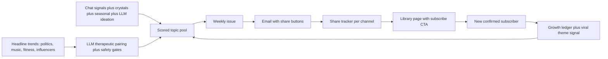

# Newsletter Growth Engine — Topics, Sharing, Viral Loop

## Problem

Topics oscillate between 2 hardcoded titles because `select_topic()` in [backend/app/services/newsletter_pipeline.py](backend/app/services/newsletter_pipeline.py) has only a default, one chat-signal rung, a mostly-empty forecast table, and anti-repeat that checks just the last sent issue. Sharing is limited to `mailto:`/`sms:` links, and nothing converts a shared link into a new subscriber.

## Phase 1 — Topic Engine (grow in topics and agendas)

**New service `newsletter_topic_engine.py`** replacing the ladder in `select_topic()` with a scored candidate pool:

- **Seasonal calendar**: static table of ~26 mental-health windows (May Awareness Month, back-to-school, seasonal affective onset, holiday grief, New Year pressure, Autism Acceptance Month in April, ADHD Awareness Month in October, Neurodiversity Celebration Week in March, etc.) seeded by migration into `newsletter_topic_forecast` with `seasonal_label`.
- **Evergreen topic domains**: the LLM ideation prompt draws from a named domain list so coverage rotates beyond anxiety:
  - **Neurodivergence** — ADHD, autism, sensory needs, executive function, masking and unmasking, supporting a neurodivergent partner/child/coworker, strengths-based framing. Angles written both for neurodivergent readers ("how to work with your brain") and for the people around them ("how to assist and advocate").
  - **Arts and culture** — movies, plays, museums, books, music: why a film scene moves us (catharsis and mirror neurons), theater and empathy, museums as slow-attention practice, art-making as regulation, what a story's grief arc teaches about our own.
  - **Military, veterans, and war** — deployment and reintegration, military family stress, moral injury, PTSD and post-traumatic growth, supporting a veteran you love, processing war headlines without shutting down. Sourced from VA/PTSD National Center-grade citations; crisis footer gains the Veterans Crisis Line (988 press 1) on these issues.
  - Plus grief, relationships, parenting, burnout, sleep, fitness/movement, curiosity and lifelong learning, and self-compassion.
- **Crystal theme mining**: weekly aggregation of anonymized themes from `nate_intelligence_crystals` (clinical domain, aggregated across a minimum of 5 distinct users per the clinical-agent privacy rule) written as forecast rows via existing `upsert_topic_forecast()` in [backend/app/services/newsletter_signals.py](backend/app/services/newsletter_signals.py).
- **LLM topic ideation**: weekly job through `nate_inference_router` (sovereign/zero-cost chain) that proposes 5 candidate topics given recent chat signals, symbolic rules, season, and top-rated past issues; writes to `newsletter_topic_forecast` with `rationale`.
- **Citation allowlist expansion**: `build_research_bundle()`'s curated source set grows to cover the new domains — CDC/NIMH autism and ADHD pages, CHADD, AANE (neurodivergence); VA and the National Center for PTSD (military/war); NEA and arts-and-health research (arts/culture) — so new topics can cite verified sources instead of failing closed. Bundle selection becomes domain-aware: sources are tagged by domain and matched to the chosen topic.
- **Scoring**: candidates ranked by chat-signal count, foresight score, seasonal match, historical rating for similar topics, share/click velocity, minus a novelty penalty against the **last 8 sent issues** (not 1).
- Extend hive `_topic_patrol` in [backend/app/services/newsletter_hive.py](backend/app/services/newsletter_hive.py) to emit multiple forecast rows, and enable `ENABLE_NEWSLETTER_HIVE` on GREEN.

## Phase 1.5 — Trend Pairing (headlines as the hook, therapy as the payload)

New module `newsletter_trend_pairing.py` — captures what people are already talking about and pairs it with a therapeutic angle, so the headline attracts the click and the Dispatch delivers the mental-health value ("veer them").

- **Trend harvesting** (daily, reusing existing infrastructure):
  - Extend [backend/app/services/web_content_reader.py](backend/app/services/web_content_reader.py)'s RSS pattern with a broader feed set beyond mental health: general news/politics (AP, Reuters), culture and music (Billboard, Pitchfork), arts (Variety film, Playbill theater, museum/exhibit news), military and veterans news (Military Times, VA news), fitness/wellness, tech, and creator/influencer trends (YouTube trending RSS, Google Trends daily RSS).
  - Optional supplement via `SecureSearchProxy` in [backend/app/services/search_proxy.py](backend/app/services/search_proxy.py) for "top stories this week" queries (sanitized, allowlisted — no arbitrary URL fetching).
  - Store in a new `newsletter_trend_candidates` table: headline, category (politics | music | fitness | influencer | culture | tech), source, velocity, harvested_at.
- **Therapeutic pairing** (LLM through `nate_inference_router`, clinical temperature): for each high-velocity trend, generate a paired Dispatch angle. Examples of the pairing pattern:
  - Politics/election anxiety → "How to stay informed without doomscrolling: a nervous-system approach to headline overload"
  - Viral fitness challenge → "Body comparison and the algorithm: building movement habits that come from care, not shame"
  - Influencer burnout story → "What a creator's public burnout teaches us about our own invisible workloads"
  - Chart-topping breakup album → "Why sad music helps: grief, catharsis, and letting a song hold what you can't say yet"
  - Any headline → curiosity/growth framing: "what this teaches us about learning, resilience, or staying open"
- **Safety gates**: pairing prompt is angle-generation only — no political stance, no naming private individuals negatively (M2 risk), no medical claims; output passes `NateResponseValidator` before entering the pool; category `politics` always frames coping-with-the-climate, never positions. Citations still come from the verified allowlist in `build_research_bundle()` — trends set the hook, not the sources.
- **Pool entry**: paired angles land in `newsletter_topic_forecast` with `news_velocity` populated (the column already exists and is currently always 0), so trending topics naturally outscore evergreen ones while fresh, then decay.

## Phase 2 — Social sharing on every surface

- **Email** ([backend/app/services/newsletter_delivery.py](backend/app/services/newsletter_delivery.py) `_html_email`): add a share row — X, Facebook, LinkedIn, WhatsApp, plus existing email/text. Each link goes through `/api/newsletter/share?slug&channel=<network>` (existing tracker) which now 302s to the network's share-intent URL carrying a UTM-tagged library link (`utm_source=share&utm_medium=<channel>&ref=<slug>`).
- **Library issue page** (`render_library_html`): same share row + a "Get the next Dispatch" subscribe CTA; richer OG tags (`og:description` from body excerpt, `twitter:card summary_large_image`).
- **Library index** ([dashboard/nate_story_library.html](dashboard/nate_story_library.html)): inline subscribe form posting to `/api/newsletter/subscribe` with UTM passthrough, and share buttons per issue card.

## Phase 3 — Share-to-subscriber attribution (the viral loop)

- `/subscribe` already stores `utm_source/medium/campaign`; on `/confirm`, credit the originating channel in `newsletter_growth_ledger` (`conversions=1`) and bump `share_count`→conversion linkage for the `ref` slug.
- Topic-level payoff: confirmed subscribers arriving via a shared issue call `record_theme_signal(topic, source="viral")` — so **topics that spread earn more future coverage**. This is the self-reinforcing mechanism.
- Admin Insights tab ([dashboard/newsletter_dispatch.html](dashboard/newsletter_dispatch.html)): add growth panel — shares by channel, conversions by source, top viral issues (from `newsletter_growth_ledger` + `newsletter_library_stats`).

## Verification

- Unit tests for topic scoring (novelty vs last-8, seasonal match) and share-intent URL construction.
- Run pipeline twice on GREEN — must produce different topics.
- Click each share button in a test send; confirm ledger rows and 302 targets.
- Subscribe via a shared link and confirm attribution lands in `newsletter_growth_ledger`.