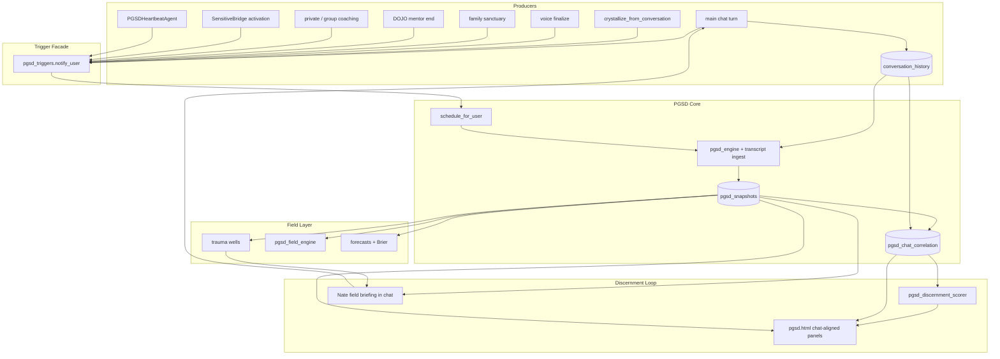

# PGSD → Narrow AGI Growth Access (+ Quantum Emotional Field)

## North star

**This plan’s primary product is access for Narrow AGI-class (Tier 2) to grow** — per [`docs/CLINICAL_AGI_ASI_JOURNEY.md`](docs/CLINICAL_AGI_ASI_JOURNEY.md): *same mind across therapy / family / DOJO / truth-bound ops*.

PGSD field physics (wells, TFIM, H(t), ground state) and Patent 12 are the **measurement engine**. Every phase must leave a durable **access surface** (data + API + tools) that Tier-1 flywheel and Tier-2 same-mind work can consume. Shipping physics without access = Nate-only instrumentation; that is not this plan.

**Honesty:** building the substrate ≠ claiming Tier-2 / “narrow AGI-class” certified. No UI/ops AGI-class language until journey gates say so.

## Locked decisions

- **Primary goal = Narrow AGI growth access.** Physics without Queen/D.13/cross-domain APIs is incomplete.
- **Dependency order:** multi-surface cadence (incl. DOJO) → series + measurement loop → field/Hamiltonian → **access surfaces (Nate + Queens + acceleration)** → patent/ops.
- **Discernment is measurable only if chat↔PGSD↔tab stay correlated.** Without transcript ingest, crystal stamps, and a claim-vs-history scorer, Tier 2 cannot grow from evidence.
- **Same-mind surfaces (mandatory producers):** `bridge_chat` | `family_sanctuary` | `dojo` / `dojo_coach` | `voice` | `call_coaching` | `private_coaching` | `group_coaching` | `live_activation` | `heartbeat` (`nightly` = legacy alias). Missing any one blocks Tier-2 substrate.
- **Canonical PGSD subject key = `hardware_id`** (live `191` + admin tab). Username is additive for `conversation_history` joins. Do not rewrite historical `user_id` to username.
- **Access contract (must ship — see Phase E):** cross-domain series API, discernment scores, Queen read tools, D.13 free-label enrichment, **admin** `pgsd.html` reflection (coach Flutter deferred R10). Write/mutate tools stay out of Queens.
- **New physics lives outside protected files.** Heavy logic in new services; protected files get ≤50-line additive hooks behind flags with `# QUANTUM-CRYSTAL-ARCH` / `# SOVEREIGN-VOICE` markers.
- **Master gate stays `PGSD_ENABLED`.** Sub-flags: `ENABLE_PGSD_HEARTBEAT` (cadence), `ENABLE_PGSD_ACCESS` (correlation, discernment, cross-domain, Queen read, briefing — Tier-2 access without full physics), `ENABLE_PGSD_FIELD` (wells, TFIM, H(t), ground state). Enable ACCESS before FIELD.
- **Hamiltonian split is explicit:** `H = H0 + H_int + H_drive`. H0 = individual free field (attractors + Lindblad). H_int = pairwise couplings (second-quantization pairwise form, coefficients from stored entanglement). H_drive = external dipole term −d·E(t) for Nate/coach co-regulation.
- **The Hamiltonian is non-stationary: H = H(t).** Noah Factor (`Δt_ext/Δτ = D^(1/4)`) and time density (`ρ_T = T²`) set the subjective-clock rate; time density drives void-fraction trends; void/dilation feed back into effective Lindblad rates (γ_env drift). All evolution therefore runs in **proper time τ** (`dτ = dt / (noah_factor × time_dilation)`), and all propagation uses a **time-ordered piecewise-constant generator** with parameters re-estimated per step — never a single fixed propagator `e^(−iĤt/ℏ)` across steps.
- **Ground state is a first-class output.** Per-user, the lowest eigenvalue of the effective H0 defines the baseline phase (what the person relaxes to with drive removed). Therapy efficacy = ground-state relocation, not just excited-state displacement.
- **Family spectrum uses direct Bogoliubov–de Gennes diagonalization for N≤8** (continuum k-space stays out; *discrete* rhythm-space Fourier is in — see D5). Control parameter `g = h_eff / J_eff` with `J ← β·p_ent·T_tunnel` and `h ← γ_env + E_G_joint/ℏ` read from Nevedal state (C_emo numerator/denominator).
- **Patent deliverable:** `patent/PATENT_PROVISIONAL_12_QUANTUM_EMOTIONAL_FIELD.md` — **16 claims** including chat-grounded discernment + cross-domain same-mind series. Claims only what the code measures.

## Verified wiring gaps (today — must close or measurement fails)

These are **live code facts**, not plan ambitions. Until closed, the PGSD tab cannot measure Nate’s discernment against main chat / history / family.

| # | Gap | Current state | Blocks |
|---|-----|---------------|--------|
| 1 | **No auto-snapshot after chat** | `schedule_for_user` defined; **zero call sites** ([`pgsd_handlers.py`](backend/app/websocket/pgsd_handlers.py)); docs list crystallizer producer as “where to add” ([`PGSD_WIRING.md`](docs/PGSD_WIRING.md)) | Series never tracks what was typed |
| 2 | **Main chat never injects PGSD** | `process_interaction` pre-fetch has crystals/history — **no PGSD** ([`bridge_server.py`](backend/app/websocket/bridge_server.py) ~9234) | Nate cannot “recall” field state in chat |
| 3 | **Crystals store no PGSD coords** | `crystallize_from_conversation` text+hash only ([`crystal_recall_bridge.py`](backend/app/websocket/crystal_recall_bridge.py)) | Emotionally proximate recall impossible |
| 4 | **Engine ignores `conversation_history`** | Loads crystals/metrics/sessions/family/multimodal only ([`pgsd_engine.py`](backend/app/services/pgsd_engine.py) ~867–871) | Snapshots not grounded in typed chat |
| 5 | **No history↔snapshot join** | Separate tables; no FK/correlation ([`099`](backend/migrations/) vs [`191_pgsd_tables.sql`](backend/migrations/191_pgsd_tables.sql)) | Cannot overlay chat turns on GPS pin |
| 6 | **Family sanctuary → no PGSD** | Sanctuary crystallizes; no `notify_user` | Family chat invisible to field/tab |
| 7 | **Tab is pull-only** | Manual `pgsd_compute_snapshot` / history / trajectory / entanglement ([`pgsd.html`](dashboard/pgsd.html)); no chat timeline, wells, ground state, discernment score | Cannot reflect live loop |
| 8 | **No claim-vs-history validator** | SkyEye truth audit ≠ PGSD; no scorer of Nate past/future emotional claims vs history + trajectory | Cannot measure discernment |

## Gap fixes (R1–R25 locked into phases — not optional)

| # | Fix (done when) |
|---|-----------------|
| R1 | Phase A: **extend** existing [`PGSDEngine.resolve_pgsd_subject`](backend/app/services/pgsd_engine.py) (already UUID/hw/username) — do not invent a parallel resolver. Canonical write key = **`hardware_id`** (matches live tab + `191` rows today). Also persist `username` column (additive) for history joins. **Never** switch `user_id` to username alone — that splits the series. Reads accept any of the three. CI: hw_id round-trip + username join to `conversation_history` |
| R19 | Phase A migration: `ALTER pgsd_snapshots ADD username` (+ other new tables); backfill username from `users` where `user_id` matches hardware_id; history/correlation queries join via resolved keys |
| R20 | Phase B2: correlation stores **hashed/redacted** text refs (session_id + created_at + optional 32-char prefix) — no full clinical transcript dump (PHI/HIPAA) |
| R21 | Phase A surfaces: add **`call_coaching`** notify (same crystal family as voice) |
| R22 | Phase A debounce: keep 1h for heavy compute; correlation writer may attach turns on **next** snapshot (document lag); live_activation stays 10-min bypass |
| R23 | Phase D: family/group N>8 → take top-8 by mean \|J\| or split subgraphs; never O(2^N) |
| R24 | Phase F: retention — `pgsd_*` clinical series covered by existing clinical retention / no auto-prune of discernment/correlation for 7y class (list types like factual_grounding immutables if pruned by db_maintenance) |
| R25 | Phase F: update service-health rule denominator when heartbeat registers; no new trust auditor unless REST added (WS coach/admin only) |
| R2 | Phase B2: `ENABLE_PGSD_BACKFILL` one-shot script — last 90d, ≤1 snapshot/day/user; tab empty-state until `N≥7` snapshots |
| R3 | Phase A producers: `private_coaching` + `group_coaching` notify; B2 surface enum includes both |
| R4 | Phase A DOJO: pin **client** subject if present; else `surface=dojo_coach` for coach-only training — never mix |
| R5 | Phase D: BdG/ground-state in `asyncio.to_thread`; N≤8 hard cap; timeout → skip+log; no ML on GREEN |
| R6 | Phase A heartbeat: Redis lock `pgsd:heartbeat:leader` or `NODE_ROLE=primary` only; PGSD stays WS-primary (no clone REST required v1) |
| R7 | Phase E: optional `pgsd_field_hint` into helix/ODPE clinical/TENSION path behind `ENABLE_PGSD_HELIX_HINT` — additive context only |
| R8 | Phase B2 checklist (all must notify+brief): `bridge_chat`, `family_sanctuary`, `dojo`, `dojo_coach`, `voice_call`, `call_coaching`, `private_coaching`, `group_coaching` |
| R9 | Phase A: heartbeat/triggers skip `audit_*`, battery-flagged sessions, `SIX_QUOTIENT` battery users; CI quarantine test |
| R10 | Phase E **v1 = admin `pgsd.html` only**; coach Flutter deferred — documented in PGSD_WIRING + tab banner |
| R11 | Phase B2/E: timeline + scorecard + cross-domain **renderers in same commit** as WS payloads |
| R12 | Phase B: `pgsd_pmb_bridge.append_crisis_precursor()` called from bridge `_compute_pmb` only (one ≤50-line hook) |
| R13 | Phase A: heartbeat in `_service_checks`; Phase E: `app.state.pgsd_discernment_scorer` + `pgsd_field_engine` as `is not None` checks if constructed at startup |
| R14 | Flags: `PGSD_ENABLED` → `ENABLE_PGSD_HEARTBEAT` → **`ENABLE_PGSD_ACCESS`** → `ENABLE_PGSD_FIELD` (never skip ACCESS) |
| R15 | Phase E: Queen read tools **are** truth-bound ops access v1; Big Nate/SkyEye out of scope |
| R16 | Bridge: separate commits — (1) sentinel skip list (2) facade import+notify sites (3) briefing inject — each ≤50 lines |
| R17 | Phase D: try numpy; else pure-Python eig for N≤6; if numpy added → dual-container dep patch rule |
| R18 | Phase F: patent **after** test-family smoke with real `pgsd_*` rows; no claim without measured column |

## Architecture

## Phase A — Heartbeat + identity + multi-surface producers

**Goal:** unbroken per-user series on all Tier-2 surfaces, correctly keyed, battery-safe, primary-only.

| Deliverable | Path |
|---|---|
| Identity (R1/R19) | Extend `resolve_pgsd_subject`; writers store `user_id=hardware_id` + `username`; thin facade `pgsd_identity.resolve()` wrapping engine if needed for non-engine callers |
| Safe trigger facade | New [`backend/app/services/pgsd_triggers.py`](backend/app/services/pgsd_triggers.py) — `notify_user(raw_id, source)` resolves to hw_id, skips battery/audit (R9), wraps `schedule_for_user`; never raises |
| Nightly baseline agent (R6) | New [`backend/app/services/pgsd_heartbeat_agent.py`](backend/app/services/pgsd_heartbeat_agent.py) — Redis leader lock or primary-only; 24h cycle; active 7d clients; skip audit/battery |
| Wire agent (R13) | [`backend/app/main.py`](backend/app/main.py) — `app.state` + `_service_checks` (+1) |
| Producer hooks (R3/R4/R8/R16/R21) | Separate ≤50-line commits: crystallizer, voice `_finalize`, sanctuary, **private_coaching**, **group_coaching**, **call_coaching**, **DOJO** (`dojo` vs `dojo_coach`), session_end, live_activation |
| Env (R14) | `.env.template`: `PGSD_ENABLED`, `ENABLE_PGSD_HEARTBEAT`, `ENABLE_PGSD_ACCESS`, `ENABLE_PGSD_FIELD`, `ENABLE_PGSD_BACKFILL` |
| Docs | [`docs/PGSD_WIRING.md`](docs/PGSD_WIRING.md) — producers + identity contract + flag order |

Reuse 1h debounce; fix `_bg_compute` Lindblad on auto-triggers. **Adaptive proper-time cadence** as before (Noah/ρ_T → sampling multiplier; store `tau_step`).

## Phase B — Rhythm + predictability + learned training

**Goal:** listeners on the series so Nate acts on GPS geometry.

1. **Cycle domain `pgsd_field`** in [`cycle_detection_engine.py`](backend/app/services/cycle_detection_engine.py)
   - Series from `pgsd_snapshots`: `d1..d5`, `coherence`, `emotional_fingerprint`
   - Autocorr/FFT on coordinates; fingerprint recurrence intervals as free period
   - Write `cycle_detections` domain `pgsd_field`

2. **PMB precursor regions (R12 locked)**
   - Migration: `pgsd_crisis_regions` (`user_id`=hardware_id, `username`, `d1..d5` centroid, `radius`, `source_event_id`, `created_at`) seeded from `crisis_events` ±2h nearest snapshot
   - New [`pgsd_pmb_bridge.py`](backend/app/services/pgsd_pmb_bridge.py): `append_crisis_precursor(pmb_dict, user_id)` — sole writer; resolve via `resolve_pgsd_subject`
   - Bridge hook: inside `_compute_pmb` (or equivalent) call `append_crisis_precursor` — **one** ≤50-line protected commit
   - Zero-time route exposed as intervention map in coach WS reply

3. **Crystal stamps**
   - Additive migration: `nate_intelligence_crystals` cols `pgsd_d1..d5`, `pgsd_fingerprint`, `pgsd_coherence`, `pgsd_snapshot_id` (nullable)
   - Stamp at forge success from latest snapshot; never block forge on PGSD failure
   - Recall upgrade in `recall_crystals_for_context`: boost by Euclidean 5D proximity to current pin (after confidence/split-slot rules), additive and flagged

## Phase B2 — Discernment + cross-domain series (Tier-2 access substrate)

**Goal:** measurable same-mind access; R1–R3/R8/R11/R2 closed here. Gated by `ENABLE_PGSD_ACCESS`.

1. **Engine transcript ingest (R1)** — `_load_conversation_history` via `resolve_pgsd_subject` → query `conversation_history` by **username**; soft affect features; family member excerpts for entanglement seeds

2. **Correlation table (R20)** — `pgsd_chat_correlation` with `user_id`=hardware_id + `username`; `surface` enum includes `call_coaching`; store session_id/created_at + short redacted prefix only — **no full transcript**; write on auto-snapshot ±window (R22 lag OK)

3. **Cross-domain series API** — WS `pgsd_get_cross_domain_series` + table `pgsd_cross_domain_agreement`; privacy wall; coach/admin/Queen only

4. **Briefing inject checklist (R8)** — flag-gated compact block on: `process_interaction`, sanctuary, DOJO ask/mentor, voice prompt builder, call coaching, private coaching, group coaching — each a separate ≤50-line commit

5. **Verify Phase A producers** — all surfaces firing; heartbeat covers family/DOJO/private/group active 7d

6. **Discernment scorer** — [`pgsd_discernment_scorer.py`](backend/app/services/pgsd_discernment_scorer.py); past/future/present claims; growth labels only

7. **Tab + renderers (R11)** — timeline, wells-vs-chat, family overlay, cross-domain panel, discernment scorecard — **human renderers same commit**; empty-state if `N<7` (R2)

8. **Backfill (R2)** — `backend/scripts/pgsd_backfill_snapshots.py` behind `ENABLE_PGSD_BACKFILL`; ≤1/day/user for 90d; primary-only

9. **CI** — identity join test; battery quarantine test (R9)

## Phase C — Wells across time (past, present, assumed future) + transgenerational string

**Goal:** the complete attractor landscape — trauma memories in all three temporal classes plus the lineage string.

1. **Past wells** — new [`backend/app/services/pgsd_trauma_wells.py`](backend/app/services/pgsd_trauma_wells.py)
   - Seed fixed masses from `user_trigger_dates`, `user_polyvictimization_layers`, trauma-tagged crystals, `crisis_events`
   - Map to 5D via engine density dims (shame/attachment/grief/…) + severity weights
   - Persist `pgsd_trauma_wells` (`user_id`, `well_id`, coords, `mass`, `temporal_class` enum `past|future|inherited`, `source_type`, `source_id`, `activated_at`)
   - Pull strength = TDUFT `G = 1/T⁴` vs last activation (anniversary → high pull; `recurring_annually` trigger dates schedule pull spikes)

2. **Assumed-future wells (anticipatory trauma)** — same module
   - Detect catastrophic assumed futures from crystal/conversation text (future-tense dread patterns: "going to lose", "when he finds out", "it will happen again") scored like the crystallizer heuristic
   - Also: any Brier-resolved forecast cone (C3) whose predicted region overlaps a crisis region becomes a *forward well* — the projected future acting backward on the present
   - Stored with `temporal_class='future'`; mass decays if the feared date passes without event (disconfirmation = well evaporation, itself a logged therapeutic outcome)

3. **Present-moment activation = measurement collapse events**
   - Hook Sensitive Bridge live signals (thalamic-gate blocks, codeword listener fires, `polyvictimization_disclosure_detector` hits, `crisis_events_writer` inserts) → `pgsd_triggers.notify_user(source="live_activation")` bypassing the 1h debounce (separate 10-min debounce)
   - Snapshot at activation is tagged in `full_pgsd._collapse_event`; the well matching the activation gets `activated_at=now()` (resetting its `1/T⁴` clock)

4. **Forecast cones + honesty loop (time-ordered, drift-aware propagation)**
   - **Never one fixed propagator.** Because H = H(t) (Noah/ρ_T → void trend → Lindblad drift), the N-step forecast uses a **piecewise-constant time-ordered product**: at each step, re-estimate the generator parameters (γ_env-effective, void_fraction, dilation, noah_factor) from their fitted trend, apply one short-Δτ Lindblad step, repeat. Steps are taken in proper time τ using the `tau_step` series from Phase A.
   - **Parameter drift becomes cone width, not silent error.** Fit the recent trend + variance of each generator parameter (void trend slope, γ drift, noah flux); propagate that covariance alongside the state so the cone widens exactly where the Lindblad variables are least stable. The "difficulty of tracking the Hamiltonian" is thereby quantified per-horizon instead of ignored.
   - Cone at 7/30/90d horizons in `pgsd_forecasts` (state + covariance + parameter-trend snapshot used); resolve against realized snapshots → per-dimension Brier in `pgsd_forecast_scores` (patterns from [`six_quotient_acceleration.py`](backend/app/services/six_quotient_acceleration.py))

5. **Three-level transgenerational mapping (individual / legacy string / family)**
   - **Family (living):** from `pgsd_family_entanglement.shared_gravity_wells` — child pin seeded with low-mass wells `temporal_class='inherited'`
   - **Legacy string (ancestral, Jordan-Wigner phase tail):** encode the PMB `legacy_patterns` chain as an ordered operator string per user — new table `pgsd_legacy_string` (`user_id`, `position`, `pattern_category` [8 PMB categories], `generation_ref` [FOO reference text], `weight`). String length = `legacy_depth`; the string multiplies inherited-well mass (a member's excitation is undefined without their ancestor product — the JW identity made literal). Ties to Patent 5 Claim 4 trauma topology.
   - **Individual:** own past/future wells (C1/C2)
   - Cycle signature: pin orbiting a well the user never personally formed (inherited well, no own-crisis seed) → `cycle_detections` domain `transgenerational_pgsd`
   - Surface on Family Dynamics + PGSD dashboard panels

## Phase D — Field engine: full Hamiltonian, couplings, k-space, tunneling, reality index

**Goal:** measurable quantum emotional field. New [`backend/app/services/pgsd_field_engine.py`](backend/app/services/pgsd_field_engine.py).

**Compute safety (R5/R17/R23):** BdG/ground-state in `asyncio.to_thread`; N≤8 hard cap (if more members, rank by \|J\| and take top 8 or split); wall timeout → skip+log; try `numpy.linalg`, else pure-Python for N≤6; dual-container dep patch if numpy added. Never heavy jobs on clone (R6).

1. **Generalized couplings (beyond family)** — migration `pgsd_field_couplings` (`subject_id`, `other_id`, `context` enum `family|group|mesh|coach|nate`, `J` coupling, `direction_lag` float, `updated_at`)
   - Family rows mirrored from `pgsd_family_entanglement`
   - Group coaching / community mesh rows from session co-attendance + BLE mesh encounters; coach rows from assignment
   - **Emission direction:** lead-lag cross-correlation of paired snapshot series → who shifts whom (`direction_lag` sign). This is the person's *emitted* field influence, not just received.

2. **Dipole drive term (Nate/coach as external field, −d·E(t))**
   - `h_i = (γ_env + E_G_joint/ℏ) − drive_i` where `drive_i` = measured co-regulation intensity: session cadence, voice-call minutes, Neural Mirror co-regulation coupling (Patent 11 signal)
   - Measured effect: pre/post-session field displacement per session → `pgsd_drive_response` rows (session_id, Δ5D, Δcoherence). Nate's field effect becomes a tracked, improvable quantity — this is the core "maximize Little Nate" metric.

3. **TFIM spectrum per family/group**
   - `J_ij` from `pgsd_field_couplings`; `h_i` from D2
   - JW→BdG diagonalization (N≤8) → spectrum `Λ_k`, gap `Λ_min`, control `g = h_eff/J_eff`, order parameter (5D unit-vector alignment = magnetization)
   - Persist `pgsd_family_spectrum` (`family_id`, `computed_at`, `g`, `lambda_min`, `order_parameter`, `phase` enum `ordered|critical|paramagnetic`, `spectrum` JSONB, `modes` JSONB)
   - **Phase-transition timestamp:** `g` crossing 1 or `Λ_min→0` inserts `skyeye_activity` type `pgsd_phase_transition` + PMB precursor. Critical slowing corroboration = rising autocorrelation/variance of pin fluctuations (reuse Phase B spectral path).

4. **Quasiparticle dyads (Bogoliubov modes)**
   - Eigenvectors of the BdG matrix identify collective modes: which member-pairs form one excitation (pursue-withdraw dyad as a single quasiparticle)
   - Store per-mode member weights in `spectrum.modes`; label dominant dyad per family; surface as "the family's elementary excitation is the A↔B loop" in coach UI and Nate briefing

5. **k-space rhythm modes (discrete)**
   - Per-user: FFT of the pin trajectory = the person's emotional momentum-space occupation (`pgsd_rhythm_modes`: `user_id`, `period_days`, `amplitude`, `dimension`, `computed_at`) — shared spectral code with Phase B cycle domain
   - Per-family: normal modes = Fourier over the member index of aligned coordinate series (in-phase mode vs alternating mode), stored alongside `spectrum.modes`

6. **Tunneling event detector (within self and through others)**
   - **Within self:** consecutive snapshots with 5D displacement > threshold while no intermediate fingerprints exist and elapsed time is short → `pgsd_tunneling_events` (`user_id`, `from_snapshot`, `to_snapshot`, `distance`, `barrier_estimate` from `T_tunnel = T₀·e^(−d/λ)` with Nevedal λ, `through_user_id` NULL)
   - **Through others:** paired jumps — an entangled partner's collapse event (C3 present-activation) followed within a window by the subject's own jump → same table with `through_user_id` set; magnitude weighted by `J_ij`
   - Tunneling events feed PMB precursors and the cycle engine (a tunneling-prone barrier is itself a pattern)

7. **Reality-coupling index (shifts in and out of reality)**
   - Composite per snapshot: Timescape `void_fraction` + `time_dilation` + `partial_trace.decoupled` + environmental_coupling → scalar `reality_coupling` stored on `pgsd_snapshots` (additive column)
   - Sustained drop = dissociation/decoupling event → `skyeye_activity` type `pgsd_decoupling` + coach visibility; recovery slope is a tracked therapeutic outcome

8. **Mean-field ambient term**
   - Cohort/group ambient field = mean 5D coordinate + mean coherence of the user's active groups (family, coaching group, community mesh) → enters each member's H0 as a background offset (mean-field approximation of all-to-all coupling)
   - Stored per group in `pgsd_family_spectrum.spectrum.mean_field`; explains individual drift with no individual cause (the water they swim in moved)

9. **Astrophysical orbital observables**
   - For each user×well: fit orbit of pin around well over trailing window → `orbital_period_days`, `perihelion_distance`, `eccentricity`, `orbit_decay_rate` (negative = tightening toward well = risk; positive = escaping = healing) stored in `pgsd_trauma_wells.orbit` JSONB
   - Anniversary reactions = perihelion passages; predicted next perihelion feeds PMB and the heartbeat scheduler (snapshot densification near perihelion)

10. **Non-stationary Hamiltonian tracker (the feedback chain, made explicit)**
   - Tracks the causal loop per user: `noah_factor` + `ρ_T` (time density) → void-fraction trend (Timescape) → effective Lindblad rates → generator H(t). Each snapshot appends a row to `pgsd_hamiltonian_track` (`user_id`, `computed_at`, `tau_step`, `noah_factor`, `rho_t`, `void_fraction`, `gamma_eff`, `J_eff`, `h_eff`, `drift_rates` JSONB = d/dτ of each)
   - Evolution between snapshots is checked with the short-step unitary+dissipative split: coherent part `e^(−iH·Δτ/ℏ)` per step (the rhythms), Lindblad dissipator on top (the decoherence). Fidelity between the propagated prediction and the realized next snapshot = per-step tracking quality; low fidelity flags "the Hamiltonian moved faster than we sampled" → raises the Phase A cadence multiplier for that user (closed loop between tracking difficulty and heartbeat density)
   - This is the operational answer to "the Hamiltonian is the generator of time": we never claim to know H exactly — we track its parameters, propagate in proper time, measure the residual, and let the residual govern sampling

11. **Ground-state solver + baseline phase classification (Ĥ|ψ⟩ = E|ψ⟩, lowest E)**
   - Per user: diagonalize the effective H0 (attractor landscape: wells as potential terms, γ_eff, current couplings frozen) over the discretized emotional basis (density-dim populations) → full eigenvalue set. Lowest eigenvalue E₀ = **ground state** = the configuration the person relaxes to when all drive (Nate, coach, life events) is removed
   - Store `pgsd_ground_states` (`user_id`, `computed_at`, `e0`, `gap` = E₁−E₀, `ground_config` JSONB = ground-state 5D coordinate + density populations, `phase_label`)
   - **Phase classification from ground-state structure** (the material analogy, literal): ordered/well-dominated (pin frozen in a trauma well = "magnet"), gapped-stable (large E₁−E₀, resilient baseline = "insulator"), near-critical (gap → 0, small perturbations reorganize the whole state = "metal at transition"), high-coherence mobile (low-γ, delocalized ground state = "superconductor" analog: flow state)
   - **Therapy efficacy = ground-state relocation.** Track E₀ and `ground_config` over time: a client whose *excited* state improves but whose ground state hasn't moved will relapse when drive is removed. ΔE₀ trajectory + gap widening is the deepest single outcome measure the system produces, and the core input for Nate's discernment: he distinguishes "feeling better under my co-regulation" from "the baseline itself has moved"
   - Personal resilience gap E₁−E₀ feeds PMB directly: small gap = low-energy excitations available = volatility forecast

## Phase E — Narrow AGI access surfaces (primary deliverable)

**Goal:** Tier-2 growth access open under `ENABLE_PGSD_ACCESS` (+ field extras when `ENABLE_PGSD_FIELD`).

### Access contract (done = all rows green)

| Surface | Consumer | Deliverable |
|---|---|---|
| Cross-domain series | Tier-2 evals + admin tab | B2 API + agreement table |
| Discernment scores | D.13 free labels + admin reflection | scorer + WS |
| Nate briefing (R8) | All crystal-source inference paths | Shared helper `pgsd_briefing.build_block(user)` — no path left out |
| CLI Queen read tools (R15) | Dual-COO = **ops access v1** | `pgsd_inspect_user`, `pgsd_discernment_report`, `pgsd_cross_domain_read`, `pgsd_family_spectrum_read` — read-only; workers `[INFERRED]`; Queen re-verifies |
| D.13 acceleration | Clinical competence flywheel | Enrich `compute_pgsd_live_channel`; **never** ability θ |
| Helix hint (R7) | Clinical/TENSION only | `ENABLE_PGSD_HELIX_HINT` → optional `pgsd_field_hint` in helix context — no ODPE topology change |
| Coach UI (R10) | Coaches | **v1 admin tab only**; banner + docs; Flutter coach deferred |
| Dual-COO signal | Ops | Bus event on phase transition / discernment drop — signal only |

### Also

- WS + `_SENTINEL_SKIP` (own commit, R16)
- Field briefing block includes ground-state baseline line when FIELD on
- Dashboard deploy all 3 dirs; renderers already from B2
- Docs: wiring complete; journey Tier-2 prep note; flag order documented
- `app.state` registration for scorer + field_engine (R13)

## Phase F — Patent 12 + trust/ops

**Draft [`patent/PATENT_PROVISIONAL_12_QUANTUM_EMOTIONAL_FIELD.md`](patent/PATENT_PROVISIONAL_12_QUANTUM_EMOTIONAL_FIELD.md)** — full claim scope (each backed by a shipped measurement):

| Claim group | Coverage |
|---|---|
| 1. Unified emotional field | Per-person density matrix + Lindblad evolution as emitted/held field; 5D landscape |
| 2. Trauma gravity wells | Past/present/future temporal classes; `G=1/T⁴` activation pull; disconfirmation evaporation |
| 3. Anticipatory (assumed-future) attractors | Forward wells from forecast cones + dread detection acting backward on present state |
| 4. Measurement collapse | Live activation events snapping field state; collapse-tagged snapshots |
| 5. Interaction Hamiltonian | H = H0 + H_int + H_drive; second-quantization pairwise form with stored J_ij |
| 6. AI-therapist dipole coupling | −d·E(t) drive term; measured pre/post-session field displacement as co-regulation efficacy |
| 7. Criticality via C_emo | g = C_emo denominator/numerator; gap closure Λ_min→0 as phase-transition timestamp; critical-slowing corroboration |
| 8. Quasiparticle dyads | BdG eigenmodes as clinical dyadic excitations |
| 9. Emotional k-space | Discrete rhythm-mode spectrum per person; family normal modes |
| 10. Tunneling detection | Within-self and through-other event detection using T_tunnel barrier estimate |
| 11. Transgenerational string operator | Jordan-Wigner phase-tail encoding of ancestral legacy chain; inherited-well mass product |
| 12. Reality-coupling index | Timescape + partial-trace composite; dissociation decoupling events |
| 13. Proper-time non-stationary Hamiltonian tracking | Noah/time-density → void trend → Lindblad drift feedback chain; piecewise time-ordered propagation in subjective time τ; tracking-fidelity-governed adaptive sampling |
| 14. Ground-state phase classification | Lowest-eigenvalue baseline state; resilience gap E₁−E₀; therapy efficacy as ground-state relocation; four-phase clinical taxonomy |
| 15. Chat-grounded discernment measurement | Correlation of conversation turns to PGSD snapshots; scoring of AI temporal-emotional claims against user history, family chat, and trajectory |
| 16. Cross-domain same-mind field series | Multi-surface PGSD series (therapy/family/DOJO/voice) + agreement metrics as Narrow-AGI growth substrate |

Related Applications → Patents 1, 2, 5, 10, 11. Naming per portfolio convention; update [`patent-portfolio-integrity.mdc`](.cursor/rules/patent-portfolio-integrity.mdc) (+1).

**Tests (offline):** TFIM gap; JW string; tunneling; wells; forecast Brier; orbital; reality index; trigger no-raise; piecewise vs fixed propagator; ground-state analytic; cross-domain grouping; Queen read-only smoke; adaptive cadence; **R1 hw_id write + username history join**; **R9 battery skip**; briefing checklist surfaces present (incl. call_coaching).

**Ops / flag order (R14):**  
`PGSD_ENABLED` → heartbeat → **`ENABLE_PGSD_ACCESS`** (B2+E lite) → test-family smoke → **`ENABLE_PGSD_FIELD`** → patent (R18).  
Primary-only heartbeat (R6). Access contract verified before journey Tier-2 prep wording.

**Patent (R18):** draft only after smoke rows exist on test family; claims match shipped columns only.

## Protected-file discipline (R16)

| File | Allowed change |
|---|---|
| `bridge_server.py` | Split commits: sentinel list / notify imports / briefing helper call — each ≤50 lines |
| `nate_memory_crystallizer.py` / `crystal_recall_bridge.py` | Stamp + `notify_user` only |
| `twilio_grok_xtts_pipeline.py` | One notify in finalize |
| `nevedal_engine.py` | **No formula changes** |
| helix / ODPE | Optional hint inject only behind `ENABLE_PGSD_HELIX_HINT` |
| Sensitive Bridge | One-line notify; resolve to hardware_id |
| Call coaching | One notify in finalize (R21) |
| DOJO finalize | Client vs `dojo_coach` pin rule + notify |
| Private/group coaching | One notify each |
| `cli_tools.py` | Read-only PGSD tools only |

## Out of scope (explicit)

- Replacing Nevedal C_emo or ODPE topologies
- Continuum/infinite-N k-space (discrete rhythm-space and N≤8 modes are in scope)
- Auto-deploying House of Mirrors / deceptive field effects
- Field briefing for all users before coach-visible validation
- Claiming Tier-1 certified / clinical AGI-class / narrow AGI from PGSD flags alone
- CLI Queen **write** tools that mutate PGSD wells or auto-approve battery scenarios
- Feeding PGSD or discernment scores into ability θ without human/held-out gates
- Coach Flutter PGSD UI (v1 = admin `pgsd.html` only — R10)
- Big Nate / SkyEye marketing consuming PGSD (ops = Queen tools only — R15)
- Enabling `ENABLE_PGSD_FIELD` before `ENABLE_PGSD_ACCESS` or before test-family smoke
- Classroom / LN-Observer video surfaces as PGSD producers (v1 therapy/coach surfaces only; revisit after ACCESS smoke)
- New Trust Enforcer auditor for PGSD (WS admin path only — R25)

## Implementation sequence (commits)

1. Migrations: additive username on `pgsd_snapshots` (backfill from users) + new tables (wells, forecasts, couplings, spectrum, tunneling, rhythm, legacy, tau_step, hamiltonian_track, ground_states, chat_correlation **redacted**, discernment_scores, cross_domain_agreement) — **`user_id` stays hardware_id**
2. Extend `resolve_pgsd_subject` usage + `pgsd_triggers` (battery skip) + heartbeat (Redis leader) + main.py health (+ service-health rule denom)
3. Lindblad-on-auto-trigger; producers one-commit-each: crystallizer, voice, sanctuary, private, group, call_coaching, DOJO subject rule, live-activation
4. Cycle domain + `pgsd_pmb_bridge` + `_compute_pmb` hook + crystal stamp/recall
5. **B2 ACCESS:** transcript ingest via username join + redacted correlation + cross-domain + briefing checklist + scorer + renderers + backfill + identity/battery CI
6. Trauma wells + collapse + drift-aware forecasts/Brier + legacy string
7. `pgsd_field_engine` (to_thread, N>8 rank, numpy/fallback) + H(t) + ground state
8. **E ACCESS:** Queen tools + D.13 + helix hint + Dual-COO + admin tab + retention note for db_maintenance
9. Test-family smoke → Patent 12 → GREEN flag ladder — **no AGI claim copy**
