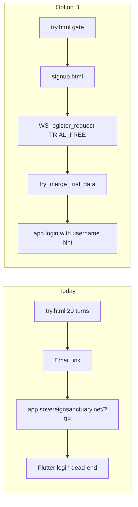

# Phase 3 — signup.html (Option B)

## Problem

Trial users who finish 20/20 or click the email link land on the Flutter app root ([`public_trial_gate.py`](backend/app/services/public_trial_gate.py) lines 697–702, 1047–1049) with **no account and no credentials**. Backend Phase 3 is largely done (`TRIAL_FREE`, Turnstile, merge in [`public_trial_conversion.py`](backend/app/services/public_trial_conversion.py)); the missing piece is a **dedicated signup surface** and URL retargeting.



## Locked decisions (from prompt — do not change)

- `registration_type` is always `"TRIAL_FREE"` from signup.html (no card, 5,000 tokens, no Stripe).
- One free grant total at signup; no extension tokens.
- Merge priority: `trial_token` → `device_fingerprint` → no match (signup still succeeds).
- Do **not** modify crisis ordering or turn-cap logic beyond URL strings.

---

## Verified backend readiness

| Requirement | Status | Location |
|-------------|--------|----------|
| `register_request` pre-auth | OK | [`bridge_server.py`](backend/app/websocket/bridge_server.py) ~12681 |
| `TRIAL_FREE` → 5,000 tokens, no card | OK | ~3866–3877 |
| Turnstile + IP cap for `TRIAL_FREE` | OK | ~3919–3933, [`turnstile.py`](backend/app/services/turnstile.py) |
| Merge after register | OK | ~13205–13216, [`public_trial_conversion.py`](backend/app/services/public_trial_conversion.py) |
| `consent_agreed` required | **signup.html must send** | ~3683–3684 |
| `trial_merged` in WS response | **Missing — add in bridge** | User confirmed yes |

**Actual post-register WS behavior:** bridge auto-authenticates and sends **`login_success`** (not `register_success`) when password hash round-trips (~13278–13295). signup.html must handle `login_success` + `registration_failed`; ignore/auto-discard token unless you later want one-click app entry.

---

## Commit 1 — New [`dashboard/signup.html`](dashboard/signup.html)

### Design (mirror [`dashboard/try.html`](dashboard/try.html))

- Same CSS tokens (`--bg`, `--gold`, DM Sans / Cormorant).
- Title: **Create your free account**
- Subtitle: **Little Nate will remember everything you've shared — pick up right where you left off.**
- Footer: 988 crisis line + hardcoded `© 2025–2026` (match try.html line 386 — no `document.write`).
- CSP meta: allow Turnstile — add `https://challenges.cloudflare.com` to `script-src` and `frame-src` (try.html has no CSP today; signup adds one per spec).

### URL params (on load)

| Param | Use |
|-------|-----|
| `fp` | Raw trial UUID → `device_fingerprint` |
| `tt` | Email token → `trial_token` |
| `src` | Attribution only (`trial`, `trial_email`, `trial_low`) |

Fallback: if `fp` missing, read `localStorage.ss_trial_device_id` (same key as try.html ~410). Persist arriving `fp` into localStorage.

### Form + consent

Fields: username, password (show/hide, min 8 client-side), email, Turnstile widget, submit **Create my account**, subtext **No credit card required. Free.**

**Required hidden/consent:** checkbox or inline copy + `consent_agreed: true` on submit (server rejects without it).

**Turnstile site key:** public key embedded in HTML (safe). Source: Cloudflare Turnstile dashboard — pair with server `TURNSTILE_SECRET_KEY` already used by [`turnstile.py`](backend/app/services/turnstile.py). Document in file comment; add `TURNSTILE_SITE_KEY` to [`.env.template`](.env.template) for ops reference (not required at runtime for static HTML).

### WebSocket registration payload

Connect to `wss://api.sovereignsanctuary.net/ws` (same as try.html). On submit:

```json
{
  "type": "register_request",
  "username": "...",
  "password": "...",
  "email": "...",
  "role": "CLIENT",
  "registration_type": "TRIAL_FREE",
  "device_fingerprint": "<fp or null>",
  "trial_token": "<tt or null>",
  "turnstile_token": "<widget token>",
  "consent_agreed": true,
  "src": "<src param or null>"
}
```

Do **not** send `client_platform` for Turnstile bypass (server ignores it; Turnstile is unconditional for `TRIAL_FREE`).

### Response handling

| Event | UI |
|-------|-----|
| `login_success` + `trial_merged: true` | **Little Nate remembers you.** + continue CTA |
| `login_success` + `trial_merged: false` / absent | **Your account is ready.** (no memory promise) |
| `registration_failed` | Warm inline error; map `USERNAME_TAKEN`, `EMAIL_TAKEN`, `CONSENT_REQUIRED`, `Verification failed...` generically where needed; **never** confirm/deny email existence beyond server codes; re-enable form + reset Turnstile |
| In-flight | Disable submit; preserve typed fields on failure |

Success CTA: **Log in and continue** → `https://app.sovereignsanctuary.net/?src=signup_complete` with visible **Sign in as &lt;username&gt;** (do not rely on auto-login token for handoff unless product later wants it).

### Deploy

- Primary: `/var/www/sovereignsanctuary-web/signup.html` ([nginx-host-vs-docker.mdc](.cursor/rules/nginx-host-vs-docker.mdc))
- Mirror: `/opt/clinical-sovereignty-lab/dashboard/signup.html` + optional `/var/www/sovereign-command/` per [deployment-safety.mdc](.cursor/rules/deployment-safety.mdc)
- Purge: `bash scripts/cf_purge_flutter_web.sh` (include `signup.html` URL)

---

## Commit 2 — [`dashboard/try.html`](dashboard/try.html) gate fixes (3A–3C)

### 3A — Hide nudge when gated

In `showGate()` (~472): call `hideNudge()` (or remove `#nudgeBanner.show`). In `trial_state` handler when already at cap (~559–560): hide nudge before `showGate()`.

### 3B — Stop reconnect loop when gated

**Intentional tradeoff** (reverses Jul 2026 reconnect-for-email fix): once `gated = true`, `scheduleReconnect()` and `connectWS()` no-op; remove “Connection lost — reconnecting…” under gate. Email capture at gate only works if socket still open from trial; otherwise user uses gate CTA or reloads — acceptable per spec.

Update `socket.onclose` (~529–538): skip `scheduleReconnect()` when `gated`.

### 3C — Gate CTA fallback URL

Change fallback in `showGate()` (~479–481) from app root to:

`https://app.sovereignsanctuary.net/signup.html?src=trial&fp=...` (keep `utm_*` if desired).

---

## Commit 3 — Backend URL retarget + merge flag + tests

### 3A — [`public_trial_gate.py`](backend/app/services/public_trial_gate.py) `_signup_url()` (~697–702)

```python
"https://app.sovereignsanctuary.net/signup.html?src=trial&fp={uuid}&utm_source=trybottle&utm_medium=fullbridge"
```

### 3B — Email link in `_upsert_trial_lead()` (~1047–1049)

```python
"https://app.sovereignsanctuary.net/signup.html?src=trial_email&fp={raw_uuid}&tt={raw_token}"
```

Update [`_send_trial_signup_email`](backend/app/services/public_trial_gate.py) HTML (~1061–1067):

- Button text: **Create your free account — everything you shared is waiting.**
- Remove **Pick up where we left off** / implied no-signup copy.
- Keep unsubscribe link untouched.

**Also update follow-up cycle URL** (~1226) — currently still points at app root and rotates token without `fp`. Retarget to `signup.html?src=trial_email&fp={device_uuid from lead}&tt={new_token}` for consistency (small additive fix, same file).

### 3C — Optional `public_trial_lead_lookup` (skip unless ≤25 lines total)

Only if trivial: WS `{type, tt}` → `{found, email}` for email prefill. Requires allowlist in bridge (~12681), `_SENTINEL_SKIP`, and exception in [`test_public_trial_ws_auth.py`](backend/tests/test_public_trial_ws_auth.py). **Default: skip** to avoid widening pre-auth surface.

### 3D — Merge flag on `login_success` ([`bridge_server.py`](backend/app/websocket/bridge_server.py) ~13205–13295)

After `try_merge_trial_data()`, capture `_merge_result["merged"]` and attach to `reg_login_payload`:

```python
reg_login_payload["trial_merged"] = bool(_merge_result.get("merged"))
```

Only when `registration_type == "TRIAL_FREE"`. **≤10 lines**, `# QUANTUM-CRYSTAL-ARCH` comment. Protected-file limit: keep this commit under 50 lines changed in bridge.

Deploy bridge via `safe_deploy.sh bridge` on GREEN ([safe-deploy-script-mandatory.mdc](.cursor/rules/safe-deploy-script-mandatory.mdc)).

### 3E — Tests (new file or extend isolation suite)

Add to [`backend/tests/test_public_trial_isolation.py`](backend/tests/test_public_trial_isolation.py) or new `test_public_trial_signup_urls.py`:

1. `_signup_url()` contains `/signup.html`, `src=trial`, `fp=`
2. `_upsert_trial_lead` / email builder contains `/signup.html`, `tt=`, `fp=`
3. Existing suites stay green: [`test_public_trial_ws_auth.py`](backend/tests/test_public_trial_ws_auth.py), [`test_public_trial_retention_reengagement.py`](backend/tests/test_public_trial_retention_reengagement.py)

Run locally before push: `bash backend/scripts/run_ci_tests.sh`

---

## Deploy order (matches prompt Part 5)

1. **signup.html** → web doc root + CF purge  
2. **try.html** fixes → same path + purge  
3. **public_trial_gate.py** URLs + email copy + follow-up URL + tests → `scp` + `safe_deploy.sh bridge`  
4. **bridge_server.py** merge flag → separate small commit if needed for 50-line cap → `safe_deploy.sh bridge`

Each commit description must answer: *What does this expose to someone with no account and bad intent?*

---

## Manual acceptance (Part 6)

| # | Check |
|---|--------|
| 1 | Gate CTA opens `signup.html?src=trial&fp=` |
| 2 | Email link opens `signup.html?src=trial_email&fp=&tt=` |
| 3 | Turnstile renders; submit blocked without token (client + server) |
| 4 | Account created: `registration_type=TRIAL_FREE`, `token_balance=5000`, no card |
| 5 | DB: `public_summon_usage.converted=TRUE`, `public_trial_leads.converted=TRUE` (email path) |
| 6 | Success panel shows remember-variant when `trial_merged=true` |
| 7 | Login → “Do you remember what I told you about my dad?” → accurate recall (Marcus E2E) |
| 8 | Gated try.html: no stale nudge, no reconnect spinner |
| 9 | Cross-device: email link in fresh browser profile, signup with `tt` only → merge via token |

---

## Out of scope (explicit)

- Token extension phase on try.html (5000 anonymous tokens post-20/20)
- Flutter `main.dart` changes
- New registration types or Stripe paths
- Crisis / turn-cap logic changes

## Risk notes

| Risk | Mitigation |
|------|------------|
| Gated + no reconnect breaks email capture after WS drop | Gate CTA + email sent before disconnect; reload acceptable |
| Turnstile site key missing in repo | Pull from Cloudflare dashboard before building signup.html |
| Protected bridge 50-line limit | Split gate URLs (public_trial_gate.py) vs merge flag (bridge) across commits |
| `login_success` vs `register_success` naming | signup.html listens for `login_success` as primary success path |
