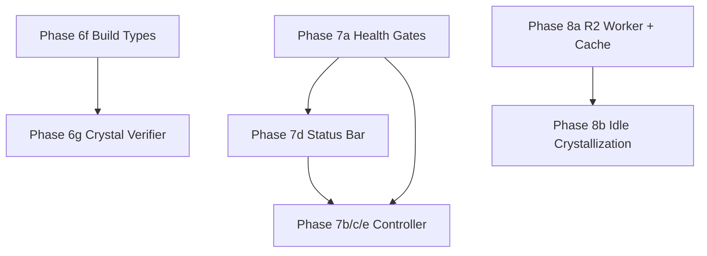

# Phases 6–8 Integration Plan

Integrate the Sovereign Sanctuary Phases 6–8 package (Workspace Inversion completion, Autonomous Loop, R2 Cache) into the project. Source files live in `/Users/nathannevedal/Downloads/`.

---

## Prerequisites and Dependencies


| Item                       | Status                                                                                                            |
| -------------------------- | ----------------------------------------------------------------------------------------------------------------- |
| Phase 5 (build tools)      | Done — `build_protocol.py`, `versioned_build_manager.py`, `build_test_suite.py`, `cli_tools.py` build tools exist |
| Python `build_protocol.py` | Exists at [backend/app/websocket/build_protocol.py](backend/app/websocket/build_protocol.py)                      |
| Cloudflare workers layout  | Existing: `cloudflare/workers/nate-*` — add new `workspace-cache/`                                                |
| `workspace_r2_cache.py`    | Not in Downloads — must be created per INTEGRATION_GUIDE spec                                                     |


---

## Phase 6f: Build Protocol TypeScript Types

**Copy:** [buildProtocol.ts](file:///Users/nathannevedal/Downloads/buildProtocol.ts) → `vscode-extension/src/types/buildProtocol.ts`

**Wire:**

1. [vscode-extension/src/types.ts](vscode-extension/src/types.ts): Add `export * from './buildProtocol';`
2. [vscode-extension/src/chatPanel.ts](vscode-extension/src/chatPanel.ts): In WebSocket message handler, add cases for `build_status`, `build_verify_request`, `build_verify_result`, `build_promote_green`, `build_promote_complete`, `build_rollback` — call `updateBuildPanelState()` / `handleBuildEvent()` (implement or stub minimal handlers)

**Estimated:** ~30 min.

---

## Phase 6g: Workspace Crystal Verifier

**Copy:** [workspace_crystal_verifier.py](file:///Users/nathannevedal/Downloads/workspace_crystal_verifier.py) → `backend/app/websocket/workspace_crystal_verifier.py`

**Integration note:** The guide refers to `_cli_log_tool_result()` in cli_tools.py. That function does not exist. Tool logging happens in [bridge_server.py](backend/app/websocket/bridge_server.py) in the `nate_cli_chat` handler (around line 28084) where `tool_log` is built. Verification must be injected there.

**Wire:**

1. **bridge_server.py** (nate_cli_chat handler, where `tool_log.append(...)` happens): Before appending, call `classify_verification(tool_name=..., workspace_connected=..., routed_through_workspace=..., diagnostics_result=..., duration_ms=...)` and add `verification` and `confidence_modifier` to the log entry. Pass `_workspace_connected` and `_routed_via_workspace` from the handler context; obtain `diagnostics_result` from workspace provider if available.
2. **nate_memory_crystallizer.py**: In the INSERT path for new crystals (around line 684 where `confidence` is set to 0.6), add logic to apply `fragment.get("verification", {}).get("confidence_modifier", 0)` to the initial confidence, capped at 0.95. Ensure fragments flowing from CLI tool logs include the `verification` field.

**Estimated:** 1–2 hours. Verify tool call → crystal path carries verification metadata.

---

## Phase 7a: Autonomous Health Gates

**Copy:** [autonomous_health.py](file:///Users/nathannevedal/Downloads/autonomous_health.py) → `backend/app/websocket/autonomous_health.py`

**Schema fix:** `_gate_trust_score` queries `auditor_name, current_score` from `trust_baseline`. The real `trust_baseline` table has `parameter_key`, `parameter_value` (JSONB). Trust Enforcer stores results in `skyeye_activity`, not `trust_baseline`. Update `_gate_trust_score` to either:

- Query `skyeye_activity` for recent `trust_enforcer_sent` and parse `content` for 100%, or
- Skip the gate when schema doesn’t match (like other gates that skip in local dev).

**Wire:**

1. [bridge_server.py](backend/app/websocket/bridge_server.py): Import `AutonomousHealthGates`, instantiate with `db_pool`, `redis_client`, `crystallizer`, `project_root`, `use_redis` from env. Start `run_loop()` with a broadcast function that sends `health_status` to connected admin WebSocket clients.
2. Add `health_status` to `_SENTINEL_SKIP`.

**Estimated:** 1 hour.

---

## Phase 7d: Status Bar Autonomous

**Copy:** [statusBarAutonomous.ts](file:///Users/nathannevedal/Downloads/statusBarAutonomous.ts) → `vscode-extension/src/statusBarAutonomous.ts`

**Wire:**

1. [extension.ts](vscode-extension/src/extension.ts): Import `createHealthStatusBarItem`, `registerHealthDetailsCommand`, `disposeHealthStatusBar`. In `activate()`, create health bar (priority 99), register command, push to subscriptions. In `deactivate()`, call `disposeHealthStatusBar()`.
2. [chatPanel.ts](vscode-extension/src/chatPanel.ts): In WebSocket message handler, add `case "health_status": updateAutonomousStatus(msg); break;`

**Estimated:** ~30 min.

---

## Phase 7b/c/e: Autonomous Controller

**Copy:** [autonomous_controller.py](file:///Users/nathannevedal/Downloads/autonomous_controller.py) → `backend/app/websocket/autonomous_controller.py`

**Wire:**

1. [bridge_server.py](backend/app/websocket/bridge_server.py): Import `AutonomousController`. After health gates are initialized, create controller with `health_gates`, `project_root`, `crystallizer`, `broadcast_fn` (same as health gates), `health_interval=60`, `learn_budget=600`. Start with `asyncio.create_task(controller.run())`.

**Note:** Broadcast function must target admin WebSocket clients. Implement `_broadcast_health` that iterates over connected admin sessions and sends the message.

**Estimated:** ~2 hours.

---

## Phase 8a: R2 Workspace Cache Worker

**Create directory:** `cloudflare/workers/workspace-cache/`

**Copy:**

- [workspace_cache_worker.ts](file:///Users/nathannevedal/Downloads/workspace_cache_worker.ts) → `cloudflare/workers/workspace-cache/src/index.ts`
- [wrangler.toml](file:///Users/nathannevedal/Downloads/wrangler.toml) → `cloudflare/workers/workspace-cache/wrangler.toml`

**Manual steps:**

- Create R2 bucket: `wrangler r2 bucket create sovereign-workspace`
- Set secret: `wrangler secret put AUTH_TOKEN`
- Deploy: `wrangler deploy`

**Create workspace_r2_cache.py** (not provided): Per INTEGRATION_GUIDE, implement `WorkspaceR2Cache` class with `push_file(relative_path, content)`, `get_file(path)`, `stats()`. Uses HTTP PUT/GET to the worker URL with Bearer token.

**Wire in bridge_server.py:**

- Initialize `WorkspaceR2Cache` when `R2_WORKSPACE_WORKER_URL` and `R2_WORKSPACE_AUTH_TOKEN` are set.
- In `workspace_event` handler, on `file_saved`, call `_r2_cache.push_file(path, content)` (fire-and-forget).

**Wire in cli_tools.py:** In `read_file` fallback (when workspace routing fails), if `_r2_cache` exists, try `await _r2_cache.get_file(safe_path)` and return with `source: "r2_cache"`.

**Estimated:** 3–4 hours (including worker deploy and Python module).

---

## Phase 8b: Idle Crystallization

In `LearnMode._organic_ingestion()` (or as a new priority in `run_learn_cycle()`), add:

- If `self._r2_cache` and `stats()["files_cached"] > 0`, run `IdleCrystallizer(r2_cache, crystallizer).scan_and_crystallize()`.
- Append result to `results["activities"]`.

Requires `IdleCrystallizer` implementation (scan R2 keys, fetch content, forge crystals) — may live in `workspace_r2_cache.py` or a separate module.

**Estimated:** ~1 hour after 8a.

---

## Build Order (Per INTEGRATION_GUIDE)




Recommended sequence: **6f → 6g → 7a → 7d → 7b/c/e → 8a → 8b**.

---

## Environment Variables (Phase 8)

Add to `.env` and `start_bridge_local.sh`:

```bash
R2_WORKSPACE_WORKER_URL=https://sovereign-workspace-cache.<subdomain>.workers.dev
R2_WORKSPACE_AUTH_TOKEN=<secret>
```

---

## Schema / Compatibility Notes

1. **trust_baseline**: `autonomous_health._gate_trust_score` assumes `auditor_name`, `current_score` columns. Actual schema uses `parameter_key`, `parameter_value`. Adapt or skip this gate when DB schema differs.
2. **applied_migrations**: `_gate_migrations_current` expects `applied_migrations`; confirm migration tracking table name in this project.
3. **bridge_errors.log**: `_gate_error_free` reads `bridge_errors.log` (JSONL). Create or ensure this file exists if the gate is used; otherwise it passes when missing.

---

## Summary


| Phase  | New Files                                     | Modified Files                                  | Restart Bridge? |
| ------ | --------------------------------------------- | ----------------------------------------------- | --------------- |
| 6f     | 1                                             | types.ts, chatPanel.ts                          | No              |
| 6g     | 1                                             | bridge_server.py, nate_memory_crystallizer.py   | Yes             |
| 7a     | 1                                             | bridge_server.py                                | Yes             |
| 7d     | 1                                             | extension.ts, chatPanel.ts                      | No              |
| 7b/c/e | 1                                             | bridge_server.py                                | Yes             |
| 8a     | 3 (worker + wrangler + workspace_r2_cache.py) | bridge_server.py, cli_tools.py                  | Yes             |
| 8b     | 0                                             | autonomous_controller.py, workspace_r2_cache.py | Yes             |


