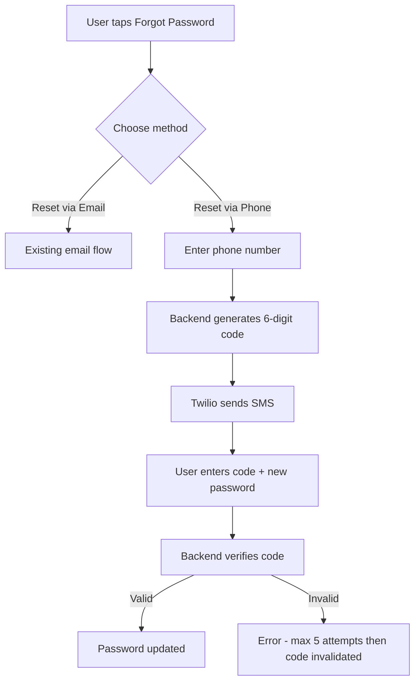

# Phone SMS 2-Step Password Reset

## Important: SMS Provider

SendGrid is an email-only service and does **not** support SMS. For text messages, **Twilio** is required (SendGrid's parent company). The `twilio` Python package will be added to [backend/requirements.txt](backend/requirements.txt). You will need:

- A Twilio account (free trial available at twilio.com -- includes a phone number)
- `TWILIO_ACCOUNT_SID`, `TWILIO_AUTH_TOKEN`, `TWILIO_PHONE_NUMBER` env vars

## Architecture

## Phone field prerequisite

User profiles already store a `phone` field (line 1483 of [bridge_server.py](backend/app/websocket/bridge_server.py)). The user's phone number in the registry is what the backend will look up and send the SMS to. Users without a phone number on file cannot use this method.

## Changes

### 1. Add Twilio dependency and env vars

- Add `twilio` to [backend/requirements.txt](backend/requirements.txt)
- Add `TWILIO_ACCOUNT_SID`, `TWILIO_AUTH_TOKEN`, `TWILIO_PHONE_NUMBER` to [.env.template](.env.template)

### 2. Add SMS capability to notification_system.py

In [backend/app/websocket/notification_system.py](backend/app/websocket/notification_system.py):

- Import `twilio.rest.Client` with a fallback (same pattern as SendGrid)
- Initialize `self.twilio_client` in `__init__` using the three Twilio env vars
- Add `send_sms(to_phone, body)` -- core SMS send method
- Add `send_password_reset_sms(to_phone, code)` -- formatted message: "Your Little Nate password reset code is: XXXXXX. Valid for 10 minutes. Do not share this code."

### 3. Add backend handlers in bridge_server.py

In [backend/app/websocket/bridge_server.py](backend/app/websocket/bridge_server.py), add two new handlers after the existing `forgot_password_confirm` block:

`**forgot_password_phone_request**` (around line 5604):

- Receives `{ "type": "forgot_password_phone_request", "phone": "+1XXXXXXXXXX" }`
- Rate limit: reuse `_check_forgot_rate_limit` with key `sms:{phone}`
- Normalize the phone number (strip spaces, ensure starts with +)
- Look up user by phone field in registry
- Generate a 6-digit numeric code (`random.randint(100000, 999999)`)
- Store `phone_reset_code` (the code), `phone_reset_expires` (10 min from now), and `phone_reset_attempts` (0) in the user's profile
- Send SMS via `notification_system.send_password_reset_sms(phone, code)`
- Always respond with `{ "type": "forgot_password_phone_sent", "message": "If that phone number is on file, a code was sent" }` (constant-time response to avoid enumeration)

`**forgot_password_phone_confirm**` (right after):

- Receives `{ "type": "forgot_password_phone_confirm", "phone": "...", "code": "123456", "new_password": "..." }`
- Rate limit per connection (max 5 failed attempts per code)
- Look up user by phone, verify `phone_reset_code == code` and `phone_reset_expires` not passed
- Increment `phone_reset_attempts`; if >= 5, invalidate the code entirely
- On success: hash new password, clear code fields, respond with `{ "type": "password_reset_phone_success" }`
- On failure: respond with `{ "type": "error", "message": "Invalid or expired code" }`

### 4. Update Flutter UI -- choice dialog

In [mobile/lib/main.dart](mobile/lib/main.dart), refactor the existing "Forgot password?" button flow:

- Replace `_showForgotPasswordDialog()` with `_showForgotPasswordMethodDialog()` that displays two buttons:
  - **"Reset via Email"** -- calls the existing `_showForgotPasswordDialog()`
  - **"Reset via Phone"** -- calls a new `_showForgotPasswordPhoneDialog()`
- The "Forgot password?" `TextButton` in `_showLoginDialog` (line 4668) calls `_showForgotPasswordMethodDialog()` instead

### 5. Add Flutter phone reset dialogs

In [mobile/lib/main.dart](mobile/lib/main.dart), add two new methods:

`**_showForgotPasswordPhoneDialog()**`:

- Dialog with a phone number `TextField` (keyboardType: `TextInputType.phone`)
- On submit: sends `{ "type": "forgot_password_phone_request", "phone": value }` over WebSocket
- Automatically opens `_showForgotPasswordPhoneCodeDialog()` after sending

`**_showForgotPasswordPhoneCodeDialog()**`:

- Dialog with three fields: phone (pre-filled, read-only), 6-digit code, new password
- On submit: sends `{ "type": "forgot_password_phone_confirm", "phone": ..., "code": ..., "new_password": ... }`
- Handle `password_reset_phone_success` in `_handlePacket` -- show SnackBar and dismiss dialog

### 6. Handle new message types in Flutter

In the `_handlePacket` method of `_LobbyScreenState`:

- `forgot_password_phone_sent` -- show SnackBar: "If that phone is on file, a code was sent"
- `password_reset_phone_success` -- show SnackBar: "Password updated. Please log in."

## Security considerations for 6-digit SMS codes

- **Short expiry**: 10 minutes (vs 1 hour for email links)
- **Attempt limit**: Max 5 incorrect attempts per code, then code is invalidated
- **Rate limit SMS sending**: Max 3 SMS per phone number per 15 minutes (reuses existing rate limiter)
- **No phone enumeration**: Always return same message whether phone exists or not
- **Constant-time response**: Same response delay regardless of user found

