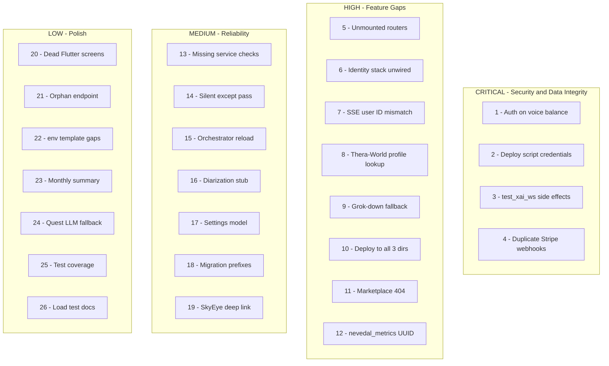

# Sovereign Sanctuary Platform Audit Remediation

## Severity Tiers



---

## CRITICAL — Security and Data Integrity

### 1. Unauthenticated voice balance endpoint
- **File**: [backend/app/routers/voice_billing_api.py](backend/app/routers/voice_billing_api.py)
- **Problem**: `GET /balance/{phone}` has no `Depends(require_admin)` or `Depends(get_current_user)`. Any caller can query prepaid balance by phone.
- **Fix**: Add `Depends(require_admin)` to the endpoint signature. This is admin-only data.

### 2. Deploy script credential leak
- **File**: [deploy-web.sh](deploy-web.sh)
- **Problem**: Cloudflare API token is hardcoded in plaintext. Script is gitignored but lives in the workspace.
- **Fix**: Full rewrite of `deploy-web.sh` (see dedicated section below). Replace hardcoded token with `$CF_PURGE_TOKEN` env var read from `.env` or shell environment.

### 3. test_xai_ws.py side effects at import
- **File**: [backend/tests/test_xai_ws.py](backend/tests/test_xai_ws.py)
- **Problem**: `asyncio.run(test())` at module scope fires a live xAI WebSocket call during pytest collection.
- **Fix**: Rename function to `main()`, wrap execution in `if __name__ == "__main__":`, add `@pytest.mark.skip(reason="manual live test")` if keeping as a test file.

### 4. Duplicate Stripe voice_block webhook paths
- **Files**: [backend/app/services/stripe_integration.py](backend/app/services/stripe_integration.py), [backend/app/routers/voice_billing_api.py](backend/app/routers/voice_billing_api.py)
- **Problem**: `checkout.session.completed` with `metadata.type == "voice_block"` can be handled by both the main webhook handler and the voice-specific webhook, double-crediting seconds.
- **Fix**: Add idempotency check — before crediting, query `voice_transactions` for the Stripe session ID. If already credited, skip. Add `ON CONFLICT DO NOTHING` or a `processed_stripe_sessions` guard.

---

## HIGH — Feature Gaps and Integration Holes

### 5. Unmounted routers (11+)
- **File**: [backend/app/main.py](backend/app/main.py)
- **Problem**: These router files exist but are not `include_router`'d: `token_api.py`, `sovereignty.py`, `patient_sovereignty.py`, `sovereign_completions_api.py`, `cli_analytics_api.py`, `oauth_api.py`, `nightly_audit_api.py`, `cloudflare_realtime_api.py`, `monetization_control_api.py`, `cycle_api.py`, `predictive_api.py`.
- **Fix**: For each, decide: (a) mount it with appropriate auth, (b) archive it to `_archive/` if deprecated. Add mounted routers to auditor endpoint lists if they serve live features.

### 6. Therapeutic Identity stack not wired
- **Files**: [backend/app/main.py](backend/app/main.py), [backend/app/services/twilio_grok_xtts_pipeline.py](backend/app/services/twilio_grok_xtts_pipeline.py)
- **Problem**: `LiveDiarizationSession`, `IdentityRefinementEngine`, `VoiceEnrollmentService` are fully implemented but never called from the live voice pipeline. `main.py` only bootstraps `ConsentPrivacyManager` + `InstitutionalDeploymentManager`.
- **Fix**: This is a phased integration (Patent 11). Gate behind `ENABLE_VOICE_IDENTITY=true` feature flag. Wire `LiveDiarizationSession` into the Twilio media handler's audio chunk path. Bootstrap remaining identity services in `main.py` lifespan under the flag.

### 7. SSE widget_engine user ID type mismatch
- **File**: [backend/app/sse/widget_engine.py](backend/app/sse/widget_engine.py)
- **Problem**: Queries `nate_intelligence_crystals.user_id` (UUID column) with a `hardware_id` string. Returns 0 rows or throws asyncpg type error.
- **Fix**: Resolve the UUID first: `SELECT id FROM users WHERE hardware_id = $1 OR username = $1 LIMIT 1`, then use that UUID for crystal queries. This matches the pattern used elsewhere (e.g., `recall_crystals_for_context`).

### 8. Thera-World therapeutic profile lookup broken
- **File**: [backend/app/sse/thera_world_engine.py](backend/app/sse/thera_world_engine.py)
- **Problem**: `get_therapeutic_profile` does `SELECT id FROM users WHERE username = $1` but receives `hardware_id`, so `uid` is NULL and crystal context is empty for all LLM narratives.
- **Fix**: Change to `SELECT id FROM users WHERE hardware_id = $1 OR username = $1 LIMIT 1`. Same pattern as fix #7.

### 9. Grok-down voice fallback (TODO Phase 2)
- **File**: [backend/app/services/twilio_grok_xtts_pipeline.py](backend/app/services/twilio_grok_xtts_pipeline.py)
- **Problem**: If Grok Realtime API is unreachable, session stays open but silent — caller hears nothing.
- **Fix**: In the Grok WebSocket error handler, after `_delayed_recovery` timeout (3s), fall back to Azure OpenAI Chat Completions for text generation, then route through Azure TTS. This is a significant feature — gate behind `ENABLE_GROK_FALLBACK_CHAT=true`.

### 10. deploy-web.sh deploys to only 1 of 3 directories
- **File**: [deploy-web.sh](deploy-web.sh)
- **Problem**: Only targets `/var/www/sovereignsanctuary-web/`. Misses `coach-portal` and `sovereign-command`. Uses `scp` which hangs.
- **Fix**: See dedicated deploy script rewrite section below. Switch to `rsync`, add all 3 targets.

### 11. Marketplace tab links to archived file
- **File**: [dashboard/command.html](dashboard/command.html)
- **Problem**: `navTo('sovereign-command-admin.html')` but file only exists in `dashboard/_archive/`.
- **Fix**: Either (a) move `_archive/sovereign-command-admin.html` back to `dashboard/` and update it, or (b) remove/disable the Marketplace nav tab in `command.html` if the feature is retired.

### 12. nevedal_metrics UUID mismatch in SSE monitor
- **File**: [backend/app/sse/thera_world_engine.py](backend/app/sse/thera_world_engine.py)
- **Problem**: `get_user_sse_status` passes a text `user_id` to query `nevedal_metrics.user_id` (UUID column).
- **Fix**: Same as #8 — resolve user UUID first, then query `nevedal_metrics` with the UUID.

---

## MEDIUM — Reliability and Observability

### 13. Important services missing from _service_checks
- **File**: [backend/app/main.py](backend/app/main.py)
- **Problem**: `sse_orchestrator`, `littlenate_inference`, `nate_memory_crystallizer`, `helix_orchestrator`, `federated_search`, `odpe_engine`, `cycle_detection_engine`, `exa_crystallization_hook` are on `app.state` but not health-checked.
- **Fix**: Add each to `_service_checks` list. Update the service health denominator in `.cursor/rules/service-health-49-49.mdc` to match the new total.

### 14. Bare `except Exception: pass` violations
- **Files**: [backend/app/main.py](backend/app/main.py) (~lines 135, 420, 564, 757, 1395, 2300, 3519), [backend/app/sse/thera_world_engine.py](backend/app/sse/thera_world_engine.py)
- **Problem**: Silent exception swallowing violates `background-agent-error-visibility` rule.
- **Fix**: Replace each `pass` with `logger.warning("context: %s", e)` and keep the fallback behavior.

### 15. Orchestrator reload() doesn't stop old jobs
- **File**: [backend/app/sse/layer0_orchestrator.py](backend/app/sse/layer0_orchestrator.py)
- **Problem**: `reload()` calls `start()` without tearing down existing APScheduler jobs, potentially duplicating cron runs.
- **Fix**: Add `self.scheduler.remove_all_jobs()` at the top of `start()` before re-adding jobs, or add a `stop()` call in `reload()` before `start()`.

### 16. Diarization process_audio_chunk placeholder
- **File**: [backend/app/services/live_diarization.py](backend/app/services/live_diarization.py) (lines 168-169)
- **Problem**: Explicit `pass` in the early enrollment/greeting branch of the streaming audio path.
- **Fix**: Defer until Identity stack integration (#6). Document the gap with a comment referencing the feature flag.

### 17. Settings model rejects unknown env vars
- **File**: [backend/app/config/_settings.py](backend/app/config/_settings.py)
- **Problem**: Pydantic v2 `Settings` throws `ValidationError` for undeclared env vars (`NATE_CHAT_*`, `XAI_*`, `TWILIO_*`).
- **Fix**: Either add `model_config = SettingsConfigDict(extra="ignore")` to the Settings class, or declare all production env vars as Optional fields.

### 18. Duplicate migration number prefixes
- **File**: [backend/migrations/](backend/migrations/)
- **Problem**: Prefixes 001, 069, 081, 145, 163, 174 each have 2-3 files. Fresh DB init order depends on filename sort.
- **Fix**: Rename duplicates to sequential numbers (e.g., `001a_` and `001b_` or renumber to fill gaps). Document the canonical order. This is a migration hygiene task — existing production DB is unaffected since it applies manually.

### 19. SkyEye hardware-security deep link broken
- **File**: [dashboard/skyeye.html](dashboard/skyeye.html)
- **Problem**: `command.html` links to `skyeye.html#hardware-security` but only `#command-terminal` is handled in the script.
- **Fix**: Add a hash-detection block after page load: `if (location.hash === '#hardware-security') switchTab('hardware-security');`

---

## LOW — Dead Code, Unused Features, Polish

### 20. Unreachable Flutter screens
- **Files**: `mobile/lib/screens/` and `mobile/lib/`
- **Problem**: `CoachPortalScreen`, `MetricsScreen`, `LiminalPresenceScreen` subtree, `DojoMentorOverlay` are never imported/constructed.
- **Fix**: Archive to a `_deprecated/` directory or delete. No functional impact.

### 21. Orphan `/api/v1/user/paid-onboarding-seen`
- **File**: [mobile/lib/screens/onboarding_paid_screen.dart](mobile/lib/screens/onboarding_paid_screen.dart)
- **Problem**: HTTP call to non-existent endpoint; error is swallowed (WS fallback works).
- **Fix**: Either create the endpoint (5 lines in admin.py) or remove the HTTP call and rely on the WS path exclusively.

### 22. .env.template missing inference keys
- **File**: [.env.template](.env.template)
- **Problem**: `NATE_CHAT_URL`, `NATE_CHAT_KEY`, `NATE_CHAT_MODEL`, `XAI_API_KEY`, `GROK_NATIVE_VOICE`, `GROK_VOICE` are not documented.
- **Fix**: Append an "Inference Routing" section to `.env.template` with all inference-related vars and comments.

### 23. Monthly voice billing summary incomplete
- **File**: [backend/app/routers/voice_billing_api.py](backend/app/routers/voice_billing_api.py)
- **Problem**: `GET /monthly-summary` returns data but the "email invoice" feature referenced in comments is not built.
- **Fix**: Document as planned feature. No code change needed unless building the email flow.

### 24. Quest/mission engine uses template fallback
- **File**: [backend/app/sse/quest_mission_engine.py](backend/app/sse/quest_mission_engine.py)
- **Problem**: Phase 2B/3 TODO — LLM-composed quest/mission panels and crystal confidence scoring not implemented.
- **Fix**: SSE roadmap item. No immediate fix needed; document in SSE build status.

### 25. No pytest coverage for SSE, routers, or bridge
- **File**: [backend/tests/](backend/tests/)
- **Problem**: Tests cover engines and fibres but not routers, SSE, or bridge systematically.
- **Fix**: Create `test_sse_endpoints.py` and `test_router_smoke.py` with basic 200/422 checks for each mounted router. Medium effort; lower priority than security fixes.

### 26. Load test files undocumented
- **File**: [backend/tests/](backend/tests/)
- **Problem**: `load_test_*.py` files are excluded from pytest by naming convention; not documented.
- **Fix**: Add a `README.md` in `backend/tests/` explaining the test organization and how to run load tests manually.

---

## Architectural Issues

### A. Service count drift
- **Files**: `.cursor/rules/service-health-49-49.mdc`, `.cursor/rules/trust-100-percent.mdc`, `.cursor/rules/deployment-trust-100-percent.mdc`
- **Problem**: Rules reference 103, 105, 124, and 161 in different places. Actual `_service_checks` is 105.
- **Fix**: After fixing #13 (adding missing services), update ALL rule files to the new correct denominator.

### B. User ID inconsistency across subsystems
- **Problem**: Three identifier types used interchangeably — `username` (TEXT), `hardware_id` (TEXT), `users.id` (UUID). SSE tables use TEXT (hardware_id), crystals use UUID, conversation_history uses TEXT (username).
- **Fix**: Items #7, #8, and #12 address the immediate breakage. Long-term: standardize SSE and widget code to always resolve UUID via `SELECT id FROM users WHERE hardware_id = $1 OR username = $1`.

### C. SSE phase gaps
- Phases 1-3: substantially built
- Phase 5 (weekly clips / monthly recap video): TODO comments only
- Phase 6 (couples / family / relational crystals): TODO comments only
- LLM narrative pipeline: fails soft to templates but doesn't log HTTP status codes from Grok

### D. Identity system operationally disconnected
- Patent 11 stack is library-complete: enrollment, linguistic, narrative, therapeutic inference, OSD, roleplay, liveness, investigation, mandatory reporting
- None called from production Twilio pipeline
- Only `ConsentPrivacyManager` + `InstitutionalDeploymentManager` bootstrapped
- Full integration gated on item #6 with `ENABLE_VOICE_IDENTITY` flag

---

## deploy-web.sh Rewrite (Items #2 and #10)

The script must be fully rewritten to address security (credential leak) and completeness (3 deploy targets, cache-busting, optional backend deploy):

```bash
#!/bin/bash
set -e
cd ~/Desktop/Clinical-Sovereignty-Lab-2

VERSION=$(date +%Y.%m.%d.%H%M)
COMMIT=$(git rev-parse --short HEAD)
SERVER=root@68.183.168.75

# Read Cloudflare token from env (NEVER hardcode)
CF_TOKEN="${CF_PURGE_TOKEN:?Set CF_PURGE_TOKEN in your shell environment}"
CF_ZONE="08f370c28164099f6434cc472ee97db5"

# --- Optional backend deploy (-b / --backend) ---
if [ "$1" = "--backend" ] || [ "$1" = "-b" ]; then
  echo "Deploying backend files..."
  scp backend/app/routers/admin.py $SERVER:/opt/clinical-sovereignty-lab/backend/app/routers/
  scp backend/app/sse/*.py $SERVER:/opt/clinical-sovereignty-lab/backend/app/sse/
  scp backend/app/services/*.py $SERVER:/opt/clinical-sovereignty-lab/backend/app/services/
  ssh $SERVER "docker compose -f /opt/clinical-sovereignty-lab/docker-compose.prod.yml restart backend && sleep 8 && docker logs nate_backend --tail 3"
  echo "Backend deployed and restarted"
fi

# --- Flutter web build + version stamp ---
echo "Building Flutter web (v$VERSION - $COMMIT)..."
cd mobile
flutter build web

cat > build/web/version.json << VJSON
{"version":"$VERSION","build":"$COMMIT","deployed_at":"$(date -u +%Y-%m-%dT%H:%M:%SZ)"}
VJSON

# --- Deploy to all 3 directories ---
echo "Deploying to GREEN (3 targets)..."
rsync -avz --timeout=60 build/web/ $SERVER:/var/www/sovereignsanctuary-web/
rsync -avz --timeout=60 build/web/ $SERVER:/var/www/coach-portal/
# Static assets only for sovereign-command (not Flutter bootstrap)
rsync -avz --timeout=60 --exclude='index.html' build/web/ $SERVER:/var/www/sovereign-command/

# --- Cloudflare cache purge ---
echo "Purging Cloudflare cache..."
curl -s -X POST "https://api.cloudflare.com/client/v4/zones/$CF_ZONE/purge_cache" \
  -H "Authorization: Bearer $CF_TOKEN" \
  -H "Content-Type: application/json" \
  --data '{"purge_everything":true}' \
  | python3 -c "import sys,json; r=json.load(sys.stdin); print('Cache purged' if r.get('success') else 'Purge failed:', r)"

echo "Deploy complete: v$VERSION ($COMMIT)"
```

Key changes:
- Cloudflare token from `$CF_PURGE_TOKEN` env var, not hardcoded
- `rsync` instead of `scp` (no hanging)
- All 3 target directories (`sovereignsanctuary-web`, `coach-portal`, `sovereign-command`)
- `version.json` stamped after build for service worker cache invalidation
- Optional `-b` flag for backend deploy (excludes protected files)
- `sovereign-command` rsync excludes `index.html` (Flutter bootstrap must not overwrite admin portal)
