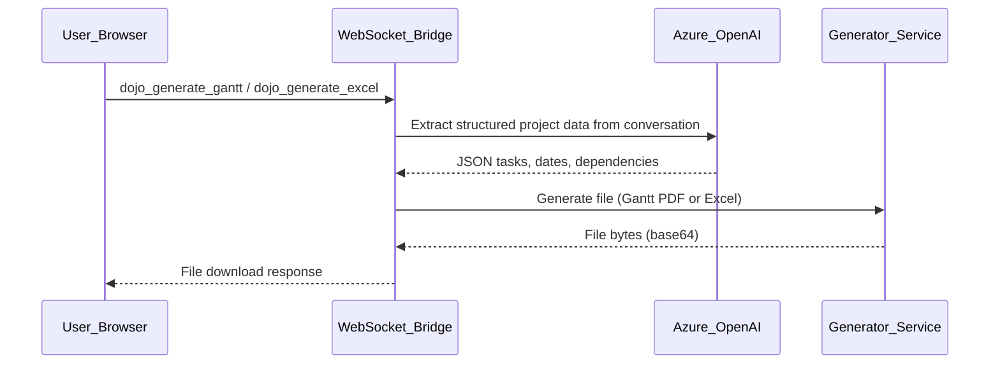

# PM Dojo: Gantt Chart and Excel Export

## Current State

The Project PM Dojo ([dashboard/night_school_dojo.html](dashboard/night_school_dojo.html)) is a coaching simulation with 6 PM personas (Sprint Planning, Backlog Grooming, etc.). It already has PDF generation via jsPDF on the frontend and fpdf2 on the backend. There is **no** Gantt chart or Excel capability anywhere in the codebase.

## What We're Building

Two new export features for the PM Dojo, accessible from the right-side analysis panel when in `project_pm` mode:

1. **Gantt Chart Generator** -- User describes their project in the Dojo chat. A "Generate Gantt Chart" button sends the conversation to the backend, which uses the AI to extract tasks/phases/dates, then renders a Gantt chart as a downloadable PDF.
2. **Excel Export** -- User requests a spreadsheet. A "Export to Excel" button sends the conversation to the backend, which structures the data into an Excel workbook (tasks, timelines, resources, dependencies) and returns it for download.

## Architecture




## Backend Changes

### 1. New dependency: `openpyxl` for Excel generation

Add to [backend/requirements.txt](backend/requirements.txt):

```
openpyxl==3.1.2
```

We will use `fpdf2` (already installed) for the Gantt chart PDF -- no new dependency needed for that.

### 2. New service: `backend/app/services/pm_export_service.py`

This new file will contain:

- `extract_project_data(conversation_messages) -> dict` -- Builds an AI prompt that asks GPT-4o to extract structured project data (tasks, start dates, end dates, dependencies, assignees, milestones) from the Dojo conversation as JSON.
- `generate_gantt_pdf(project_data) -> bytes` -- Uses `fpdf2` to render a horizontal Gantt chart with task bars, milestone markers, and a timeline axis. Returns PDF bytes.
- `generate_excel_workbook(project_data) -> bytes` -- Uses `openpyxl` to create an Excel workbook with:
  - **Project Overview** sheet (name, dates, summary)
  - **Task List** sheet (ID, name, start, end, duration, assignee, status, dependencies)
  - **Timeline** sheet (visual timeline using conditional formatting)
  - Proper styling matching the Sovereign Sanctuary gold/dark theme

### 3. New WebSocket handlers in [backend/app/websocket/bridge_server.py](backend/app/websocket/bridge_server.py)

Two new message types alongside existing Dojo handlers (~line 7960):

- `dojo_generate_gantt` -- Calls `extract_project_data()` then `generate_gantt_pdf()`, returns base64 PDF
- `dojo_generate_excel` -- Calls `extract_project_data()` then `generate_excel_workbook()`, returns base64 Excel file

### 4. New REST endpoint for file download

Add a route in [backend/app/routers/](backend/app/routers/) (or as a static file serve) so the browser can download the generated files via a temporary URL, similar to the existing `/api/dojo/download-assessment/` pattern.

## Frontend Changes

### 5. Update [dashboard/night_school_dojo.html](dashboard/night_school_dojo.html)

In the PM-specific analysis panel (`id="analysisPM"`, ~line 393):

- Add a **"Generate Gantt Chart"** button -- sends `dojo_generate_gantt` via WebSocket with the current conversation messages
- Add an **"Export to Excel"** button -- sends `dojo_generate_excel` via WebSocket with the current conversation messages
- Add status/loading indicators while files are being generated
- Handle the WebSocket response: decode the base64 file and trigger a browser download

The buttons will only be visible when the Dojo mode is `project_pm` (already gated by the existing show/hide logic on line 773).

## File Summary


| File                                        | Action                                                       |
| ------------------------------------------- | ------------------------------------------------------------ |
| `backend/requirements.txt`                  | Add `openpyxl==3.1.2`                                        |
| `backend/app/services/pm_export_service.py` | **New** -- Gantt PDF + Excel generation                      |
| `backend/app/websocket/bridge_server.py`    | Add `dojo_generate_gantt` and `dojo_generate_excel` handlers |
| `dashboard/night_school_dojo.html`          | Add buttons, download handlers, WebSocket message handling   |


