# PMB Globe Command Center

## Theoretical Foundation

Implements the **5-Layer Coherence Model** from [docs/THEORETICAL_FRAMEWORK.md](docs/THEORETICAL_FRAMEWORK.md) Section 3:

- **Layer 1 (Individual)**: Per-client C_emo, PMB, STATS -- from metrics files
- **Layer 2 (Family)**: Mean coherence, system resonance (variance), pattern transmission, interruption efficacy -- computed from family_id groups
- **Layer 3 (Community)**: `s3 = 0.60 * mean_s2 + 0.40 * (1 - min(1, 3 * std_s2))` -- aggregated across community mesh `group_name` groupings within geographic areas
- **Layer 4 (Cultural)**: `s4 = 1.0 - abs(s_internal - s_external)` -- bridges internal therapeutic data with SkyEye social sentiment
- **Layer 5 (Global)**: Weighted synthesis: Individual 0.20, Family 0.25, Community 0.30, Cultural 0.25 -- the "planetary emotional weather report"

**Human-Swarm Teams** (Section 6.5): Coach specialty overlay on the globe shows which coaches' skills match which geographic areas' therapeutic needs. No new team data model in this phase -- uses existing `profile_data.specialty`/`specializations` from [backend/app/services/coach_matcher.py](backend/app/services/coach_matcher.py).

**Wisdom Mesh**: Lived wisdom from [backend/app/services/lived_wisdom.py](backend/app/services/lived_wisdom.py) feeds into the activity panel, showing community-level learning patterns extracted from `wisdom_extractions` and `community_wisdom` tables.

---

## Architecture

```mermaid
flowchart TD
    subgraph backend [Backend Endpoints]
        GeoData["GET /api/reports/pmb/geo-data"]
        CompanyStats["GET /api/reports/pmb/company-stats"]
        CoherenceLayers["GET /api/reports/pmb/coherence-layers"]
        WisdomFeed["GET /api/reports/pmb/wisdom-feed"]
        WS["WS: admin_get_client_pmb"]
    end
    subgraph datasources [Data Sources]
        LoginDB["login_attempts / audit_log"]
        IpApi["ip-api.com/batch"]
        MetricsFiles["client_metrics JSON files"]
        UsersTable["users table + profile_data"]
        CommunityTables["community_sessions\ncommunity_attendance_records"]
        WisdomTables["wisdom_extractions\ncommunity_wisdom"]
        SkyEyeActivity["skyeye_activity\n(cultural sentiment)"]
    end
    subgraph frontend [PMB Command Center UI]
        IDNav["ID Navigator\n6 types"]
        DataToggle["Data Mode\nPMB / STATS / Coherence"]
        Globe["Globe.gl\n3D + Flat toggle"]
        CoachOverlay["Coach Skill Overlay"]
        ReportPanel["Report Panel\naggregate + members + detail"]
        WisdomPanel["Wisdom Activity Feed"]
        VarRef["Variable Reference"]
    end
    LoginDB --> GeoData
    IpApi --> GeoData
    MetricsFiles --> CompanyStats
    UsersTable --> CompanyStats
    CommunityTables --> CoherenceLayers
    WisdomTables --> CoherenceLayers
    WisdomTables --> WisdomFeed
    SkyEyeActivity --> CoherenceLayers
    GeoData --> Globe
    CompanyStats --> ReportPanel
    CompanyStats --> CoachOverlay
    CoherenceLayers --> Globe
    CoherenceLayers --> ReportPanel
    WisdomFeed --> WisdomPanel
    IDNav --> Globe
    IDNav --> ReportPanel
    DataToggle --> Globe
    WS --> ReportPanel
```




---

## Task 1: Backend -- Geo-Data + Nevedal Scores + IDs + Coach Specialties

**File**: [backend/app/routers/pmb_reports_api.py](backend/app/routers/pmb_reports_api.py)

### 1a. `GET /api/reports/pmb/geo-data` (new endpoint)

- Query most recent login IP per user from `login_attempts` (`ip_address TEXT`) or `audit_log` (`ip_address INET`)
- Batch resolve unique IPs via `http://ip-api.com/batch` (free, max 100 per request), cache results in module-level dict with 24h TTL
- Return per-client objects with: `username, name, hardware_id, lat, lng, city, country, family_id, company_id, coach_id, coach_name, group_names[]` (from community_attendance_records), PMB snapshot, STATS snapshot (C_emo, GAP, Quantum, anxiety, stress, engagement, breakthrough_count)

### 1b. Expand `company-stats` endpoint

- Add `family_id`, `company_id`, `coach_id`, `coach_name` per client (from `profile_data` JSONB)
- Add STATS-level metrics: C_emo, GAP, Quantum, anxiety_level, stress_level, engagement, breakthrough_count (from `nevedal_state` in metrics files, same pattern as `_load_pmb_snapshot()`)
- Add coach specialty data: query COACH-role users for `profile_data->>'specialty'` and `profile_data->>'specializations'`, return as a `coaches` array alongside the `clients` array
- Add `group_names` per client: query `community_attendance_records` for distinct `group_name` values per `user_id`

### 1c. `GET /api/reports/pmb/coherence-layers` (new endpoint)

Computes the 5-layer coherence model from live data:

- **Layer 1** (per-client): Use C_emo from metrics as the individual coherence score `s1`
- **Layer 2** (per-family): For each `family_id` group, compute: mean individual coherence (35%), system resonance = `1 / (1 + variance)` (30%), pattern transmission rate via parent-child C_emo correlation (20%), interruption efficacy via improvement trend (15%)
- **Layer 3** (per-community-group): For each community mesh `group_name`, aggregate family coherence: `s3 = 0.60 * mean_s2 + 0.40 * (1 - min(1, 3 * std_s2))`
- **Layer 4** (cultural): Internal = mean of all Layer 1 scores; External = average sentiment from recent `skyeye_activity` posts; `s4 = 1.0 - abs(s_internal - s_external)`. Defaults to 0.5 if no SkyEye data.
- **Layer 5** (global): `s5 = 0.20*s1_avg + 0.25*s2_avg + 0.30*s3_avg + 0.25*s4`

Return: `{ layers: [{level, name, score, components}], families: [{family_id, s2, members}], communities: [{group_name, s3, families}], global_score }`.

### 1d. `GET /api/reports/pmb/wisdom-feed` (new endpoint)

- Query `wisdom_extractions` (last 50 entries): `insight_type, content, source_type, extracted_at, user_id`
- Query `community_wisdom` (last 20 entries): `topic, insight_text, convergence_count, source_session_count, location_name`
- Return combined feed sorted by recency, with anonymized user references

---

## Task 2: Frontend -- Globe + Navigator + Coherence + Wisdom

**File**: [dashboard/pmb_reports.html](dashboard/pmb_reports.html)

### 2a. Layout

```
+---------------------------------------------------------------+
| [ID Type v] [Specific ID v] [Data: PMB|STATS|Coherence]       |
| [Variable v] [3D/Flat toggle] [Queue(N)] [History]             |
| [> PMB Variable Reference (collapsible)]                       |
+---------------------------+-----------------------------------+
|                           | AGGREGATE SUMMARY (group stats)   |
|       GLOBE               |-----------------------------------|
|   (3D or Flat)            | MEMBER LIST (scrollable rows)     |
|                           |-----------------------------------|
|   Heatmap by variable     | DETAIL VIEW (full PMB/STATS/      |
|   Coach overlay dots      |   Coherence via WebSocket)        |
|   Coherence layer rings   |-----------------------------------|
|                           | WISDOM FEED (latest learnings)    |
+---------------------------+-----------------------------------+
```

### 2b. Globe.gl Dual-Mode

- CDN: `https://unpkg.com/globe.gl@2`
- 3D globe (default) and flat projection (`naturalEarth1`) via toggle button
- **Points layer**: Clients as dots at geolocated lat/lng, colored by selected variable
- **Heatmap layer** (Coherence mode): Community group regions colored by Layer 3 score (green=high coherence, red=low)
- **Coach overlay**: When toggled, shows coach locations as larger diamond markers with specialty labels
- **Click handler**: Select client, load full detail via WebSocket
- **Zoom to group**: Auto-zoom to geographic center when an ID group is selected

### 2c. ID Navigator (6 types)

- **All Clients** -- every client on the globe (default)
- **By Coach** -- groups clients by assigned coach
- **By Family** -- groups clients by `family_id`
- **By Community Group** -- groups clients by community mesh `group_name` (from `community_attendance_records`)
- **By Company** -- groups clients by `company_id`
- **Individual** -- single client picker

Second dropdown populates based on selected type. Selecting an ID filters globe + report panel + auto-zooms.

### 2d. Data Mode Toggle (3 modes)

- **PMB**: Crisis perception, shame, reactivity, reconsolidation, legacy, predictions
- **STATS**: C_emo, GAP, Quantum, anxiety, stress, engagement, breakthroughs (Nevedal Theorem)
- **Coherence**: 5-Layer model visualization. Globe shows Layer 3 community regions as heatmap. Report panel shows Layer 1-5 scores, family breakdown, global score.

### 2e. Report Panel (right side)

- **Aggregate Summary**: Stats cards for the selected group (avg metrics, distributions)
- **Member List**: Scrollable rows with name + key metric badge. Click to load detail.
- **Detail View**: Full PMB or STATS rendering via WebSocket (`admin_get_client_pmb`), identical to My Clients "View PMB"
- **Wisdom Feed**: Bottom section showing recent wisdom extractions and community convergence insights from the `/wisdom-feed` endpoint

### 2f. Coach Skill-to-Area Overlay

When "Coach Overlay" is toggled on:

- Coach positions shown as larger markers on the globe (geolocated from their login IPs)
- Tooltip shows coach name + specialty keywords
- Areas with high need scores (high anxiety/stress/shame aggregates) highlighted in warm colors
- Visual match: coach specialty keywords that overlap with area needs highlighted in gold

### 2g. Collapsible Variable Reference

`<details>` dropdown containing all PMB variables (11) + STATS variables (6) + Coherence layer descriptions (5) with clinical definitions.

---

## Task 3: Deploy and Verify

- Deploy `pmb_reports_api.py` to server via `scp`
- Deploy `pmb_reports.html` to all 3 dashboard directories
- Restart backend, verify 80/80 healthy
- Test: globe renders with client dots, ID navigation filters correctly, WebSocket individual views work, coherence layers compute, wisdom feed shows data, coach overlay displays

