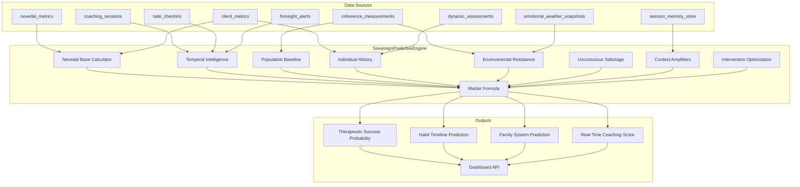

# Nevedal-Enhanced Therapeutic Prediction Engine

## Existing Infrastructure (What We Already Have)

The codebase already provides rich data sources that map directly to the formula components:

- **C_emo formula** in `nevedal_engine.py` (authenticity/awareness/integration via biometrics)
- **Voice biometrics** via `VoiceBiometricExtractor` (pitch, energy, speech_rate, stress_index, warmth_index)
- **Client metrics snapshot** in `client_metrics` table (c_emo, anxiety, stress, engagement, mood_trend, shame_profile, pmb, breakthrough_count)
- **Nevedal time series** in `nevedal_metrics` (per-session c_emo, p_ent, t_tunnel, cee_window)
- **Family coherence** in `bridge_server.py` (group coherence, nate bonds, decoherence, counterfactual)
- **PMB system** (shame_index, legacy_depth, reconsolidation_readiness)
- **Foresight engine** (coherence forecasting, intervention windows, family propagation, accuracy tracking)
- **ODPE engine** (dual-topology signals, recommended inference tiers)
- **Coherence measurements** (4-layer: individual, family, community, cultural)
- **Emotional weather** snapshots (system_coherence, system_volatility, cee_window_open)
- **Assessment engine** (AI-scored assessments with growth_markers, insights)
- **Session memory** (transcripts, biometrics, oscillation profiles per session)
- **Check-in history** (activity patterns, snooze, responsiveness)

## Architecture




## Phase 1: Core Engine Service

### New file: `backend/app/services/sovereign_predictive_engine.py`

Single `SovereignPredictiveEngine` class with the master formula. Each formula sub-component maps to a method that queries real data:

**Nevedal Base** (`calculate_enhanced_nevedal_base`):

- `authenticity` = geometric mean of: latest `c_emo` from `client_metrics`, voice `warmth_index` from `nevedal_metrics`, historical authenticity trend (c_emo slope over 30 days)
- `awareness` = geometric mean of: `engagement` score, pattern recognition (assessment `score` from `dynamic_assessments`), emotional intelligence (c_emo variance stability)
- `integration` = geometric mean of: `homework_completion_rate`, `mood_trend` direction, `breakthrough_count / session_count` ratio
- `resistance` = geometric mean of: `anxiety_level`, `stress_level`, `shame_index` from `shame_profile`, check-in non-responsiveness rate

**Temporal Intelligence** (`calculate_temporal_intelligence`):

- `generational_dna_score` = `legacy_depth` from PMB + family member C_emo correlation from foresight `predict_family_propagation()`
- `habit_timeline_prediction` = session frequency consistency + homework completion trend
- `optimal_timing_windows` = foresight `suggest_intervention_window()` confidence
- `historical_success_patterns` = foresight `get_accuracy_report()` hit rate for this user

**Population Baseline** (`calculate_population_baseline`):

- `community_coherence_average` = coherence layer "community" from `coherence_measurements`
- `demographic_success_rates` = mean `breakthrough_count / session_count` across all clients with similar tier
- `cultural_pattern_alignment` = coherence layer "cultural" score
- `collective_unconscious_influence` = `community_wisdom` convergence_count for relevant topics

**Individual History** (`calculate_individual_history`):

- `emotional_genome_signature` = latest biometrics JSONB from `nevedal_metrics` (stress/warmth composite)
- `micro_expression_authenticity` = voice warmth_index consistency over last 5 sessions
- `vocal_pattern_honesty` = voice stress_index trend (declining = improving honesty)
- `past_therapeutic_success_rate` = `breakthrough_count / session_count` with confidence interval

**Environmental Resistance** (`calculate_environmental_resistance`):

- `family_system_pushback` = family decoherence signals from group coherence
- `community_stress_factors` = community coherence layer inverse
- `socioeconomic_barriers` = session cancellation/no-show rate
- `relationship_dynamic_friction` = emotional weather `system_volatility`

**Unconscious Sabotage** (`calculate_unconscious_sabotage`):

- `hidden_pattern_interference` = `crisis_perception` masking score from PMB
- `trauma_trigger_probability` = `shame_index` * `legacy_depth`
- `self_defeating_behavior_risk` = check-in snooze rate + session dropout pattern
- `therapeutic_resistance_factors` = `reconsolidation_readiness` inverse

**Context Amplifiers** (`calculate_context_amplifiers`):

- `vr_memory_palace_enhancement` = 1.0 (future VR — stub at neutral)
- `real_time_micro_moment_optimization` = ODPE signal quality (LOCKED=1.5, PROMOTED=1.2, TENSION=0.8, NOISE=0.5)
- `quantum_pathway_selection` = helix orchestrator synthesis confidence
- `breakthrough_moment_recreation` = CEE window frequency over last 10 sessions

**Intervention Optimization** (`calculate_intervention_optimization`):

- `little_nate_personalization` = crystal recall_count density for user-scoped crystals
- `tool_ecosystem_efficiency` = active features used / available features ratio
- `therapeutic_modality_match` = assessment category fit score
- `timing_precision_score` = check-in response-within-1h rate

## Phase 2: Habit Prediction System

### New database table: `therapeutic_habit_tracking`

```sql
CREATE TABLE therapeutic_habit_tracking (
    id SERIAL PRIMARY KEY,
    user_id VARCHAR(128) NOT NULL,
    habit_type VARCHAR(100) NOT NULL,
    habit_description TEXT,
    started_at TIMESTAMPTZ NOT NULL DEFAULT NOW(),
    target_days INTEGER DEFAULT 66,
    current_streak INTEGER DEFAULT 0,
    longest_streak INTEGER DEFAULT 0,
    total_completions INTEGER DEFAULT 0,
    total_misses INTEGER DEFAULT 0,
    status VARCHAR(32) DEFAULT 'active',
    predicted_adoption_days INTEGER,
    predicted_crystallization_days INTEGER,
    predicted_maintenance_probability REAL,
    prediction_metadata JSONB DEFAULT '{}',
    last_completion_at TIMESTAMPTZ,
    created_at TIMESTAMPTZ DEFAULT NOW(),
    updated_at TIMESTAMPTZ DEFAULT NOW()
);
```

### New database table: `therapeutic_predictions`

```sql
CREATE TABLE therapeutic_predictions (
    id SERIAL PRIMARY KEY,
    user_id VARCHAR(128) NOT NULL,
    family_id VARCHAR(128),
    prediction_type VARCHAR(50) NOT NULL,
    goal_type VARCHAR(100),
    success_probability REAL NOT NULL,
    confidence_score REAL NOT NULL,
    nevedal_base_score REAL,
    components JSONB NOT NULL,
    key_amplifiers JSONB,
    key_resistances JSONB,
    optimal_intervention_plan JSONB,
    prediction_horizon_days INTEGER,
    actual_outcome REAL,
    accuracy_score REAL,
    created_at TIMESTAMPTZ DEFAULT NOW()
);
```

### Habit prediction methods in the engine:

- `predict_habit_success_timeline()` — uses Nevedal base, session consistency, PMB resistance, check-in patterns
- `predict_habit_crystallization()` — models adoption curve with Nevedal integration score as velocity
- `identify_sabotage_windows()` — cross-references shame_index spikes with predicted timeline

## Phase 3: Family System Prediction

Method `predict_family_effectiveness()` in the engine:

- Sum of Enhanced Nevedal Scores per member
- Family coherence from `coherence_measurements` (family layer)
- Communication pattern health from emotional weather volatility trend
- Nate alliance strength from group coherence "nate contribution" metric
- Divided by: family resistance (decoherence signals), inter-member conflict (C_emo variance), external stress (community layer), sabotage risk (collective shame_index)
- Multiplied by: Nate personalization, session timing optimization, modality match

This leverages all the existing family infrastructure in `bridge_server.py` and `coherence_engine.py`.

## Phase 4: Real-Time Coaching Score

Method `calculate_realtime_coaching_score()`:

- Current Nevedal score (latest `c_emo` from in-memory or recent `nevedal_metrics`)
- Micro-moment receptivity (voice stress_index inverse + warmth_index)
- Optimal timing (foresight intervention window alignment)
- Personalization accuracy (crystal recall density)
- Divided by: current resistance (anxiety + stress), distraction (session pause_ratio), emotional volatility (c_emo variance over last 5 min)
- Context multipliers: breakthrough opportunity (CEE window open = x2.5), family support present (family session = x1.8), high stress (stress > 0.7 = x0.6)

## Phase 5: REST API Router

### New file: `backend/app/routers/predictive_api.py`


| Endpoint                                            | Method   | Purpose                              |
| --------------------------------------------------- | -------- | ------------------------------------ |
| `/api/predictive/therapeutic-probability/{user_id}` | GET      | Full therapeutic success probability |
| `/api/predictive/habit-forecast/{user_id}`          | POST     | Habit formation timeline prediction  |
| `/api/predictive/family-effectiveness/{family_id}`  | GET      | Family system prediction             |
| `/api/predictive/realtime-coaching/{user_id}`       | GET      | Real-time coaching score             |
| `/api/predictive/unified-dashboard/{user_id}`       | GET      | All predictions combined (The Eye)   |
| `/api/predictive/habit-tracking/{user_id}`          | GET/POST | CRUD for habit tracking              |
| `/api/predictive/prediction-accuracy`               | GET      | Accuracy report across predictions   |
| `/api/predictive/health`                            | GET      | Engine health check                  |


Auth: `require_coach` (coaches + admin can view client predictions).

## Phase 6: Dashboard Integration

### New Nevedal Lab sub-tab: "Predictive Intelligence"

Add a new tab to the Nevedal Lab dashboard (`nevedal_lab_predictive.html`) showing:

- **Therapeutic Success Gauge** — 0-100 probability with confidence interval
- **Formula Decomposition** — radar chart showing all 8 components (Nevedal Base, Temporal, Population, Individual, Resistance, Sabotage, Amplifiers, Optimization)
- **Habit Forecasting** — timeline visualization with adoption/crystallization/maintenance milestones
- **Family System Prediction** — family-level effectiveness with per-member contribution
- **Key Resistances / Key Amplifiers** — ranked lists with intervention suggestions
- **Prediction Accuracy** — historical accuracy of past predictions
- **Real-Time Coaching Score** — live coaching effectiveness indicator

## Phase 7: main.py Registration

- Import and instantiate `SovereignPredictiveEngine(db_pool=db_pool, app_state=app_state)`
- Register on `app.state.predictive_engine`
- Add to `_service_checks`
- Include `predictive_api.py` router
- Add to agent status digest

## Key Design Decisions

- **All formula components return values in 0.0-1.0 range** (or 0.01 minimum to prevent division by zero)
- **Geometric means** (exponent 0.25) for multi-factor sub-scores to prevent any single factor from dominating
- **System_Complexity denominator** defaults to 1.0 and increases with number of active goals/family size
- **Normalization** uses sigmoid function to map the raw ratio to 0-100 scale
- **Confidence score** based on data completeness (how many of the input signals have real data vs defaults)
- **Prediction storage** enables accuracy tracking — actual outcomes are backfilled to measure calibration
- **Stub methods** for future capabilities (VR, population-scale) return neutral 1.0 so the formula works now

## Files to Create/Modify


| File                                                  | Action                                                                       |
| ----------------------------------------------------- | ---------------------------------------------------------------------------- |
| `backend/app/services/sovereign_predictive_engine.py` | **Create** — Core engine (all formula logic)                                 |
| `backend/app/routers/predictive_api.py`               | **Create** — REST API (8 endpoints)                                          |
| `backend/migrations/129_predictive_cycle_engine.sql`  | **Exists** — 2 tables (therapeutic_predictions + therapeutic_habit_tracking) |
| `dashboard/nevedal_lab_predictive.html`               | **Create** — Dashboard UI                                                    |
| `backend/app/main.py`                                 | **Modify** — Register engine + router + service check                        |
| `backend/app/services/nevedal_lab_auditor.py`         | **Modify** — Add predictive endpoints to trust checks                        |
| `backend/app/services/trust_enforcer.py`              | **Modify** — Only if separate auditor created                                |


